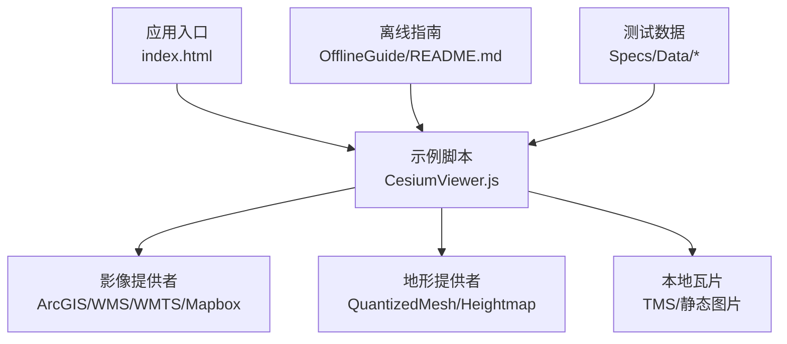
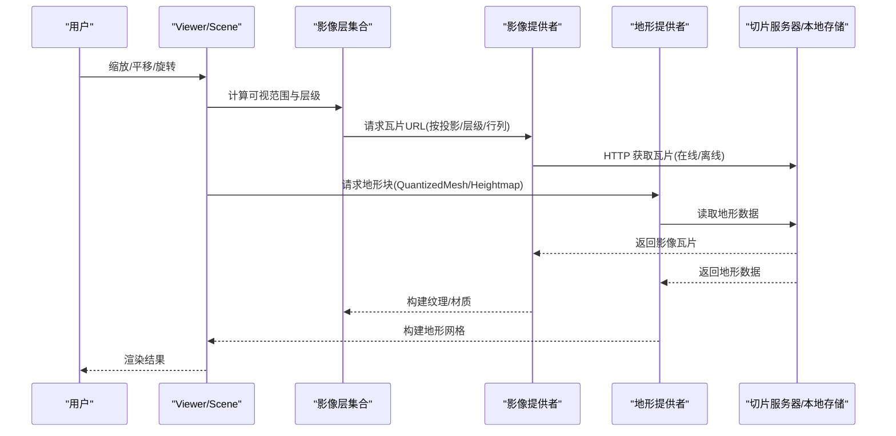
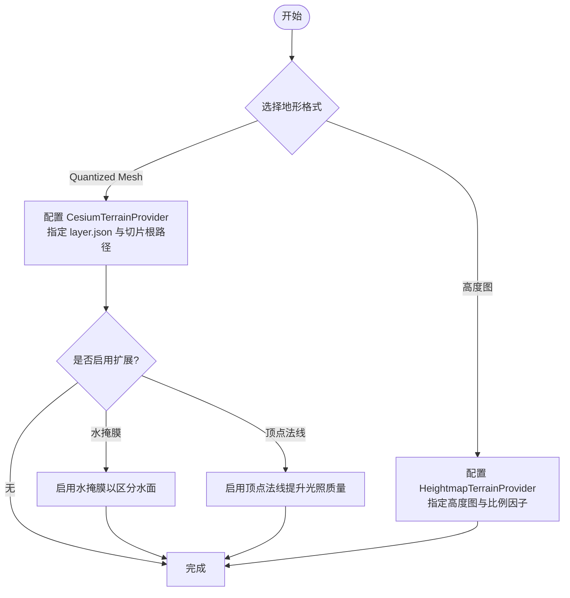
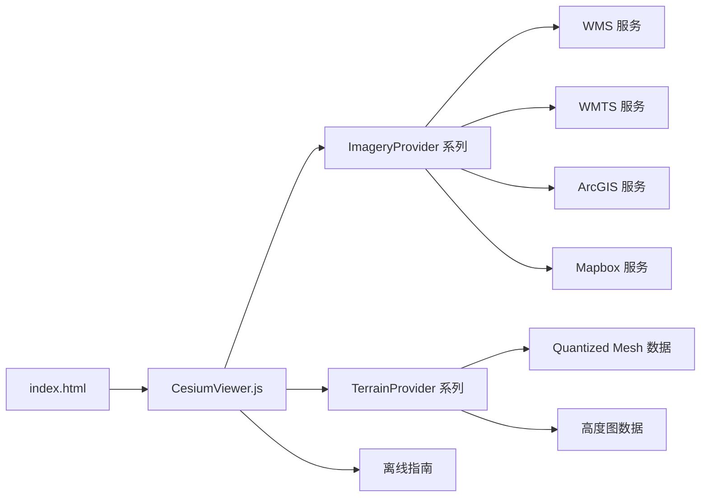

# 影像和地形数据加载

<cite>
**本文引用的文件**   
- [Apps/CesiumViewer/index.html](file://Apps/CesiumViewer/index.html)
- [Apps/CesiumViewer/CesiumViewer.js](file://Apps/CesiumViewer/CesiumViewer.js)
- [Documentation/OfflineGuide/README.md](file://Documentation/OfflineGuide/README.md)
- [Specs/Data/CesiumTerrainTileJson/QuantizedMesh/layer.json](file://Specs/Data/CesiumTerrainTileJson/QuantizedMesh/layer.json)
- [Specs/Data/CesiumTerrainTileJson/Heightmap/layer.json](file://Specs/Data/CesiumTerrainTileJson/Heightmap/layer.json)
- [Specs/Data/CesiumTerrainTileJson/QuantizedMeshWithWaterMask/layer.json](file://Specs/Data/CesiumTerrainTileJson/QuantizedMeshWithWaterMask/layer.json)
- [Specs/Data/CesiumTerrainTileJson/QuantizedMeshWithVertexNormals/layer.json](file://Specs/Data/CesiumTerrainTileJson/QuantizedMeshWithVertexNormals/layer.json)
- [Specs/Data/TMS/SmallArea/tilemapresource.xml](file://Specs/Data/TMS/SmallArea/tilemapresource.xml)
- [Specs/Data/WMS/GetFeatureInfo-GeoJSON.json](file://Specs/Data/WMS/GetFeatureInfo-GeoJSON.json)
</cite>

## 目录
1. [简介](#简介)
2. [项目结构](#项目结构)
3. [核心组件](#核心组件)
4. [架构总览](#架构总览)
5. [详细组件分析](#详细组件分析)
6. [依赖分析](#依赖分析)
7. [性能考虑](#性能考虑)
8. [故障排查指南](#故障排查指南)
9. [结论](#结论)
10. [附录](#附录)

## 简介
本文件面向需要在 CesiumJS 应用中加载影像与地形的开发者，提供从在线服务到本地离线数据的完整示例路径与最佳实践。内容覆盖：
- 在线影像服务：ArcGIS、WMS、WMTS、Mapbox 等
- 本地影像瓦片：TMS、静态图片、Mapbox 离线包
- 地形数据：Quantized Mesh、高度图（Heightmap）、水掩膜、法线贴图、裁剪区域
- 高级功能：多层叠加、透明度控制、时间序列影像展示
- 离线地图准备与使用

## 项目结构
仓库中与影像/地形相关的关键位置：
- 应用入口与示例页面：Apps/CesiumViewer
- 离线指南文档：Documentation/OfflineGuide
- 测试数据与样例配置：Specs/Data（包含 WMS、TMS、Cesium Terrain Tile JSON 等）

图表来源
- [Apps/CesiumViewer/index.html](file://Apps/CesiumViewer/index.html)
- [Apps/CesiumViewer/CesiumViewer.js](file://Apps/CesiumViewer/CesiumViewer.js)
- [Documentation/OfflineGuide/README.md](file://Documentation/OfflineGuide/README.md)
- [Specs/Data/CesiumTerrainTileJson/QuantizedMesh/layer.json](file://Specs/Data/CesiumTerrainTileJson/QuantizedMesh/layer.json)
- [Specs/Data/CesiumTerrainTileJson/Heightmap/layer.json](file://Specs/Data/CesiumTerrainTileJson/Heightmap/layer.json)
- [Specs/Data/TMS/SmallArea/tilemapresource.xml](file://Specs/Data/TMS/SmallArea/tilemapresource.xml)

章节来源
- [Apps/CesiumViewer/index.html](file://Apps/CesiumViewer/index.html)
- [Apps/CesiumViewer/CesiumViewer.js](file://Apps/CesiumViewer/CesiumViewer.js)
- [Documentation/OfflineGuide/README.md](file://Documentation/OfflineGuide/README.md)

## 核心组件
- 影像提供者（ImageryProvider）
  - ArcGisMapServerImageryProvider：ArcGIS 地图服务
  - WebMapServiceImageryProvider：OGC WMS
  - WebMapTileServiceImageryProvider：OGC WMTS
  - UrlTemplateImageryProvider：通用模板 URL（可用于 TMS、自定义切片）
  - MapboxStyleImageryProvider / UrlTemplateImageryProvider：Mapbox 样式或资源
- 地形提供者（TerrainProvider）
  - CesiumTerrainProvider：Quantized Mesh 地形
  - HeightmapTerrainProvider：基于高度图的简单地形
- 图层管理（ImageryLayerCollection）
  - 用于叠加多个影像层、设置透明度、可见性、混合模式等
- 时间序列影像
  - 通过 ImageryProvider 的时间属性与 ImageryLayer 的 time 绑定实现多时相切换

章节来源
- [Apps/CesiumViewer/CesiumViewer.js](file://Apps/CesiumViewer/CesiumViewer.js)

## 架构总览
下图展示了典型“在线+本地”混合场景的数据流：用户交互触发视图变化，渲染管线按需请求影像与地形瓦片，最终合成显示。

图表来源
- [Apps/CesiumViewer/CesiumViewer.js](file://Apps/CesiumViewer/CesiumViewer.js)
- [Specs/Data/CesiumTerrainTileJson/QuantizedMesh/layer.json](file://Specs/Data/CesiumTerrainTileJson/QuantizedMesh/layer.json)
- [Specs/Data/CesiumTerrainTileJson/Heightmap/layer.json](file://Specs/Data/CesiumTerrainTileJson/Heightmap/layer.json)
- [Specs/Data/TMS/SmallArea/tilemapresource.xml](file://Specs/Data/TMS/SmallArea/tilemapresource.xml)

## 详细组件分析

### 在线影像服务示例路径
- ArcGIS
  - 使用 ArcGisMapServerImageryProvider 添加 ArcGIS 在线地图服务
  - 可配置图层过滤、透明背景、版权信息等
  - 参考示例路径：[Apps/CesiumViewer/CesiumViewer.js](file://Apps/CesiumViewer/CesiumViewer.js)
- WMS
  - 使用 WebMapServiceImageryProvider 连接 OGC WMS
  - 支持 GetMap、GetFeatureInfo 等能力；测试数据中包含 GetFeatureInfo 响应样例
  - 参考示例路径：[Apps/CesiumViewer/CesiumViewer.js](file://Apps/CesiumViewer/CesiumViewer.js)
  - 参考测试数据：[Specs/Data/WMS/GetFeatureInfo-GeoJSON.json](file://Specs/Data/WMS/GetFeatureInfo-GeoJSON.json)
- WMTS
  - 使用 WebMapTileServiceImageryProvider 连接 OGC WMTS
  - 支持多种矩阵集与切片方案
  - 参考示例路径：[Apps/CesiumViewer/CesiumViewer.js](file://Apps/CesiumViewer/CesiumViewer.js)
- Mapbox
  - 使用 MapboxStyleImageryProvider 或 UrlTemplateImageryProvider 接入 Mapbox 样式/资源
  - 可结合访问令牌与样式 ID
  - 参考示例路径：[Apps/CesiumViewer/CesiumViewer.js](file://Apps/CesiumViewer/CesiumViewer.js)

章节来源
- [Apps/CesiumViewer/CesiumViewer.js](file://Apps/CesiumViewer/CesiumViewer.js)
- [Specs/Data/WMS/GetFeatureInfo-GeoJSON.json](file://Specs/Data/WMS/GetFeatureInfo-GeoJSON.json)

### 本地影像瓦片示例路径
- TMS（Tile Map Service）
  - 使用 UrlTemplateImageryProvider 指向 tilemapresource.xml 定义的切片服务
  - 参考测试数据：[Specs/Data/TMS/SmallArea/tilemapresource.xml](file://Specs/Data/TMS/SmallArea/tilemapresource.xml)
  - 参考示例路径：[Apps/CesiumViewer/CesiumViewer.js](file://Apps/CesiumViewer/CesiumViewer.js)
- 静态图片作为底图
  - 使用 ImageStaticImageryProvider 将单张图片铺满地球表面
  - 参考示例路径：[Apps/CesiumViewer/CesiumViewer.js](file://Apps/CesiumViewer/CesiumViewer.js)
- Mapbox 离线资源
  - 将 Mapbox 资源下载至本地，使用 UrlTemplateImageryProvider 指向本地路径
  - 参考示例路径：[Apps/CesiumViewer/CesiumViewer.js](file://Apps/CesiumViewer/CesiumViewer.js)

章节来源
- [Apps/CesiumViewer/CesiumViewer.js](file://Apps/CesiumViewer/CesiumViewer.js)
- [Specs/Data/TMS/SmallArea/tilemapresource.xml](file://Specs/Data/TMS/SmallArea/tilemapresource.xml)

### 地形数据加载与配置
- Quantized Mesh 地形
  - 使用 CesiumTerrainProvider 加载符合 Cesium Terrain Tile JSON 规范的 Quantized Mesh 数据
  - 支持可选的水掩膜、顶点法线、元数据可用性扩展
  - 参考测试数据：
    - [Specs/Data/CesiumTerrainTileJson/QuantizedMesh/layer.json](file://Specs/Data/CesiumTerrainTileJson/QuantizedMesh/layer.json)
    - [Specs/Data/CesiumTerrainTileJson/QuantizedMeshWithWaterMask/layer.json](file://Specs/Data/CesiumTerrainTileJson/QuantizedMeshWithWaterMask/layer.json)
    - [Specs/Data/CesiumTerrainTileJson/QuantizedMeshWithVertexNormals/layer.json](file://Specs/Data/CesiumTerrainTileJson/QuantizedMeshWithVertexNormals/layer.json)
  - 参考示例路径：[Apps/CesiumViewer/CesiumViewer.js](file://Apps/CesiumViewer/CesiumViewer.js)
- 高度图（Heightmap）地形
  - 使用 HeightmapTerrainProvider 加载 PNG/JPEG 高度图
  - 参考测试数据：[Specs/Data/CesiumTerrainTileJson/Heightmap/layer.json](file://Specs/Data/CesiumTerrainTileJson/Heightmap/layer.json)
  - 参考示例路径：[Apps/CesiumViewer/CesiumViewer.js](file://Apps/CesiumViewer/CesiumViewer.js)
- 地形裁剪
  - 通过 Region 或 EllipsoidRectangle 限制地形加载范围，减少带宽与内存占用
  - 参考示例路径：[Apps/CesiumViewer/CesiumViewer.js](file://Apps/CesiumViewer/CesiumViewer.js)

图表来源
- [Specs/Data/CesiumTerrainTileJson/QuantizedMesh/layer.json](file://Specs/Data/CesiumTerrainTileJson/QuantizedMesh/layer.json)
- [Specs/Data/CesiumTerrainTileJson/QuantizedMeshWithWaterMask/layer.json](file://Specs/Data/CesiumTerrainTileJson/QuantizedMeshWithWaterMask/layer.json)
- [Specs/Data/CesiumTerrainTileJson/QuantizedMeshWithVertexNormals/layer.json](file://Specs/Data/CesiumTerrainTileJson/QuantizedMeshWithVertexNormals/layer.json)
- [Specs/Data/CesiumTerrainTileJson/Heightmap/layer.json](file://Specs/Data/CesiumTerrainTileJson/Heightmap/layer.json)
- [Apps/CesiumViewer/CesiumViewer.js](file://Apps/CesiumViewer/CesiumViewer.js)

章节来源
- [Apps/CesiumViewer/CesiumViewer.js](file://Apps/CesiumViewer/CesiumViewer.js)
- [Specs/Data/CesiumTerrainTileJson/QuantizedMesh/layer.json](file://Specs/Data/CesiumTerrainTileJson/QuantizedMesh/layer.json)
- [Specs/Data/CesiumTerrainTileJson/Heightmap/layer.json](file://Specs/Data/CesiumTerrainTileJson/Heightmap/layer.json)
- [Specs/Data/CesiumTerrainTileJson/QuantizedMeshWithWaterMask/layer.json](file://Specs/Data/CesiumTerrainTileJson/QuantizedMeshWithWaterMask/layer.json)
- [Specs/Data/CesiumTerrainTileJson/QuantizedMeshWithVertexNormals/layer.json](file://Specs/Data/CesiumTerrainTileJson/QuantizedMeshWithVertexNormals/layer.json)

### 多层影像叠加与透明度控制
- 在 ImageryLayerCollection 中依次添加多个 ImageryLayer
- 通过每个层的 opacity 控制透明度，实现叠图对比、专题叠加
- 可结合 blendMode 调整混合策略（如正常、加色、减色等）
- 参考示例路径：[Apps/CesiumViewer/CesiumViewer.js](file://Apps/CesiumViewer/CesiumViewer.js)

章节来源
- [Apps/CesiumViewer/CesiumViewer.js](file://Apps/CesiumViewer/CesiumViewer.js)

### 时间序列影像展示
- 为 ImageryProvider 设置时间范围与时间戳
- 通过 ImageryLayer 的 time 属性绑定当前播放时间，实现多时相切换
- 常见用法：时间轴控件驱动 time 更新，自动拉取对应时刻瓦片
- 参考示例路径：[Apps/CesiumViewer/CesiumViewer.js](file://Apps/CesiumViewer/CesiumViewer.js)

章节来源
- [Apps/CesiumViewer/CesiumViewer.js](file://Apps/CesiumViewer/CesiumViewer.js)

### 离线地图数据准备与使用
- 离线指南
  - 了解如何配置本地服务器、缓存策略、跨域与安全策略
  - 参考文档：[Documentation/OfflineGuide/README.md](file://Documentation/OfflineGuide/README.md)
- 本地瓦片组织
  - TMS：确保 tilemapresource.xml 与切片目录结构一致
  - 参考测试数据：[Specs/Data/TMS/SmallArea/tilemapresource.xml](file://Specs/Data/TMS/SmallArea/tilemapresource.xml)
- 本地地形
  - 将 Quantized Mesh 或高度图部署到本地服务器，并在 CesiumTerrainProvider 中指向根目录
  - 参考测试数据：
    - [Specs/Data/CesiumTerrainTileJson/QuantizedMesh/layer.json](file://Specs/Data/CesiumTerrainTileJson/QuantizedMesh/layer.json)
    - [Specs/Data/CesiumTerrainTileJson/Heightmap/layer.json](file://Specs/Data/CesiumTerrainTileJson/Heightmap/layer.json)
- 示例集成
  - 在应用入口与示例脚本中替换为本地路径
  - 参考示例路径：
    - [Apps/CesiumViewer/index.html](file://Apps/CesiumViewer/index.html)
    - [Apps/CesiumViewer/CesiumViewer.js](file://Apps/CesiumViewer/CesiumViewer.js)

章节来源
- [Documentation/OfflineGuide/README.md](file://Documentation/OfflineGuide/README.md)
- [Specs/Data/TMS/SmallArea/tilemapresource.xml](file://Specs/Data/TMS/SmallArea/tilemapresource.xml)
- [Specs/Data/CesiumTerrainTileJson/QuantizedMesh/layer.json](file://Specs/Data/CesiumTerrainTileJson/QuantizedMesh/layer.json)
- [Specs/Data/CesiumTerrainTileJson/Heightmap/layer.json](file://Specs/Data/CesiumTerrainTileJson/Heightmap/layer.json)
- [Apps/CesiumViewer/index.html](file://Apps/CesiumViewer/index.html)
- [Apps/CesiumViewer/CesiumViewer.js](file://Apps/CesiumViewer/CesiumViewer.js)

## 依赖分析
- 模块耦合
  - 应用入口 index.html 引入示例脚本 CesiumViewer.js
  - CesiumViewer.js 负责创建 Viewer、添加 ImageryLayer 与 TerrainProvider
  - 测试数据 Specs/Data 提供各类服务的标准配置样例，便于验证与回归
- 外部依赖
  - 在线服务：ArcGIS、WMS/WMTS 服务、Mapbox 服务
  - 本地服务：HTTP 服务器（Nginx/Apache/Node 静态服务等）

图表来源
- [Apps/CesiumViewer/index.html](file://Apps/CesiumViewer/index.html)
- [Apps/CesiumViewer/CesiumViewer.js](file://Apps/CesiumViewer/CesiumViewer.js)
- [Documentation/OfflineGuide/README.md](file://Documentation/OfflineGuide/README.md)

章节来源
- [Apps/CesiumViewer/index.html](file://Apps/CesiumViewer/index.html)
- [Apps/CesiumViewer/CesiumViewer.js](file://Apps/CesiumViewer/CesiumViewer.js)
- [Documentation/OfflineGuide/README.md](file://Documentation/OfflineGuide/README.md)

## 性能考虑
- 合理设置最大屏幕空间误差与最小级别，避免过度加载
- 对大区域地形启用裁剪区域，减少不必要的地形块请求
- 使用合适的影像分辨率与压缩格式，平衡画质与带宽
- 对时间序列影像采用懒加载与缓存策略，避免重复请求
- 在移动端降低并发数与纹理尺寸，提高帧率

## 故障排查指南
- 跨域问题
  - 检查服务端 CORS 配置，确保允许前端域名访问
- 路径与协议
  - 确认本地路径、端口、协议（http/https）正确
- 切片规范
  - TMS 需严格遵循 tilemapresource.xml 与目录命名规则
- 地形格式
  - Quantized Mesh 的 layer.json 必须包含正确的 root、tiles、schema 等信息
- 认证与令牌
  - Mapbox 等服务需要有效的访问令牌与样式 ID

章节来源
- [Documentation/OfflineGuide/README.md](file://Documentation/OfflineGuide/README.md)
- [Specs/Data/TMS/SmallArea/tilemapresource.xml](file://Specs/Data/TMS/SmallArea/tilemapresource.xml)
- [Specs/Data/CesiumTerrainTileJson/QuantizedMesh/layer.json](file://Specs/Data/CesiumTerrainTileJson/QuantizedMesh/layer.json)

## 结论
通过本指南，您可以在 CesiumJS 中灵活加载多种在线与离线影像服务，并高效配置地形数据。借助多层叠加、透明度控制与时间序列展示，可实现丰富的可视化效果。配合离线指南与测试数据，能够快速搭建稳定可靠的地理信息应用。

## 附录
- 常用 API 定位
  - 影像提供者：ArcGisMapServerImageryProvider、WebMapServiceImageryProvider、WebMapTileServiceImageryProvider、UrlTemplateImageryProvider、ImageStaticImageryProvider、MapboxStyleImageryProvider
  - 地形提供者：CesiumTerrainProvider、HeightmapTerrainProvider
  - 图层集合：ImageryLayerCollection
- 关键示例路径
  - 应用入口：[Apps/CesiumViewer/index.html](file://Apps/CesiumViewer/index.html)
  - 示例脚本：[Apps/CesiumViewer/CesiumViewer.js](file://Apps/CesiumViewer/CesiumViewer.js)
  - 离线指南：[Documentation/OfflineGuide/README.md](file://Documentation/OfflineGuide/README.md)
  - 测试数据：
    - [Specs/Data/TMS/SmallArea/tilemapresource.xml](file://Specs/Data/TMS/SmallArea/tilemapresource.xml)
    - [Specs/Data/CesiumTerrainTileJson/QuantizedMesh/layer.json](file://Specs/Data/CesiumTerrainTileJson/QuantizedMesh/layer.json)
    - [Specs/Data/CesiumTerrainTileJson/Heightmap/layer.json](file://Specs/Data/CesiumTerrainTileJson/Heightmap/layer.json)
    - [Specs/Data/CesiumTerrainTileJson/QuantizedMeshWithWaterMask/layer.json](file://Specs/Data/CesiumTerrainTileJson/QuantizedMeshWithWaterMask/layer.json)
    - [Specs/Data/CesiumTerrainTileJson/QuantizedMeshWithVertexNormals/layer.json](file://Specs/Data/CesiumTerrainTileJson/QuantizedMeshWithVertexNormals/layer.json)
    - [Specs/Data/WMS/GetFeatureInfo-GeoJSON.json](file://Specs/Data/WMS/GetFeatureInfo-GeoJSON.json)