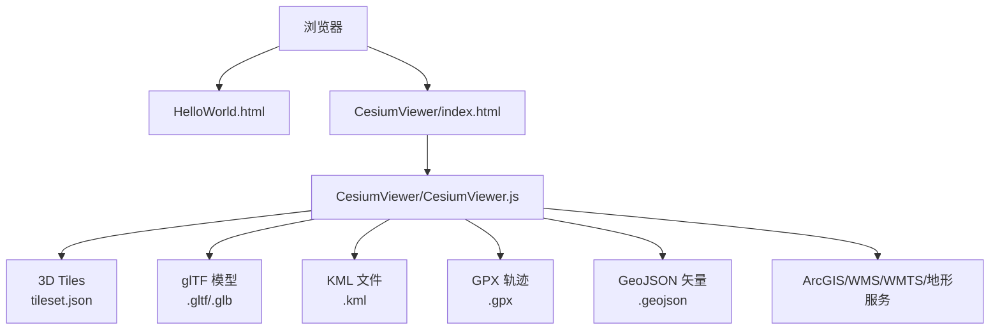
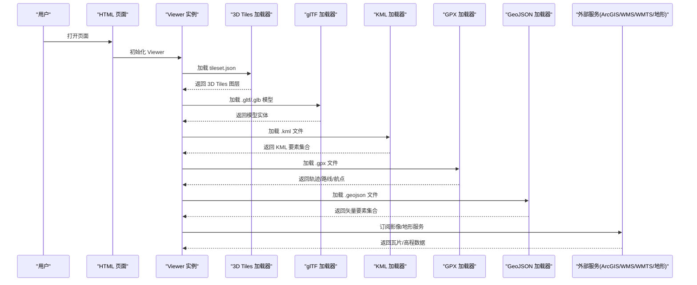
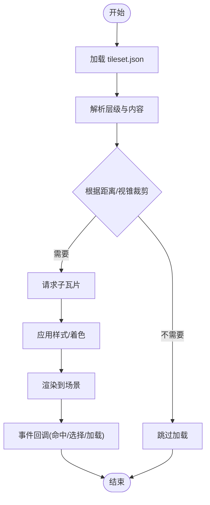
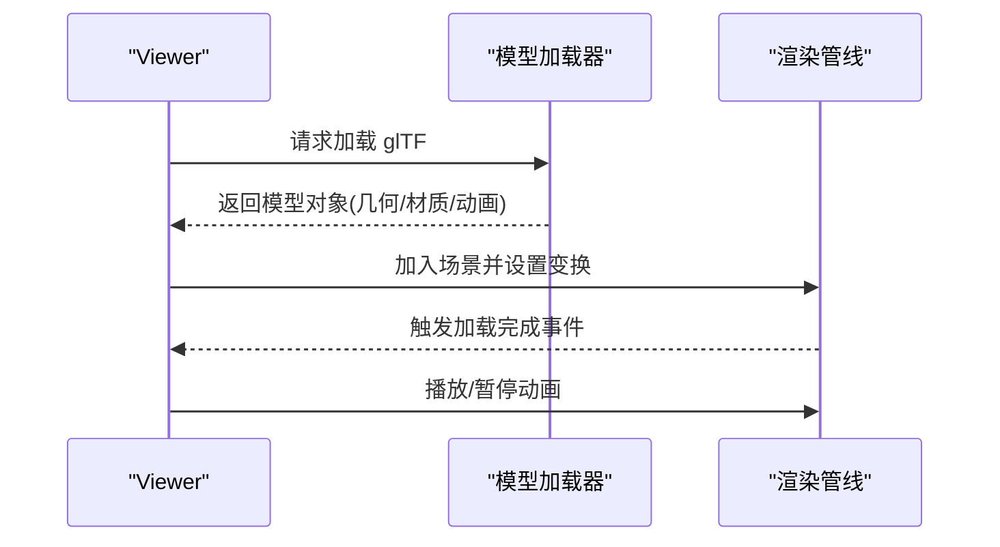
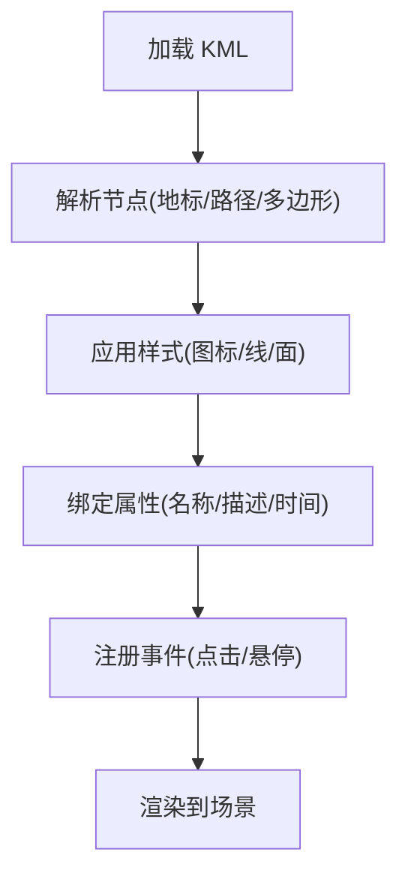
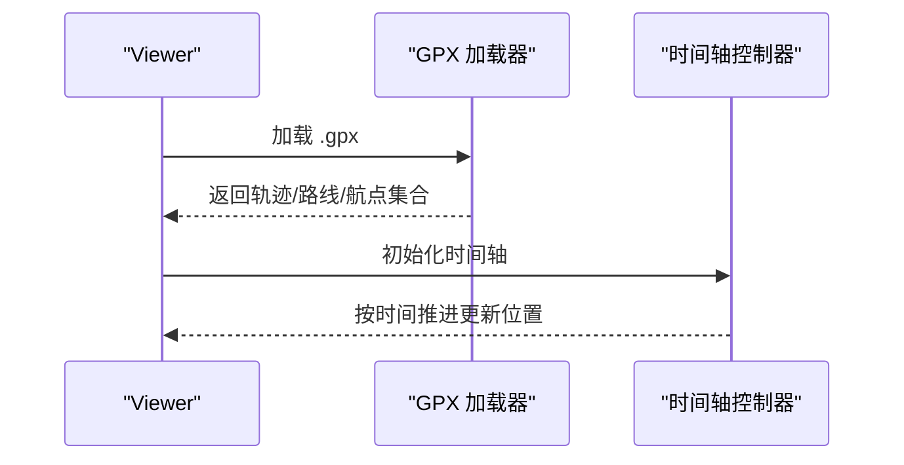
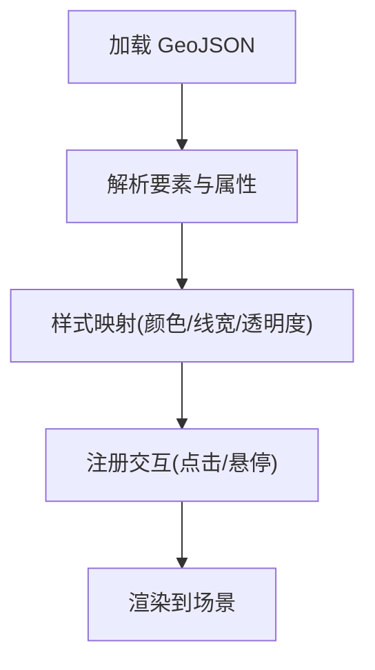
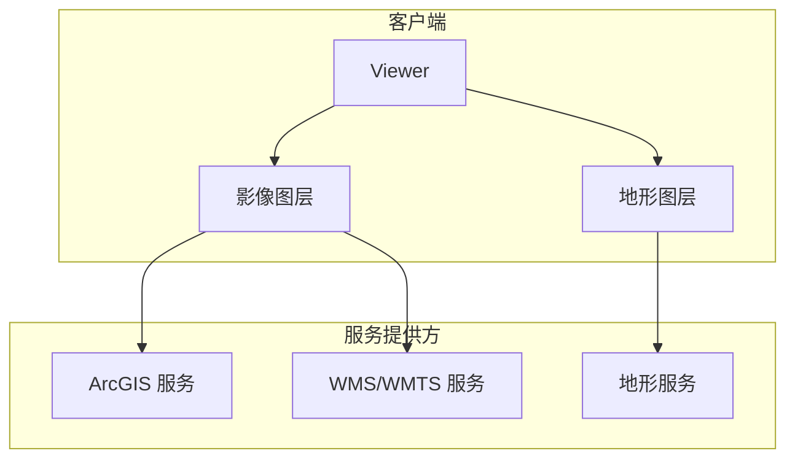
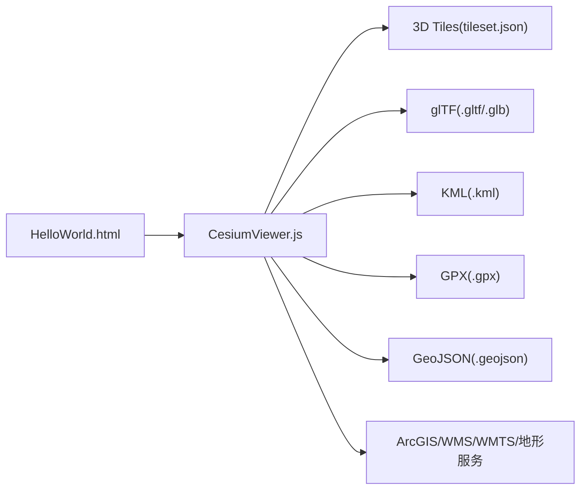

# 数据加载示例

<cite>
**本文引用的文件**   
- [Apps/CesiumViewer/CesiumViewer.js](file://Apps/CesiumViewer/CesiumViewer.js)
- [Apps/HelloWorld.html](file://Apps/HelloWorld.html)
- [Apps/SampleData/gpx/simple.gpx](file://Apps/SampleData/gpx/simple.gpx)
- [Apps/SampleData/kml/facilities/facilities.kml](file://Apps/SampleData/kml/facilities/facilities.kml)
- [Apps/SampleData/MarsPointsOfInterest.geojson](file://Apps/SampleData/MarsPointsOfInterest.geojson)
- [Apps/SampleData/simplestyles.geojson](file://Apps/SampleData/simplestyles.geojson)
- [Apps/SampleData/Cesium3DTiles/Tilesets/Tileset/tileset.json](file://Apps/SampleData/Cesium3DTiles/Tilesets/Tileset/tileset.json)
- [Apps/SampleData/models/CesiumAir/CesiumAir.gltf](file://Apps/SampleData/models/CesiumAir/CesiumAir.gltf)
- [Specs/Data/KML/simple.kml](file://Specs/Data/KML/simple.kml)
- [Specs/Data/GPX/simple.gpx](file://Specs/Data/GPX/simple.gpx)
- [Specs/Data/test.geojson](file://Specs/Data/test.geojson)
</cite>

## 目录
1. [简介](#简介)
2. [项目结构](#项目结构)
3. [核心组件](#核心组件)
4. [架构总览](#架构总览)
5. [详细组件分析](#详细组件分析)
6. [依赖分析](#依赖分析)
7. [性能考虑](#性能考虑)
8. [故障排查指南](#故障排查指南)
9. [结论](#结论)
10. [附录](#附录)

## 简介
本文件面向开发者，提供一套“数据加载示例”的完整集合与说明，覆盖以下常见地理空间数据格式与服务：
- 3D Tiles（分层瓦片、点云、体素等）
- glTF 模型（静态/动画/实例化）
- KML 文件（地标、路径、样式、网络链接）
- GPX 轨迹（航点、路线、轨迹）
- GeoJSON 矢量数据（点、线、面、属性）
- ArcGIS 服务、WMS/WMTS 影像服务、地形服务等真实世界数据源接入

每种格式均给出多种变体示例思路：基础加载、样式定制、属性访问、事件处理等，并附带可运行的入口页面与样例数据路径，便于快速上手。

## 项目结构
仓库包含演示应用、样例数据与测试数据三大部分：
- Apps：演示应用与样例数据
  - CesiumViewer：一个最小化的 Viewer 应用入口
  - HelloWorld.html：最简 HTML 示例
  - SampleData：丰富的样例数据（3D Tiles、glTF、KML、GPX、GeoJSON 等）
- Specs：测试用例与测试数据（含 KML、GPX、GeoJSON、Cesium3DTiles、Terrain 等）

图表来源
- [Apps/HelloWorld.html](file://Apps/HelloWorld.html)
- [Apps/CesiumViewer/CesiumViewer.js](file://Apps/CesiumViewer/CesiumViewer.js)
- [Apps/SampleData/Cesium3DTiles/Tilesets/Tileset/tileset.json](file://Apps/SampleData/Cesium3DTiles/Tilesets/Tileset/tileset.json)
- [Apps/SampleData/models/CesiumAir/CesiumAir.gltf](file://Apps/SampleData/models/CesiumAir/CesiumAir.gltf)
- [Apps/SampleData/kml/facilities/facilities.kml](file://Apps/SampleData/kml/facilities/facilities.kml)
- [Apps/SampleData/gpx/simple.gpx](file://Apps/SampleData/gpx/simple.gpx)
- [Apps/SampleData/MarsPointsOfInterest.geojson](file://Apps/SampleData/MarsPointsOfInterest.geojson)

章节来源
- [Apps/HelloWorld.html](file://Apps/HelloWorld.html)
- [Apps/CesiumViewer/CesiumViewer.js](file://Apps/CesiumViewer/CesiumViewer.js)

## 核心组件
- 视图容器与初始化
  - 通过 HTML 页面引入库资源并创建 Viewer 实例，作为所有数据加载的宿主环境。
- 数据加载器
  - 3D Tiles：基于 tileset.json 描述的分层加载与按需渲染
  - glTF：模型几何、材质、动画与实例化支持
  - KML：地标、路径、多边形、样式表与网络链接
  - GPX：航点、路线、轨迹的时间序列与可视化
  - GeoJSON：点线面要素与属性表的绑定与样式映射
- 服务提供者
  - ArcGIS 地图/要素服务、WMS/WMTS 影像服务、地形服务（Quantized Mesh 等）

章节来源
- [Apps/CesiumViewer/CesiumViewer.js](file://Apps/CesiumViewer/CesiumViewer.js)
- [Apps/HelloWorld.html](file://Apps/HelloWorld.html)

## 架构总览
下图展示从页面到各类数据源的典型加载流程与交互关系。

图表来源
- [Apps/CesiumViewer/CesiumViewer.js](file://Apps/CesiumViewer/CesiumViewer.js)
- [Apps/SampleData/Cesium3DTiles/Tilesets/Tileset/tileset.json](file://Apps/SampleData/Cesium3DTiles/Tilesets/Tileset/tileset.json)
- [Apps/SampleData/models/CesiumAir/CesiumAir.gltf](file://Apps/SampleData/models/CesiumAir/CesiumAir.gltf)
- [Apps/SampleData/kml/facilities/facilities.kml](file://Apps/SampleData/kml/facilities/facilities.kml)
- [Apps/SampleData/gpx/simple.gpx](file://Apps/SampleData/gpx/simple.gpx)
- [Apps/SampleData/MarsPointsOfInterest.geojson](file://Apps/SampleData/MarsPointsOfInterest.geojson)

## 详细组件分析

### 3D Tiles 加载与样式
- 基础加载
  - 使用 tileset.json 作为入口，自动进行层级发现与按需加载。
- 样式定制
  - 通过样式配置控制颜色、透明度、可见性条件表达式等。
- 属性访问
  - 读取 Batch Table / 元数据字段，用于筛选或高亮。
- 事件处理
  - 监听命中、选择、加载完成等事件，实现交互反馈。
- 变体示例
  - 批量模型、实例化模型、点云（RGB/法线/压缩）、复合瓦片、体素等。

图表来源
- [Apps/SampleData/Cesium3DTiles/Tilesets/Tileset/tileset.json](file://Apps/SampleData/Cesium3DTiles/Tilesets/Tileset/tileset.json)

章节来源
- [Apps/SampleData/Cesium3DTiles/Tilesets/Tileset/tileset.json](file://Apps/SampleData/Cesium3DTiles/Tilesets/Tileset/tileset.json)

### glTF 模型加载与动画
- 基础加载
  - 直接加载 .gltf 或 .glb，自动解析几何、材质、纹理与动画。
- 样式定制
  - 通过材质参数、贴图替换、不透明度控制外观。
- 属性访问
  - 读取节点名称、动画片段、材质属性等。
- 事件处理
  - 监听模型加载完成、动画播放状态变化等。
- 变体示例
  - 未光照模型、Draco 压缩、KTX2 纹理、实例化、带版权信息等。

图表来源
- [Apps/SampleData/models/CesiumAir/CesiumAir.gltf](file://Apps/SampleData/models/CesiumAir/CesiumAir.gltf)

章节来源
- [Apps/SampleData/models/CesiumAir/CesiumAir.gltf](file://Apps/SampleData/models/CesiumAir/CesiumAir.gltf)

### KML 文件加载与样式
- 基础加载
  - 加载 .kml 文件，解析地标、路径、多边形、样式表与网络链接。
- 样式定制
  - 自定义图标、线条宽度、填充色、透明度等。
- 属性访问
  - 读取扩展属性与描述信息。
- 事件处理
  - 点击弹出详情、切换可见性等。
- 变体示例
  - 简单地标、无图标样式、外部样式引用、网络链接刷新等。

图表来源
- [Apps/SampleData/kml/facilities/facilities.kml](file://Apps/SampleData/kml/facilities/facilities.kml)
- [Specs/Data/KML/simple.kml](file://Specs/Data/KML/simple.kml)

章节来源
- [Apps/SampleData/kml/facilities/facilities.kml](file://Apps/SampleData/kml/facilities/facilities.kml)
- [Specs/Data/KML/simple.kml](file://Specs/Data/KML/simple.kml)

### GPX 轨迹加载与时间轴
- 基础加载
  - 解析航点(wpt)、路线(rte)、轨迹(trk)，支持时间戳与海拔。
- 样式定制
  - 轨迹线宽/颜色、航点标记大小/形状。
- 属性访问
  - 读取速度、高度、时间等属性。
- 事件处理
  - 播放/暂停、跳转时间点、动态更新位置。
- 变体示例
  - 简单轨迹、复杂轨迹、路线与航点混合。

图表来源
- [Apps/SampleData/gpx/simple.gpx](file://Apps/SampleData/gpx/simple.gpx)
- [Specs/Data/GPX/simple.gpx](file://Specs/Data/GPX/simple.gpx)

章节来源
- [Apps/SampleData/gpx/simple.gpx](file://Apps/SampleData/gpx/simple.gpx)
- [Specs/Data/GPX/simple.gpx](file://Specs/Data/GPX/simple.gpx)

### GeoJSON 矢量数据加载与样式
- 基础加载
  - 加载 .geojson，解析点、线、面及属性表。
- 样式定制
  - 按属性值映射颜色、线宽、填充透明度等。
- 属性访问
  - 遍历 features.properties，用于筛选与弹窗。
- 事件处理
  - 点击要素高亮、过滤显示、导出属性等。
- 变体示例
  - 简单样式、火星兴趣点、复杂多边形等。

图表来源
- [Apps/SampleData/MarsPointsOfInterest.geojson](file://Apps/SampleData/MarsPointsOfInterest.geojson)
- [Apps/SampleData/simplestyles.geojson](file://Apps/SampleData/simplestyles.geojson)
- [Specs/Data/test.geojson](file://Specs/Data/test.geojson)

章节来源
- [Apps/SampleData/MarsPointsOfInterest.geojson](file://Apps/SampleData/MarsPointsOfInterest.geojson)
- [Apps/SampleData/simplestyles.geojson](file://Apps/SampleData/simplestyles.geojson)
- [Specs/Data/test.geojson](file://Specs/Data/test.geojson)

### 真实世界数据源接入
- ArcGIS 服务
  - 地图服务：以影像/底图形式叠加
  - 要素服务：查询、过滤、高亮
- WMS/WMTS 影像服务
  - 指定图层名、投影、版本、样式；支持 GetFeatureInfo 获取属性
- 地形服务
  - Quantized Mesh 或自定义地形服务，设置缩放级别与缓存策略

[本节为概念性说明，无需图表来源]

## 依赖分析
- 页面到应用的依赖
  - HTML 页面负责引入库资源与创建 Viewer
  - CesiumViewer.js 组织数据加载逻辑与交互
- 数据到渲染的依赖
  - 各数据加载器将数据转换为场景中的实体/图层
  - 渲染管线统一处理绘制、事件与动画

图表来源
- [Apps/HelloWorld.html](file://Apps/HelloWorld.html)
- [Apps/CesiumViewer/CesiumViewer.js](file://Apps/CesiumViewer/CesiumViewer.js)
- [Apps/SampleData/Cesium3DTiles/Tilesets/Tileset/tileset.json](file://Apps/SampleData/Cesium3DTiles/Tilesets/Tileset/tileset.json)
- [Apps/SampleData/models/CesiumAir/CesiumAir.gltf](file://Apps/SampleData/models/CesiumAir/CesiumAir.gltf)
- [Apps/SampleData/kml/facilities/facilities.kml](file://Apps/SampleData/kml/facilities/facilities.kml)
- [Apps/SampleData/gpx/simple.gpx](file://Apps/SampleData/gpx/simple.gpx)
- [Apps/SampleData/MarsPointsOfInterest.geojson](file://Apps/SampleData/MarsPointsOfInterest.geojson)

章节来源
- [Apps/HelloWorld.html](file://Apps/HelloWorld.html)
- [Apps/CesiumViewer/CesiumViewer.js](file://Apps/CesiumViewer/CesiumViewer.js)

## 性能考虑
- 3D Tiles
  - 合理设置几何误差与可视范围，利用隐式瓦片减少请求
  - 对点云启用压缩与量化，降低带宽与内存占用
- glTF
  - 优先使用 Draco 压缩与 KTX2 纹理，减少体积
  - 大场景下采用实例化与批渲染
- KML/GPX/GeoJSON
  - 大数据集建议分块加载与分页渲染
  - 使用样式表达式避免频繁重绘
- 服务
  - 开启瓦片缓存与并发限制，避免雪崩请求
  - 地形服务选择合适的分辨率与缓存策略

[本节为通用指导，无需章节来源]

## 故障排查指南
- 常见问题
  - 跨域问题：确保服务端允许跨域访问（CORS）
  - 资源路径错误：检查相对/绝对路径与服务端部署一致性
  - 样式不生效：确认样式字段与数据属性匹配
  - 事件无响应：检查是否已正确注册事件监听器
- 定位方法
  - 在浏览器控制台查看网络请求与错误日志
  - 逐步注释加载逻辑，缩小问题范围
  - 使用最小样例数据验证加载链路

[本节为通用指导，无需章节来源]

## 结论
通过本示例集合，开发者可以快速掌握 3D Tiles、glTF、KML、GPX、GeoJSON 以及主流地理信息服务的加载与使用方法。结合样式定制、属性访问与事件处理，能够构建出高性能、可交互的三维地理信息系统。

[本节为总结性内容，无需章节来源]

## 附录
- 快速入口
  - 最简 HTML 示例：[HelloWorld.html](file://Apps/HelloWorld.html)
  - 示例 Viewer 应用：[CesiumViewer/CesiumViewer.js](file://Apps/CesiumViewer/CesiumViewer.js)
- 样例数据路径
  - 3D Tiles：[tileset.json](file://Apps/SampleData/Cesium3DTiles/Tilesets/Tileset/tileset.json)
  - glTF：[CesiumAir.gltf](file://Apps/SampleData/models/CesiumAir/CesiumAir.gltf)
  - KML：[facilities.kml](file://Apps/SampleData/kml/facilities/facilities.kml)
  - GPX：[simple.gpx](file://Apps/SampleData/gpx/simple.gpx)
  - GeoJSON：[MarsPointsOfInterest.geojson](file://Apps/SampleData/MarsPointsOfInterest.geojson)