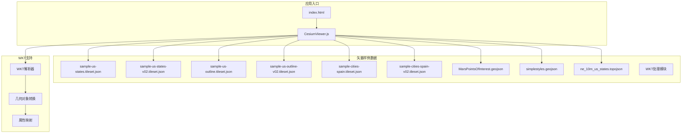
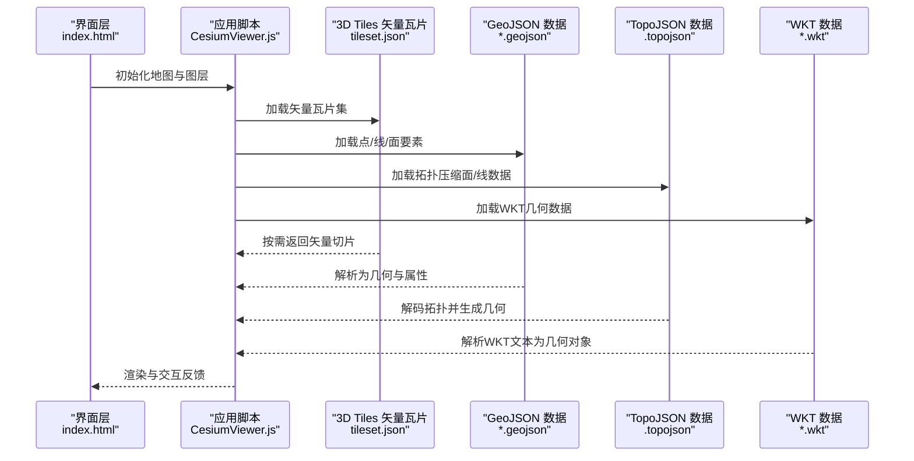
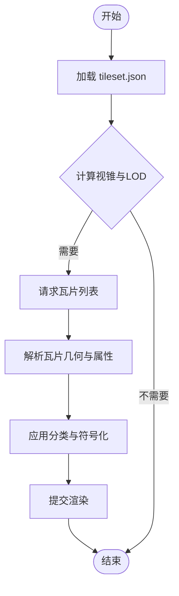
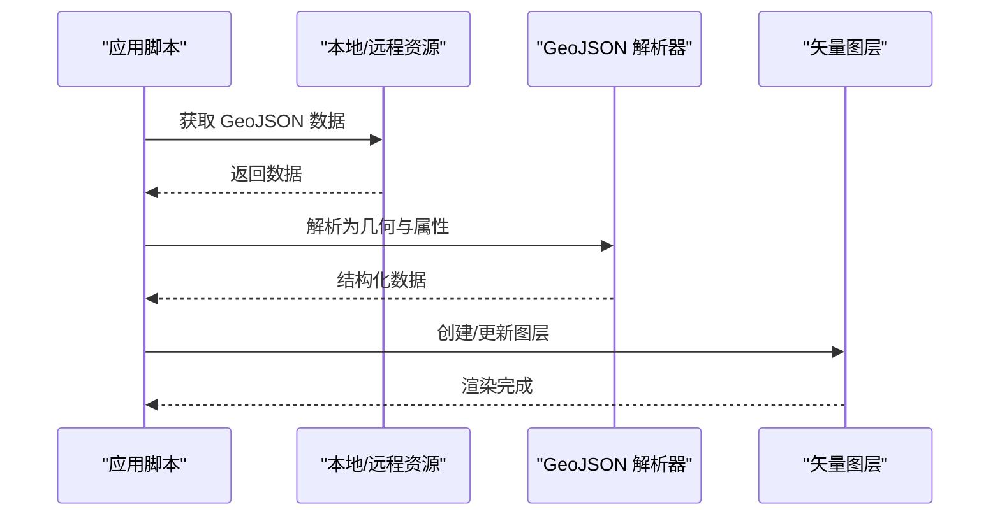
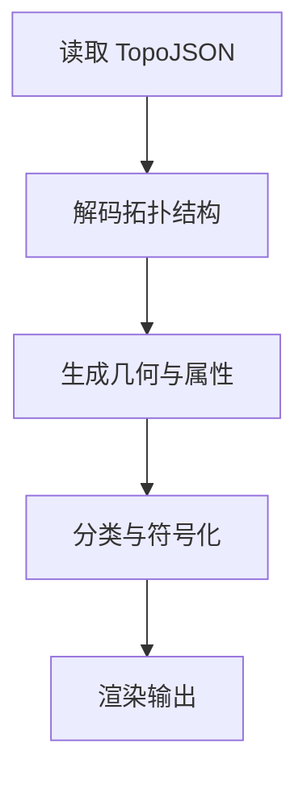
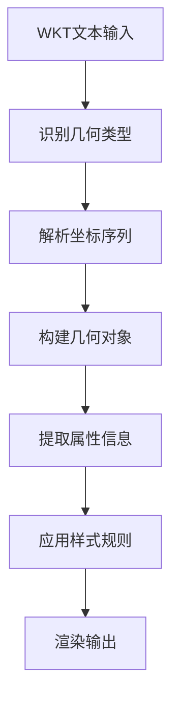
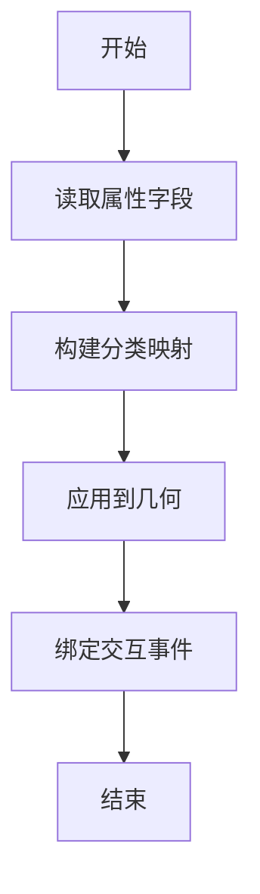
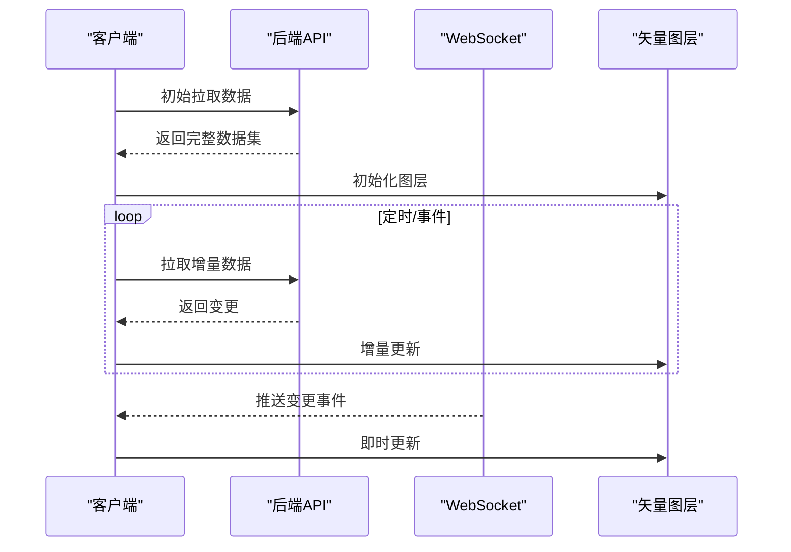
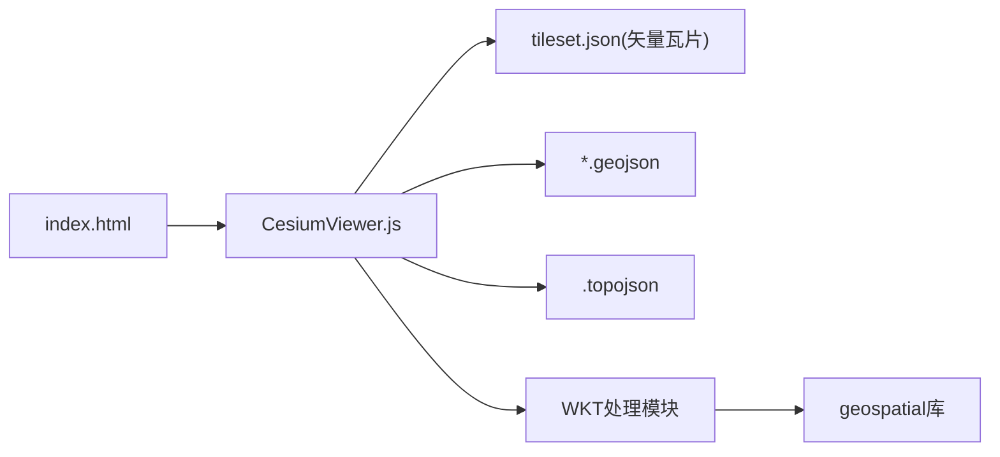

# 矢量数据加载

<cite>
**本文引用的文件**   
- [Apps/SampleData/vector/sample-us-states.tileset.json](file://Apps/SampleData/vector/sample-us-states.tileset.json)
- [Apps/SampleData/vector/sample-us-states-v02.tileset.json](file://Apps/SampleData/vector/sample-us-states-v02.tileset.json)
- [Apps/SampleData/vector/sample-us-outline.tileset.json](file://Apps/SampleData/vector/sample-us-outline-v02.tileset.json)
- [Apps/SampleData/vector/sample-us-outline-v02.tileset.json](file://Apps/SampleData/vector/sample-us-outline-v02.tileset.json)
- [Apps/SampleData/vector/sample-cities-spain.tileset.json](file://Apps/SampleData/vector/sample-cities-spain.tileset.json)
- [Apps/SampleData/vector/sample-cities-spain-v02.tileset.json](file://Apps/SampleData/vector/sample-cities-spain-v02.tileset.json)
- [Apps/SampleData/MarsPointsOfInterest.geojson](file://Apps/SampleData/MarsPointsOfInterest.geojson)
- [Apps/SampleData/simplestyles.geojson](file://Apps/SampleData/simplestyles.geojson)
- [Apps/SampleData/ne_10m_us_states.topojson](file://Apps/SampleData/ne_10m_us_states.topojson)
- [Apps/CesiumViewer/CesiumViewer.js](file://Apps/CesiumViewer/CesiumViewer.js)
- [Apps/CesiumViewer/index.html](file://Apps/CesiumViewer/index.html)
- [cesiumrust/domain/vector/src/lib.rs](file://cesiumrust/domain/vector/src/lib.rs)
- [cesiumrust/domain/geospatial/src/wkt.rs](file://cesiumrust/domain/geospatial/src/wkt.rs)
</cite>

## 更新摘要
**所做更改**   
- 新增WKT（Well-Known Text）格式支持章节，详细说明WKT格式的解析与处理功能
- 更新矢量数据源部分，增加WKT作为新的数据格式支持
- 增强几何数据处理流程，包含WKT到内部几何对象的转换过程
- 补充WKT格式在属性表处理和分类渲染中的应用示例

## 目录
1. [简介](#简介)
2. [项目结构](#项目结构)
3. [核心组件](#核心组件)
4. [架构总览](#架构总览)
5. [详细组件分析](#详细组件分析)
6. [依赖关系分析](#依赖关系分析)
7. [性能考虑](#性能考虑)
8. [故障排查指南](#故障排查指南)
9. [结论](#结论)
10. [附录](#附录)

## 简介
本文件围绕"矢量数据加载"的目标，提供一套完整的示例集合与最佳实践说明。内容覆盖：
- 加载 GeoJSON、TopoJSON、WKT等常见矢量格式
- 点、线、面要素的渲染与样式定制
- 属性表数据处理、分类渲染与符号化配置
- 与后端数据库的连接方法与实时数据更新机制
- 大数据量下的渲染优化策略
- 与 3D Tiles 矢量瓦片的集成使用方法

为便于理解，文档同时给出基于仓库中已有样例数据的参考路径与流程图示，帮助读者快速上手并扩展至实际业务场景。

## 项目结构
仓库中与矢量数据相关的样例主要位于 Apps/SampleData 下，包括：
- vector 目录：3D Tiles 矢量瓦片 tileset.json 清单（含 v02 版本）
- GeoJSON/TopoJSON/WKT 样例数据：MarsPointsOfInterest.geojson、simplestyles.geojson、ne_10m_us_states.topojson
- CesiumViewer 应用入口：index.html 与 CesiumViewer.js
- WKT处理模块：cesiumrust/domain/geospatial/src/wkt.rs

图示来源
- [Apps/CesiumViewer/index.html](file://Apps/CesiumViewer/index.html)
- [Apps/CesiumViewer/CesiumViewer.js](file://Apps/CesiumViewer/CesiumViewer.js)
- [cesiumrust/domain/geospatial/src/wkt.rs](file://cesiumrust/domain/geospatial/src/wkt.rs)

章节来源
- [Apps/CesiumViewer/index.html](file://Apps/CesiumViewer/index.html)
- [Apps/CesiumViewer/CesiumViewer.js](file://Apps/CesiumViewer/CesiumViewer.js)
- [cesiumrust/domain/geospatial/src/wkt.rs](file://cesiumrust/domain/geospatial/src/wkt.rs)

## 核心组件
- 矢量数据源
  - 3D Tiles 矢量瓦片：通过 tileset.json 描述矢量几何与层级，支持按视锥裁剪与按需加载
  - GeoJSON：适合中小规模点、线、面数据，可直接在客户端解析与渲染
  - TopoJSON：面向大规模面/线数据的拓扑压缩格式，可显著降低传输体积
  - **新增** WKT（Well-Known Text）：文本格式的几何描述，支持标准OGC规范，易于人类阅读和编辑
- 渲染与样式
  - 分类渲染：依据属性字段进行颜色、线宽、透明度等差异化显示
  - 符号化配置：统一维护样式规则，支持动态切换主题或条件样式
- 属性表处理
  - 读取要素属性，构建查询、筛选、聚合逻辑
  - 将属性绑定到可视化层，实现交互与标注
- 实时数据更新
  - 定时轮询或事件驱动拉取增量数据
  - 对已加载数据进行增删改，保持视图一致
- 大数据优化
  - 使用 3D Tiles 矢量瓦片进行分块与 LOD 控制
  - 合理设置采样率、合并同类要素、减少绘制批次
  - 启用必要的压缩与缓存策略

章节来源
- [Apps/SampleData/vector/sample-us-states.tileset.json](file://Apps/SampleData/vector/sample-us-states.tileset.json)
- [Apps/SampleData/vector/sample-us-states-v02.tileset.json](file://Apps/SampleData/vector/sample-us-states-v02.tileset.json)
- [Apps/SampleData/vector/sample-us-outline.tileset.json](file://Apps/SampleData/vector/sample-us-outline-v02.tileset.json)
- [Apps/SampleData/vector/sample-us-outline-v02.tileset.json](file://Apps/SampleData/vector/sample-us-outline-v02.tileset.json)
- [Apps/SampleData/vector/sample-cities-spain.tileset.json](file://Apps/SampleData/vector/sample-cities-spain.tileset.json)
- [Apps/SampleData/vector/sample-cities-spain-v02.tileset.json](file://Apps/SampleData/vector/sample-cities-spain-v02.tileset.json)
- [Apps/SampleData/MarsPointsOfInterest.geojson](file://Apps/SampleData/MarsPointsOfInterest.geojson)
- [Apps/SampleData/simplestyles.geojson](file://Apps/SampleData/simplestyles.geojson)
- [Apps/SampleData/ne_10m_us_states.topojson](file://Apps/SampleData/ne_10m_us_states.topojson)
- [cesiumrust/domain/geospatial/src/wkt.rs](file://cesiumrust/domain/geospatial/src/wkt.rs)

## 架构总览
下图展示从应用入口到各类矢量数据源的调用关系，以及 3D Tiles 矢量瓦片和WKT处理在大数据场景中的优势。

图示来源
- [Apps/CesiumViewer/index.html](file://Apps/CesiumViewer/index.html)
- [Apps/CesiumViewer/CesiumViewer.js](file://Apps/CesiumViewer/CesiumViewer.js)
- [cesiumrust/domain/geospatial/src/wkt.rs](file://cesiumrust/domain/geospatial/src/wkt.rs)

## 详细组件分析

### 3D Tiles 矢量瓦片集成
- 用途：面向海量矢量数据的分块、LOD 与视锥裁剪，显著提升渲染性能
- 关键文件：vector 目录下的多个 tileset.json（含 v02 版本），用于定义瓦片结构与内容
- 典型流程：
  - 应用启动时加载 tileset.json
  - 根据相机位置与缩放级别请求相应瓦片
  - 解析瓦片内的矢量几何与属性，执行分类与符号化
  - 结合交互实现高亮、查询与标注

图示来源
- [Apps/SampleData/vector/sample-us-states.tileset.json](file://Apps/SampleData/vector/sample-us-states.tileset.json)
- [Apps/SampleData/vector/sample-us-states-v02.tileset.json](file://Apps/SampleData/vector/sample-us-states-v02.tileset.json)
- [Apps/SampleData/vector/sample-us-outline.tileset.json](file://Apps/SampleData/vector/sample-us-outline-v02.tileset.json)
- [Apps/SampleData/vector/sample-cities-spain-v02.tileset.json](file://Apps/SampleData/vector/sample-cities-spain-v02.tileset.json)

章节来源
- [Apps/SampleData/vector/sample-us-states.tileset.json](file://Apps/SampleData/vector/sample-us-states.tileset.json)
- [Apps/SampleData/vector/sample-us-states-v02.tileset.json](file://Apps/SampleData/vector/sample-us-states-v02.tileset.json)
- [Apps/SampleData/vector/sample-us-outline.tileset.json](file://Apps/SampleData/vector/sample-us-outline-v02.tileset.json)
- [Apps/SampleData/vector/sample-us-outline-v02.tileset.json](file://Apps/SampleData/vector/sample-us-outline-v02.tileset.json)
- [Apps/SampleData/vector/sample-cities-spain.tileset.json](file://Apps/SampleData/vector/sample-cities-spain.tileset.json)
- [Apps/SampleData/vector/sample-cities-spain-v02.tileset.json](file://Apps/SampleData/vector/sample-cities-spain-v02.tileset.json)

### GeoJSON 加载与样式定制
- 适用场景：中小规模点、线、面数据；开发调试与演示
- 样例数据：
  - MarsPointsOfInterest.geojson：点要素样例
  - simplestyles.geojson：包含基础样式信息的样例
- 典型流程：
  - 读取 GeoJSON 文本或对象
  - 解析为几何与属性表
  - 根据属性进行分类渲染与符号化
  - 绑定交互（点击、悬停、查询）

图示来源
- [Apps/SampleData/MarsPointsOfInterest.geojson](file://Apps/SampleData/MarsPointsOfInterest.geojson)
- [Apps/SampleData/simplestyles.geojson](file://Apps/SampleData/simplestyles.geojson)

章节来源
- [Apps/SampleData/MarsPointsOfInterest.geojson](file://Apps/SampleData/MarsPointsOfInterest.geojson)
- [Apps/SampleData/simplestyles.geojson](file://Apps/SampleData/simplestyles.geojson)

### TopoJSON 加载与拓扑还原
- 适用场景：大规模面/线数据，利用拓扑共享边减少冗余
- 样例数据：ne_10m_us_states.topojson
- 典型流程：
  - 读取 TopoJSON 数据
  - 解码拓扑信息，重建几何
  - 与 GeoJSON 类似的分类与符号化流程

图示来源
- [Apps/SampleData/ne_10m_us_states.topojson](file://Apps/SampleData/ne_10m_us_states.topojson)

章节来源
- [Apps/SampleData/ne_10m_us_states.topojson](file://Apps/SampleData/ne_10m_us_states.topojson)

### WKT（Well-Known Text）格式处理
- **新增功能**：支持OGC标准的WKT格式解析与处理
- 适用场景：
  - 数据库直接导出的几何数据
  - GIS软件间的数据交换
  - 文本格式的几何描述需求
- 核心特性：
  - 支持POINT、LINESTRING、POLYGON、MULTIPOINT、MULTILINESTRING、MULTIPOLYGON等几何类型
  - 支持3D坐标（Z值）和M值（测量值）
  - 符合OGC Simple Features Access规范
- 处理流程：
  - 读取WKT文本字符串
  - 解析几何类型和坐标序列
  - 转换为内部几何对象表示
  - 与现有渲染管线集成

**章节来源**
- [cesiumrust/domain/geospatial/src/wkt.rs](file://cesiumrust/domain/geospatial/src/wkt.rs)

### 属性表数据处理与分类渲染
- 目标：将要素属性转化为可视化的分类规则与交互能力
- 步骤建议：
  - 提取关键字段（如类型、等级、数值范围）
  - 建立映射表（值到样式）
  - 在渲染前预处理，避免每帧重复计算
  - 支持动态切换主题或条件样式

[此图为概念性流程，不直接映射具体源码文件]

### 与后端数据库连接与实时数据更新
- 连接方法：
  - 通过 HTTP/HTTPS 接口访问后端服务，返回 GeoJSON、WKT 或自定义 JSON
  - 使用 WebSocket 接收增量推送
- 更新机制：
  - 定时轮询对比差异，仅更新变更要素
  - 事件驱动模式：服务端推送新增、删除、修改消息
  - 对已加载数据进行原地更新，避免全量重绘

[此图为概念性流程，不直接映射具体源码文件]

### 大数据量渲染优化策略
- 优先使用 3D Tiles 矢量瓦片进行分块与按需加载
- 合理设置采样率与简化参数，平衡精度与性能
- 合并同类要素，减少绘制批次
- 启用纹理与几何压缩，降低网络与内存占用
- 使用离屏处理与缓存，避免重复计算

[本节为通用指导，不直接分析具体文件]

## 依赖关系分析
- 应用入口依赖：
  - index.html 引入 CesiumViewer.js
  - CesiumViewer.js 负责加载与渲染各类矢量数据
- 数据依赖：
  - 3D Tiles 矢量瓦片由 tileset.json 描述
  - GeoJSON/TopoJSON/WKT 作为静态样例数据供演示与测试
- **新增依赖**：WKT处理模块依赖geospatial库的几何处理能力

图示来源
- [Apps/CesiumViewer/index.html](file://Apps/CesiumViewer/index.html)
- [Apps/CesiumViewer/CesiumViewer.js](file://Apps/CesiumViewer/CesiumViewer.js)
- [cesiumrust/domain/geospatial/src/wkt.rs](file://cesiumrust/domain/geospatial/src/wkt.rs)

章节来源
- [Apps/CesiumViewer/index.html](file://Apps/CesiumViewer/index.html)
- [Apps/CesiumViewer/CesiumViewer.js](file://Apps/CesiumViewer/CesiumViewer.js)
- [cesiumrust/domain/geospatial/src/wkt.rs](file://cesiumrust/domain/geospatial/src/wkt.rs)

## 性能考虑
- 数据层面：
  - 使用 TopoJSON 减少冗余边
  - 使用 3D Tiles 矢量瓦片进行分块与 LOD
  - **新增** WKT文本解析采用流式处理，避免大文件内存溢出
- 渲染层面：
  - 批量合并与减少状态切换
  - 合理设置透明度与深度测试
- 网络层面：
  - 启用压缩与缓存
  - 按需加载与预取策略
- 交互层面：
  - 延迟高开销操作（如复杂查询）
  - 使用节流与防抖

[本节为通用指导，不直接分析具体文件]

## 故障排查指南
- 常见问题
  - 瓦片加载失败：检查 tileset.json 路径与跨域策略
  - GeoJSON 解析错误：确认数据结构符合规范
  - TopoJSON 解码异常：检查拓扑完整性与坐标系
  - **新增** WKT解析错误：验证WKT语法是否符合OGC标准
  - 实时更新不同步：核对增量数据格式与时间戳
- 定位方法
  - 打开浏览器开发者工具，查看网络请求与控制台日志
  - 针对矢量数据，打印要素数量与属性字段，验证分类映射
  - 对于 3D Tiles，观察瓦片请求与几何大小分布
  - **新增** 对于WKT数据，检查文本编码和特殊字符处理

[本节为通用指导，不直接分析具体文件]

## 结论
通过本示例集合与流程说明，读者可以：
- 快速上手 GeoJSON、TopoJSON、WKT 与 3D Tiles 矢量瓦片的加载与渲染
- 掌握属性表数据处理、分类渲染与符号化配置的基本方法
- 设计稳定的后端连接与实时数据更新机制
- 在大体量数据场景下采用合适的优化策略，保障流畅体验
- **新增** 充分利用WKT格式的标准化优势，实现跨系统数据互操作性

[本节为总结性内容，不直接分析具体文件]

## 附录
- 样例数据路径参考
  - 3D Tiles 矢量瓦片：Apps/SampleData/vector/*.tileset.json
  - GeoJSON：Apps/SampleData/MarsPointsOfInterest.geojson、Apps/SampleData/simplestyles.geojson
  - TopoJSON：Apps/SampleData/ne_10m_us_states.topojson
  - **新增** WKT：可通过数据库导出或GIS软件生成的.wkt文件
- 应用入口参考
  - Apps/CesiumViewer/index.html
  - Apps/CesiumViewer/CesiumViewer.js
- **新增** WKT格式参考
  - OGC Simple Features Access规范
  - 常见WKT语法示例：POINT(0 0)、LINESTRING(0 0,1 1)、POLYGON((0 0,1 0,1 1,0 1,0 0))

[本节为索引性内容，不直接分析具体文件]