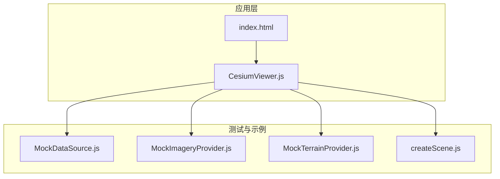
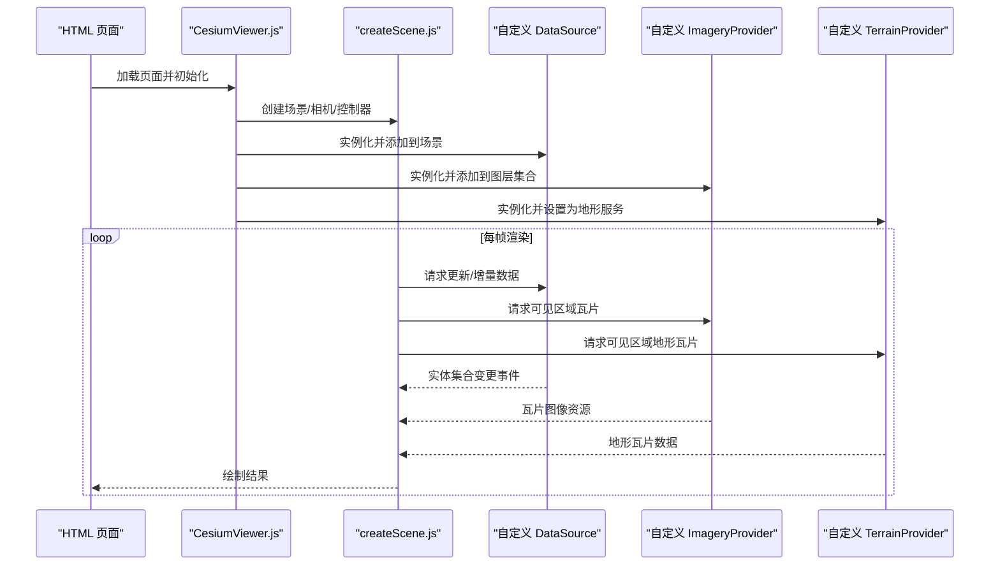
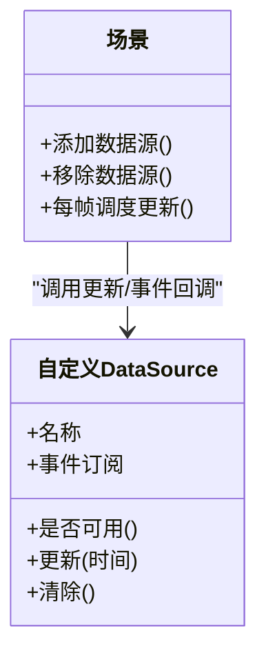
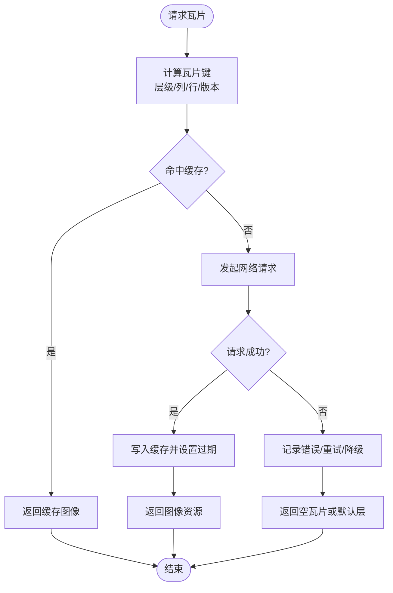
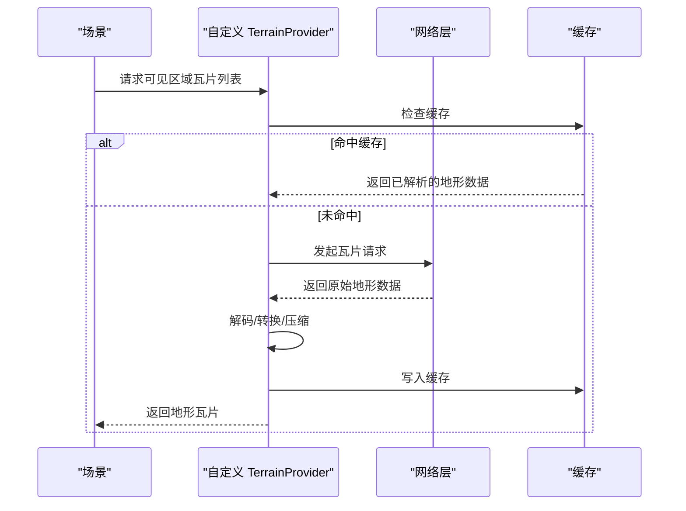
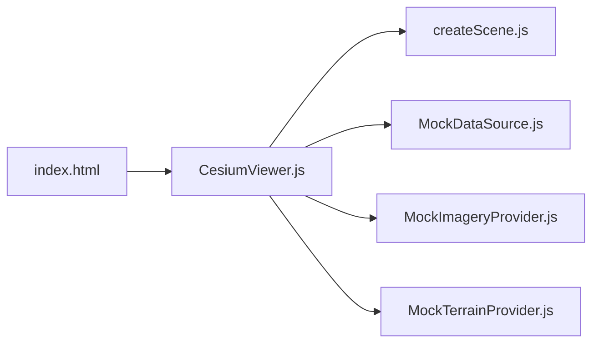

# 自定义数据提供者

<cite>
**本文引用的文件**   
- [MockDataSource.js](file://Specs/MockDataSource.js)
- [MockImageryProvider.js](file://Specs/MockImageryProvider.js)
- [MockTerrainProvider.js](file://Specs/MockTerrainProvider.js)
- [createScene.js](file://Specs/createScene.js)
- [CesiumViewer.js](file://Apps/CesiumViewer/CesiumViewer.js)
- [index.html](file://Apps/CesiumViewer/index.html)
</cite>

## 目录
1. [简介](#简介)
2. [项目结构](#项目结构)
3. [核心组件](#核心组件)
4. [架构总览](#架构总览)
5. [详细组件分析](#详细组件分析)
6. [依赖关系分析](#依赖关系分析)
7. [性能考虑](#性能考虑)
8. [故障排查指南](#故障排查指南)
9. [结论](#结论)
10. [附录](#附录)

## 简介
本指南面向需要在 CesiumJS 中实现自定义数据提供者的开发者，围绕以下目标展开：
- 如何实现自定义的 DataSource、ImageryProvider、TerrainProvider 等接口
- 数据提供者的生命周期管理、缓存策略与错误处理机制
- 从 REST API、WebSocket、数据库等不同数据源加载数据的完整示例思路
- 异步数据加载、增量更新、版本管理等高级功能的实现方法

为便于理解与实践，文档结合仓库中的 Mock 数据提供者样例与 Viewer 集成方式，给出循序渐进的实现路径与最佳实践。

## 项目结构
仓库包含用于演示和测试的“模拟数据提供者”以及一个最小化的 Viewer 应用入口，适合参考其组织方式与集成模式：
- Specs 目录下提供三类 Mock 数据提供者，分别对应矢量/实体数据、影像图层、地形服务
- Apps/CesiumViewer 下提供一个最小可运行的 Viewer 页面，展示如何引入并添加数据提供者

图表来源
- [index.html:1-200](file://Apps/CesiumViewer/index.html#L1-L200)
- [CesiumViewer.js:1-200](file://Apps/CesiumViewer/CesiumViewer.js#L1-L200)
- [MockDataSource.js:1-200](file://Specs/MockDataSource.js#L1-L200)
- [MockImageryProvider.js:1-200](file://Specs/MockImageryProvider.js#L1-L200)
- [MockTerrainProvider.js:1-200](file://Specs/MockTerrainProvider.js#L1-L200)
- [createScene.js:1-200](file://Specs/createScene.js#L1-L200)

章节来源
- [index.html:1-200](file://Apps/CesiumViewer/index.html#L1-L200)
- [CesiumViewer.js:1-200](file://Apps/CesiumViewer/CesiumViewer.js#L1-L200)
- [MockDataSource.js:1-200](file://Specs/MockDataSource.js#L1-L200)
- [MockImageryProvider.js:1-200](file://Specs/MockImageryProvider.js#L1-L200)
- [MockTerrainProvider.js:1-200](file://Specs/MockTerrainProvider.js#L1-L200)
- [createScene.js:1-200](file://Specs/createScene.js#L1-L200)

## 核心组件
本节聚焦三类数据提供者的职责与关键能力，并结合仓库中的 Mock 实现进行说明。

- 自定义 DataSource（矢量/实体数据）
  - 职责：向场景提供动态或静态的实体集合，支持增删改、时间轴动画、属性查询等
  - 关键点：事件通知、批量更新、内存与渲染优化
  - 参考实现：[MockDataSource.js](file://Specs/MockDataSource.js)

- 自定义 ImageryProvider（影像图层）
  - 职责：按瓦片坐标请求影像切片，返回图像资源；支持透明度、版权信息、投影变换等
  - 关键点：瓦片键生成、并发控制、缓存与过期策略、错误重试
  - 参考实现：[MockImageryProvider.js](file://Specs/MockImageryProvider.js)

- 自定义 TerrainProvider（地形服务）
  - 职责：按瓦片请求地形高度图或网格数据，构建地形表面
  - 关键点：瓦片可用性、LOD 控制、几何误差、错误降级
  - 参考实现：[MockTerrainProvider.js](file://Specs/MockTerrainProvider.js)

章节来源
- [MockDataSource.js:1-200](file://Specs/MockDataSource.js#L1-L200)
- [MockImageryProvider.js:1-200](file://Specs/MockImageryProvider.js#L1-L200)
- [MockTerrainProvider.js:1-200](file://Specs/MockTerrainProvider.js#L1-L200)

## 架构总览
下图展示了自定义数据提供者与 Viewer 的典型交互流程：应用初始化场景，创建并注册数据提供者，随后在渲染循环中按需拉取数据、更新状态并渲染。

图表来源
- [CesiumViewer.js:1-200](file://Apps/CesiumViewer/CesiumViewer.js#L1-L200)
- [createScene.js:1-200](file://Specs/createScene.js#L1-L200)
- [MockDataSource.js:1-200](file://Specs/MockDataSource.js#L1-L200)
- [MockImageryProvider.js:1-200](file://Specs/MockImageryProvider.js#L1-L200)
- [MockTerrainProvider.js:1-200](file://Specs/MockTerrainProvider.js#L1-L200)

## 详细组件分析

### 自定义 DataSource 分析与实现要点
- 设计目标
  - 以实体集合为核心，提供增删改查与时间相关更新
  - 通过事件驱动通知场景进行增量渲染
- 关键能力
  - 批量更新：减少频繁触发重绘
  - 时间轴：支持随时间变化的属性与位置
  - 内存管理：及时释放不再使用的实体
- 参考实现路径
  - [MockDataSource.js](file://Specs/MockDataSource.js)

图表来源
- [MockDataSource.js:1-200](file://Specs/MockDataSource.js#L1-L200)
- [createScene.js:1-200](file://Specs/createScene.js#L1-L200)

章节来源
- [MockDataSource.js:1-200](file://Specs/MockDataSource.js#L1-L200)
- [createScene.js:1-200](file://Specs/createScene.js#L1-L200)

### 自定义 ImageryProvider 分析与实现要点
- 设计目标
  - 基于瓦片键（层级、列、行）请求影像切片
  - 支持多分辨率、跨日期/版本的影像切换
- 关键能力
  - 并发限制与队列：避免过多网络请求导致阻塞
  - 缓存策略：LRU/容量上限/过期时间
  - 错误处理：超时、重试、降级到默认底图
- 参考实现路径
  - [MockImageryProvider.js](file://Specs/MockImageryProvider.js)

图表来源
- [MockImageryProvider.js:1-200](file://Specs/MockImageryProvider.js#L1-L200)

章节来源
- [MockImageryProvider.js:1-200](file://Specs/MockImageryProvider.js#L1-L200)

### 自定义 TerrainProvider 分析与实现要点
- 设计目标
  - 按瓦片请求地形数据（如高度图或网格），构建连续地形表面
  - 支持 LOD 与几何误差控制，保证不同缩放级别下的精度与性能平衡
- 关键能力
  - 可用性判断：提前告知哪些瓦片可用，避免无效请求
  - 错误降级：部分瓦片失败时回退到较低精度或占位数据
  - 内存与显存管理：及时释放不可见瓦片
- 参考实现路径
  - [MockTerrainProvider.js](file://Specs/MockTerrainProvider.js)

图表来源
- [MockTerrainProvider.js:1-200](file://Specs/MockTerrainProvider.js#L1-L200)
- [createScene.js:1-200](file://Specs/createScene.js#L1-L200)

章节来源
- [MockTerrainProvider.js:1-200](file://Specs/MockTerrainProvider.js#L1-L200)
- [createScene.js:1-200](file://Specs/createScene.js#L1-L200)

### 从不同数据源加载数据的实现思路
- REST API
  - 适用场景：影像瓦片、地形瓦片、实体 JSON
  - 建议：带版本号/时间戳的 URL 参数；HTTP 缓存头配合 ETag/Last-Modified；失败重试与指数退避
- WebSocket
  - 适用场景：实时轨迹、传感器流、增量更新
  - 建议：消息分片与去重；断线重连与幂等处理；前端合并与节流
- 数据库
  - 适用场景：离线或内网环境，通过后端聚合为 REST/WebSocket
  - 建议：分页/游标；空间索引；批量导出为瓦片格式

章节来源
- [MockImageryProvider.js:1-200](file://Specs/MockImageryProvider.js#L1-L200)
- [MockTerrainProvider.js:1-200](file://Specs/MockTerrainProvider.js#L1-L200)
- [MockDataSource.js:1-200](file://Specs/MockDataSource.js#L1-L200)

### 异步数据加载、增量更新与版本管理
- 异步加载
  - 使用 Promise/async-await 封装网络请求；统一错误边界；取消重复请求
- 增量更新
  - 对 DataSource：仅推送变更的实体集合；对 Imagery/Terrain：只更新受影响瓦片
- 版本管理
  - 在瓦片键或实体 ID 中加入版本字段；服务端提供差异接口；客户端维护版本快照与回滚

章节来源
- [MockImageryProvider.js:1-200](file://Specs/MockImageryProvider.js#L1-L200)
- [MockTerrainProvider.js:1-200](file://Specs/MockTerrainProvider.js#L1-L200)
- [MockDataSource.js:1-200](file://Specs/MockDataSource.js#L1-L200)

## 依赖关系分析
- 应用层依赖
  - index.html 引入 Cesium 资源与自定义脚本
  - CesiumViewer.js 负责初始化场景与注册数据提供者
- 数据提供者层
  - 三类 Mock 提供者作为参考实现，展示各自的生命周期与更新流程
- 场景与渲染
  - createScene.js 提供场景创建与基本配置，供应用层组合

图表来源
- [index.html:1-200](file://Apps/CesiumViewer/index.html#L1-L200)
- [CesiumViewer.js:1-200](file://Apps/CesiumViewer/CesiumViewer.js#L1-L200)
- [createScene.js:1-200](file://Specs/createScene.js#L1-L200)
- [MockDataSource.js:1-200](file://Specs/MockDataSource.js#L1-L200)
- [MockImageryProvider.js:1-200](file://Specs/MockImageryProvider.js#L1-L200)
- [MockTerrainProvider.js:1-200](file://Specs/MockTerrainProvider.js#L1-L200)

章节来源
- [index.html:1-200](file://Apps/CesiumViewer/index.html#L1-L200)
- [CesiumViewer.js:1-200](file://Apps/CesiumViewer/CesiumViewer.js#L1-L200)
- [createScene.js:1-200](file://Specs/createScene.js#L1-L200)
- [MockDataSource.js:1-200](file://Specs/MockDataSource.js#L1-L200)
- [MockImageryProvider.js:1-200](file://Specs/MockImageryProvider.js#L1-L200)
- [MockTerrainProvider.js:1-200](file://Specs/MockTerrainProvider.js#L1-L200)

## 性能考虑
- 并发与限流
  - 对 Imagery/Terrain 的请求进行并发限制，避免浏览器线程与带宽拥塞
- 缓存策略
  - 内存缓存：LRU、容量上限、过期时间；磁盘/IndexedDB 持久化（可选）
- 增量与批处理
  - 将多次小更新合并为一次批量更新，降低渲染抖动
- 内存与显存
  - 及时释放不可见瓦片与实体；复用对象与缓冲区
- 错误与降级
  - 快速失败与重试；失败时回退到低精度或默认数据，保障用户体验

## 故障排查指南
- 常见问题定位
  - 瓦片不显示：检查瓦片键是否正确、URL 可达性、跨域与 MIME 类型
  - 内存泄漏：确认是否在合适时机清理实体与瓦片缓存
  - 更新卡顿：检查是否频繁触发全量更新，改为增量与批处理
- 调试建议
  - 启用控制台日志与网络面板，观察请求频率与大小
  - 使用性能面板分析主线程占用与 GPU 资源消耗
  - 针对特定区域缩小范围复现问题

章节来源
- [MockImageryProvider.js:1-200](file://Specs/MockImageryProvider.js#L1-L200)
- [MockTerrainProvider.js:1-200](file://Specs/MockTerrainProvider.js#L1-L200)
- [MockDataSource.js:1-200](file://Specs/MockDataSource.js#L1-L200)

## 结论
通过参考仓库中的 Mock 数据提供者与最小 Viewer 集成方式，开发者可以逐步实现满足业务需求的自定义数据提供者。关键在于：
- 明确职责边界与生命周期
- 建立健壮的缓存与错误处理机制
- 采用异步与增量更新提升性能
- 做好版本管理与降级策略，确保稳定性与可维护性

## 附录
- 快速上手步骤
  - 在 index.html 中引入 Cesium 资源与自定义脚本
  - 在 CesiumViewer.js 中创建场景并注册自定义数据提供者
  - 参考 Mock 实现补齐网络请求、缓存与错误处理逻辑
- 扩展方向
  - 增加多语言与版权信息
  - 接入更多数据源（REST/WebSocket/数据库）
  - 完善监控与指标上报