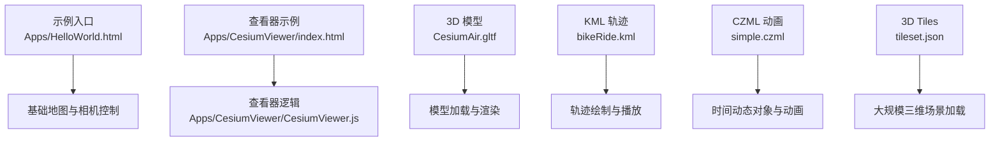
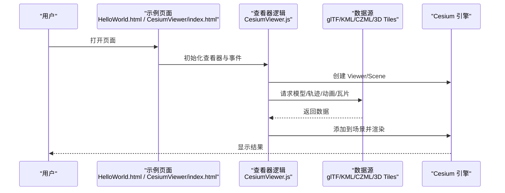
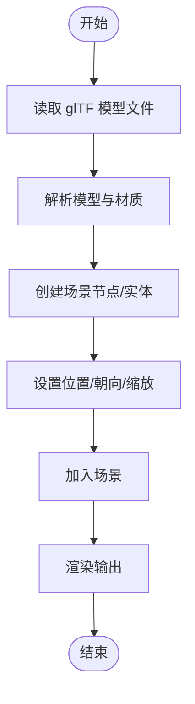
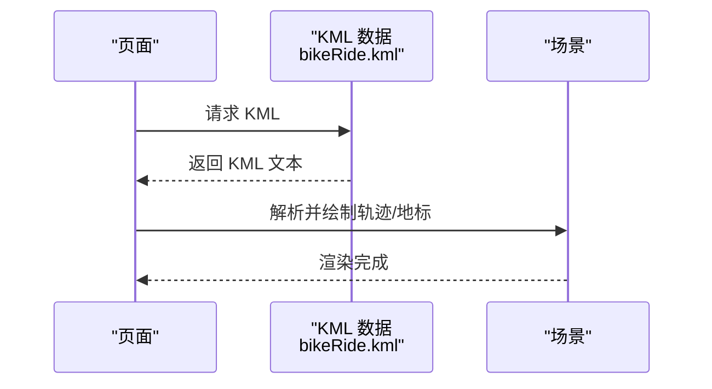
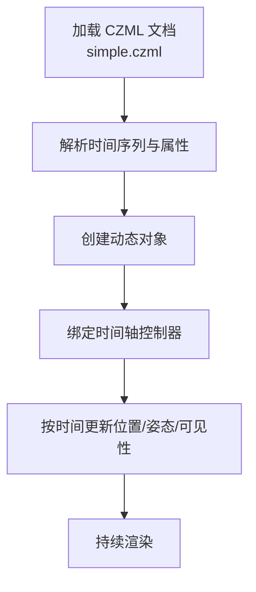
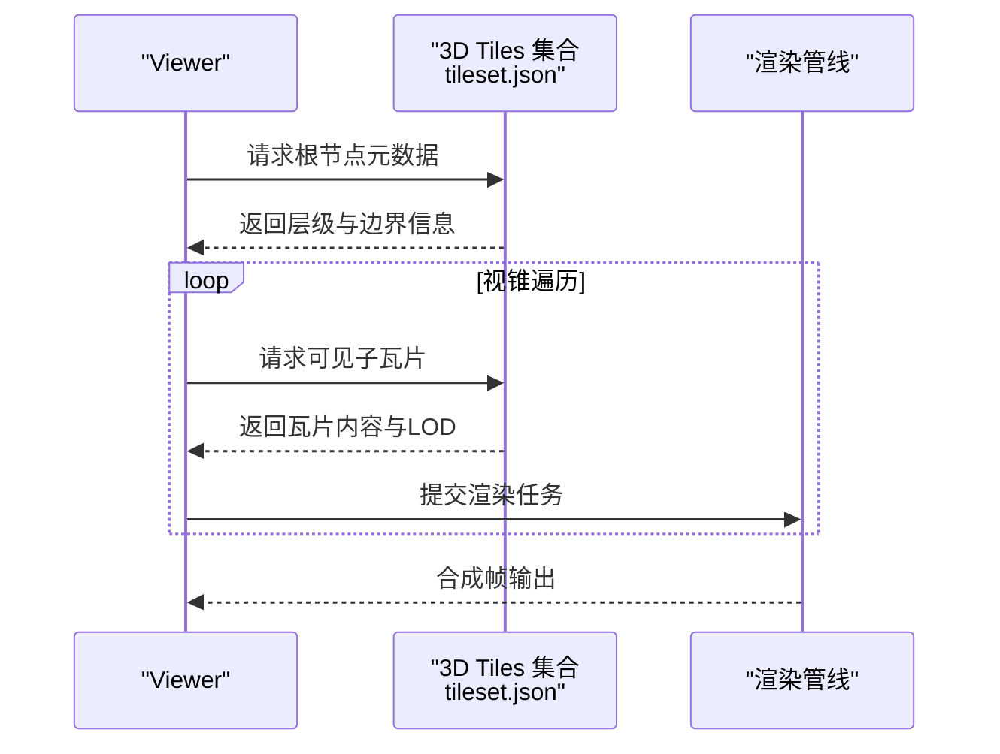
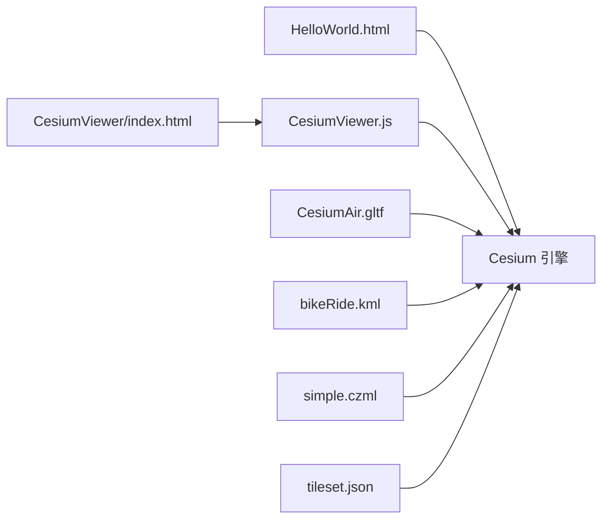

# 示例教程

<cite>
**本文引用的文件**   
- [Apps/HelloWorld.html](file://Apps/HelloWorld.html)
- [Apps/CesiumViewer/index.html](file://Apps/CesiumViewer/index.html)
- [Apps/CesiumViewer/CesiumViewer.js](file://Apps/CesiumViewer/CesiumViewer.js)
- [Apps/SampleData/models/CesiumAir/CesiumAir.gltf](file://Apps/SampleData/models/CesiumAir/CesiumAir.gltf)
- [Apps/SampleData/kml/bikeRide.kml](file://Apps/SampleData/kml/bikeRide.kml)
- [Apps/SampleData/CZML/simple.czml](file://Apps/SampleData/CZML/simple.czml)
- [Apps/SampleData/Cesium3DTiles/Tilesets/Tileset/tileset.json](file://Apps/SampleData/Cesium3DTiles/Tilesets/Tileset/tileset.json)
</cite>

## 目录
1. [简介](#简介)
2. [项目结构](#项目结构)
3. [核心组件](#核心组件)
4. [架构总览](#架构总览)
5. [详细组件分析](#详细组件分析)
6. [依赖分析](#依赖分析)
7. [性能考虑](#性能考虑)
8. [故障排查指南](#故障排查指南)
9. [结论](#结论)
10. [附录](#附录)

## 简介
本教程围绕 Cesium 的实用示例与学习路径，提供从入门到进阶的渐进式内容。通过仓库中已有的示例资源（HTML、glTF、KML、CZML、3D Tiles），你将学会：
- 快速搭建一个可运行的 Cesium 应用
- 加载并展示 3D 模型（glTF）
- 播放 KML 轨迹与 CZML 动画
- 加载 3D Tiles 大规模三维场景
- 构建测量工具与标注系统的基础思路
- 将上述能力组合为智慧城市、数字孪生、地理信息系统等真实场景原型

所有示例均基于仓库内现有数据与页面，可直接运行与二次开发。

## 项目结构
仓库包含示例入口、演示数据与构建脚本等。与本教程直接相关的核心位置如下：
- 示例入口与演示页面
  - Apps/HelloWorld.html：最简入门示例
  - Apps/CesiumViewer/index.html + CesiumViewer.js：轻量查看器示例
- 示例数据
  - glTF 模型：Apps/SampleData/models/CesiumAir/CesiumAir.gltf
  - KML 轨迹：Apps/SampleData/kml/bikeRide.kml
  - CZML 动画：Apps/SampleData/CZML/simple.czml
  - 3D Tiles 集合：Apps/SampleData/Cesium3DTiles/Tilesets/Tileset/tileset.json

图表来源
- [Apps/HelloWorld.html](file://Apps/HelloWorld.html)
- [Apps/CesiumViewer/index.html](file://Apps/CesiumViewer/index.html)
- [Apps/CesiumViewer/CesiumViewer.js](file://Apps/CesiumViewer/CesiumViewer.js)
- [Apps/SampleData/models/CesiumAir/CesiumAir.gltf](file://Apps/SampleData/models/CesiumAir/CesiumAir.gltf)
- [Apps/SampleData/kml/bikeRide.kml](file://Apps/SampleData/kml/bikeRide.kml)
- [Apps/SampleData/CZML/simple.czml](file://Apps/SampleData/CZML/simple.czml)
- [Apps/SampleData/Cesium3DTiles/Tilesets/Tileset/tileset.json](file://Apps/SampleData/Cesium3DTiles/Tilesets/Tileset/tileset.json)

章节来源
- [Apps/HelloWorld.html](file://Apps/HelloWorld.html)
- [Apps/CesiumViewer/index.html](file://Apps/CesiumViewer/index.html)
- [Apps/CesiumViewer/CesiumViewer.js](file://Apps/CesiumViewer/CesiumViewer.js)
- [Apps/SampleData/models/CesiumAir/CesiumAir.gltf](file://Apps/SampleData/models/CesiumAir/CesiumAir.gltf)
- [Apps/SampleData/kml/bikeRide.kml](file://Apps/SampleData/kml/bikeRide.kml)
- [Apps/SampleData/CZML/simple.czml](file://Apps/SampleData/CZML/simple.czml)
- [Apps/SampleData/Cesium3DTiles/Tilesets/Tileset/tileset.json](file://Apps/SampleData/Cesium3DTiles/Tilesets/Tileset/tileset.json)

## 核心组件
- 示例入口与查看器
  - HelloWorld.html：最小化页面，用于快速验证环境是否可用
  - CesiumViewer/index.html + CesiumViewer.js：封装了查看器的初始化与常用交互
- 数据源
  - glTF 模型：用于加载静态或带动画的 3D 模型
  - KML：用于导入轨迹、地标、样式等地理要素
  - CZML：用于描述随时间变化的对象与动画
  - 3D Tiles：用于流式加载大规模三维场景（点云、倾斜摄影、BIM 等）

章节来源
- [Apps/HelloWorld.html](file://Apps/HelloWorld.html)
- [Apps/CesiumViewer/index.html](file://Apps/CesiumViewer/index.html)
- [Apps/CesiumViewer/CesiumViewer.js](file://Apps/CesiumViewer/CesiumViewer.js)
- [Apps/SampleData/models/CesiumAir/CesiumAir.gltf](file://Apps/SampleData/models/CesiumAir/CesiumAir.gltf)
- [Apps/SampleData/kml/bikeRide.kml](file://Apps/SampleData/kml/bikeRide.kml)
- [Apps/SampleData/CZML/simple.czml](file://Apps/SampleData/CZML/simple.czml)
- [Apps/SampleData/Cesium3DTiles/Tilesets/Tileset/tileset.json](file://Apps/SampleData/Cesium3DTiles/Tilesets/Tileset/tileset.json)

## 架构总览
下图展示了“页面—查看器—数据源”的基本调用关系，帮助你理解示例的运行流程。

图表来源
- [Apps/HelloWorld.html](file://Apps/HelloWorld.html)
- [Apps/CesiumViewer/index.html](file://Apps/CesiumViewer/index.html)
- [Apps/CesiumViewer/CesiumViewer.js](file://Apps/CesiumViewer/CesiumViewer.js)
- [Apps/SampleData/models/CesiumAir/CesiumAir.gltf](file://Apps/SampleData/models/CesiumAir/CesiumAir.gltf)
- [Apps/SampleData/kml/bikeRide.kml](file://Apps/SampleData/kml/bikeRide.kml)
- [Apps/SampleData/CZML/simple.czml](file://Apps/SampleData/CZML/simple.czml)
- [Apps/SampleData/Cesium3DTiles/Tilesets/Tileset/tileset.json](file://Apps/SampleData/Cesium3DTiles/Tilesets/Tileset/tileset.json)

## 详细组件分析

### 入门示例：HelloWorld
- 目标：在浏览器中快速启动一个 Cesium 地球，确认环境可用
- 关键步骤
  - 引入必要的 Cesium 资源
  - 创建 Viewer 实例
  - 设置初始视角与基础控件
- 建议扩展
  - 添加定位按钮
  - 切换底图图层
  - 打印控制台日志以调试

章节来源
- [Apps/HelloWorld.html](file://Apps/HelloWorld.html)

### 查看器示例：CesiumViewer
- 目标：提供一个更完整的查看器骨架，便于后续集成业务功能
- 关键步骤
  - 初始化 Viewer 与 Scene
  - 绑定常用交互（缩放、旋转、平移）
  - 预留数据加载接口（模型、轨迹、动画、瓦片）
- 建议扩展
  - 增加 UI 面板（图层控制、时间轴、测量工具）
  - 封装数据加载函数（统一错误处理与进度反馈）

章节来源
- [Apps/CesiumViewer/index.html](file://Apps/CesiumViewer/index.html)
- [Apps/CesiumViewer/CesiumViewer.js](file://Apps/CesiumViewer/CesiumViewer.js)

### 3D 模型加载（glTF）
- 目标：在场景中加载并展示 glTF 模型
- 关键步骤
  - 准备模型文件（示例使用 CesiumAir.gltf）
  - 在场景中创建模型实体或节点
  - 设置位置、朝向、缩放与动画（如有）
- 常见问题
  - 跨域与资源路径问题
  - 纹理缺失导致黑屏
  - 坐标系与高度基准不一致

图表来源
- [Apps/SampleData/models/CesiumAir/CesiumAir.gltf](file://Apps/SampleData/models/CesiumAir/CesiumAir.gltf)

章节来源
- [Apps/SampleData/models/CesiumAir/CesiumAir.gltf](file://Apps/SampleData/models/CesiumAir/CesiumAir.gltf)

### 轨迹与动画（KML）
- 目标：加载 KML 中的轨迹、地标与样式，并在地图上可视化
- 关键步骤
  - 读取 KML 文件（示例使用 bikeRide.kml）
  - 解析轨迹点、样式与图标
  - 在场景中绘制折线/点标记，并可驱动时间轴播放
- 应用场景
  - 车辆/人员移动轨迹回放
  - 历史事件时空可视化

图表来源
- [Apps/SampleData/kml/bikeRide.kml](file://Apps/SampleData/kml/bikeRide.kml)

章节来源
- [Apps/SampleData/kml/bikeRide.kml](file://Apps/SampleData/kml/bikeRide.kml)

### 时间动态对象（CZML）
- 目标：使用 CZML 描述随时间变化的对象与动画
- 关键步骤
  - 准备 CZML 文档（示例使用 simple.czml）
  - 在场景中加载 CZML 数据源
  - 控制时间轴播放、暂停与跳转
- 应用场景
  - 飞行器/卫星轨迹
  - 多对象协同动画

图表来源
- [Apps/SampleData/CZML/simple.czml](file://Apps/SampleData/CZML/simple.czml)

章节来源
- [Apps/SampleData/CZML/simple.czml](file://Apps/SampleData/CZML/simple.czml)

### 大规模场景（3D Tiles）
- 目标：加载 3D Tiles 集合，实现海量数据的流式渲染
- 关键步骤
  - 指定 tileset.json 根节点
  - 配置视锥剔除、细节层次与缓存策略
  - 结合相机运动进行按需加载
- 应用场景
  - 城市级倾斜摄影
  - 点云与体素数据
  - 建筑信息模型（BIM）

图表来源
- [Apps/SampleData/Cesium3DTiles/Tilesets/Tileset/tileset.json](file://Apps/SampleData/Cesium3DTiles/Tilesets/Tileset/tileset.json)

章节来源
- [Apps/SampleData/Cesium3DTiles/Tilesets/Tileset/tileset.json](file://Apps/SampleData/Cesium3DTiles/Tilesets/Tileset/tileset.json)

### 实战案例：智慧城市/数字孪生/地理信息系统
- 智慧城市
  - 叠加 3D Tiles 城市模型
  - 接入实时交通轨迹（KML/CZML）
  - 在重要设施上添加标注与弹窗
- 数字孪生
  - 加载设备/产线的 glTF 模型
  - 用 CZML 驱动设备状态与动作
  - 结合传感器数据进行可视化
- 地理信息系统
  - 加载矢量数据（GeoJSON/TopoJSON）
  - 实现空间查询与量测
  - 多图层管理与样式切换

[本节为概念性说明，不直接分析具体文件]

## 依赖分析
- 页面与脚本
  - HelloWorld.html 与 CesiumViewer/index.html 作为入口，分别引用 CesiumViewer.js 或直接嵌入逻辑
- 数据与资源
  - glTF、KML、CZML、3D Tiles 等资源由页面或脚本按需加载
- 运行时依赖
  - Cesium 引擎负责场景管理、渲染与数据解析

图表来源
- [Apps/HelloWorld.html](file://Apps/HelloWorld.html)
- [Apps/CesiumViewer/index.html](file://Apps/CesiumViewer/index.html)
- [Apps/CesiumViewer/CesiumViewer.js](file://Apps/CesiumViewer/CesiumViewer.js)
- [Apps/SampleData/models/CesiumAir/CesiumAir.gltf](file://Apps/SampleData/models/CesiumAir/CesiumAir.gltf)
- [Apps/SampleData/kml/bikeRide.kml](file://Apps/SampleData/kml/bikeRide.kml)
- [Apps/SampleData/CZML/simple.czml](file://Apps/SampleData/CZML/simple.czml)
- [Apps/SampleData/Cesium3DTiles/Tilesets/Tileset/tileset.json](file://Apps/SampleData/Cesium3DTiles/Tilesets/Tileset/tileset.json)

章节来源
- [Apps/HelloWorld.html](file://Apps/HelloWorld.html)
- [Apps/CesiumViewer/index.html](file://Apps/CesiumViewer/index.html)
- [Apps/CesiumViewer/CesiumViewer.js](file://Apps/CesiumViewer/CesiumViewer.js)
- [Apps/SampleData/models/CesiumAir/CesiumAir.gltf](file://Apps/SampleData/models/CesiumAir/CesiumAir.gltf)
- [Apps/SampleData/kml/bikeRide.kml](file://Apps/SampleData/kml/bikeRide.kml)
- [Apps/SampleData/CZML/simple.czml](file://Apps/SampleData/CZML/simple.czml)
- [Apps/SampleData/Cesium3DTiles/Tilesets/Tileset/tileset.json](file://Apps/SampleData/Cesium3DTiles/Tilesets/Tileset/tileset.json)

## 性能考虑
- 3D Tiles
  - 合理设置视锥与距离阈值，避免一次性加载过多瓦片
  - 利用 LOD 与批渲染减少绘制批次
- glTF 模型
  - 压缩纹理与几何（如 Draco/Basis）
  - 控制实例化数量与动画频率
- KML/CZML
  - 对大数据集进行分块加载与增量更新
  - 使用时间抽稀与采样降低每帧计算压力
- 通用优化
  - 启用离屏渲染与 Web Worker（如适用）
  - 合理使用缓存与内存回收策略

[本节提供通用指导，不直接分析具体文件]

## 故障排查指南
- 无法加载资源
  - 检查本地服务器与跨域策略
  - 确认资源路径与文件名大小写一致
- 模型显示异常
  - 检查纹理路径是否正确
  - 确认模型坐标系与高度基准
- 轨迹/动画不播放
  - 校验 KML/CZML 格式与时间字段
  - 确保时间轴已启动且范围覆盖数据时段
- 3D Tiles 卡顿
  - 调整视锥与细节阈值
  - 监控网络带宽与磁盘 IO

[本节提供通用指导，不直接分析具体文件]

## 结论
通过本教程，你已掌握：
- 使用示例页面快速启动 Cesium
- 加载与展示 glTF、KML、CZML、3D Tiles 等主流数据
- 将基础能力组合为智慧城市、数字孪生与 GIS 应用的雏形
建议在现有示例基础上逐步扩展 UI、交互与业务逻辑，形成可复用的工程模板。

[本节为总结性内容，不直接分析具体文件]

## 附录
- 在线演示
  - 请在本地启动静态服务器后访问以下页面：
    - 入门示例：[Apps/HelloWorld.html](file://Apps/HelloWorld.html)
    - 查看器示例：[Apps/CesiumViewer/index.html](file://Apps/CesiumViewer/index.html)
- 示例数据清单
  - glTF 模型：[CesiumAir.gltf](file://Apps/SampleData/models/CesiumAir/CesiumAir.gltf)
  - KML 轨迹：[bikeRide.kml](file://Apps/SampleData/kml/bikeRide.kml)
  - CZML 动画：[simple.czml](file://Apps/SampleData/CZML/simple.czml)
  - 3D Tiles 集合：[tileset.json](file://Apps/SampleData/Cesium3DTiles/Tilesets/Tileset/tileset.json)