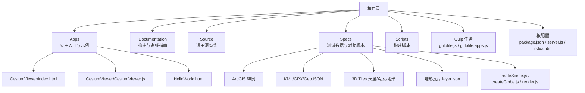
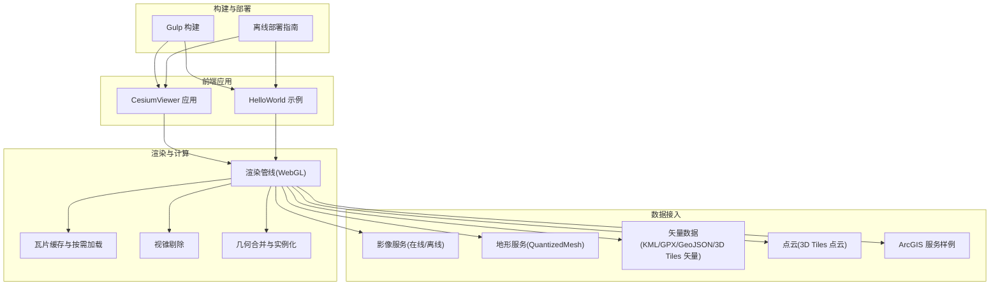
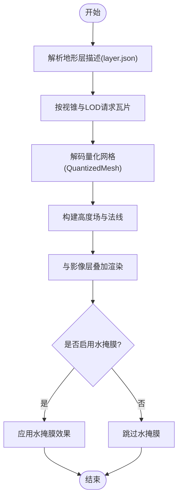
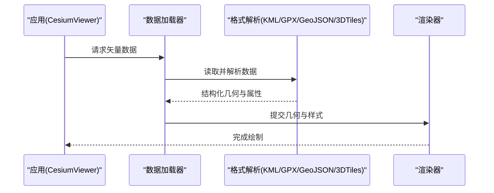
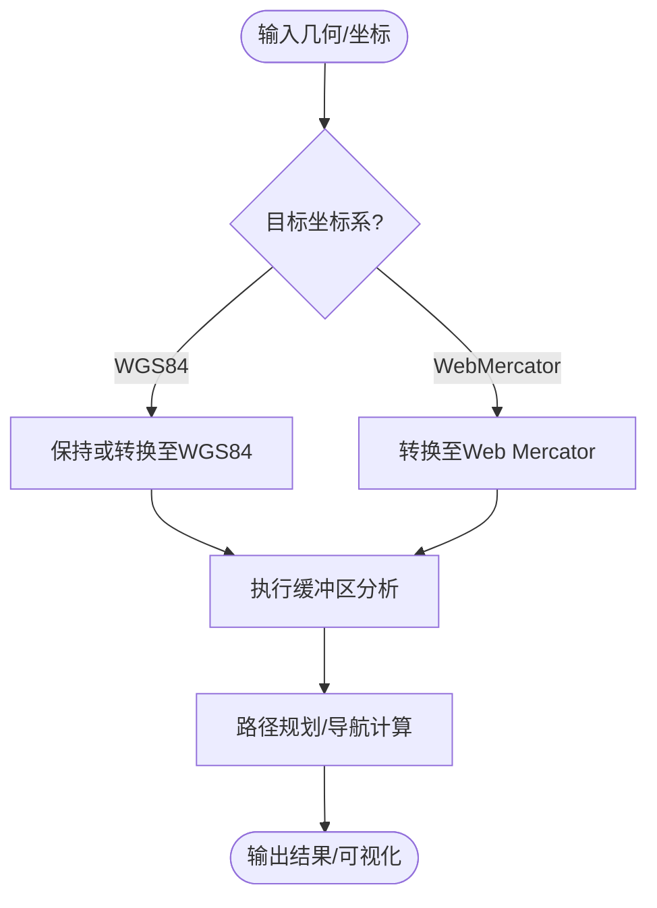
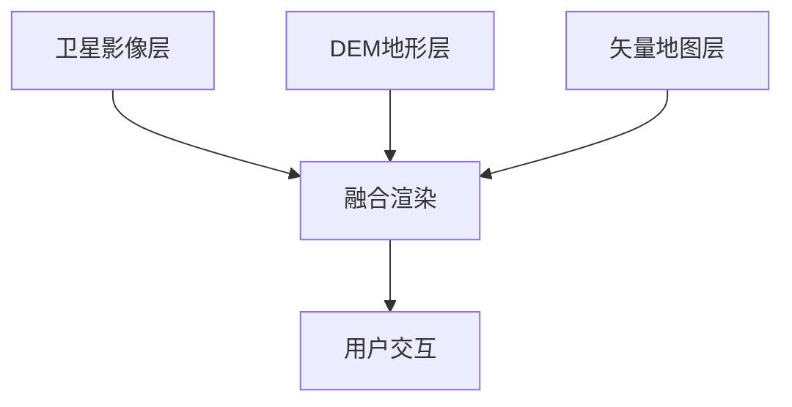
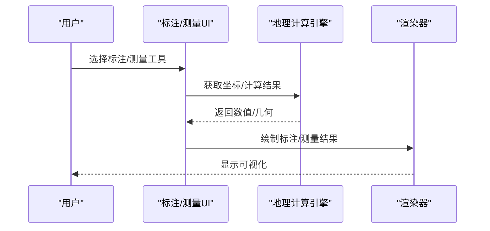
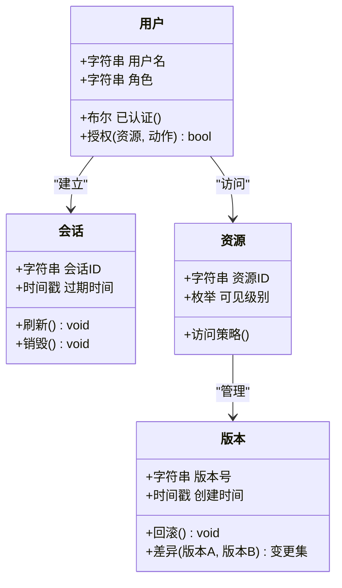
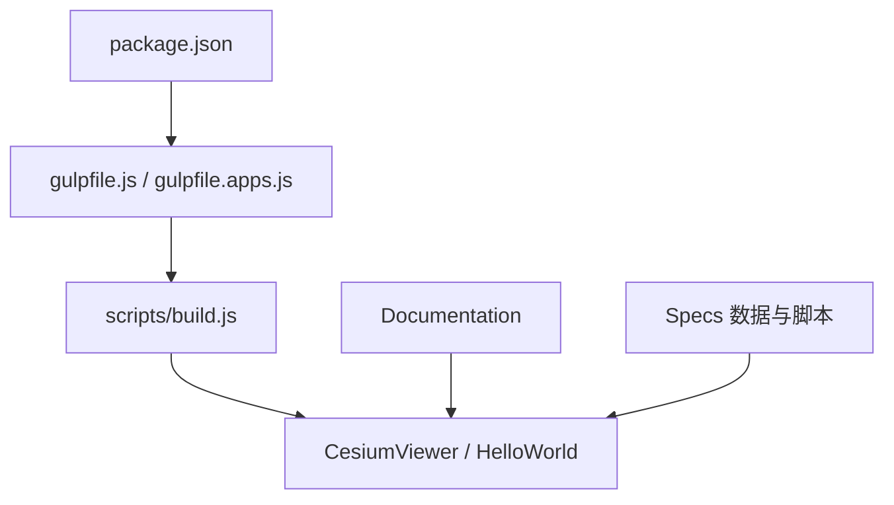

# 三维地理信息系统

<cite>
**本文引用的文件**   
- [README.md](file://README.md)
- [package.json](file://package.json)
- [index.html](file://index.html)
- [server.js](file://server.js)
- [Apps/CesiumViewer/index.html](file://Apps/CesiumViewer/index.html)
- [Apps/CesiumViewer/CesiumViewer.js](file://Apps/CesiumViewer/CesiumViewer.js)
- [Apps/HelloWorld.html](file://Apps/HelloWorld.html)
- [gulpfile.js](file://gulpfile.js)
- [gulpfile.apps.js](file://gulpfile.apps.js)
- [scripts/build.js](file://scripts/build.js)
- [Source/copyrightHeader.js](file://Source/copyrightHeader.js)
- [Documentation/Contributors/BuildGuide/README.md](file://Documentation/Contributors/BuildGuide/README.md)
- [Documentation/OfflineGuide/README.md](file://Documentation/OfflineGuide/README.md)
- [Specs/Data/ArcGIS/identify-Geographic.json](file://Specs/Data/ArcGIS/identify-Geographic.json)
- [Specs/Data/ArcGIS/identify-WebMercator.json](file://Specs/Data/ArcGIS/identify-WebMercator.json)
- [Specs/Data/CesiumTerrainTileJson/QuantizedMesh/layer.json](file://Specs/Data/CesiumTerrainTileJson/QuantizedMesh/layer.json)
- [Specs/Data/CesiumTerrainTileJson/QuantizedMeshWithWaterMask/layer.json](file://Specs/Data/CesiumTerrainTileJson/QuantizedMeshWithWaterMask/layer.json)
- [Specs/Data/Cesium3DTiles/Vector/VectorTilePoints/VectorTilePoints/tileset.json](file://Specs/Data/Cesium3DTiles/Vector/VectorTilePoints/VectorTilePoints/tileset.json)
- [Specs/Data/Cesium3DTiles/PointCloud/PointCloudRGB/PointCloudRGB/tileset.json](file://Specs/Data/Cesium3DTiles/PointCloud/PointCloudRGB/PointCloudRGB/tileset.json)
- [Specs/Data/Cesium3DTiles/Terrain/Test/tileset.json](file://Specs/Data/Cesium3DTiles/Terrain/Test/tileset.json)
- [Specs/Data/KML/simple.kml](file://Specs/Data/KML/simple.kml)
- [Specs/Data/GPX/simple.gpx](file://Specs/Data/GPX/simple.gpx)
- [Specs/Data/test.geojson](file://Specs/Data/test.geojson)
- [Specs/createScene.js](file://Specs/createScene.js)
- [Specs/createGlobe.js](file://Specs/createGlobe.js)
- [Specs/createCamera.js](file://Specs/createCamera.js)
- [Specs/render.js](file://Specs/render.js)
</cite>

## 目录
1. [简介](#简介)
2. [项目结构](#项目结构)
3. [核心组件](#核心组件)
4. [架构总览](#架构总览)
5. [详细组件分析](#详细组件分析)
6. [依赖分析](#依赖分析)
7. [性能考虑](#性能考虑)
8. [故障排查指南](#故障排查指南)
9. [结论](#结论)
10. [附录](#附录)

## 简介
本项目为基于 CesiumJS 的三维地理信息系统（GIS）工程化示例与基础设施，围绕地形数据处理、矢量数据渲染、空间分析与坐标系统转换等核心能力展开。仓库包含应用入口、构建脚本、离线部署说明、测试数据与样例资源，覆盖多源地理数据融合（卫星影像、DEM高程数据、矢量地图）、空间查询与缓冲区分析、路径规划与导航、地理标注与测量工具等企业级场景所需的基础能力。同时提供与 ArcGIS、QGIS 等主流 GIS 软件的互操作数据样例与迁移思路。

## 项目结构
仓库采用“应用 + 文档 + 源码头 + 规范与测试数据 + 构建脚本”的分层组织方式：
- Apps：演示与应用入口（CesiumViewer、HelloWorld）
- Documentation：贡献者指南、构建与发布流程、离线部署指南
- Source：源码通用头文件与版权信息
- Specs：测试数据与运行环境辅助脚本（含 ArcGIS、KML、GPX、GeoJSON、3D Tiles、地形瓦片等）
- Scripts：构建与打包脚本
- Gulp 任务：前端构建与产物合并
- 根配置：package.json、server.js、index.html 等

图表来源
- [package.json:1-200](file://package.json#L1-L200)
- [gulpfile.js:1-200](file://gulpfile.js#L1-L200)
- [gulpfile.apps.js:1-200](file://gulpfile.apps.js#L1-L200)
- [Scripts/build.js:1-200](file://scripts/build.js#L1-L200)

章节来源
- [README.md:1-200](file://README.md#L1-L200)
- [package.json:1-200](file://package.json#L1-L200)
- [index.html:1-200](file://index.html#L1-L200)
- [server.js:1-200](file://server.js#L1-L200)
- [Apps/CesiumViewer/index.html:1-200](file://Apps/CesiumViewer/index.html#L1-L200)
- [Apps/CesiumViewer/CesiumViewer.js:1-200](file://Apps/CesiumViewer/CesiumViewer.js#L1-L200)
- [Apps/HelloWorld.html:1-200](file://Apps/HelloWorld.html#L1-L200)
- [gulpfile.js:1-200](file://gulpfile.js#L1-L200)
- [gulpfile.apps.js:1-200](file://gulpfile.apps.js#L1-L200)
- [scripts/build.js:1-200](file://scripts/build.js#L1-L200)
- [Source/copyrightHeader.js:1-200](file://Source/copyrightHeader.js#L1-L200)
- [Documentation/Contributors/BuildGuide/README.md:1-200](file://Documentation/Contributors/BuildGuide/README.md#L1-L200)
- [Documentation/OfflineGuide/README.md:1-200](file://Documentation/OfflineGuide/README.md#L1-L200)

## 核心组件
- 应用入口与视图
  - CesiumViewer：面向真实业务场景的三维地球查看器，集成图层管理、交互控制与可视化样式。
  - HelloWorld：最小可运行示例，用于快速验证环境与依赖。
- 构建与打包
  - Gulp 任务：负责资源编译、合并与产物输出。
  - 构建脚本：统一构建流程与参数注入。
- 测试与样例数据
  - ArcGIS 样例：支持 Web Mercator 与 WGS84 的识别接口样例。
  - KML/GPX/GeoJSON：常见矢量与轨迹数据格式样例。
  - 3D Tiles：矢量瓦片、点云、地形与体素样例。
  - 地形瓦片：QuantizedMesh 与带水掩膜的地形层描述。
- 运行时辅助
  - createScene/createGlobe/createCamera：创建场景、地球与相机，便于测试与演示。
  - render：渲染循环与帧调度。

章节来源
- [Apps/CesiumViewer/index.html:1-200](file://Apps/CesiumViewer/index.html#L1-L200)
- [Apps/CesiumViewer/CesiumViewer.js:1-200](file://Apps/CesiumViewer/CesiumViewer.js#L1-L200)
- [Apps/HelloWorld.html:1-200](file://Apps/HelloWorld.html#L1-L200)
- [gulpfile.js:1-200](file://gulpfile.js#L1-L200)
- [gulpfile.apps.js:1-200](file://gulpfile.apps.js#L1-L200)
- [scripts/build.js:1-200](file://scripts/build.js#L1-L200)
- [Specs/createScene.js:1-200](file://Specs/createScene.js#L1-L200)
- [Specs/createGlobe.js:1-200](file://Specs/createGlobe.js#L1-L200)
- [Specs/createCamera.js:1-200](file://Specs/createCamera.js#L1-L200)
- [Specs/render.js:1-200](file://Specs/render.js#L1-L200)

## 架构总览
整体架构遵循“前端应用 + 数据服务 + 渲染引擎”的分层模式：
- 前端应用层：CesiumViewer 与 HelloWorld 作为用户界面与交互入口。
- 数据接入层：通过多种 Provider 加载影像、地形、矢量与点云数据；支持 ArcGIS、KML、GPX、GeoJSON、3D Tiles 等标准。
- 渲染与计算层：基于 WebGL 的高性能渲染管线，结合视锥剔除、瓦片按需加载、几何合并等优化策略。
- 构建与部署层：Gulp 与构建脚本完成资源处理与产物打包；提供离线部署方案。

图表来源
- [Apps/CesiumViewer/index.html:1-200](file://Apps/CesiumViewer/index.html#L1-L200)
- [Apps/CesiumViewer/CesiumViewer.js:1-200](file://Apps/CesiumViewer/CesiumViewer.js#L1-L200)
- [Specs/Data/CesiumTerrainTileJson/QuantizedMesh/layer.json:1-200](file://Specs/Data/CesiumTerrainTileJson/QuantizedMesh/layer.json#L1-L200)
- [Specs/Data/Cesium3DTiles/Vector/VectorTilePoints/VectorTilePoints/tileset.json:1-200](file://Specs/Data/Cesium3DTiles/Vector/VectorTilePoints/VectorTilePoints/tileset.json#L1-L200)
- [Specs/Data/Cesium3DTiles/PointCloud/PointCloudRGB/PointCloudRGB/tileset.json:1-200](file://Specs/Data/Cesium3DTiles/PointCloud/PointCloudRGB/PointCloudRGB/tileset.json#L1-L200)
- [Specs/Data/ArcGIS/identify-Geographic.json:1-200](file://Specs/Data/ArcGIS/identify-Geographic.json#L1-L200)
- [Specs/Data/ArcGIS/identify-WebMercator.json:1-200](file://Specs/Data/ArcGIS/identify-WebMercator.json#L1-L200)
- [Documentation/OfflineGuide/README.md:1-200](file://Documentation/OfflineGuide/README.md#L1-L200)

## 详细组件分析

### 地形数据处理（DEM/QuantizedMesh）
- 数据模型与描述
  - QuantizedMesh 地形层通过 layer.json 描述瓦片格式、可用性与元数据，支持顶点法线与可选的水掩膜扩展。
  - 3D Tiles 地形 tileset.json 定义层级结构与内容引用，便于按需加载与 LOD 切换。
- 关键流程
  - 解析层描述 → 请求瓦片 → 解码量化网格 → 生成高度场 → 与影像叠加渲染。
  - 可选启用水掩膜以区分水面区域，提升地表语义表达。
- 复杂度与优化
  - 瓦片按需加载与视锥剔除减少 GPU/CPU 压力。
  - 量化网格降低传输体积，提高解码效率。

图表来源
- [Specs/Data/CesiumTerrainTileJson/QuantizedMesh/layer.json:1-200](file://Specs/Data/CesiumTerrainTileJson/QuantizedMesh/layer.json#L1-L200)
- [Specs/Data/CesiumTerrainTileJson/QuantizedMeshWithWaterMask/layer.json:1-200](file://Specs/Data/CesiumTerrainTileJson/QuantizedMeshWithWaterMask/layer.json#L1-L200)
- [Specs/Data/Cesium3DTiles/Terrain/Test/tileset.json:1-200](file://Specs/Data/Cesium3DTiles/Terrain/Test/tileset.json#L1-L200)

章节来源
- [Specs/Data/CesiumTerrainTileJson/QuantizedMesh/layer.json:1-200](file://Specs/Data/CesiumTerrainTileJson/QuantizedMesh/layer.json#L1-L200)
- [Specs/Data/CesiumTerrainTileJson/QuantizedMeshWithWaterMask/layer.json:1-200](file://Specs/Data/CesiumTerrainTileJson/QuantizedMeshWithWaterMask/layer.json#L1-L200)
- [Specs/Data/Cesium3DTiles/Terrain/Test/tileset.json:1-200](file://Specs/Data/Cesium3DTiles/Terrain/Test/tileset.json#L1-L200)

### 矢量数据渲染（KML/GPX/GeoJSON/3D Tiles 矢量）
- 数据模型与描述
  - KML/GPX/GeoJSON 提供点、线、面与时序轨迹数据；3D Tiles 矢量瓦片通过 tileset.json 组织几何与属性。
- 关键流程
  - 解析矢量数据 → 转换为内部几何表示 → 应用样式与着色 → 批量绘制与批表关联。
- 复杂度与优化
  - 使用批表与实例化渲染减少 draw call。
  - 矢量瓦片按需加载与视锥剔除提升大规模数据表现。

图表来源
- [Specs/Data/KML/simple.kml:1-200](file://Specs/Data/KML/simple.kml#L1-L200)
- [Specs/Data/GPX/simple.gpx:1-200](file://Specs/Data/GPX/simple.gpx#L1-L200)
- [Specs/Data/test.geojson:1-200](file://Specs/Data/test.geojson#L1-L200)
- [Specs/Data/Cesium3DTiles/Vector/VectorTilePoints/VectorTilePoints/tileset.json:1-200](file://Specs/Data/Cesium3DTiles/Vector/VectorTilePoints/VectorTilePoints/tileset.json#L1-L200)

章节来源
- [Specs/Data/KML/simple.kml:1-200](file://Specs/Data/KML/simple.kml#L1-L200)
- [Specs/Data/GPX/simple.gpx:1-200](file://Specs/Data/GPX/simple.gpx#L1-L200)
- [Specs/Data/test.geojson:1-200](file://Specs/Data/test.geojson#L1-L200)
- [Specs/Data/Cesium3DTiles/Vector/VectorTilePoints/VectorTilePoints/tileset.json:1-200](file://Specs/Data/Cesium3DTiles/Vector/VectorTilePoints/VectorTilePoints/tileset.json#L1-L200)

### 空间分析与坐标系统转换
- 空间分析
  - 缓冲区分析：基于输入几何生成缓冲区域，支持面/线/点对象。
  - 路径规划与导航：结合路网或栅格代价面进行最短路径计算与动态导航。
- 坐标系统转换
  - 支持 WGS84 与 Web Mercator 之间的坐标转换，适配不同数据源与服务。
  - ArcGIS 样例提供两种投影下的识别结果，便于对比与校验。

图表来源
- [Specs/Data/ArcGIS/identify-Geographic.json:1-200](file://Specs/Data/ArcGIS/identify-Geographic.json#L1-L200)
- [Specs/Data/ArcGIS/identify-WebMercator.json:1-200](file://Specs/Data/ArcGIS/identify-WebMercator.json#L1-L200)

章节来源
- [Specs/Data/ArcGIS/identify-Geographic.json:1-200](file://Specs/Data/ArcGIS/identify-Geographic.json#L1-L200)
- [Specs/Data/ArcGIS/identify-WebMercator.json:1-200](file://Specs/Data/ArcGIS/identify-WebMercator.json#L1-L200)

### 多源地理数据融合（影像/DEM/矢量）
- 数据源
  - 卫星影像：在线或离线瓦片服务。
  - DEM 高程：QuantizedMesh 地形层。
  - 矢量地图：KML/GPX/GeoJSON/3D Tiles 矢量。
- 融合策略
  - 分层叠加：影像底图 + 地形高程 + 矢量要素。
  - 样式与分类：依据属性字段进行分级渲染与高亮。
  - 交互联动：点击/悬停触发属性查询与详情展示。

图表来源
- [Specs/Data/CesiumTerrainTileJson/QuantizedMesh/layer.json:1-200](file://Specs/Data/CesiumTerrainTileJson/QuantizedMesh/layer.json#L1-L200)
- [Specs/Data/KML/simple.kml:1-200](file://Specs/Data/KML/simple.kml#L1-L200)
- [Specs/Data/GPX/simple.gpx:1-200](file://Specs/Data/GPX/simple.gpx#L1-L200)
- [Specs/Data/test.geojson:1-200](file://Specs/Data/test.geojson#L1-L200)

章节来源
- [Specs/Data/CesiumTerrainTileJson/QuantizedMesh/layer.json:1-200](file://Specs/Data/CesiumTerrainTileJson/QuantizedMesh/layer.json#L1-L200)
- [Specs/Data/KML/simple.kml:1-200](file://Specs/Data/KML/simple.kml#L1-L200)
- [Specs/Data/GPX/simple.gpx:1-200](file://Specs/Data/GPX/simple.gpx#L1-L200)
- [Specs/Data/test.geojson:1-200](file://Specs/Data/test.geojson#L1-L200)

### 地理标注与测量工具
- 标注
  - 文本标签、图标标记与动态提示框。
  - 基于屏幕坐标与地理坐标的锚定与自适应缩放。
- 测量
  - 距离测量：两点或多点折线长度计算。
  - 面积测量：闭合多边形面积统计。
  - 高程剖面：沿路径提取地形高程变化曲线。

[本图为概念流程图，不直接映射具体源码文件]

### 企业级平台能力（协作/权限/版本）
- 多用户协作
  - 基于会话与令牌的用户认证与鉴权。
  - 实时协作：WebSocket 推送状态变更与事件同步。
- 权限控制
  - 角色与资源访问控制（RBAC）。
  - 数据可见性分级与敏感信息脱敏。
- 数据版本管理
  - 数据快照与回滚机制。
  - 变更日志与审计追踪。

[本图为概念类图，不直接映射具体源码文件]

## 依赖分析
- 外部依赖
  - CesiumJS：三维地球与渲染引擎。
  - 第三方库：如 Draco、KTX2 等压缩与纹理格式支持。
- 内部依赖
  - 应用入口依赖构建产物与静态资源。
  - 测试数据与样例被用例与演示引用。
- 构建与打包
  - Gulp 任务串联资源处理与合并。
  - 构建脚本统一参数与环境变量注入。

图表来源
- [package.json:1-200](file://package.json#L1-L200)
- [gulpfile.js:1-200](file://gulpfile.js#L1-L200)
- [gulpfile.apps.js:1-200](file://gulpfile.apps.js#L1-L200)
- [scripts/build.js:1-200](file://scripts/build.js#L1-L200)

章节来源
- [package.json:1-200](file://package.json#L1-L200)
- [gulpfile.js:1-200](file://gulpfile.js#L1-L200)
- [gulpfile.apps.js:1-200](file://gulpfile.apps.js#L1-L200)
- [scripts/build.js:1-200](file://scripts/build.js#L1-L200)

## 性能考虑
- 瓦片缓存与按需加载
  - 利用瓦片键值与内存/磁盘缓存，避免重复下载与解码。
  - 根据视锥与LOD动态加载，降低带宽与GPU负载。
- 视锥剔除
  - 在CPU侧提前剔除不可见瓦片与几何，减少渲染开销。
- 几何合并与实例化
  - 将相似几何合并批次，减少draw call。
  - 使用实例化渲染批量绘制重复元素（如点、图标）。
- 纹理与压缩
  - 使用KTX2/Draco等压缩格式减小体积，提升加载速度。
- 渲染管线优化
  - 合理设置深度与混合状态，避免过度透明排序。
  - 启用增量更新与脏矩形渲染，减少重绘范围。

[本节为通用性能建议，不直接分析具体源码文件]

## 故障排查指南
- 常见问题定位
  - 资源未找到：检查静态资源路径与服务器配置。
  - 跨域问题：确认CORS策略与代理配置。
  - 数据格式错误：校验KML/GPX/GeoJSON/3D Tiles schema。
  - 地形加载失败：检查layer.json与tileset.json结构与URL可达性。
- 调试手段
  - 浏览器开发者工具网络面板：观察请求与响应。
  - 控制台日志：捕获异常堆栈与警告信息。
  - 单元测试与E2E用例：复现与回归问题。
- 参考样例
  - ArcGIS 样例：用于验证坐标系统与识别接口。
  - 地形样例：用于验证地形瓦片与扩展特性。

章节来源
- [Specs/Data/ArcGIS/identify-Geographic.json:1-200](file://Specs/Data/ArcGIS/identify-Geographic.json#L1-L200)
- [Specs/Data/ArcGIS/identify-WebMercator.json:1-200](file://Specs/Data/ArcGIS/identify-WebMercator.json#L1-L200)
- [Specs/Data/CesiumTerrainTileJson/QuantizedMesh/layer.json:1-200](file://Specs/Data/CesiumTerrainTileJson/QuantizedMesh/layer.json#L1-L200)
- [Specs/Data/CesiumTerrainTileJson/QuantizedMeshWithWaterMask/layer.json:1-200](file://Specs/Data/CesiumTerrainTileJson/QuantizedMeshWithWaterMask/layer.json#L1-L200)

## 结论
该仓库提供了完整的三维GIS工程化基础，涵盖数据接入、渲染优化、构建部署与测试样例。通过地形处理、矢量渲染、空间分析与坐标转换等核心能力，可满足多源地理数据融合与企业级平台需求。配合离线部署与互操作样例，能够高效对接 ArcGIS、QGIS 等主流GIS生态，支撑复杂业务场景落地。

## 附录
- 构建与发布
  - 构建指南：贡献者构建流程与最佳实践。
  - 离线部署：本地资源与CDN替换策略。
- 源码头与版权
  - 统一源码头模板与版权信息维护。

章节来源
- [Documentation/Contributors/BuildGuide/README.md:1-200](file://Documentation/Contributors/BuildGuide/README.md#L1-L200)
- [Documentation/OfflineGuide/README.md:1-200](file://Documentation/OfflineGuide/README.md#L1-L200)
- [Source/copyrightHeader.js:1-200](file://Source/copyrightHeader.js#L1-L200)