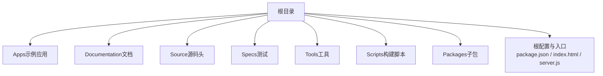
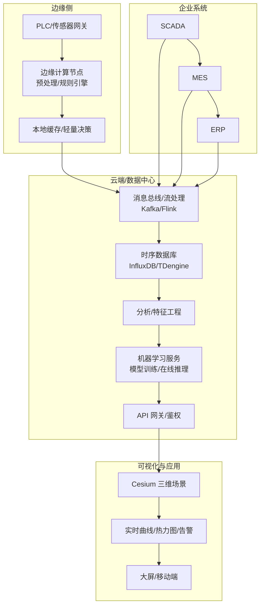
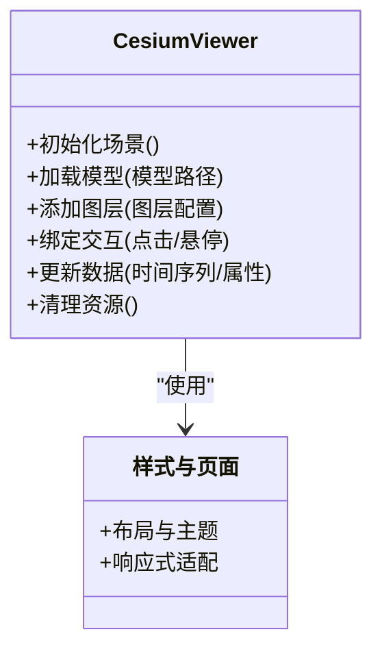
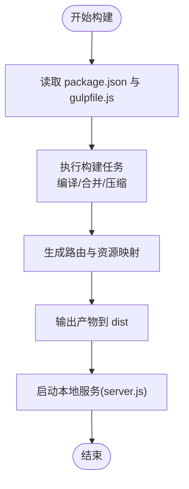
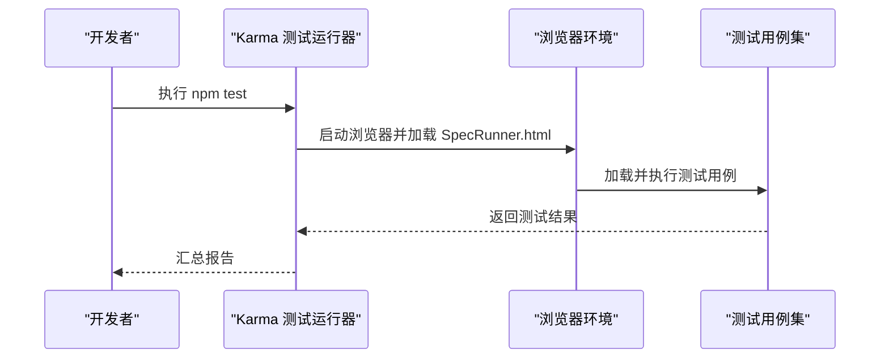
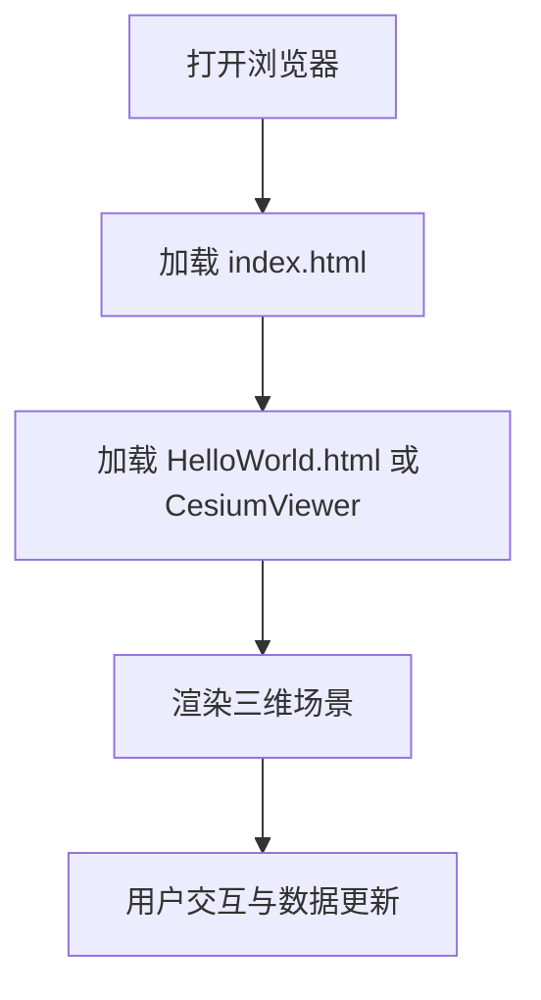
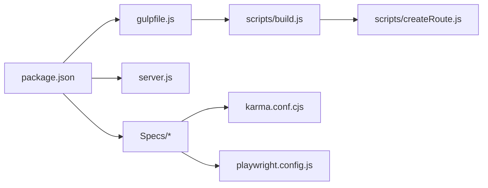

# 工业数字孪生

<cite>
**本文引用的文件**   
- [README.md](file://README.md)
- [index.html](file://index.html)
- [server.js](file://server.js)
- [package.json](file://package.json)
- [CesiumViewer.js](file://Apps/CesiumViewer/CesiumViewer.js)
- [CesiumViewer.css](file://Apps/CesiumViewer/CesiumViewer.css)
- [index.html（示例应用）](file://Apps/CesiumViewer/index.html)
- [HelloWorld.html](file://Apps/HelloWorld.html)
- [gulpfile.js](file://gulpfile.js)
- [build.js](file://scripts/build.js)
- [createRoute.js](file://scripts/createRoute.js)
- [SpecRunner.html](file://Specs/SpecRunner.html)
- [karma.conf.cjs](file://Specs/karma.conf.cjs)
- [playwright.config.js](file://Specs/e2e/playwright.config.js)
</cite>

## 目录
1. [简介](#简介)
2. [项目结构](#项目结构)
3. [核心组件](#核心组件)
4. [架构总览](#架构总览)
5. [详细组件分析](#详细组件分析)
6. [依赖分析](#依赖分析)
7. [性能考虑](#性能考虑)
8. [故障排查指南](#故障排查指南)
9. [结论](#结论)
10. [附录](#附录)

## 简介
本方案以 CesiumJS 为核心，构建面向工业领域的数字孪生平台。围绕工厂设备三维建模、生产流程仿真、设备状态监控与故障预测等工业4.0场景，提供从边缘采集到云端可视化的完整链路：包括工业物联网数据接入、时序数据库集成、实时数据分析、机器学习模型部署、高性能可视化渲染以及与企业系统（SCADA/MES/ERP）的集成。同时满足安全隔离、数据加密与访问控制等工业级要求。

## 项目结构
仓库采用“引擎+示例应用+文档+测试”的分层组织方式：
- 引擎与资源：包含构建脚本、示例应用、测试套件与工具链
- 示例应用：CesiumViewer 与 HelloWorld 展示典型用法
- 测试：单元测试与端到端测试覆盖渲染、交互与数据加载路径
- 构建与发布：Gulp 任务、打包脚本与本地服务器

图表来源
- [package.json:1-200](file://package.json#L1-L200)
- [index.html:1-200](file://index.html#L1-L200)
- [server.js:1-200](file://server.js#L1-L200)

章节来源
- [README.md:1-200](file://README.md#L1-L200)
- [package.json:1-200](file://package.json#L1-L200)
- [index.html:1-200](file://index.html#L1-L200)
- [server.js:1-200](file://server.js#L1-L200)

## 核心组件
- 示例应用与视图
  - CesiumViewer：封装了初始化、图层管理、交互与数据绑定的示例实现
  - 样式与页面：CesiumViewer.css 与 index.html 提供基础布局与主题
- 构建与运行
  - Gulp 任务：gulpfile.js 定义构建、压缩、合并与发布流程
  - 构建脚本：scripts/build.js、scripts/createRoute.js 负责产物生成与路由
  - 本地服务：server.js 提供开发期静态资源服务
- 测试体系
  - 单元测试：SpecRunner.html + karma.conf.cjs
  - 端到端：Specs/e2e/playwright.config.js 驱动浏览器自动化

章节来源
- [CesiumViewer.js:1-200](file://Apps/CesiumViewer/CesiumViewer.js#L1-L200)
- [CesiumViewer.css:1-200](file://Apps/CesiumViewer/CesiumViewer.css#L1-L200)
- [index.html（示例应用）:1-200](file://Apps/CesiumViewer/index.html#L1-L200)
- [gulpfile.js:1-200](file://gulpfile.js#L1-L200)
- [build.js:1-200](file://scripts/build.js#L1-L200)
- [createRoute.js:1-200](file://scripts/createRoute.js#L1-L200)
- [server.js:1-200](file://server.js#L1-L200)
- [SpecRunner.html:1-200](file://Specs/SpecRunner.html#L1-L200)
- [karma.conf.cjs:1-200](file://Specs/karma.conf.cjs#L1-L200)
- [playwright.config.js:1-200](file://Specs/e2e/playwright.config.js#L1-L200)

## 架构总览
下图给出工业数字孪生的总体架构，涵盖边缘采集、流式处理、数据存储、分析与推理、可视化呈现与企业系统集成。

[此图为概念性架构图，不直接映射具体源文件]

## 详细组件分析

### 组件A：CesiumViewer 示例应用
该组件演示如何初始化场景、加载模型与数据、绑定交互事件与更新管线，适合作为工业数字孪生前端基座。

图表来源
- [CesiumViewer.js:1-200](file://Apps/CesiumViewer/CesiumViewer.js#L1-L200)
- [CesiumViewer.css:1-200](file://Apps/CesiumViewer/CesiumViewer.css#L1-L200)
- [index.html（示例应用）:1-200](file://Apps/CesiumViewer/index.html#L1-L200)

章节来源
- [CesiumViewer.js:1-200](file://Apps/CesiumViewer/CesiumViewer.js#L1-L200)
- [CesiumViewer.css:1-200](file://Apps/CesiumViewer/CesiumViewer.css#L1-L200)
- [index.html（示例应用）:1-200](file://Apps/CesiumViewer/index.html#L1-L200)

### 组件B：构建与运行流水线
通过 Gulp 与自定义脚本完成打包、压缩、合并与本地调试；server.js 提供开发期静态服务。

图表来源
- [gulpfile.js:1-200](file://gulpfile.js#L1-L200)
- [build.js:1-200](file://scripts/build.js#L1-L200)
- [createRoute.js:1-200](file://scripts/createRoute.js#L1-L200)
- [server.js:1-200](file://server.js#L1-L200)
- [package.json:1-200](file://package.json#L1-L200)

章节来源
- [gulpfile.js:1-200](file://gulpfile.js#L1-L200)
- [build.js:1-200](file://scripts/build.js#L1-L200)
- [createRoute.js:1-200](file://scripts/createRoute.js#L1-L200)
- [server.js:1-200](file://server.js#L1-L200)
- [package.json:1-200](file://package.json#L1-L200)

### 组件C：测试与质量保障
- 单元测试：SpecRunner.html 作为测试入口，karma.conf.cjs 配置运行环境与断言
- 端到端：playwright.config.js 驱动浏览器进行 UI 与交互验证

图表来源
- [SpecRunner.html:1-200](file://Specs/SpecRunner.html#L1-L200)
- [karma.conf.cjs:1-200](file://Specs/karma.conf.cjs#L1-L200)
- [playwright.config.js:1-200](file://Specs/e2e/playwright.config.js#L1-L200)

章节来源
- [SpecRunner.html:1-200](file://Specs/SpecRunner.html#L1-L200)
- [karma.conf.cjs:1-200](file://Specs/karma.conf.cjs#L1-L200)
- [playwright.config.js:1-200](file://Specs/e2e/playwright.config.js#L1-L200)

### 组件D：快速上手示例
- HelloWorld.html：最小化示例，便于快速验证环境
- 根 index.html：默认入口页面，用于本地预览

图表来源
- [HelloWorld.html:1-200](file://Apps/HelloWorld.html#L1-L200)
- [index.html:1-200](file://index.html#L1-L200)

章节来源
- [HelloWorld.html:1-200](file://Apps/HelloWorld.html#L1-L200)
- [index.html:1-200](file://index.html#L1-L200)

## 依赖分析
- 运行时依赖
  - Node.js 与 npm/yarn：用于安装依赖与执行构建脚本
  - Gulp 生态：gulpfile.js 定义任务编排
  - 浏览器端：CesiumJS 渲染引擎（由示例应用引入）
- 开发与测试依赖
  - Karma + Jasmine（推测）：单元测试框架与运行器
  - Playwright：端到端自动化测试
- 构建产物
  - 通过 build.js 与 createRoute.js 生成可部署资源

图表来源
- [package.json:1-200](file://package.json#L1-L200)
- [gulpfile.js:1-200](file://gulpfile.js#L1-L200)
- [build.js:1-200](file://scripts/build.js#L1-L200)
- [createRoute.js:1-200](file://scripts/createRoute.js#L1-L200)
- [server.js:1-200](file://server.js#L1-L200)
- [karma.conf.cjs:1-200](file://Specs/karma.conf.cjs#L1-L200)
- [playwright.config.js:1-200](file://Specs/e2e/playwright.config.js#L1-L200)

章节来源
- [package.json:1-200](file://package.json#L1-L200)
- [gulpfile.js:1-200](file://gulpfile.js#L1-L200)
- [build.js:1-200](file://scripts/build.js#L1-L200)
- [createRoute.js:1-200](file://scripts/createRoute.js#L1-L200)
- [server.js:1-200](file://server.js#L1-L200)
- [karma.conf.cjs:1-200](file://Specs/karma.conf.cjs#L1-L200)
- [playwright.config.js:1-200](file://Specs/e2e/playwright.config.js#L1-L200)

## 性能考虑
- 三维场景优化
  - 使用 3D Tiles 与 glTF 模型按需加载与细节层次（LOD）
  - 合理设置视锥剔除、遮挡剔除与纹理压缩（如 KTX2/Basis）
- 大数据量渲染
  - 点云/矢量瓦片分块加载与增量更新
  - 批量绘制与实例化渲染减少 Draw Call
- 实时数据更新
  - 使用 Web Worker 或 OffscreenCanvas 降低主线程压力
  - 节流/去抖与增量渲染策略，避免频繁重建对象
- 网络与存储
  - CDN 加速与 HTTP/2 多路复用
  - 服务端缓存与断点续传，提升首屏与回放体验
- 内存与稳定性
  - 及时释放不再使用的纹理、几何体与监听器
  - 错误边界与降级策略，保证长时间运行的稳定性

[本节为通用指导，无需特定文件引用]

## 故障排查指南
- 构建失败
  - 检查 Node 版本与依赖是否匹配
  - 查看 Gulp 任务日志与构建脚本输出
- 本地服务无法访问
  - 确认端口占用与 CORS 配置
  - 检查 server.js 静态目录映射是否正确
- 示例应用白屏或报错
  - 在浏览器控制台查看资源加载与脚本错误
  - 核对 index.html 与 CesiumViewer 的资源路径
- 测试异常
  - 使用 SpecRunner.html 单独运行用例定位问题
  - 调整 playwright 配置与浏览器驱动版本

章节来源
- [gulpfile.js:1-200](file://gulpfile.js#L1-L200)
- [build.js:1-200](file://scripts/build.js#L1-L200)
- [server.js:1-200](file://server.js#L1-L200)
- [index.html:1-200](file://index.html#L1-L200)
- [CesiumViewer.js:1-200](file://Apps/CesiumViewer/CesiumViewer.js#L1-L200)
- [SpecRunner.html:1-200](file://Specs/SpecRunner.html#L1-L200)
- [playwright.config.js:1-200](file://Specs/e2e/playwright.config.js#L1-L200)

## 结论
基于 CesiumJS 的数字孪生平台具备强大的三维可视化能力，结合边缘计算、流式处理与时序数据库，可实现从数据采集到智能决策的全链路闭环。通过完善的构建与测试体系，平台具备良好的可维护性与可扩展性，能够支撑工厂设备建模、流程仿真、实时监控与预测性维护等关键业务场景。

## 附录
- 快速开始
  - 安装依赖并启动本地服务
  - 打开 index.html 或 CesiumViewer 示例页面
- 扩展建议
  - 接入 MQTT/OPC UA 网关，统一设备协议
  - 集成 InfluxDB/TDengine 与 Grafana 看板
  - 部署机器学习服务（Python/ONNX/TensorRT）并提供 REST/gRPC API
  - 增加 RBAC 与审计日志，满足合规与安全要求

[本节为补充信息，无需特定文件引用]