# 建筑信息模型可视化

<cite>
**本文档引用的文件**   
- [README.md](file://README.md)
- [package.json](file://package.json)
- [index.html](file://index.html)
- [server.js](file://server.js)
- [CesiumViewer.js](file://Apps/CesiumViewer/CesiumViewer.js)
- [index.html](file://Apps/CesiumViewer/index.html)
- [Cesium3DTilesTester.js](file://Specs/Cesium3DTilesTester.js)
- [createScene.js](file://Specs/createScene.js)
- [pick.js](file://Specs/pick.js)
</cite>

## 目录
1. [简介](#简介)
2. [项目结构](#项目结构)
3. [核心组件](#核心组件)
4. [架构总览](#架构总览)
5. [详细组件分析](#详细组件分析)
6. [依赖关系分析](#依赖关系分析)
7. [性能与优化](#性能与优化)
8. [故障排查指南](#故障排查指南)
9. [结论](#结论)
10. [附录](#附录)

## 简介
本仓库为 CesiumJS 三维地球与场景引擎，提供大规模地理空间数据与三维模型的渲染能力。围绕“建筑信息模型(BIM)的三维可视化系统”目标，本项目可作为前端可视化底座，结合后端解析管线（如 IFC/Revit 转 glTF/3D Tiles）实现从建模到可视化的完整链路。典型流程包括：
- 数据接入：IFC、Revit 等 BIM 格式经转换服务输出为 glTF/GLB 或 3D Tiles；
- 层级管理：通过 3D Tiles Hierarchy 与 BatchTable 表达构件树与属性；
- 查询与交互：拾取、属性查询、分类显示；
- 碰撞检测：在客户端进行几何包围体快速筛选与精确求交；
- 轻量化与渲染优化：Draco/KTX2 压缩、LOD、实例化、批渲染；
- 工程管理与协同：版本化资源、变更追踪、多专业协作；
- 集成方案：与 CAD、施工管理系统对接，支持进度模拟、工程量统计、运维管理；
- 移动端与 AR/VR：WebGL 跨平台，可结合 WebXR 扩展。

[本节不直接分析具体源文件]

## 项目结构
仓库采用模块化组织，包含示例应用、测试数据、规范与脚本工具等。面向 BIM 可视化的关键目录与文件如下：
- Apps/CesiumViewer：示例查看器入口与样式脚本
- Specs：测试与样例数据，含大量 3D Tiles、glTF、点云、矢量等用例
- Scripts/Gulp：构建与打包脚本
- 根级 index.html/server.js：本地开发服务器与默认页面

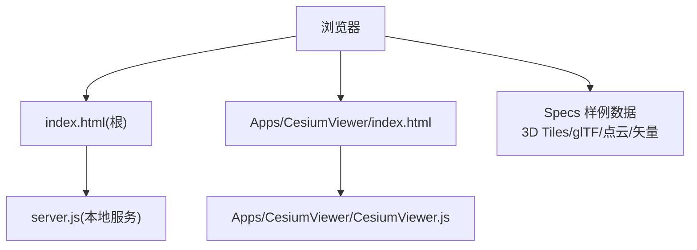

图表来源
- [index.html](file://index.html)
- [server.js](file://server.js)
- [Apps/CesiumViewer/index.html](file://Apps/CesiumViewer/index.html)
- [Apps/CesiumViewer/CesiumViewer.js](file://Apps/CesiumViewer/CesiumViewer.js)

章节来源
- [index.html](file://index.html)
- [server.js](file://server.js)
- [Apps/CesiumViewer/index.html](file://Apps/CesiumViewer/index.html)
- [Apps/CesiumViewer/CesiumViewer.js](file://Apps/CesiumViewer/CesiumViewer.js)

## 核心组件
- 场景与渲染管线：负责 WebGL 上下文、相机、光照、材质、着色器与帧循环
- 数据加载器：3D Tiles、glTF/GLB、点云、地形、影像等
- 层级与元数据：3D Tiles Hierarchy、BatchTable、Metadata 扩展
- 交互与拾取：射线拾取、命中检测、属性查询
- 工具与测试：构造 Scene、Camera、TileKey 等测试辅助

章节来源
- [Cesium3DTilesTester.js](file://Specs/Cesium3DTilesTester.js)
- [createScene.js](file://Specs/createScene.js)
- [pick.js](file://Specs/pick.js)

## 架构总览
下图展示从 BIM 数据到前端可视化的端到端架构，强调数据转换、分层加载、渲染与交互的关键环节。

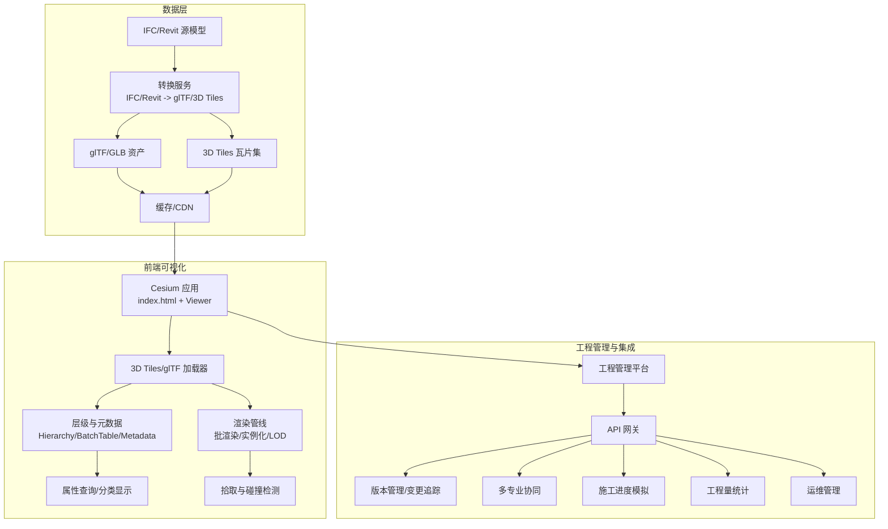

图表来源
- [index.html](file://index.html)
- [server.js](file://server.js)
- [Apps/CesiumViewer/index.html](file://Apps/CesiumViewer/index.html)
- [Apps/CesiumViewer/CesiumViewer.js](file://Apps/CesiumViewer/CesiumViewer.js)
- [Cesium3DTilesTester.js](file://Specs/Cesium3DTilesTester.js)
- [createScene.js](file://Specs/createScene.js)
- [pick.js](file://Specs/pick.js)

## 详细组件分析

### 3D Tiles 与层级结构管理
- 作用：以分块瓦片组织海量模型，支持按需加载、动态细化与内存回收
- 关键点：tileset.json 描述根节点与子节点、几何误差、包围体、内容引用；Hierarchy 与 BatchTable 承载构件树与属性表
- 适用场景：大型建筑模型、城市级 BIM 聚合、点云与体素

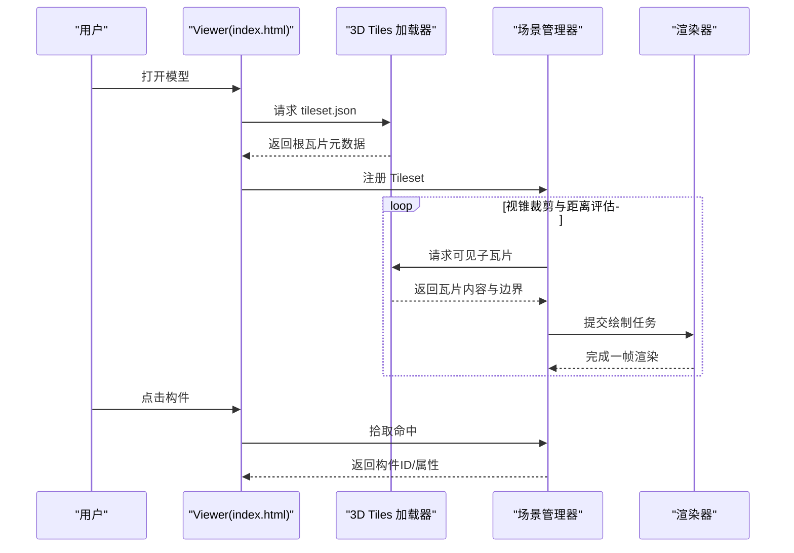

图表来源
- [Cesium3DTilesTester.js](file://Specs/Cesium3DTilesTester.js)
- [createScene.js](file://Specs/createScene.js)

章节来源
- [Cesium3DTilesTester.js](file://Specs/Cesium3DTilesTester.js)
- [createScene.js](file://Specs/createScene.js)

### glTF/GLB 模型加载与材质贴图优化
- 作用：高效加载网格、材质、动画与纹理，支持 Draco 几何压缩与 KTX2 纹理压缩
- 关键点：纹理尺寸降采样、Mipmap、共享纹理、按需加载外部资源
- 适用场景：单体构件、设备族库、装配体

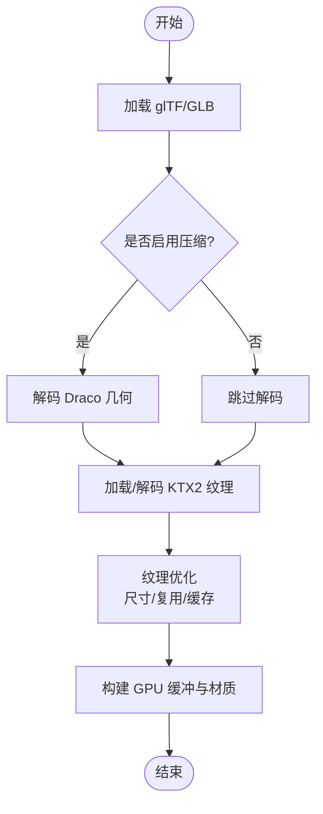

图表来源
- [Apps/CesiumViewer/CesiumViewer.js](file://Apps/CesiumViewer/CesiumViewer.js)
- [Apps/CesiumViewer/index.html](file://Apps/CesiumViewer/index.html)

章节来源
- [Apps/CesiumViewer/CesiumViewer.js](file://Apps/CesiumViewer/CesiumViewer.js)
- [Apps/CesiumViewer/index.html](file://Apps/CesiumViewer/index.html)

### 属性信息查询与分类显示
- 作用：基于 BatchTable/Hierarchy/Metadata 读取构件属性，按类别过滤与高亮
- 关键点：属性索引、批量更新、UI 联动
- 适用场景：构件清单、材料统计、维护记录

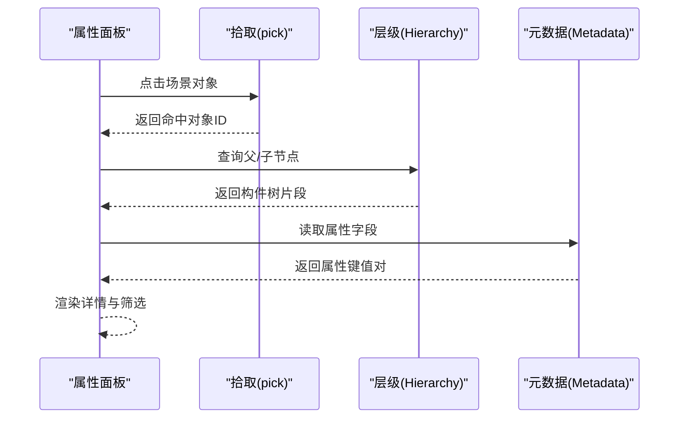

图表来源
- [pick.js](file://Specs/pick.js)
- [Cesium3DTilesTester.js](file://Specs/Cesium3DTilesTester.js)

章节来源
- [pick.js](file://Specs/pick.js)
- [Cesium3DTilesTester.js](file://Specs/Cesium3DTilesTester.js)

### 碰撞检测与空间分析
- 作用：用于管线碰撞、净空检查、安装路径规划
- 关键点：先做包围体快速剔除，再做精确求交；利用层次结构与 LOD 降低计算量
- 适用场景：机电管线综合、设备检修通道、吊装路径

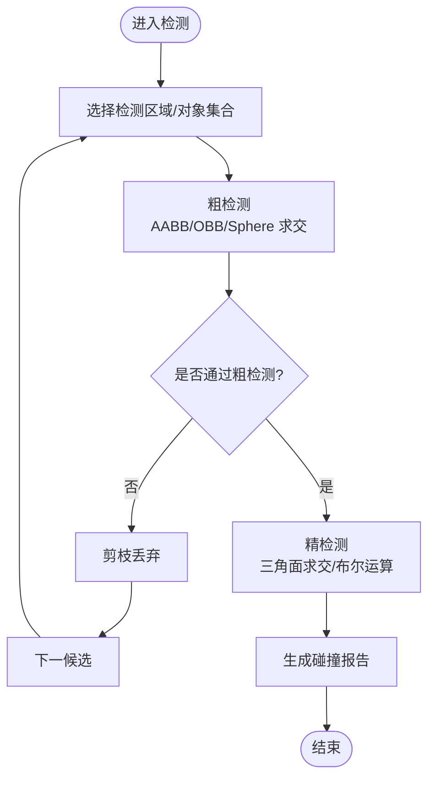

图表来源
- [pick.js](file://Specs/pick.js)
- [Cesium3DTilesTester.js](file://Specs/Cesium3DTilesTester.js)

章节来源
- [pick.js](file://Specs/pick.js)
- [Cesium3DTilesTester.js](file://Specs/Cesium3DTilesTester.js)

### 工程管理平台与多专业协同
- 作用：统一模型与数据入口，支撑版本管理、变更追踪、权限与协作
- 关键点：资源版本化、差异对比、审批流、审计日志
- 适用场景：设计院、总包、业主、运维多方协作

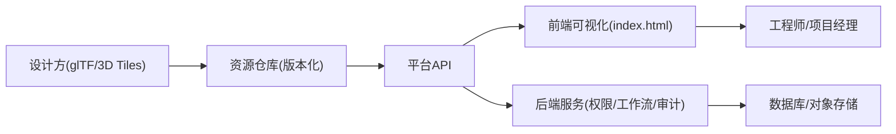

图表来源
- [index.html](file://index.html)
- [server.js](file://server.js)

章节来源
- [index.html](file://index.html)
- [server.js](file://server.js)

### 与 CAD/施工管理系统的数据集成
- 集成方式：REST/GraphQL API、消息队列、Webhook
- 数据契约：构件编码、坐标参考系、时间戳、版本哈希
- 同步策略：增量同步、冲突合并、回滚机制

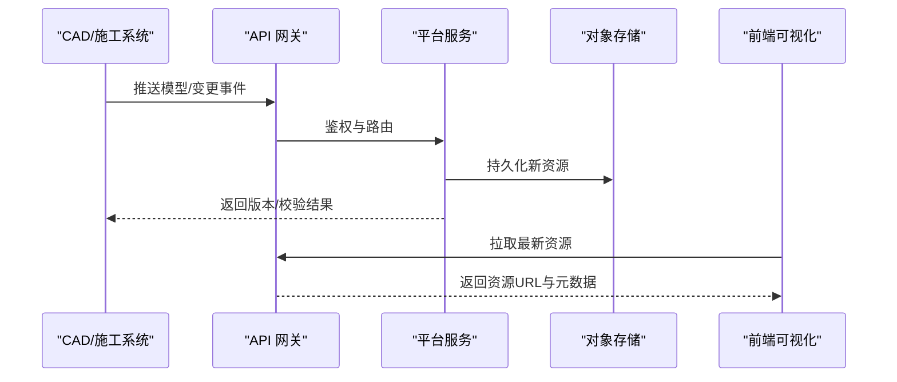

图表来源
- [server.js](file://server.js)
- [index.html](file://index.html)

章节来源
- [server.js](file://server.js)
- [index.html](file://index.html)

### 施工进度模拟、工程量统计、运维管理
- 进度模拟：将时间轴与构件状态绑定，驱动显隐/颜色/透明度变化
- 工程量统计：基于属性表聚合统计，导出报表
- 运维管理：设备台账、巡检记录、告警关联构件

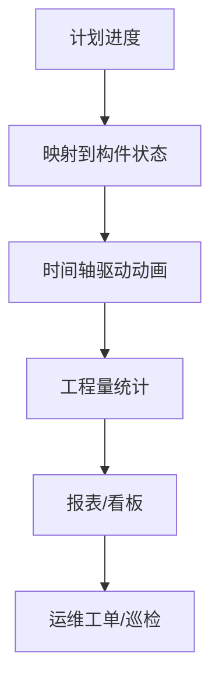

图表来源
- [Apps/CesiumViewer/CesiumViewer.js](file://Apps/CesiumViewer/CesiumViewer.js)
- [Apps/CesiumViewer/index.html](file://Apps/CesiumViewer/index.html)

章节来源
- [Apps/CesiumViewer/CesiumViewer.js](file://Apps/CesiumViewer/CesiumViewer.js)
- [Apps/CesiumViewer/index.html](file://Apps/CesiumViewer/index.html)

### 移动端查看器与 AR/VR 集成
- 移动端：自适应分辨率、触控交互、离线缓存
- AR/VR：WebXR 会话、空间锚点、手势交互
- 注意：GPU 能力限制、功耗与发热控制

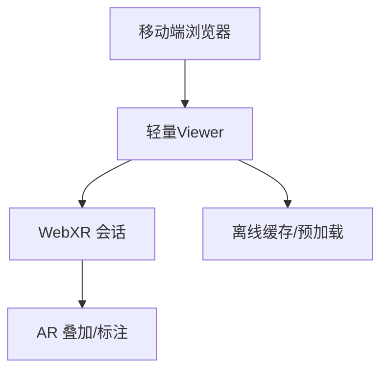

图表来源
- [Apps/CesiumViewer/index.html](file://Apps/CesiumViewer/index.html)
- [Apps/CesiumViewer/CesiumViewer.js](file://Apps/CesiumViewer/CesiumViewer.js)

章节来源
- [Apps/CesiumViewer/index.html](file://Apps/CesiumViewer/index.html)
- [Apps/CesiumViewer/CesiumViewer.js](file://Apps/CesiumViewer/CesiumViewer.js)

## 依赖关系分析
- 运行时依赖：浏览器 WebGL/WebXR、HTTP/HTTPS、可选 WASM 解码器
- 模块依赖：Viewer、3D Tiles、glTF、Pick、Scene、Camera、Resource 等
- 构建依赖：Gulp、Rollup、ESLint、JSDoc 等

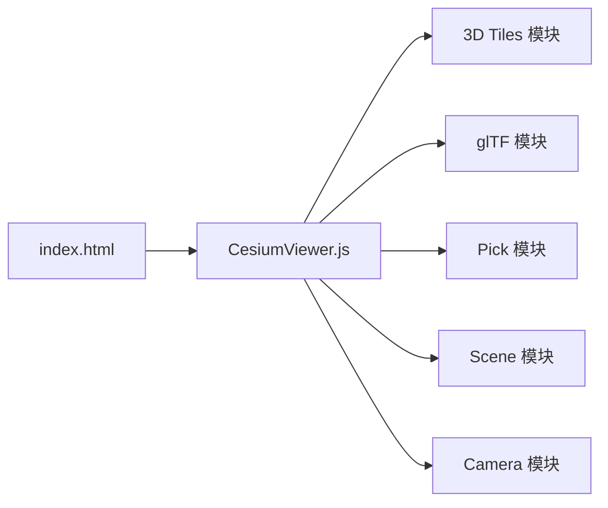

图表来源
- [index.html](file://index.html)
- [Apps/CesiumViewer/CesiumViewer.js](file://Apps/CesiumViewer/CesiumViewer.js)

章节来源
- [index.html](file://index.html)
- [Apps/CesiumViewer/CesiumViewer.js](file://Apps/CesiumViewer/CesiumViewer.js)

## 性能与优化
- 模型轻量化
  - 几何压缩：Draco
  - 纹理压缩：KTX2/Basis
  - 实例化与批渲染：减少 draw call
  - LOD 自动生成：依据距离与屏幕占比切换细节
- 数据组织
  - 3D Tiles 分块与隐式瓦片
  - 合理划分包围体与几何误差
  - 共享纹理与图集
- 渲染优化
  - 视锥裁剪与遮挡剔除
  - 延迟加载与内存回收
  - 材质简化与无光照模式
- 网络优化
  - CDN 分发、HTTP/2、缓存头
  - 增量下载与断点续传

[本节提供通用指导，不直接分析具体源文件]

## 故障排查指南
- 常见问题
  - 模型不显示：检查 tileset.json 路径、CORS、证书与端口
  - 卡顿掉帧：开启 Draco/KTX2、降低纹理尺寸、减少同时加载瓦片数
  - 属性为空：确认 BatchTable/Metadata 字段名一致
  - 拾取失败：检查命中对象 ID 映射与层级关系
- 定位方法
  - 使用控制台日志与 Network 面板观察资源加载
  - 使用 Specs 中的 createScene/pick 辅助构造最小复现
  - 逐步关闭特效与后处理验证瓶颈

章节来源
- [createScene.js](file://Specs/createScene.js)
- [pick.js](file://Specs/pick.js)
- [Cesium3DTilesTester.js](file://Specs/Cesium3DTilesTester.js)

## 结论
CesiumJS 提供了强大的三维可视化基础能力，结合 IFC/Revit 到 glTF/3D Tiles 的转换管线，可实现大型 BIM 模型的高效浏览、查询与分析。通过合理的轻量化策略、层级组织与工程化管理，能够支撑多专业协同、版本化交付与全生命周期应用。移动端与 AR/VR 的扩展进一步拓展了现场作业与远程协作的场景。

[本节总结性内容，不直接分析具体源文件]

## 附录
- 术语
  - IFC：Industry Foundation Classes，开放的建筑信息模型标准
  - Revit：Autodesk 建筑信息建模软件
  - glTF/GLB：Web 3D 模型交换格式
  - 3D Tiles：大规模 3D 地理空间数据的开放标准
- 建议实践
  - 建立统一的构件编码与属性字典
  - 制定模型拆分与命名规范
  - 引入自动化质量检查与回归测试
  - 建立资源版本与发布流水线

[本节为概念性内容，不直接分析具体源文件]