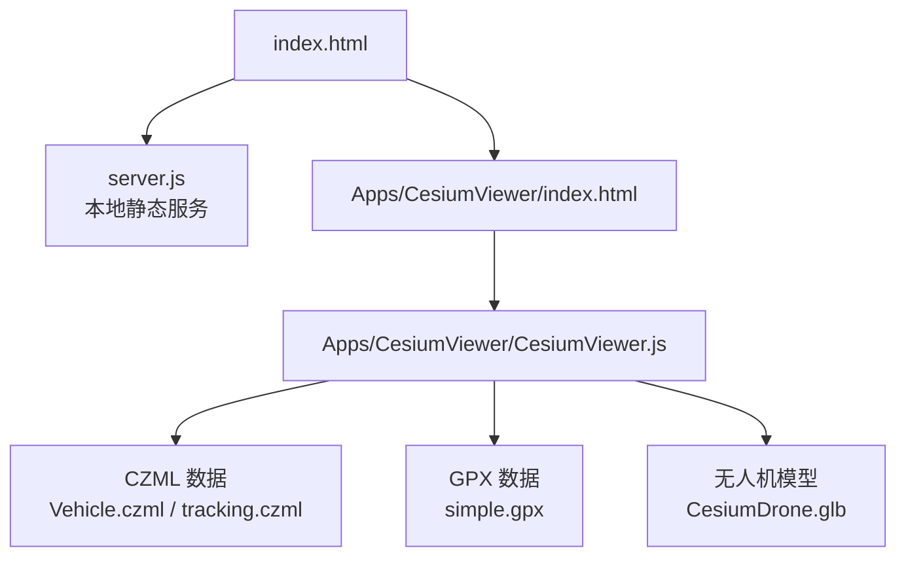
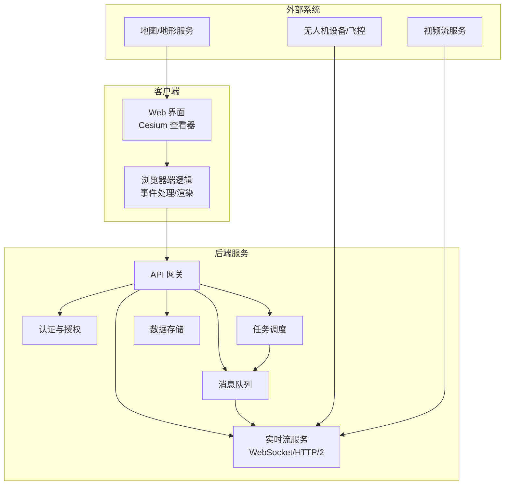
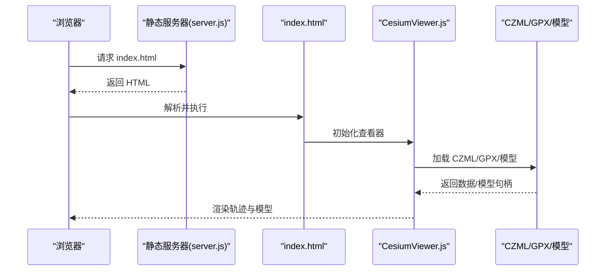
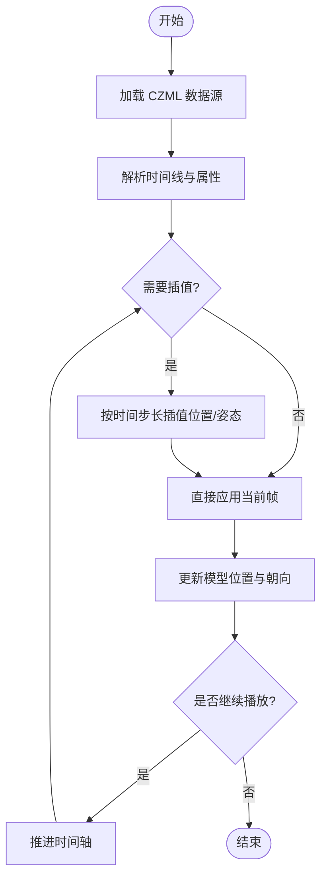
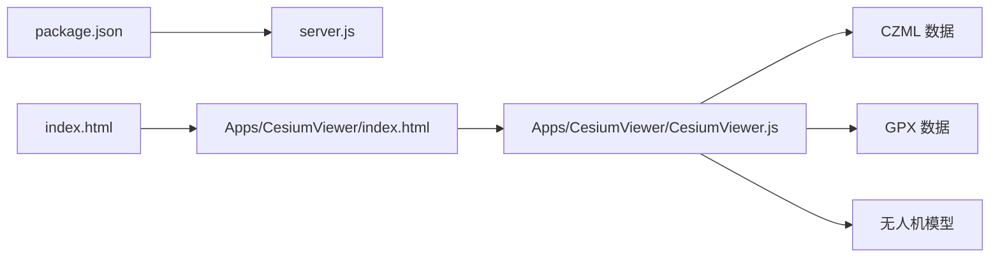

# 无人机监控系统

<cite>
**本文引用的文件**   
- [README.md](file://README.md)
- [server.js](file://server.js)
- [index.html](file://index.html)
- [Apps/CesiumViewer/index.html](file://Apps/CesiumViewer/index.html)
- [Apps/CesiumViewer/CesiumViewer.js](file://Apps/CesiumViewer/CesiumViewer.js)
- [Apps/SampleData/CZML/Vehicle.czml](file://Apps/SampleData/CZML/Vehicle.czml)
- [Apps/SampleData/CZML/tracking.czml](file://Apps/SampleData/CZML/tracking.czml)
- [Apps/SampleData/gpx/simple.gpx](file://Apps/SampleData/gpx/simple.gpx)
- [Apps/SampleData/models/CesiumDrone/CesiumDrone.glb](file://Apps/SampleData/models/CesiumDrone/CesiumDrone.glb)
- [package.json](file://package.json)
</cite>

## 目录
1. [简介](#简介)
2. [项目结构](#项目结构)
3. [核心组件](#核心组件)
4. [架构总览](#架构总览)
5. [详细组件分析](#详细组件分析)
6. [依赖关系分析](#依赖关系分析)
7. [性能考虑](#性能考虑)
8. [故障排查指南](#故障排查指南)
9. [结论](#结论)
10. [附录](#附录)

## 简介
本仓库为基于 CesiumJS 的三维地理可视化工程，提供丰富的示例数据与工具链。围绕“实时无人机监控与管理”的目标，本仓库可作为前端可视化与轨迹回放的基础平台：支持 CZML 时间序列数据、GPX 轨迹回放、多模型（含无人机 glTF）加载、以及通过本地服务器进行资源托管与演示。结合后端服务（消息队列、实时通信、任务调度等），可构建完整的无人机监控体系。

## 项目结构
- 应用入口与示例
  - index.html：根页面入口，便于快速启动与调试
  - Apps/CesiumViewer：Cesium 查看器示例，包含 HTML 与 JS 初始化逻辑
- 示例数据
  - Apps/SampleData/CZML：CZML 时间序列示例（车辆/跟踪等）
  - Apps/SampleData/gpx：GPX 轨迹示例
  - Apps/SampleData/models：glTF 模型（含无人机模型）
- 运行与服务
  - server.js：Node.js 本地静态资源服务器脚本
  - package.json：项目元信息与脚本定义
- 文档与规范
  - README.md：项目说明与使用指引

图表来源
- [index.html](file://index.html)
- [server.js](file://server.js)
- [Apps/CesiumViewer/index.html](file://Apps/CesiumViewer/index.html)
- [Apps/CesiumViewer/CesiumViewer.js](file://Apps/CesiumViewer/CesiumViewer.js)
- [Apps/SampleData/CZML/Vehicle.czml](file://Apps/SampleData/CZML/Vehicle.czml)
- [Apps/SampleData/CZML/tracking.czml](file://Apps/SampleData/CZML/tracking.czml)
- [Apps/SampleData/gpx/simple.gpx](file://Apps/SampleData/gpx/simple.gpx)
- [Apps/SampleData/models/CesiumDrone/CesiumDrone.glb](file://Apps/SampleData/models/CesiumDrone/CesiumDrone.glb)

章节来源
- [README.md](file://README.md)
- [server.js](file://server.js)
- [index.html](file://index.html)
- [Apps/CesiumViewer/index.html](file://Apps/CesiumViewer/index.html)
- [Apps/CesiumViewer/CesiumViewer.js](file://Apps/CesiumViewer/CesiumViewer.js)
- [package.json](file://package.json)

## 核心组件
- 本地静态服务
  - 作用：提供静态资源访问能力，支撑示例页面与数据文件的在线加载
  - 关键点：端口配置、静态目录映射、跨域与缓存策略
- Cesium 查看器示例
  - 作用：初始化地图、加载示例数据、展示轨迹与模型
  - 关键点：DataSource 加载 CZML/GPX、模型加载与定位、相机控制
- 示例数据
  - CZML：描述带时间的实体与轨迹，适合无人机位置序列与姿态变化
  - GPX：标准航迹格式，可用于历史轨迹回放
  - glTF 模型：无人机外观与朝向，配合位置与姿态实现真实感展示

章节来源
- [server.js](file://server.js)
- [Apps/CesiumViewer/index.html](file://Apps/CesiumViewer/index.html)
- [Apps/CesiumViewer/CesiumViewer.js](file://Apps/CesiumViewer/CesiumViewer.js)
- [Apps/SampleData/CZML/Vehicle.czml](file://Apps/SampleData/CZML/Vehicle.czml)
- [Apps/SampleData/CZML/tracking.czml](file://Apps/SampleData/CZML/tracking.czml)
- [Apps/SampleData/gpx/simple.gpx](file://Apps/SampleData/gpx/simple.gpx)
- [Apps/SampleData/models/CesiumDrone/CesiumDrone.glb](file://Apps/SampleData/models/CesiumDrone/CesiumDrone.glb)

## 架构总览
从“无人机监控与管理”的系统视角，可将现有仓库作为前端可视化层，结合后端微服务形成完整方案：

[此图为概念性架构图，不直接映射具体源码文件]

## 详细组件分析

### 本地静态服务（server.js）
- 职责
  - 提供静态资源访问，使 index.html 与示例数据可被浏览器加载
  - 支持开发环境下的热更新与调试
- 关键流程
  - 启动监听端口
  - 将指定目录映射为静态资源根路径
  - 响应浏览器请求并返回对应文件
- 建议扩展
  - 增加 HTTPS 支持
  - 增加反向代理以对接后端 API
  - 增加缓存头与压缩优化

章节来源
- [server.js](file://server.js)

### Cesium 查看器示例（Apps/CesiumViewer）
- 入口页面（index.html）
  - 引入 Cesium 资源与样式
  - 挂载查看器容器
- 初始化脚本（CesiumViewer.js）
  - 创建 Viewer 实例
  - 加载示例数据（CZML/GPX）
  - 加载无人机模型并绑定到轨迹点
  - 设置相机与交互行为
- 数据与模型
  - CZML：用于时间序列轨迹与属性更新
  - GPX：用于历史轨迹回放
  - glTF：无人机外观与朝向

图表来源
- [server.js](file://server.js)
- [Apps/CesiumViewer/index.html](file://Apps/CesiumViewer/index.html)
- [Apps/CesiumViewer/CesiumViewer.js](file://Apps/CesiumViewer/CesiumViewer.js)
- [Apps/SampleData/CZML/Vehicle.czml](file://Apps/SampleData/CZML/Vehicle.czml)
- [Apps/SampleData/CZML/tracking.czml](file://Apps/SampleData/CZML/tracking.czml)
- [Apps/SampleData/gpx/simple.gpx](file://Apps/SampleData/gpx/simple.gpx)
- [Apps/SampleData/models/CesiumDrone/CesiumDrone.glb](file://Apps/SampleData/models/CesiumDrone/CesiumDrone.glb)

章节来源
- [Apps/CesiumViewer/index.html](file://Apps/CesiumViewer/index.html)
- [Apps/CesiumViewer/CesiumViewer.js](file://Apps/CesiumViewer/CesiumViewer.js)
- [Apps/SampleData/CZML/Vehicle.czml](file://Apps/SampleData/CZML/Vehicle.czml)
- [Apps/SampleData/CZML/tracking.czml](file://Apps/SampleData/CZML/tracking.czml)
- [Apps/SampleData/gpx/simple.gpx](file://Apps/SampleData/gpx/simple.gpx)
- [Apps/SampleData/models/CesiumDrone/CesiumDrone.glb](file://Apps/SampleData/models/CesiumDrone/CesiumDrone.glb)

### CZML 时间序列数据处理
- 用途
  - 描述实体的位置、方向、颜色、标签等随时间变化的属性
  - 适用于无人机轨迹、姿态、状态上报
- 典型字段
  - 时间戳、经纬度、高度、航向角、俯仰角、滚转角
  - 自定义属性（电量、速度、告警状态等）
- 处理流程
  - 客户端加载 CZML 数据源
  - 解析时间线并插值计算中间帧
  - 驱动模型位置与朝向更新
  - 支持回放与实时追加

图表来源
- [Apps/SampleData/CZML/Vehicle.czml](file://Apps/SampleData/CZML/Vehicle.czml)
- [Apps/SampleData/CZML/tracking.czml](file://Apps/SampleData/CZML/tracking.czml)

章节来源
- [Apps/SampleData/CZML/Vehicle.czml](file://Apps/SampleData/CZML/Vehicle.czml)
- [Apps/SampleData/CZML/tracking.czml](file://Apps/SampleData/CZML/tracking.czml)

### GPX 轨迹回放
- 用途
  - 标准 GPS 轨迹格式，常用于历史飞行记录回放
- 处理要点
  - 解析 WPT/TRK/RTE 节点
  - 转换为时间序列或折线几何
  - 在地图上绘制轨迹并驱动模型移动
- 适用场景
  - 事后复盘、航线校验、异常回溯

章节来源
- [Apps/SampleData/gpx/simple.gpx](file://Apps/SampleData/gpx/simple.gpx)

### 无人机模型集成
- 模型来源
  - glTF 格式的无人机模型（CesiumDrone.glb）
- 集成方式
  - 在轨迹点上放置模型
  - 根据姿态属性调整朝向与倾斜
  - 可选添加阴影、材质与动画
- 注意事项
  - 模型坐标与地球坐标系对齐
  - 缩放与贴地处理
  - 多机并发时的渲染优化

章节来源
- [Apps/SampleData/models/CesiumDrone/CesiumDrone.glb](file://Apps/SampleData/models/CesiumDrone/CesiumDrone.glb)

## 依赖关系分析
- 运行时依赖
  - Node.js 环境用于启动静态服务器
  - 浏览器端依赖 CesiumJS 库（由示例页面引入）
- 模块耦合
  - 查看器示例与数据源解耦，便于替换数据格式或服务端接口
  - 模型与轨迹数据分离，便于复用与扩展
- 潜在扩展点
  - 将静态服务器升级为 API 网关，承载认证、鉴权与路由
  - 引入 WebSocket 推送实时位置与告警
  - 接入任务调度与持久化存储

图表来源
- [package.json](file://package.json)
- [server.js](file://server.js)
- [index.html](file://index.html)
- [Apps/CesiumViewer/index.html](file://Apps/CesiumViewer/index.html)
- [Apps/CesiumViewer/CesiumViewer.js](file://Apps/CesiumViewer/CesiumViewer.js)
- [Apps/SampleData/CZML/Vehicle.czml](file://Apps/SampleData/CZML/Vehicle.czml)
- [Apps/SampleData/gpx/simple.gpx](file://Apps/SampleData/gpx/simple.gpx)
- [Apps/SampleData/models/CesiumDrone/CesiumDrone.glb](file://Apps/SampleData/models/CesiumDrone/CesiumDrone.glb)

章节来源
- [package.json](file://package.json)
- [server.js](file://server.js)
- [index.html](file://index.html)
- [Apps/CesiumViewer/index.html](file://Apps/CesiumViewer/index.html)
- [Apps/CesiumViewer/CesiumViewer.js](file://Apps/CesiumViewer/CesiumViewer.js)

## 性能考虑
- 增量数据推送
  - 仅传输新增轨迹点与差异属性，降低带宽占用
  - 使用二进制或压缩格式（如 gzip/brotli）
- 客户端预测算法
  - 在网络抖动时采用线性/多项式插值平滑过渡
  - 对高频位置数据进行降采样与关键帧合并
- 网络抖动处理
  - 重连与退避策略
  - 断点续传与本地缓存
- 渲染优化
  - 批量更新与对象池复用
  - 视锥剔除与 LOD 切换
  - 纹理与模型压缩（KTX2/Draco）

[本节为通用性能建议，不直接分析具体源码文件]

## 故障排查指南
- 常见问题
  - 静态资源无法加载：检查 server.js 的静态目录映射与端口
  - 模型未显示：确认 glTF 路径与 CORS 设置
  - 轨迹不更新：核对 CZML/GPX 时间戳与时间轴范围
- 诊断步骤
  - 打开浏览器开发者工具，查看网络请求与错误日志
  - 验证数据文件格式与字段完整性
  - 逐步注释加载逻辑，定位问题模块

章节来源
- [server.js](file://server.js)
- [Apps/CesiumViewer/index.html](file://Apps/CesiumViewer/index.html)
- [Apps/CesiumViewer/CesiumViewer.js](file://Apps/CesiumViewer/CesiumViewer.js)

## 结论
本仓库提供了基于 CesiumJS 的三维可视化基础能力与丰富示例数据，适合作为无人机监控系统的可视化前端。结合后端微服务（认证、消息队列、任务调度、实时流、存储），可实现端到端的实时监控、轨迹回放、多机协同与视频流集成。建议在现有示例基础上，逐步引入增量推送、预测插值与渲染优化，以满足企业级高并发与低延迟需求。

## 附录
- 快速启动
  - 安装依赖后，运行本地静态服务器
  - 在浏览器中访问 index.html 或 CesiumViewer 示例页面
- 参考数据
  - CZML：Vehicle.czml、tracking.czml
  - GPX：simple.gpx
  - 模型：CesiumDrone.glb

章节来源
- [README.md](file://README.md)
- [package.json](file://package.json)
- [Apps/SampleData/CZML/Vehicle.czml](file://Apps/SampleData/CZML/Vehicle.czml)
- [Apps/SampleData/CZML/tracking.czml](file://Apps/SampleData/CZML/tracking.czml)
- [Apps/SampleData/gpx/simple.gpx](file://Apps/SampleData/gpx/simple.gpx)
- [Apps/SampleData/models/CesiumDrone/CesiumDrone.glb](file://Apps/SampleData/models/CesiumDrone/CesiumDrone.glb)