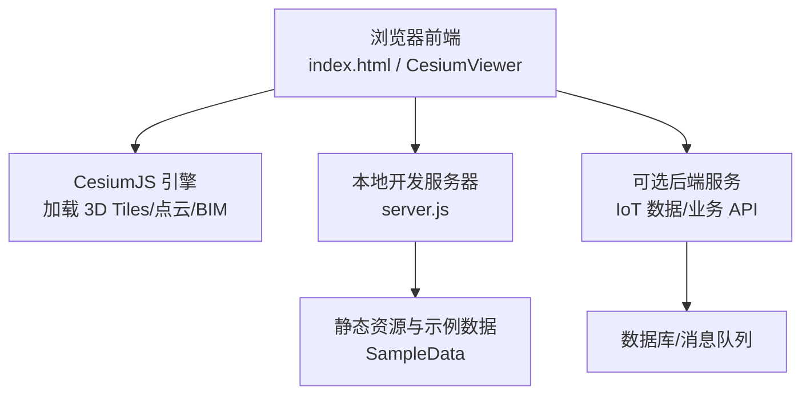
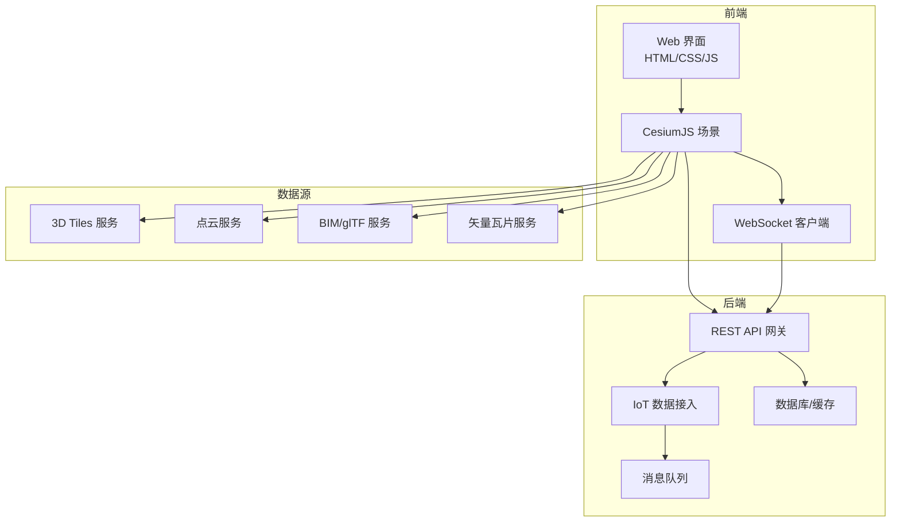
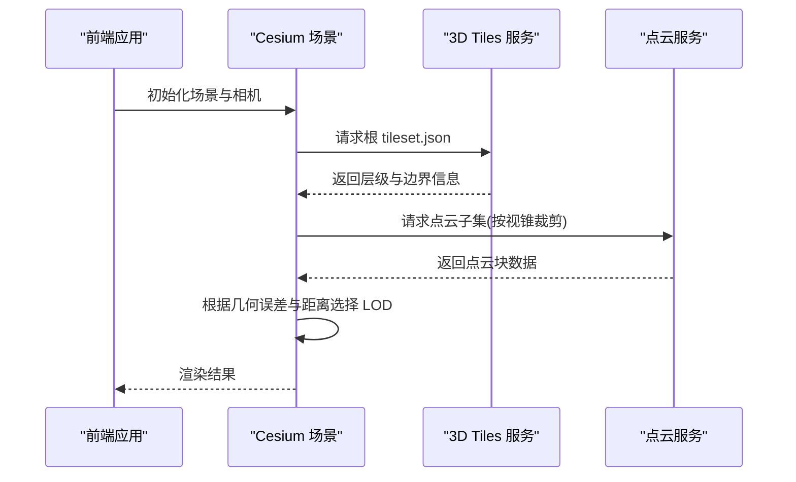
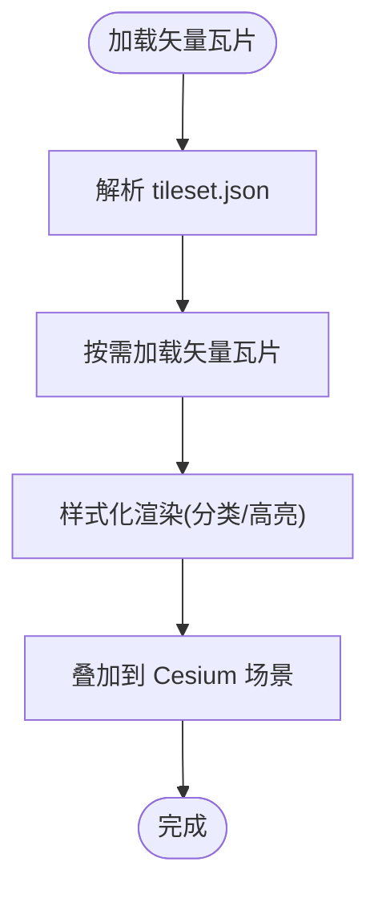
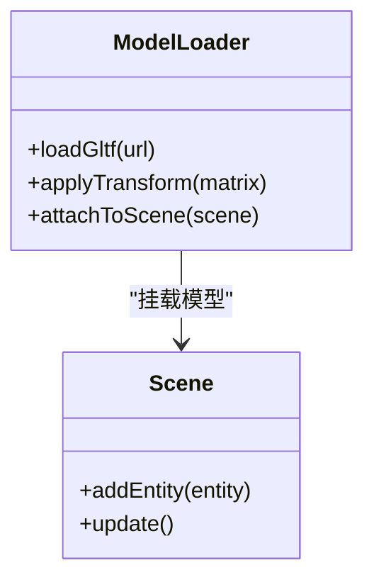
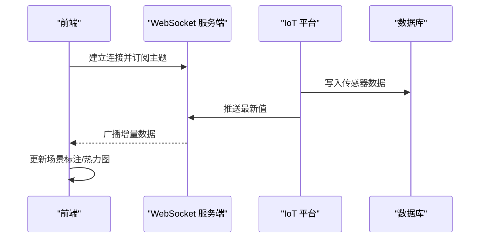
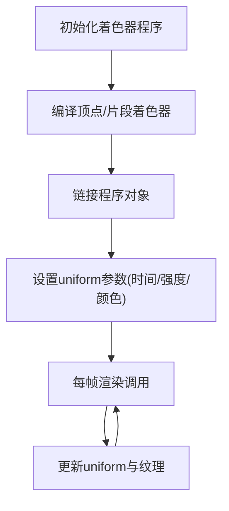
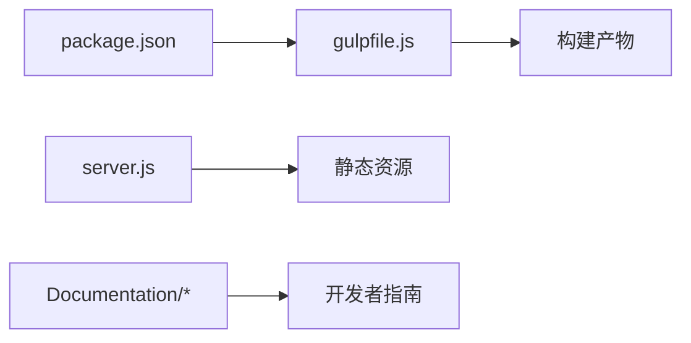

# 智慧城市数字孪生

<cite>
**本文引用的文件**   
- [README.md](file://README.md)
- [index.html](file://index.html)
- [server.js](file://server.js)
- [Apps/CesiumViewer/index.html](file://Apps/CesiumViewer/index.html)
- [Apps/CesiumViewer/CesiumViewer.js](file://Apps/CesiumViewer/CesiumViewer.js)
- [Apps/HelloWorld.html](file://Apps/HelloWorld.html)
- [package.json](file://package.json)
- [gulpfile.js](file://gulpfile.js)
- [Documentation/CustomShaderGuide/README.md](file://Documentation/CustomShaderGuide/README.md)
- [Documentation/Contributors/PerformanceTestingGuide/README.md](file://Documentation/Contributors/PerformanceTestingGuide/README.md)
- [Documentation/OfflineGuide/README.md](file://Documentation/OfflineGuide/README.md)
- [Apps/SampleData/Cesium3DTiles/PointCloud/PointCloudTimeDynamic/tileset.json](file://Apps/SampleData/Cesium3DTiles/PointCloud/PointCloudTimeDynamic/tileset.json)
- [Apps/SampleData/Cesium3DTiles/Tilesets/TilesetWithViewerRequestVolume/tileset.json](file://Apps/SampleData/Cesium3DTiles/Tilesets/TilesetWithViewerRequestVolume/tileset.json)
- [Apps/SampleData/vector/sample-cities-spain.tileset.json](file://Apps/SampleData/vector/sample-cities-spain.tileset.json)
</cite>

## 目录
1. [引言](#引言)
2. [项目结构](#项目结构)
3. [核心组件](#核心组件)
4. [架构总览](#架构总览)
5. [详细组件分析](#详细组件分析)
6. [依赖分析](#依赖分析)
7. [性能考虑](#性能考虑)
8. [故障排查指南](#故障排查指南)
9. [结论](#结论)
10. [附录](#附录)

## 引言
本案例基于 CesiumJS 工程，构建“智慧城市数字孪生”的完整实现方案。目标包括：
- 集成城市级 3D Tiles、点云扫描数据、BIM（glTF）模型与 IoT 传感器数据
- 大规模城市模型的 LOD 优化策略
- 实时交通流量可视化、建筑能耗监控、环境监测数据叠加
- 前后端分离架构、WebSocket 实时通信、数据库存储方案
- WebGL 着色器编程实现动态天气系统、时间序列动画、热力图渲染等高级效果
- 性能调优与企业级部署方案

该仓库提供了丰富的示例数据与工具链，可作为数字孪生应用的基座与参考实现。

## 项目结构
仓库采用多包与示例应用组织方式：
- Apps：示例应用与演示页面，包含 CesiumViewer 与 HelloWorld
- Documentation：官方文档，含自定义着色器指南、离线指南、性能测试指南等
- Scripts/Gulp：构建与打包脚本
- Server：本地开发服务器
- SampleData：大量 3D Tiles、点云、矢量瓦片、glTF 模型等示例数据

图表来源
- [index.html:1-200](file://index.html#L1-L200)
- [server.js:1-200](file://server.js#L1-L200)
- [Apps/CesiumViewer/index.html:1-200](file://Apps/CesiumViewer/index.html#L1-L200)
- [Apps/CesiumViewer/CesiumViewer.js:1-200](file://Apps/CesiumViewer/CesiumViewer.js#L1-L200)

章节来源
- [README.md:1-200](file://README.md#L1-L200)
- [index.html:1-200](file://index.html#L1-L200)
- [server.js:1-200](file://server.js#L1-L200)
- [Apps/CesiumViewer/index.html:1-200](file://Apps/CesiumViewer/index.html#L1-L200)
- [Apps/CesiumViewer/CesiumViewer.js:1-200](file://Apps/CesiumViewer/CesiumViewer.js#L1-L200)

## 核心组件
- 前端展示层
  - 入口页面 index.html 与 CesiumViewer 应用负责初始化场景、加载 3D Tiles、点云、BIM 模型与矢量数据
  - 通过 CesiumJS 提供的 API 管理图层、材质、相机与交互
- 数据与资源层
  - SampleData 提供 3D Tiles、点云、矢量瓦片、glTF 模型等示例数据，用于快速验证与演示
- 构建与服务层
  - gulpfile.js 与 scripts 提供构建、打包与开发服务器能力
  - server.js 提供本地静态资源服务，便于调试与联调
- 文档与规范
  - Documentation 提供自定义着色器、离线部署、性能测试等指导

章节来源
- [Apps/CesiumViewer/index.html:1-200](file://Apps/CesiumViewer/index.html#L1-L200)
- [Apps/CesiumViewer/CesiumViewer.js:1-200](file://Apps/CesiumViewer/CesiumViewer.js#L1-L200)
- [Apps/SampleData/Cesium3DTiles/PointCloud/PointCloudTimeDynamic/tileset.json:1-200](file://Apps/SampleData/Cesium3DTiles/PointCloud/PointCloudTimeDynamic/tileset.json#L1-L200)
- [Apps/SampleData/Cesium3DTiles/Tilesets/TilesetWithViewerRequestVolume/tileset.json:1-200](file://Apps/SampleData/Cesium3DTiles/Tilesets/TilesetWithViewerRequestVolume/tileset.json#L1-L200)
- [Apps/SampleData/vector/sample-cities-spain.tileset.json:1-200](file://Apps/SampleData/vector/sample-cities-spain.tileset.json#L1-L200)
- [gulpfile.js:1-200](file://gulpfile.js#L1-L200)
- [server.js:1-200](file://server.js#L1-L200)

## 架构总览
数字孪生系统采用前后端分离架构：
- 前端：基于 CesiumJS 的三维可视化与交互
- 后端：提供 IoT 数据、业务查询与聚合计算
- 数据源：3D Tiles、点云、BIM、矢量瓦片、时序数据
- 通信：HTTP/REST + WebSocket 实时推送
- 存储：关系型/时序数据库 + 对象存储（静态资源）

[此图为概念性架构图，不直接映射具体源码文件]

## 详细组件分析

### 3D Tiles 与点云集成
- 使用 tileset.json 描述层级结构与内容路径，支持按需加载与 LOD 切换
- 点云数据可附带颜色、法线、属性表，并支持 Draco 压缩与时间动态更新
- 结合 Viewer Request Volume 控制可视区域与请求范围，减少无效加载

图表来源
- [Apps/SampleData/Cesium3DTiles/PointCloud/PointCloudTimeDynamic/tileset.json:1-200](file://Apps/SampleData/Cesium3DTiles/PointCloud/PointCloudTimeDynamic/tileset.json#L1-L200)
- [Apps/SampleData/Cesium3DTiles/Tilesets/TilesetWithViewerRequestVolume/tileset.json:1-200](file://Apps/SampleData/Cesium3DTiles/Tilesets/TilesetWithViewerRequestVolume/tileset.json#L1-L200)

章节来源
- [Apps/SampleData/Cesium3DTiles/PointCloud/PointCloudTimeDynamic/tileset.json:1-200](file://Apps/SampleData/Cesium3DTiles/PointCloud/PointCloudTimeDynamic/tileset.json#L1-L200)
- [Apps/SampleData/Cesium3DTiles/Tilesets/TilesetWithViewerRequestVolume/tileset.json:1-200](file://Apps/SampleData/Cesium3DTiles/Tilesets/TilesetWithViewerRequestVolume/tileset.json#L1-L200)

### 矢量瓦片与城市要素
- 矢量瓦片 tileset.json 定义城市轮廓、道路、行政区等多维要素
- 可与 3D Tiles 叠加显示，形成“底图+要素”的分层体系

图表来源
- [Apps/SampleData/vector/sample-cities-spain.tileset.json:1-200](file://Apps/SampleData/vector/sample-cities-spain.tileset.json#L1-L200)

章节来源
- [Apps/SampleData/vector/sample-cities-spain.tileset.json:1-200](file://Apps/SampleData/vector/sample-cities-spain.tileset.json#L1-L200)

### BIM 模型（glTF）集成
- glTF 模型作为 BIM 载体，支持材质、纹理、动画与批处理
- 在场景中定位到地理坐标，并与 3D Tiles/点云融合展示

[此图为概念类图，不直接映射具体源码文件]

### IoT 传感器数据与实时通信
- 通过 REST API 获取历史与聚合数据
- 通过 WebSocket 接收实时流式数据，驱动场景内指标更新（如交通流量、能耗、环境指标）

[此图为概念流程图，不直接映射具体源码文件]

### 着色器与高级视觉效果
- 自定义着色器可用于动态天气、时间序列动画、热力图渲染等
- 参考官方自定义着色器指南进行扩展

章节来源
- [Documentation/CustomShaderGuide/README.md:1-200](file://Documentation/CustomShaderGuide/README.md#L1-L200)

### 前端应用与入口
- 入口页面 index.html 与 CesiumViewer 应用提供基础场景初始化与示例加载逻辑
- HelloWorld.html 提供最小可用示例

章节来源
- [index.html:1-200](file://index.html#L1-L200)
- [Apps/CesiumViewer/index.html:1-200](file://Apps/CesiumViewer/index.html#L1-L200)
- [Apps/CesiumViewer/CesiumViewer.js:1-200](file://Apps/CesiumViewer/CesiumViewer.js#L1-L200)
- [Apps/HelloWorld.html:1-200](file://Apps/HelloWorld.html#L1-L200)

## 依赖分析
- 构建与打包
  - package.json 声明依赖与脚本命令
  - gulpfile.js 定义构建任务与资源处理流程
- 运行与开发
  - server.js 提供本地静态资源服务，便于调试
- 文档与指南
  - Documentation 提供着色器、离线、性能测试等指导

图表来源
- [package.json:1-200](file://package.json#L1-L200)
- [gulpfile.js:1-200](file://gulpfile.js#L1-L200)
- [server.js:1-200](file://server.js#L1-L200)

章节来源
- [package.json:1-200](file://package.json#L1-L200)
- [gulpfile.js:1-200](file://gulpfile.js#L1-L200)
- [server.js:1-200](file://server.js#L1-L200)

## 性能考虑
- 3D Tiles 与点云
  - 合理设置几何误差阈值与最大屏幕空间误差
  - 启用 Draco 压缩与按需加载
  - 使用 Viewer Request Volume 限制请求范围
- 渲染与内存
  - 合并批次与共享纹理
  - 控制同时加载的瓦片数量与显存占用
- 网络与缓存
  - 启用 HTTP 缓存与 CDN
  - 对热点资源进行预取与分片
- 开发与测试
  - 使用性能测试指南进行基准评估与回归检测
  - 针对移动端与低端设备做降级策略

章节来源
- [Documentation/Contributors/PerformanceTestingGuide/README.md:1-200](file://Documentation/Contributors/PerformanceTestingGuide/README.md#L1-L200)
- [Apps/SampleData/Cesium3DTiles/Tilesets/TilesetWithViewerRequestVolume/tileset.json:1-200](file://Apps/SampleData/Cesium3DTiles/Tilesets/TilesetWithViewerRequestVolume/tileset.json#L1-L200)

## 故障排查指南
- 常见问题
  - 资源加载失败：检查 CORS 配置与路径正确性
  - 3D Tiles 不显示：确认 tileset.json 结构与内容路径有效
  - 点云闪烁或卡顿：调整 Draco 解压与采样率
  - WebSocket 断连：检查心跳与重连机制
- 调试建议
  - 使用浏览器开发者工具监控网络与 GPU 状态
  - 开启日志输出与错误捕获
  - 使用性能测试指南中的方法复现与定位瓶颈

章节来源
- [Documentation/Contributors/PerformanceTestingGuide/README.md:1-200](file://Documentation/Contributors/PerformanceTestingGuide/README.md#L1-L200)

## 结论
本案例以 CesiumJS 为核心，整合 3D Tiles、点云、BIM 与 IoT 数据，构建了智慧城市数字孪生的可视化与交互框架。通过合理的 LOD 策略、实时通信与着色器特效，实现了大规模城市模型的高性能渲染与丰富业务场景。配合构建工具链与文档指南，可快速落地企业级应用。

## 附录
- 离线部署与资源管理
  - 参考离线指南进行资源本地化与缓存策略设计
- 示例数据说明
  - SampleData 提供多种格式与场景的示例数据，便于快速验证与演示

章节来源
- [Documentation/OfflineGuide/README.md:1-200](file://Documentation/OfflineGuide/README.md#L1-L200)