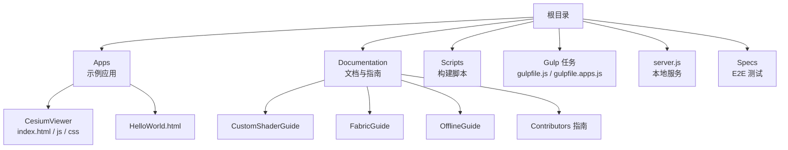
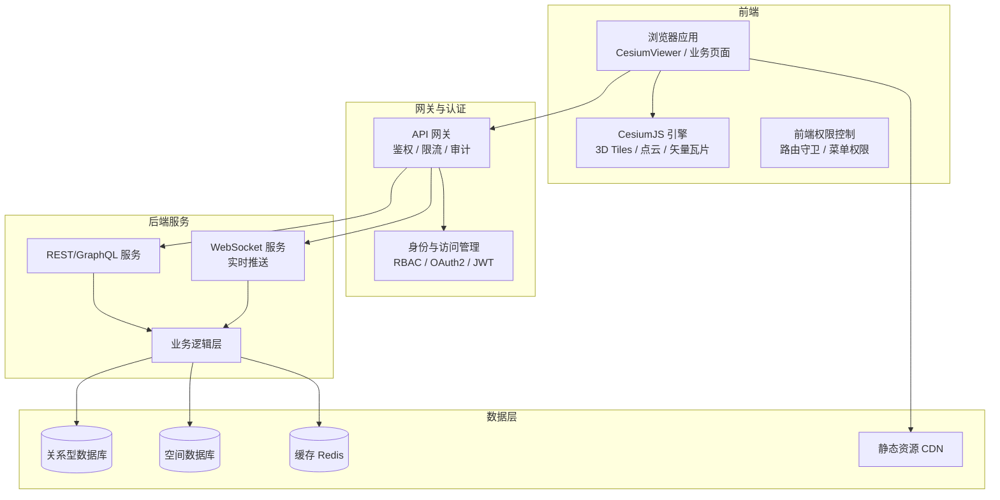
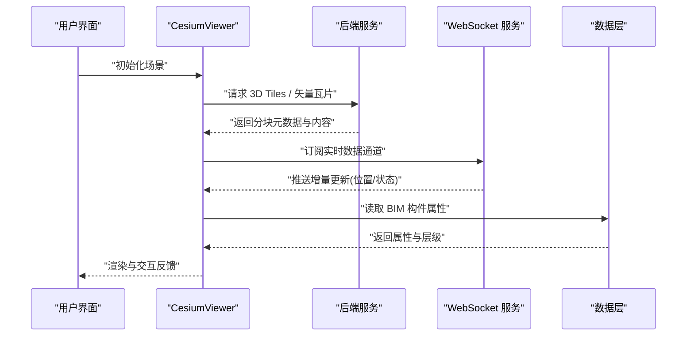
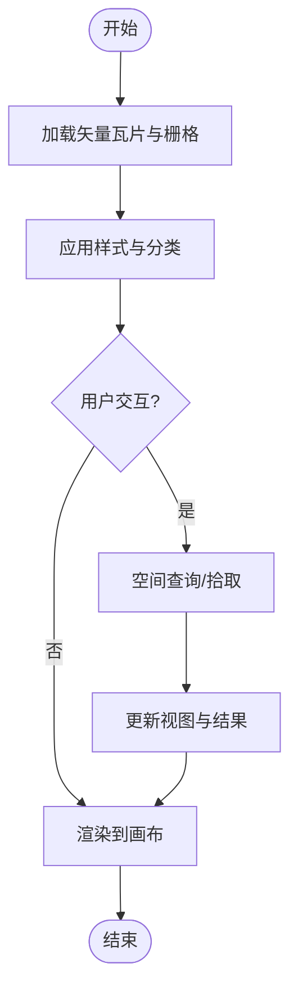
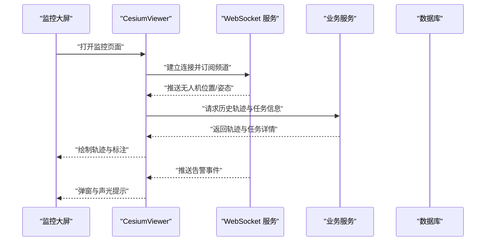
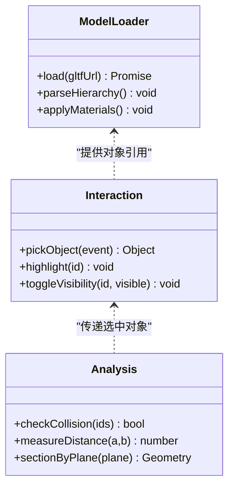
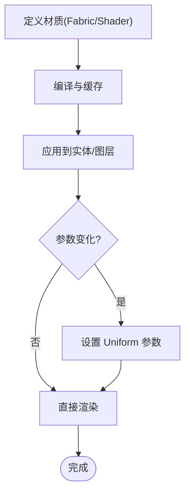
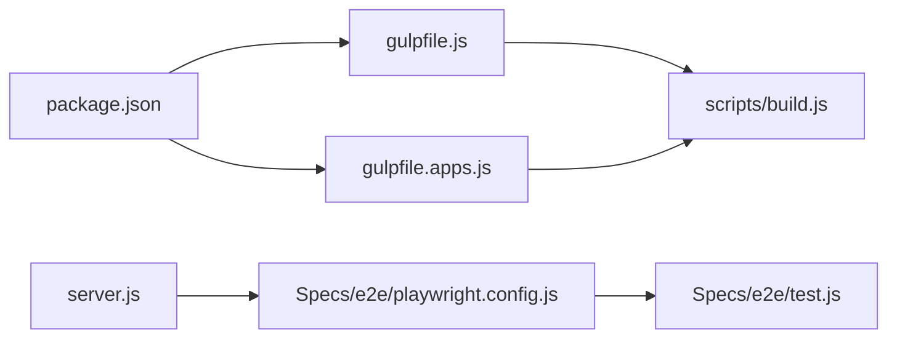

# 高级应用案例

<cite>
**本文引用的文件**   
- [README.md](file://README.md)
- [package.json](file://package.json)
- [server.js](file://server.js)
- [index.html](file://index.html)
- [Apps/HelloWorld.html](file://Apps/HelloWorld.html)
- [Apps/CesiumViewer/index.html](file://Apps/CesiumViewer/index.html)
- [Apps/CesiumViewer/CesiumViewer.js](file://Apps/CesiumViewer/CesiumViewer.js)
- [Apps/CesiumViewer/CesiumViewer.css](file://Apps/CesiumViewer/CesiumViewer.css)
- [gulpfile.js](file://gulpfile.js)
- [gulpfile.apps.js](file://gulpfile.apps.js)
- [scripts/build.js](file://scripts/build.js)
- [Documentation/CustomShaderGuide/README.md](file://Documentation/CustomShaderGuide/README.md)
- [Documentation/FabricGuide/README.md](file://Documentation/FabricGuide/README.md)
- [Documentation/OfflineGuide/README.md](file://Documentation/OfflineGuide/README.md)
- [Documentation/Contributors/BuildGuide/README.md](file://Documentation/Contributors/BuildGuide/README.md)
- [Documentation/Contributors/PerformanceTestingGuide/README.md](file://Documentation/Contributors/PerformanceTestingGuide/README.md)
- [Specs/e2e/playwright.config.js](file://Specs/e2e/playwright.config.js)
- [Specs/e2e/test.js](file://Specs/e2e/test.js)
</cite>

## 目录
1. [简介](#简介)
2. [项目结构](#项目结构)
3. [核心组件](#核心组件)
4. [架构总览](#架构总览)
5. [详细组件分析](#详细组件分析)
6. [依赖分析](#依赖分析)
7. [性能考虑](#性能考虑)
8. [故障排查指南](#故障排查指南)
9. [结论](#结论)
10. [附录](#附录)

## 简介
本文件面向“智慧城市数字孪生、三维地理信息系统、无人机监控系统、建筑信息模型(BIM)可视化”等复杂应用场景，提供基于 CesiumJS 的企业级工程化实现方案与最佳实践。内容涵盖：
- 大规模 3D 数据渲染优化（3D Tiles、点云、体素、矢量瓦片）
- 实时数据更新（WebSocket/轮询、增量更新、时间动态数据）
- 多源数据融合（影像、地形、BIM、IoT、业务系统）
- WebGL 着色器编程与材质定制
- 企业级架构模式（前后端分离、权限控制、离线部署、CI/CD）
- 完整工程结构与部署指南

## 项目结构
仓库采用模块化组织方式，包含示例应用、构建脚本、文档与测试资源。关键目录说明：
- Apps：示例应用与演示页面，含 CesiumViewer 与 HelloWorld
- Documentation：官方文档与开发者指南，含自定义着色器、Fabric 材质、离线部署、构建与性能测试指南
- Scripts：构建与打包脚本
- Gulp 任务：gulpfile.js 与 gulpfile.apps.js 负责构建与示例应用打包
- server.js：本地开发服务器
- Specs：端到端测试与测试数据

图表来源
- [package.json:1-20](file://package.json#L1-L20)
- [gulpfile.js:1-50](file://gulpfile.js#L1-L50)
- [gulpfile.apps.js:1-50](file://gulpfile.apps.js#L1-L50)
- [server.js:1-50](file://server.js#L1-L50)

章节来源
- [README.md:1-100](file://README.md#L1-L100)
- [package.json:1-200](file://package.json#L1-L200)
- [gulpfile.js:1-200](file://gulpfile.js#L1-L200)
- [gulpfile.apps.js:1-200](file://gulpfile.apps.js#L1-L200)
- [server.js:1-200](file://server.js#L1-L200)

## 核心组件
- 示例应用入口
  - CesiumViewer：展示如何加载 3D Tiles、点云、模型、矢量瓦片等典型场景
  - HelloWorld：最小可运行示例，便于快速验证环境
- 构建与打包
  - Gulp 任务：负责编译、合并、压缩与产物输出
  - scripts/build.js：通用构建逻辑封装
- 本地服务
  - server.js：提供静态资源与示例数据的本地服务
- 文档与指南
  - 自定义着色器指南：WebGL 着色器扩展与材质定制
  - Fabric 材质指南：声明式材质定义与组合
  - 离线部署指南：内网/离线环境的资源与服务配置
  - 构建与性能测试指南：构建流程与性能基准方法

章节来源
- [Apps/CesiumViewer/index.html:1-200](file://Apps/CesiumViewer/index.html#L1-L200)
- [Apps/CesiumViewer/CesiumViewer.js:1-200](file://Apps/CesiumViewer/CesiumViewer.js#L1-L200)
- [Apps/HelloWorld.html:1-200](file://Apps/HelloWorld.html#L1-L200)
- [gulpfile.js:1-200](file://gulpfile.js#L1-L200)
- [gulpfile.apps.js:1-200](file://gulpfile.apps.js#L1-L200)
- [scripts/build.js:1-200](file://scripts/build.js#L1-L200)
- [server.js:1-200](file://server.js#L1-L200)
- [Documentation/CustomShaderGuide/README.md:1-200](file://Documentation/CustomShaderGuide/README.md#L1-L200)
- [Documentation/FabricGuide/README.md:1-200](file://Documentation/FabricGuide/README.md#L1-L200)
- [Documentation/OfflineGuide/README.md:1-200](file://Documentation/OfflineGuide/README.md#L1-L200)
- [Documentation/Contributors/BuildGuide/README.md:1-200](file://Documentation/Contributors/BuildGuide/README.md#L1-L200)
- [Documentation/Contributors/PerformanceTestingGuide/README.md:1-200](file://Documentation/Contributors/PerformanceTestingGuide/README.md#L1-L200)

## 架构总览
下图展示了企业级应用的总体架构：前端通过 CesiumViewer 集成 3D 引擎，后端提供 REST/WS API，数据库存储业务与空间数据，缓存层加速热点数据，CDN 分发静态资源，网关统一鉴权与限流。

图表来源
- [server.js:1-200](file://server.js#L1-L200)
- [Apps/CesiumViewer/CesiumViewer.js:1-200](file://Apps/CesiumViewer/CesiumViewer.js#L1-L200)

## 详细组件分析

### 组件一：智慧城市数字孪生
目标：在单页应用中融合城市级 3D Tiles、点云、BIM 模型与 IoT 实时数据，实现高帧率、低延迟的交互体验。

- 数据分层与加载策略
  - 基础底图：影像 + 地形（按需加载）
  - 城市模型：3D Tiles（分块、LOD、视锥裁剪）
  - 点云：Draco 压缩、颜色/法线属性、时间序列
  - BIM：glTF/glb 模型，按构件层级组织，支持属性查询
  - 矢量要素：矢量瓦片（道路、管线、边界）
- 渲染优化
  - 使用 3D Tiles 的几何误差与可见性判定
  - 实例化渲染与批处理减少 draw call
  - 纹理压缩（KTX2/Basis）、按需加载
  - 阴影与光照开关根据设备能力自适应
- 实时数据更新
  - WebSocket 推送位置/状态变更，增量更新
  - 时间轴驱动动画（CZML/自定义时间戳）
- 多源融合
  - 坐标系统一（WGS84/UTM），高程基准一致
  - 属性表关联（BatchTable/Feature Metadata）
- 权限控制
  - 基于角色的图层可见性与操作权限
  - 敏感区域打码或降级显示

图表来源
- [Apps/CesiumViewer/CesiumViewer.js:1-200](file://Apps/CesiumViewer/CesiumViewer.js#L1-L200)
- [server.js:1-200](file://server.js#L1-L200)

章节来源
- [Apps/CesiumViewer/CesiumViewer.js:1-200](file://Apps/CesiumViewer/CesiumViewer.js#L1-L200)
- [Documentation/CustomShaderGuide/README.md:1-200](file://Documentation/CustomShaderGuide/README.md#L1-L200)
- [Documentation/FabricGuide/README.md:1-200](file://Documentation/FabricGuide/README.md#L1-L200)

### 组件二：三维地理信息系统（GIS）
目标：提供高性能的地图浏览、空间分析与可视化能力，支持海量矢量与栅格数据。

- 数据源接入
  - 标准 OGC 服务（WMS/WMTS/WFS）
  - 矢量瓦片（GeoJSON/TopoJSON/Mapbox Vector Tiles）
  - 地形服务（Quantized Mesh）
- 渲染与交互
  - 矢量样式与分类渲染
  - 热力图、聚合、聚类
  - 空间查询与拾取（点击/框选/半径）
- 性能调优
  - 瓦片缓存与预取
  - 简化几何与抽稀
  - 按需加载与视域裁剪

章节来源
- [Apps/CesiumViewer/CesiumViewer.js:1-200](file://Apps/CesiumViewer/CesiumViewer.js#L1-L200)
- [Documentation/OfflineGuide/README.md:1-200](file://Documentation/OfflineGuide/README.md#L1-L200)

### 组件三：无人机监控系统
目标：对无人机编队进行实时监控、轨迹回放、告警联动与任务调度。

- 实时通信
  - WebSocket 推送飞行状态、遥测数据
  - 断线重连与消息去抖
- 轨迹与可视化
  - 路径插值与平滑
  - 高度剖面与禁飞区叠加
- 告警与联动
  - 阈值触发告警（越界、低电量、信号弱）
  - 联动视频流与截图归档

图表来源
- [Apps/CesiumViewer/CesiumViewer.js:1-200](file://Apps/CesiumViewer/CesiumViewer.js#L1-L200)
- [server.js:1-200](file://server.js#L1-L200)

章节来源
- [Apps/CesiumViewer/CesiumViewer.js:1-200](file://Apps/CesiumViewer/CesiumViewer.js#L1-L200)
- [Documentation/CustomShaderGuide/README.md:1-200](file://Documentation/CustomShaderGuide/README.md#L1-L200)

### 组件四：建筑信息模型（BIM）可视化
目标：在三维场景中加载与交互 BIM 模型，支持构件选择、属性查看、碰撞检测与施工模拟。

- 模型加载与组织
  - glTF/glb 模型，按楼层/系统/专业分组
  - 属性表与构件 ID 映射
- 交互与分析
  - 点击拾取与高亮
  - 剖切与透明化
  - 碰撞检测与净空检查
- 性能优化
  - 模型分块与 LOD
  - 纹理与几何压缩
  - 按需实例化重复构件

图表来源
- [Apps/CesiumViewer/CesiumViewer.js:1-200](file://Apps/CesiumViewer/CesiumViewer.js#L1-L200)
- [Documentation/FabricGuide/README.md:1-200](file://Documentation/FabricGuide/README.md#L1-L200)

章节来源
- [Apps/CesiumViewer/CesiumViewer.js:1-200](file://Apps/CesiumViewer/CesiumViewer.js#L1-L200)
- [Documentation/FabricGuide/README.md:1-200](file://Documentation/FabricGuide/README.md#L1-L200)

### 组件五：WebGL 着色器编程与材质定制
目标：通过自定义着色器实现特殊视觉效果（如热成像、夜视、体积雾、水面反射）。

- 材质体系
  - Fabric 材质：声明式定义与组合
  - 自定义 Shader：顶点/片段着色器扩展
- 性能注意
  - 避免每帧频繁创建 Shader
  - 合理使用 uniform 与 attribute
  - 控制复杂度与采样次数

图表来源
- [Documentation/CustomShaderGuide/README.md:1-200](file://Documentation/CustomShaderGuide/README.md#L1-L200)
- [Documentation/FabricGuide/README.md:1-200](file://Documentation/FabricGuide/README.md#L1-L200)

章节来源
- [Documentation/CustomShaderGuide/README.md:1-200](file://Documentation/CustomShaderGuide/README.md#L1-L200)
- [Documentation/FabricGuide/README.md:1-200](file://Documentation/FabricGuide/README.md#L1-L200)

## 依赖分析
- 构建与打包
  - Gulp 任务：gulpfile.js 与 gulpfile.apps.js 协调构建流程
  - scripts/build.js：封装通用构建步骤
- 本地开发与测试
  - server.js：启动本地静态服务
  - Specs/e2e：Playwright 配置与测试脚本
- 文档与指南
  - Documentation：构建、性能测试、离线部署与着色器指南

图表来源
- [package.json:1-200](file://package.json#L1-L200)
- [gulpfile.js:1-200](file://gulpfile.js#L1-L200)
- [gulpfile.apps.js:1-200](file://gulpfile.apps.js#L1-L200)
- [scripts/build.js:1-200](file://scripts/build.js#L1-L200)
- [server.js:1-200](file://server.js#L1-L200)
- [Specs/e2e/playwright.config.js:1-200](file://Specs/e2e/playwright.config.js#L1-L200)
- [Specs/e2e/test.js:1-200](file://Specs/e2e/test.js#L1-L200)

章节来源
- [package.json:1-200](file://package.json#L1-L200)
- [gulpfile.js:1-200](file://gulpfile.js#L1-L200)
- [gulpfile.apps.js:1-200](file://gulpfile.apps.js#L1-L200)
- [scripts/build.js:1-200](file://scripts/build.js#L1-L200)
- [server.js:1-200](file://server.js#L1-L200)
- [Specs/e2e/playwright.config.js:1-200](file://Specs/e2e/playwright.config.js#L1-L200)
- [Specs/e2e/test.js:1-200](file://Specs/e2e/test.js#L1-L200)

## 性能考虑
- 数据层面
  - 使用 3D Tiles 与矢量瓦片进行分块与 LOD
  - 点云 Draco 压缩与属性量化
  - 纹理 KTX2/Basis 压缩与 Mipmap
- 渲染层面
  - 批处理与实例化减少 draw call
  - 合理开启/关闭阴影、抗锯齿与后处理
  - 视锥裁剪与距离剔除
- 网络与缓存
  - HTTP 缓存头与 CDN 分发
  - 预取与懒加载策略
  - 增量更新与差异传输
- 前端优化
  - 防抖与节流高频事件
  - 异步加载与分帧执行
  - 内存管理与对象池

[本节为通用指导，不直接分析具体文件]

## 故障排查指南
- 常见问题定位
  - 资源加载失败：检查本地服务与路径配置
  - 3D Tiles 不显示：确认 tileset.json 与内容可达
  - 点云异常：检查 Draco 解码与属性格式
  - 着色器报错：查看控制台错误与兼容性
- 调试工具
  - 浏览器开发者工具（Network/Performance/Console）
  - 日志与埋点（关键节点耗时与错误上报）
- 回归与自动化
  - E2E 用例覆盖关键流程
  - 性能基线与回归对比

章节来源
- [server.js:1-200](file://server.js#L1-L200)
- [Specs/e2e/playwright.config.js:1-200](file://Specs/e2e/playwright.config.js#L1-L200)
- [Specs/e2e/test.js:1-200](file://Specs/e2e/test.js#L1-L200)

## 结论
通过本仓库的工程化能力与文档指南，可在企业级项目中高效落地智慧城市数字孪生、三维 GIS、无人机监控与 BIM 可视化等复杂场景。建议结合 3D Tiles、点云与矢量瓦片的数据治理策略，配合着色器与材质定制实现高质量可视化，并通过网关与权限控制保障安全与合规。

[本节为总结性内容，不直接分析具体文件]

## 附录
- 快速开始
  - 安装依赖与启动本地服务
  - 打开 HelloWorld 与 CesiumViewer 示例
- 构建与发布
  - 使用 Gulp 任务进行构建与打包
  - 参考构建与性能测试指南
- 离线部署
  - 参考离线部署指南，准备静态资源与服务配置

章节来源
- [README.md:1-100](file://README.md#L1-L100)
- [Apps/HelloWorld.html:1-200](file://Apps/HelloWorld.html#L1-L200)
- [Apps/CesiumViewer/index.html:1-200](file://Apps/CesiumViewer/index.html#L1-L200)
- [gulpfile.js:1-200](file://gulpfile.js#L1-L200)
- [gulpfile.apps.js:1-200](file://gulpfile.apps.js#L1-L200)
- [Documentation/Contributors/BuildGuide/README.md:1-200](file://Documentation/Contributors/BuildGuide/README.md#L1-L200)
- [Documentation/Contributors/PerformanceTestingGuide/README.md:1-200](file://Documentation/Contributors/PerformanceTestingGuide/README.md#L1-L200)
- [Documentation/OfflineGuide/README.md:1-200](file://Documentation/OfflineGuide/README.md#L1-L200)