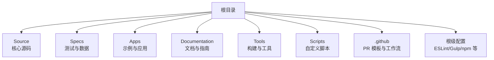
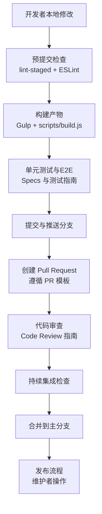
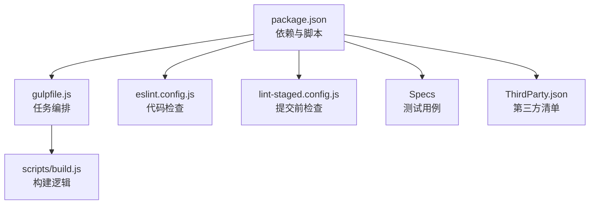

# 贡献指南

<cite>
**本文引用的文件**   
- [CONTRIBUTING.md](file://CONTRIBUTING.md)
- [CODE_OF_CONDUCT.md](file://CODE_OF_CONDUCT.md)
- [Documentation/Contributors/README.md](file://Documentation/Contributors/README.md)
- [Documentation/Contributors/CodingGuide/README.md](file://Documentation/Contributors/CodingGuide/README.md)
- [Documentation/Contributors/CodeReviewGuide/README.md](file://Documentation/Contributors/CodeReviewGuide/README.md)
- [Documentation/Contributors/BuildGuide/README.md](file://Documentation/Contributors/BuildGuide/README.md)
- [Documentation/Contributors/TestingGuide/README.md](file://Documentation/Contributors/TestingGuide/README.md)
- [Documentation/Contributors/ContinuousIntegration/README.md](file://Documentation/Contributors/ContinuousIntegration/README.md)
- [Documentation/Contributors/DocumentationGuide/README.md](file://Documentation/Contributors/DocumentationGuide/README.md)
- [Documentation/Contributors/CommittersGuide/README.md](file://Documentation/Contributors/CommittersGuide/README.md)
- [Documentation/Contributors/ReleaseGuide/README.md](file://Documentation/Contributors/ReleaseGuide/README.md)
- [Documentation/Contributors/CLAs/README.md](file://Documentation/Contributors/CLAs/README.md)
- [.github/pull_request_template.md](file://.github/pull_request_template.md)
- [eslint.config.js](file://eslint.config.js)
- [lint-staged.config.js](file://lint-staged.config.js)
- [package.json](file://package.json)
- [gulpfile.js](file://gulpfile.js)
- [scripts/build.js](file://scripts/build.js)
</cite>

## 目录
1. [简介](#简介)
2. [项目结构](#项目结构)
3. [核心组件](#核心组件)
4. [架构总览](#架构总览)
5. [详细组件分析](#详细组件分析)
6. [依赖分析](#依赖分析)
7. [性能考虑](#性能考虑)
8. [故障排查指南](#故障排查指南)
9. [结论](#结论)
10. [附录](#附录)

## 简介
本指南面向希望参与 Cesium 开源项目的贡献者，涵盖从入门到提交代码、审查与发布的完整流程。内容基于仓库内现有规范与工具链整理而成，旨在帮助新贡献者快速上手并高效协作。

## 项目结构
Cesium 采用多包与示例分离的组织方式：
- Source：核心引擎源码
- Specs：测试用例与测试数据
- Apps：示例应用与演示页面
- Documentation：开发者文档与贡献指南
- Tools：构建与文档生成工具
- Scripts：自定义脚本（构建、合并等）
- .github：GitHub 工作流与模板
- 根级配置：ESLint、Prettier、Husky、Gulp、npm 脚本等

[本节为概念性概述，不直接分析具体文件]

## 核心组件
- 贡献入口与总览
  - 贡献总则与流程说明见 [CONTRIBUTING.md](file://CONTRIBUTING.md)
  - 社区行为准则见 [CODE_OF_CONDUCT.md](file://CODE_OF_CONDUCT.md)
  - 贡献者文档索引见 [Documentation/Contributors/README.md](file://Documentation/Contributors/README.md)
- 编码规范与风格
  - 编码指南（JavaScript/TypeScript/GLSL 等）见 [Documentation/Contributors/CodingGuide/README.md](file://Documentation/Contributors/CodingGuide/README.md)
  - ESLint 配置位于 [eslint.config.js](file://eslint.config.js)
  - 预提交钩子与格式化在 [lint-staged.config.js](file://lint-staged.config.js)
- 构建与运行
  - 构建指南见 [Documentation/Contributors/BuildGuide/README.md](file://Documentation/Contributors/BuildGuide/README.md)
  - 构建任务定义在 [gulpfile.js](file://gulpfile.js)，脚本入口在 [scripts/build.js](file://scripts/build.js)
  - npm 脚本与依赖在 [package.json](file://package.json)
- 测试与持续集成
  - 测试指南见 [Documentation/Contributors/TestingGuide/README.md](file://Documentation/Contributors/TestingGuide/README.md)
  - CI 说明见 [Documentation/Contributors/ContinuousIntegration/README.md](file://Documentation/Contributors/ContinuousIntegration/README.md)
- 文档编写
  - 文档编写指南见 [Documentation/Contributors/DocumentationGuide/README.md](file://Documentation/Contributors/DocumentationGuide/README.md)
- 发布与权限
  - 维护者与发布指南见 [Documentation/Contributors/CommittersGuide/README.md](file://Documentation/Contributors/CommittersGuide/README.md) 与 [Documentation/Contributors/ReleaseGuide/README.md](file://Documentation/Contributors/ReleaseGuide/README.md)
  - CLA 说明见 [Documentation/Contributors/CLAs/README.md](file://Documentation/Contributors/CLAs/README.md)
- Pull Request 模板
  - PR 模板见 [.github/pull_request_template.md](file://.github/pull_request_template.md)

章节来源
- [CONTRIBUTING.md](file://CONTRIBUTING.md)
- [CODE_OF_CONDUCT.md](file://CODE_OF_CONDUCT.md)
- [Documentation/Contributors/README.md](file://Documentation/Contributors/README.md)
- [Documentation/Contributors/CodingGuide/README.md](file://Documentation/Contributors/CodingGuide/README.md)
- [Documentation/Contributors/BuildGuide/README.md](file://Documentation/Contributors/BuildGuide/README.md)
- [Documentation/Contributors/TestingGuide/README.md](file://Documentation/Contributors/TestingGuide/README.md)
- [Documentation/Contributors/ContinuousIntegration/README.md](file://Documentation/Contributors/ContinuousIntegration/README.md)
- [Documentation/Contributors/DocumentationGuide/README.md](file://Documentation/Contributors/DocumentationGuide/README.md)
- [Documentation/Contributors/CommittersGuide/README.md](file://Documentation/Contributors/CommittersGuide/README.md)
- [Documentation/Contributors/ReleaseGuide/README.md](file://Documentation/Contributors/ReleaseGuide/README.md)
- [Documentation/Contributors/CLAs/README.md](file://Documentation/Contributors/CLAs/README.md)
- [.github/pull_request_template.md](file://.github/pull_request_template.md)
- [eslint.config.js](file://eslint.config.js)
- [lint-staged.config.js](file://lint-staged.config.js)
- [package.json](file://package.json)
- [gulpfile.js](file://gulpfile.js)
- [scripts/build.js](file://scripts/build.js)

## 架构总览
下图展示了贡献者视角下的“开发—构建—测试—提交—审查—合并”的端到端流程，以及关键配置文件的作用点。

图表来源
- [lint-staged.config.js](file://lint-staged.config.js)
- [eslint.config.js](file://eslint.config.js)
- [gulpfile.js](file://gulpfile.js)
- [scripts/build.js](file://scripts/build.js)
- [.github/pull_request_template.md](file://.github/pull_request_template.md)
- [Documentation/Contributors/CodeReviewGuide/README.md](file://Documentation/Contributors/CodeReviewGuide/README.md)
- [Documentation/Contributors/ContinuousIntegration/README.md](file://Documentation/Contributors/ContinuousIntegration/README.md)
- [Documentation/Contributors/CommittersGuide/README.md](file://Documentation/Contributors/CommittersGuide/README.md)
- [Documentation/Contributors/ReleaseGuide/README.md](file://Documentation/Contributors/ReleaseGuide/README.md)

## 详细组件分析

### 贡献流程与分支管理
- 分支策略
  - 建议以功能或修复为单位创建独立分支，避免在主分支直接提交。
  - 分支命名建议包含类型与简短描述（例如 feature/xxx、fix/xxx）。
- 提交流程
  - 本地完成修改后，先执行构建与测试，确保通过后再提交。
  - 提交信息应清晰描述变更动机与影响范围。
- 合并策略
  - 所有变更需通过 Pull Request 进行审查与自动化检查，通过后由维护者合并。

章节来源
- [CONTRIBUTING.md](file://CONTRIBUTING.md)
- [Documentation/Contributors/CommittersGuide/README.md](file://Documentation/Contributors/CommittersGuide/README.md)

### Pull Request 规范
- 使用仓库提供的 PR 模板，填写必要信息（问题背景、变更摘要、影响范围、测试情况等）。
- 保持 PR 聚焦单一目标，避免大杂烩式提交。
- 若涉及 API 变更或破坏性更新，需在 PR 中明确说明并提供迁移指引。

章节来源
- [.github/pull_request_template.md](file://.github/pull_request_template.md)
- [CONTRIBUTING.md](file://CONTRIBUTING.md)

### 代码审查标准
- 审查重点
  - 正确性与健壮性：边界条件、错误处理、兼容性。
  - 可读性与可维护性：命名、注释、模块化程度。
  - 性能与安全：避免不必要的计算与内存占用，注意资源加载与权限。
- 审查流程
  - 至少一名维护者审查通过后方可合并。
  - 对反馈应及时响应并迭代修正。

章节来源
- [Documentation/Contributors/CodeReviewGuide/README.md](file://Documentation/Contributors/CodeReviewGuide/README.md)

### 编码规范与 Style Guide
- JavaScript/TypeScript
  - 遵循 ESLint 规则与团队约定，保证一致的风格与质量。
  - 变量与函数命名、模块组织、JSDoc 注释等参考编码指南。
- GLSL
  - 着色器代码需符合工程约定的命名与注释规范，便于调试与维护。
- 自动化工具
  - 使用 lint-staged 在提交前进行局部检查与格式化，减少人工成本。

章节来源
- [Documentation/Contributors/CodingGuide/README.md](file://Documentation/Contributors/CodingGuide/README.md)
- [eslint.config.js](file://eslint.config.js)
- [lint-staged.config.js](file://lint-staged.config.js)

### Git 工作流与协作
- Fork 与克隆
  - 从上游仓库 Fork 到自己的账号，然后克隆到本地。
- 同步上游
  - 定期将上游主分支变更同步至本地，避免冲突累积。
- 提交与推送
  - 小步快跑，频繁提交；推送后及时创建 PR 并通知相关维护者。
- 冲突解决
  - 优先在本地解决冲突，必要时与协作者沟通对齐。

章节来源
- [CONTRIBUTING.md](file://CONTRIBUTING.md)

### 文档编写规范与更新流程
- 文档位置
  - 贡献者文档集中于 Documentation/Contributors 目录。
- 编写要求
  - 语言简洁准确，结构清晰，配图与示例有助于理解。
  - 变更需与代码保持一致，必要时附带迁移说明。
- 更新流程
  - 文档变更同样走 PR 流程，经审查后合并。

章节来源
- [Documentation/Contributors/DocumentationGuide/README.md](file://Documentation/Contributors/DocumentationGuide/README.md)
- [Documentation/Contributors/README.md](file://Documentation/Contributors/README.md)

### 新贡献者入门指导
- 环境准备
  - 安装 Node.js 与包管理器，拉取代码并安装依赖。
  - 参考构建指南完成首次构建与运行。
- 项目结构理解
  - 熟悉 Source、Specs、Apps、Documentation、Tools、Scripts 的职责划分。
- 第一个贡献建议
  - 从文档改进、示例优化或小 bug 修复入手，逐步熟悉流程与规范。

章节来源
- [Documentation/Contributors/BuildGuide/README.md](file://Documentation/Contributors/BuildGuide/README.md)
- [Documentation/Contributors/README.md](file://Documentation/Contributors/README.md)

### 行为准则与社区交流规范
- 尊重与包容
  - 遵守社区行为准则，营造友好、专业的协作氛围。
- 有效沟通
  - 在 Issue 与 PR 中提供充分上下文与复现步骤，避免模糊描述。
- 责任与边界
  - 明确自身角色与职责，尊重维护者的决策与节奏。

章节来源
- [CODE_OF_CONDUCT.md](file://CODE_OF_CONDUCT.md)

### 问题报告与功能请求处理流程
- 问题报告
  - 提供清晰的标题、复现步骤、期望与实际结果、环境与版本信息。
  - 附上最小可复现代码或截图/日志，便于定位问题。
- 功能请求
  - 说明需求背景、使用场景与预期收益，评估可行性与优先级。
- 跟踪与闭环
  - 维护者会标注状态与标签，贡献者可跟进讨论直至问题解决。

章节来源
- [CONTRIBUTING.md](file://CONTRIBUTING.md)

## 依赖分析
- 构建与工具链
  - Gulp 作为任务编排入口，结合自定义脚本完成构建、打包与文档生成。
  - ESLint 统一代码风格与静态检查，lint-staged 在提交阶段执行。
- 测试与 CI
  - 测试用例集中在 Specs 目录，CI 流水线负责自动化验证。
- 外部依赖
  - 第三方库与许可证信息集中管理，便于审计与合规。

图表来源
- [package.json](file://package.json)
- [gulpfile.js](file://gulpfile.js)
- [scripts/build.js](file://scripts/build.js)
- [eslint.config.js](file://eslint.config.js)
- [lint-staged.config.js](file://lint-staged.config.js)

章节来源
- [package.json](file://package.json)
- [gulpfile.js](file://gulpfile.js)
- [scripts/build.js](file://scripts/build.js)
- [eslint.config.js](file://eslint.config.js)
- [lint-staged.config.js](file://lint-staged.config.js)

## 性能考虑
- 构建性能
  - 合理拆分任务与增量构建，避免全量重建。
- 运行时性能
  - 关注渲染路径与资源加载，避免不必要的重绘与重复计算。
- 测试性能
  - 并行化测试用例，控制单用例耗时，缩短反馈周期。

[本节为通用建议，不直接分析具体文件]

## 故障排查指南
- 常见问题
  - 构建失败：检查 Node 版本、依赖安装与环境变量。
  - 测试失败：确认测试数据可用、浏览器兼容性与沙箱环境。
  - 审查未通过：根据审查意见逐项修正，必要时补充测试与文档。
- 定位方法
  - 查看 CI 日志与本地构建输出，缩小问题范围。
  - 使用最小复现案例隔离问题，提高修复效率。

章节来源
- [Documentation/Contributors/ContinuousIntegration/README.md](file://Documentation/Contributors/ContinuousIntegration/README.md)
- [Documentation/Contributors/TestingGuide/README.md](file://Documentation/Contributors/TestingGuide/README.md)

## 结论
通过遵循本指南的流程与规范，贡献者可以高效地参与 Cesium 的开发与协作。建议在首次贡献前通读贡献者文档与编码指南，并在实践中不断打磨自己的工作流程。

[本节为总结性内容，不直接分析具体文件]

## 附录
- 术语表
  - PR：Pull Request，用于提交变更并进行审查。
  - CI：持续集成，自动化构建与测试流程。
  - CLAs：贡献者许可协议，确保法律合规。
- 相关链接
  - 贡献总则：[CONTRIBUTING.md](file://CONTRIBUTING.md)
  - 行为准则：[CODE_OF_CONDUCT.md](file://CODE_OF_CONDUCT.md)
  - 贡献者文档索引：[Documentation/Contributors/README.md](file://Documentation/Contributors/README.md)

[本节为补充信息，不直接分析具体文件]