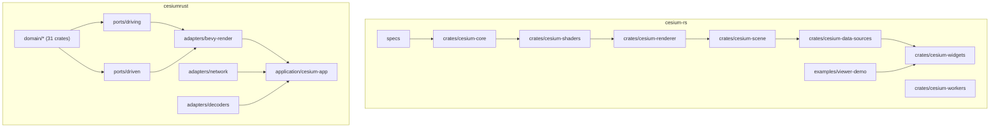
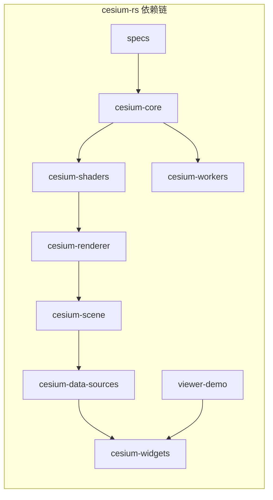
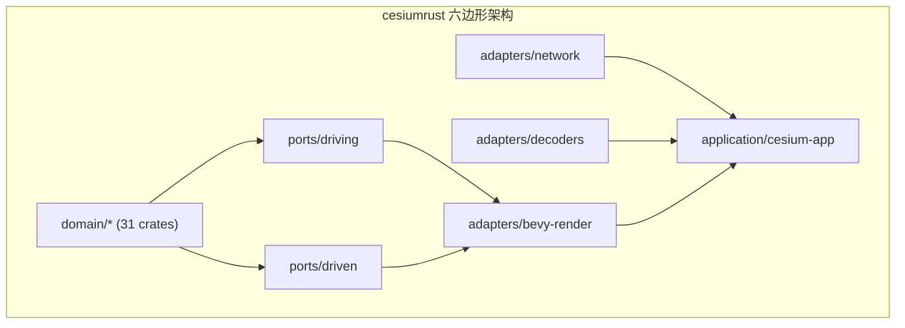
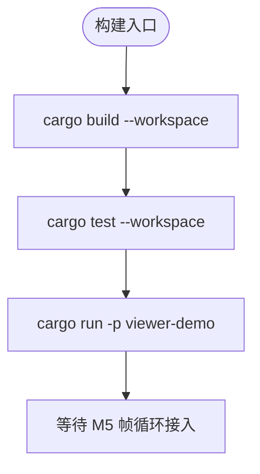
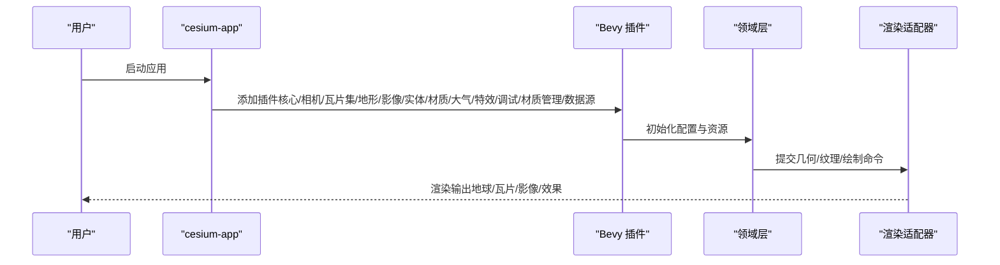
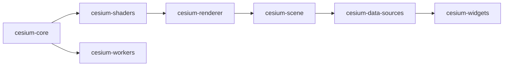

# Cesium-RS工作区

<cite>
**本文引用的文件**
- [cesium-rs/README.md](file://cesium-rs/README.md)
- [cesium-rs/Cargo.toml](file://cesium-rs/Cargo.toml)
- [cesium-rs/crates/cesium-core/Cargo.toml](file://cesium-rs/crates/cesium-core/Cargo.toml)
- [cesium-rs/crates/cesium-renderer/Cargo.toml](file://cesium-rs/crates/cesium-renderer/Cargo.toml)
- [cesium-rs/crates/cesium-scene/Cargo.toml](file://cesium-rs/crates/cesium-scene/Cargo.toml)
- [cesium-rs/examples/viewer-demo/src/main.rs](file://cesium-rs/examples/viewer-demo/src/main.rs)
- [cesium-rs/docs/MAPPING.md](file://cesium-rs/docs/MAPPING.md)
- [cesiumrust/README.md](file://cesiumrust/README.md)
- [cesiumrust/Cargo.toml](file://cesiumrust/Cargo.toml)
- [cesiumrust/domain/geospatial/Cargo.toml](file://cesiumrust/domain/geospatial/Cargo.toml)
- [cesiumrust/application/cesium-app/Cargo.toml](file://cesiumrust/application/cesium-app/Cargo.toml)
- [cesiumrust/application/cesium-app/src/main.rs](file://cesiumrust/application/cesium-app/src/main.rs)
- [cesiumrust/docs/ARCHITECTURE.md](file://cesiumrust/docs/ARCHITECTURE.md)
- [README.md](file://README.md)
</cite>

## 目录
1. [简介](#简介)
2. [项目结构](#项目结构)
3. [核心组件](#核心组件)
4. [架构总览](#架构总览)
5. [详细组件分析](#详细组件分析)
6. [依赖关系分析](#依赖关系分析)
7. [性能考量](#性能考量)
8. [故障排查指南](#故障排查指南)
9. [结论](#结论)
10. [附录](#附录)

## 简介
本仓库包含两个相互独立的 Rust 工程，均致力于对 CesiumJS 进行 Rust 重写与增强：
- cesium-rs：以 wgpu 为渲染后端，逐文件移植 CesiumJS 引擎（Core、Renderer、Scene、DataSources、Widgets），并通过镜像 Jasmine Spec 的测试体系保证数值一致性。
- cesiumrust：采用六边形架构（Ports & Adapters）+ Bevy ECS，将领域逻辑与框架/IO解耦，提供可插拔渲染后端与完整的地表可视化应用示例。

两者在目标上互补：cesium-rs 强调“一比一移植 + 严格测试”，cesiumrust 强调“领域驱动 + 可替换渲染后端”。

**章节来源**
- [cesium-rs/README.md:1-68](file://cesium-rs/README.md#L1-L68)
- [cesiumrust/README.md:1-165](file://cesiumrust/README.md#L1-L165)
- [README.md:1-73](file://README.md#L1-L73)

## 项目结构
工作区由两大子工程组成，各自拥有独立的 crate 组织与构建配置。

- cesium-rs
  - 基于 workspace 管理多个 crate：core → shaders/workers → renderer → scene → data-sources → widgets；specs 用于镜像测试；examples/viewer-demo 为占位入口。
  - 严格自底向上的依赖方向，禁止反向依赖。
- cesiumrust
  - 按六边形分层：domain（纯领域，31个crate）、ports（driving/driven 接口契约）、adapters（bevy-render、network、decoders）、application（cesium-app 组装 Bevy App）。
  - 通过 Cargo workspace 统一版本与依赖，默认成员为 application/cesium-app。

**图示来源**
- [cesium-rs/Cargo.toml:1-52](file://cesium-rs/Cargo.toml#L1-L52)
- [cesiumrust/Cargo.toml:1-145](file://cesiumrust/Cargo.toml#L1-L145)

**章节来源**
- [cesium-rs/Cargo.toml:1-52](file://cesium-rs/Cargo.toml#L1-L52)
- [cesiumrust/Cargo.toml:1-145](file://cesiumrust/Cargo.toml#L1-L145)

## 核心组件
- cesium-rs
  - cesium-core：数学、几何、格式与工具函数的一比一移植，无内部依赖。
  - cesium-shaders：GLSL 到 naga 的翻译与验证，供渲染器使用。
  - cesium-workers：Worker 相关能力，依赖 core。
  - cesium-renderer：基于 wgpu 的渲染实现，依赖 core 与 shaders。
  - cesium-scene：场景图、地球、图元、瓦片集、相机等，依赖 core/renderer/shaders。
  - cesium-data-sources：数据源加载与处理，依赖 core 与 scene。
  - cesium-widgets：UI 控件集合，依赖 core、scene、data-sources。
  - specs：镜像 CesiumJS Specs 的测试容器，只读引用上层 Specs/Data。
  - examples/viewer-demo：最小查看器入口（M5 计划接入真实帧循环）。
- cesiumrust
  - domain：纯领域逻辑（地理空间、时间、相机、地形、影像、瓦片集、glTF、材质、大气、交互、特效、阴影、CRS、KML/GPX、Provider、样式、Globe、四叉树、图元、动画、隐式瓦片、矢量、场景模式、性能、体素、Widgets）。
  - ports：应用 API 与 IO 接口契约（driving/driven）。
  - adapters：Bevy 渲染适配器、网络、解码器。
  - application：Bevy App 装配与启动，集成插件与本地模块。

**章节来源**
- [cesium-rs/README.md:16-46](file://cesium-rs/README.md#L16-L46)
- [cesium-rs/crates/cesium-core/Cargo.toml:1-17](file://cesium-rs/crates/cesium-core/Cargo.toml#L1-L17)
- [cesium-rs/crates/cesium-renderer/Cargo.toml:1-17](file://cesium-rs/crates/cesium-renderer/Cargo.toml#L1-L17)
- [cesium-rs/crates/cesium-scene/Cargo.toml:1-17](file://cesium-rs/crates/cesium-scene/Cargo.toml#L1-L17)
- [cesiumrust/README.md:28-33](file://cesiumrust/README.md#L28-L33)
- [cesiumrust/docs/ARCHITECTURE.md:127-200](file://cesiumrust/docs/ARCHITECTURE.md#L127-L200)

## 架构总览
cesium-rs 采用严格的自底向上依赖链，确保底层能力稳定且可独立演进；cesiumrust 采用六边形架构，将领域与框架解耦，便于替换渲染后端与测试领域逻辑。

**图示来源**
- [cesium-rs/README.md:32-46](file://cesium-rs/README.md#L32-L46)
- [cesium-rs/Cargo.toml:12-21](file://cesium-rs/Cargo.toml#L12-L21)

**图示来源**
- [cesiumrust/Cargo.toml:1-47](file://cesiumrust/Cargo.toml#L1-L47)
- [cesiumrust/docs/ARCHITECTURE.md:62-124](file://cesiumrust/docs/ARCHITECTURE.md#L62-L124)

**章节来源**
- [cesium-rs/README.md:32-46](file://cesium-rs/README.md#L32-L46)
- [cesiumrust/docs/ARCHITECTURE.md:62-124](file://cesiumrust/docs/ARCHITECTURE.md#L62-L124)

## 详细组件分析

### cesium-rs 工作区
- 设计原则
  - 渲染后端：wgpu（含 webgl feature 以支持 Web 端 WebGL2 回退）。
  - 数值精度：领域计算使用 f64，仅在 GPU 提交边界降为 f32；不引入 glam。
  - 移植规约：遵循 docs/PORTING_CONVENTIONS.md。
- 依赖方向规则
  - 严格自底向上，禁止反向依赖（由 Cargo 声明强制）。
- 构建与测试
  - 使用 cargo build/test/run 管理构建与测试；测试数据通过环境变量指向 Specs/Data。
- 示例入口
  - viewer-demo 当前为骨架，计划 M5 接入 winit + wgpu 帧循环。

**图示来源**
- [cesium-rs/README.md:48-59](file://cesium-rs/README.md#L48-L59)
- [cesium-rs/examples/viewer-demo/src/main.rs:1-17](file://cesium-rs/examples/viewer-demo/src/main.rs#L1-L17)

**章节来源**
- [cesium-rs/README.md:10-15](file://cesium-rs/README.md#L10-L15)
- [cesium-rs/README.md:32-46](file://cesium-rs/README.md#L32-L46)
- [cesium-rs/README.md:48-59](file://cesium-rs/README.md#L48-L59)
- [cesium-rs/examples/viewer-demo/src/main.rs:1-17](file://cesium-rs/examples/viewer-demo/src/main.rs#L1-L17)

### cesiumrust 工作区
- 架构要点
  - 六边形架构：领域层纯 Rust，无框架依赖；端口定义契约；适配器实现 IO；应用层装配。
  - 渲染后端：Bevy ECS + wgpu；通过插件系统组合功能。
  - 数值精度：领域层使用 f64，GPU 边界转换为 f32；禁用 glam fast-math 以保证与 CesiumJS 的位级一致。
- 插件系统
  - 13 个 bevy-render 插件覆盖核心、相机、瓦片集、地形、影像、实体、材质、大气、特效、调试、材质管理、数据源等。
  - 本地插件包括轨道相机、星空背景、大气辉光、动态地球、基础球体等。
- 应用入口
  - cesium-app 作为 Bevy App 装配点，注册插件并运行主循环。

**图示来源**
- [cesiumrust/README.md:35-66](file://cesiumrust/README.md#L35-L66)
- [cesiumrust/application/cesium-app/src/main.rs:88-119](file://cesiumrust/application/cesium-app/src/main.rs#L88-L119)

**章节来源**
- [cesiumrust/README.md:9-33](file://cesiumrust/README.md#L9-L33)
- [cesiumrust/docs/ARCHITECTURE.md:127-200](file://cesiumrust/docs/ARCHITECTURE.md#L127-L200)
- [cesiumrust/application/cesium-app/src/main.rs:88-119](file://cesiumrust/application/cesium-app/src/main.rs#L88-L119)

## 依赖关系分析
- cesium-rs
  - 依赖方向严格自底向上：core → shaders/workers → renderer → scene → data-sources → widgets。
  - 测试与示例分别依赖相应上层 crate。
- cesiumrust
  - 领域层依赖端口（driving/driven），适配器实现端口并被应用层装配。
  - 应用层仅依赖必要的领域与适配器，保持清晰边界。

**图示来源**
- [cesium-rs/README.md:32-46](file://cesium-rs/README.md#L32-L46)
- [cesium-rs/Cargo.toml:12-21](file://cesium-rs/Cargo.toml#L12-L21)

**章节来源**
- [cesium-rs/README.md:32-46](file://cesium-rs/README.md#L32-L46)
- [cesium-rs/Cargo.toml:12-21](file://cesium-rs/Cargo.toml#L12-L21)

## 性能考量
- cesium-rs
  - 领域计算使用 f64，GPU 提交时降为 f32，平衡精度与硬件限制。
  - 通过 naga 进行 GLSL 翻译与验证，确保着色器质量。
- cesiumrust
  - 禁用 glam fast-math，保证与 CesiumJS 的位级一致，避免 1-ulp 差异。
  - 使用 Bevy ECS 管理大量瓦片实体，提升渲染吞吐。
  - 通过插件化与分层架构，便于在不同后端间切换与优化。

[本节为通用性能讨论，不直接分析具体文件]

## 故障排查指南
- cesium-rs
  - 若测试失败，检查测试数据路径 CESIUM_SPECS_DATA 是否正确指向 Specs/Data。
  - 若构建失败，确认 wgpu 与 naga 版本匹配，以及 webgl feature 是否启用。
- cesiumrust
  - 若无法启动或渲染异常，检查 Bevy 系统依赖（如 libudev、alsa、vulkan）是否安装。
  - 若领域逻辑与预期不符，优先在 domain 层编写单元测试，隔离渲染与 IO 影响。

**章节来源**
- [cesium-rs/README.md:48-59](file://cesium-rs/README.md#L48-L59)
- [cesiumrust/README.md:69-84](file://cesiumrust/README.md#L69-L84)

## 结论
- cesium-rs 适合追求与 CesiumJS 行为一致的移植与验证场景，具备严格的依赖管理与镜像测试体系。
- cesiumrust 适合需要领域驱动、可替换渲染后端与可扩展插件体系的工程，具备良好的可测试性与可维护性。
- 两者互补：cesium-rs 提供高保真基准，cesiumrust 提供灵活架构与生态扩展。

[本节为总结性内容，不直接分析具体文件]

## 附录
- 移植台账：cesium-rs/docs/MAPPING.md 记录了 Core 文件的移植状态与备注。
- 架构文档：cesiumrust/docs/ARCHITECTURE.md 提供了详细的架构说明、模块参考与贡献指南。

**章节来源**
- [cesium-rs/docs/MAPPING.md:1-50](file://cesium-rs/docs/MAPPING.md#L1-L50)
- [cesiumrust/docs/ARCHITECTURE.md:1-200](file://cesiumrust/docs/ARCHITECTURE.md#L1-L200)