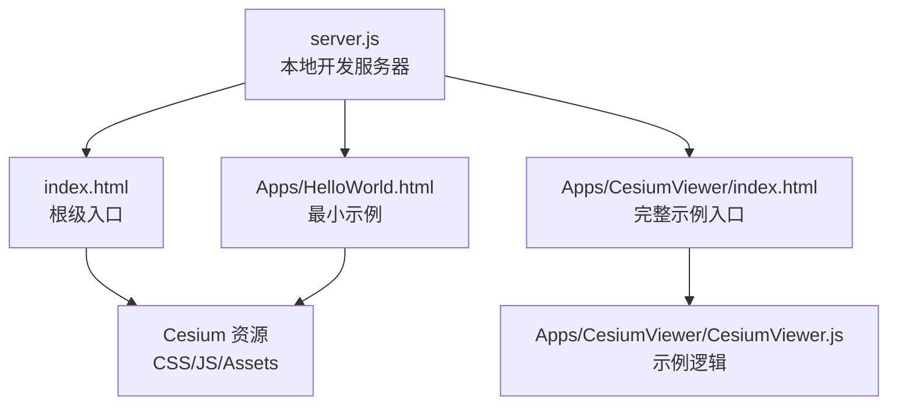
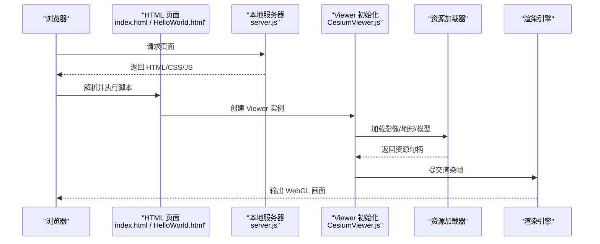
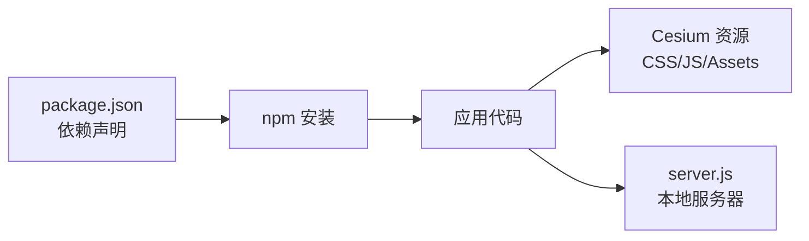

# 快速开始

<cite>
**本文引用的文件**   
- [README.md](file://README.md)
- [package.json](file://package.json)
- [index.html](file://index.html)
- [index.release.html](file://index.release.html)
- [server.js](file://server.js)
- [Apps/HelloWorld.html](file://Apps/HelloWorld.html)
- [Apps/CesiumViewer/index.html](file://Apps/CesiumViewer/index.html)
- [Apps/CesiumViewer/CesiumViewer.css](file://Apps/CesiumViewer/CesiumViewer.css)
- [Apps/CesiumViewer/CesiumViewer.js](file://Apps/CesiumViewer/CesiumViewer.js)
- [Documentation/OfflineGuide/README.md](file://Documentation/OfflineGuide/README.md)
</cite>

## 目录
1. [简介](#简介)
2. [项目结构](#项目结构)
3. [核心组件](#核心组件)
4. [架构总览](#架构总览)
5. [详细组件分析](#详细组件分析)
6. [依赖分析](#依赖分析)
7. [性能考虑](#性能考虑)
8. [故障排除指南](#故障排除指南)
9. [结论](#结论)
10. [附录](#附录)

## 简介
本指南面向初次接触 Cesium 的开发者，目标是帮助你以最短路径完成安装、初始化与基础开发。你将学会：
- 通过 npm、CDN 或本地构建三种方式引入 Cesium
- 创建第一个 3D 地球应用
- 配置 Viewer 基本选项
- 添加影像图层、地形数据与 3D 模型
- 进行常见场景设置、相机控制与用户交互
- 排查常见问题并优化体验

## 项目结构
仓库提供了可直接运行的示例与应用入口，便于快速上手：
- 根级 HTML 入口用于本地预览与调试
- Apps 目录包含最小化示例与完整 Viewer 示例
- server.js 提供本地开发服务器（支持热重载）
- Documentation/OfflineGuide 提供离线部署说明

图表来源
- [index.html:1-200](file://index.html#L1-L200)
- [Apps/HelloWorld.html:1-200](file://Apps/HelloWorld.html#L1-L200)
- [Apps/CesiumViewer/index.html:1-200](file://Apps/CesiumViewer/index.html#L1-L200)
- [Apps/CesiumViewer/CesiumViewer.js:1-200](file://Apps/CesiumViewer/CesiumViewer.js#L1-L200)
- [server.js:1-200](file://server.js#L1-L200)

章节来源
- [README.md:1-200](file://README.md#L1-L200)
- [index.html:1-200](file://index.html#L1-L200)
- [Apps/HelloWorld.html:1-200](file://Apps/HelloWorld.html#L1-L200)
- [Apps/CesiumViewer/index.html:1-200](file://Apps/CesiumViewer/index.html#L1-L200)
- [Apps/CesiumViewer/CesiumViewer.js:1-200](file://Apps/CesiumViewer/CesiumViewer.js#L1-L200)
- [server.js:1-200](file://server.js#L1-L200)

## 核心组件
- Viewer 组件：封装了 Scene、Camera、Canvas、UI 控件等，是构建 3D 地球应用的最高层入口。
- 资源加载器：负责加载影像、地形、模型、样式等资源。
- 事件系统：处理鼠标、键盘、触摸等交互事件。
- 渲染管线：基于 WebGL 的高性能渲染引擎。

章节来源
- [Apps/CesiumViewer/CesiumViewer.js:1-200](file://Apps/CesiumViewer/CesiumViewer.js#L1-L200)

## 架构总览
下图展示了从浏览器到 Cesium 渲染的核心流程与关键文件映射关系。

图表来源
- [index.html:1-200](file://index.html#L1-L200)
- [Apps/HelloWorld.html:1-200](file://Apps/HelloWorld.html#L1-L200)
- [Apps/CesiumViewer/index.html:1-200](file://Apps/CesiumViewer/index.html#L1-L200)
- [Apps/CesiumViewer/CesiumViewer.js:1-200](file://Apps/CesiumViewer/CesiumViewer.js#L1-L200)
- [server.js:1-200](file://server.js#L1-L200)

## 详细组件分析

### 安装与引入
- npm 安装
  - 使用包管理器安装 Cesium 依赖，并在项目中按需引入。
  - 参考：[package.json](file://package.json)
- CDN 引入
  - 在 HTML 中直接引入 Cesium 的 CSS/JS 与静态资源，适合快速原型。
  - 参考：[index.html](file://index.html)、[index.release.html](file://index.release.html)
- 本地构建
  - 克隆仓库后，按文档指引构建产物，再在应用中引用本地构建结果。
  - 参考：[Documentation/OfflineGuide/README.md](file://Documentation/OfflineGuide/README.md)

章节来源
- [package.json:1-200](file://package.json#L1-L200)
- [index.html:1-200](file://index.html#L1-L200)
- [index.release.html:1-200](file://index.release.html#L1-L200)
- [Documentation/OfflineGuide/README.md:1-200](file://Documentation/OfflineGuide/README.md#L1-L200)

### 初始化第一个 3D 地球
- 使用最小示例快速运行
  - 打开最小示例页面，即可看到默认地球与基础控件。
  - 参考：[Apps/HelloWorld.html](file://Apps/HelloWorld.html)
- 使用完整示例
  - 打开完整示例入口，查看更丰富的配置与功能演示。
  - 参考：[Apps/CesiumViewer/index.html](file://Apps/CesiumViewer/index.html)、[Apps/CesiumViewer/CesiumViewer.js](file://Apps/CesiumViewer/CesiumViewer.js)

章节来源
- [Apps/HelloWorld.html:1-200](file://Apps/HelloWorld.html#L1-L200)
- [Apps/CesiumViewer/index.html:1-200](file://Apps/CesiumViewer/index.html#L1-L200)
- [Apps/CesiumViewer/CesiumViewer.js:1-200](file://Apps/CesiumViewer/CesiumViewer.js#L1-L200)

### Viewer 基本配置
- 常用配置项
  - 是否显示控件、是否启用动画时钟、是否显示信息面板等。
  - 参考：[Apps/CesiumViewer/CesiumViewer.js](file://Apps/CesiumViewer/CesiumViewer.js)
- 样式与布局
  - 通过 CSS 调整容器尺寸与 UI 元素位置。
  - 参考：[Apps/CesiumViewer/CesiumViewer.css](file://Apps/CesiumViewer/CesiumViewer.css)

章节来源
- [Apps/CesiumViewer/CesiumViewer.js:1-200](file://Apps/CesiumViewer/CesiumViewer.js#L1-L200)
- [Apps/CesiumViewer/CesiumViewer.css:1-200](file://Apps/CesiumViewer/CesiumViewer.css#L1-L200)

### 添加影像图层
- 使用内置影像源
  - 可通过配置选择不同影像提供商。
  - 参考：[Apps/CesiumViewer/CesiumViewer.js](file://Apps/CesiumViewer/CesiumViewer.js)
- 自定义影像服务
  - 通过 WMS/WMTS/TMS 等标准协议接入自有影像服务。
  - 参考：[Apps/CesiumViewer/CesiumViewer.js](file://Apps/CesiumViewer/CesiumViewer.js)

章节来源
- [Apps/CesiumViewer/CesiumViewer.js:1-200](file://Apps/CesiumViewer/CesiumViewer.js#L1-L200)

### 添加地形数据
- 使用在线地形
  - 配置默认地形服务以获得真实高程。
  - 参考：[Apps/CesiumViewer/CesiumViewer.js](file://Apps/CesiumViewer/CesiumViewer.js)
- 使用本地地形
  - 将地形切片部署至本地服务器并按需配置。
  - 参考：[Documentation/OfflineGuide/README.md](file://Documentation/OfflineGuide/README.md)

章节来源
- [Apps/CesiumViewer/CesiumViewer.js:1-200](file://Apps/CesiumViewer/CesiumViewer.js#L1-L200)
- [Documentation/OfflineGuide/README.md:1-200](file://Documentation/OfflineGuide/README.md#L1-L200)

### 添加 3D 模型
- 加载 glTF/GLB 模型
  - 通过模型 API 加载并定位到地理坐标。
  - 参考：[Apps/CesiumViewer/CesiumViewer.js](file://Apps/CesiumViewer/CesiumViewer.js)
- 使用示例数据
  - 仓库内提供多种模型样例，便于快速验证。
  - 参考：[Apps/SampleData/models](file://Apps/SampleData/models)

章节来源
- [Apps/CesiumViewer/CesiumViewer.js:1-200](file://Apps/CesiumViewer/CesiumViewer.js#L1-L200)

### 场景设置、相机控制与用户交互
- 场景设置
  - 光照、雾效、背景色、阴影等全局效果。
  - 参考：[Apps/CesiumViewer/CesiumViewer.js](file://Apps/CesiumViewer/CesiumViewer.js)
- 相机控制
  - 飞至目标点、设置视角高度与朝向。
  - 参考：[Apps/CesiumViewer/CesiumViewer.js](file://Apps/CesiumViewer/CesiumViewer.js)
- 用户交互
  - 监听点击、悬停、拖拽等事件，实现拾取与反馈。
  - 参考：[Apps/CesiumViewer/CesiumViewer.js](file://Apps/CesiumViewer/CesiumViewer.js)

章节来源
- [Apps/CesiumViewer/CesiumViewer.js:1-200](file://Apps/CesiumViewer/CesiumViewer.js#L1-L200)

### 本地开发与预览
- 启动本地服务器
  - 使用仓库提供的服务器脚本启动开发环境。
  - 参考：[server.js](file://server.js)
- 访问示例页面
  - 打开根级入口或示例页面进行调试。
  - 参考：[index.html](file://index.html)、[Apps/HelloWorld.html](file://Apps/HelloWorld.html)

章节来源
- [server.js:1-200](file://server.js#L1-L200)
- [index.html:1-200](file://index.html#L1-L200)
- [Apps/HelloWorld.html:1-200](file://Apps/HelloWorld.html#L1-L200)

## 依赖分析
- 运行时依赖
  - Cesium 核心库与静态资源（CSS/JS/Assets）。
  - 参考：[index.html](file://index.html)、[index.release.html](file://index.release.html)
- 开发依赖
  - 本地服务器与构建工具链。
  - 参考：[server.js](file://server.js)、[package.json](file://package.json)

图表来源
- [package.json:1-200](file://package.json#L1-L200)
- [index.html:1-200](file://index.html#L1-L200)
- [index.release.html:1-200](file://index.release.html#L1-L200)
- [server.js:1-200](file://server.js#L1-L200)

章节来源
- [package.json:1-200](file://package.json#L1-L200)
- [index.html:1-200](file://index.html#L1-L200)
- [index.release.html:1-200](file://index.release.html#L1-L200)
- [server.js:1-200](file://server.js#L1-L200)

## 性能考虑
- 合理设置视锥体裁剪与细节层级（LOD），避免过度绘制。
- 对大模型进行 Draco 压缩或使用 KTX2 纹理以减少带宽。
- 按需加载影像与地形，结合视口范围动态切换。
- 减少不必要的状态切换与对象创建，复用几何与材质。
- 使用离屏渲染与 Web Worker 处理重型任务。

## 故障排除指南
- 无法加载资源（跨域/路径错误）
  - 检查本地服务器是否正确启动与端口占用情况。
  - 确认资源路径与 MIME 类型配置正确。
  - 参考：[server.js](file://server.js)
- 黑屏或无渲染
  - 确认浏览器支持 WebGL 且未禁用硬件加速。
  - 检查控制台是否有 GLSL 编译错误或上下文丢失。
- 模型不显示或位置异常
  - 校验模型的坐标系与单位，确保与地球坐标一致。
  - 检查模型路径与网络请求是否成功。
- 离线部署失败
  - 按照离线指南准备静态资源与服务端配置。
  - 参考：[Documentation/OfflineGuide/README.md](file://Documentation/OfflineGuide/README.md)

章节来源
- [server.js:1-200](file://server.js#L1-L200)
- [Documentation/OfflineGuide/README.md:1-200](file://Documentation/OfflineGuide/README.md#L1-L200)

## 结论
通过以上步骤，你已掌握 Cesium 的安装、初始化与基础用法。建议从最小示例入手，逐步扩展影像、地形与模型能力，并结合事件系统与相机 API 打造交互式三维可视化应用。遇到问题时，优先检查资源路径、跨域与 WebGL 环境，再对照离线指南完善部署。

## 附录
- 快速命令
  - 安装依赖：参考 [package.json](file://package.json)
  - 启动本地服务：参考 [server.js](file://server.js)
  - 打开示例：参考 [index.html](file://index.html)、[Apps/HelloWorld.html](file://Apps/HelloWorld.html)
- 更多示例
  - 完整 Viewer 示例：参考 [Apps/CesiumViewer/index.html](file://Apps/CesiumViewer/index.html)、[Apps/CesiumViewer/CesiumViewer.js](file://Apps/CesiumViewer/CesiumViewer.js)