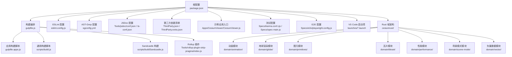
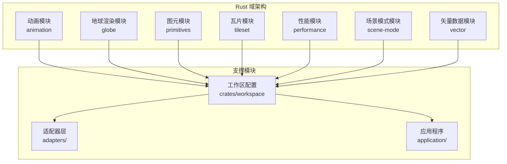
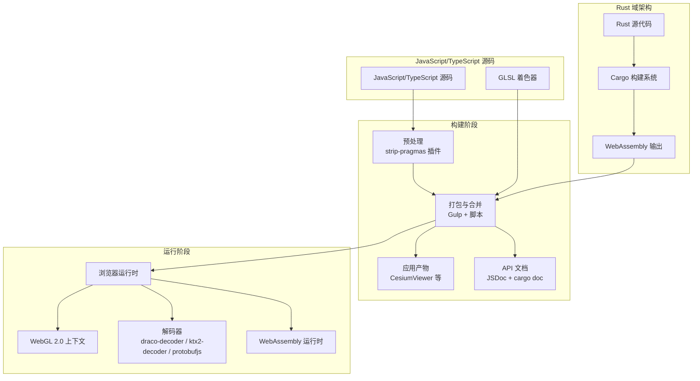
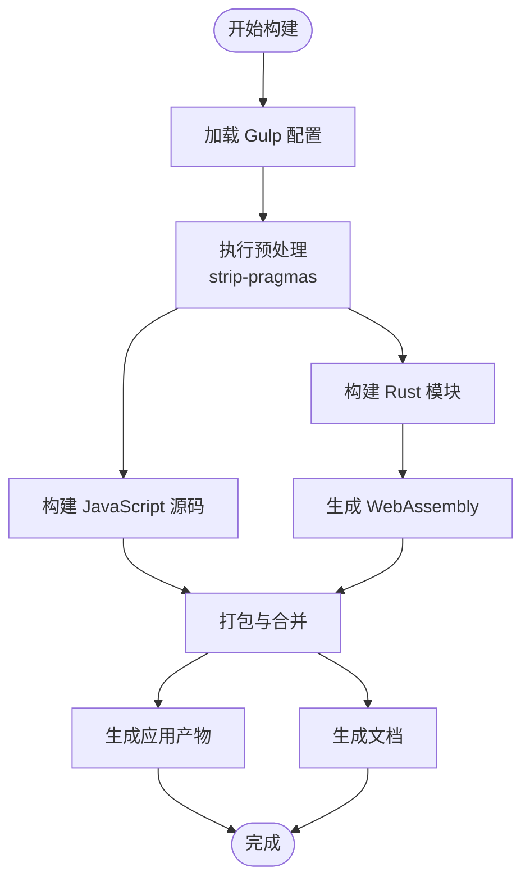
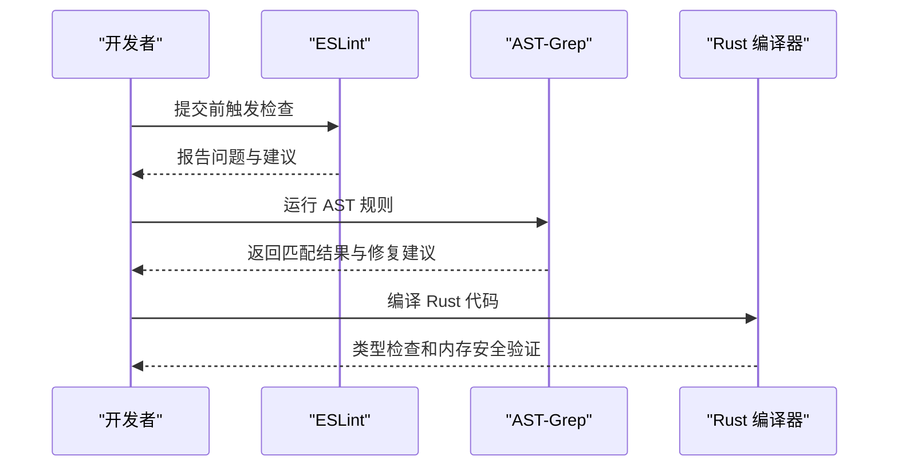
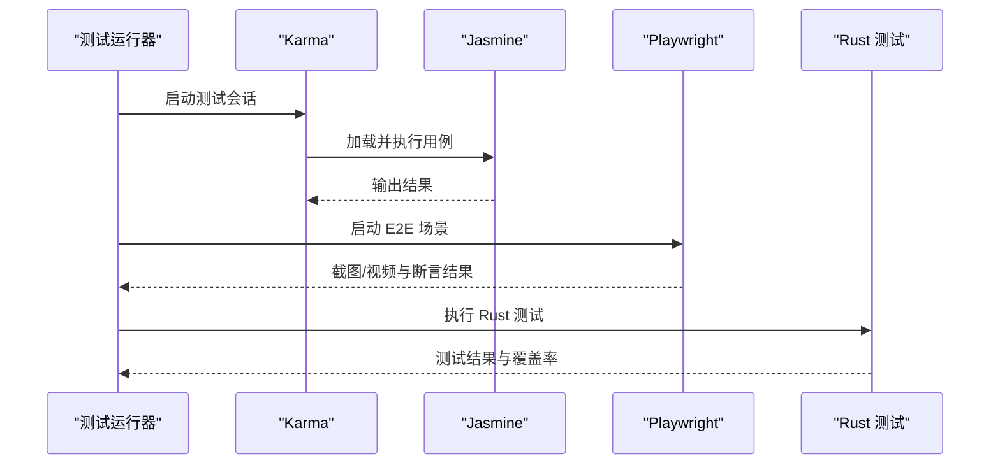
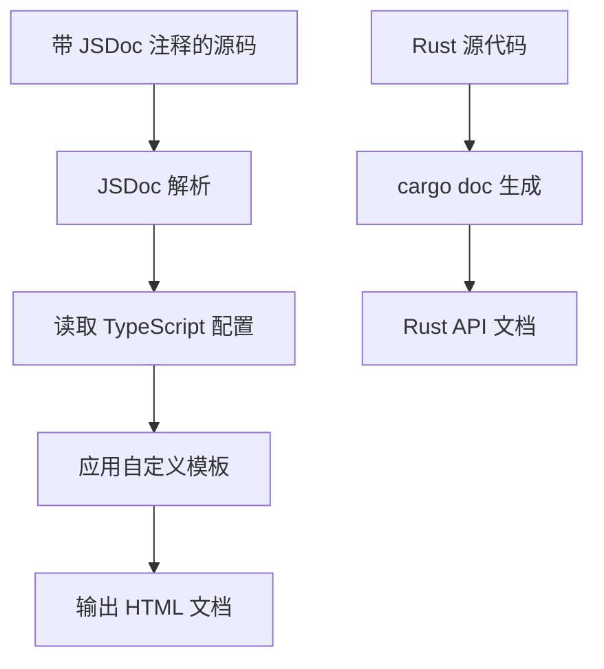
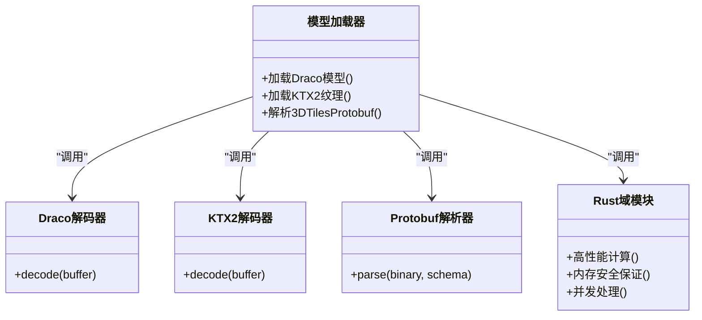
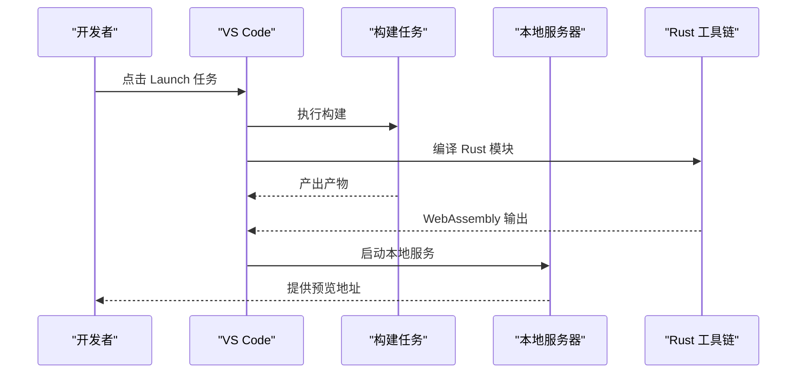
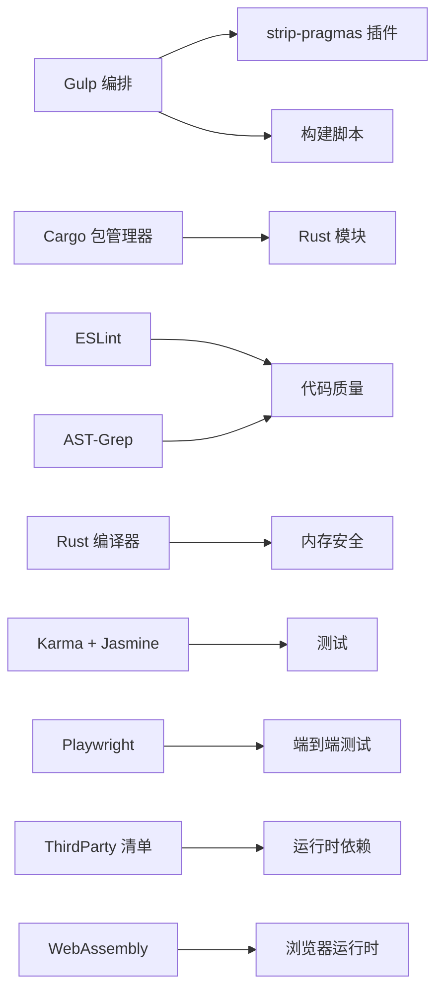

# 技术栈

<cite>
**本文引用的文件**   
- [package.json](file://package.json)
- [gulpfile.js](file://gulpfile.js)
- [gulpfile.apps.js](file://gulpfile.apps.js)
- [eslint.config.js](file://eslint.config.js)
- [sgconfig.yml](file://sgconfig.yml)
- [Tools/jsdoc/conf.json](file://Tools/jsdoc/conf.json)
- [Tools/jsdoc/ts-conf.json](file://Tools/jsdoc/ts-conf.json)
- [Tools/rollup-plugin-strip-pragma/index.js](file://Tools/rollup-plugin-strip-pragma/index.js)
- [Scripts/build.js](file://scripts/build.js)
- [Scripts/buildSandcastle.js](file://scripts/buildSandcastle.js)
- [launches/build.launch](file://launches/build.launch)
- [launches/runServer.launch](file://launches/runServer.launch)
- [launches/generateDocumentation.launch](file://launches/generateDocumentation.launch)
- [ThirdParty.json](file://ThirdParty.json)
- [ThirdParty.extra.json](file://ThirdParty.extra.json)
- [Apps/CesiumViewer/CesiumViewer.js](file://Apps/CesiumViewer/CesiumViewer.js)
- [Specs/karma.conf.cjs](file://Specs/karma.conf.cjs)
- [Specs/spec-main.js](file://Specs/spec-main.js)
- [Specs/e2e/playwright.config.js](file://Specs/e2e/playwright.config.js)
- [cesiumrust/Cargo.toml](file://cesiumrust/Cargo.toml)
- [cesiumrust/domain/animation/Cargo.toml](file://cesiumrust/domain/animation/Cargo.toml)
- [cesiumrust/domain/globe/Cargo.toml](file://cesiumrust/domain/globe/Cargo.toml)
- [cesiumrust/domain/primitives/Cargo.toml](file://cesiumrust/domain/primitives/Cargo.toml)
- [cesiumrust/domain/tileset/Cargo.toml](file://cesiumrust/domain/tileset/Cargo.toml)
- [cesiumrust/domain/performance/Cargo.toml](file://cesiumrust/domain/performance/Cargo.toml)
- [cesiumrust/domain/scene-mode/Cargo.toml](file://cesiumrust/domain/scene-mode/Cargo.toml)
- [cesiumrust/domain/vector/Cargo.toml](file://cesiumrust/domain/vector/Cargo.toml)
</cite>

## 更新摘要
**所做更改**   
- 新增 Rust 域架构章节，介绍基于 Rust 的模块化设计
- 更新核心组件部分，增加 Rust 模块系统说明
- 扩展架构总览，展示 JavaScript/Rust 混合架构
- 新增 Rust 构建系统与依赖管理章节
- 更新开发环境配置，包含 Rust 工具链支持

## 目录
1. [简介](#简介)
2. [项目结构](#项目结构)
3. [核心组件](#核心组件)
4. [Rust 域架构](#rust-域架构)
5. [架构总览](#架构总览)
6. [详细组件分析](#详细组件分析)
7. [依赖分析](#依赖分析)
8. [性能考虑](#性能考虑)
9. [故障排查指南](#故障排查指南)
10. [结论](#结论)
11. [附录](#附录)

## 简介
本技术栈文档面向希望深入理解 Cesium 3D 地球引擎底层图形与工程化体系的开发者。内容覆盖：
- 底层图形 API：WebGL 2.0（浏览器端）
- 编程语言：JavaScript ES6+、TypeScript、GLSL、Rust
- 构建工具链：Gulp、Webpack（通过 Rollup 插件参与构建流程）、Cargo（Rust 包管理器）
- 开发环境配置：VS Code Launch 任务、本地服务器、Rust 工具链集成
- 关键依赖库：draco-decoder、ktx2-decoder、protobufjs 的作用与集成方式
- 代码质量与测试：ESLint、AST-Grep、Jasmine、Playwright
- 文档生成：JSDoc 及 TypeScript 支持
- **新增**：Rust 域架构的模块化设计与跨语言集成

## 项目结构
仓库采用多包与多脚本协同的工程组织方式，根级 package.json 定义统一依赖与脚本入口；Gulp 负责构建编排；Rollup 插件用于源码预处理；JSDoc 与 AST-Grep 保障文档与代码风格；Karma + Jasmine 执行单元测试；Playwright 执行端到端测试；Launch 文件提供 VS Code 一键运行体验。

**新增**：cesiumrust 目录包含完整的 Rust 域架构实现，采用模块化设计支持 3D 地理空间可视化。

图表来源
- [package.json](file://package.json)
- [gulpfile.js](file://gulpfile.js)
- [gulpfile.apps.js](file://gulpfile.apps.js)
- [scripts/build.js](file://scripts/build.js)
- [scripts/buildSandcastle.js](file://scripts/buildSandcastle.js)
- [Tools/rollup-plugin-strip-pragma/index.js](file://Tools/rollup-plugin-strip-pragma/index.js)
- [eslint.config.js](file://eslint.config.js)
- [sgconfig.yml](file://sgconfig.yml)
- [Tools/jsdoc/conf.json](file://Tools/jsdoc/conf.json)
- [Tools/jsdoc/ts-conf.json](file://Tools/jsdoc/ts-conf.json)
- [ThirdParty.json](file://ThirdParty.json)
- [ThirdParty.extra.json](file://ThirdParty.extra.json)
- [Apps/CesiumViewer/CesiumViewer.js](file://Apps/CesiumViewer/CesiumViewer.js)
- [Specs/karma.conf.cjs](file://Specs/karma.conf.cjs)
- [Specs/spec-main.js](file://Specs/spec-main.js)
- [Specs/e2e/playwright.config.js](file://Specs/e2e/playwright.config.js)
- [launches/build.launch](file://launches/build.launch)
- [launches/runServer.launch](file://launches/runServer.launch)
- [launches/generateDocumentation.launch](file://launches/generateDocumentation.launch)
- [cesiumrust/Cargo.toml](file://cesiumrust/Cargo.toml)
- [cesiumrust/domain/animation/Cargo.toml](file://cesiumrust/domain/animation/Cargo.toml)
- [cesiumrust/domain/globe/Cargo.toml](file://cesiumrust/domain/globe/Cargo.toml)
- [cesiumrust/domain/primitives/Cargo.toml](file://cesiumrust/domain/primitives/Cargo.toml)
- [cesiumrust/domain/tileset/Cargo.toml](file://cesiumrust/domain/tileset/Cargo.toml)
- [cesiumrust/domain/performance/Cargo.toml](file://cesiumrust/domain/performance/Cargo.toml)
- [cesiumrust/domain/scene-mode/Cargo.toml](file://cesiumrust/domain/scene-mode/Cargo.toml)
- [cesiumrust/domain/vector/Cargo.toml](file://cesiumrust/domain/vector/Cargo.toml)

章节来源
- [package.json](file://package.json)
- [gulpfile.js](file://gulpfile.js)
- [gulpfile.apps.js](file://gulpfile.apps.js)
- [scripts/build.js](file://scripts/build.js)
- [scripts/buildSandcastle.js](file://scripts/buildSandcastle.js)
- [Tools/rollup-plugin-strip-pragma/index.js](file://Tools/rollup-plugin-strip-pragma/index.js)
- [eslint.config.js](file://eslint.config.js)
- [sgconfig.yml](file://sgconfig.yml)
- [Tools/jsdoc/conf.json](file://Tools/jsdoc/conf.json)
- [Tools/jsdoc/ts-conf.json](file://Tools/jsdoc/ts-conf.json)
- [ThirdParty.json](file://ThirdParty.json)
- [ThirdParty.extra.json](file://ThirdParty.extra.json)
- [Apps/CesiumViewer/CesiumViewer.js](file://Apps/CesiumViewer/CesiumViewer.js)
- [Specs/karma.conf.cjs](file://Specs/karma.conf.cjs)
- [Specs/spec-main.js](file://Specs/spec-main.js)
- [Specs/e2e/playwright.config.js](file://Specs/e2e/playwright.config.js)
- [launches/build.launch](file://launches/build.launch)
- [launches/runServer.launch](file://launches/runServer.launch)
- [launches/generateDocumentation.launch](file://launches/generateDocumentation.launch)
- [cesiumrust/Cargo.toml](file://cesiumrust/Cargo.toml)

## 核心组件
本节聚焦于构建、质量、测试与文档四大工程化支柱，以及运行时关键依赖的集成方式。

- 构建系统
  - Gulp 作为编排器，串联打包、压缩、合并、发布等任务。
  - Rollup 插件 strip-pragmas 在构建阶段对源码进行预处理（如移除条件编译标记）。
  - Cargo 作为 Rust 包管理器，处理 Rust 模块的编译与依赖管理。
  - 应用与 Sandcastle 分别由独立脚本驱动，便于区分产物与资源。

- 语言与图形
  - JavaScript ES6+ 与 TypeScript 共同构成业务逻辑与类型声明层。
  - GLSL 着色器用于 GPU 渲染管线，配合 WebGL 2.0 实现高性能三维渲染。
  - **新增**：Rust 提供高性能计算密集型功能，包括地理空间计算、数据处理和渲染优化。

- 代码质量
  - ESLint 提供静态检查规则与修复能力。
  - AST-Grep 基于 YAML 规则进行更细粒度的语法树级别校验与约束。
  - **新增**：Rust 编译器提供严格的类型检查和内存安全保证。

- 测试体系
  - Karma + Jasmine 执行单元与集成测试。
  - Playwright 执行跨浏览器的端到端测试。
  - **新增**：Rust 原生测试框架用于验证核心算法的正确性。

- 文档生成
  - JSDoc 结合自定义模板与 TypeScript 配置，生成 API 文档站点。
  - **新增**：Rust 文档生成工具（cargo doc）为 Rust 模块提供 API 文档。

- 关键依赖库
  - draco-decoder：解码 glTF/3DTiles 中的 Draco 压缩几何数据。
  - ktx2-decoder：解码 KTX2/Basis 纹理，降低纹理体积并提升加载速度。
  - protobufjs：解析 3DTiles 中基于 Protocol Buffers 的二进制流。

章节来源
- [gulpfile.js](file://gulpfile.js)
- [gulpfile.apps.js](file://gulpfile.apps.js)
- [scripts/build.js](file://scripts/build.js)
- [scripts/buildSandcastle.js](file://scripts/buildSandcastle.js)
- [Tools/rollup-plugin-strip-pragma/index.js](file://Tools/rollup-plugin-strip-pragma/index.js)
- [cesiumrust/Cargo.toml](file://cesiumrust/Cargo.toml)
- [eslint.config.js](file://eslint.config.js)
- [sgconfig.yml](file://sgconfig.yml)
- [Tools/jsdoc/conf.json](file://Tools/jsdoc/conf.json)
- [Tools/jsdoc/ts-conf.json](file://Tools/jsdoc/ts-conf.json)
- [Specs/karma.conf.cjs](file://Specs/karma.conf.cjs)
- [Specs/spec-main.js](file://Specs/spec-main.js)
- [Specs/e2e/playwright.config.js](file://Specs/e2e/playwright.config.js)
- [ThirdParty.json](file://ThirdParty.json)
- [ThirdParty.extra.json](file://ThirdParty.extra.json)

## Rust 域架构
Cesium 引入了全新的基于 Rust 的域架构，采用模块化设计支持 3D 地理空间可视化。该架构将核心计算密集型功能从 JavaScript 迁移到 Rust，以获得更好的性能和内存安全性。

### 模块化设计原则
- **领域分离**：每个模块专注于特定的地理空间功能领域
- **接口清晰**：通过明确的 API 边界实现模块间通信
- **性能优先**：利用 Rust 的零成本抽象和内存安全特性
- **可测试性**：每个模块都具备独立的测试套件

### 核心模块结构

图表来源
- [cesiumrust/Cargo.toml](file://cesiumrust/Cargo.toml)
- [cesiumrust/domain/animation/Cargo.toml](file://cesiumrust/domain/animation/Cargo.toml)
- [cesiumrust/domain/globe/Cargo.toml](file://cesiumrust/domain/globe/Cargo.toml)
- [cesiumrust/domain/primitives/Cargo.toml](file://cesiumrust/domain/primitives/Cargo.toml)
- [cesiumrust/domain/tileset/Cargo.toml](file://cesiumrust/domain/tileset/Cargo.toml)
- [cesiumrust/domain/performance/Cargo.toml](file://cesiumrust/domain/performance/Cargo.toml)
- [cesiumrust/domain/scene-mode/Cargo.toml](file://cesiumrust/domain/scene-mode/Cargo.toml)
- [cesiumrust/domain/vector/Cargo.toml](file://cesiumrust/domain/vector/Cargo.toml)

### 模块功能详解

#### 动画模块 (animation)
负责处理时间相关的动画效果，包括相机动画、属性插值和时序控制。

#### 地球渲染模块 (globe)
实现地球表面的渲染逻辑，包括地形绘制、纹理映射和光照计算。

#### 图元模块 (primitives)
处理基础三维图元的创建、变换和渲染，支持点、线、面等基本几何体。

#### 瓦片模块 (tileset)
管理 3D Tiles 数据的加载、缓存和按需渲染，支持大规模地理数据的流式传输。

#### 性能模块 (performance)
提供性能监控、内存管理和渲染优化策略，确保应用在各种设备上的流畅运行。

#### 场景模式模块 (scene-mode)
定义不同的场景渲染模式，如 2D、3D、哥伦布视图等模式的切换和优化。

#### 矢量数据模块 (vector)
处理矢量数据的解析、转换和渲染，支持 GeoJSON、KML、GPX 等格式。

**章节来源**
- [cesiumrust/Cargo.toml](file://cesiumrust/Cargo.toml)
- [cesiumrust/domain/animation/Cargo.toml](file://cesiumrust/domain/animation/Cargo.toml)
- [cesiumrust/domain/globe/Cargo.toml](file://cesiumrust/domain/globe/Cargo.toml)
- [cesiumrust/domain/primitives/Cargo.toml](file://cesiumrust/domain/primitives/Cargo.toml)
- [cesiumrust/domain/tileset/Cargo.toml](file://cesiumrust/domain/tileset/Cargo.toml)
- [cesiumrust/domain/performance/Cargo.toml](file://cesiumrust/domain/performance/Cargo.toml)
- [cesiumrust/domain/scene-mode/Cargo.toml](file://cesiumrust/domain/scene-mode/Cargo.toml)
- [cesiumrust/domain/vector/Cargo.toml](file://cesiumrust/domain/vector/Cargo.toml)

## 架构总览
下图展示了从源码到产物的整体构建与运行路径，包括构建编排、预处理、打包、测试与文档生成的交互关系，以及新增的 Rust 域架构集成。

图表来源
- [gulpfile.js](file://gulpfile.js)
- [gulpfile.apps.js](file://gulpfile.apps.js)
- [scripts/build.js](file://scripts/build.js)
- [scripts/buildSandcastle.js](file://scripts/buildSandcastle.js)
- [Tools/rollup-plugin-strip-pragma/index.js](file://Tools/rollup-plugin-strip-pragma/index.js)
- [Tools/jsdoc/conf.json](file://Tools/jsdoc/conf.json)
- [Tools/jsdoc/ts-conf.json](file://Tools/jsdoc/ts-conf.json)
- [ThirdParty.json](file://ThirdParty.json)
- [ThirdParty.extra.json](file://ThirdParty.extra.json)
- [cesiumrust/Cargo.toml](file://cesiumrust/Cargo.toml)

## 详细组件分析

### 构建系统与预处理
- Gulp 任务编排
  - 根级 gulpfile.js 定义主任务，聚合各子任务与脚本。
  - gulpfile.apps.js 针对示例与应用进行差异化构建。
  - scripts/build.js 与 scripts/buildSandcastle.js 分别处理核心库与沙盒演示的构建流程。
- Rollup 插件 strip-pragmas
  - 在构建前扫描源码，按预设 pragmas 指令剔除或替换代码片段，常用于条件编译与调试开关控制。
- **新增**：Rust 构建集成
  - Cargo 自动处理 Rust 模块的编译、依赖管理和 WebAssembly 输出。
  - 构建脚本协调 JavaScript 和 Rust 的编译顺序和依赖关系。

图表来源
- [gulpfile.js](file://gulpfile.js)
- [gulpfile.apps.js](file://gulpfile.apps.js)
- [scripts/build.js](file://scripts/build.js)
- [scripts/buildSandcastle.js](file://scripts/buildSandcastle.js)
- [Tools/rollup-plugin-strip-pragma/index.js](file://Tools/rollup-plugin-strip-pragma/index.js)
- [cesiumrust/Cargo.toml](file://cesiumrust/Cargo.toml)

章节来源
- [gulpfile.js](file://gulpfile.js)
- [gulpfile.apps.js](file://gulpfile.apps.js)
- [scripts/build.js](file://scripts/build.js)
- [scripts/buildSandcastle.js](file://scripts/buildSandcastle.js)
- [Tools/rollup-plugin-strip-pragma/index.js](file://Tools/rollup-plugin-strip-pragma/index.js)
- [cesiumrust/Cargo.toml](file://cesiumrust/Cargo.toml)

### 代码质量与规范
- ESLint
  - eslint.config.js 集中管理规则集，涵盖命名、导入、异步、错误处理等维度。
- AST-Grep
  - sgconfig.yml 定义规则集合，支持对导出对象冻结、JSDoc 注释、公共静态字段等进行强约束。
  - Tools/ast-grep 下包含规则与快照测试，确保规则变更可追溯。
- **新增**：Rust 代码质量
  - Rust 编译器提供严格的类型检查和借用检查器，确保内存安全。
  - clippy 提供额外的代码风格和最佳实践检查。

图表来源
- [eslint.config.js](file://eslint.config.js)
- [sgconfig.yml](file://sgconfig.yml)

章节来源
- [eslint.config.js](file://eslint.config.js)
- [sgconfig.yml](file://sgconfig.yml)

### 测试框架与端到端验证
- 单元测试与集成测试
  - Specs/karma.conf.cjs 配置 Karma 运行环境与浏览器矩阵。
  - Specs/spec-main.js 初始化测试套件与全局匹配器。
- 端到端测试
  - Specs/e2e/playwright.config.js 定义浏览器实例、视口与断言策略。
- **新增**：Rust 测试
  - Rust 原生测试框架用于验证核心算法和模块功能。
  - 单元测试与集成测试并行执行，确保 Rust 模块的正确性。

图表来源
- [Specs/karma.conf.cjs](file://Specs/karma.conf.cjs)
- [Specs/spec-main.js](file://Specs/spec-main.js)
- [Specs/e2e/playwright.config.js](file://Specs/e2e/playwright.config.js)

章节来源
- [Specs/karma.conf.cjs](file://Specs/karma.conf.cjs)
- [Specs/spec-main.js](file://Specs/spec-main.js)
- [Specs/e2e/playwright.config.js](file://Specs/e2e/playwright.config.js)

### 文档生成与 TypeScript 支持
- JSDoc 配置
  - Tools/jsdoc/conf.json 指定模板、输出目录与主题。
  - Tools/jsdoc/ts-conf.json 启用 TypeScript 解析，保证类型信息进入文档。
- 生成流程
  - launches/generateDocumentation.launch 提供一键生成文档的 VS Code 任务。
- **新增**：Rust 文档生成
  - cargo doc 自动生成 Rust 模块的 API 文档。
  - 文档生成流程整合 JavaScript 和 Rust 的文档输出。

图表来源
- [Tools/jsdoc/conf.json](file://Tools/jsdoc/conf.json)
- [Tools/jsdoc/ts-conf.json](file://Tools/jsdoc/ts-conf.json)
- [launches/generateDocumentation.launch](file://launches/generateDocumentation.launch)
- [cesiumrust/Cargo.toml](file://cesiumrust/Cargo.toml)

章节来源
- [Tools/jsdoc/conf.json](file://Tools/jsdoc/conf.json)
- [Tools/jsdoc/ts-conf.json](file://Tools/jsdoc/ts-conf.json)
- [launches/generateDocumentation.launch](file://launches/generateDocumentation.launch)
- [cesiumrust/Cargo.toml](file://cesiumrust/Cargo.toml)

### 关键依赖库集成与使用
- draco-decoder
  - 作用：解码 glTF/3DTiles 中的 Draco 压缩几何数据，显著减少模型体积。
  - 集成：通过 ThirdParty 清单引入，并在模型加载管线中按需调用解码器。
- ktx2-decoder
  - 作用：解码 KTX2/Basis 纹理，降低带宽占用并加速纹理上传。
  - 集成：在纹理加载阶段根据扩展名选择解码路径。
- protobufjs
  - 作用：解析 3DTiles 中基于 Protocol Buffers 的二进制流，将二进制转换为结构化数据。
  - 集成：在 tileset 解析流程中根据协议版本动态加载 schema 并反序列化。
- **新增**：Rust 依赖管理
  - Cargo.toml 统一管理 Rust 模块的依赖关系。
  - 工作区配置支持多模块间的依赖共享和版本同步。

图表来源
- [ThirdParty.json](file://ThirdParty.json)
- [ThirdParty.extra.json](file://ThirdParty.extra.json)
- [Apps/CesiumViewer/CesiumViewer.js](file://Apps/CesiumViewer/CesiumViewer.js)
- [cesiumrust/Cargo.toml](file://cesiumrust/Cargo.toml)

章节来源
- [ThirdParty.json](file://ThirdParty.json)
- [ThirdParty.extra.json](file://ThirdParty.extra.json)
- [Apps/CesiumViewer/CesiumViewer.js](file://Apps/CesiumViewer/CesiumViewer.js)
- [cesiumrust/Cargo.toml](file://cesiumrust/Cargo.toml)

### 开发环境与运行
- VS Code Launch 任务
  - builds/build.launch：一键执行构建任务。
  - runs/runServer.launch：启动本地开发服务器。
  - generateDocumentation.launch：生成 API 文档。
- 本地服务器
  - server.js 提供静态资源服务，便于快速预览应用与示例。
- **新增**：Rust 开发环境
  - Rust 工具链安装和配置。
  - VS Code Rust 扩展支持代码补全、调试和linting。

图表来源
- [launches/build.launch](file://launches/build.launch)
- [launches/runServer.launch](file://launches/runServer.launch)
- [launches/generateDocumentation.launch](file://launches/generateDocumentation.launch)
- [server.js](file://server.js)
- [cesiumrust/Cargo.toml](file://cesiumrust/Cargo.toml)

章节来源
- [launches/build.launch](file://launches/build.launch)
- [launches/runServer.launch](file://launches/runServer.launch)
- [launches/generateDocumentation.launch](file://launches/generateDocumentation.launch)
- [server.js](file://server.js)
- [cesiumrust/Cargo.toml](file://cesiumrust/Cargo.toml)

## 依赖分析
- 构建与工具链
  - Gulp 作为编排中心，协调多个脚本与插件。
  - Rollup 插件 strip-pragmas 作为预处理环节，影响最终产物大小与功能开关。
  - **新增**：Cargo 作为 Rust 包管理器，处理 Rust 模块的编译和依赖管理。
- 质量与测试
  - ESLint 与 AST-Grep 互补：前者覆盖广泛 JS/TS 规则，后者专注于 AST 级别的强约束。
  - Karma + Jasmine 与 Playwright 分层测试：单元/集成与端到端并行推进。
  - **新增**：Rust 原生测试框架确保核心算法的正确性和性能。
- 运行时依赖
  - draco-decoder、ktx2-decoder、protobufjs 通过 ThirdParty 清单统一管理，避免重复引入与版本冲突。
  - **新增**：Rust 模块通过 WebAssembly 在浏览器环境中运行，提供高性能计算能力。

图表来源
- [gulpfile.js](file://gulpfile.js)
- [Tools/rollup-plugin-strip-pragma/index.js](file://Tools/rollup-plugin-strip-pragma/index.js)
- [cesiumrust/Cargo.toml](file://cesiumrust/Cargo.toml)
- [eslint.config.js](file://eslint.config.js)
- [sgconfig.yml](file://sgconfig.yml)
- [Specs/karma.conf.cjs](file://Specs/karma.conf.cjs)
- [Specs/e2e/playwright.config.js](file://Specs/e2e/playwright.config.js)
- [ThirdParty.json](file://ThirdParty.json)
- [ThirdParty.extra.json](file://ThirdParty.extra.json)

章节来源
- [gulpfile.js](file://gulpfile.js)
- [Tools/rollup-plugin-strip-pragma/index.js](file://Tools/rollup-plugin-strip-pragma/index.js)
- [cesiumrust/Cargo.toml](file://cesiumrust/Cargo.toml)
- [eslint.config.js](file://eslint.config.js)
- [sgconfig.yml](file://sgconfig.yml)
- [Specs/karma.conf.cjs](file://Specs/karma.conf.cjs)
- [Specs/e2e/playwright.config.js](file://Specs/e2e/playwright.config.js)
- [ThirdParty.json](file://ThirdParty.json)
- [ThirdParty.extra.json](file://ThirdParty.extra.json)

## 性能考虑
- 构建优化
  - 使用 strip-pragmas 移除调试与可选特性，减小产物体积。
  - 合理拆分应用与 Sandcastle 构建，避免不必要的资源打包。
  - **新增**：Rust 模块的增量编译和并行构建提升开发效率。
- 运行时优化
  - 优先使用 Draco 压缩几何与 KTX2 纹理，降低网络传输与 GPU 内存占用。
  - 利用 3DTiles 的分块与 LOD 机制，按需加载与渲染。
  - **新增**：Rust 模块提供高性能计算能力，减少 JavaScript 主线程负担。
- 测试与质量
  - 通过 ESLint 与 AST-Grep 提前发现潜在性能陷阱（如频繁分配、未释放资源）。
  - 使用端到端测试监控首屏加载与帧率指标。
  - **新增**：Rust 的内存安全保证避免常见的性能问题和内存泄漏。

## 故障排查指南
- 构建失败
  - 检查 Gulp 任务是否完整执行，确认 strip-pragmas 插件可用。
  - 查看构建日志定位预处理或打包阶段的异常。
  - **新增**：检查 Rust 工具链是否正确安装，确认 Cargo 依赖解析成功。
- 代码质量报错
  - 依据 ESLint 提示修复规则违规。
  - 使用 AST-Grep 规则说明定位匹配位置并进行批量修复。
  - **新增**：解决 Rust 编译错误和 clippy 警告。
- 测试失败
  - 确认 Karma 浏览器环境配置正确，Jasmine 匹配器已加载。
  - 对于 E2E 失败，检查 Playwright 浏览器安装与网络可达性。
  - **新增**：检查 Rust 测试环境和依赖库的版本兼容性。
- 文档生成异常
  - 核对 JSDoc 与 TypeScript 配置文件路径与权限。
  - 清理缓存后重新生成文档。
  - **新增**：检查 cargo doc 配置和 Rust 文档生成环境。

章节来源
- [gulpfile.js](file://gulpfile.js)
- [Tools/rollup-plugin-strip-pragma/index.js](file://Tools/rollup-plugin-strip-pragma/index.js)
- [cesiumrust/Cargo.toml](file://cesiumrust/Cargo.toml)
- [eslint.config.js](file://eslint.config.js)
- [sgconfig.yml](file://sgconfig.yml)
- [Specs/karma.conf.cjs](file://Specs/karma.conf.cjs)
- [Specs/spec-main.js](file://Specs/spec-main.js)
- [Specs/e2e/playwright.config.js](file://Specs/e2e/playwright.config.js)
- [Tools/jsdoc/conf.json](file://Tools/jsdoc/conf.json)
- [Tools/jsdoc/ts-conf.json](file://Tools/jsdoc/ts-conf.json)

## 结论
Cesium 的技术栈以现代前端工程化为基石，结合 WebGL 2.0 的高性能渲染能力，形成从源码到产物的完整闭环。通过 Gulp 编排、Rollup 预处理、ESLint 与 AST-Grep 的质量保障、Karma/Playwright 的多层测试以及 JSDoc 的文档生成，团队能够高效迭代并维持高质量交付。运行时依赖 draco-decoder、ktx2-decoder、protobufjs 的规范化集成，进一步提升了大型三维数据的加载与渲染效率。

**新增**：Rust 域架构的引入标志着 Cesium 向高性能、内存安全的现代化架构演进。通过模块化设计和跨语言集成，Cesium 能够在保持易用性的同时，提供更强大的计算能力和更好的性能表现。这种混合架构充分发挥了 JavaScript 的生态优势和 Rust 的性能优势，为未来的发展奠定了坚实基础。

## 附录
- 常用命令与任务
  - 构建：参考 launches/build.launch
  - 运行本地服务器：参考 launches/runServer.launch
  - 生成文档：参考 launches/generateDocumentation.launch
  - **新增**：构建 Rust 模块：cargo build
  - **新增**：运行 Rust 测试：cargo test
  - **新增**：生成 Rust 文档：cargo doc
- 关键配置文件
  - 构建编排：gulpfile.js、gulpfile.apps.js
  - 构建脚本：scripts/build.js、scripts/buildSandcastle.js
  - 代码质量：eslint.config.js、sgconfig.yml
  - 文档生成：Tools/jsdoc/conf.json、Tools/jsdoc/ts-conf.json
  - 依赖清单：ThirdParty.json、ThirdParty.extra.json
  - 测试配置：Specs/karma.conf.cjs、Specs/spec-main.js、Specs/e2e/playwright.config.js
  - **新增**：Rust 配置：cesiumrust/Cargo.toml
- **新增**：Rust 模块结构
  - 动画模块：cesiumrust/domain/animation/
  - 地球渲染模块：cesiumrust/domain/globe/
  - 图元模块：cesiumrust/domain/primitives/
  - 瓦片模块：cesiumrust/domain/tileset/
  - 性能模块：cesiumrust/domain/performance/
  - 场景模式模块：cesiumrust/domain/scene-mode/
  - 矢量数据模块：cesiumrust/domain/vector/

章节来源
- [launches/build.launch](file://launches/build.launch)
- [launches/runServer.launch](file://launches/runServer.launch)
- [launches/generateDocumentation.launch](file://launches/generateDocumentation.launch)
- [gulpfile.js](file://gulpfile.js)
- [gulpfile.apps.js](file://gulpfile.apps.js)
- [scripts/build.js](file://scripts/build.js)
- [scripts/buildSandcastle.js](file://scripts/buildSandcastle.js)
- [eslint.config.js](file://eslint.config.js)
- [sgconfig.yml](file://sgconfig.yml)
- [Tools/jsdoc/conf.json](file://Tools/jsdoc/conf.json)
- [Tools/jsdoc/ts-conf.json](file://Tools/jsdoc/ts-conf.json)
- [ThirdParty.json](file://ThirdParty.json)
- [ThirdParty.extra.json](file://ThirdParty.extra.json)
- [Specs/karma.conf.cjs](file://Specs/karma.conf.cjs)
- [Specs/spec-main.js](file://Specs/spec-main.js)
- [Specs/e2e/playwright.config.js](file://Specs/e2e/playwright.config.js)
- [cesiumrust/Cargo.toml](file://cesiumrust/Cargo.toml)
- [cesiumrust/domain/animation/Cargo.toml](file://cesiumrust/domain/animation/Cargo.toml)
- [cesiumrust/domain/globe/Cargo.toml](file://cesiumrust/domain/globe/Cargo.toml)
- [cesiumrust/domain/primitives/Cargo.toml](file://cesiumrust/domain/primitives/Cargo.toml)
- [cesiumrust/domain/tileset/Cargo.toml](file://cesiumrust/domain/tileset/Cargo.toml)
- [cesiumrust/domain/performance/Cargo.toml](file://cesiumrust/domain/performance/Cargo.toml)
- [cesiumrust/domain/scene-mode/Cargo.toml](file://cesiumrust/domain/scene-mode/Cargo.toml)
- [cesiumrust/domain/vector/Cargo.toml](file://cesiumrust/domain/vector/Cargo.toml)