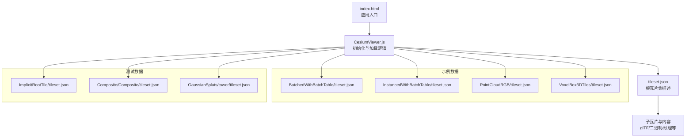
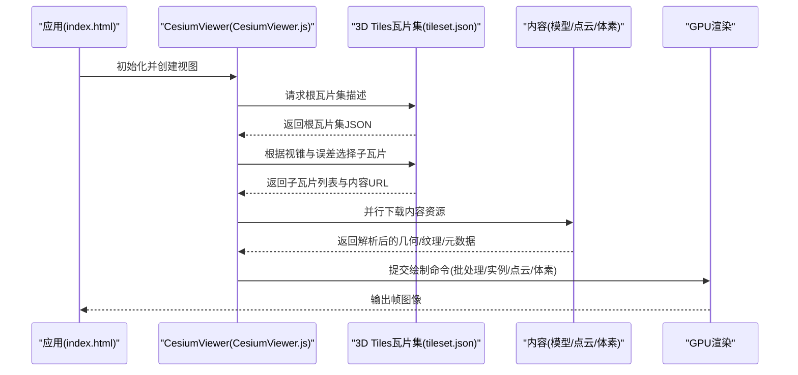
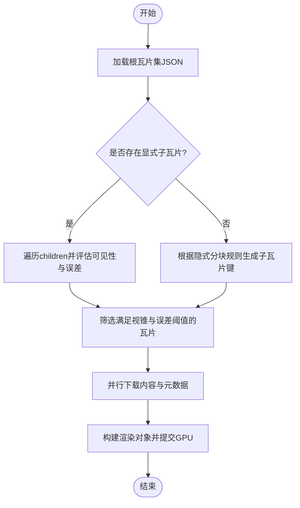
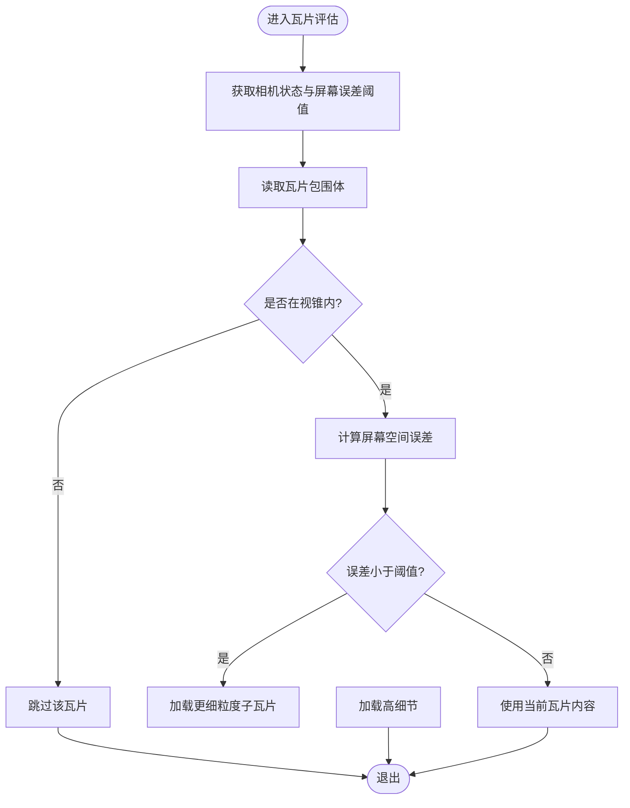
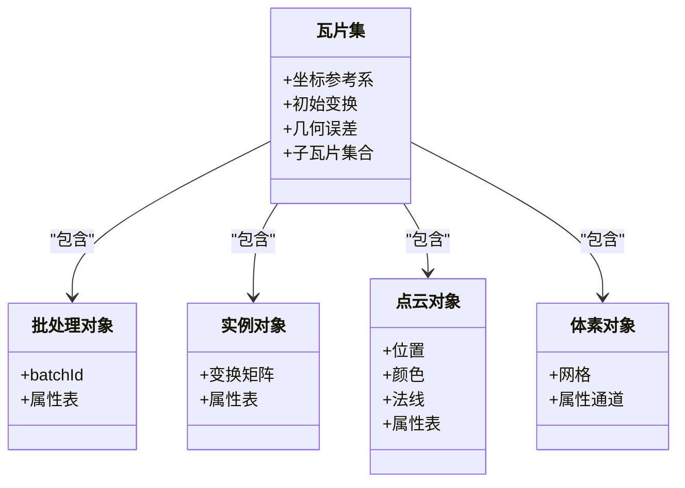
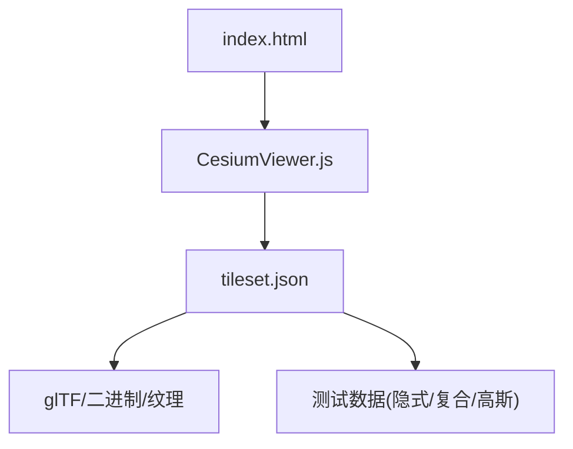

# 3D Tiles标准支持

<cite>
**本文引用的文件**   
- [index.html](file://index.html)
- [CesiumViewer.js](file://Apps/CesiumViewer/CesiumViewer.js)
- [tileset.json（示例）](file://Apps/SampleData/Cesium3DTiles/Tilesets/Tileset/tileset.json)
- [BatchedWithBatchTable/tileset.json](file://Apps/SampleData/Cesium3DTiles/Batched/BatchedWithBatchTable/tileset.json)
- [InstancedWithBatchTable/tileset.json](file://Apps/SampleData/Cesium3DTiles/Instanced/InstancedWithBatchTable/tileset.json)
- [PointCloudRGB/tileset.json](file://Apps/SampleData/Cesium3DTiles/PointCloud/PointCloudRGB/tileset.json)
- [VoxelBox3DTiles/tileset.json](file://Apps/SampleData/Cesium3DTiles/Voxel/VoxelBox3DTiles/tileset.json)
- [ImplicitRootTile/tileset.json](file://Specs/Data/Cesium3DTiles/Implicit/ImplicitRootTile/tileset.json)
- [Composite/tileset.json](file://Specs/Data/Cesium3DTiles/Composite/Composite/tileset.json)
- [GaussianSplats/tileset.json](file://Specs/Data/Cesium3DTiles/GaussianSplats/tower/tileset.json)
</cite>

## 目录
1. [简介](#简介)
2. [项目结构](#项目结构)
3. [核心组件](#核心组件)
4. [架构总览](#架构总览)
5. [详细组件分析](#详细组件分析)
6. [依赖关系分析](#依赖关系分析)
7. [性能考虑](#性能考虑)
8. [故障排查指南](#故障排查指南)
9. [结论](#结论)
10. [附录](#附录)

## 简介
本技术文档面向希望在Cesium中高效使用3D Tiles的开发者与数据工程师，系统阐述3D Tiles规范在Cesium中的实现要点与最佳实践。内容覆盖：
- tileset.json结构与层级树组织
- 几何误差、视锥剔除与LOD策略
- 内容类型支持：Batched、Instanced、PointCloud、Voxel、Gaussian Splatting等
- 元数据系统：属性表、批处理ID、外部资源引用
- 加载流程与性能调优：内存管理、网络请求优化、渲染管线配合

## 项目结构
仓库中与3D Tiles相关的资源主要分布在以下位置：
- 示例应用入口与初始化脚本
- 示例数据集（包含多种3D Tiles内容类型的tileset.json与对应内容）
- 测试数据（覆盖隐式分块、复合瓦片、高斯点云等场景）

图表来源
- [index.html:1-200](file://index.html#L1-L200)
- [CesiumViewer.js:1-200](file://Apps/CesiumViewer/CesiumViewer.js#L1-L200)
- [tileset.json（示例）:1-200](file://Apps/SampleData/Cesium3DTiles/Tilesets/Tileset/tileset.json#L1-L200)

章节来源
- [index.html:1-200](file://index.html#L1-L200)
- [CesiumViewer.js:1-200](file://Apps/CesiumViewer/CesiumViewer.js#L1-L200)

## 核心组件
本节聚焦3D Tiles在Cesium中的关键概念与能力边界，结合仓库中的示例与测试数据说明其落地方式。

- 瓦片集与层级树
  - tileset.json作为根节点，定义坐标参考系、初始变换、几何误差、子瓦片集合或隐式分块规则。
  - 子瓦片通过显式children数组或隐式分块（implicit tiling）组织，形成多分辨率层级树。
- 几何误差与LOD
  - 每个瓦片提供几何误差geometricError，用于控制细节级别切换；结合相机距离与屏幕空间误差进行取舍。
- 视锥剔除与可见性
  - 基于瓦片的包围体（球体、轴对齐包围盒、区域等）进行快速剔除，减少不可见瓦片的下载与渲染。
- 内容类型
  - Batched：将多个图元合并为单一绘制调用，适合大量静态对象。
  - Instanced：实例化渲染，适合重复对象的批量绘制。
  - PointCloud：点云数据，支持颜色、法线、量化编码、Draco压缩等。
  - Voxel：体素数据，支持不同形状（立方体、圆柱、椭球）与多属性体素。
  - Gaussian Splatting：高斯点云，适用于大规模自然场景表现。
- 元数据系统
  - 通过batchId、属性表（Batch Table）、外部Schema与内容级元数据，实现丰富的语义标注与查询。

章节来源
- [tileset.json（示例）:1-200](file://Apps/SampleData/Cesium3DTiles/Tilesets/Tileset/tileset.json#L1-L200)
- [BatchedWithBatchTable/tileset.json:1-200](file://Apps/SampleData/Cesium3DTiles/Batched/BatchedWithBatchTable/tileset.json#L1-L200)
- [InstancedWithBatchTable/tileset.json:1-200](file://Apps/SampleData/Cesium3DTiles/Instanced/InstancedWithBatchTable/tileset.json#L1-L200)
- [PointCloudRGB/tileset.json:1-200](file://Apps/SampleData/Cesium3DTiles/PointCloud/PointCloudRGB/tileset.json#L1-L200)
- [VoxelBox3DTiles/tileset.json:1-200](file://Apps/SampleData/Cesium3DTiles/Voxel/VoxelBox3DTiles/tileset.json#L1-L200)
- [ImplicitRootTile/tileset.json:1-200](file://Specs/Data/Cesium3DTiles/Implicit/ImplicitRootTile/tileset.json#L1-L200)
- [Composite/Composite/tileset.json:1-200](file://Specs/Data/Cesium3DTiles/Composite/Composite/tileset.json#L1-L200)
- [GaussianSplats/tower/tileset.json:1-200](file://Specs/Data/Cesium3DTiles/GaussianSplats/tower/tileset.json#L1-L200)

## 架构总览
下图展示了从应用入口到瓦片加载与渲染的整体流程，以及各层职责。

图表来源
- [index.html:1-200](file://index.html#L1-L200)
- [CesiumViewer.js:1-200](file://Apps/CesiumViewer/CesiumViewer.js#L1-L200)
- [tileset.json（示例）:1-200](file://Apps/SampleData/Cesium3DTiles/Tilesets/Tileset/tileset.json#L1-L200)

## 详细组件分析

### 瓦片集与层级树组织
- 根瓦片集定义
  - 坐标参考系、初始变换矩阵、几何误差阈值、子瓦片集合或隐式分块参数。
- 显式层级
  - 通过children数组逐层展开，每层可独立设置包围体与误差，便于精细控制。
- 隐式分块
  - 使用四叉树/八叉树规则按层级与索引计算子瓦片路径，降低描述文件大小。
- 复合瓦片
  - 一个瓦片包含多种内容类型（如同时包含Batched与PointCloud），提升组合灵活性。

图表来源
- [ImplicitRootTile/tileset.json:1-200](file://Specs/Data/Cesium3DTiles/Implicit/ImplicitRootTile/tileset.json#L1-L200)
- [Composite/Composite/tileset.json:1-200](file://Specs/Data/Cesium3DTiles/Composite/Composite/tileset.json#L1-L200)

章节来源
- [ImplicitRootTile/tileset.json:1-200](file://Specs/Data/Cesium3DTiles/Implicit/ImplicitRootTile/tileset.json#L1-L200)
- [Composite/Composite/tileset.json:1-200](file://Specs/Data/Cesium3DTiles/Composite/Composite/tileset.json#L1-L200)

### 几何误差与视锥剔除机制
- 几何误差geometricError
  - 表示瓦片内几何的最大近似误差，用于LOD决策；数值越小细节越高。
- 屏幕空间误差与相机距离
  - 结合相机位置与目标屏幕像素误差，动态决定瓦片是否细化或降级。
- 包围体与视锥剔除
  - 瓦片提供包围体（球体、AABB、Region等），快速判断是否在视锥内，避免无效下载与渲染。

图表来源
- [tileset.json（示例）:1-200](file://Apps/SampleData/Cesium3DTiles/Tilesets/Tileset/tileset.json#L1-L200)

章节来源
- [tileset.json（示例）:1-200](file://Apps/SampleData/Cesium3DTiles/Tilesets/Tileset/tileset.json#L1-L200)

### 内容类型支持与优化策略

#### Batched（批处理）
- 特性
  - 将多个图元合并为单一绘制调用，显著减少Draw Call数量。
  - 支持批处理ID与属性表，便于按对象维度查询与着色。
- 数据结构
  - 通常以glTF形式承载几何与材质，附加batchId与属性表。
- 优化策略
  - 合理划分批次大小，平衡批处理效率与内存占用。
  - 利用共享纹理与材质，减少状态切换。

章节来源
- [BatchedWithBatchTable/tileset.json:1-200](file://Apps/SampleData/Cesium3DTiles/Batched/BatchedWithBatchTable/tileset.json#L1-L200)

#### Instanced（实例化）
- 特性
  - 对同一模型进行多次实例化渲染，适合重复对象（如树木、路灯）。
  - 支持缩放、旋转、平移等变换，并可附带属性表。
- 数据结构
  - glTF模型+实例变换信息，可选属性表与批处理ID。
- 优化策略
  - 控制实例数量与变换复杂度，避免过度细分导致CPU/GPU压力。

章节来源
- [InstancedWithBatchTable/tileset.json:1-200](file://Apps/SampleData/Cesium3DTiles/Instanced/InstancedWithBatchTable/tileset.json#L1-L200)

#### PointCloud（点云）
- 特性
  - 支持RGB颜色、法线、量化编码、Draco压缩、时间动态属性等。
  - 可按点维度附加属性，支持样式与过滤。
- 数据结构
  - 点云缓冲区（位置、颜色、法线等），可选属性表与扩展。
- 优化策略
  - 使用量化与压缩格式减小体积；按需加载与LOD分级。

章节来源
- [PointCloudRGB/tileset.json:1-200](file://Apps/SampleData/Cesium3DTiles/PointCloud/PointCloudRGB/tileset.json#L1-L200)

#### Voxel（体素）
- 特性
  - 支持立方体、圆柱、椭球等不同体素形状，可携带多属性。
  - 适合地下结构、地质建模、室内环境等场景。
- 数据结构
  - 体素网格与属性通道，按层级组织。
- 优化策略
  - 合理设置体素分辨率与层级深度，避免内存峰值过高。

章节来源
- [VoxelBox3DTiles/tileset.json:1-200](file://Apps/SampleData/Cesium3DTiles/Voxel/VoxelBox3DTiles/tileset.json#L1-L200)

#### Gaussian Splatting（高斯点云）
- 特性
  - 使用高斯分布表示点云，提供更自然的视觉表现。
  - 适合大规模自然场景与植被渲染。
- 数据结构
  - 高斯参数（位置、协方差、颜色、不透明度等）与层级组织。
- 优化策略
  - 控制高斯密度与采样率，结合LOD与视锥剔除。

章节来源
- [GaussianSplats/tower/tileset.json:1-200](file://Specs/Data/Cesium3DTiles/GaussianSplats/tower/tileset.json#L1-L200)

### 元数据系统与外部资源引用
- 属性表（Batch Table）
  - 为批处理或实例对象提供结构化属性，支持标量、向量、字符串等类型。
- 批处理ID（batchId）
  - 将顶点或点映射到属性表行，实现对象级查询与着色。
- 外部Schema与内容级元数据
  - 通过外部Schema定义属性结构，内容级元数据绑定具体值，支持跨瓦片一致性。
- 外部资源引用
  - 瓦片集与内容可引用外部纹理、模型、Schema等资源，提升复用性。

图表来源
- [BatchedWithBatchTable/tileset.json:1-200](file://Apps/SampleData/Cesium3DTiles/Batched/BatchedWithBatchTable/tileset.json#L1-L200)
- [InstancedWithBatchTable/tileset.json:1-200](file://Apps/SampleData/Cesium3DTiles/Instanced/InstancedWithBatchTable/tileset.json#L1-L200)
- [PointCloudRGB/tileset.json:1-200](file://Apps/SampleData/Cesium3DTiles/PointCloud/PointCloudRGB/tileset.json#L1-L200)
- [VoxelBox3DTiles/tileset.json:1-200](file://Apps/SampleData/Cesium3DTiles/Voxel/VoxelBox3DTiles/tileset.json#L1-L200)

章节来源
- [BatchedWithBatchTable/tileset.json:1-200](file://Apps/SampleData/Cesium3DTiles/Batched/BatchedWithBatchTable/tileset.json#L1-L200)
- [InstancedWithBatchTable/tileset.json:1-200](file://Apps/SampleData/Cesium3DTiles/Instanced/InstancedWithBatchTable/tileset.json#L1-L200)
- [PointCloudRGB/tileset.json:1-200](file://Apps/SampleData/Cesium3DTiles/PointCloud/PointCloudRGB/tileset.json#L1-L200)
- [VoxelBox3DTiles/tileset.json:1-200](file://Apps/SampleData/Cesium3DTiles/Voxel/VoxelBox3DTiles/tileset.json#L1-L200)

## 依赖关系分析
- 应用层依赖
  - index.html负责页面初始化与引入Cesium库。
  - CesiumViewer.js封装了3D Tiles瓦片集的加载与交互逻辑。
- 数据层依赖
  - tileset.json作为描述文件，指向具体的内容资源（glTF、二进制、纹理等）。
  - 测试数据覆盖隐式分块、复合瓦片、高斯点云等复杂场景。

图表来源
- [index.html:1-200](file://index.html#L1-L200)
- [CesiumViewer.js:1-200](file://Apps/CesiumViewer/CesiumViewer.js#L1-L200)
- [tileset.json（示例）:1-200](file://Apps/SampleData/Cesium3DTiles/Tilesets/Tileset/tileset.json#L1-L200)

章节来源
- [index.html:1-200](file://index.html#L1-L200)
- [CesiumViewer.js:1-200](file://Apps/CesiumViewer/CesiumViewer.js#L1-L200)
- [tileset.json（示例）:1-200](file://Apps/SampleData/Cesium3DTiles/Tilesets/Tileset/tileset.json#L1-L200)

## 性能考虑
- LOD策略
  - 合理设置瓦片几何误差，确保近景高细节、远景低细节。
  - 结合屏幕空间误差阈值，避免不必要的细化。
- 内存管理
  - 控制批次大小与实例数量，避免单瓦片过大导致内存峰值。
  - 使用共享纹理与材质，减少重复资源占用。
- 网络请求优化
  - 并行下载瓦片与内容资源，但限制并发数以避免拥塞。
  - 启用缓存与断点续传，提高弱网环境下的稳定性。
- 渲染优化
  - 优先使用批处理与实例化渲染，减少Draw Call。
  - 对点云与体素采用压缩与量化格式，降低带宽与解码开销。

[本节为通用指导，无需特定文件来源]

## 故障排查指南
- 瓦片无法加载
  - 检查tileset.json路径与内容URL是否正确，确认服务器响应状态码。
  - 验证跨域配置与资源访问权限。
- 渲染异常或闪烁
  - 检查包围体与几何误差设置是否合理，避免过小的误差导致频繁切换。
  - 确认材质与纹理加载成功，避免缺失导致的渲染错误。
- 性能瓶颈
  - 监控Draw Call数量与GPU利用率，调整批次与实例规模。
  - 分析网络带宽与延迟，优化并发与缓存策略。

[本节为通用指导，无需特定文件来源]

## 结论
Cesium对3D Tiles的支持覆盖了从瓦片集描述、层级组织、几何误差与视锥剔除，到多种内容类型与元数据系统的完整链路。通过合理的LOD策略、内存管理与网络优化，可以在大规模三维场景中实现流畅的可视化体验。建议在实际项目中结合示例与测试数据，逐步验证与调优，以获得最佳性能与视觉效果。

[本节为总结，无需特定文件来源]

## 附录
- 快速上手示例
  - 在index.html中引入Cesium库，并在CesiumViewer.js中初始化视图与加载tileset.json。
  - 参考Batched、Instanced、PointCloud、Voxel与Gaussian Splatting的示例瓦片集，理解不同类型的数据结构与渲染特点。

章节来源
- [index.html:1-200](file://index.html#L1-L200)
- [CesiumViewer.js:1-200](file://Apps/CesiumViewer/CesiumViewer.js#L1-L200)
- [BatchedWithBatchTable/tileset.json:1-200](file://Apps/SampleData/Cesium3DTiles/Batched/BatchedWithBatchTable/tileset.json#L1-L200)
- [InstancedWithBatchTable/tileset.json:1-200](file://Apps/SampleData/Cesium3DTiles/Instanced/InstancedWithBatchTable/tileset.json#L1-L200)
- [PointCloudRGB/tileset.json:1-200](file://Apps/SampleData/Cesium3DTiles/PointCloud/PointCloudRGB/tileset.json#L1-L200)
- [VoxelBox3DTiles/tileset.json:1-200](file://Apps/SampleData/Cesium3DTiles/Voxel/VoxelBox3DTiles/tileset.json#L1-L200)
- [GaussianSplats/tower/tileset.json:1-200](file://Specs/Data/Cesium3DTiles/GaussianSplats/tower/tileset.json#L1-L200)