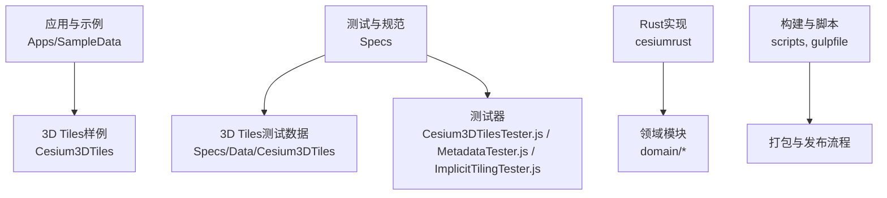
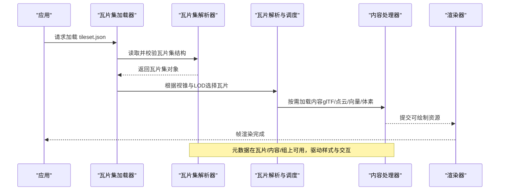
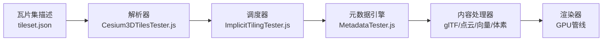

# 3D瓦片集结构元数据

<cite>
**本文引用的文件**   
- [README.md](file://README.md)
- [package.json](file://package.json)
- [Cesium3DTilesTester.js](file://Specs/Cesium3DTilesTester.js)
- [MetadataTester.js](file://Specs/MetadataTester.js)
- [ImplicitTilingTester.js](file://Specs/ImplicitTilingTester.js)
- [tileset.json](file://Apps/SampleData/Cesium3DTiles/Composite/Composite/tileset.json)
- [tileset_1.1.json](file://Apps/SampleData/Cesium3DTiles/EastNorthUpContent/tileset_1.1.json)
- [sample-cities-spain-v02.tileset.json](file://Apps/SampleData/vector/sample-cities-spain-v02.tileset.json)
- [root.json](file://Specs/Data/ArcGIS/9_214_379/root.json)
- [tilemap_10_384_640_128_128.json](file://Specs/Data/ArcGIS/9_214_379/tilemap_10_384_640_128_128.json)
- [cesiumrust/README.md](file://cesiumrust/README.md)
</cite>

## 目录
1. [简介](#简介)
2. [项目结构](#项目结构)
3. [核心组件](#核心组件)
4. [架构总览](#架构总览)
5. [详细组件分析](#详细组件分析)
6. [依赖关系分析](#依赖关系分析)
7. [性能考量](#性能考量)
8. [故障排查指南](#故障排查指南)
9. [结论](#结论)
10. [附录](#附录)

## 简介
本文件围绕“3D瓦片集结构元数据”展开，聚焦于Cesium代码库中与3D Tiles相关的瓦片集定义、元数据结构与测试样例。内容涵盖：
- 3D Tiles瓦片集（tileset）的JSON结构与语义
- 隐式瓦片（Implicit Tiling）与几何/点云/体素等内容的组织方式
- 元数据（Metadata）在瓦片、内容与层级上的标注方法
- 相关测试与示例数据的定位与使用说明

## 项目结构
仓库包含前端JavaScript实现、Rust后端模块以及大量用于验证与演示的样例数据。与3D瓦片集结构元数据直接相关的资源主要分布在以下位置：
- Apps/SampleData/Cesium3DTiles：官方示例瓦片集与内容样例
- Specs/Data/Cesium3DTiles：覆盖多种场景的测试数据集
- Specs 下的测试器：针对3D Tiles与元数据的自动化校验逻辑
- cesiumrust：Rust侧的领域模型与适配层（与瓦片加载、渲染管线集成）

图表来源 
- [README.md](file://README.md)
- [package.json](file://package.json)

章节来源
- [README.md](file://README.md)
- [package.json](file://package.json)

## 核心组件
- 瓦片集描述文件（tileset.json）：定义根节点、子瓦片、内容引用、边界体积、几何误差、变换与元数据等。
- 隐式瓦片规则：通过约定或配置生成子瓦片树，减少显式声明开销。
- 元数据体系：支持在瓦片集、瓦片、内容、组与属性级别附加结构化信息，便于查询与样式化。
- 测试与校验：通过测试器对瓦片集结构、元数据语义与兼容性进行断言。

章节来源
- [Cesium3DTilesTester.js](file://Specs/Cesium3DTilesTester.js)
- [MetadataTester.js](file://Specs/MetadataTester.js)
- [ImplicitTilingTester.js](file://Specs/ImplicitTilingTester.js)

## 架构总览
下图展示了从瓦片集描述到内容加载与渲染的关键路径，以及元数据在各层的附着点。

图表来源 
- [Cesium3DTilesTester.js](file://Specs/Cesium3DTilesTester.js)
- [MetadataTester.js](file://Specs/MetadataTester.js)

## 详细组件分析

### 瓦片集描述（tileset.json）
- 作用：定义3D瓦片集的根节点、子瓦片树、内容引用、边界体积、几何误差、变换矩阵、可见性条件与元数据等。
- 常见字段：根节点id、子瓦片数组、content（指向具体资源）、boundingVolume（包围盒/球/区域）、geometricError（细化阈值）、transform（坐标变换）、metadata（结构元数据）。
- 版本与扩展：不同版本的tileset可能引入新字段或语义变更，需结合测试用例验证兼容性。

示例参考
- [tileset.json](file://Apps/SampleData/Cesium3DTiles/Composite/Composite/tileset.json)
- [tileset_1.1.json](file://Apps/SampleData/Cesium3DTiles/EastNorthUpContent/tileset_1.1.json)

章节来源
- [tileset.json](file://Apps/SampleData/Cesium3DTiles/Composite/Composite/tileset.json)
- [tileset_1.1.json](file://Apps/SampleData/Cesium3DTiles/EastNorthUpContent/tileset_1.1.json)

### 隐式瓦片（Implicit Tiling）
- 概念：不显式列出所有子瓦片，而是通过规则（如四叉树/八叉树、隐式ID）动态生成瓦片树，降低描述文件体积。
- 关键要素：根瓦片、细分规则、内容模板、可用性掩码、几何误差传播。
- 适用场景：大规模地形、点云、体素与矢量瓦片的高效组织。

示例参考
- [ImplicitTilingTester.js](file://Specs/ImplicitTilingTester.js)

章节来源
- [ImplicitTilingTester.js](file://Specs/ImplicitTilingTester.js)

### 元数据（Metadata）
- 层次：瓦片集级、瓦片级、内容级、组级与属性级均可携带元数据。
- 用途：驱动样式、过滤、交互、分析与可视化；支持外部Schema与内联定义。
- 类型：标量、向量、纹理、时间序列等；可与几何属性绑定。

示例参考
- [MetadataTester.js](file://Specs/MetadataTester.js)

章节来源
- [MetadataTester.js](file://Specs/MetadataTester.js)

### 矢量瓦片与地理编码
- 矢量瓦片：以GeoJSON/TopoJSON等格式组织，按区域与缩放级别切片。
- ArcGIS TileMap：使用tilemapresource风格索引，提供瓦片URL模板与范围信息。

示例参考
- [sample-cities-spain-v02.tileset.json](file://Apps/SampleData/vector/sample-cities-spain-v02.tileset.json)
- [root.json](file://Specs/Data/ArcGIS/9_214_379/root.json)
- [tilemap_10_384_640_128_128.json](file://Specs/Data/ArcGIS/9_214_379/tilemap_10_384_640_128_128.json)

章节来源
- [sample-cities-spain-v02.tileset.json](file://Apps/SampleData/vector/sample-cities-spain-v02.tileset.json)
- [root.json](file://Specs/Data/ArcGIS/9_214_379/root.json)
- [tilemap_10_384_640_128_128.json](file://Specs/Data/ArcGIS/9_214_379/tilemap_10_384_640_128_128.json)

### Rust侧领域模型与适配
- 领域模块：封装地理空间、瓦片、材质、场景、时间等核心概念。
- 适配器：对接渲染框架（如Bevy）、解码器与网络层。
- 目标：提升性能与跨平台能力，同时保持与JS生态的互操作。

章节来源
- [cesiumrust/README.md](file://cesiumrust/README.md)

## 依赖关系分析
- 瓦片集解析依赖JSON Schema与校验逻辑，确保结构正确性与向后兼容。
- 隐式瓦片生成依赖细分规则与可用性掩码，影响内存占用与加载延迟。
- 元数据查询与样式引擎依赖属性映射与类型系统。
- Rust与JS之间通过接口契约与序列化协议协作，避免循环依赖。

图表来源 
- [Cesium3DTilesTester.js](file://Specs/Cesium3DTilesTester.js)
- [ImplicitTilingTester.js](file://Specs/ImplicitTilingTester.js)
- [MetadataTester.js](file://Specs/MetadataTester.js)

## 性能考量
- 合理设置几何误差与LOD策略，平衡精度与渲染成本。
- 使用隐式瓦片减少描述文件体积与解析开销。
- 批量加载与异步调度，避免主线程阻塞。
- 元数据查询尽量使用索引与缓存，降低重复计算。
- 控制纹理与几何大小，利用压缩与实例化技术。

## 故障排查指南
- 瓦片集结构错误：检查tileset.json字段完整性与类型，参考测试用例中的合法结构。
- 隐式瓦片不可见：确认细分规则、可用性掩码与边界体积是否正确。
- 元数据缺失或类型不匹配：核对Schema定义与属性映射，确保类型一致。
- 内容加载失败：检查content路径、网络可达性与解码器支持。
- 渲染异常：查看着色器与材质配置，确认法线、UV与坐标系一致性。

章节来源
- [Cesium3DTilesTester.js](file://Specs/Cesium3DTilesTester.js)
- [MetadataTester.js](file://Specs/MetadataTester.js)
- [ImplicitTilingTester.js](file://Specs/ImplicitTilingTester.js)

## 结论
3D瓦片集的结构元数据是高效组织与渲染大规模三维数据的核心。通过规范的瓦片集描述、隐式瓦片机制与完善的元数据体系，可以在保证精度的同时显著提升加载与渲染性能。结合测试与样例数据，开发者可以快速验证与优化自己的瓦片集方案。

## 附录
- 常用术语：瓦片集、隐式瓦片、几何误差、边界体积、元数据、内容、组、属性。
- 参考样例：Apps与Specs下的tileset与测试数据，可作为设计与实现的基准。
- 扩展方向：外部Schema、时间序列元数据、多源融合与增量更新。