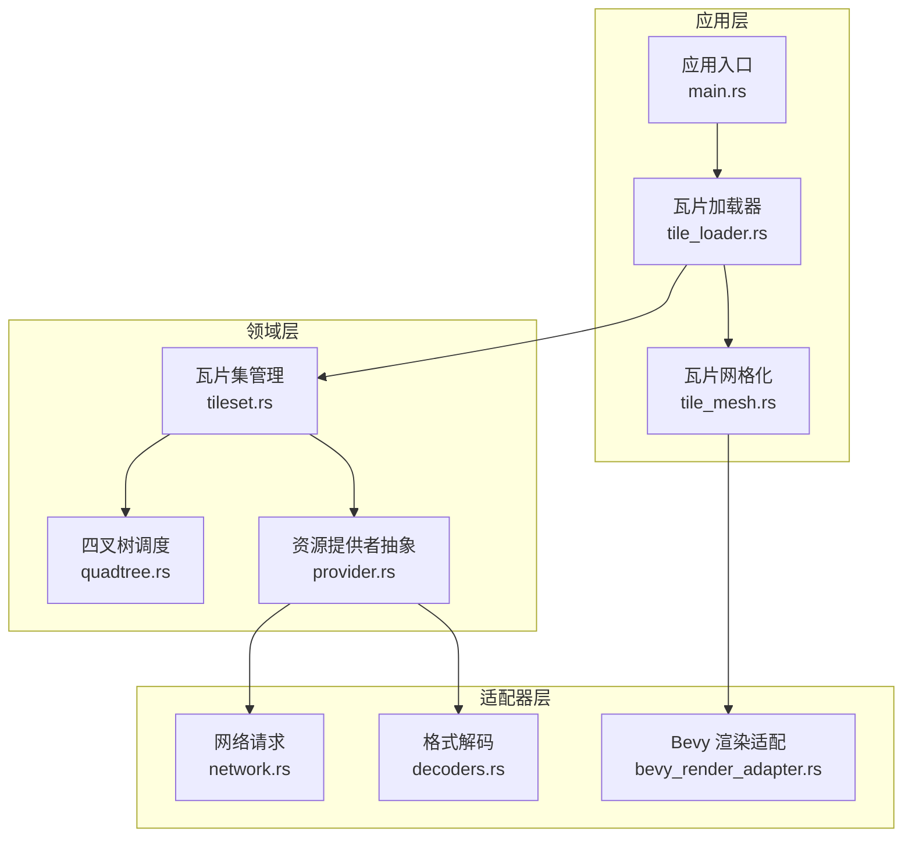
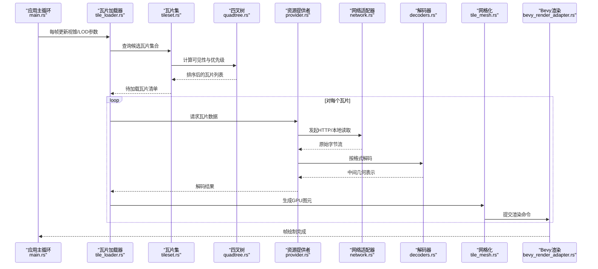
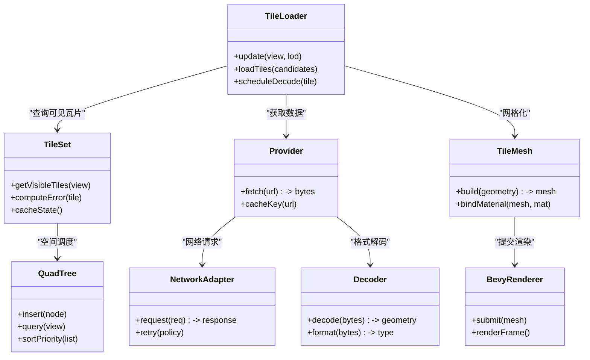

# 瓦片加载系统

<cite>
**本文引用的文件**   
- [tile_loader.rs](file://cesiumrust/application/cesium-app/src/tile_loader.rs)
- [tile_mesh.rs](file://cesiumrust/application/cesium-app/src/tile_mesh.rs)
- [main.rs](file://cesiumrust/application/cesium-app/src/main.rs)
- [Cargo.toml](file://cesiumrust/application/cesium-app/Cargo.toml)
- [tileset.rs](file://cesiumrust/domain/tileset/src/tileset.rs)
- [quadtree.rs](file://cesiumrust/domain/quadtree/src/quadtree.rs)
- [provider.rs](file://cesiumrust/domain/provider/src/provider.rs)
- [network.rs](file://cesiumrust/adapters/network/src/lib.rs)
- [decoders.rs](file://cesiumrust/adapters/decoders/src/lib.rs)
- [bevy_render_adapter.rs](file://cesiumrust/adapters/bevy-render/src/lib.rs)
</cite>

## 目录
1. [简介](#简介)
2. [项目结构](#项目结构)
3. [核心组件](#核心组件)
4. [架构总览](#架构总览)
5. [详细组件分析](#详细组件分析)
6. [依赖关系分析](#依赖关系分析)
7. [性能考量](#性能考量)
8. [故障排查指南](#故障排查指南)
9. [结论](#结论)
10. [附录](#附录)

## 简介
本文件面向“瓦片加载系统”的架构与实现，聚焦 Cesium Rust 工程中的 tile 加载管线。内容涵盖：
- 系统整体架构与数据流
- 关键模块职责、接口契约与交互时序
- 错误处理与边界条件
- 性能优化建议与常见问题定位

该文档以应用层（Bevy 应用）与领域层（Tileset、Quadtree、Provider）为核心，结合适配器层（网络、解码、渲染），给出端到端的可视化说明。

## 项目结构
Cesium Rust 采用分层与模块化设计：
- 应用层（application/cesium-app）：集成 Bevy 渲染循环，编排瓦片加载与渲染流程
- 领域层（domain/*）：定义 Tileset、Quadtree、Provider 等核心概念与算法
- 适配器层（adapters/*）：对接具体网络栈、解码器与渲染后端
- 示例与演示（bevy_demo、应用示例）：展示如何组合各模块

图表来源
- [main.rs:1-200](file://cesiumrust/application/cesium-app/src/main.rs#L1-L200)
- [tile_loader.rs:1-300](file://cesiumrust/application/cesium-app/src/tile_loader.rs#L1-L300)
- [tile_mesh.rs:1-200](file://cesiumrust/application/cesium-app/src/tile_mesh.rs#L1-L200)
- [tileset.rs:1-200](file://cesiumrust/domain/tileset/src/tileset.rs#L1-L200)
- [quadtree.rs:1-200](file://cesiumrust/domain/quadtree/src/quadtree.rs#L1-L200)
- [provider.rs:1-200](file://cesiumrust/domain/provider/src/provider.rs#L1-L200)
- [network.rs:1-200](file://cesiumrust/adapters/network/src/lib.rs#L1-L200)
- [decoders.rs:1-200](file://cesiumrust/adapters/decoders/src/lib.rs#L1-L200)
- [bevy_render_adapter.rs:1-200](file://cesiumrust/adapters/bevy-render/src/lib.rs#L1-L200)

章节来源
- [main.rs:1-200](file://cesiumrust/application/cesium-app/src/main.rs#L1-L200)
- [Cargo.toml:1-100](file://cesiumrust/application/cesium-app/Cargo.toml#L1-L100)

## 核心组件
- 瓦片加载器（tile_loader.rs）
  - 负责根据视锥与几何误差选择待加载瓦片，协调 Provider 下载与解码，并触发网格化与渲染
- 瓦片网格化（tile_mesh.rs）
  - 将解码后的几何数据转换为 GPU 可渲染的图元，支持 LOD、批处理与材质绑定
- 瓦片集管理（tileset.rs）
  - 维护瓦片层级、可见性、LOD 策略与缓存状态，驱动 Quadtree 调度
- 四叉树调度（quadtree.rs）
  - 基于空间划分与距离/误差阈值进行瓦片优先级排序与裁剪
- 资源提供者（provider.rs）
  - 抽象瓦片数据的获取方式（HTTP、本地、内存等），统一返回解码前的字节流或缓冲
- 网络适配器（network.rs）
  - 封装 HTTP 请求、重试、超时、并发限制与缓存头处理
- 解码器（decoders.rs）
  - 解析 glTF/3DTiles、点云、矢量瓦片等格式，输出中间几何表示
- Bevy 渲染适配（bevy_render_adapter.rs）
  - 将中间几何转换为 Bevy Mesh/Bundle，提交到渲染管线

章节来源
- [tile_loader.rs:1-300](file://cesiumrust/application/cesium-app/src/tile_loader.rs#L1-L300)
- [tile_mesh.rs:1-200](file://cesiumrust/application/cesium-app/src/tile_mesh.rs#L1-L200)
- [tileset.rs:1-200](file://cesiumrust/domain/tileset/src/tileset.rs#L1-L200)
- [quadtree.rs:1-200](file://cesiumrust/domain/quadtree/src/quadtree.rs#L1-L200)
- [provider.rs:1-200](file://cesiumrust/domain/provider/src/provider.rs#L1-L200)
- [network.rs:1-200](file://cesiumrust/adapters/network/src/lib.rs#L1-L200)
- [decoders.rs:1-200](file://cesiumrust/adapters/decoders/src/lib.rs#L1-L200)
- [bevy_render_adapter.rs:1-200](file://cesiumrust/adapters/bevy-render/src/lib.rs#L1-L200)

## 架构总览
下图展示了从相机更新到瓦片渲染的关键调用链，强调数据在模块间的流转与职责边界。

图表来源
- [tile_loader.rs:1-300](file://cesiumrust/application/cesium-app/src/tile_loader.rs#L1-L300)
- [tileset.rs:1-200](file://cesiumrust/domain/tileset/src/tileset.rs#L1-L200)
- [quadtree.rs:1-200](file://cesiumrust/domain/quadtree/src/quadtree.rs#L1-L200)
- [provider.rs:1-200](file://cesiumrust/domain/provider/src/provider.rs#L1-L200)
- [network.rs:1-200](file://cesiumrust/adapters/network/src/lib.rs#L1-L200)
- [decoders.rs:1-200](file://cesiumrust/adapters/decoders/src/lib.rs#L1-L200)
- [tile_mesh.rs:1-200](file://cesiumrust/application/cesium-app/src/tile_mesh.rs#L1-L200)
- [bevy_render_adapter.rs:1-200](file://cesiumrust/adapters/bevy-render/src/lib.rs#L1-L200)

## 详细组件分析

### 瓦片加载器（tile_loader.rs）
- 职责
  - 接收相机与LOD参数，调用 Tileset 获取候选瓦片
  - 控制并发下载与解码，避免帧卡顿
  - 将解码结果交给 Mesh 生成渲染对象
- 关键流程
  - 筛选：基于视锥裁剪与几何误差阈值
  - 调度：去重、优先级排序、取消重复请求
  - 执行：并行拉取、解码、入队渲染
- 错误处理
  - 网络失败重试与降级（回退至父级瓦片）
  - 解码异常跳过并记录日志
  - 资源上限保护（内存/显存配额）

章节来源
- [tile_loader.rs:1-300](file://cesiumrust/application/cesium-app/src/tile_loader.rs#L1-L300)

### 瓦片网格化（tile_mesh.rs）
- 职责
  - 将中间几何表示转换为 Bevy Mesh
  - 支持批处理、材质绑定、法线/UV 生成
  - 管理顶点/索引缓冲与实例化渲染
- 关键流程
  - 输入校验与拓扑修复
  - 构建缓冲区与属性布局
  - 提交渲染命令并绑定材质
- 性能要点
  - 使用零拷贝缓冲传递
  - 合并小图元减少 draw call
  - 按需重建（增量更新）

章节来源
- [tile_mesh.rs:1-200](file://cesiumrust/application/cesium-app/src/tile_mesh.rs#L1-L200)

### 瓦片集管理（tileset.rs）
- 职责
  - 维护瓦片树结构与状态（已加载/加载中/未加载）
  - 计算几何误差与屏幕空间误差
  - 提供可见性查询与LOD切换
- 关键流程
  - 初始化根节点与子节点
  - 遍历与裁剪（AABB/球体测试）
  - 缓存命中与失效策略
- 扩展点
  - 自定义瓦片规则（Implicit Tiling）
  - 多源融合（叠加图层）

章节来源
- [tileset.rs:1-200](file://cesiumrust/domain/tileset/src/tileset.rs#L1-L200)

### 四叉树调度（quadtree.rs）
- 职责
  - 基于空间划分组织瓦片
  - 计算距离与误差，生成加载优先级队列
  - 支持动态插入/删除与批量更新
- 关键流程
  - 节点分裂与合并
  - 视锥相交检测
  - 优先级评分与去抖
- 复杂度
  - 插入/查询 O(log N)
  - 批量更新 O(K log N)

章节来源
- [quadtree.rs:1-200](file://cesiumrust/domain/quadtree/src/quadtree.rs#L1-L200)

### 资源提供者（provider.rs）
- 职责
  - 抽象瓦片数据来源（HTTP、本地、内存）
  - 统一返回字节流或缓冲
  - 管理缓存键与过期策略
- 关键流程
  - 解析URL与路径映射
  - 选择具体实现（NetworkProvider/LocalProvider/MemoryProvider）
  - 返回解码前数据
- 错误处理
  - 协议不支持时抛出明确错误
  - 缓存未命中时的回退逻辑

章节来源
- [provider.rs:1-200](file://cesiumrust/domain/provider/src/provider.rs#L1-L200)

### 网络适配器（network.rs）
- 职责
  - 封装HTTP请求，支持并发、重试、超时
  - 处理响应头（缓存、压缩、跨域）
  - 暴露进度回调与取消令牌
- 关键流程
  - 构造请求（Headers、Timeout、RetryPolicy）
  - 发送与接收（分块/完整）
  - 错误分类（网络/协议/业务）
- 性能要点
  - 连接池复用
  - 异步非阻塞IO
  - 限速与背压

章节来源
- [network.rs:1-200](file://cesiumrust/adapters/network/src/lib.rs#L1-L200)

### 解码器（decoders.rs）
- 职责
  - 解析多种瓦片格式（glTF/3DTiles、点云、矢量）
  - 输出统一的中间几何表示
  - 支持可选扩展（Draco、KTX2）
- 关键流程
  - 格式识别与路由
  - 流式解码与内存管理
  - 元数据提取（边界、LOD、材质）
- 错误处理
  - 格式不匹配与损坏检测
  - 降级为空白几何并上报

章节来源
- [decoders.rs:1-200](file://cesiumrust/adapters/decoders/src/lib.rs#L1-L200)

### Bevy 渲染适配（bevy_render_adapter.rs）
- 职责
  - 将中间几何转换为 Bevy Mesh/Bundle
  - 绑定材质、纹理与Uniform
  - 提交到渲染管线（PBR/Unlit）
- 关键流程
  - 构建顶点/索引缓冲
  - 设置渲染状态（深度、混合、剔除）
  - 实例化与批处理
- 性能要点
  - 最小化状态切换
  - 使用 Compute/Compute Shader 预处理
  - 延迟着色与延迟更新

章节来源
- [bevy_render_adapter.rs:1-200](file://cesiumrust/adapters/bevy-render/src/lib.rs#L1-L200)

## 依赖关系分析

图表来源
- [tile_loader.rs:1-300](file://cesiumrust/application/cesium-app/src/tile_loader.rs#L1-L300)
- [tileset.rs:1-200](file://cesiumrust/domain/tileset/src/tileset.rs#L1-L200)
- [quadtree.rs:1-200](file://cesiumrust/domain/quadtree/src/quadtree.rs#L1-L200)
- [provider.rs:1-200](file://cesiumrust/domain/provider/src/provider.rs#L1-L200)
- [network.rs:1-200](file://cesiumrust/adapters/network/src/lib.rs#L1-L200)
- [decoders.rs:1-200](file://cesiumrust/adapters/decoders/src/lib.rs#L1-L200)
- [tile_mesh.rs:1-200](file://cesiumrust/application/cesium-app/src/tile_mesh.rs#L1-L200)
- [bevy_render_adapter.rs:1-200](file://cesiumrust/adapters/bevy-render/src/lib.rs#L1-L200)

章节来源
- [Cargo.toml:1-100](file://cesiumrust/application/cesium-app/Cargo.toml#L1-L100)

## 性能考量
- 并发与背压
  - 限制同时下载数量，避免带宽拥塞
  - 使用优先级队列保证关键瓦片优先
- 缓存策略
  - 多级缓存（内存/磁盘/显存）
  - 合理设置 TTL 与失效条件
- 解码优化
  - 流式解码减少峰值内存
  - 使用硬件加速（Draco/KTX2）
- 渲染优化
  - 批处理与实例化减少 draw call
  - 延迟更新与增量重建
- 内存管理
  - 监控显存占用，及时释放不可见瓦片
  - 使用对象池复用缓冲

[本节为通用指导，无需特定文件引用]

## 故障排查指南
- 瓦片无法加载
  - 检查网络适配器配置（代理、超时、重试）
  - 验证 URL 与鉴权头
  - 查看解码器日志确认格式正确
- 渲染闪烁或黑屏
  - 检查材质绑定与纹理加载状态
  - 确认顶点/索引缓冲有效
  - 调试深度与混合状态
- 性能抖动
  - 监控 CPU/GPU 占用与帧时间
  - 调整并发与LOD阈值
  - 启用增量更新与批处理
- 内存泄漏
  - 检查瓦片缓存清理策略
  - 确保解码后中间对象释放
  - 使用内存分析工具定位热点

章节来源
- [network.rs:1-200](file://cesiumrust/adapters/network/src/lib.rs#L1-L200)
- [decoders.rs:1-200](file://cesiumrust/adapters/decoders/src/lib.rs#L1-L200)
- [tile_mesh.rs:1-200](file://cesiumrust/application/cesium-app/src/tile_mesh.rs#L1-L200)

## 结论
本瓦片加载系统通过清晰的层次划分与职责分离，实现了高效、可扩展的瓦片加载与渲染管线。核心优势包括：
- 灵活的 Provider 抽象，支持多数据源
- 强大的 Quadtree 调度，保障LOD与可见性
- 完善的错误处理与性能优化策略
- 与 Bevy 渲染管线的无缝集成

建议在大规模场景中重点关注并发控制、缓存命中率与解码性能，以获得稳定流畅的用户体验。

[本节为总结性内容，无需特定文件引用]

## 附录
- 术语表
  - 瓦片（Tile）：地理空间的分块数据单元
  - LOD（Level of Detail）：细节层次，随距离变化
  - 四叉树（Quadtree）：空间划分数据结构
  - Provider：资源获取抽象
  - 解码器（Decoder）：格式解析组件
- 最佳实践
  - 合理设置几何误差阈值
  - 使用渐进式加载与预取
  - 监控关键指标（FPS、内存、带宽）

[本节为补充信息，无需特定文件引用]