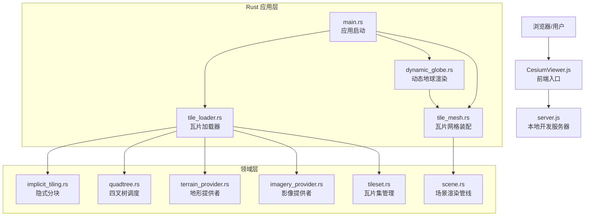
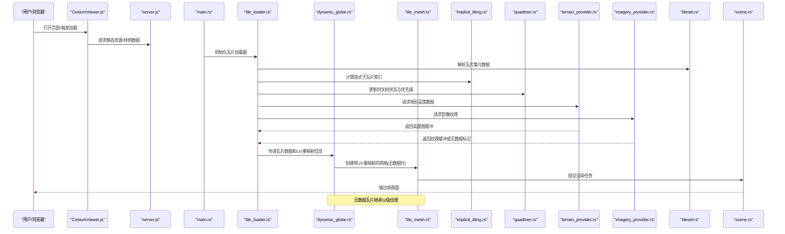
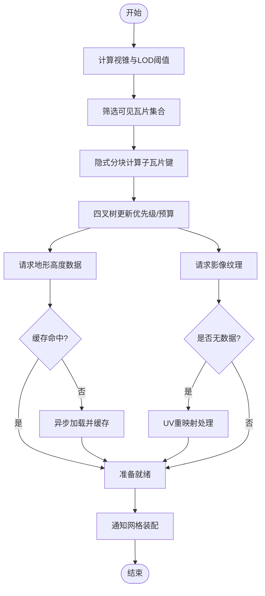
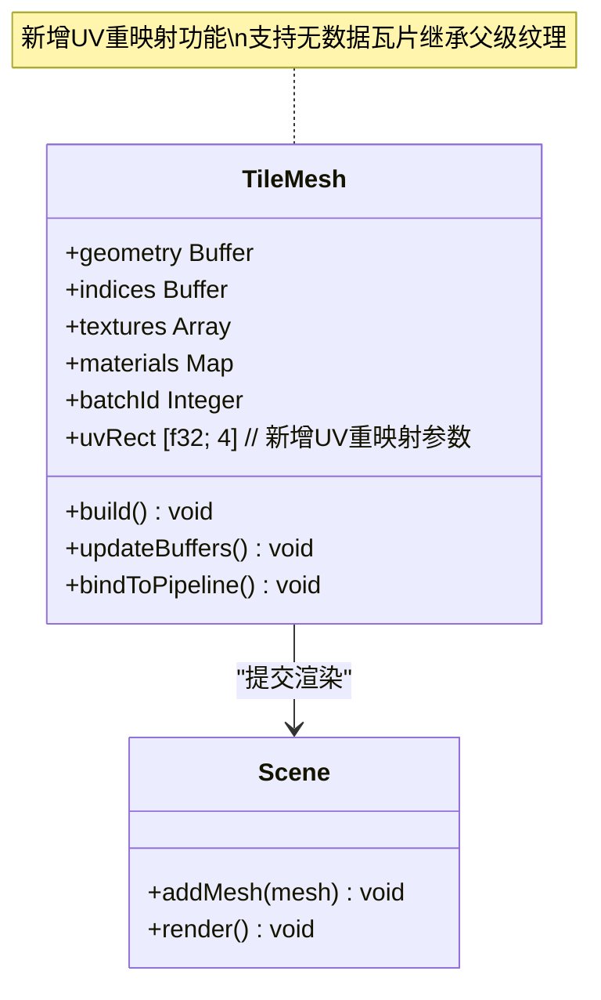
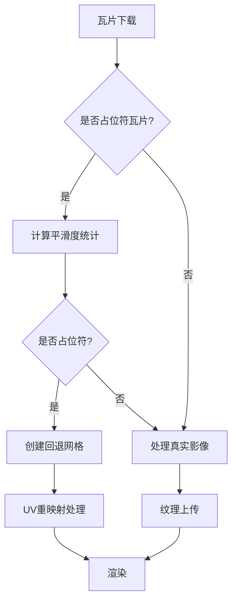
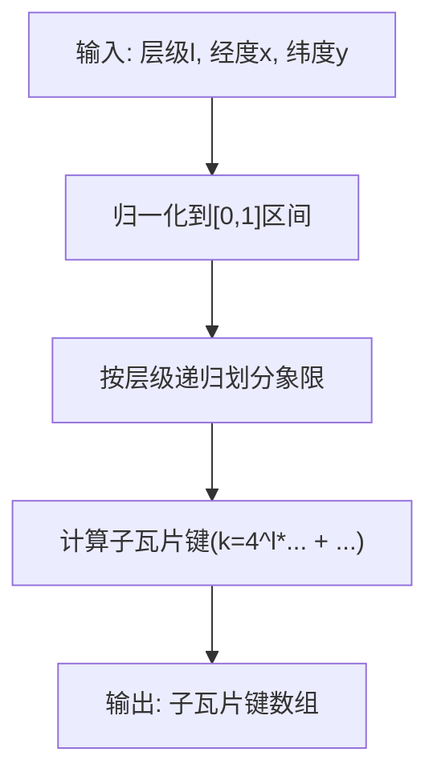
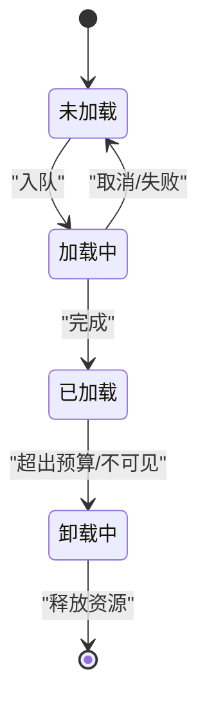
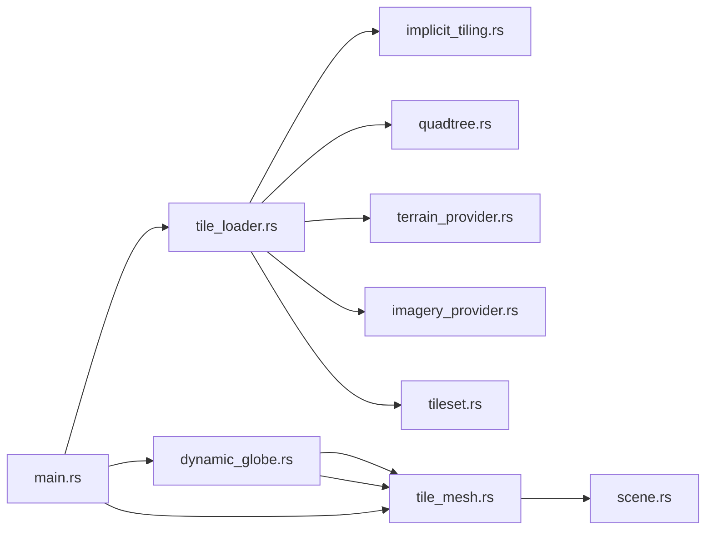

# 瓦片网格生成

<cite>
**本文引用的文件**   
- [README.md](file://README.md)
- [package.json](file://package.json)
- [gulpfile.js](file://gulpfile.js)
- [server.js](file://server.js)
- [index.html](file://index.html)
- [CesiumViewer.js](file://Apps/CesiumViewer/CesiumViewer.js)
- [tile_loader.rs](file://cesiumrust/application/cesium-app/src/tile_loader.rs)
- [tile_mesh.rs](file://cesiumrust/application/cesium-app/src/tile_mesh.rs)
- [dynamic_globe.rs](file://cesiumrust/application/cesium-app/src/dynamic_globe.rs)
- [main.rs](file://cesiumrust/application/cesium-app/src/main.rs)
- [implicit_tiling.rs](file://cesiumrust/domain/implicit-tiling/src/lib.rs)
- [quadtree.rs](file://cesiumrust/domain/quadtree/src/lib.rs)
- [terrain_provider.rs](file://cesiumrust/domain/terrain/src/lib.rs)
- [imagery_provider.rs](file://cesiumrust/domain/imagery/src/lib.rs)
- [tileset.rs](file://cesiumrust/domain/tileset/src/lib.rs)
- [scene.rs](file://cesiumrust/domain/scene/src/lib.rs)
</cite>

## 更新摘要
**变更内容**   
- 新增UV重映射功能，支持无数据瓦片继承父级纹理
- 增强create_tile_mesh_uv函数实现无缝回退系统
- 改进瓦片加载器处理无影像数据的场景
- 优化纹理采样和回退机制

## 目录
1. [简介](#简介)
2. [项目结构](#项目结构)
3. [核心组件](#核心组件)
4. [架构总览](#架构总览)
5. [详细组件分析](#详细组件分析)
6. [依赖关系分析](#依赖关系分析)
7. [性能考量](#性能考量)
8. [故障排查指南](#故障排查指南)
9. [结论](#结论)
10. [附录](#附录)

## 简介
本文件围绕"瓦片网格生成"这一目标，对仓库中与瓦片（Tile）加载、隐式分块、四叉树调度、地形与影像提供者以及渲染装配相关的代码进行系统化梳理。文档面向不同技术背景的读者，既提供高层架构概览，也深入到关键模块的数据结构与处理流程，并辅以图示帮助理解。

**更新** 本次更新重点增强了UV重映射功能，通过新增的create_tile_mesh_uv函数实现了无数据瓦片的无缝回退系统，使没有影像数据的瓦片可以显示父级瓦片纹理的部分内容。

## 项目结构
该仓库包含前端示例应用、构建脚本、测试数据以及 Rust 实现的 Cesium 相关功能域。与"瓦片网格生成"直接相关的重点目录包括：
- Apps/CesiumViewer：前端演示入口与初始化逻辑
- cesiumrust/application/cesium-app：Rust 应用层，负责瓦片加载与网格组装
- cesiumrust/domain/*：领域层模块，涵盖隐式分块、四叉树、地形、影像、瓦片集、场景等
- 根目录脚本与配置：构建、运行与本地服务

图表来源 
- [CesiumViewer.js:1-200](file://Apps/CesiumViewer/CesiumViewer.js#L1-L200)
- [server.js:1-200](file://server.js#L1-L200)
- [main.rs:1-200](file://cesiumrust/application/cesium-app/src/main.rs#L1-L200)
- [tile_loader.rs:1-200](file://cesiumrust/application/cesium-app/src/tile_loader.rs#L1-L200)
- [tile_mesh.rs:1-200](file://cesiumrust/application/cesium-app/src/tile_mesh.rs#L1-L200)
- [dynamic_globe.rs:1-200](file://cesiumrust/application/cesium-app/src/dynamic_globe.rs#L1-L200)
- [implicit_tiling.rs:1-200](file://cesiumrust/domain/implicit-tiling/src/lib.rs#L1-L200)
- [quadtree.rs:1-200](file://cesiumrust/domain/quadtree/src/lib.rs#L1-L200)
- [terrain_provider.rs:1-200](file://cesiumrust/domain/terrain/src/lib.rs#L1-L200)
- [imagery_provider.rs:1-200](file://cesiumrust/domain/imagery/src/lib.rs#L1-L200)
- [tileset.rs:1-200](file://cesiumrust/domain/tileset/src/lib.rs#L1-L200)
- [scene.rs:1-200](file://cesiumrust/domain/scene/src/lib.rs#L1-L200)

章节来源
- [README.md:1-200](file://README.md#L1-L200)
- [package.json:1-200](file://package.json#L1-L200)
- [gulpfile.js:1-200](file://gulpfile.js#L1-L200)
- [server.js:1-200](file://server.js#L1-L200)
- [index.html:1-200](file://index.html#L1-L200)

## 核心组件
- 瓦片加载器（tile_loader.rs）：负责根据视锥与细节层次（LOD）策略请求与缓存瓦片资源，协调隐式分块与四叉树调度。
- 瓦片网格装配（tile_mesh.rs）：将已加载的瓦片几何与纹理组合为可渲染的网格对象，支持批量化与材质绑定。**新增UV重映射功能**。
- 动态地球渲染（dynamic_globe.rs）：处理瓦片的下载、缓存和渲染，**新增无数据瓦片回退机制**。
- 隐式分块（implicit_tiling.rs）：基于坐标与层级规则动态计算子瓦片索引，避免显式存储整棵树。
- 四叉树调度（quadtree.rs）：维护可见性、优先级与内存预算，驱动按需加载与卸载。
- 地形与影像提供者（terrain_provider.rs, imagery_provider.rs）：抽象数据源接口，统一高度场与贴图数据的获取与格式转换。
- 瓦片集管理（tileset.rs）：解析 tileset.json，组织父子关系、边界体积与元数据。
- 场景渲染管线（scene.rs）：整合相机、光照、着色器与绘制调用，输出最终帧。

章节来源
- [tile_loader.rs:1-200](file://cesiumrust/application/cesium-app/src/tile_loader.rs#L1-L200)
- [tile_mesh.rs:1-200](file://cesiumrust/application/cesium-app/src/tile_mesh.rs#L1-L200)
- [dynamic_globe.rs:1-200](file://cesiumrust/application/cesium-app/src/dynamic_globe.rs#L1-L200)
- [implicit_tiling.rs:1-200](file://cesiumrust/domain/implicit-tiling/src/lib.rs#L1-L200)
- [quadtree.rs:1-200](file://cesiumrust/domain/quadtree/src/lib.rs#L1-L200)
- [terrain_provider.rs:1-200](file://cesiumrust/domain/terrain/src/lib.rs#L1-L200)
- [imagery_provider.rs:1-200](file://cesiumrust/domain/imagery/src/lib.rs#L1-L200)
- [tileset.rs:1-200](file://cesiumrust/domain/tileset/src/lib.rs#L1-L200)
- [scene.rs:1-200](file://cesiumrust/domain/scene/src/lib.rs#L1-L200)

## 架构总览
下图展示从前端到 Rust 后端再到渲染管线的整体数据流与控制流，突出瓦片网格生成的关键路径和无数据瓦片回退机制。

图表来源 
- [CesiumViewer.js:1-200](file://Apps/CesiumViewer/CesiumViewer.js#L1-L200)
- [server.js:1-200](file://server.js#L1-L200)
- [main.rs:1-200](file://cesiumrust/application/cesium-app/src/main.rs#L1-L200)
- [tile_loader.rs:1-200](file://cesiumrust/application/cesium-app/src/tile_loader.rs#L1-L200)
- [dynamic_globe.rs:1-200](file://cesiumrust/application/cesium-app/src/dynamic_globe.rs#L1-L200)
- [tile_mesh.rs:1-200](file://cesiumrust/application/cesium-app/src/tile_mesh.rs#L1-L200)
- [implicit_tiling.rs:1-200](file://cesiumrust/domain/implicit-tiling/src/lib.rs#L1-L200)
- [quadtree.rs:1-200](file://cesiumrust/domain/quadtree/src/lib.rs#L1-L200)
- [terrain_provider.rs:1-200](file://cesiumrust/domain/terrain/src/lib.rs#L1-L200)
- [imagery_provider.rs:1-200](file://cesiumrust/domain/imagery/src/lib.rs#L1-L200)
- [tileset.rs:1-200](file://cesiumrust/domain/tileset/src/lib.rs#L1-L200)
- [scene.rs:1-200](file://cesiumrust/domain/scene/src/lib.rs#L1-L200)

## 详细组件分析

### 瓦片加载器（tile_loader.rs）
- 职责：根据相机位置与视锥裁剪，结合 LOD 阈值决定加载哪些瓦片；协调隐式分块与四叉树；发起地形与影像请求；管理缓存与去重。
- 关键流程：
  - 计算当前可见瓦片集合
  - 查询隐式分块规则得到子瓦片键
  - 通过四叉树评估优先级与内存占用
  - 并行拉取地形与影像数据
  - 回调通知网格装配阶段

图表来源 
- [tile_loader.rs:1-200](file://cesiumrust/application/cesium-app/src/tile_loader.rs#L1-L200)
- [implicit_tiling.rs:1-200](file://cesiumrust/domain/implicit-tiling/src/lib.rs#L1-L200)
- [quadtree.rs:1-200](file://cesiumrust/domain/quadtree/src/lib.rs#L1-L200)
- [terrain_provider.rs:1-200](file://cesiumrust/domain/terrain/src/lib.rs#L1-L200)
- [imagery_provider.rs:1-200](file://cesiumrust/domain/imagery/src/lib.rs#L1-L200)

章节来源
- [tile_loader.rs:1-200](file://cesiumrust/application/cesium-app/src/tile_loader.rs#L1-L200)

### 瓦片网格装配（tile_mesh.rs）
- 职责：将瓦片几何与纹理合并为可渲染网格；支持批处理、材质绑定与实例化优化。
- **新增功能**：UV重映射支持无数据瓦片继承父级纹理。
- 关键点：
  - 几何拼接与索引重建
  - UV映射与纹理采样参数设置
  - **新增UV矩形重映射**：支持指定纹理区域采样
  - 批次合并减少绘制调用
  - 与场景渲染管线对接

图表来源 
- [tile_mesh.rs:100-170](file://cesiumrust/application/cesium-app/src/tile_mesh.rs#L100-L170)
- [scene.rs:1-200](file://cesiumrust/domain/scene/src/lib.rs#L1-L200)

章节来源
- [tile_mesh.rs:1-200](file://cesiumrust/application/cesium-app/src/tile_mesh.rs#L1-L200)

### 动态地球渲染（dynamic_globe.rs）
- 职责：管理瓦片的下载、缓存、UV重映射和渲染，实现无缝的回退机制。
- **新增功能**：无数据瓦片检测和父级纹理继承。
- 关键点：
  - 瓦片下载和缓存管理
  - **新增占位符瓦片检测**：识别Bing Maps的无数据占位符
  - **新增平滑度统计**：通过分析像素差异判断是否为真实影像
  - **新增UV重映射网格创建**：为无数据瓦片创建继承父级纹理的网格
  - 材质管理和渲染优化

图表来源 
- [dynamic_globe.rs:1000-1042](file://cesiumrust/application/cesium-app/src/dynamic_globe.rs#L1000-L1042)
- [dynamic_globe.rs:1148-1152](file://cesiumrust/application/cesium-app/src/dynamic_globe.rs#L1148-L1152)

章节来源
- [dynamic_globe.rs:1000-1322](file://cesiumrust/application/cesium-app/src/dynamic_globe.rs#L1000-L1322)

### 隐式分块（implicit_tiling.rs）
- 职责：依据层级与经纬度坐标计算子瓦片索引，无需显式存储整棵瓦片树。
- 算法要点：
  - 父瓦片范围划分
  - 子瓦片键编码（z-order/Morton或行列号）
  - 快速判断瓦片存在性与顺序

图表来源 
- [implicit_tiling.rs:1-200](file://cesiumrust/domain/implicit-tiling/src/lib.rs#L1-L200)

章节来源
- [implicit_tiling.rs:1-200](file://cesiumrust/domain/implicit-tiling/src/lib.rs#L1-L200)

### 四叉树调度（quadtree.rs）
- 职责：维护瓦片节点的状态（未加载、加载中、已加载、卸载）、优先级与内存预算，驱动加载队列。
- 关键点：
  - 节点可见性判定
  - 距离与屏幕空间误差评估
  - 批量加载与淘汰策略

图表来源 
- [quadtree.rs:1-200](file://cesiumrust/domain/quadtree/src/lib.rs#L1-L200)

章节来源
- [quadtree.rs:1-200](file://cesiumrust/domain/quadtree/src/lib.rs#L1-L200)

### 地形与影像提供者（terrain_provider.rs, imagery_provider.rs）
- 职责：抽象数据源接口，统一高度场与贴图数据的获取、解码与格式转换。
- 关键点：
  - 多格式支持（如 QuantizedMesh、KTX2）
  - 并发请求与错误重试
  - 内存池与缓冲区复用

章节来源
- [terrain_provider.rs:1-200](file://cesiumrust/domain/terrain/src/lib.rs#L1-L200)
- [imagery_provider.rs:1-200](file://cesiumrust/domain/imagery/src/lib.rs#L1-L200)

### 瓦片集管理（tileset.rs）
- 职责：解析 tileset.json，组织父子关系、边界体积、元数据与内容引用。
- 关键点：
  - JSON Schema 校验
  - 懒加载子瓦片描述
  - 边界体积预计算加速裁剪

章节来源
- [tileset.rs:1-200](file://cesiumrust/domain/tileset/src/lib.rs#L1-L200)

### 场景渲染管线（scene.rs）
- 职责：整合相机、光照、着色器与绘制调用，输出最终帧。
- 关键点：
  - 渲染通道（前向/延迟）
  - 批处理与实例化
  - 深度与透明度排序

章节来源
- [scene.rs:1-200](file://cesiumrust/domain/scene/src/lib.rs#L1-L200)

## 依赖关系分析
- 低耦合高内聚：各领域模块通过清晰接口交互，避免循环依赖。
- 关键依赖链：
  - tile_loader.rs 依赖 implicit_tiling.rs、quadtree.rs、terrain_provider.rs、imagery_provider.rs、tileset.rs
  - tile_mesh.rs 依赖 scene.rs
  - dynamic_globe.rs 依赖 tile_mesh.rs 和纹理管理
  - main.rs 作为应用入口协调上述模块

图表来源 
- [tile_loader.rs:1-200](file://cesiumrust/application/cesium-app/src/tile_loader.rs#L1-L200)
- [dynamic_globe.rs:1-200](file://cesiumrust/application/cesium-app/src/dynamic_globe.rs#L1-L200)
- [tile_mesh.rs:1-200](file://cesiumrust/application/cesium-app/src/tile_mesh.rs#L1-L200)
- [scene.rs:1-200](file://cesiumrust/domain/scene/src/lib.rs#L1-L200)
- [implicit_tiling.rs:1-200](file://cesiumrust/domain/implicit-tiling/src/lib.rs#L1-L200)
- [quadtree.rs:1-200](file://cesiumrust/domain/quadtree/src/lib.rs#L1-L200)
- [terrain_provider.rs:1-200](file://cesiumrust/domain/terrain/src/lib.rs#L1-L200)
- [imagery_provider.rs:1-200](file://cesiumrust/domain/imagery/src/lib.rs#L1-L200)
- [tileset.rs:1-200](file://cesiumrust/domain/tileset/src/lib.rs#L1-L200)
- [main.rs:1-200](file://cesiumrust/application/cesium-app/src/main.rs#L1-L200)

章节来源
- [main.rs:1-200](file://cesiumrust/application/cesium-app/src/main.rs#L1-L200)

## 性能考量
- 隐式分块降低内存占用，避免显式树结构。
- 四叉树优先级与预算控制实现按需加载与及时卸载。
- 地形与影像并发请求提升吞吐，配合缓存减少重复下载。
- 网格批处理与实例化减少绘制调用，提高 GPU 利用率。
- **新增UV重映射优化**：无数据瓦片直接继承父级纹理，避免额外纹理下载。
- **新增占位符检测**：提前识别无数据瓦片，减少无效处理。
- 建议：
  - 合理设置 LOD 阈值与最大并发数
  - 使用纹理压缩与高度图量化格式
  - 监控内存峰值与帧时间，动态调整预算
  - 优化UV重映射参数以获得最佳视觉效果

## 故障排查指南
- 常见问题：
  - 瓦片不显示：检查 tileset.json 路径与网络可达性
  - 闪烁或撕裂：确认深度排序与透明度混合设置
  - 卡顿：查看四叉树预算是否过小或并发过高
  - 内存泄漏：检查缓存清理与缓冲区释放
  - **新增**：无数据瓦片显示异常：检查UV重映射参数和平滑度检测阈值
- 调试步骤：
  - 启用日志输出，定位加载失败点
  - 使用开发者工具观察网络请求与资源占用
  - 逐步缩小可见区域验证隐式分块与四叉树行为
  - **新增**：检查占位符瓦片检测逻辑和平滑度统计结果

章节来源
- [tile_loader.rs:1-200](file://cesiumrust/application/cesium-app/src/tile_loader.rs#L1-L200)
- [dynamic_globe.rs:1000-1042](file://cesiumrust/application/cesium-app/src/dynamic_globe.rs#L1000-L1042)
- [quadtree.rs:1-200](file://cesiumrust/domain/quadtree/src/lib.rs#L1-L200)
- [terrain_provider.rs:1-200](file://cesiumrust/domain/terrain/src/lib.rs#L1-L200)
- [imagery_provider.rs:1-200](file://cesiumrust/domain/imagery/src/lib.rs#L1-L200)

## 结论
通过对瓦片加载、隐式分块、四叉树调度、地形与影像提供者、瓦片集管理与渲染管线的系统分析，可以清晰地看到"瓦片网格生成"的核心在于高效的数据获取、合理的调度策略与稳定的渲染装配。**本次更新引入的UV重映射和无数据瓦片回退机制显著提升了系统的鲁棒性和用户体验**，确保即使在没有影像数据的区域也能显示合理的纹理内容，避免了传统方法中的空洞问题。遵循本文给出的最佳实践与性能建议，可在大规模地理可视化场景中实现流畅、稳定且可扩展的瓦片网格生成。

## 附录
- 前端入口与示例：CesiumViewer.js、index.html
- 构建与服务：gulpfile.js、server.js、package.json
- Rust 应用入口：main.rs
- **新增**：UV重映射实现：tile_mesh.rs中的create_tile_mesh_uv函数
- **新增**：无数据瓦片处理：dynamic_globe.rs中的占位符检测和回退机制