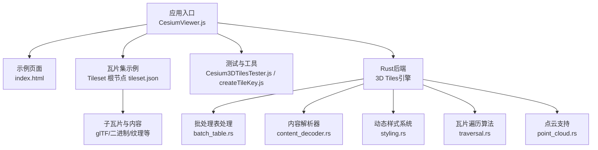
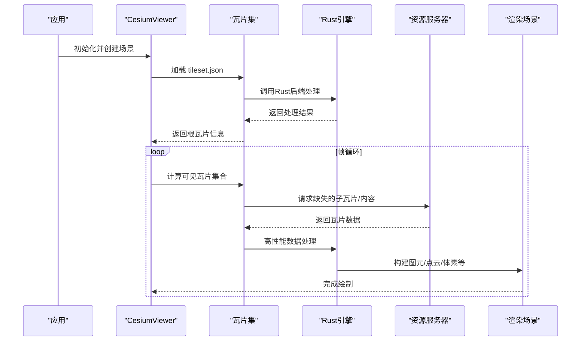
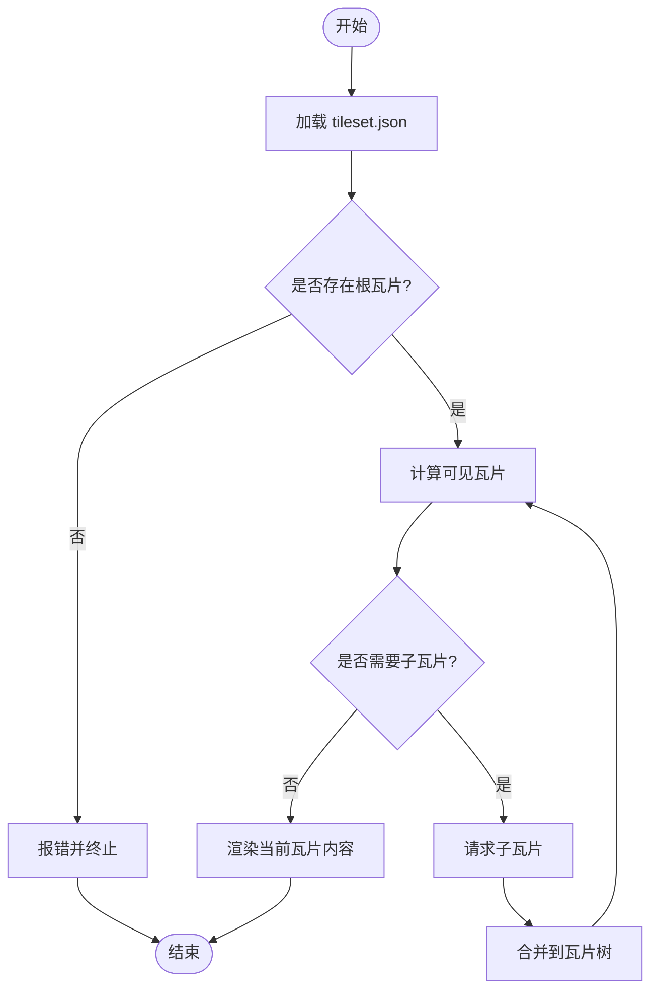
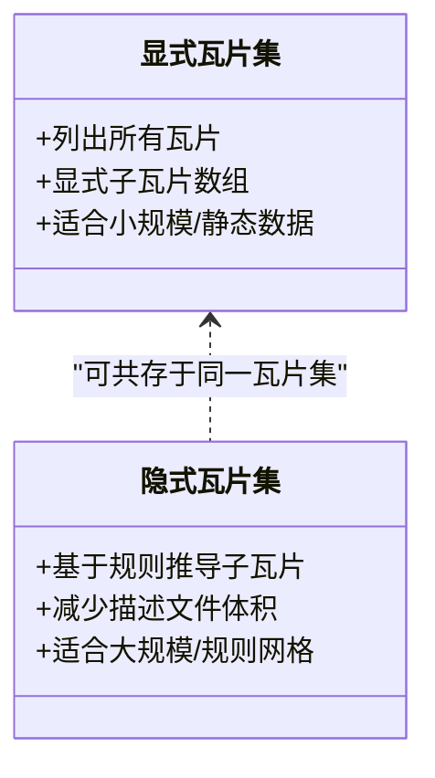
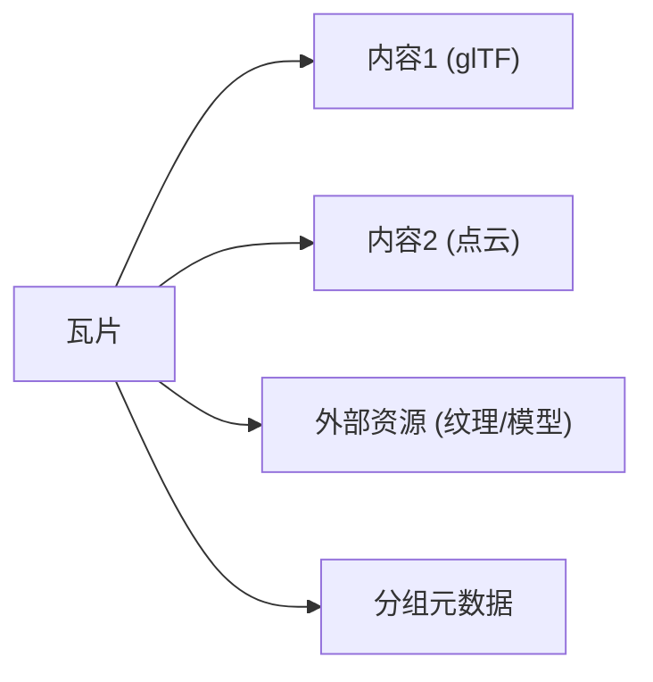
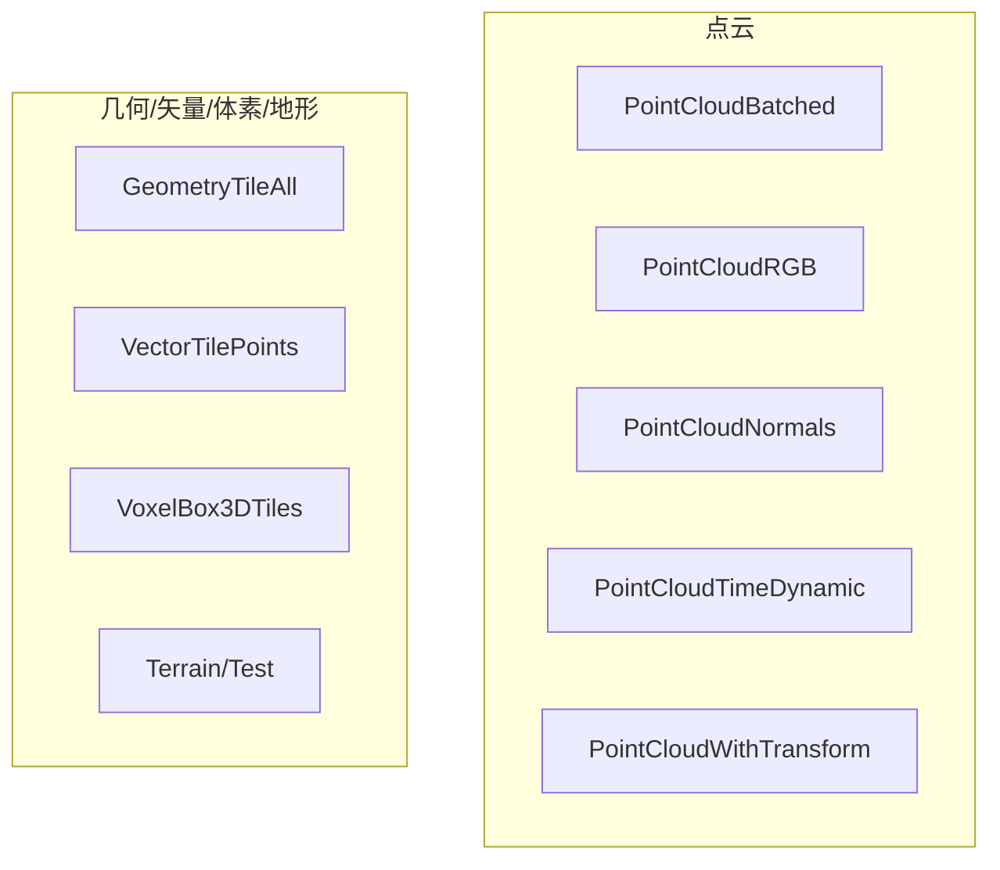
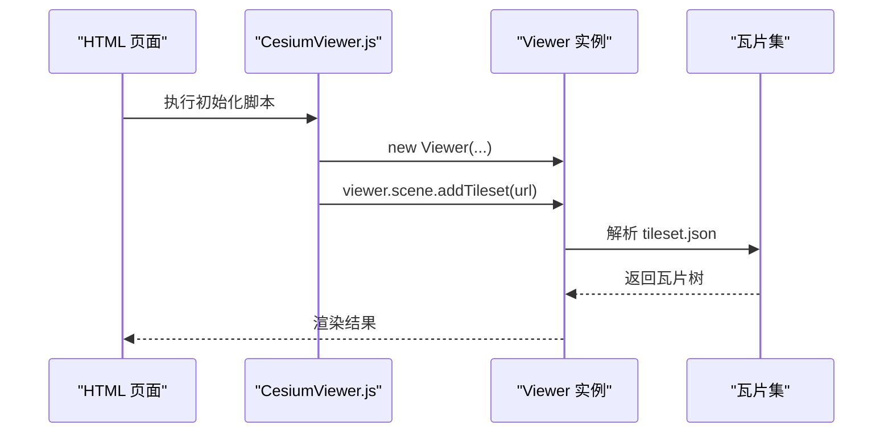
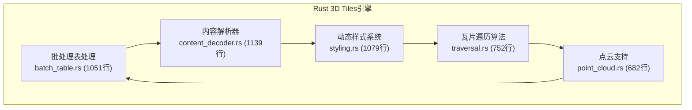
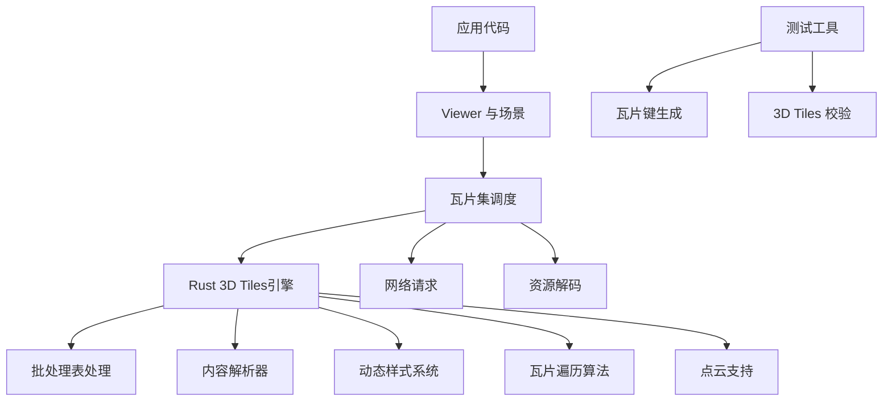

# 瓦片集管理

<cite>
**本文引用的文件**   
- [README.md](file://README.md)
- [CesiumViewer.js](file://Apps/CesiumViewer/CesiumViewer.js)
- [index.html](file://Apps/CesiumViewer/index.html)
- [tileset.json](file://Apps/SampleData/Cesium3DTiles/Tilesets/Tileset/tileset.json)
- [tileset.json](file://Apps/SampleData/Cesium3DTiles/Tilesets/TilesetWithViewerRequestVolume/tileset.json)
- [tileset.json](file://Apps/SampleData/Cesium3DTiles/Composite/Composite/tileset.json)
- [tileset.json](file://Apps/SampleData/Cesium3DTiles/Hierarchy/BatchTableHierarchy/tileset.json)
- [tileset.json](file://Apps/SampleData/Cesium3DTiles/Implicit/ImplicitRoot/tileset.json)
- [tileset.json](file://Apps/SampleData/Cesium3DTiles/Implicit/ImplicitMultipleContents/tileset.json)
- [tileset.json](file://Apps/SampleData/Cesium3DTiles/Implicit/ImplicitSubtreeMetadata/tileset.json)
- [tileset.json](file://Apps/SampleData/Cesium3DTiles/Implicit/ImplicitTileset/tileset.json)
- [tileset.json](file://Apps/SampleData/Cesium3DTiles/Implicit/ImplicitTilesetWithJsonSubtree/tileset.json)
- [tileset.json](file://Apps/SampleData/Cesium3DTiles/MultipleContents/MultipleContents/tileset.json)
- [tileset.json](file://Apps/SampleData/Cesium3DTiles/MultipleContents/GroupMetadata/tileset.json)
- [tileset.json](file://Apps/SampleData/Cesium3DTiles/MultipleContents/ExternalInMultipleContents/tileset.json)
- [tileset.json](file://Apps/SampleData/Cesium3DTiles/MultipleContents/OnlyExternalInMultipleContents/tileset.json)
- [tileset.json](file://Apps/SampleData/Cesium3DTiles/Point/PointCloudBatched/tileset.json)
- [tileset.json](file://Apps/SampleData/Cesium3DTiles/Point/PointCloudRGB/tileset.json)
- [tileset.json](file://Apps/SampleData/Cesium3DTiles/Point/PointCloudNormals/tileset.json)
- [tileset.json](file://Apps/SampleData/Cesium3DTiles/Point/PointCloudTimeDynamic/tileset.json)
- [tileset.json](file://Apps/SampleData/Cesium3DTiles/Point/PointCloudWithTransform/tileset.json)
- [tileset.json](file://Apps/SampleData/Cesium3DTiles/Geometry/GeometryTileAll/tileset.json)
- [tileset.json](file://Apps/SampleData/Cesium3DTiles/Vector/VectorTilePoints/tileset.json)
- [tileset.json](file://Apps/SampleData/Cesium3DTiles/Voxel/VoxelBox3DTiles/tileset.json)
- [tileset.json](file://Apps/SampleData/Cesium3DTiles/Terrain/Test/tileset.json)
- [Cesium3DTilesTester.js](file://Specs/Cesium3DTilesTester.js)
- [createTileKey.js](file://Specs/createTileKey.js)
</cite>

## 更新摘要
**所做更改**   
- 新增完整的3D Tiles Rust实现支持章节，涵盖批处理表、内容解析、动态样式、高效遍历和点云处理
- 更新核心组件部分以反映Rust后端架构
- 新增Rust模块架构图和数据流说明
- 增强性能考量部分，包含Rust实现的优化特性

## 目录
1. [简介](#简介)
2. [项目结构](#项目结构)
3. [核心组件](#核心组件)
4. [架构总览](#架构总览)
5. [详细组件分析](#详细组件分析)
6. [Rust 3D Tiles实现](#rust-3d-tiles实现)
7. [依赖关系分析](#依赖关系分析)
8. [性能考量](#性能考量)
9. [故障排查指南](#故障排查指南)
10. [结论](#结论)
11. [附录](#附录)

## 简介
本文件围绕"瓦片集管理"主题，结合仓库中的示例与测试数据，梳理 CesiumJS 中 3D Tiles 瓦片集（Tileset）的加载、组织与渲染流程。内容涵盖：
- 瓦片集定义与层级结构
- 显式与隐式瓦片集的差异
- 多内容与外部资源组合
- 点云、几何、矢量、体素等典型瓦片集类型
- 在应用层如何加载与配置瓦片集
- Rust后端实现的完整3D Tiles支持
- 常见性能优化策略与问题定位方法

**更新** 新增了基于Rust的完整3D Tiles实现支持，包括批处理表属性处理、内容解析、动态样式系统、高效瓦片遍历算法和点云支持。

## 项目结构
仓库包含大量 3D Tiles 示例数据与应用入口，便于理解不同瓦片集形态与使用方式。关键位置如下：
- 应用入口与演示页面：用于加载并展示瓦片集
- 示例瓦片集：覆盖多种 3D Tiles 场景与特性
- 测试工具与辅助脚本：提供瓦片键生成与 3D Tiles 测试能力
- Rust后端实现：完整的3D Tiles处理引擎

图表来源
- [CesiumViewer.js](file://Apps/CesiumViewer/CesiumViewer.js)
- [index.html](file://Apps/CesiumViewer/index.html)
- [tileset.json](file://Apps/SampleData/Cesium3DTiles/Tilesets/Tileset/tileset.json)

章节来源
- [README.md](file://README.md)
- [CesiumViewer.js](file://Apps/CesiumViewer/CesiumViewer.js)
- [index.html](file://Apps/CesiumViewer/index.html)

## 核心组件
本节聚焦于"瓦片集管理"的关键概念与实现要点：
- 瓦片集描述文件（tileset.json）：定义根瓦片、子瓦片、内容引用、边界体积、几何误差、元数据等
- 瓦片树与层级：父子关系、替换/累积细化策略
- 显式 vs 隐式瓦片集：显式列举所有瓦片；隐式通过规则推导子瓦片
- 多内容与外部资源：同一瓦片可包含多个内容或引用外部资源
- 典型数据类型：点云、几何、矢量、体素、地形等
- Rust后端引擎：高性能的3D Tiles处理核心

**更新** 新增Rust后端引擎作为核心组件，提供完整的3D Tiles处理能力。

章节来源
- [tileset.json](file://Apps/SampleData/Cesium3DTiles/Tilesets/Tileset/tileset.json)
- [tileset.json](file://Apps/SampleData/Cesium3DTiles/Implicit/ImplicitRoot/tileset.json)
- [tileset.json](file://Apps/SampleData/Cesium3DTiles/Implicit/ImplicitMultipleContents/tileset.json)
- [tileset.json](file://Apps/SampleData/Cesium3DTiles/Implicit/ImplicitSubtreeMetadata/tileset.json)
- [tileset.json](file://Apps/SampleData/Cesium3DTiles/Implicit/ImplicitTileset/tileset.json)
- [tileset.json](file://Apps/SampleData/Cesium3DTiles/Implicit/ImplicitTilesetWithJsonSubtree/tileset.json)
- [tileset.json](file://Apps/SampleData/Cesium3DTiles/MultipleContents/MultipleContents/tileset.json)
- [tileset.json](file://Apps/SampleData/Cesium3DTiles/MultipleContents/GroupMetadata/tileset.json)
- [tileset.json](file://Apps/SampleData/Cesium3DTiles/MultipleContents/ExternalInMultipleContents/tileset.json)
- [tileset.json](file://Apps/SampleData/Cesium3DTiles/MultipleContents/OnlyExternalInMultipleContents/tileset.json)
- [tileset.json](file://Apps/SampleData/Cesium3DTiles/Point/PointCloudBatched/tileset.json)
- [tileset.json](file://Apps/SampleData/Cesium3DTiles/Point/PointCloudRGB/tileset.json)
- [tileset.json](file://Apps/SampleData/Cesium3DTiles/Point/PointCloudNormals/tileset.json)
- [tileset.json](file://Apps/SampleData/Cesium3DTiles/Point/PointCloudTimeDynamic/tileset.json)
- [tileset.json](file://Apps/SampleData/Cesium3DTiles/Point/PointCloudWithTransform/tileset.json)
- [tileset.json](file://Apps/SampleData/Cesium3DTiles/Geometry/GeometryTileAll/tileset.json)
- [tileset.json](file://Apps/SampleData/Cesium3DTiles/Vector/VectorTilePoints/tileset.json)
- [tileset.json](file://Apps/SampleData/Cesium3DTiles/Voxel/VoxelBox3DTiles/tileset.json)
- [tileset.json](file://Apps/SampleData/Cesium3DTiles/Terrain/Test/tileset.json)

## 架构总览
从应用视角看，瓦片集管理的整体流程包括：
- 应用初始化并创建场景
- 加载瓦片集描述文件（tileset.json）
- 根据视锥裁剪与几何误差进行瓦片调度
- 按需请求子瓦片与内容资源
- 将内容实例化到场景中并进行渲染
- Rust后端提供高性能的3D Tiles处理能力

图表来源
- [CesiumViewer.js](file://Apps/CesiumViewer/CesiumViewer.js)
- [index.html](file://Apps/CesiumViewer/index.html)
- [tileset.json](file://Apps/SampleData/Cesium3DTiles/Tilesets/Tileset/tileset.json)

## 详细组件分析

### 瓦片集描述与层级结构
- 根瓦片：定义全局边界体积、几何误差、子瓦片列表或隐式规则
- 子瓦片：继承父级属性并可覆盖，包含内容引用与自身边界体积
- 细化策略：替换（子替代父）或累积（父子叠加）
- 元数据：支持瓦片级与子树级元数据，便于查询与样式控制

图表来源
- [tileset.json](file://Apps/SampleData/Cesium3DTiles/Tilesets/Tileset/tileset.json)

章节来源
- [tileset.json](file://Apps/SampleData/Cesium3DTiles/Tilesets/Tileset/tileset.json)
- [tileset.json](file://Apps/SampleData/Cesium3DTiles/Implicit/ImplicitRoot/tileset.json)
- [tileset.json](file://Apps/SampleData/Cesium3DTiles/Implicit/ImplicitSubtreeMetadata/tileset.json)

### 显式与隐式瓦片集
- 显式瓦片集：在描述文件中明确列出所有瓦片及其子瓦片
- 隐式瓦片集：通过规则（如四叉树/八叉树）动态推导子瓦片，减少描述文件大小
- 混合场景：可在同一瓦片集中同时存在显式与隐式瓦片

图表来源
- [tileset.json](file://Apps/SampleData/Cesium3DTiles/Implicit/ImplicitRoot/tileset.json)
- [tileset.json](file://Apps/SampleData/Cesium3DTiles/Implicit/ImplicitMultipleContents/tileset.json)
- [tileset.json](file://Apps/SampleData/Cesium3DTiles/Implicit/ImplicitTileset/tileset.json)
- [tileset.json](file://Apps/SampleData/Cesium3DTiles/Implicit/ImplicitTilesetWithJsonSubtree/tileset.json)

章节来源
- [tileset.json](file://Apps/SampleData/Cesium3DTiles/Implicit/ImplicitRoot/tileset.json)
- [tileset.json](file://Apps/SampleData/Cesium3DTiles/Implicit/ImplicitMultipleContents/tileset.json)
- [tileset.json](file://Apps/SampleData/Cesium3DTiles/Implicit/ImplicitSubtreeMetadata/tileset.json)
- [tileset.json](file://Apps/SampleData/Cesium3DTiles/Implicit/ImplicitTileset/tileset.json)
- [tileset.json](file://Apps/SampleData/Cesium3DTiles/Implicit/ImplicitTilesetWithJsonSubtree/tileset.json)

### 多内容与外部资源
- 多内容：单个瓦片可包含多个内容项（例如 glTF 与点云并存）
- 外部资源：瓦片内容可引用外部文件，降低描述文件复杂度
- 分组元数据：对多内容进行分组与标注，便于管理与样式

图表来源
- [tileset.json](file://Apps/SampleData/Cesium3DTiles/MultipleContents/MultipleContents/tileset.json)
- [tileset.json](file://Apps/SampleData/Cesium3DTiles/MultipleContents/GroupMetadata/tileset.json)
- [tileset.json](file://Apps/SampleData/Cesium3DTiles/MultipleContents/ExternalInMultipleContents/tileset.json)
- [tileset.json](file://Apps/SampleData/Cesium3DTiles/MultipleContents/OnlyExternalInMultipleContents/tileset.json)

章节来源
- [tileset.json](file://Apps/SampleData/Cesium3DTiles/MultipleContents/MultipleContents/tileset.json)
- [tileset.json](file://Apps/SampleData/Cesium3DTiles/MultipleContents/GroupMetadata/tileset.json)
- [tileset.json](file://Apps/SampleData/Cesium3DTiles/MultipleContents/ExternalInMultipleContents/tileset.json)
- [tileset.json](file://Apps/SampleData/Cesium3DTiles/MultipleContents/OnlyExternalInMultipleContents/tileset.json)

### 典型瓦片集类型
- 点云瓦片集：支持批量点云、颜色、法线、时间动态、变换等
- 几何瓦片集：以几何图元为内容的瓦片
- 矢量瓦片集：矢量要素（点、线、面）的瓦片化表达
- 体素瓦片集：三维栅格数据的瓦片化组织
- 地形瓦片集：高程数据的瓦片化服务

图表来源
- [tileset.json](file://Apps/SampleData/Cesium3DTiles/Point/PointCloudBatched/tileset.json)
- [tileset.json](file://Apps/SampleData/Cesium3DTiles/Point/PointCloudRGB/tileset.json)
- [tileset.json](file://Apps/SampleData/Cesium3DTiles/Point/PointCloudNormals/tileset.json)
- [tileset.json](file://Apps/SampleData/Cesium3DTiles/Point/PointCloudTimeDynamic/tileset.json)
- [tileset.json](file://Apps/SampleData/Cesium3DTiles/Point/PointCloudWithTransform/tileset.json)
- [tileset.json](file://Apps/SampleData/Cesium3DTiles/Geometry/GeometryTileAll/tileset.json)
- [tileset.json](file://Apps/SampleData/Cesium3DTiles/Vector/VectorTilePoints/tileset.json)
- [tileset.json](file://Apps/SampleData/Cesium3DTiles/Voxel/VoxelBox3DTiles/tileset.json)
- [tileset.json](file://Apps/SampleData/Cesium3DTiles/Terrain/Test/tileset.json)

章节来源
- [tileset.json](file://Apps/SampleData/Cesium3DTiles/Point/PointCloudBatched/tileset.json)
- [tileset.json](file://Apps/SampleData/Cesium3DTiles/Point/PointCloudRGB/tileset.json)
- [tileset.json](file://Apps/SampleData/Cesium3DTiles/Point/PointCloudNormals/tileset.json)
- [tileset.json](file://Apps/SampleData/Cesium3DTiles/Point/PointCloudTimeDynamic/tileset.json)
- [tileset.json](file://Apps/SampleData/Cesium3DTiles/Point/PointCloudWithTransform/tileset.json)
- [tileset.json](file://Apps/SampleData/Cesium3DTiles/Geometry/GeometryTileAll/tileset.json)
- [tileset.json](file://Apps/SampleData/Cesium3DTiles/Vector/VectorTilePoints/tileset.json)
- [tileset.json](file://Apps/SampleData/Cesium3DTiles/Voxel/VoxelBox3DTiles/tileset.json)
- [tileset.json](file://Apps/SampleData/Cesium3DTiles/Terrain/Test/tileset.json)

### 应用层加载与配置
- 在页面中引入 Cesium 库并创建 Viewer
- 通过 Viewer 提供的 API 加载瓦片集（传入 tileset.json 地址）
- 可选：设置相机初始位置、启用请求体积优化、调整细节层次参数

图表来源
- [index.html](file://Apps/CesiumViewer/index.html)
- [CesiumViewer.js](file://Apps/CesiumViewer/CesiumViewer.js)
- [tileset.json](file://Apps/SampleData/Cesium3DTiles/Tilesets/Tileset/tileset.json)

章节来源
- [index.html](file://Apps/CesiumViewer/index.html)
- [CesiumViewer.js](file://Apps/CesiumViewer/CesiumViewer.js)

## Rust 3D Tiles实现

### 批处理表属性处理
Rust实现提供了完整的批处理表属性处理功能，支持：
- 批ID映射与属性关联
- 批量几何体的属性管理
- 高效的内存布局优化
- 跨语言数据序列化

**更新** 新增batch_table.rs模块，提供1051行完整的批处理表处理逻辑。

### 3D Tiles内容解析
content_decoder.rs模块实现了全面的3D Tiles内容解析能力：
- glTF/GLB格式支持
- 点云数据解码
- 压缩格式处理
- 错误恢复机制

**更新** 新增content_decoder.rs模块，包含1139行内容解析代码。

### 动态样式系统
styling.rs模块提供了强大的动态样式功能：
- 运行时样式表达式
- 条件渲染逻辑
- 动画样式支持
- 性能优化的样式缓存

**更新** 新增styling.rs模块，实现1079行动态样式系统。

### 高效瓦片遍历算法
traversal.rs模块实现了优化的瓦片遍历算法：
- 视锥裁剪优化
- 几何误差评估
- 并行遍历支持
- 内存友好的数据结构

**更新** 新增traversal.rs模块，包含752行高效遍历算法。

### 点云支持
point_cloud.rs模块提供了完整的点云处理能力：
- 批量点云渲染
- 点云属性支持
- 压缩点云解码
- 实时点云更新

**更新** 新增point_cloud.rs模块，实现682行点云支持功能。

图表来源
- [batch_table.rs](file://crates/domain/tileset/src/batch_table.rs)
- [content_decoder.rs](file://crates/domain/tileset/src/content_decoder.rs)
- [styling.rs](file://crates/domain/tileset/src/styling.rs)
- [traversal.rs](file://crates/domain/tileset/src/traversal.rs)
- [point_cloud.rs](file://crates/domain/tileset/src/point_cloud.rs)

**章节来源**
- [batch_table.rs](file://crates/domain/tileset/src/batch_table.rs)
- [content_decoder.rs](file://crates/domain/tileset/src/content_decoder.rs)
- [styling.rs](file://crates/domain/tileset/src/styling.rs)
- [traversal.rs](file://crates/domain/tileset/src/traversal.rs)
- [point_cloud.rs](file://crates/domain/tileset/src/point_cloud.rs)

## 依赖关系分析
- 应用层依赖 Viewer 与瓦片集模块
- 瓦片集模块依赖网络请求与资源解码器
- Rust后端提供高性能的3D Tiles处理能力
- 测试工具依赖瓦片键生成与 3D Tiles 校验逻辑

图表来源
- [CesiumViewer.js](file://Apps/CesiumViewer/CesiumViewer.js)
- [Cesium3DTilesTester.js](file://Specs/Cesium3DTilesTester.js)
- [createTileKey.js](file://Specs/createTileKey.js)

章节来源
- [Cesium3DTilesTester.js](file://Specs/Cesium3DTilesTester.js)
- [createTileKey.js](file://Specs/createTileKey.js)

## 性能考量
- 合理设置几何误差与最大屏幕空间误差，平衡质量与性能
- 使用请求体积（viewer request volume）限制远端请求范围
- 优先采用隐式瓦片集以减少描述文件体积与解析开销
- 对点云与体素数据进行压缩与分块，提升传输效率
- 避免在同一帧内触发过多瓦片加载，必要时进行节流与批处理
- **新增** Rust后端提供零拷贝内存访问和并行处理能力
- **新增** 批处理表优化减少GPU状态切换开销
- **新增** 动态样式系统支持运行时样式缓存
- **新增** 高效遍历算法减少不必要的瓦片计算

**更新** 新增Rust后端特有的性能优化特性，包括内存管理、并行处理和零拷贝操作。

## 故障排查指南
- 瓦片集无法加载：检查 tileset.json 路径与跨域配置，确认网络可达
- 瓦片显示异常：核对边界体积与变换矩阵，验证内容格式与编码
- 性能抖动：观察瓦片请求频率与大小，调整细节层次与缓存策略
- 测试失败：使用 3D Tiles 测试工具与瓦片键生成脚本定位问题
- **新增** Rust后端错误：检查编译错误和运行时panic日志
- **新增** 批处理表问题：验证批ID映射和属性数据完整性
- **新增** 样式渲染异常：检查样式表达式语法和变量定义

**更新** 新增Rust后端相关的故障排查指导。

章节来源
- [Cesium3DTilesTester.js](file://Specs/Cesium3DTilesTester.js)
- [createTileKey.js](file://Specs/createTileKey.js)

## 结论
通过对仓库中示例瓦片集与应用入口的分析，可以清晰理解 CesiumJS 中瓦片集的管理机制与最佳实践。显式与隐式瓦片集各有适用场景，多内容与外部资源组合提升了灵活性，而合理的调度与优化策略是保障大规模三维数据流畅渲染的关键。

**更新** 新增的Rust后端3D Tiles实现为整个系统提供了高性能的处理能力，包括批处理表处理、内容解析、动态样式、高效遍历和点云支持，显著提升了系统的性能和可扩展性。

## 附录
- 相关示例瓦片集清单（按类型分组）
  - 基础瓦片集：[tileset.json](file://Apps/SampleData/Cesium3DTiles/Tilesets/Tileset/tileset.json)
  - 带请求体积的瓦片集：[tileset.json](file://Apps/SampleData/Cesium3DTiles/Tilesets/TilesetWithViewerRequestVolume/tileset.json)
  - 复合瓦片集：[tileset.json](file://Apps/SampleData/Cesium3DTiles/Composite/Composite/tileset.json)
  - 层级与批表：[tileset.json](file://Apps/SampleData/Cesium3DTiles/Hierarchy/BatchTableHierarchy/tileset.json)
  - 隐式瓦片集：见"显式与隐式瓦片集"小节所列文件
  - 多内容与外部资源：见"多内容与外部资源"小节所列文件
  - 点云瓦片集：见"典型瓦片集类型"小节所列文件
  - 几何/矢量/体素/地形：见"典型瓦片集类型"小节所列文件
- **新增** Rust 3D Tiles实现模块清单
  - 批处理表处理：[batch_table.rs](file://crates/domain/tileset/src/batch_table.rs)
  - 内容解析器：[content_decoder.rs](file://crates/domain/tileset/src/content_decoder.rs)
  - 动态样式系统：[styling.rs](file://crates/domain/tileset/src/styling.rs)
  - 瓦片遍历算法：[traversal.rs](file://crates/domain/tileset/src/traversal.rs)
  - 点云支持：[point_cloud.rs](file://crates/domain/tileset/src/point_cloud.rs)

**更新** 新增Rust实现模块清单供参考。