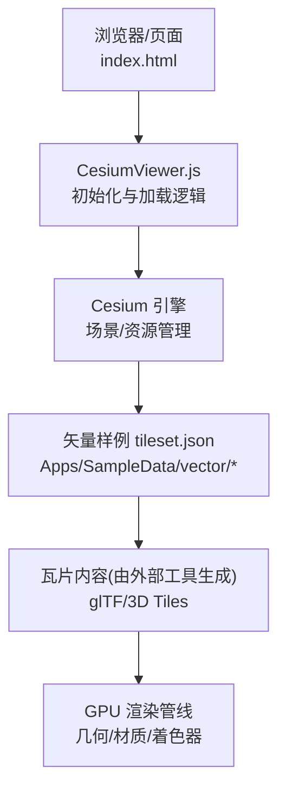
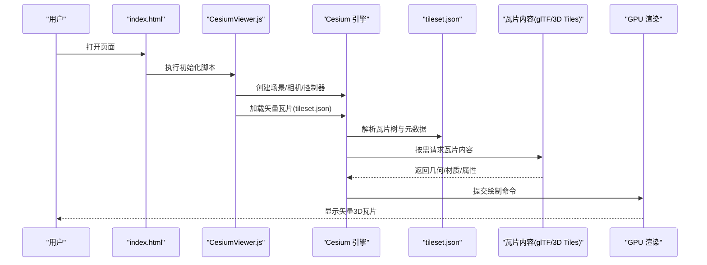
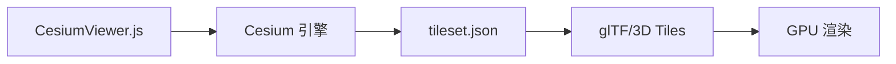

# 矢量3D瓦片支持

<cite>
**本文引用的文件**   
- [README.md](file://README.md)
- [package.json](file://package.json)
- [CesiumViewer.js](file://Apps/CesiumViewer/CesiumViewer.js)
- [index.html](file://Apps/CesiumViewer/index.html)
- [sample-cities-spain-v02.tileset.json](file://Apps/SampleData/vector/sample-cities-spain-v02.tileset.json)
- [sample-us-states-v02.tileset.json](file://Apps/SampleData/vector/sample-us-states-v02.tileset.json)
- [sample-us-outline-v02.tileset.json](file://Apps/SampleData/vector/sample-us-outline-v02.tileset.json)
- [vector目录说明](file://Apps/SampleData/vector)
</cite>

## 目录
1. [简介](#简介)
2. [项目结构](#项目结构)
3. [核心组件](#核心组件)
4. [架构总览](#架构总览)
5. [详细组件分析](#详细组件分析)
6. [依赖关系分析](#依赖关系分析)
7. [性能考量](#性能考量)
8. [故障排查指南](#故障排查指南)
9. [结论](#结论)
10. [附录](#附录)

## 简介
本文件聚焦于 CesiumJS 仓库中的“矢量3D瓦片”（Vector Tiles）支持，围绕以下目标展开：
- 解释矢量3D瓦片在 Cesium 中的定位与能力边界
- 梳理示例数据与加载入口，帮助快速验证功能
- 给出架构视角下的数据流、渲染路径与扩展点
- 提供性能优化建议与常见问题排查方法

说明：
- 当前仓库包含大量 3D Tiles 相关样例与测试数据，但“矢量3D瓦片”并非 Cesium 的核心内置能力。实践中通常通过外部工具将矢量数据转换为 glTF/3D Tiles，再由 Cesium 进行渲染。
- 本文基于仓库中提供的矢量样例 tileset.json 与 Viewer 集成方式，总结可落地的使用模式与注意事项。

## 项目结构
与“矢量3D瓦片”直接相关的工程位置与角色如下：
- Apps/CesiumViewer：演示应用，负责初始化场景、加载图层与交互
- Apps/SampleData/vector：矢量瓦片样例的 tileset.json 清单，用于描述瓦片结构与内容
- package.json：构建与运行脚本入口，便于本地启动示例服务
- README.md：项目概览与使用说明

图表来源
- [index.html](file://Apps/CesiumViewer/index.html)
- [CesiumViewer.js](file://Apps/CesiumViewer/CesiumViewer.js)
- [sample-cities-spain-v02.tileset.json](file://Apps/SampleData/vector/sample-cities-spain-v02.tileset.json)
- [sample-us-states-v02.tileset.json](file://Apps/SampleData/vector/sample-us-states-v02.tileset.json)
- [sample-us-outline-v02.tileset.json](file://Apps/SampleData/vector/sample-us-outline-v02.tileset.json)

章节来源
- [README.md](file://README.md)
- [package.json](file://package.json)
- [CesiumViewer.js](file://Apps/CesiumViewer/CesiumViewer.js)
- [index.html](file://Apps/CesiumViewer/index.html)
- [vector目录说明](file://Apps/SampleData/vector)

## 核心组件
- 演示应用（CesiumViewer）：负责创建 Viewer、配置相机、添加数据源与事件处理
- 矢量样例 tileset.json：定义瓦片树、几何体类型、LOD、变换等元信息
- Cesium 引擎：提供场景图、资源加载、瓦片调度与渲染管线
- 外部转换工具链（不在仓库内）：将矢量数据（如 GeoJSON/MVT）转换为 glTF/3D Tiles，并输出 tileset.json

要点：
- 矢量3D瓦片在 Cesium 中以“3D Tiles”形式呈现，其几何与样式由生成的 glTF/3D Tiles 决定
- 若需动态样式或属性查询，建议在生成阶段将样式与属性编码进几何或批表中

章节来源
- [CesiumViewer.js](file://Apps/CesiumViewer/CesiumViewer.js)
- [sample-cities-spain-v02.tileset.json](file://Apps/SampleData/vector/sample-cities-spain-v02.tileset.json)
- [sample-us-states-v02.tileset.json](file://Apps/SampleData/vector/sample-us-states-v02.tileset.json)
- [sample-us-outline-v02.tileset.json](file://Apps/SampleData/vector/sample-us-outline-v02.tileset.json)

## 架构总览
下图展示从页面到渲染的关键调用链与数据流向：

图表来源
- [index.html](file://Apps/CesiumViewer/index.html)
- [CesiumViewer.js](file://Apps/CesiumViewer/CesiumViewer.js)
- [sample-cities-spain-v02.tileset.json](file://Apps/SampleData/vector/sample-cities-spain-v02.tileset.json)

## 详细组件分析

### 演示应用（CesiumViewer）
职责：
- 初始化 Viewer、设置基础场景参数
- 加载矢量瓦片 tileset.json，并绑定必要的交互（缩放、旋转、点击等）
- 可选：叠加影像底图、地形、标注等

关键流程：
- 页面加载后执行初始化脚本
- 创建 Viewer 实例并配置投影、时间、控件等
- 通过 API 加载 tileset.json 指向的矢量瓦片集合
- 监听事件以响应交互（如选择要素、高亮、弹出信息等）

章节来源
- [CesiumViewer.js](file://Apps/CesiumViewer/CesiumViewer.js)
- [index.html](file://Apps/CesiumViewer/index.html)

### 矢量样例 tileset.json
作用：
- 描述瓦片树的层级结构、几何类型、LOD、变换矩阵、版权信息等
- 为 Cesium 引擎提供瓦片调度与渲染所需的元数据

常见字段（概念性说明）：
- 根节点与子节点引用
- 几何体类型（点、线、面等）
- 几何误差与可见性阈值
- 变换与坐标系信息
- 内容路径（指向 glTF/3D Tiles）

章节来源
- [sample-cities-spain-v02.tileset.json](file://Apps/SampleData/vector/sample-cities-spain-v02.tileset.json)
- [sample-us-states-v02.tileset.json](file://Apps/SampleData/vector/sample-us-states-v02.tileset.json)
- [sample-us-outline-v02.tileset.json](file://Apps/SampleData/vector/sample-us-outline-v02.tileset.json)

### 数据生成与转换（外部工具链）
说明：
- 矢量3D瓦片通常由外部工具将 MVT/GeoJSON 等格式转换为 glTF/3D Tiles，并生成 tileset.json
- 转换过程涉及：坐标系统一、几何简化、批表/属性编码、纹理压缩、LOD 策略等

建议：
- 在转换阶段完成样式与属性的固化，减少运行时开销
- 合理设置几何误差与 LOD，平衡精度与性能

章节来源
- [vector目录说明](file://Apps/SampleData/vector)

## 依赖关系分析
- 应用层依赖 Cesium 引擎提供的场景与资源管理能力
- 瓦片调度依赖 tileset.json 的结构与语义
- 渲染依赖生成的 glTF/3D Tiles 内容与材质/着色器

图表来源
- [CesiumViewer.js](file://Apps/CesiumViewer/CesiumViewer.js)
- [sample-cities-spain-v02.tileset.json](file://Apps/SampleData/vector/sample-cities-spain-v02.tileset.json)

章节来源
- [package.json](file://package.json)
- [CesiumViewer.js](file://Apps/CesiumViewer/CesiumViewer.js)

## 性能考量
- 瓦片粒度与数量：控制每级瓦片的几何复杂度与数量，避免过多细粒度瓦片导致频繁请求与绘制
- 几何误差与LOD：根据观测距离调整几何误差，确保近景精细、远景简化
- 批处理与合并：尽量合并同类几何，减少 draw call
- 纹理与材质：使用合适的纹理压缩与材质模型，降低内存与带宽占用
- 网络与缓存：启用 HTTP 缓存与并行下载，提升瓦片加载速度
- 选择性加载：结合视锥剔除与兴趣区域，仅加载可见范围内的瓦片

[本节为通用指导，不直接分析具体文件]

## 故障排查指南
常见问题与定位思路：
- 瓦片无法加载
  - 检查 tileset.json 路径与跨域配置
  - 确认瓦片内容可达且格式正确
- 渲染异常或闪烁
  - 检查几何法线与材质设置
  - 确认坐标系与变换矩阵正确
- 性能瓶颈
  - 统计瓦片数量与大小，评估是否过细或过大
  - 观察网络请求频率与并发，优化缓存策略
- 交互无响应
  - 检查事件绑定与拾取范围
  - 确认要素属性与批表是否正确编码

章节来源
- [CesiumViewer.js](file://Apps/CesiumViewer/CesiumViewer.js)
- [sample-cities-spain-v02.tileset.json](file://Apps/SampleData/vector/sample-cities-spain-v02.tileset.json)

## 结论
- 矢量3D瓦片在 Cesium 中以 3D Tiles 的形式呈现，核心在于“生成正确的瓦片与 tileset.json”，再由 Cesium 进行调度与渲染
- 演示应用提供了清晰的加载与交互入口，便于快速验证与调试
- 性能与体验的关键在于合理的转换策略、瓦片粒度与材质/纹理设计

[本节为总结性内容，不直接分析具体文件]

## 附录
- 快速开始
  - 使用本地服务器运行 Apps/CesiumViewer/index.html
  - 在 CesiumViewer.js 中加载 vector 目录下的 tileset.json
- 参考样例
  - sample-cities-spain-v02.tileset.json：城市建筑矢量瓦片
  - sample-us-states-v02.tileset.json：美国州界矢量瓦片
  - sample-us-outline-v02.tileset.json：美国轮廓矢量瓦片

章节来源
- [index.html](file://Apps/CesiumViewer/index.html)
- [CesiumViewer.js](file://Apps/CesiumViewer/CesiumViewer.js)
- [sample-cities-spain-v02.tileset.json](file://Apps/SampleData/vector/sample-cities-spain-v02.tileset.json)
- [sample-us-states-v02.tileset.json](file://Apps/SampleData/vector/sample-us-states-v02.tileset.json)
- [sample-us-outline-v02.tileset.json](file://Apps/SampleData/vector/sample-us-outline-v02.tileset.json)