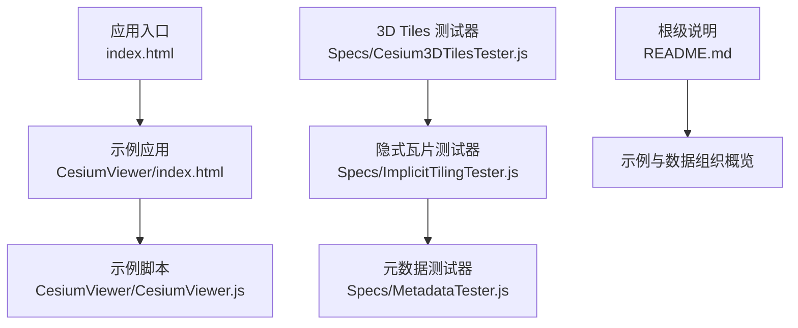
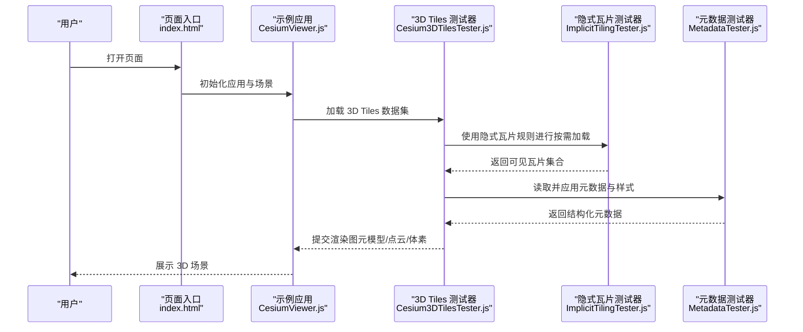
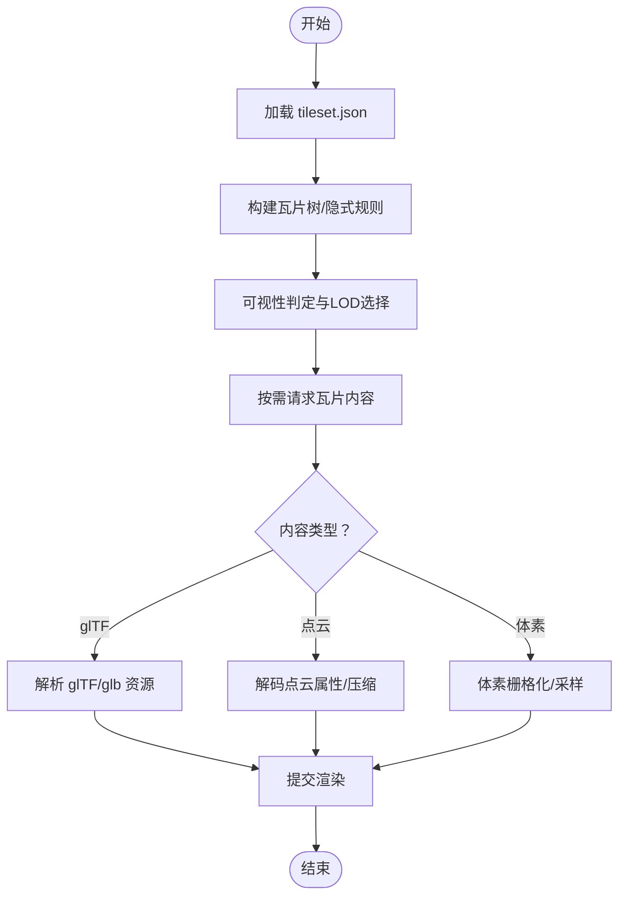
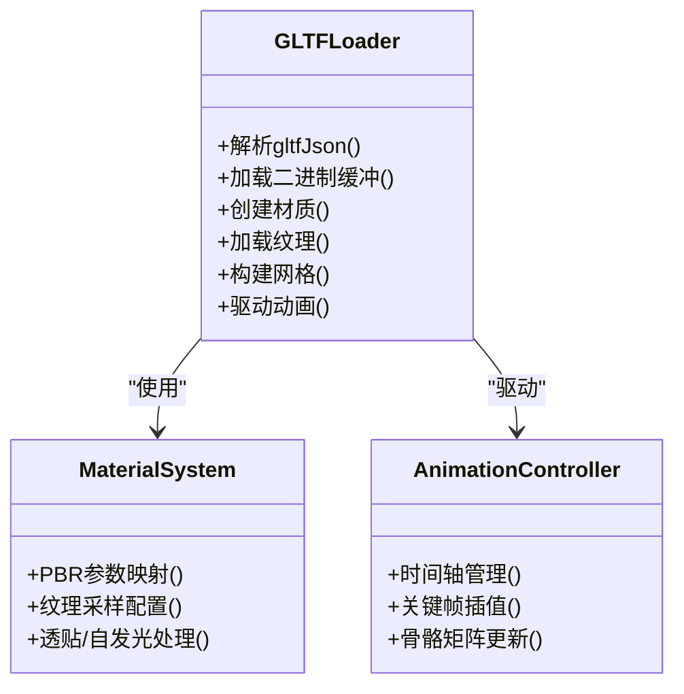
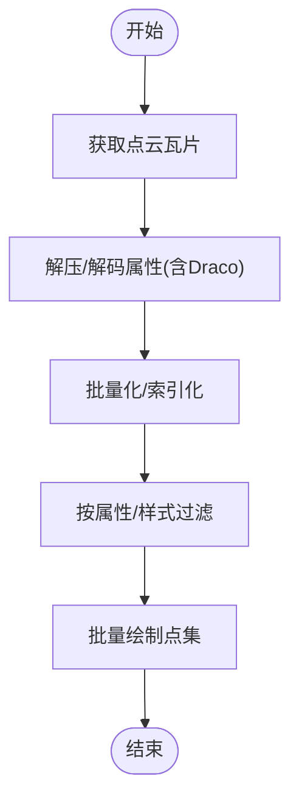
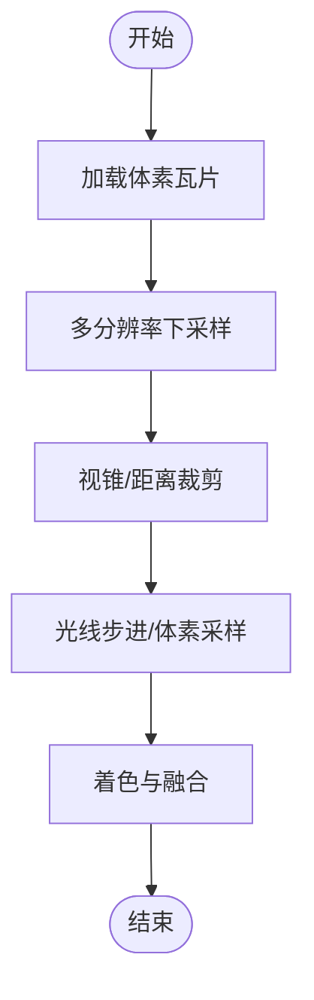
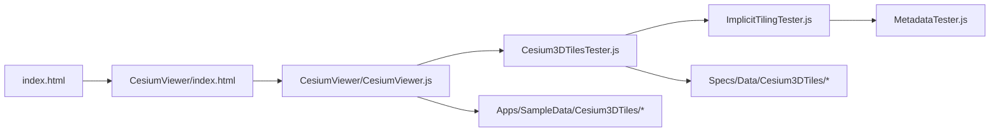

# 3D数据格式支持

<cite>
**本文引用的文件**   
- [README.md](file://README.md)
- [Cesium3DTilesTester.js](file://Specs/Cesium3DTilesTester.js)
- [ImplicitTilingTester.js](file://Specs/ImplicitTilingTester.js)
- [MetadataTester.js](file://Specs/MetadataTester.js)
- [index.html](file://index.html)
- [Apps/CesiumViewer/index.html](file://Apps/CesiumViewer/index.html)
- [Apps/CesiumViewer/CesiumViewer.js](file://Apps/CesiumViewer/CesiumViewer.js)
</cite>

## 目录
1. [简介](#简介)
2. [项目结构](#项目结构)
3. [核心组件](#核心组件)
4. [架构总览](#架构总览)
5. [详细组件分析](#详细组件分析)
6. [依赖关系分析](#依赖关系分析)
7. [性能考量](#性能考量)
8. [故障排查指南](#故障排查指南)
9. [结论](#结论)
10. [附录](#附录)

## 简介
本技术文档聚焦于 Cesium 对 3D 数据格式的完整支持，重点覆盖以下方面：
- 3D Tiles 标准规范与大规模 3D 数据的流式加载机制（层级结构、元数据定义、内容引用）
- glTF 2.0 的完整特性支持（模型、材质、纹理、动画、骨骼等）
- 点云数据处理与优化策略（压缩编码、批量渲染、属性访问）
- 体素数据的渲染技术与应用场景
- 每种数据格式的加载示例与最佳实践

本仓库提供了丰富的测试样例与应用入口，便于理解与验证上述能力。

## 项目结构
仓库采用“源码 + 应用 + 规格样例 + 工具链”的组织方式：
- Source：核心引擎源码（未在本节直接分析具体实现文件）
- Apps：示例应用与演示入口（如 CesiumViewer）
- Specs：大量 3D 数据格式相关的测试用例与样例数据（包含 3D Tiles、glTF、点云、体素等）
- Documentation：开发者与贡献者文档
- Tools：构建与文档生成工具

图表来源
- [index.html:1-200](file://index.html#L1-L200)
- [Apps/CesiumViewer/index.html:1-200](file://Apps/CesiumViewer/index.html#L1-L200)
- [Apps/CesiumViewer/CesiumViewer.js:1-200](file://Apps/CesiumViewer/CesiumViewer.js#L1-L200)
- [Cesium3DTilesTester.js:1-200](file://Specs/Cesium3DTilesTester.js#L1-L200)
- [ImplicitTilingTester.js:1-200](file://Specs/ImplicitTilingTester.js#L1-L200)
- [MetadataTester.js:1-200](file://Specs/MetadataTester.js#L1-L200)
- [README.md:1-200](file://README.md#L1-L200)

章节来源
- [README.md:1-200](file://README.md#L1-L200)
- [index.html:1-200](file://index.html#L1-L200)
- [Apps/CesiumViewer/index.html:1-200](file://Apps/CesiumViewer/index.html#L1-L200)
- [Apps/CesiumViewer/CesiumViewer.js:1-200](file://Apps/CesiumViewer/CesiumViewer.js#L1-L200)
- [Cesium3DTilesTester.js:1-200](file://Specs/Cesium3DTilesTester.js#L1-L200)
- [ImplicitTilingTester.js:1-200](file://Specs/ImplicitTilingTester.js#L1-L200)
- [MetadataTester.js:1-200](file://Specs/MetadataTester.js#L1-L200)

## 核心组件
本节从“功能视角”梳理与 3D 数据格式相关的关键组件与职责：
- 3D Tiles 加载与调度：负责解析 tileset.json、管理瓦片树、按需请求与卸载、LOD 控制、批处理与实例化渲染
- glTF 2.0 资源管线：负责解析 glTF/glb、材质系统、纹理加载、动画与骨骼驱动
- 点云与体素渲染：负责点云属性解码、压缩格式（如 Draco）、批量着色与体素栅格化/光线步进
- 元数据与样式：负责 3D Tiles 元数据（Structural Metadata、Property Attributes）与样式表达

这些能力在仓库中以“测试器 + 样例数据 + 示例应用”的形式呈现，便于端到端验证。

章节来源
- [Cesium3DTilesTester.js:1-200](file://Specs/Cesium3DTilesTester.js#L1-L200)
- [ImplicitTilingTester.js:1-200](file://Specs/ImplicitTilingTester.js#L1-L200)
- [MetadataTester.js:1-200](file://Specs/MetadataTester.js#L1-L200)
- [Apps/CesiumViewer/CesiumViewer.js:1-200](file://Apps/CesiumViewer/CesiumViewer.js#L1-L200)

## 架构总览
下图展示了从页面到 3D 数据加载渲染的整体流程，涵盖 3D Tiles、glTF、点云与体素的主要路径。

图表来源
- [index.html:1-200](file://index.html#L1-L200)
- [Apps/CesiumViewer/CesiumViewer.js:1-200](file://Apps/CesiumViewer/CesiumViewer.js#L1-L200)
- [Cesium3DTilesTester.js:1-200](file://Specs/Cesium3DTilesTester.js#L1-L200)
- [ImplicitTilingTester.js:1-200](file://Specs/ImplicitTilingTester.js#L1-L200)
- [MetadataTester.js:1-200](file://Specs/MetadataTester.js#L1-L200)

## 详细组件分析

### 3D Tiles 规范与流式加载
- 层级结构与元数据
  - 通过 tileset.json 描述瓦片树、几何误差、包围体、子瓦片引用与可选的元数据（Structural Metadata）。
  - 支持显式瓦片树与隐式瓦片（基于规则计算子瓦片），后者由隐式瓦片测试器驱动。
- 内容引用机制
  - 瓦片内容可指向 glTF/glb、点云或体素等资源；支持外部资源与共享纹理。
- 流式加载与 LOD
  - 根据相机位置与视锥剔除动态请求瓦片，结合几何误差阈值进行细节切换。
- 批处理与实例化
  - Batched/Instanced 模式减少绘制调用，提升吞吐。

图表来源
- [Cesium3DTilesTester.js:1-200](file://Specs/Cesium3DTilesTester.js#L1-L200)
- [ImplicitTilingTester.js:1-200](file://Specs/ImplicitTilingTester.js#L1-L200)

章节来源
- [Cesium3DTilesTester.js:1-200](file://Specs/Cesium3DTilesTester.js#L1-L200)
- [ImplicitTilingTester.js:1-200](file://Specs/ImplicitTilingTester.js#L1-L200)

### glTF 2.0 完整支持
- 模型与材质
  - 支持 PBR 材质、法线贴图、粗糙度/金属度、透贴、自发光等常见材质通道。
- 纹理与压缩
  - 支持 KTX2/Basis 纹理压缩，降低内存占用与带宽。
- 动画与骨骼
  - 支持关键帧动画、混合形状（morph targets）、骨骼绑定与蒙皮。
- 扩展与属性
  - 支持 EXT_feature_metadata、EXT_mesh_gpu_instancing 等扩展，增强属性与实例化能力。

图表来源
- [Cesium3DTilesTester.js:1-200](file://Specs/Cesium3DTilesTester.js#L1-L200)
- [Apps/CesiumViewer/CesiumViewer.js:1-200](file://Apps/CesiumViewer/CesiumViewer.js#L1-L200)

章节来源
- [Cesium3DTilesTester.js:1-200](file://Specs/Cesium3DTilesTester.js#L1-L200)
- [Apps/CesiumViewer/CesiumViewer.js:1-200](file://Apps/CesiumViewer/CesiumViewer.js#L1-L200)

### 点云数据处理与优化
- 压缩编码
  - 支持 Draco 压缩的点云数据，显著减小体积并加速传输。
- 批量渲染
  - 将大量点聚合为批次，减少 draw call，提高吞吐。
- 属性数据访问
  - 支持颜色、法线、自定义属性字段，可通过元数据与样式系统进行过滤与可视化。

图表来源
- [Cesium3DTilesTester.js:1-200](file://Specs/Cesium3DTilesTester.js#L1-L200)
- [ImplicitTilingTester.js:1-200](file://Specs/ImplicitTilingTester.js#L1-L200)

章节来源
- [Cesium3DTilesTester.js:1-200](file://Specs/Cesium3DTilesTester.js#L1-L200)
- [ImplicitTilingTester.js:1-200](file://Specs/ImplicitTilingTester.js#L1-L200)

### 体素数据渲染技术与应用场景
- 渲染技术
  - 体素通常以规则网格存储，渲染可采用光线步进、分块裁剪与多分辨率金字塔等技术。
- 应用场景
  - 地质建模、地下管线、医学影像、建筑内部结构等需要三维密度场表达的场景。

图表来源
- [Cesium3DTilesTester.js:1-200](file://Specs/Cesium3DTilesTester.js#L1-L200)

章节来源
- [Cesium3DTilesTester.js:1-200](file://Specs/Cesium3DTilesTester.js#L1-L200)

### 加载示例与最佳实践
- 3D Tiles
  - 使用 tileset.json 作为入口，合理设置几何误差与最大屏幕空间误差，启用批处理/实例化以提升性能。
  - 对于超大规模数据，优先采用隐式瓦片规则，避免维护庞大显式树。
- glTF 2.0
  - 使用 KTX2 纹理压缩与 Draco 几何压缩；拆分大模型为多个 glTF 资源并通过 3D Tiles 组合。
  - 对复杂动画，预烘焙关键帧或使用 GPU 蒙皮。
- 点云
  - 使用 Draco 压缩与 RGB/RGBA 紧凑格式；按区域分块，开启按需加载与可视性剔除。
- 体素
  - 采用多分辨率金字塔与分块裁剪；根据观测距离选择合适采样率。

章节来源
- [Cesium3DTilesTester.js:1-200](file://Specs/Cesium3DTilesTester.js#L1-L200)
- [ImplicitTilingTester.js:1-200](file://Specs/ImplicitTilingTester.js#L1-L200)
- [MetadataTester.js:1-200](file://Specs/MetadataTester.js#L1-L200)
- [Apps/CesiumViewer/CesiumViewer.js:1-200](file://Apps/CesiumViewer/CesiumViewer.js#L1-L200)

## 依赖关系分析
- 入口与示例
  - index.html 提供全局入口；CesiumViewer 示例用于加载与展示 3D 数据。
- 测试器与样例
  - Cesium3DTilesTester 驱动 3D Tiles 加载与渲染；ImplicitTilingTester 驱动隐式瓦片；MetadataTester 驱动元数据与样式。
- 样例数据
  - Specs/Data/Cesium3DTiles 与 Apps/SampleData/Cesium3DTiles 提供丰富样例，覆盖 Batched、Instanced、PointCloud、Voxel、Geometry、Vector、GltfContent 等。

图表来源
- [index.html:1-200](file://index.html#L1-L200)
- [Apps/CesiumViewer/index.html:1-200](file://Apps/CesiumViewer/index.html#L1-L200)
- [Apps/CesiumViewer/CesiumViewer.js:1-200](file://Apps/CesiumViewer/CesiumViewer.js#L1-L200)
- [Cesium3DTilesTester.js:1-200](file://Specs/Cesium3DTilesTester.js#L1-L200)
- [ImplicitTilingTester.js:1-200](file://Specs/ImplicitTilingTester.js#L1-L200)
- [MetadataTester.js:1-200](file://Specs/MetadataTester.js#L1-L200)

章节来源
- [index.html:1-200](file://index.html#L1-L200)
- [Apps/CesiumViewer/index.html:1-200](file://Apps/CesiumViewer/index.html#L1-L200)
- [Apps/CesiumViewer/CesiumViewer.js:1-200](file://Apps/CesiumViewer/CesiumViewer.js#L1-L200)
- [Cesium3DTilesTester.js:1-200](file://Specs/Cesium3DTilesTester.js#L1-L200)
- [ImplicitTilingTester.js:1-200](file://Specs/ImplicitTilingTester.js#L1-L200)
- [MetadataTester.js:1-200](file://Specs/MetadataTester.js#L1-L200)

## 性能考量
- 网络与缓存
  - 合理使用 HTTP 缓存头与 CDN；对静态资源（纹理、模型）进行版本化与长缓存。
- 几何与纹理压缩
  - 优先使用 Draco（几何）与 KTX2（纹理）压缩，降低带宽与内存占用。
- 批处理与实例化
  - 合并相同材质的几何体，使用批处理/实例化减少绘制调用。
- 瓦片粒度与LOD
  - 调整几何误差与屏幕空间误差，平衡质量与性能；对远距离区域使用更粗粒度。
- 点云与体素
  - 点云：按区域分块、按需加载、属性降采样；体素：多分辨率金字塔、分块裁剪与自适应采样。

[本节为通用指导，不直接分析具体文件]

## 故障排查指南
- 3D Tiles 无法加载
  - 检查 tileset.json 路径与跨域配置；确认子瓦片 URL 可达；查看浏览器控制台错误。
- glTF 资源异常
  - 校验 glTF 结构完整性；确认纹理路径正确且可访问；检查 Draco/KTX2 解码依赖是否加载。
- 点云显示异常
  - 检查 Draco 压缩标志与属性布局；确认属性 ID 与元数据一致；验证颜色/法线通道存在。
- 体素渲染问题
  - 检查体素瓦片尺寸与数据类型；确认光线步进步长与精度设置；观察分块裁剪边界。

章节来源
- [Cesium3DTilesTester.js:1-200](file://Specs/Cesium3DTilesTester.js#L1-L200)
- [ImplicitTilingTester.js:1-200](file://Specs/ImplicitTilingTester.js#L1-L200)
- [MetadataTester.js:1-200](file://Specs/MetadataTester.js#L1-L200)

## 结论
本仓库通过“测试器 + 样例数据 + 示例应用”的组合，全面展示了 Cesium 对 3D Tiles、glTF 2.0、点云与体素的支持。借助合理的压缩、批处理与瓦片化策略，可在大规模 3D 场景中实现流畅的流式加载与高质量渲染。建议在实际项目中遵循本文的最佳实践，并结合具体业务需求调优参数。

[本节为总结性内容，不直接分析具体文件]

## 附录
- 快速上手
  - 打开 index.html 或 Apps/CesiumViewer/index.html，运行示例应用，体验 3D 数据加载与渲染。
- 参考样例
  - 浏览 Specs/Data/Cesium3DTiles 与 Apps/SampleData/Cesium3DTiles，对照不同数据类型的样例结构与行为。

章节来源
- [index.html:1-200](file://index.html#L1-L200)
- [Apps/CesiumViewer/index.html:1-200](file://Apps/CesiumViewer/index.html#L1-L200)
- [Apps/CesiumViewer/CesiumViewer.js:1-200](file://Apps/CesiumViewer/CesiumViewer.js#L1-L200)