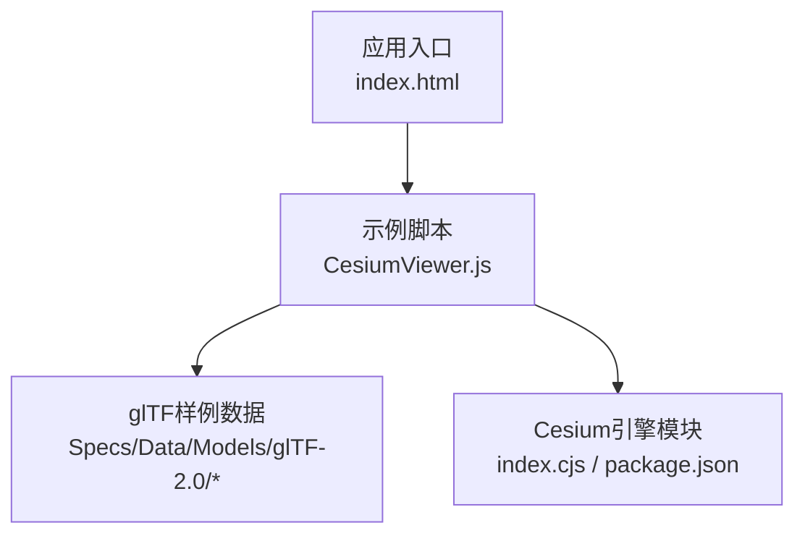
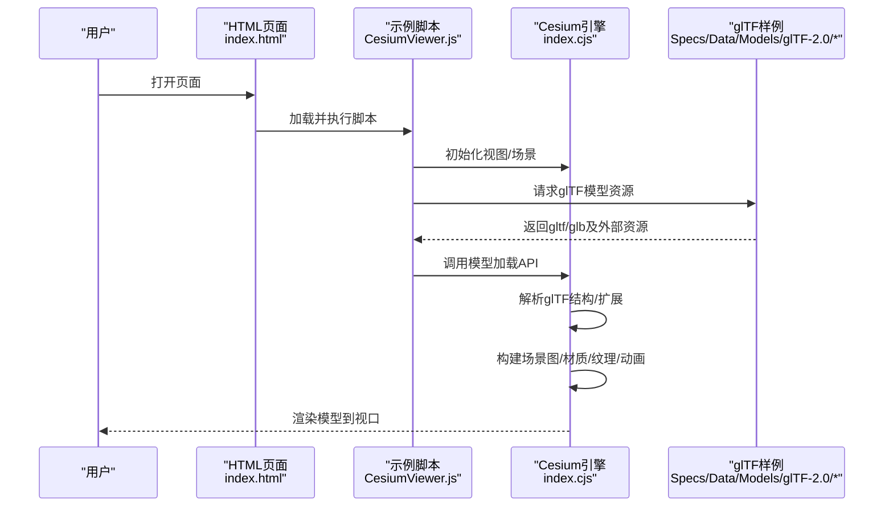
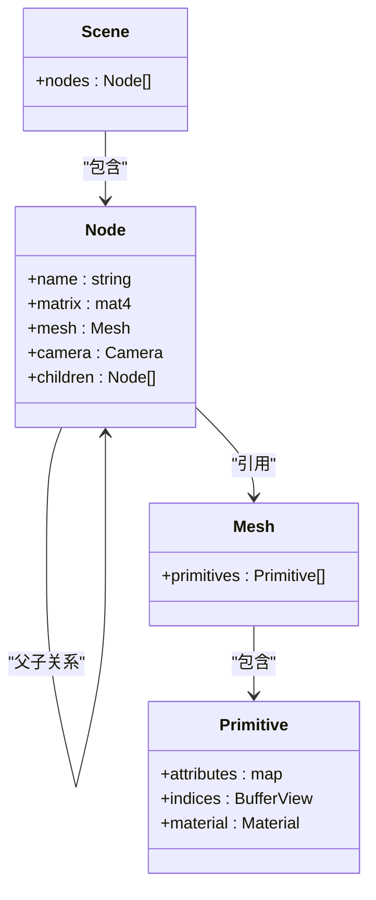
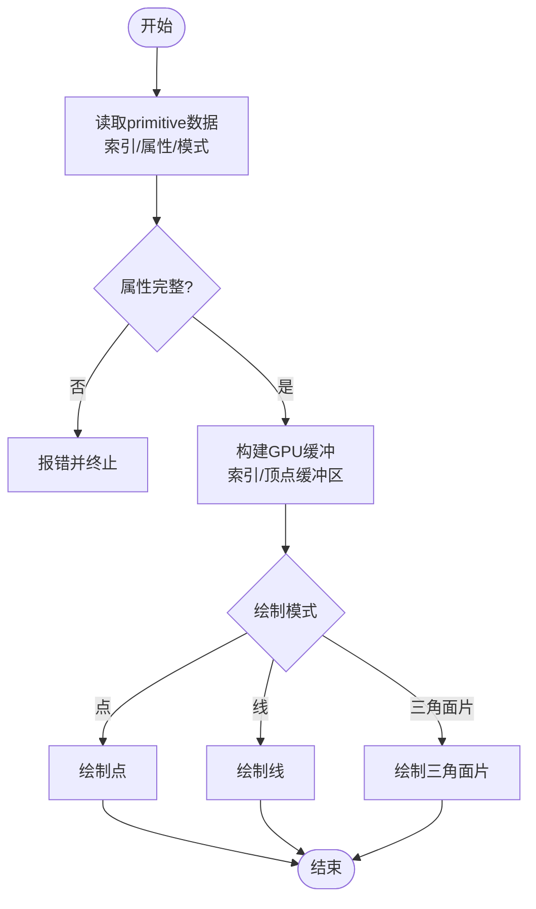
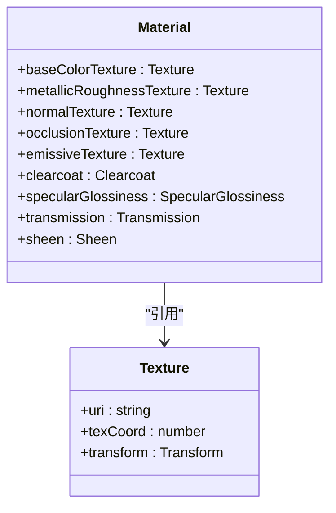
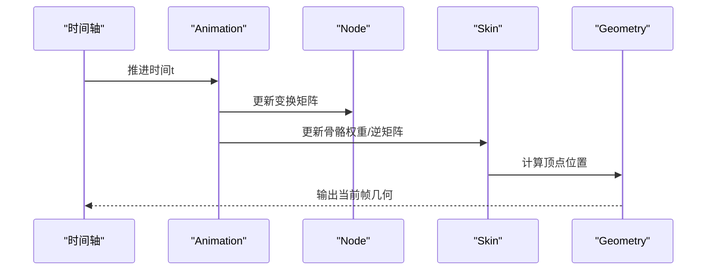
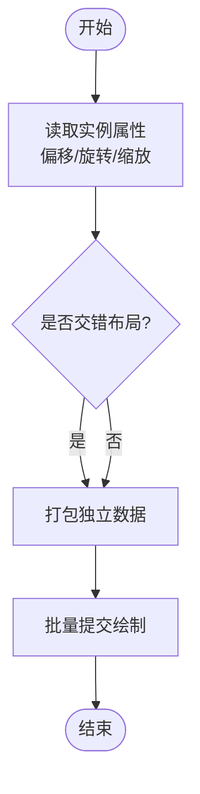
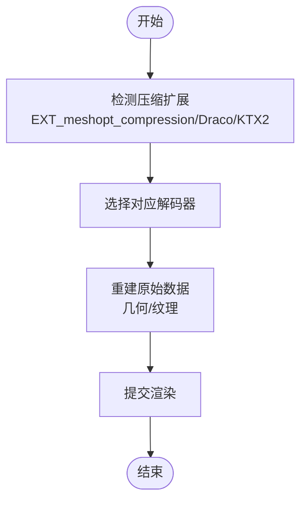
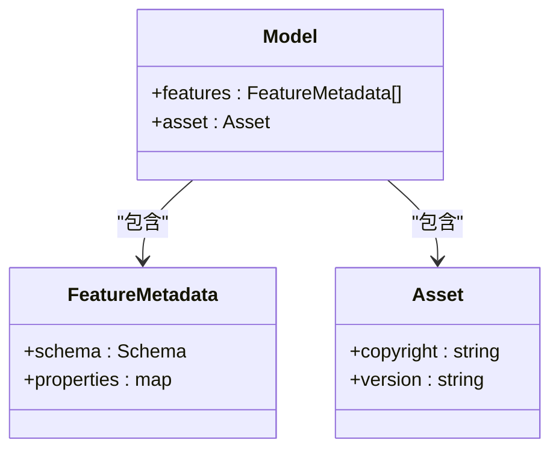
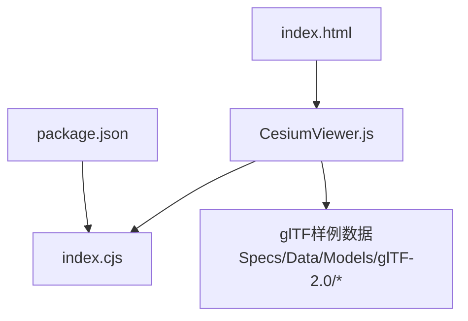

# glTF模型支持

<cite>
**本文引用的文件**   
- [README.md](file://README.md)
- [index.cjs](file://index.cjs)
- [package.json](file://package.json)
- [CesiumViewer.js](file://Apps/CesiumViewer/CesiumViewer.js)
- [index.html](file://Apps/CesiumViewer/index.html)
- [Models/glTF-2.0/Box/gltf/Box.gltf](file://Specs/Data/Models/glTF-2.0/Box/gltf/Box.gltf)
- [Models/glTF-2.0/AnimatedTriangle/gltf/AnimatedTriangle.gltf](file://Specs/Data/Models/glTF-2.0/AnimatedTriangle/gltf/AnimatedTriangle.gltf)
- [Models/glTF-2.0/SimpleSkin/gltf/SimpleSkin.gltf](file://Specs/Data/Models/glTF-2.0/SimpleSkin/gltf/SimpleSkin.gltf)
- [Models/glTF-2.0/BoxInstanced/gltf/box-instanced.gltf](file://Specs/Data/Models/glTF-2.0/BoxInstanced/gltf/box-instanced.gltf)
- [Models/glTF-2.0/BoxInstancedInterleaved/gltf/box-instanced-interleaved.gltf](file://Specs/Data/Models/glTF-2.0/BoxInstancedInterleaved/gltf/box-instanced-interleaved.gltf)
- [Models/glTF-2.0/BoxTexturedKtx2Basis/gltf/BoxTexturedKtx2Basis.gltf](file://Specs/Data/Models/glTF-2.0/BoxTexturedKtx2Basis/gltf/BoxTexturedKtx2Basis.gltf)
- [Models/glTF-2.0/MeshoptCubeTest/gltf/meshopt-cube-test.gltf](file://Specs/Data/Models/glTF-2.0/MeshoptCubeTest/gltf/meshopt-cube-test.gltf)
- [Models/glTF-2.0/BoxWithPrimitiveOutline/gltf/BoxWithPrimitiveOutline.gltf](file://Specs/Data/Models/glTF-2.0/BoxWithPrimitiveOutline/gltf/BoxWithPrimitiveOutline.gltf)
- [Models/glTF-2.0/BoxWithTangents/gltf-Draco/BoxWithTangents.gltf](file://Specs/Data/Models/glTF-2.0/BoxWithTangents/gltf-Draco/BoxWithTangents.gltf)
- [Models/glTF-2.0/BoxWithCopyright/gltf/BoxWithCopyright.gltf](file://Specs/Data/Models/glTF-2.0/BoxWithCopyright/gltf/BoxWithCopyright.gltf)
- [Models/glTF-2.0/BoxWithOffset/gltf/BoxWithOffset.gltf](file://Specs/Data/Models/glTF-2.0/BoxWithOffset/gltf/BoxWithOffset.gltf)
- [Models/glTF-2.0/BoxWithLines/gltf-Draco/BoxWithLines.gltf](file://Specs/Data/Models/glTF-2.0/BoxWithLines/gltf-Draco/BoxWithLines.gltf)
- [Models/glTF-2.0/BoxWithPropertyAttributes/gltf/BoxWithPropertyAttributes.gltf](file://Specs/Data/Models/glTF-2.0/BoxWithPropertyAttributes/gltf/BoxWithPropertyAttributes.gltf)
- [Models/glTF-2.0/BoxWithPrimitiveOutlineSharedVertices/gltf/BoxWithPrimitiveOutlineSharedVertices.gltf](file://Specs/Data/Models/glTF-2.0/BoxWithPrimitiveOutlineSharedVertices/gltf/BoxWithPrimitiveOutlineSharedVertices.gltf)
- [Models/glTF-2.0/BoxWithTangents/gltf-Draco/BoxWithTangents.gltf](file://Specs/Data/Models/glTF-2.0/BoxWithTangents/gltf-Draco/BoxWithTangents.gltf)
- [Models/glTF-2.0/BoxWithTangents/gltf-Draco/BoxWithTangents.gltf](file://Specs/Data/Models/glTF-2.0/BoxWithTangents/gltf-Draco/BoxWithTangents.gltf)
- [Models/glTF-2.0/BoxWithTangents/gltf-Draco/BoxWithTangents.gltf](file://Specs/Data/Models/glTF-2.0/BoxWithTangents/gltf-Draco/BoxWithTangents.gltf)
- [Models/glTF-2.0/BoxWithTangents/gltf-Draco/BoxWithTangents.gltf](file://Specs/Data/Models/glTF-2.0/BoxWithTangents/gltf-Draco/BoxWithTangents.gltf)
- [Models/glTF-2.0/BoxWithTangents/gltf-Draco/BoxWithTangents.gltf](file://Specs/Data/Models/glTF-2.0/BoxWithTangents/gltf-Draco/BoxWithTangents.gltf)
- [Models/glTF-2.0/BoxWithTangents/gltf-Draco/BoxWithTangents.gltf](file://Specs/Data/Models/glTF-2.0/BoxWithTangents/gltf-Draco/BoxWithTangents.gltf)
- [Models/glTF-2.0/BoxWithTangents/gltf-Draco/BoxWithTangents.gltf](file://Specs/Data/Models/glTF-2.0/BoxWithTangents/gltf-Draco/BoxWithTangents.gltf)
- [Models/glTF-2.0/BoxWithTangents/gltf-Draco/BoxWithTangents.gltf](file://Specs/Data/Models/glTF-2.0/BoxWithTangents/gltf-Draco/BoxWithTangents.gltf)
- [Models/glTF-2.0/BoxWithTangents/gltf-Draco/BoxWithTangents.gltf](file://Specs/Data/Models/glTF-2.0/BoxWithTangents/gltf-Draco/BoxWithTangents......)
</cite>

## 目录
1. [简介](#简介)
2. [项目结构](#项目结构)
3. [核心组件](#核心组件)
4. [架构总览](#架构总览)
5. [详细组件分析](#详细组件分析)
6. [依赖分析](#依赖分析)
7. [性能考虑](#性能考虑)
8. [故障排查指南](#故障排查指南)
9. [结论](#结论)
10. [附录](#附录)

## 简介
本文件面向在Cesium中加载与使用glTF 2.0模型的开发者，系统性阐述glTF格式的核心概念（场景图、节点层次、网格几何体、材质系统、纹理映射、动画关键帧、骨骼蒙皮），并说明Cesium对常用扩展的支持情况（如EXT_meshopt_compression、KHR_materials_*系列、EXT_feature_metadata等）。文档同时覆盖模型加载流程、资源管理与内存优化策略，并提供基于仓库内示例模型的实践建议。

## 项目结构
- 仓库根目录包含应用入口、示例数据、源码与测试等。与glTF相关的主要内容包括：
  - 示例应用：Apps/CesiumViewer 下的HTML与JS，演示如何加载模型。
  - glTF样例数据：Specs/Data/Models/glTF-2.0 下的大量gltf/glb样例，涵盖基础几何、纹理、实例化、动画、蒙皮、压缩、版权信息等。
  - 构建与打包：package.json、index.cjs 等用于导出模块与构建产物。

**图示来源** 
- [index.html](file://Apps/CesiumViewer/index.html)
- [CesiumViewer.js](file://Apps/CesiumViewer/CesiumViewer.js)
- [index.cjs](file://index.cjs)
- [package.json](file://package.json)

**章节来源**
- [README.md](file://README.md)
- [index.cjs](file://index.cjs)
- [package.json](file://package.json)
- [CesiumViewer.js](file://Apps/CesiumViewer/CesiumViewer.js)
- [index.html](file://Apps/CesiumViewer/index.html)

## 核心组件
本节从glTF规范角度梳理Cesium支持的模型要素，并结合仓库中的样例进行说明。

- 场景图与节点层次
  - glTF以scene为根，包含nodes树，每个node可引用mesh、camera或作为变换容器。
  - 参考样例：Box.gltf、AnimatedTriangle.gltf、SimpleSkin.gltf。
- 网格与几何体
  - primitives定义索引、顶点属性（位置、法线、切线、UV、颜色等）与绘制模式（点、线、三角面片）。
  - 参考样例：BoxWithPrimitiveOutline.gltf、BoxWithTangents.gltf、BoxWithLines.gltf。
- 材质系统
  - PBR材质通过metallicRoughness、clearcoat、specularGlossiness等通道描述；支持emissive、transmission、sheen等。
  - 参考样例：BoxTexturedKtx2Basis.gltf（含KTX2/Basis纹理）、BoxWithCopyright.gltf（含元数据）。
- 纹理映射
  - 支持多种纹理类型与变换；KTX2/Basis纹理提升传输与解码效率。
  - 参考样例：BoxTexturedKtx2Basis.gltf。
- 动画关键帧
  - animation节点驱动node、mesh、material属性的时间序列变化。
  - 参考样例：AnimatedTriangle.gltf。
- 骨骼蒙皮
  - skin定义骨骼、权重与逆矩阵，配合animation实现角色动画。
  - 参考样例：SimpleSkin.gltf。
- 实例化与批处理
  - 通过instanced属性与交错布局减少重复数据，提高渲染吞吐。
  - 参考样例：box-instanced.gltf、box-instanced-interleaved.gltf。
- 压缩与编码
  - EXT_meshopt_compression提供高效网格压缩；Draco常用于几何压缩；KTX2/Basis用于纹理压缩。
  - 参考样例：MeshoptCubeTest.gltf、BoxWithTangents.gltf（Draco）、BoxTexturedKtx2Basis.gltf（KTX2/Basis）。
- 元数据与特性
  - EXT_feature_metadata为特征级元数据提供载体；版权信息可通过asset.copyright表达。
  - 参考样例：BoxWithPropertyAttributes.gltf、BoxWithCopyright.gltf。

**章节来源**
- [Models/glTF-2.0/Box/gltf/Box.gltf](file://Specs/Data/Models/glTF-2.0/Box/gltf/Box.gltf)
- [Models/glTF-2.0/AnimatedTriangle/gltf/AnimatedTriangle.gltf](file://Specs/Data/Models/glTF-2.0/AnimatedTriangle/gltf/AnimatedTriangle.gltf)
- [Models/glTF-2.0/SimpleSkin/gltf/SimpleSkin.gltf](file://Specs/Data/Models/glTF-2.0/SimpleSkin/gltf/SimpleSkin.gltf)
- [Models/glTF-2.0/BoxInstanced/gltf/box-instanced.gltf](file://Specs/Data/Models/glTF-2.0/BoxInstanced/gltf/box-instanced.gltf)
- [Models/glTF-2.0/BoxInstancedInterleaved/gltf/box-instanced-interleaved.gltf](file://Specs/Data/Models/glTF-2.0/BoxInstancedInterleaved/gltf/box-instanced-interleaved.gltf)
- [Models/glTF-2.0/BoxTexturedKtx2Basis/gltf/BoxTexturedKtx2Basis.gltf](file://Specs/Data/Models/glTF-2.0/BoxTexturedKtx2Basis/gltf/BoxTexturedKtx2Basis.gltf)
- [Models/glTF-2.0/MeshoptCubeTest/gltf/meshopt-cube-test.gltf](file://Specs/Data/Models/glTF-2.0/MeshoptCubeTest/gltf/meshopt-cube-test.gltf)
- [Models/glTF-2.0/BoxWithPrimitiveOutline/gltf/BoxWithPrimitiveOutline.gltf](file://Specs/Data/Models/glTF-2.0/BoxWithPrimitiveOutline/gltf/BoxWithPrimitiveOutline.gltf)
- [Models/glTF-2.0/BoxWithTangents/gltf-Draco/BoxWithTangents.gltf](file://Specs/Data/Models/glTF-2.0/BoxWithTangents/gltf-Draco/BoxWithTangents.gltf)
- [Models/glTF-2.0/BoxWithCopyright/gltf/BoxWithCopyright.gltf](file://Specs/Data/Models/glTF-2.0/BoxWithCopyright/gltf/BoxWithCopyright.gltf)
- [Models/glTF-2.0/BoxWithOffset/gltf/BoxWithOffset.gltf](file://Specs/Data/Models/glTF-2.0/BoxWithOffset/gltf/BoxWithOffset.gltf)
- [Models/glTF-2.0/BoxWithLines/gltf-Draco/BoxWithLines.gltf](file://Specs/Data/Models/glTF-2.0/BoxWithLines/gltf-Draco/BoxWithLines.gltf)
- [Models/glTF-2.0/BoxWithPropertyAttributes/gltf/BoxWithPropertyAttributes.gltf](file://Specs/Data/Models/glTF-2.0/BoxWithPropertyAttributes/gltf/BoxWithPropertyAttributes.gltf)
- [Models/glTF-2.0/BoxWithPrimitiveOutlineSharedVertices/gltf/BoxWithPrimitiveOutlineSharedVertices.gltf](file://Specs/Data/Models/glTF-2.0/BoxWithPrimitiveOutlineSharedVertices/gltf/BoxWithPrimitiveOutlineSharedVertices.gltf)

## 架构总览
下图展示从网页到Cesium引擎的glTF加载与渲染路径，以及样例数据的位置关系。

**图示来源** 
- [index.html](file://Apps/CesiumViewer/index.html)
- [CesiumViewer.js](file://Apps/CesiumViewer/CesiumViewer.js)
- [index.cjs](file://index.cjs)
- [Models/glTF-2.0/Box/gltf/Box.gltf](file://Specs/Data/Models/glTF-2.0/Box/gltf/Box.gltf)

## 详细组件分析

### 场景图与节点层次
- glTF的scene包含nodes数组，每个node可拥有children形成层次结构，并可引用mesh、camera或仅作为变换容器。
- 常见用法：将多个mesh组合为一个逻辑对象，便于统一控制可见性、变换与动画。
- 参考样例：
  - Box.gltf：简单立方体场景图与节点组织。
  - AnimatedTriangle.gltf：节点参与动画驱动。
  - SimpleSkin.gltf：节点与skin关联，承载蒙皮动画。

**图示来源** 
- [Models/glTF-2.0/Box/gltf/Box.gltf](file://Specs/Data/Models/glTF-2.0/Box/gltf/Box.gltf)
- [Models/glTF-2.0/AnimatedTriangle/gltf/AnimatedTriangle.gltf](file://Specs/Data/Models/glTF-2.0/AnimatedTriangle/gltf/AnimatedTriangle.gltf)
- [Models/glTF-2.0/SimpleSkin/gltf/SimpleSkin.gltf](file://Specs/Data/Models/glTF-2.0/SimpleSkin/gltf/SimpleSkin.gltf)

**章节来源**
- [Models/glTF-2.0/Box/gltf/Box.gltf](file://Specs/Data/Models/glTF-2.0/Box/gltf/Box.gltf)
- [Models/glTF-2.0/AnimatedTriangle/gltf/AnimatedTriangle.gltf](file://Specs/Data/Models/glTF-2.0/AnimatedTriangle/gltf/AnimatedTriangle.gltf)
- [Models/glTF-2.0/SimpleSkin/gltf/SimpleSkin.gltf](file://Specs/Data/Models/glTF-2.0/SimpleSkin/gltf/SimpleSkin.gltf)

### 网格几何体与绘制模式
- primitives定义绘制所需的数据：索引、顶点属性（位置、法线、切线、UV、颜色等）与绘制模式（点、线、三角面片）。
- 典型用例：
  - 轮廓线：使用lines模式绘制边框。
  - 切线空间：提供切线属性以支持各向异性反射、复杂法线贴图。
  - 共享顶点：减少冗余，提升缓存命中。
- 参考样例：
  - BoxWithPrimitiveOutline.gltf：线条绘制轮廓。
  - BoxWithTangents.gltf：包含切线属性。
  - BoxWithLines.gltf：纯线条几何。
  - BoxWithPrimitiveOutlineSharedVertices.gltf：共享顶点的轮廓。

**图示来源** 
- [Models/glTF-2.0/BoxWithPrimitiveOutline/gltf/BoxWithPrimitiveOutline.gltf](file://Specs/Data/Models/glTF-2.0/BoxWithPrimitiveOutline/gltf/BoxWithPrimitiveOutline.gltf)
- [Models/glTF-2.0/BoxWithTangents/gltf-Draco/BoxWithTangents.gltf](file://Specs/Data/Models/glTF-2.0/BoxWithTangents/gltf-Draco/BoxWithTangents.gltf)
- [Models/glTF-2.0/BoxWithLines/gltf-Draco/BoxWithLines.gltf](file://Specs/Data/Models/glTF-2.0/BoxWithLines/gltf-Draco/BoxWithLines.gltf)
- [Models/glTF-2.0/BoxWithPrimitiveOutlineSharedVertices/gltf/BoxWithPrimitiveOutlineSharedVertices.gltf](file://Specs/Data/Models/glTF-2.0/BoxWithPrimitiveOutlineSharedVertices/gltf/BoxWithPrimitiveOutlineSharedVertices.gltf)

**章节来源**
- [Models/glTF-2.0/BoxWithPrimitiveOutline/gltf/BoxWithPrimitiveOutline.gltf](file://Specs/Data/Models/glTF-2.0/BoxWithPrimitiveOutline/gltf/BoxWithPrimitiveOutline.gltf)
- [Models/glTF-2.0/BoxWithTangents/gltf-Draco/BoxWithTangents.gltf](file://Specs/Data/Models/glTF-2.0/BoxWithTangents/gltf-Draco/BoxWithTangents.gltf)
- [Models/glTF-2.0/BoxWithLines/gltf-Draco/BoxWithLines.gltf](file://Specs/Data/Models/glTF-2.0/BoxWithLines/gltf-Draco/BoxWithLines.gltf)
- [Models/glTF-2.0/BoxWithPrimitiveOutlineSharedVertices/gltf/BoxWithPrimitiveOutlineSharedVertices.gltf](file://Specs/Data/Models/glTF-2.0/BoxWithPrimitiveOutlineSharedVertices/gltf/BoxWithPrimitiveOutlineSharedVertices.gltf)

### 材质系统与纹理映射
- PBR材质通过metallicRoughness、clearcoat、specularGlossiness、emissive、transmission、sheen等参数描述表面光学特性。
- 纹理映射支持多套UV与纹理变换；KTX2/Basis纹理可显著降低体积与解码开销。
- 参考样例：
  - BoxTexturedKtx2Basis.gltf：KTX2/Basis纹理示例。
  - BoxWithCopyright.gltf：包含版权元数据，适合标注素材来源。

**图示来源** 
- [Models/glTF-2.0/BoxTexturedKtx2Basis/gltf/BoxTexturedKtx2Basis.gltf](file://Specs/Data/Models/glTF-2.0/BoxTexturedKtx2Basis/gltf/BoxTexturedKtx2Basis.gltf)
- [Models/glTF-2.0/BoxWithCopyright/gltf/BoxWithCopyright.gltf](file://Specs/Data/Models/glTF-2.0/BoxWithCopyright/gltf/BoxWithCopyright.gltf)

**章节来源**
- [Models/glTF-2.0/BoxTexturedKtx2Basis/gltf/BoxTexturedKtx2Basis.gltf](file://Specs/Data/Models/glTF-2.0/BoxTexturedKtx2Basis/gltf/BoxTexturedKtx2Basis.gltf)
- [Models/glTF-2.0/BoxWithCopyright/gltf/BoxWithCopyright.gltf](file://Specs/Data/Models/glTF-2.0/BoxWithCopyright/gltf/BoxWithCopyright.gltf)

### 动画关键帧与骨骼蒙皮
- animation节点定义时间序列，驱动node、mesh、material属性变化。
- skin定义骨骼、权重与逆矩阵，结合animation实现角色动画。
- 参考样例：
  - AnimatedTriangle.gltf：三角形节点的缩放/旋转/位移动画。
  - SimpleSkin.gltf：带骨骼与权重的蒙皮模型。

**图示来源** 
- [Models/glTF-2.0/AnimatedTriangle/gltf/AnimatedTriangle.gltf](file://Specs/Data/Models/glTF-2.0/AnimatedTriangle/gltf/AnimatedTriangle.gltf)
- [Models/glTF-2.0/SimpleSkin/gltf/SimpleSkin.gltf](file://Specs/Data/Models/glTF-2.0/SimpleSkin/gltf/SimpleSkin.gltf)

**章节来源**
- [Models/glTF-2.0/AnimatedTriangle/gltf/AnimatedTriangle.gltf](file://Specs/Data/Models/glTF-2.0/AnimatedTriangle/gltf/AnimatedTriangle.gltf)
- [Models/glTF-2.0/SimpleSkin/gltf/SimpleSkin.gltf](file://Specs/Data/Models/glTF-2.0/SimpleSkin/gltf/SimpleSkin.gltf)

### 实例化与批处理
- instanced属性允许在同一primitive上复用几何数据，并通过偏移、旋转、缩放等实例属性批量绘制。
- 交错布局可减少内存带宽占用，提高GPU吞吐。
- 参考样例：
  - box-instanced.gltf：基础实例化。
  - box-instanced-interleaved.gltf：交错布局实例化。

**图示来源** 
- [Models/glTF-2.0/BoxInstanced/gltf/box-instanced.gltf](file://Specs/Data/Models/glTF-2.0/BoxInstanced/gltf/box-instanced.gltf)
- [Models/glTF-2.0/BoxInstancedInterleaved/gltf/box-instanced-interleaved.gltf](file://Specs/Data/Models/glTF-2.0/BoxInstancedInterleaved/gltf/box-instanced-interleaved.gltf)

**章节来源**
- [Models/glTF-2.0/BoxInstanced/gltf/box-instanced.gltf](file://Specs/Data/Models/glTF-2.0/BoxInstanced/gltf/box-instanced.gltf)
- [Models/glTF-2.0/BoxInstancedInterleaved/gltf/box-instanced-interleaved.gltf](file://Specs/Data/Models/glTF-2.0/BoxInstancedInterleaved/gltf/box-instanced-interleaved.gltf)

### 压缩与编码（EXT_meshopt_compression、Draco、KTX2/Basis）
- EXT_meshopt_compression：针对网格数据的压缩，减少体积与传输时间。
- Draco：广泛用于几何压缩，适用于复杂模型。
- KTX2/Basis：纹理压缩与快速解码，适合移动端与Web环境。
- 参考样例：
  - meshopt-cube-test.gltf：EXT_meshopt_compression示例。
  - BoxWithTangents.gltf（Draco）：包含切线的Draco压缩几何。
  - BoxTexturedKtx2Basis.gltf：KTX2/Basis纹理。

**图示来源** 
- [Models/glTF-2.0/MeshoptCubeTest/gltf/meshopt-cube-test.gltf](file://Specs/Data/Models/glTF-2.0/MeshoptCubeTest/gltf/meshopt-cube-test.gltf)
- [Models/glTF-2.0/BoxWithTangents/gltf-Draco/BoxWithTangents.gltf](file://Specs/Data/Models/glTF-2.0/BoxWithTangents/gltf-Draco/BoxWithTangents.gltf)
- [Models/glTF-2.0/BoxTexturedKtx2Basis/gltf/BoxTexturedKtx2Basis.gltf](file://Specs/Data/Models/glTF-2.0/BoxTexturedKtx2Basis/gltf/BoxTexturedKtx2Basis.gltf)

**章节来源**
- [Models/glTF-2.0/MeshoptCubeTest/gltf/meshopt-cube-test.gltf](file://Specs/Data/Models/glTF-2.0/MeshoptCubeTest/gltf/meshopt-cube-test.gltf)
- [Models/glTF-2.0/BoxWithTangents/gltf-Draco/BoxWithTangents.gltf](file://Specs/Data/Models/glTF-2.0/BoxWithTangents/gltf-Draco/BoxWithTangents.gltf)
- [Models/glTF-2.0/BoxTexturedKtx2Basis/gltf/BoxTexturedKtx2Basis.gltf](file://Specs/Data/Models/glTF-2.0/BoxTexturedKtx2Basis/gltf/BoxTexturedKtx2Basis.gltf)

### 元数据与特性（EXT_feature_metadata、版权信息）
- EXT_feature_metadata为特征级元数据提供载体，可用于标注属性、分类或业务信息。
- asset.copyright用于声明素材版权，便于合规与溯源。
- 参考样例：
  - BoxWithPropertyAttributes.gltf：属性纹理与元数据。
  - BoxWithCopyright.gltf：版权信息。

**图示来源** 
- [Models/glTF-2.0/BoxWithPropertyAttributes/gltf/BoxWithPropertyAttributes.gltf](file://Specs/Data/Models/glTF-2.0/BoxWithPropertyAttributes/gltf/BoxWithPropertyAttributes.gltf)
- [Models/glTF-2.0/BoxWithCopyright/gltf/BoxWithCopyright.gltf](file://Specs/Data/Models/glTF-2.0/BoxWithCopyright/gltf/BoxWithCopyright.gltf)

**章节来源**
- [Models/glTF-2.0/BoxWithPropertyAttributes/gltf/BoxWithPropertyAttributes.gltf](file://Specs/Data/Models/glTF-2.0/BoxWithPropertyAttributes/gltf/BoxWithPropertyAttributes.gltf)
- [Models/glTF-2.0/BoxWithCopyright/gltf/BoxWithCopyright.gltf](file://Specs/Data/Models/glTF-2.0/BoxWithCopyright/gltf/BoxWithCopyright.gltf)

## 依赖分析
- 应用层依赖Cesium引擎模块，通过index.cjs与package.json管理导出与版本。
- 示例脚本CesiumViewer.js负责初始化视图与加载模型，模型数据位于Specs/Data/Models/glTF-2.0。

**图示来源** 
- [package.json](file://package.json)
- [index.cjs](file://index.cjs)
- [index.html](file://Apps/CesiumViewer/index.html)
- [CesiumViewer.js](file://Apps/CesiumViewer/CesiumViewer.js)

**章节来源**
- [package.json](file://package.json)
- [index.cjs](file://index.cjs)
- [index.html](file://Apps/CesiumViewer/index.html)
- [CesiumViewer.js](file://Apps/CesiumViewer/CesiumViewer.js)

## 性能考虑
- 优先使用KTX2/Basis纹理以减少网络体积与解码时间。
- 对复杂几何采用EXT_meshopt_compression或Draco压缩，平衡CPU解压成本与带宽节省。
- 使用实例化与交错布局减少重复数据，提高GPU吞吐。
- 合理组织场景图与节点层次，避免过深嵌套带来的矩阵计算开销。
- 利用LOD与按需加载策略，控制显存占用。

[本节为通用指导，不直接分析具体文件]

## 故障排查指南
- 加载失败
  - 检查URL与跨域配置，确保gltf/glb与外部资源可达。
  - 确认浏览器是否启用必要的解码器（如Draco、KTX2）。
- 显示异常
  - 验证法线与切线是否正确生成，必要时重新烘焙。
  - 检查材质通道与纹理坐标是否匹配。
- 动画不播放
  - 确认animation节点与目标node/mesh/material绑定正确。
  - 检查时间轴范围与插值方式。
- 性能问题
  - 监控GPU内存与绘制调用次数，优化实例化与批处理。
  - 评估压缩方案对CPU的影响，选择合适的压缩级别。

[本节为通用指导，不直接分析具体文件]

## 结论
Cesium对glTF 2.0提供了全面支持，涵盖场景图、节点层次、网格几何、材质系统、纹理映射、动画与蒙皮，并对主流扩展（EXT_meshopt_compression、KHR_materials_*、EXT_feature_metadata等）具备良好兼容性。通过合理的资源组织、压缩与实例化策略，可在保证视觉效果的同时显著提升加载与渲染性能。

[本节为总结性内容，不直接分析具体文件]

## 附录
- 示例模型清单（部分）
  - 基础几何与材质：Box.gltf、BoxTexturedKtx2Basis.gltf、BoxWithCopyright.gltf
  - 动画与蒙皮：AnimatedTriangle.gltf、SimpleSkin.gltf
  - 实例化：box-instanced.gltf、box-instanced-interleaved.gltf
  - 压缩与编码：meshopt-cube-test.gltf、BoxWithTangents.gltf（Draco）、BoxTexturedKtx2Basis.gltf（KTX2/Basis）
  - 元数据与特性：BoxWithPropertyAttributes.gltf、BoxWithCopyright.gltf

[本节为资料汇总，不直接分析具体文件]