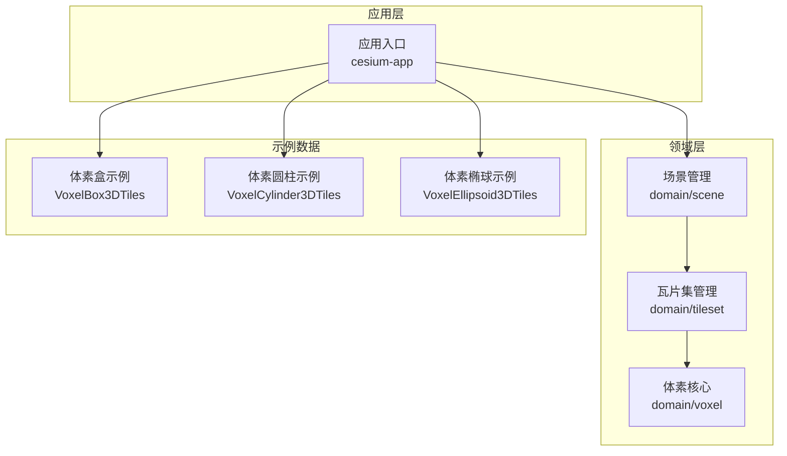
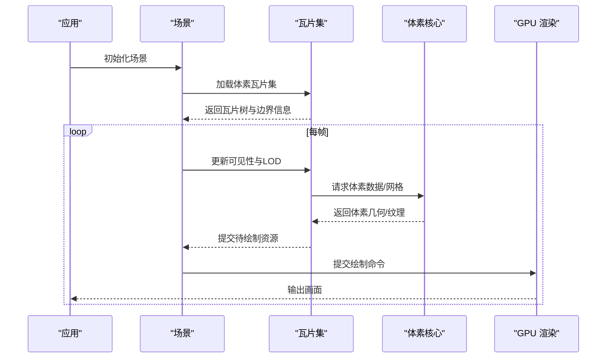
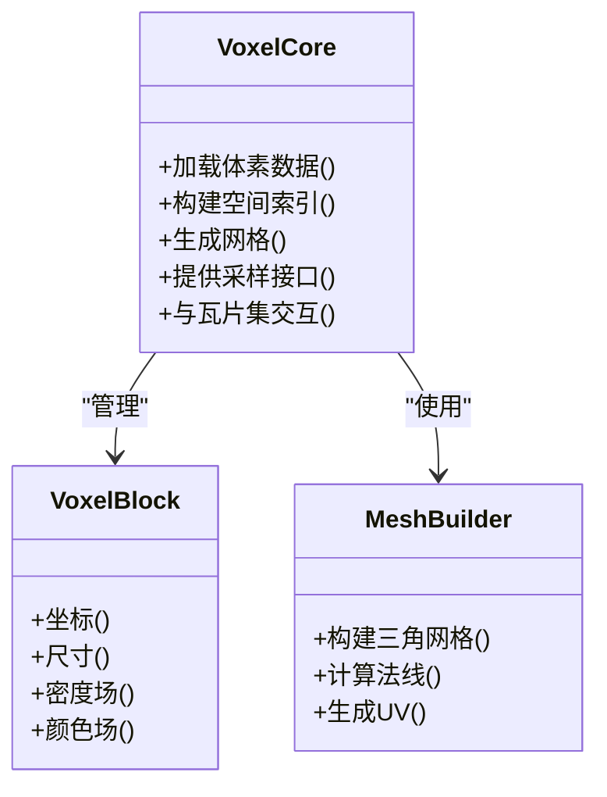
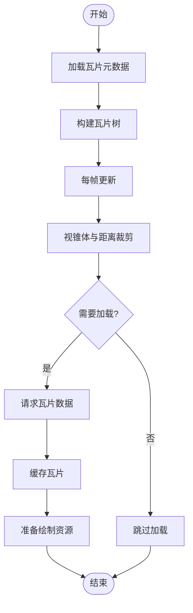
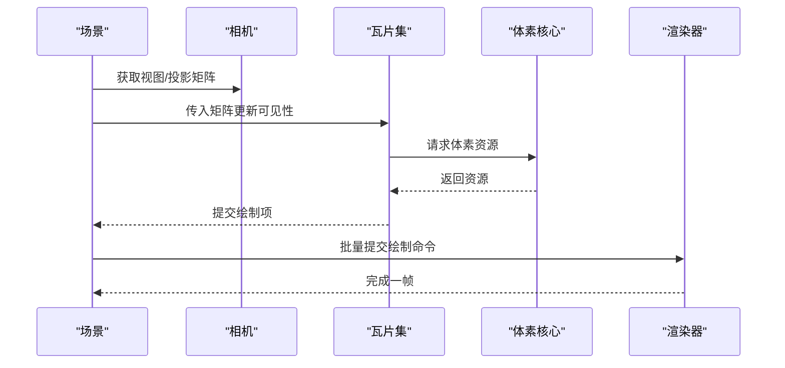
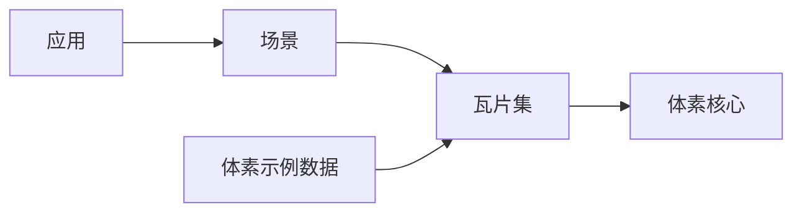

# 体素数据渲染

<cite>
**本文引用的文件**   
- [voxel.rs](file://cesiumrust/domain/voxel/src/voxel.rs)
- [tileset.rs](file://cesiumrust/domain/tileset/src/tileset.rs)
- [scene.rs](file://cesiumrust/domain/scene/src/scene.rs)
- [geometry_showcase.rs](file://cesiumrust/application/cesium-app/src/geometry_showcase.rs)
- [VoxelBox3DTiles.json](file://Apps/SampleData/Cesium3DTiles/Voxel/VoxelBox3DTiles/tileset.json)
- [VoxelCylinder3DTiles.json](file://Apps/SampleData/Cesium3DTiles/Voxel/VoxelCylinder3DTiles/tileset.json)
- [VoxelEllipsoid3DTiles.json](file://Apps/SampleData/Cesium3DTiles/Voxel/VoxelEllipsoid3DTiles/tileset.json)
</cite>

## 目录
1. [简介](#简介)
2. [项目结构](#项目结构)
3. [核心组件](#核心组件)
4. [架构总览](#架构总览)
5. [详细组件分析](#详细组件分析)
6. [依赖关系分析](#依赖关系分析)
7. [性能考量](#性能考量)
8. [故障排查指南](#故障排查指南)
9. [结论](#结论)
10. [附录](#附录)

## 简介
本文件聚焦于仓库中的“体素数据渲染”能力，围绕 Cesium Rust 实现（cesiumrust）与示例数据（Apps/SampleData/Cesium3DTiles/Voxel）展开。文档从系统架构、组件职责、数据流与渲染流程入手，结合类图、时序图与流程图，帮助读者快速理解体素数据的加载、组织、调度与绘制过程，并提供性能优化与问题定位建议。

## 项目结构
与体素渲染相关的代码主要分布在以下位置：
- cesiumrust/domain/voxel：体素领域模型与核心逻辑
- cesiumrust/domain/tileset：瓦片集管理与调度
- cesiumrust/domain/scene：场景管理、渲染管线集成
- cesiumrust/application/cesium-app：应用层示例，展示几何与材质（含体素）
- Apps/SampleData/Cesium3DTiles/Voxel：体素 3D Tiles 示例数据（盒、圆柱、椭球）

图表来源
- [scene.rs](file://cesiumrust/domain/scene/src/scene.rs)
- [tileset.rs](file://cesiumrust/domain/tileset/src/tileset.rs)
- [voxel.rs](file://cesiumrust/domain/voxel/src/voxel.rs)
- [geometry_showcase.rs](file://cesiumrust/application/cesium-app/src/geometry_showcase.rs)
- [VoxelBox3DTiles.json](file://Apps/SampleData/Cesium3DTiles/Voxel/VoxelBox3DTiles/tileset.json)
- [VoxelCylinder3DTiles.json](file://Apps/SampleData/Cesium3DTiles/Voxel/VoxelCylinder3DTiles/tileset.json)
- [VoxelEllipsoid3DTiles.json](file://Apps/SampleData/Cesium3DTiles/Voxel/VoxelEllipsoid3DTiles/tileset.json)

章节来源
- [scene.rs](file://cesiumrust/domain/scene/src/scene.rs)
- [tileset.rs](file://cesiumrust/domain/tileset/src/tileset.rs)
- [voxel.rs](file://cesiumrust/domain/voxel/src/voxel.rs)
- [geometry_showcase.rs](file://cesiumrust/application/cesium-app/src/geometry_showcase.rs)
- [VoxelBox3DTiles.json](file://Apps/SampleData/Cesium3DTiles/Voxel/VoxelBox3DTiles/tileset.json)
- [VoxelCylinder3DTiles.json](file://Apps/SampleData/Cesium3DTiles/Voxel/VoxelCylinder3DTiles/tileset.json)
- [VoxelEllipsoid3DTiles.json](file://Apps/SampleData/Cesium3DTiles/Voxel/VoxelEllipsoid3DTiles/tileset.json)

## 核心组件
- 体素核心（Voxel）：定义体素数据结构、网格生成、可见性裁剪与渲染所需的基础能力。
- 瓦片集（Tileset）：负责体素瓦片的元数据解析、层级组织、按需加载与剔除。
- 场景（Scene）：将瓦片集纳入渲染循环，协调相机、视锥体与 LOD，驱动体素绘制。
- 应用示例（Geometry Showcase）：演示如何创建并显示体素几何，便于验证与调试。

章节来源
- [voxel.rs](file://cesiumrust/domain/voxel/src/voxel.rs)
- [tileset.rs](file://cesiumrust/domain/tileset/src/tileset.rs)
- [scene.rs](file://cesiumrust/domain/scene/src/scene.rs)
- [geometry_showcase.rs](file://cesiumrust/application/cesium-app/src/geometry_showcase.rs)

## 架构总览
下图展示了体素渲染的整体调用链：应用启动后，场景初始化并加载体素瓦片集；瓦片集根据相机与视锥体进行可见性判断与按需加载；体素核心将瓦片数据转换为可绘制的几何或纹理，最终由渲染管线输出到屏幕。

图表来源
- [scene.rs](file://cesiumrust/domain/scene/src/scene.rs)
- [tileset.rs](file://cesiumrust/domain/tileset/src/tileset.rs)
- [voxel.rs](file://cesiumrust/domain/voxel/src/voxel.rs)

## 详细组件分析

### 体素核心（Voxel）
- 职责：封装体素数据结构、空间索引、网格生成、采样与着色所需的数据准备。
- 关键点：
  - 体素块的组织方式与内存布局对缓存友好性至关重要。
  - 网格生成需考虑面剔除、法线计算与纹理坐标映射。
  - 与瓦片集的接口应明确数据边界与坐标系约定。

图表来源
- [voxel.rs](file://cesiumrust/domain/voxel/src/voxel.rs)

章节来源
- [voxel.rs](file://cesiumrust/domain/voxel/src/voxel.rs)

### 瓦片集（Tileset）
- 职责：解析体素瓦片元数据，维护瓦片树，执行视锥体与距离裁剪，按帧调度加载。
- 关键点：
  - 瓦片边界与几何误差用于 LOD 选择。
  - 异步加载与缓存策略影响吞吐与延迟。
  - 与场景的交互包括更新矩阵、可见性标记与绘制队列。

图表来源
- [tileset.rs](file://cesiumrust/domain/tileset/src/tileset.rs)

章节来源
- [tileset.rs](file://cesiumrust/domain/tileset/src/tileset.rs)

### 场景（Scene）
- 职责：整合相机、投影、渲染状态与绘制循环，协调瓦片集与渲染后端。
- 关键点：
  - 每帧更新视图与投影矩阵，传递给瓦片集与体素核心。
  - 管理渲染队列与批处理，减少状态切换开销。
  - 与 GPU 的交互通过统一的绘制接口完成。

图表来源
- [scene.rs](file://cesiumrust/domain/scene/src/scene.rs)
- [tileset.rs](file://cesiumrust/domain/tileset/src/tileset.rs)
- [voxel.rs](file://cesiumrust/domain/voxel/src/voxel.rs)

章节来源
- [scene.rs](file://cesiumrust/domain/scene/src/scene.rs)

### 应用示例（Geometry Showcase）
- 职责：演示如何创建体素几何并添加到场景中，便于验证渲染效果。
- 关键点：
  - 通过示例配置加载不同形状的体素瓦片（盒、圆柱、椭球）。
  - 支持切换材质与观察角度，辅助调试与性能评估。

章节来源
- [geometry_showcase.rs](file://cesiumrust/application/cesium-app/src/geometry_showcase.rs)

## 依赖关系分析
- 场景依赖瓦片集，瓦片集依赖体素核心。
- 应用层通过场景与瓦片集间接访问体素核心。
- 示例数据为瓦片集提供元数据与内容路径。

图表来源
- [scene.rs](file://cesiumrust/domain/scene/src/scene.rs)
- [tileset.rs](file://cesiumrust/domain/tileset/src/tileset.rs)
- [voxel.rs](file://cesiumrust/domain/voxel/src/voxel.rs)
- [VoxelBox3DTiles.json](file://Apps/SampleData/Cesium3DTiles/Voxel/VoxelBox3DTiles/tileset.json)
- [VoxelCylinder3DTiles.json](file://Apps/SampleData/Cesium3DTiles/Voxel/VoxelCylinder3DTiles/tileset.json)
- [VoxelEllipsoid3DTiles.json](file://Apps/SampleData/Cesium3DTiles/Voxel/VoxelEllipsoid3DTiles/tileset.json)

章节来源
- [scene.rs](file://cesiumrust/domain/scene/src/scene.rs)
- [tileset.rs](file://cesiumrust/domain/tileset/src/tileset.rs)
- [voxel.rs](file://cesiumrust/domain/voxel/src/voxel.rs)
- [VoxelBox3DTiles.json](file://Apps/SampleData/Cesium3DTiles/Voxel/VoxelBox3DTiles/tileset.json)
- [VoxelCylinder3DTiles.json](file://Apps/SampleData/Cesium3DTiles/Voxel/VoxelCylinder3DTiles/tileset.json)
- [VoxelEllipsoid3DTiles.json](file://Apps/SampleData/Cesium3DTiles/Voxel/VoxelEllipsoid3DTiles/tileset.json)

## 性能考量
- 瓦片级 LOD：依据相机距离与几何误差动态选择合适分辨率的瓦片，降低绘制量。
- 视锥体裁剪：尽早剔除不可见瓦片，减少无效计算与内存占用。
- 网格合并与批处理：合并相邻小网格，减少绘制调用次数。
- 内存与缓存：体素块采用连续布局与预取策略，提升缓存命中率。
- 异步加载：后台线程加载与解码，避免阻塞主渲染循环。
- 纹理压缩：使用合适的纹理格式与压缩算法，降低带宽与显存压力。

[本节为通用指导，不直接分析具体文件]

## 故障排查指南
- 瓦片无法加载：检查瓦片元数据路径与网络可达性，确认瓦片集合 JSON 配置正确。
- 渲染空白：确认相机位置与视锥体是否包含目标区域，检查瓦片可见性标记。
- 卡顿或掉帧：监控瓦片加载并发数与缓存命中率，调整 LOD 阈值与批大小。
- 内存溢出：限制同时加载的瓦片数量，启用渐进式加载与及时释放。
- 着色异常：检查体素采样与法线计算是否正确，确认纹理坐标与材质参数。

章节来源
- [tileset.rs](file://cesiumrust/domain/tileset/src/tileset.rs)
- [voxel.rs](file://cesiumrust/domain/voxel/src/voxel.rs)
- [scene.rs](file://cesiumrust/domain/scene/src/scene.rs)

## 结论
体素数据渲染在 Cesium Rust 中通过清晰的领域分层与模块化设计实现：场景负责编排，瓦片集负责调度，体素核心负责数据与网格生成。配合合理的 LOD、裁剪与批处理策略，可在大规模体素场景下保持流畅体验。示例数据与应用入口为开发与调试提供了便捷手段。

[本节为总结性内容，不直接分析具体文件]

## 附录
- 示例数据说明：
  - 体素盒：适用于规则几何的快速验证。
  - 体素圆柱：测试曲面与法线一致性。
  - 体素椭球：验证复杂形状与采样精度。

章节来源
- [VoxelBox3DTiles.json](file://Apps/SampleData/Cesium3DTiles/Voxel/VoxelBox3DTiles/tileset.json)
- [VoxelCylinder3DTiles.json](file://Apps/SampleData/Cesium3DTiles/Voxel/VoxelCylinder3DTiles/tileset.json)
- [VoxelEllipsoid3DTiles.json](file://Apps/SampleData/Cesium3DTiles/Voxel/VoxelEllipsoid3DTiles/tileset.json)