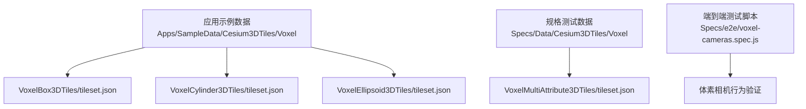
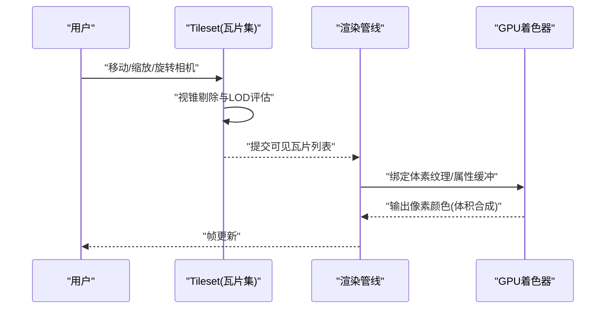
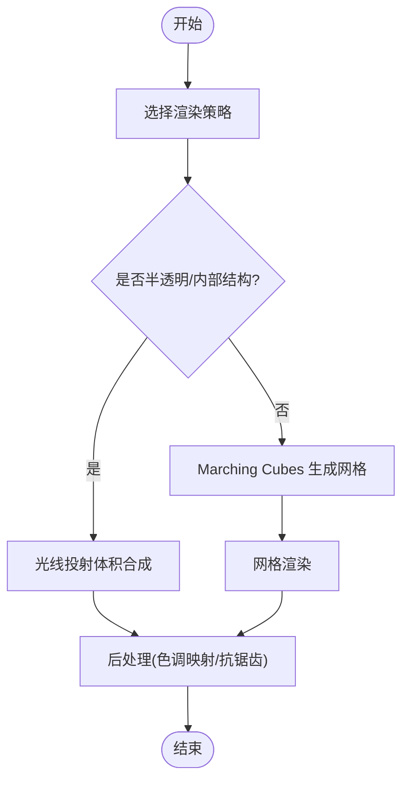
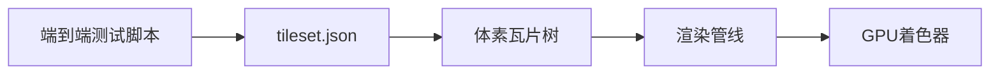

# 体素数据渲染

<cite>
**本文引用的文件**   
- [VoxelBox3DTiles/tileset.json](file://Apps/SampleData/Cesium3DTiles/Voxel/VoxelBox3DTiles/tileset.json)
- [VoxelCylinder3DTiles/tileset.json](file://Apps/SampleData/Cesium3DTiles/Voxel/VoxelCylinder3DTiles/tileset.json)
- [VoxelEllipsoid3DTiles/tileset.json](file://Apps/SampleData/Cesium3DTiles/Voxel/VoxelEllipsoid3DTiles/tileset.json)
- [VoxelMultiAttribute3DTiles/tileset.json](file://Specs/Data/Cesium3DTiles/Voxel/VoxelMultiAttribute3DTiles/tileset.json)
- [voxel-cameras.spec.js](file://Specs/e2e/voxel-cameras.spec.js)
</cite>

## 目录
1. [简介](#简介)
2. [项目结构](#项目结构)
3. [核心组件](#核心组件)
4. [架构总览](#架构总览)
5. [详细组件分析](#详细组件分析)
6. [依赖分析](#依赖分析)
7. [性能考虑](#性能考虑)
8. [故障排查指南](#故障排查指南)
9. [结论](#结论)
10. [附录](#附录)

## 简介
本技术文档聚焦于 Cesium 的体素数据渲染能力，围绕体素数据的概念、应用场景、存储与压缩、渲染算法、可视化交互、加载示例与性能优化进行系统化说明。体素（Voxel）是三维空间中的最小体积单元，常用于医学影像（CT/MRI）、地质建模、科学可视化等需要表达连续场或半透明介质的领域。在 Cesium 中，体素数据以 3D Tiles Voxel 形式组织，通过瓦片化与多分辨率层次结构实现大规模体素的按需加载与高效渲染。

## 项目结构
仓库中与体素相关的资源主要分布在以下位置：
- 应用示例数据：Apps/SampleData/Cesium3DTiles/Voxel
- 规格测试数据：Specs/Data/Cesium3DTiles/Voxel
- 端到端测试脚本：Specs/e2e/voxel-cameras.spec.js

这些文件共同构成了体素数据的描述、样例与验证流程。下图展示了体素相关资源的组织结构与关系。

图表来源
- [VoxelBox3DTiles/tileset.json](file://Apps/SampleData/Cesium3DTiles/Voxel/VoxelBox3DTiles/tileset.json)
- [VoxelCylinder3DTiles/tileset.json](file://Apps/SampleData/Cesium3DTiles/Voxel/VoxelCylinder3DTiles/tileset.json)
- [VoxelEllipsoid3DTiles/tileset.json](file://Apps/SampleData/Cesium3DTiles/Voxel/VoxelEllipsoid3DTiles/tileset.json)
- [VoxelMultiAttribute3DTiles/tileset.json](file://Specs/Data/Cesium3DTiles/Voxel/VoxelMultiAttribute3DTiles/tileset.json)
- [voxel-cameras.spec.js](file://Specs/e2e/voxel-cameras.spec.js)

章节来源
- [VoxelBox3DTiles/tileset.json](file://Apps/SampleData/Cesium3DTiles/Voxel/VoxelBox3DTiles/tileset.json)
- [VoxelCylinder3DTiles/tileset.json](file://Apps/SampleData/Cesium3DTiles/Voxel/VoxelCylinder3DTiles/tileset.json)
- [VoxelEllipsoid3DTiles/tileset.json](file://Apps/SampleData/Cesium3DTiles/Voxel/VoxelEllipsoid3DTiles/tileset.json)
- [VoxelMultiAttribute3DTiles/tileset.json](file://Specs/Data/Cesium3DTiles/Voxel/VoxelMultiAttribute3DTiles/tileset.json)
- [voxel-cameras.spec.js](file://Specs/e2e/voxel-cameras.spec.js)

## 核心组件
- 体素瓦片集描述（tileset.json）：定义体素数据的根节点、子瓦片、几何误差、边界体、内容路径与元数据等，驱动按需加载与细节层次切换。
- 多属性体素：支持为每个体素单元附加多个标量或向量属性，用于表示密度、温度、浓度等多维物理量。
- 相机与交互：端到端测试覆盖体素场景下的相机行为，确保在缩放、平移、旋转时体素瓦片的可见性判定与加载策略正确。

章节来源
- [VoxelBox3DTiles/tileset.json](file://Apps/SampleData/Cesium3DTiles/Voxel/VoxelBox3DTiles/tileset.json)
- [VoxelCylinder3DTiles/tileset.json](file://Apps/SampleData/Cesium3DTiles/Voxel/VoxelCylinder3DTiles/tileset.json)
- [VoxelEllipsoid3DTiles/tileset.json](file://Apps/SampleData/Cesium3DTiles/Voxel/VoxelEllipsoid3DTiles/tileset.json)
- [VoxelMultiAttribute3DTiles/tileset.json](file://Specs/Data/Cesium3DTiles/Voxel/VoxelMultiAttribute3DTiles/tileset.json)
- [voxel-cameras.spec.js](file://Specs/e2e/voxel-cameras.spec.js)

## 架构总览
从数据到渲染的整体流程如下：
- tileset.json 提供体素瓦片的层级结构与加载策略；
- 运行时根据相机位置与视锥剔除选择可见瓦片；
- 按几何误差与距离动态加载不同分辨率的体素块；
- GPU 侧采用光线投射或体积着色器对体素数据进行采样与合成；
- 用户交互（切片、透明度、属性映射）通过参数更新驱动重绘。

图表来源
- [VoxelBox3DTiles/tileset.json](file://Apps/SampleData/Cesium3DTiles/Voxel/VoxelBox3DTiles/tileset.json)
- [VoxelCylinder3DTiles/tileset.json](file://Apps/SampleData/Cesium3DTiles/Voxel/VoxelCylinder3DTiles/tileset.json)
- [VoxelEllipsoid3DTiles/tileset.json](file://Apps/SampleData/Cesium3DTiles/Voxel/VoxelEllipsoid3DTiles/tileset.json)

## 详细组件分析

### 体素瓦片集描述（tileset.json）
- 作用：声明体素数据的根瓦片、子瓦片树、几何误差阈值、边界体（包围盒/球体/区域）、内容路径与可选元数据。
- 关键点：
  - 几何误差控制：决定何时细化或简化瓦片，影响内存与带宽占用。
  - 边界体：加速视锥剔除与遮挡剔除。
  - 内容路径：指向具体体素数据文件或二进制流。
  - 多属性：在多属性体素场景中，tileset.json 可描述属性类型与布局，供渲染阶段采样。

章节来源
- [VoxelBox3DTiles/tileset.json](file://Apps/SampleData/Cesium3DTiles/Voxel/VoxelBox3DTiles/tileset.json)
- [VoxelCylinder3DTiles/tileset.json](file://Apps/SampleData/Cesium3DTiles/Voxel/VoxelCylinder3DTiles/tileset.json)
- [VoxelEllipsoid3DTiles/tileset.json](file://Apps/SampleData/Cesium3DTiles/Voxel/VoxelEllipsoid3DTiles/tileset.json)
- [VoxelMultiAttribute3DTiles/tileset.json](file://Specs/Data/Cesium3DTiles/Voxel/VoxelMultiAttribute3DTiles/tileset.json)

### 多属性体素（Voxel Multi-Attribute）
- 概念：每个体素单元包含多个属性通道（如密度、温度、浓度），便于多维科学数据的可视化。
- 使用方式：
  - 在 tileset.json 中声明属性集合与数据类型；
  - 渲染阶段按属性通道采样并映射为颜色或透明度；
  - 支持交互式切换属性视图。

章节来源
- [VoxelMultiAttribute3DTiles/tileset.json](file://Specs/Data/Cesium3DTiles/Voxel/VoxelMultiAttribute3DTiles/tileset.json)

### 相机与交互（端到端验证）
- 目标：验证体素场景下相机的基本操作（平移、缩放、旋转）与瓦片可见性判定是否符合预期。
- 方法：通过自动化脚本模拟相机动作并断言渲染结果。

章节来源
- [voxel-cameras.spec.js](file://Specs/e2e/voxel-cameras.spec.js)

### 体素渲染算法概览
- 光线投射（Ray Casting）：沿像素射线在体素空间中步进采样，累积吸收与发射，适合半透明介质与复杂材质。
- Marching Cubes：将体素数据转换为三角网格表面，适用于提取等值面与实体模型展示。
- 体积渲染（Volume Rendering）：结合光照模型与传输函数，实现更真实的内部结构可视化。

[此图为概念流程图，不直接映射具体源码文件]

## 依赖分析
- tileset.json 作为入口，驱动瓦片树的构建与加载；
- 渲染管线依赖瓦片可见性结果与体素数据缓冲；
- 端到端测试脚本依赖 tileset.json 提供的数据源进行行为验证。

图表来源
- [VoxelBox3DTiles/tileset.json](file://Apps/SampleData/Cesium3DTiles/Voxel/VoxelBox3DTiles/tileset.json)
- [VoxelCylinder3DTiles/tileset.json](file://Apps/SampleData/Cesium3DTiles/Voxel/VoxelCylinder3DTiles/tileset.json)
- [VoxelEllipsoid3DTiles/tileset.json](file://Apps/SampleData/Cesium3DTiles/Voxel/VoxelEllipsoid3DTiles/tileset.json)
- [VoxelMultiAttribute3DTiles/tileset.json](file://Specs/Data/Cesium3DTiles/Voxel/VoxelMultiAttribute3DTiles/tileset.json)
- [voxel-cameras.spec.js](file://Specs/e2e/voxel-cameras.spec.js)

章节来源
- [VoxelBox3DTiles/tileset.json](file://Apps/SampleData/Cesium3DTiles/Voxel/VoxelBox3DTiles/tileset.json)
- [VoxelCylinder3DTiles/tileset.json](file://Apps/SampleData/Cesium3DTiles/Voxel/VoxelCylinder3DTiles/tileset.json)
- [VoxelEllipsoid3DTiles/tileset.json](file://Apps/SampleData/Cesium3DTiles/Voxel/VoxelEllipsoid3DTiles/tileset.json)
- [VoxelMultiAttribute3DTiles/tileset.json](file://Specs/Data/Cesium3DTiles/Voxel/VoxelMultiAttribute3DTiles/tileset.json)
- [voxel-cameras.spec.js](file://Specs/e2e/voxel-cameras.spec.js)

## 性能考虑
- 瓦片粒度与几何误差：合理设置几何误差阈值，避免过细导致内存暴涨或过粗导致视觉失真。
- 分块与增量更新：利用瓦片分层结构，仅加载与更新变化区域，降低网络与解码开销。
- 稀疏编码与压缩：针对大量空体素或低值区域采用稀疏表示与压缩格式，减少带宽与显存占用。
- 属性通道管理：多属性体素按需启用通道，避免不必要的采样与计算。
- 渲染路径选择：半透明与内部结构优先光线投射；实体表面优先 Marching Cubes 以降低每像素计算量。
- 缓存与复用：重用已加载瓦片与纹理，减少重复请求与重建成本。

[本节为通用指导，不直接分析具体文件]

## 故障排查指南
- 瓦片未加载或闪烁：检查 tileset.json 的边界体与几何误差配置是否正确；确认网络可达与路径有效。
- 渲染异常或黑屏：确认体素数据格式与属性布局与 tileset.json 描述一致；检查 GPU 着色器输入缓冲绑定。
- 交互卡顿：降低体素分辨率或关闭不必要属性通道；调整瓦片细化阈值以减少频繁加载。
- 端到端测试失败：核对 voxel-cameras.spec.js 的断言条件与期望行为；确认测试环境的数据源可用。

章节来源
- [VoxelBox3DTiles/tileset.json](file://Apps/SampleData/Cesium3DTiles/Voxel/VoxelBox3DTiles/tileset.json)
- [VoxelCylinder3DTiles/tileset.json](file://Apps/SampleData/Cesium3DTiles/Voxel/VoxelCylinder3DTiles/tileset.json)
- [VoxelEllipsoid3DTiles/tileset.json](file://Apps/SampleData/Cesium3DTiles/Voxel/VoxelEllipsoid3DTiles/tileset.json)
- [VoxelMultiAttribute3DTiles/tileset.json](file://Specs/Data/Cesium3DTiles/Voxel/VoxelMultiAttribute3DTiles/tileset.json)
- [voxel-cameras.spec.js](file://Specs/e2e/voxel-cameras.spec.js)

## 结论
Cesium 的体素数据渲染通过 3D Tiles Voxel 的瓦片化组织与多分辨率层次，实现了大规模体素的高效加载与渲染。结合光线投射、Marching Cubes 与体积渲染等技术，可满足医学影像、地质建模与科学可视化等多样化需求。通过合理的存储压缩、分块传输与增量更新策略，以及精细的交互控制（切片、透明度、属性映射），可在保证视觉效果的同时提升性能与用户体验。

[本节为总结性内容，不直接分析具体文件]

## 附录
- 加载示例参考：
  - 基于 box/cylinder/ellipsoid 的体素瓦片集示例，见 tileset.json 文件路径。
- 交互验证参考：
  - 端到端测试脚本覆盖相机行为，见 voxel-cameras.spec.js。

章节来源
- [VoxelBox3DTiles/tileset.json](file://Apps/SampleData/Cesium3DTiles/Voxel/VoxelBox3DTiles/tileset.json)
- [VoxelCylinder3DTiles/tileset.json](file://Apps/SampleData/Cesium3DTiles/Voxel/VoxelCylinder3DTiles/tileset.json)
- [VoxelEllipsoid3DTiles/tileset.json](file://Apps/SampleData/Cesium3DTiles/Voxel/VoxelEllipsoid3DTiles/tileset.json)
- [voxel-cameras.spec.js](file://Specs/e2e/voxel-cameras.spec.js)