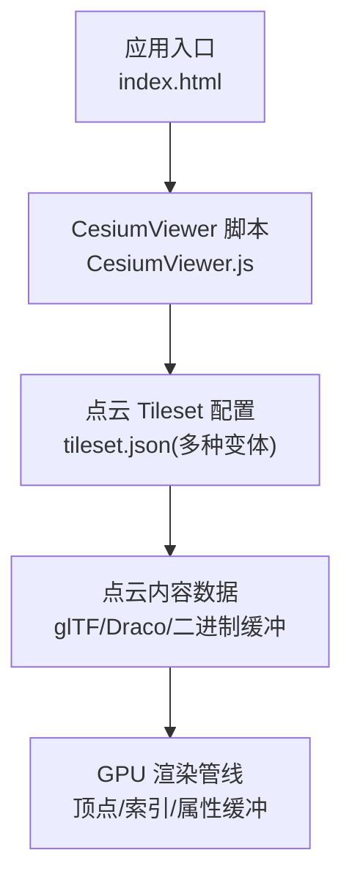
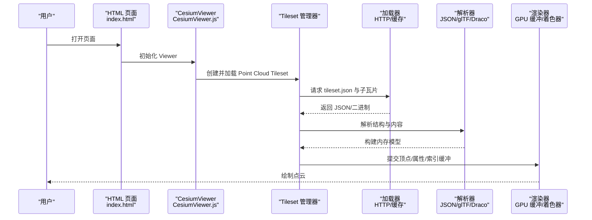
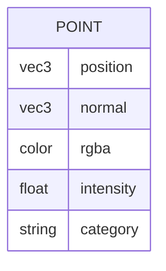
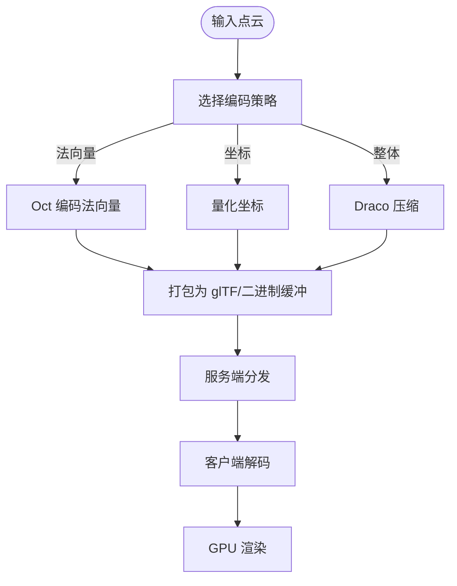
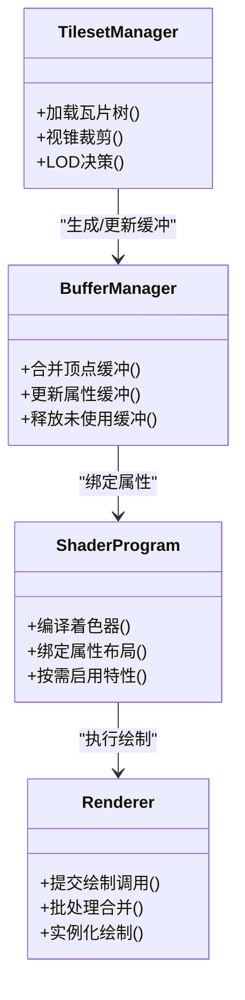
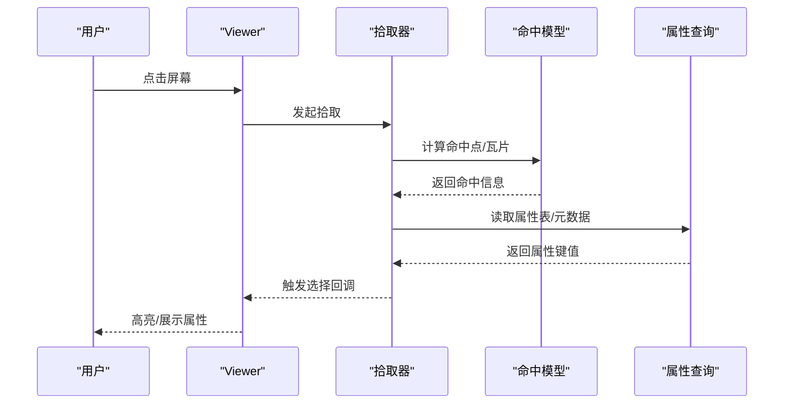
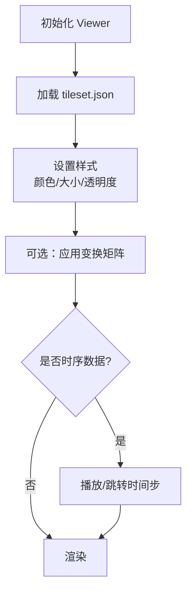
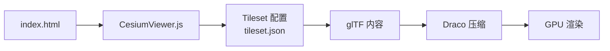

# 点云数据处理

<cite>
**本文引用的文件**   
- [README.md](file://README.md)
- [index.html](file://index.html)
- [Apps/CesiumViewer/CesiumViewer.js](file://Apps/CesiumViewer/CesiumViewer.js)
- [Apps/SampleData/Cesium3DTiles/PointCloud/PointCloudBatched/tileset.json](file://Apps/SampleData/Cesium3DTiles/PointCloud/PointCloudBatched/tileset.json)
- [Apps/SampleData/Cesium3DTiles/PointCloud/PointCloudDraco/tileset.json](file://Apps/SampleData/Cesium3DTiles/PointCloud/PointCloudDraco/tileset.json)
- [Apps/SampleData/Cesium3DTiles/PointCloud/PointCloudNormals/tileset.json](file://Apps/SampleData/Cesium3DTiles/PointCloud/PointCloudNormals/tileset.json)
- [Apps/SampleData/Cesium3DTiles/PointCloud/PointCloudRGB/tileset.json](file://Apps/SampleData/Cesium3DTiles/PointCloud/PointCloudRGB/tileset.json)
- [Apps/SampleData/Cesium3DTiles/PointCloud/PointCloudQuantized/tileset.json](file://Apps/SampleData/Cesium3DTiles/PointCloud/PointCloudQuantized/tileset.json)
- [Apps/SampleData/Cesium3DTiles/PointCloud/PointCloudTimeDynamic/tileset.json](file://Apps/SampleData/Cesium3DTiles/PointCloud/PointCloudTimeDynamic/tileset.json)
- [Apps/SampleData/Cesium3DTiles/PointCloud/PointCloudWithPerPointProperties/tileset.json](file://Apps/SampleData/Cesium3DTiles/PointCloud/PointCloudWithPerPointProperties/tileset.json)
- [Specs/Data/Cesium3DTiles/PointCloud/PointCloudBatched/tileset.json](file://Specs/Data/Cesium3DTiles/PointCloud/PointCloudBatched/tileset.json)
- [Specs/Data/Cesium3DTiles/PointCloud/PointCloudDraco/tileset.json](file://Specs/Data/Cesium3DTiles/PointCloud/PointCloudDraco/tileset.json)
- [Specs/Data/Cesium3DTiles/PointCloud/PointCloudNormalsOctEncoded/tileset.json](file://Specs/Data/Cesium3DTiles/PointCloud/PointCloudNormalsOctEncoded/tileset.json)
- [Specs/Data/Cesium3DTiles/PointCloud/PointCloudQuantizedOctEncoded/tileset.json](file://Specs/Data/Cesium3DTiles/PointCloud/PointCloudQuantizedOctEncoded/tileset.json)
- [Specs/Data/Cesium3DTiles/PointCloud/PointCloudQuantized/tileset.json](file://Specs/Data/Cesium3DTiles/PointCloud/PointCloudQuantized/tileset.json)
- [Specs/Data/Cesium3DTiles/PointCloud/PointCloudRGB/tileset.json](file://Specs/Data/Cesium3DTiles/PointCloud/PointCloudRGB/tileset.json)
- [Specs/Data/Cesium3DTiles/PointCloud/PointCloudRGBA/tileset.json](file://Specs/Data/Cesium3DTiles/PointCloud/PointCloudRGBA/tileset.json)
- [Specs/Data/Cesium3DTiles/PointCloud/PointCloudRGB565/tileset.json](file://Specs/Data/Cesium3DTiles/PointCloud/PointCloudRGB565/tileset.json)
- [Specs/Data/Cesium3DTiles/PointCloud/PointCloudTimeDynamic/tileset.json](file://Specs/Data/Cesium3DTiles/PointCloud/PointCloudTimeDynamic/tileset.json)
- [Specs/Data/Cesium3DTiles/PointCloud/PointCloudWGS84/tileset.json](file://Specs/Data/Cesium3DTiles/PointCloud/PointCloudWGS84/tileset.json)
- [Specs/Data/Cesium3DTiles/PointCloud/PointCloudWithTransform/tileset.json](file://Specs/Data/Cesium3DTiles/PointCloud/PointCloudWithTransform/tileset.json)
- [Specs/Data/Cesium3DTiles/PointCloud/PointCloudWithUnicodePropertyIds/tileset.json](file://Specs/Data/Cesium3DTiles/PointCloud/PointCloudWithUnicodePropertyIds/tileset.json)
- [Specs/Data/Cesium3DTiles/PointCloud/PointCloudNoColor/tileset.json](file://Specs/Data/Cesium3DTiles/PointCloud/PointCloudNoColor/tileset.json)
- [Specs/Data/Cesium3DTiles/PointCloud/PointCloudBatchedJsonOnly/tileset.json](file://Specs/Data/Cesium3DTiles/PointCloud/PointCloudBatchedJsonOnly/tileset.json)
- [Specs/Data/Cesium3DTiles/PointCloud/PointCloudDracoPartial/tileset.json](file://Specs/Data/Cesium3DTiles/PointCloud/PointCloudDracoPartial/tileset.json)
- [Specs/Data/Cesium3DTiles/PointCloud/PointCloudDracoInvalid/tileset.json](file://Specs/Data/Cesium3DTiles/PointCloud/PointCloudDracoInvalid/tileset.json)
- [Specs/Data/Cesium3DTiles/PointCloud/PointCloudTimeDynamicDraco/tileset.json](file://Specs/Data/Cesium3DTiles/PointCloud/PointCloudTimeDynamicDraco/tileset.json)
- [Specs/Data/Cesium3DTiles/PointCloud/PointCloudTimeDynamicWithTransform/tileset.json](file://Specs/Data/Cesium3DTiles/PointCloud/PointCloudTimeDynamicWithTransform/tileset.json)
- [Specs/Data/Cesium3DTiles/PointCloud/PointCloudWithPerPointProperties/tileset.json](file://Specs/Data/Cesium3DTiles/PointCloud/PointCloudWithPerPointProperties/tileset.json)
</cite>

## 目录
1. [简介](#简介)
2. [项目结构](#项目结构)
3. [核心组件](#核心组件)
4. [架构总览](#架构总览)
5. [详细组件分析](#详细组件分析)
6. [依赖关系分析](#依赖关系分析)
7. [性能考虑](#性能考虑)
8. [故障排查指南](#故障排查指南)
9. [结论](#结论)
10. [附录](#附录)

## 简介
本技术文档聚焦于 Cesium 的点云数据处理能力，围绕以下目标展开：
- 点云数据的组织结构与存储格式（坐标、颜色、法向量、属性）
- 压缩编码技术（Oct-encoded normals、量化坐标、Draco 压缩等）
- 批量渲染优化策略（顶点缓冲区管理、着色器优化、GPU 实例化）
- 交互操作（拾取、选择、属性查询）
- 加载示例、样式设置与性能调优指南

Cesium 对点云的支撑主要基于 3D Tiles Point Cloud 规范，结合 glTF 扩展与 Draco 压缩，提供高效的大规模点云可视化与交互。

## 项目结构
仓库中与点云相关的资源主要集中在以下位置：
- 示例应用入口与演示脚本：Apps/CesiumViewer
- 点云样例数据（tileset.json 与内容文件）：Apps/SampleData/Cesium3DTiles/PointCloud
- 测试用例数据（覆盖更多边界场景）：Specs/Data/Cesium3DTiles/PointCloud

图表来源
- [index.html:1-200](file://index.html#L1-L200)
- [Apps/CesiumViewer/CesiumViewer.js:1-200](file://Apps/CesiumViewer/CesiumViewer.js#L1-L200)
- [Apps/SampleData/Cesium3DTiles/PointCloud/PointCloudBatched/tileset.json:1-200](file://Apps/SampleData/Cesium3DTiles/PointCloud/PointCloudBatched/tileset.json#L1-L200)

章节来源
- [README.md:1-200](file://README.md#L1-L200)
- [index.html:1-200](file://index.html#L1-L200)
- [Apps/CesiumViewer/CesiumViewer.js:1-200](file://Apps/CesiumViewer/CesiumViewer.js#L1-L200)

## 核心组件
- 点云 Tileset 描述：通过 tileset.json 声明点云瓦片树、几何误差、包围体、内容引用与元数据。
- 点云内容格式：支持 glTF 点云（POSITION、NORMAL、COLOR_*）、量化坐标、Oct 编码法向量、Draco 压缩。
- 渲染与批处理：按瓦片粒度进行 LOD 与视锥裁剪，合并批次减少 draw call，使用 GPU 实例化提升吞吐。
- 交互与查询：基于屏幕空间拾取与属性表（Batch Table / 结构化元数据）实现点选与属性检索。

章节来源
- [Apps/SampleData/Cesium3DTiles/PointCloud/PointCloudBatched/tileset.json:1-200](file://Apps/SampleData/Cesium3DTiles/PointCloud/PointCloudBatched/tileset.json#L1-L200)
- [Specs/Data/Cesium3DTiles/PointCloud/PointCloudBatched/tileset.json:1-200](file://Specs/Data/Cesium3DTiles/PointCloud/PointCloudBatched/tileset.json#L1-L200)

## 架构总览
下图展示了从页面到渲染的关键路径，以及点云数据在瓦片层级的组织方式。

图表来源
- [index.html:1-200](file://index.html#L1-L200)
- [Apps/CesiumViewer/CesiumViewer.js:1-200](file://Apps/CesiumViewer/CesiumViewer.js#L1-L200)
- [Apps/SampleData/Cesium3DTiles/PointCloud/PointCloudBatched/tileset.json:1-200](file://Apps/SampleData/Cesium3DTiles/PointCloud/PointCloudBatched/tileset.json#L1-L200)

## 详细组件分析

### 点云数据结构与存储格式
- 坐标（POSITION）
  - 支持浮点坐标；为减小体积可使用“量化坐标”（quantized coordinates），将坐标映射到整数网格以降低精度换取体积。
- 颜色（COLOR_0、COLOR_RGBA、COLOR_RGB565 等）
  - 支持 RGBA 或 RGB565 等紧凑格式；若无颜色信息则仅显示单色点。
- 法向量（NORMAL）
  - 支持原始法向量与 Oct 编码法向量（Oct-encoded normals），后者以较小位宽表示方向，适合大规模点云。
- 每点属性（Per-point Properties）
  - 通过 Batch Table 或结构化元数据定义，可附加任意标量/向量/字符串属性，用于查询与样式驱动。

章节来源
- [Specs/Data/Cesium3DTiles/PointCloud/PointCloudRGB/tileset.json:1-200](file://Specs/Data/Cesium3DTiles/PointCloud/PointCloudRGB/tileset.json#L1-L200)
- [Specs/Data/Cesium3DTiles/PointCloud/PointCloudRGBA/tileset.json:1-200](file://Specs/Data/Cesium3DTiles/PointCloud/PointCloudRGBA/tileset.json#L1-L200)
- [Specs/Data/Cesium3DTiles/PointCloud/PointCloudRGB565/tileset.json:1-200](file://Specs/Data/Cesium3DTiles/PointCloud/PointCloudRGB565/tileset.json#L1-L200)
- [Specs/Data/Cesium3DTiles/PointCloud/PointCloudNoColor/tileset.json:1-200](file://Specs/Data/Cesium3DTiles/PointCloud/PointCloudNoColor/tileset.json#L1-L200)
- [Specs/Data/Cesium3DTiles/PointCloud/PointCloudNormalsOctEncoded/tileset.json:1-200](file://Specs/Data/Cesium3DTiles/PointCloud/PointCloudNormalsOctEncoded/tileset.json#L1-L200)
- [Specs/Data/Cesium3DTiles/PointCloud/PointCloudQuantizedOctEncoded/tileset.json:1-200](file://Specs/Data/Cesium3DTiles/PointCloud/PointCloudQuantizedOctEncoded/tileset.json#L1-L200)
- [Specs/Data/Cesium3DTiles/PointCloud/PointCloudQuantized/tileset.json:1-200](file://Specs/Data/Cesium3DTiles/PointCloud/PointCloudQuantized/tileset.json#L1-L200)
- [Specs/Data/Cesium3DTiles/PointCloud/PointCloudWithPerPointProperties/tileset.json:1-200](file://Specs/Data/Cesium3DTiles/PointCloud/PointCloudWithPerPointProperties/tileset.json#L1-L200)

### 压缩与编码技术
- Oct 编码法向量
  - 用较少位数表达单位球面上的方向，显著降低法向量带宽与显存占用。
- 量化坐标
  - 将连续坐标离散化到固定网格，减少坐标字段大小，适合大范围地形级点云。
- Draco 压缩
  - 对几何与属性进行通用压缩，进一步减小网络传输与磁盘占用；支持部分解压与错误容错。

图表来源
- [Specs/Data/Cesium3DTiles/PointCloud/PointCloudNormalsOctEncoded/tileset.json:1-200](file://Specs/Data/Cesium3DTiles/PointCloud/PointCloudNormalsOctEncoded/tileset.json#L1-L200)
- [Specs/Data/Cesium3DTiles/PointCloud/PointCloudQuantizedOctEncoded/tileset.json:1-200](file://Specs/Data/Cesium3DTiles/PointCloud/PointCloudQuantizedOctEncoded/tileset.json#L1-L200)
- [Specs/Data/Cesium3DTiles/PointCloud/PointCloudQuantized/tileset.json:1-200](file://Specs/Data/Cesium3DTiles/PointCloud/PointCloudQuantized/tileset.json#L1-L200)
- [Specs/Data/Cesium3DTiles/PointCloud/PointCloudDraco/tileset.json:1-200](file://Specs/Data/Cesium3DTiles/PointCloud/PointCloudDraco/tileset.json#L1-L200)
- [Specs/Data/Cesium3DTiles/PointCloud/PointCloudDracoPartial/tileset.json:1-200](file://Specs/Data/Cesium3DTiles/PointCloud/PointCloudDracoPartial/tileset.json#L1-L200)
- [Specs/Data/Cesium3DTiles/PointCloud/PointCloudDracoInvalid/tileset.json:1-200](file://Specs/Data/Cesium3DTiles/PointCloud/PointCloudDracoInvalid/tileset.json#L1-L200)

章节来源
- [Specs/Data/Cesium3DTiles/PointCloud/PointCloudDraco/tileset.json:1-200](file://Specs/Data/Cesium3DTiles/PointCloud/PointCloudDraco/tileset.json#L1-L200)
- [Specs/Data/Cesium3DTiles/PointCloud/PointCloudDracoPartial/tileset.json:1-200](file://Specs/Data/Cesium3DTiles/PointCloud/PointCloudDracoPartial/tileset.json#L1-L200)
- [Specs/Data/Cesium3DTiles/PointCloud/PointCloudDracoInvalid/tileset.json:1-200](file://Specs/Data/Cesium3DTiles/PointCloud/PointCloudDracoInvalid/tileset.json#L1-L200)

### 批量渲染与优化策略
- 瓦片级 LOD 与视锥裁剪
  - 依据几何误差与距离动态加载/卸载瓦片，减少无效绘制。
- 顶点缓冲区管理
  - 将多个瓦片/批次的顶点与属性合并，减少缓冲更新频率与 CPU-GPU 同步开销。
- 着色器优化
  - 针对点云特性简化光照计算，按需启用法向量与颜色插值，避免多余分支。
- GPU 实例化
  - 对重复图元（如点精灵）采用实例化绘制，降低 draw call 数量。

图表来源
- [Apps/SampleData/Cesium3DTiles/PointCloud/PointCloudBatched/tileset.json:1-200](file://Apps/SampleData/Cesium3DTiles/PointCloud/PointCloudBatched/tileset.json#L1-L200)
- [Specs/Data/Cesium3DTiles/PointCloud/PointCloudBatched/tileset.json:1-200](file://Specs/Data/Cesium3DTiles/PointCloud/PointCloudBatched/tileset.json#L1-L200)

章节来源
- [Apps/SampleData/Cesium3DTiles/PointCloud/PointCloudBatched/tileset.json:1-200](file://Apps/SampleData/Cesium3DTiles/PointCloud/PointCloudBatched/tileset.json#L1-L200)
- [Specs/Data/Cesium3DTiles/PointCloud/PointCloudBatched/tileset.json:1-200](file://Specs/Data/Cesium3DTiles/PointCloud/PointCloudBatched/tileset.json#L1-L200)

### 交互操作：拾取、选择与属性查询
- 屏幕空间拾取
  - 根据鼠标位置反投影至三维空间，定位最近点或命中区域。
- 选择与高亮
  - 基于命中结果更新选中状态，并在下一帧中通过颜色或尺寸变化反馈。
- 属性查询
  - 通过 Batch Table 或结构化元数据读取点的属性（如类别、强度、时间戳），用于弹窗或过滤。

章节来源
- [Specs/Data/Cesium3DTiles/PointCloud/PointCloudWithPerPointProperties/tileset.json:1-200](file://Specs/Data/Cesium3DTiles/PointCloud/PointCloudWithPerPointProperties/tileset.json#L1-L200)
- [Specs/Data/Cesium3DTiles/PointCloud/PointCloudWithUnicodePropertyIds/tileset.json:1-200](file://Specs/Data/Cesium3DTiles/PointCloud/PointCloudWithUnicodePropertyIds/tileset.json#L1-L200)

### 加载示例与样式设置
- 加载示例
  - 在页面中初始化 Viewer，并通过 tileset.json 加载点云瓦片集。
- 样式设置
  - 支持常量颜色、逐点颜色、基于属性的着色（如强度映射、分类着色）。
- 变换与时序
  - 支持点云整体变换（平移/旋转/缩放）与时间动态数据（多时相切换）。

图表来源
- [Apps/CesiumViewer/CesiumViewer.js:1-200](file://Apps/CesiumViewer/CesiumViewer.js#L1-L200)
- [Apps/SampleData/Cesium3DTiles/PointCloud/PointCloudBatched/tileset.json:1-200](file://Apps/SampleData/Cesium3DTiles/PointCloud/PointCloudBatched/tileset.json#L1-L200)
- [Apps/SampleData/Cesium3DTiles/PointCloud/PointCloudTimeDynamic/tileset.json:1-200](file://Apps/SampleData/Cesium3DTiles/PointCloud/PointCloudTimeDynamic/tileset.json#L1-L200)
- [Specs/Data/Cesium3DTiles/PointCloud/PointCloudTimeDynamic/tileset.json:1-200](file://Specs/Data/Cesium3DTiles/PointCloud/PointCloudTimeDynamic/tileset.json#L1-L200)
- [Specs/Data/Cesium3DTiles/PointCloud/PointCloudTimeDynamicDraco/tileset.json:1-200](file://Specs/Data/Cesium3DTiles/PointCloud/PointCloudTimeDynamicDraco/tileset.json#L1-L200)
- [Specs/Data/Cesium3DTiles/PointCloud/PointCloudTimeDynamicWithTransform/tileset.json:1-200](file://Specs/Data/Cesium3DTiles/PointCloud/PointCloudTimeDynamicWithTransform/tileset.json#L1-L200)
- [Specs/Data/Cesium3DTiles/PointCloud/PointCloudWithTransform/tileset.json:1-200](file://Specs/Data/Cesium3DTiles/PointCloud/PointCloudWithTransform/tileset.json#L1-L200)

章节来源
- [index.html:1-200](file://index.html#L1-L200)
- [Apps/CesiumViewer/CesiumViewer.js:1-200](file://Apps/CesiumViewer/CesiumViewer.js#L1-L200)
- [Apps/SampleData/Cesium3DTiles/PointCloud/PointCloudBatched/tileset.json:1-200](file://Apps/SampleData/Cesium3DTiles/PointCloud/PointCloudBatched/tileset.json#L1-L200)
- [Apps/SampleData/Cesium3DTiles/PointCloud/PointCloudRGB/tileset.json:1-200](file://Apps/SampleData/Cesium3DTiles/PointCloud/PointCloudRGB/tileset.json#L1-L200)
- [Apps/SampleData/Cesium3DTiles/PointCloud/PointCloudDraco/tileset.json:1-200](file://Apps/SampleData/Cesium3DTiles/PointCloud/PointCloudDraco/tileset.json#L1-L200)
- [Apps/SampleData/Cesium3DTiles/PointCloud/PointCloudNormals/tileset.json:1-200](file://Apps/SampleData/Cesium3DTiles/PointCloud/PointCloudNormals/tileset.json#L1-L200)
- [Apps/SampleData/Cesium3DTiles/PointCloud/PointCloudQuantized/tileset.json:1-200](file://Apps/SampleData/Cesium3DTiles/PointCloud/PointCloudQuantized/tileset.json#L1-L200)
- [Apps/SampleData/Cesium3DTiles/PointCloud/PointCloudTimeDynamic/tileset.json:1-200](file://Apps/SampleData/Cesium3DTiles/PointCloud/PointCloudTimeDynamic/tileset.json#L1-L200)
- [Apps/SampleData/Cesium3DTiles/PointCloud/PointCloudWithPerPointProperties/tileset.json:1-200](file://Apps/SampleData/Cesium3DTiles/PointCloud/PointCloudWithPerPointProperties/tileset.json#L1-L200)

## 依赖关系分析
- 外部依赖
  - 3D Tiles Point Cloud 规范：定义瓦片树、几何误差、包围体、内容引用。
  - glTF 扩展：定义 POSITION/NORMAL/COLOR_* 等语义与 Draco 压缩。
- 内部依赖
  - 页面入口与 Viewer 初始化
  - Tileset 管理与瓦片调度
  - 解析器（JSON/glTF/Draco）
  - 渲染器（缓冲与着色器）

图表来源
- [index.html:1-200](file://index.html#L1-L200)
- [Apps/CesiumViewer/CesiumViewer.js:1-200](file://Apps/CesiumViewer/CesiumViewer.js#L1-L200)
- [Apps/SampleData/Cesium3DTiles/PointCloud/PointCloudBatched/tileset.json:1-200](file://Apps/SampleData/Cesium3DTiles/PointCloud/PointCloudBatched/tileset.json#L1-L200)

章节来源
- [README.md:1-200](file://README.md#L1-L200)
- [index.html:1-200](file://index.html#L1-L200)
- [Apps/CesiumViewer/CesiumViewer.js:1-200](file://Apps/CesiumViewer/CesiumViewer.js#L1-L200)

## 性能考虑
- 合理选择压缩与编码
  - 优先使用 Oct 编码法向量与量化坐标，必要时叠加 Draco 压缩，平衡质量与体积。
- 瓦片粒度与几何误差
  - 调整几何误差阈值，控制远距低精度的瓦片加载，减少峰值内存与带宽。
- 批处理与实例化
  - 合并批次、减少 draw call；对点精灵使用实例化绘制。
- 属性与着色复杂度
  - 避免在着色器中进行昂贵分支；按需启用法向量与颜色通道。
- 时序数据
  - 预取与缓存关键时相，避免频繁解码与重建缓冲。

[本节为通用指导，不直接分析具体文件]

## 故障排查指南
- Draco 相关
  - 检查 Draco 模块是否正确加载与初始化；关注部分解压失败与无效数据路径。
- 颜色与法向量缺失
  - 确认 tileset.json 中内容引用与 glTF 语义一致；无颜色时使用默认单色。
- 坐标系统
  - WGS84 与局部坐标系需正确声明，避免位置偏移。
- 属性查询异常
  - 校验属性 ID（含 Unicode）与类型定义；确保 Batch Table 或结构化元数据完整。

章节来源
- [Specs/Data/Cesium3DTiles/PointCloud/PointCloudDracoInvalid/tileset.json:1-200](file://Specs/Data/Cesium3DTiles/PointCloud/PointCloudDracoInvalid/tileset.json#L1-L200)
- [Specs/Data/Cesium3DTiles/PointCloud/PointCloudDracoPartial/tileset.json:1-200](file://Specs/Data/Cesium3DTiles/PointCloud/PointCloudDracoPartial/tileset.json#L1-L200)
- [Specs/Data/Cesium3DTiles/PointCloud/PointCloudNoColor/tileset.json:1-200](file://Specs/Data/Cesium3DTiles/PointCloud/PointCloudNoColor/tileset.json#L1-L200)
- [Specs/Data/Cesium3DTiles/PointCloud/PointCloudWGS84/tileset.json:1-200](file://Specs/Data/Cesium3DTiles/PointCloud/PointCloudWGS84/tileset.json#L1-L200)
- [Specs/Data/Cesium3DTiles/PointCloud/PointCloudWithUnicodePropertyIds/tileset.json:1-200](file://Specs/Data/Cesium3DTiles/PointCloud/PointCloudWithUnicodePropertyIds/tileset.json#L1-L200)

## 结论
Cesium 的点云处理能力建立在 3D Tiles Point Cloud 与 glTF 生态之上，通过 Oct 编码、量化坐标与 Draco 压缩等技术，在保证视觉质量的同时显著降低体积与带宽。配合瓦片级 LOD、批处理与实例化渲染，可实现大规模点云的高效可视化与交互。建议在生产环境中结合业务需求选择合适的编码与压缩组合，并持续监控瓦片调度与 GPU 负载，以获得最佳性能体验。

[本节为总结性内容，不直接分析具体文件]

## 附录
- 参考样例与测试数据
  - 应用样例：Apps/SampleData/Cesium3DTiles/PointCloud/*
  - 测试数据：Specs/Data/Cesium3DTiles/PointCloud/*
- 常见 tileset.json 关键字段
  - 几何误差、包围体、内容引用、元数据、变换与时序信息

章节来源
- [Apps/SampleData/Cesium3DTiles/PointCloud/PointCloudBatched/tileset.json:1-200](file://Apps/SampleData/Cesium3DTiles/PointCloud/PointCloudBatched/tileset.json#L1-L200)
- [Specs/Data/Cesium3DTiles/PointCloud/PointCloudBatched/tileset.json:1-200](file://Specs/Data/Cesium3DTiles/PointCloud/PointCloudBatched/tileset.json#L1-L200)
- [Specs/Data/Cesium3DTiles/PointCloud/PointCloudBatchedJsonOnly/tileset.json:1-200](file://Specs/Data/Cesium3DTiles/PointCloud/PointCloudBatchedJsonOnly/tileset.json#L1-L200)