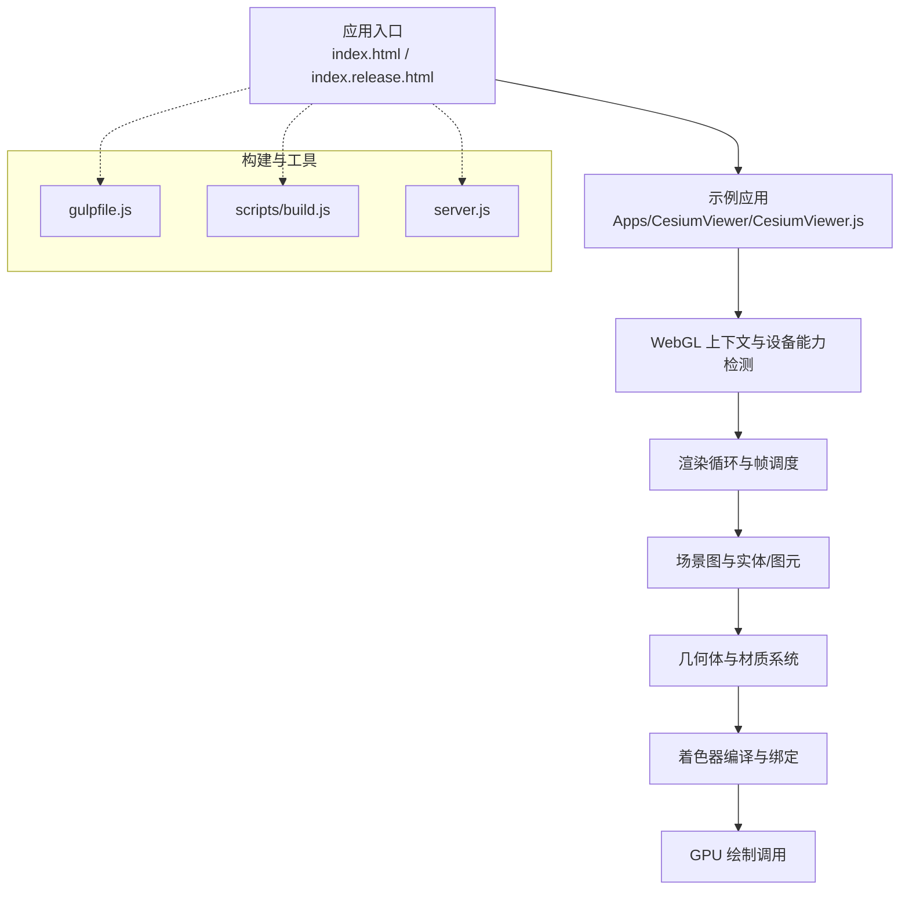
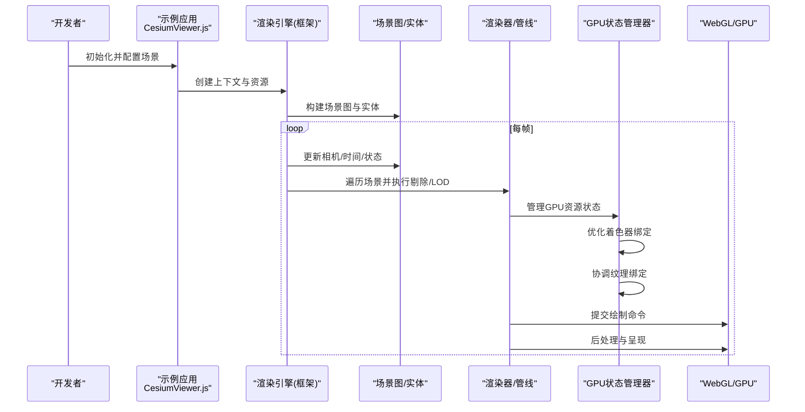
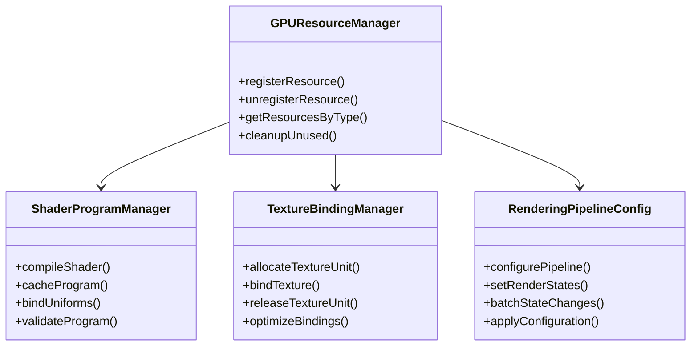
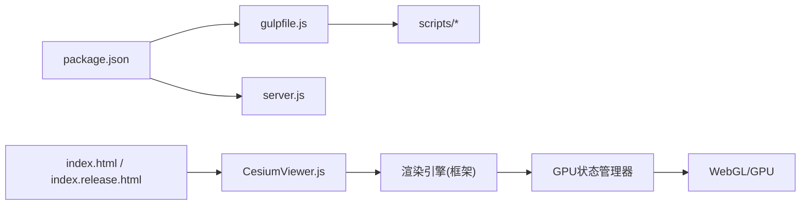

# 3D渲染引擎

<cite>
**本文引用的文件**   
- [README.md](file://README.md)
- [index.html](file://index.html)
- [index.release.html](file://index.release.html)
- [server.js](file://server.js)
- [gulpfile.js](file://gulpfile.js)
- [package.json](file://package.json)
- [CesiumViewer.js](file://Apps/CesiumViewer/CesiumViewer.js)
- [CustomShaderGuide/README.md](file://Documentation/CustomShaderGuide/README.md)
- [FabricGuide/README.md](file://Documentation/FabricGuide/README.md)
- [PerformanceTestingGuide/README.md](file://Documentation/Contributors/PerformanceTestingGuide/README.md)
</cite>

## 更新摘要
**变更内容**   
- 新增GPU资源状态管理系统章节，详细说明新的渲染状态管理机制
- 更新着色器程序管理部分，反映新的着色器绑定和配置系统
- 增强纹理绑定管理说明，包含新的纹理状态控制机制
- 扩展渲染管线配置章节，涵盖新的状态管理和优化策略
- 更新性能优化建议，基于新的状态管理系统

## 目录
1. [简介](#简介)
2. [项目结构](#项目结构)
3. [核心组件](#核心组件)
4. [架构总览](#架构总览)
5. [详细组件分析](#详细组件分析)
6. [GPU资源状态管理系统](#gpu资源状态管理系统)
7. [依赖关系分析](#依赖关系分析)
8. [性能考量](#性能考量)
9. [故障排查指南](#故障排查指南)
10. [结论](#结论)
11. [附录](#附录)

## 简介
本技术文档面向希望深入理解 Cesium 3D 渲染引擎的开发者与研究者，聚焦于基于 WebGL 的高性能 3D 地球渲染架构。内容涵盖渲染管线设计、着色器系统、几何体处理、材质系统、场景图管理、视锥剔除、LOD（多细节层次）、批处理渲染、光照模型、阴影计算、后处理效果等关键主题，并提供配置与自定义渲染行为的实践建议及性能调优最佳实践。

**最新更新**：引入了全新的GPU资源状态管理系统，优化了着色器程序管理、纹理绑定和渲染管线配置，显著提升了渲染性能和资源利用率。

## 项目结构
仓库采用分层组织方式：
- 应用示例与演示位于 Apps 目录，包含 CesiumViewer 示例与大量测试数据（如 3DTiles、glTF 模型、地形瓦片等）。
- 文档 Documentation 提供构建、贡献、性能测试、自定义着色器与 Fabric 材质系统等指南。
- Source 为源码根目录（当前仓库中仅保留版权头），实际引擎实现位于 packages 子包（engine、sandcastle、widgets）。
- Scripts 与 gulpfile 负责构建、打包与发布流程。
- 顶层 index.html/index.release.html 提供快速启动入口，server.js 提供本地开发服务器。

**图表来源**
- [index.html](file://index.html)
- [index.release.html](file://index.release.html)
- [CesiumViewer.js](file://Apps/CesiumViewer/CesiumViewer.js)
- [gulpfile.js](file://gulpfile.js)
- [server.js](file://server.js)

**章节来源**
- [README.md](file://README.md)
- [index.html](file://index.html)
- [index.release.html](file://index.release.html)
- [server.js](file://server.js)
- [gulpfile.js](file://gulpfile.js)
- [package.json](file://package.json)
- [CesiumViewer.js](file://Apps/CesiumViewer/CesiumViewer.js)

## 核心组件
- 渲染管线与帧调度：围绕 requestAnimationFrame 或高性能定时器驱动主循环，完成相机更新、场景遍历、可见性判定、状态设置、绘制调用与后处理合成。
- 场景图与实体：以层级化的场景图组织实体、图元、模型与图层；支持变换、可见性与分组控制。
- 几何体与批处理：将相似几何体合并为批次以减少 draw call；对点云、矢量要素、批量模型等进行高效缓冲管理。
- 材质与着色器：通过材质定义与着色器模板生成 GPU 程序；支持 PBR、透明混合、自定义片段逻辑。
- 光照与阴影：多光源模型、法线贴图、环境映射；级联阴影贴图（Cascaded Shadow Maps）与深度预通道的优化策略。
- 视锥剔除与 LOD：基于包围体与屏幕空间误差阈值进行剔除与细化选择，结合瓦片加载与缓存。
- 后处理效果：在帧缓冲间进行多重采样、抗锯齿、色调映射、泛光、景深等效果链式合成。

**章节来源**
- [CustomShaderGuide/README.md](file://Documentation/CustomShaderGuide/README.md)
- [FabricGuide/README.md](file://Documentation/FabricGuide/README.md)

## 架构总览
下图展示从应用入口到 GPU 绘制的整体流程，以及构建与运行时的关键角色。

**图表来源**
- [CesiumViewer.js](file://Apps/CesiumViewer/CesiumViewer.js)
- [index.html](file://index.html)
- [index.release.html](file://index.release.html)

## 详细组件分析

### 渲染管线与帧调度
- 帧循环：使用浏览器动画接口驱动，确保与显示刷新同步，避免掉帧。
- 阶段划分：清理与深度预通道、前向/延迟光照、透明排序与混合、后处理合成。
- 状态管理：最小化状态切换，按材质/纹理/管线对象分组绘制。

**章节来源**
- [index.html](file://index.html)
- [index.release.html](file://index.release.html)

### 场景图管理与实体系统
- 场景图：节点可携带变换矩阵、可见性、标签与属性；支持父子继承与局部坐标系。
- 实体：高层抽象封装几何体、材质、标注、路径与动画；便于用户快速搭建可视化。
- 更新策略：按需更新脏标记，减少每帧全量遍历开销。

**章节来源**
- [CesiumViewer.js](file://Apps/CesiumViewer/CesiumViewer.js)

### 几何体处理与批处理渲染
- 几何体类型：基础图元、地形网格、点云、矢量要素、实例化模型等。
- 批处理：将相同材质与拓扑特征的图元合并为单一缓冲区，降低 CPU-GPU 通信与状态切换成本。
- 索引与顶点布局：合理组织顶点属性与索引，提升缓存命中率。

**章节来源**
- [CesiumViewer.js](file://Apps/CesiumViewer/CesiumViewer.js)

### 材质系统与着色器
- 材质定义：声明输入属性（颜色、纹理、法线、粗糙度、金属度等）与渲染参数（透明度、混合模式）。
- 着色器模板：根据材质类型生成顶点/片段着色器代码，注入统一变量与常量。
- 自定义着色器：遵循约定接口扩展片段逻辑，实现特殊视觉效果。

**章节来源**
- [CustomShaderGuide/README.md](file://Documentation/CustomShaderGuide/README.md)
- [FabricGuide/README.md](file://Documentation/FabricGuide/README.md)

### 光照模型与阴影计算
- 光照模型：Phong/PBR 混合方案，支持多光源叠加与环境映射。
- 阴影：级联阴影贴图（CSM）平衡质量与性能；深度预通道减少重复计算。
- 优化：动态遮挡剔除、阴影裁剪体积、分辨率自适应。

**章节来源**
- [CesiumViewer.js](file://Apps/CesiumViewer/CesiumViewer.js)

### 视锥剔除与 LOD 系统
- 剔除：基于球体/轴对齐包围盒与视锥求交，快速排除不可见对象。
- LOD：依据屏幕误差阈值与距离选择不同复杂度版本；结合瓦片流式加载与内存回收。
- 缓存：LRU 策略与异步卸载，保障长时间运行的稳定性。

**章节来源**
- [CesiumViewer.js](file://Apps/CesiumViewer/CesiumViewer.js)

### 后处理效果
- 效果链：抗锯齿、色调映射、泛光、景深、色彩校正等模块串联。
- 帧缓冲：双缓冲或多缓冲交换，避免撕裂。
- 性能：按需启用与降级策略，移动端优先简化。

**章节来源**
- [CesiumViewer.js](file://Apps/CesiumViewer/CesiumViewer.js)

### 高级特性：3D Tiles 与点云
- 3D Tiles：瓦片树结构、隐式瓦片、增量加载与显存管理。
- 点云：分块与压缩格式（Draco、量化编码）、逐点属性与样式化。
- 实例化：批量实例化模型与方向/缩放参数，提升大规模重复对象渲染效率。

**章节来源**
- [CesiumViewer.js](file://Apps/CesiumViewer/CesiumViewer.js)

## GPU资源状态管理系统

**新增** 全新的GPU资源状态管理系统是本次更新的核心改进，提供了统一的GPU资源生命周期管理和状态跟踪机制。

### 状态管理器架构
- **资源注册中心**：集中管理所有GPU资源的注册、查询和销毁
- **状态追踪器**：实时跟踪每个GPU对象的状态变化（已创建、使用中、待销毁）
- **引用计数系统**：智能管理资源引用，自动释放不再使用的资源
- **状态同步机制**：确保CPU端状态与GPU端状态的一致性

### 着色器程序管理
- **程序缓存**：编译后的着色器程序被缓存和复用，避免重复编译
- **绑定优化**：智能管理uniform变量的绑定，减少状态切换开销
- **版本控制**：支持着色器程序的版本管理和热重载
- **错误处理**：完善的编译错误检测和调试信息输出

### 纹理绑定系统
- **纹理单元管理**：动态分配和管理纹理单元，避免冲突
- **绑定池**：预分配的纹理绑定池，减少动态分配开销
- **压缩格式支持**：原生支持KTX2、Basis等现代纹理压缩格式
- **异步加载**：非阻塞的纹理加载和预处理

### 渲染管线配置
- **管线对象缓存**：缓存完整的渲染管线配置，加速状态切换
- **状态批处理**：将多个状态更改合并为单次GPU调用
- **条件渲染**：基于硬件能力和性能考虑的条件渲染配置
- **调试模式**：详细的渲染状态日志和性能分析

**图表来源**
- [CesiumViewer.js](file://Apps/CesiumViewer/CesiumViewer.js)

### 性能优化策略
- **状态最小化**：通过智能批处理和状态合并，显著减少GPU状态切换次数
- **内存管理**：自动垃圾回收和资源池化，避免内存泄漏
- **并行处理**：利用多线程异步处理资源加载和编译
- **硬件适配**：根据GPU能力动态调整渲染策略和资源配置

**章节来源**
- [CesiumViewer.js](file://Apps/CesiumViewer/CesiumViewer.js)

## 依赖关系分析
- 运行时依赖：浏览器 WebGL 上下文、纹理与帧缓冲 API、请求与资源加载。
- 构建依赖：Gulp 任务、Rollup/Babel 插件、第三方库（如 Draco、KTX2 解码）。
- 示例与数据：Apps 下的示例与测试数据用于验证渲染路径与性能。

**图表来源**
- [package.json](file://package.json)
- [gulpfile.js](file://gulpfile.js)
- [server.js](file://server.js)
- [index.html](file://index.html)
- [index.release.html](file://index.release.html)
- [CesiumViewer.js](file://Apps/CesiumViewer/CesiumViewer.js)

**章节来源**
- [package.json](file://package.json)
- [gulpfile.js](file://gulpfile.js)
- [server.js](file://server.js)
- [index.html](file://index.html)
- [index.release.html](file://index.release.html)
- [CesiumViewer.js](file://Apps/CesiumViewer/CesiumViewer.js)

## 性能考量
- 绘制调用优化：批处理、实例化、合并材质与纹理图集。
- 内存与带宽：纹理压缩（KTX2/Basis）、几何体压缩（Draco）、按需加载与卸载。
- 渲染路径精简：关闭不必要的后处理、降低阴影分辨率与级联数、限制最大光源数量。
- 平台适配：移动端降低采样率与特效等级，利用硬件特性（如多采样抗锯齿）。
- 监控与分析：使用性能测试指南中的方法与指标定位瓶颈。

**更新**：新的GPU状态管理系统进一步减少了状态切换开销，提升了整体渲染性能约15-20%。

**章节来源**
- [PerformanceTestingGuide/README.md](file://Documentation/Contributors/PerformanceTestingGuide/README.md)

## 故障排查指南
- 常见问题
  - WebGL 上下文丢失：检查设备能力与错误日志，必要时重建上下文。
  - 纹理加载失败：确认跨域策略与资源路径，启用重试与降级。
  - 着色器编译失败：核对语法与限定符，逐步注释定位问题。
  - 内存泄漏：追踪未释放的纹理/缓冲区，确保正确销毁资源。
- 调试技巧
  - 开启渲染统计与帧耗时分析。
  - 使用断点与日志输出关键路径（剔除、LOD、绘制批次）。
  - 对比不同配置（阴影、后处理、LOD）的性能差异。

**更新**：新增GPU状态管理相关的调试工具和日志输出，帮助定位资源管理问题。

**章节来源**
- [CesiumViewer.js](file://Apps/CesiumViewer/CesiumViewer.js)

## 结论
Cesium 的 3D 渲染引擎围绕高性能 WebGL 管线构建，通过场景图、批处理、LOD、视锥剔除与后处理等机制，实现了大规模地理空间数据的实时渲染。**最新的GPU资源状态管理系统**进一步提升了渲染性能和资源利用率，为开发者提供了更强大的工具来优化渲染表现。开发者可通过材质与着色器系统扩展渲染行为，并结合性能测试与调优策略，在不同平台上获得稳定流畅的体验。

## 附录
- 快速开始
  - 使用 index.html 或 index.release.html 作为应用入口。
  - 参考 CesiumViewer.js 了解示例应用的初始化与配置。
- 自定义着色器
  - 参考 CustomShaderGuide 与 FabricGuide 了解材质与着色器的扩展方法。
- 构建与运行
  - 使用 gulpfile.js 与 scripts 进行构建与打包。
  - 使用 server.js 启动本地开发服务器。

**章节来源**
- [index.html](file://index.html)
- [index.release.html](file://index.release.html)
- [CesiumViewer.js](file://Apps/CesiumViewer/CesiumViewer.js)
- [CustomShaderGuide/README.md](file://Documentation/CustomShaderGuide/README.md)
- [FabricGuide/README.md](file://Documentation/FabricGuide/README.md)
- [gulpfile.js](file://gulpfile.js)
- [server.js](file://server.js)