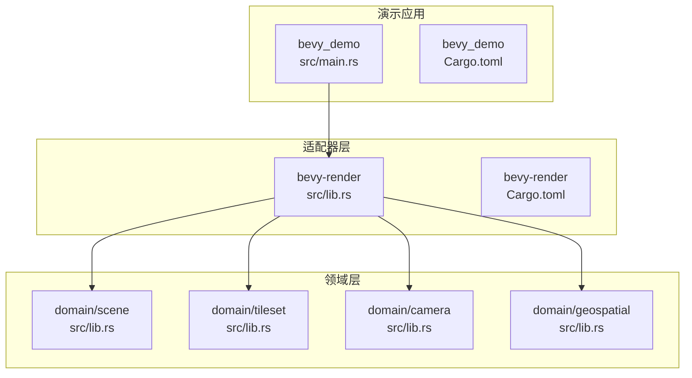
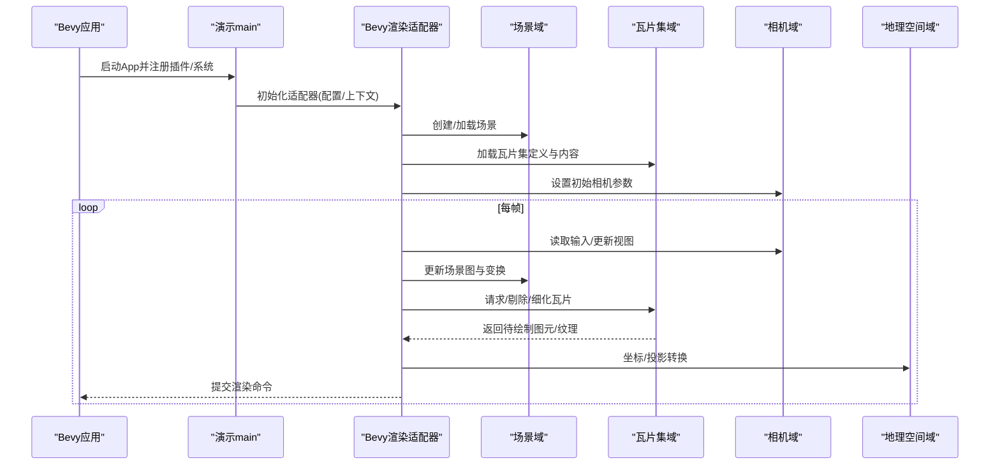
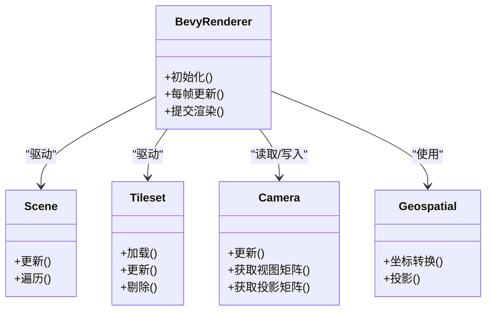
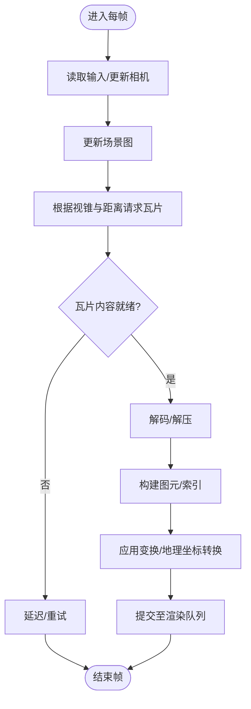
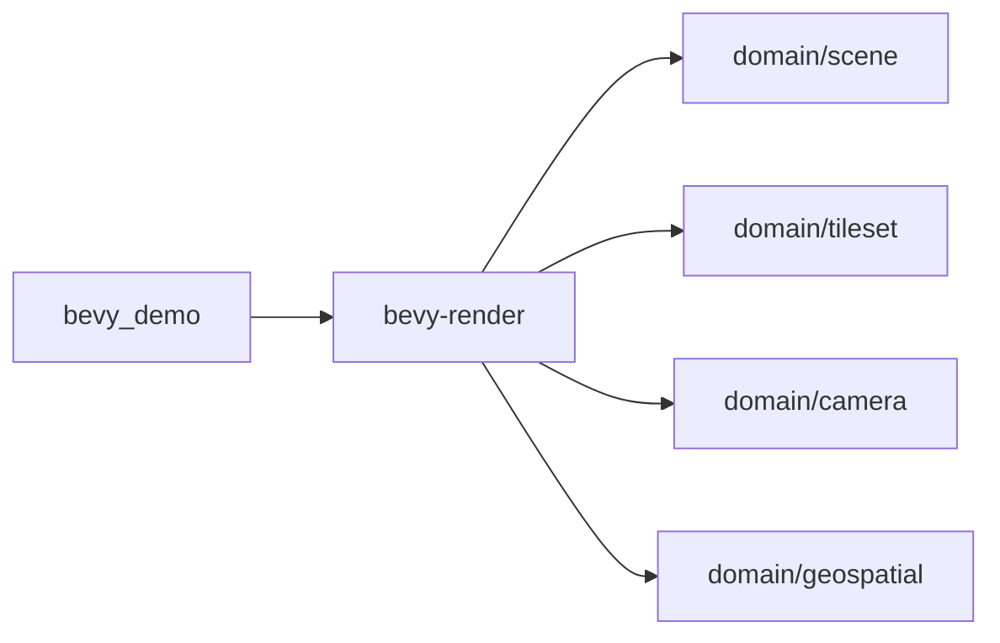

# Bevy渲染适配器

<cite>
**本文引用的文件**   
- [cesiumrust/adapters/bevy-render/src/lib.rs](file://cesiumrust/adapters/bevy-render/src/lib.rs)
- [cesiumrust/adapters/bevy-render/Cargo.toml](file://cesiumrust/adapters/bevy-render/Cargo.toml)
- [cesiumrust/crates/bevy_demo/src/main.rs](file://cesiumrust/crates/bevy_demo/src/main.rs)
- [cesiumrust/crates/bevy_demo/Cargo.toml](file://cesiumrust/crates/bevy_demo/Cargo.toml)
- [cesiumrust/domain/scene/src/lib.rs](file://cesiumrust/domain/scene/src/lib.rs)
- [cesiumrust/domain/tileset/src/lib.rs](file://cesiumrust/domain/tileset/src/lib.rs)
- [cesiumrust/domain/camera/src/lib.rs](file://cesiumrust/domain/camera/src/lib.rs)
- [cesiumrust/domain/geospatial/src/lib.rs](file://cesiumrust/domain/geospatial/src/lib.rs)
</cite>

## 目录
1. [简介](#简介)
2. [项目结构](#项目结构)
3. [核心组件](#核心组件)
4. [架构总览](#架构总览)
5. [详细组件分析](#详细组件分析)
6. [依赖关系分析](#依赖关系分析)
7. [性能考量](#性能考量)
8. [故障排查指南](#故障排查指南)
9. [结论](#结论)
10. [附录](#附录)

## 简介
本文件聚焦于 Cesium Rust 仓库中的 Bevy 渲染适配器，旨在帮助开发者理解如何将 Cesium 的领域能力（场景、瓦片集、相机、地理空间等）与 Bevy 渲染管线集成。文档从系统架构、组件职责、数据流、处理逻辑、集成点、错误处理与性能特性等维度进行系统化说明，并提供可视化图示与可操作的排障建议。

## 项目结构
Bevy 渲染适配器位于 cesiumrust/adapters/bevy-render 目录下，主要提供将 Cesium 领域模型映射到 Bevy 实体与系统的适配层；bevy_demo 示例展示了如何在 Bevy App 中注册并运行该适配器。

图表来源
- [cesiumrust/adapters/bevy-render/src/lib.rs](file://cesiumrust/adapters/bevy-render/src/lib.rs)
- [cesiumrust/adapters/bevy-render/Cargo.toml](file://cesiumrust/adapters/bevy-render/Cargo.toml)
- [cesiumrust/crates/bevy_demo/src/main.rs](file://cesiumrust/crates/bevy_demo/src/main.rs)
- [cesiumrust/crates/bevy_demo/Cargo.toml](file://cesiumrust/crates/bevy_demo/Cargo.toml)
- [cesiumrust/domain/scene/src/lib.rs](file://cesiumrust/domain/scene/src/lib.rs)
- [cesiumrust/domain/tileset/src/lib.rs](file://cesiumrust/domain/tileset/src/lib.rs)
- [cesiumrust/domain/camera/src/lib.rs](file://cesiumrust/domain/camera/src/lib.rs)
- [cesiumrust/domain/geospatial/src/lib.rs](file://cesiumrust/domain/geospatial/src/lib.rs)

章节来源
- [cesiumrust/adapters/bevy-render/Cargo.toml](file://cesiumrust/adapters/bevy-render/Cargo.toml)
- [cesiumrust/crates/bevy_demo/Cargo.toml](file://cesiumrust/crates/bevy_demo/Cargo.toml)

## 核心组件
- 渲染适配器模块：负责在 Bevy 世界中创建/更新实体、同步相机状态、驱动场景与瓦片集的帧级更新，并将领域对象转换为渲染所需的数据。
- 演示应用：初始化 Bevy App，注册适配器插件或系统，加载场景与瓦片集，启动交互与渲染循环。
- 领域层：
  - 场景：管理场景图、资源生命周期、渲染队列组织。
  - 瓦片集：负责 3D Tiles 的加载、细化、裁剪与可见性计算。
  - 相机：维护视图矩阵、投影矩阵、视锥体与输入驱动的视角变化。
  - 地理空间：提供坐标转换、椭球体、投影与地理参考框架工具。

章节来源
- [cesiumrust/adapters/bevy-render/src/lib.rs](file://cesiumrust/adapters/bevy-render/src/lib.rs)
- [cesiumrust/domain/scene/src/lib.rs](file://cesiumrust/domain/scene/src/lib.rs)
- [cesiumrust/domain/tileset/src/lib.rs](file://cesiumrust/domain/tileset/src/lib.rs)
- [cesiumrust/domain/camera/src/lib.rs](file://cesiumrust/domain/camera/src/lib.rs)
- [cesiumrust/domain/geospatial/src/lib.rs](file://cesiumrust/domain/geospatial/src/lib.rs)

## 架构总览
下图展示从应用入口到渲染输出的关键调用链与数据流向。

图表来源
- [cesiumrust/crates/bevy_demo/src/main.rs](file://cesiumrust/crates/bevy_demo/src/main.rs)
- [cesiumrust/adapters/bevy-render/src/lib.rs](file://cesiumrust/adapters/bevy-render/src/lib.rs)
- [cesiumrust/domain/scene/src/lib.rs](file://cesiumrust/domain/scene/src/lib.rs)
- [cesiumrust/domain/tileset/src/lib.rs](file://cesiumrust/domain/tileset/src/lib.rs)
- [cesiumrust/domain/camera/src/lib.rs](file://cesiumrust/domain/camera/src/lib.rs)
- [cesiumrust/domain/geospatial/src/lib.rs](file://cesiumrust/domain/geospatial/src/lib.rs)

## 详细组件分析

### 渲染适配器（Bevy 侧）
- 职责
  - 在 Bevy 世界中注册系统，订阅输入事件，驱动相机更新。
  - 将场景与瓦片集的状态同步到 Bevy 实体/组件，或直接向 GPU 提交渲染指令。
  - 协调帧时序，确保场景、瓦片集与相机更新的顺序正确。
- 关键流程
  - 初始化：解析配置、建立与领域层的连接、准备资源缓存。
  - 每帧：读取输入→更新相机→更新场景→调度瓦片集更新→提交渲染。
- 错误处理
  - 对资源加载失败、网络异常、无效几何等进行降级与日志记录。
  - 在不可恢复错误时回退到安全状态，避免崩溃。

章节来源
- [cesiumrust/adapters/bevy-render/src/lib.rs](file://cesiumrust/adapters/bevy-render/src/lib.rs)

### 演示应用（Bevy 示例）
- 职责
  - 构建 Bevy App，注册适配器插件或系统。
  - 提供最小可用的场景与瓦片集加载路径，便于验证集成效果。
- 关键点
  - 插件/系统注册顺序影响初始化与更新行为。
  - 通过配置项控制调试输出、LOD 阈值、批处理策略等。

章节来源
- [cesiumrust/crates/bevy_demo/src/main.rs](file://cesiumrust/crates/bevy_demo/src/main.rs)
- [cesiumrust/crates/bevy_demo/Cargo.toml](file://cesiumrust/crates/bevy_demo/Cargo.toml)

### 领域层（场景、瓦片集、相机、地理空间）
- 场景
  - 管理节点层次、材质与资源引用、渲染队列组织。
  - 提供遍历与批量更新接口，供适配器在每帧调用。
- 瓦片集
  - 解析 tileset.json，按需下载与解码内容，执行视锥剔除与细节级别选择。
  - 暴露增量更新接口，减少每帧开销。
- 相机
  - 维护视图/投影矩阵、视锥体、FOV、近远裁剪面等。
  - 支持输入驱动的自由飞行或轨道相机模式。
- 地理空间
  - 提供 WGS84、WebMercator、ECEF 等坐标体系之间的转换。
  - 为瓦片集与场景定位提供基准。

章节来源
- [cesiumrust/domain/scene/src/lib.rs](file://cesiumrust/domain/scene/src/lib.rs)
- [cesiumrust/domain/tileset/src/lib.rs](file://cesiumrust/domain/tileset/src/lib.rs)
- [cesiumrust/domain/camera/src/lib.rs](file://cesiumrust/domain/camera/src/lib.rs)
- [cesiumrust/domain/geospatial/src/lib.rs](file://cesiumrust/domain/geospatial/src/lib.rs)

#### 类关系图（概念映射）

图表来源
- [cesiumrust/adapters/bevy-render/src/lib.rs](file://cesiumrust/adapters/bevy-render/src/lib.rs)
- [cesiumrust/domain/scene/src/lib.rs](file://cesiumrust/domain/scene/src/lib.rs)
- [cesiumrust/domain/tileset/src/lib.rs](file://cesiumrust/domain/tileset/src/lib.rs)
- [cesiumrust/domain/camera/src/lib.rs](file://cesiumrust/domain/camera/src/lib.rs)
- [cesiumrust/domain/geospatial/src/lib.rs](file://cesiumrust/domain/geospatial/src/lib.rs)

#### 瓦片集更新流程图（算法概览）

图表来源
- [cesiumrust/domain/tileset/src/lib.rs](file://cesiumrust/domain/tileset/src/lib.rs)
- [cesiumrust/domain/geospatial/src/lib.rs](file://cesiumrust/domain/geospatial/src/lib.rs)
- [cesiumrust/adapters/bevy-render/src/lib.rs](file://cesiumrust/adapters/bevy-render/src/lib.rs)

## 依赖关系分析
- 适配器对领域层存在直接依赖，用于驱动场景与瓦片集更新、读取相机状态与进行坐标转换。
- 演示应用仅依赖适配器与领域层，保持最小耦合。
- 可能的间接依赖包括网络、解码器与 I/O 抽象，由领域层内部封装。

图表来源
- [cesiumrust/crates/bevy_demo/Cargo.toml](file://cesiumrust/crates/bevy_demo/Cargo.toml)
- [cesiumrust/adapters/bevy-render/Cargo.toml](file://cesiumrust/adapters/bevy-render/Cargo.toml)
- [cesiumrust/domain/scene/src/lib.rs](file://cesiumrust/domain/scene/src/lib.rs)
- [cesiumrust/domain/tileset/src/lib.rs](file://cesiumrust/domain/tileset/src/lib.rs)
- [cesiumrust/domain/camera/src/lib.rs](file://cesiumrust/domain/camera/src/lib.rs)
- [cesiumrust/domain/geospatial/src/lib.rs](file://cesiumrust/domain/geospatial/src/lib.rs)

章节来源
- [cesiumrust/adapters/bevy-render/Cargo.toml](file://cesiumrust/adapters/bevy-render/Cargo.toml)
- [cesiumrust/crates/bevy_demo/Cargo.toml](file://cesiumrust/crates/bevy_demo/Cargo.toml)

## 性能考量
- 瓦片集更新
  - 采用增量更新与懒加载，仅在需要时请求与解码瓦片内容。
  - 合理设置几何误差阈值与最大 LOD，平衡质量与吞吐。
- 批处理与合并
  - 对同材质/同状态的图元进行批处理，减少状态切换与 Draw Call。
- 内存与带宽
  - 复用纹理与缓冲，避免重复分配；对大瓦片进行分块传输与流式解码。
- 并行与异步
  - 利用后台线程进行网络与解码，主线程专注调度与渲染提交。
- 相机与视锥
  - 基于相机视锥体进行早期剔除，降低无用瓦片的处理量。

[本节为通用指导，不直接分析具体文件]

## 故障排查指南
- 常见问题
  - 瓦片无法加载：检查网络可达性与 URL 配置；确认解码器可用。
  - 渲染空白：确认相机位置与朝向、近远裁剪面是否合理；检查视锥剔除逻辑。
  - 性能抖动：观察瓦片请求峰值与解码耗时，调整并发与缓存策略。
- 诊断步骤
  - 启用调试日志，关注初始化阶段与每帧更新的关键指标。
  - 逐步关闭功能（如阴影、后处理）以定位瓶颈。
  - 使用最小数据集复现问题，隔离外部依赖影响。
- 错误恢复
  - 对可恢复错误进行重试与降级；对不可恢复错误记录上下文并安全退出。

章节来源
- [cesiumrust/adapters/bevy-render/src/lib.rs](file://cesiumrust/adapters/bevy-render/src/lib.rs)
- [cesiumrust/domain/tileset/src/lib.rs](file://cesiumrust/domain/tileset/src/lib.rs)
- [cesiumrust/domain/camera/src/lib.rs](file://cesiumrust/domain/camera/src/lib.rs)

## 结论
Bevy 渲染适配器通过清晰的职责划分与稳定的接口契约，将 Cesium 的领域能力无缝接入 Bevy 生态。借助增量更新、批处理与并行化策略，可在大规模地理数据场景中实现高质量与高性能的渲染体验。建议在工程中结合调试与性能分析工具，持续优化瓦片调度与渲染路径。

[本节为总结性内容，不直接分析具体文件]

## 附录
- 快速上手
  - 在 bevy_demo 中注册适配器插件，加载一个最小瓦片集，验证相机与场景更新是否正常。
- 扩展建议
  - 增加自定义材质通道、后处理效果与交互系统，进一步丰富可视化能力。
  - 引入更细粒度的资源池与对象池，提升高负载下的稳定性。

[本节为补充信息，不直接分析具体文件]