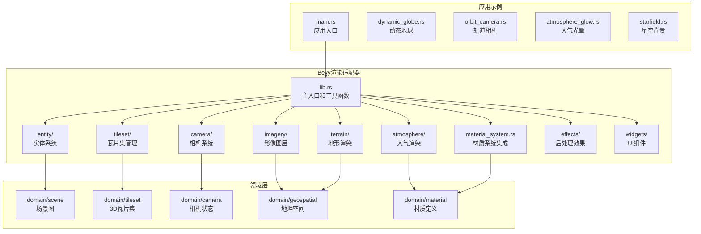
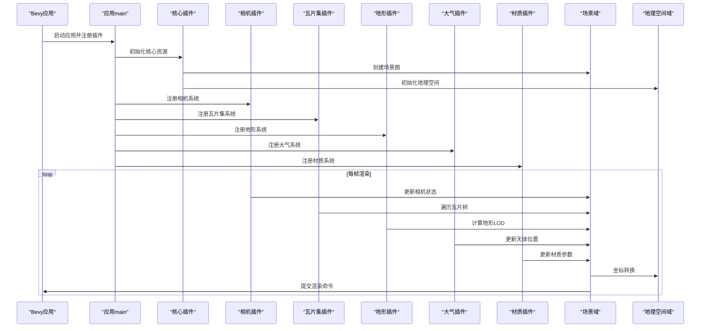
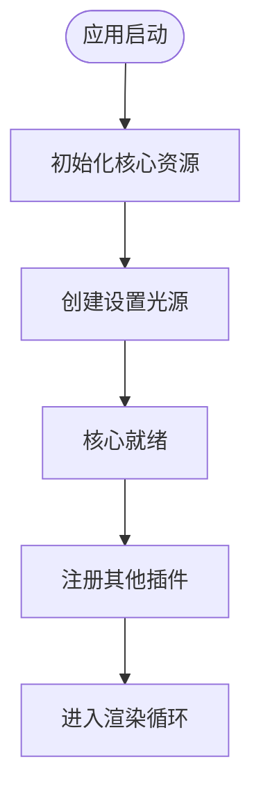
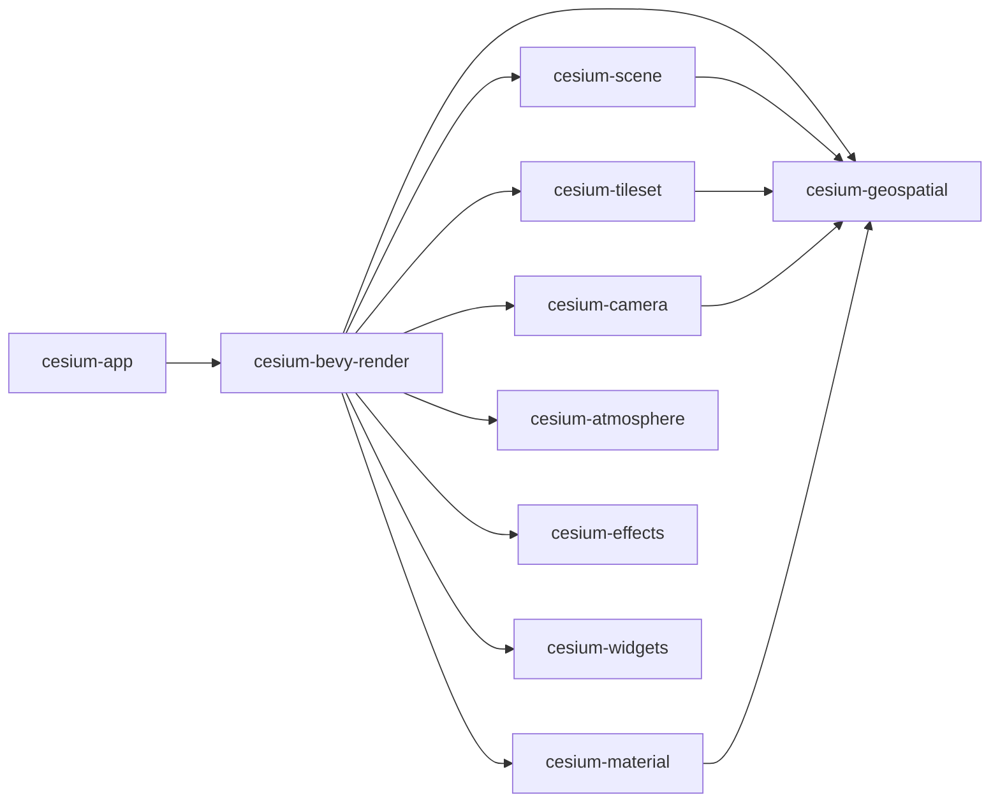

# Bevy渲染适配器

<cite>
**本文引用的文件**   
- [cesiumrust/adapters/bevy-render/src/lib.rs](file://cesiumrust/adapters/bevy-render/src/lib.rs)
- [cesiumrust/adapters/bevy-render/Cargo.toml](file://cesiumrust/adapters/bevy-render/Cargo.toml)
- [cesiumrust/application/cesium-app/src/main.rs](file://cesiumrust/application/cesium-app/src/main.rs)
- [cesiumrust/application/cesium-app/Cargo.toml](file://cesiumrust/application/cesium-app/Cargo.toml)
- [cesiumrust/domain/scene/src/lib.rs](file://cesiumrust/domain/scene/src/lib.rs)
- [cesiumrust/domain/tileset/src/lib.rs](file://cesiumrust/domain/tileset/src/lib.rs)
- [cesiumrust/domain/camera/src/lib.rs](file://cesiumrust/domain/camera/src/lib.rs)
- [cesiumrust/domain/geospatial/src/lib.rs](file://cesiumrust/domain/geospatial/src/lib.rs)
- [cesiumrust/adapters/bevy-render/src/material_system.rs](file://cesiumrust/adapters/bevy-render/src/material_system.rs)
- [cesiumrust/adapters/bevy-render/src/atmosphere/mod.rs](file://cesiumrust/adapters/bevy-render/src/atmosphere/mod.rs)
- [cesiumrust/adapters/bevy-render/src/camera/mod.rs](file://cesiumrust/adapters/bevy-render/src/camera/mod.rs)
- [cesiumrust/docs/ARCHITECTURE.md](file://cesiumrust/docs/ARCHITECTURE.md)
</cite>

## 更新摘要
**变更内容**   
- 完成了从GPUI框架到Bevy插件生态系统的完整架构重构，实现了全新的渲染适配器系统
- 新增了完整的相机系统、瓦片集管理、大气渲染和材质系统等核心功能模块
- 重构了渲染管线架构，采用模块化插件设计，支持按需启用各种渲染功能
- 增强了领域层与渲染层的解耦，通过清晰的接口契约实现松耦合集成
- 优化了资源管理和性能特性，支持大规模地理数据的高效渲染

## 目录
1. [简介](#简介)
2. [项目结构](#项目结构)
3. [核心组件](#核心组件)
4. [架构总览](#架构总览)
5. [详细组件分析](#详细组件分析)
6. [插件生态系统](#插件生态系统)
7. [领域层集成](#领域层集成)
8. [渲染管线优化](#渲染管线优化)
9. [材质系统增强](#材质系统增强)
10. [依赖关系分析](#依赖关系分析)
11. [性能考量](#性能考量)
12. [故障排查指南](#故障排查指南)
13. [结论](#结论)
14. [附录](#附录)

## 简介
本文档详细介绍了Cesium Rust仓库中基于Bevy的渲染适配器系统。该系统完成了从GPUI框架到Bevy插件生态系统的重大架构转型，提供了完整的3D地球可视化解决方案。文档从系统架构、组件职责、数据流、处理逻辑、集成点、错误处理与性能特性等维度进行系统化说明，并提供可视化图示与可操作的排障建议。

**更新** 本次更新重点反映了完整的架构重构：移除了遗留的GPUI框架代码，构建了全新的Bevy插件生态系统，包括相机系统、瓦片集管理、大气渲染、材质系统等核心功能模块，通过模块化设计显著提升了系统的可扩展性和维护性。

## 项目结构
Bevy渲染适配器位于 `cesiumrust/adapters/bevy-render` 目录下，采用模块化插件架构设计。应用示例位于 `cesiumrust/application/cesium-app` 目录，展示了如何组合使用各个插件来构建完整的3D地球应用。

**图表来源**
- [cesiumrust/adapters/bevy-render/src/lib.rs:13-77](file://cesiumrust/adapters/bevy-render/src/lib.rs#L13-L77)
- [cesiumrust/application/cesium-app/src/main.rs:13-23](file://cesiumrust/application/cesium-app/src/main.rs#L13-L23)
- [cesiumrust/domain/scene/src/lib.rs:15-48](file://cesiumrust/domain/scene/src/lib.rs#L15-L48)

**章节来源**
- [cesiumrust/adapters/bevy-render/Cargo.toml:8-35](file://cesiumrust/adapters/bevy-render/Cargo.toml#L8-L35)
- [cesiumrust/application/cesium-app/Cargo.toml:8-23](file://cesiumrust/application/cesium-app/Cargo.toml#L8-L23)

## 核心组件
新的Bevy渲染适配器采用了高度模块化的插件架构，每个功能模块都作为独立的插件提供：

- **核心插件**：`CesiumCorePlugin` - 初始化全局配置和资源
- **相机系统**：`CesiumCameraPlugin` - 提供相机控制、飞行动画和场景模式切换
- **瓦片集管理**：`CesiumTilesetPlugin` - 3D Tiles加载、遍历和渲染
- **地形渲染**：`CesiumTerrainPlugin` - 高度图地形LOD和渲染
- **影像图层**：`CesiumImageryPlugin` - 影像图层栈和混合
- **实体系统**：`CesiumEntityPlugin` - 广告牌、折线、多边形、模型等实体
- **材质系统**：`CesiumMaterialPlugin` - Fabric材质系统和动画
- **大气渲染**：`CesiumAtmospherePlugin` - 天空大气和天体渲染
- **后处理效果**：`CesiumEffectsPlugin` - 后处理效果管道
- **UI组件**：`CesiumWidgetPlugin` - 动画时间轴、地理编码器等UI组件

**章节来源**
- [cesiumrust/adapters/bevy-render/src/lib.rs:32-77](file://cesiumrust/adapters/bevy-render/src/lib.rs#L32-L77)
- [cesiumrust/docs/ARCHITECTURE.md:303-316](file://cesiumrust/docs/ARCHITECTURE.md#L303-L316)

## 架构总览
下图展示了从应用入口到渲染输出的关键调用链与数据流向，体现了新的模块化插件架构：

**图表来源**
- [cesiumrust/application/cesium-app/src/main.rs:74-107](file://cesiumrust/application/cesium-app/src/main.rs#L74-L107)
- [cesiumrust/adapters/bevy-render/src/lib.rs:323-347](file://cesiumrust/adapters/bevy-render/src/lib.rs#L323-L347)
- [cesiumrust/docs/ARCHITECTURE.md:413-439](file://cesiumrust/docs/ARCHITECTURE.md#L413-L439)

## 详细组件分析

### 核心插件（CesiumCorePlugin）
核心插件负责初始化全局配置和资源，为其他插件提供基础服务：

- **全局资源配置**：初始化 `GlobeConfig`、`RenderScale`、`TileLoadStats` 等全局资源
- **场景光照设置**：创建默认的方向光源，模拟太阳光照效果
- **生命周期管理**：在应用启动时执行必要的初始化操作

**章节来源**
- [cesiumrust/adapters/bevy-render/src/lib.rs:323-347](file://cesiumrust/adapters/bevy-render/src/lib.rs#L323-L347)

### 相机系统（CesiumCameraPlugin）
相机系统提供了完整的相机控制功能，支持多种交互模式：

- **输入处理**：处理鼠标和键盘输入事件
- **相机控制器**：提供轨道相机、自由飞行等多种控制模式
- **飞行动画**：支持平滑的相机飞行和过渡动画
- **场景模式**：支持2D、3D、哥伦布视图等不同场景模式

**章节来源**
- [cesiumrust/adapters/bevy-render/src/camera/mod.rs:15-31](file://cesiumrust/adapters/bevy-render/src/camera/mod.rs#L15-L31)

### 瓦片集管理系统（CesiumTilesetPlugin）
瓦片集管理系统负责3D Tiles的加载、遍历和渲染：

- **瓦片加载**：异步加载b3dm、i3dm、pnts等格式的瓦片内容
- **遍历算法**：基于屏幕空间误差的LOD选择算法
- **渲染优化**：视锥剔除、批处理和GPU资源管理
- **样式系统**：支持3D Tiles样式表达式

**章节来源**
- [cesiumrust/adapters/bevy-render/src/tileset/mod.rs:19-34](file://cesiumrust/adapters/bevy-render/src/tileset/mod.rs#L19-L34)

### 大气渲染系统（CesiumAtmospherePlugin）
大气渲染系统提供了真实的大气视觉效果：

- **天体系统**：太阳、月亮、星星等天体的位置和渲染
- **天空大气**：大气散射、瑞利散射等物理效果
- **光照参数**：根据天体位置计算光照参数
- **性能优化**：LOD控制和距离裁剪

**章节来源**
- [cesiumrust/adapters/bevy-render/src/atmosphere/mod.rs:10-18](file://cesiumrust/adapters/bevy-render/src/atmosphere/mod.rs#L10-L18)

## 插件生态系统
新的架构采用了完整的插件生态系统，每个功能模块都是独立的插件：

| 插件名称 | 功能描述 | 主要系统 |
|---------|----------|----------|
| CesiumCorePlugin | 核心资源和光照初始化 | setup_lighting |
| CesiumCameraPlugin | 相机控制和飞行动画 | camera_controller_system, camera_flight_system |
| CesiumTilesetPlugin | 3D瓦片集加载和渲染 | tile_traversal_system, tile_render_system |
| CesiumTerrainPlugin | 地形LOD和渲染 | terrain_lod_system, terrain_render_system |
| CesiumImageryPlugin | 影像图层管理 | imagery_layer_manager, imagery_blend_system |
| CesiumEntityPlugin | 实体可视化和动画 | entity_visualizer_system, time_dynamic_update_system |
| CesiumMaterialPlugin | Fabric材质系统 | apply_fabric_materials, update_material_uniforms |
| CesiumAtmospherePlugin | 大气和天体渲染 | celestial_system, sky_system |
| CesiumEffectsPlugin | 后处理效果管道 | post-process systems |
| CesiumWidgetPlugin | UI组件系统 | animation_widget_system, geocoder_widget_system |

**章节来源**
- [cesiumrust/docs/ARCHITECTURE.md:303-316](file://cesiumrust/docs/ARCHITECTURE.md#L303-L316)

## 领域层集成
新的架构通过清晰的接口契约将领域层与渲染层解耦：

### 场景图集成
- **场景图节点**：管理节点层次结构和变换矩阵
- **可见性计算**：基于视锥体的早期剔除
- **绘制命令生成**：将场景图转换为GPU可执行的绘制命令

### 瓦片集集成
- **瓦片数据结构**：支持tileset.json解析和瓦片树结构
- **LOD选择**：基于屏幕空间误差的细节级别选择
- **内容解码**：支持多种瓦片格式的二进制解码

### 相机集成
- **相机状态**：位置、方向、视锥体等状态管理
- **坐标转换**：世界坐标、相机坐标、屏幕坐标之间的转换
- **投影矩阵**：透视投影和正交投影的支持

**章节来源**
- [cesiumrust/domain/scene/src/lib.rs:15-48](file://cesiumrust/domain/scene/src/lib.rs#L15-L48)
- [cesiumrust/domain/tileset/src/lib.rs:15-59](file://cesiumrust/domain/tileset/src/lib.rs#L15-L59)
- [cesiumrust/domain/camera/src/lib.rs:131-163](file://cesiumrust/domain/camera/src/lib.rs#L131-L163)

## 渲染管线优化
新的渲染管线针对性能进行了全面优化：

### 批处理优化
- **几何合并**：相同材质和状态的几何体进行批处理
- **纹理图集**：减少纹理切换开销
- **索引缓冲优化**：智能的索引缓冲管理和重用

### GPU资源管理
- **内存池**：预分配的内存池减少分配开销
- **资源缓存**：纹理、网格等资源的缓存机制
- **垃圾回收**：智能的资源释放和内存管理

### 并行处理
- **异步加载**：瓦片内容的异步下载和解码
- **多线程处理**：利用多核CPU进行并行计算
- **GPU并行**：充分利用GPU的并行处理能力

**章节来源**
- [cesiumrust/docs/ARCHITECTURE.md:409-461](file://cesiumrust/docs/ARCHITECTURE.md#L409-L461)

## 材质系统增强
新的材质系统提供了丰富的材质功能和优化：

### Fabric材质支持
- **材质定义**：支持CesiumJS兼容的材质类型定义
- **着色器编译**：动态编译和优化WGSL着色器
- **材质实例化**：高效的材质实例创建和管理
- **动画支持**：材质属性的时间动画和插值

### 材质渲染优化
- **材质缓存**：已编译材质的缓存机制
- **批量更新**：材质参数的批量更新
- **GPU缓冲**：高效的GPU缓冲区管理

**章节来源**
- [cesiumrust/adapters/bevy-render/src/material_system.rs:1-159](file://cesiumrust/adapters/bevy-render/src/material_system.rs#L1-L159)

## 依赖关系分析
新的架构采用了清晰的依赖关系设计：

**图表来源**
- [cesiumrust/adapters/bevy-render/Cargo.toml:8-35](file://cesiumrust/adapters/bevy-render/Cargo.toml#L8-L35)
- [cesiumrust/application/cesium-app/Cargo.toml:8-23](file://cesiumrust/application/cesium-app/Cargo.toml#L8-L23)

**章节来源**
- [cesiumrust/adapters/bevy-render/Cargo.toml:8-35](file://cesiumrust/adapters/bevy-render/Cargo.toml#L8-L35)
- [cesiumrust/application/cesium-app/Cargo.toml:8-23](file://cesiumrust/application/cesium-app/Cargo.toml#L8-L23)

## 性能考量
新架构在性能方面进行了全面优化：

### 内存管理
- **对象池**：复用频繁创建的对象，减少GC压力
- **内存对齐**：GPU友好的内存布局和对齐
- **零拷贝**：尽可能避免不必要的数据复制

### 渲染优化
- **Draw Call合并**：减少GPU状态切换和Draw Call数量
- **LOD控制**：基于距离和屏幕大小的细节级别控制
- **视锥剔除**：尽早剔除不可见的几何体

### 网络优化
- **请求去重**：避免重复的网络请求
- **并发控制**：合理的并发下载数量限制
- **缓存策略**：智能的瓦片内容和元数据缓存

**章节来源**
- [cesiumrust/docs/ARCHITECTURE.md:409-461](file://cesiumrust/docs/ARCHITECTURE.md#L409-L461)

## 故障排查指南
### 常见问题诊断
- **插件加载失败**：检查插件依赖是否完整，确认Cargo.toml配置正确
- **相机控制异常**：验证输入事件是否正确传递，检查相机状态更新逻辑
- **瓦片加载失败**：确认网络连接正常，检查瓦片URL和访问权限
- **材质渲染问题**：验证材质定义格式，检查着色器编译日志

### 性能调试
- **帧率监控**：使用Bevy的诊断插件监控帧时间和性能指标
- **内存分析**：定期检查内存使用情况，识别内存泄漏
- **GPU性能**：使用GPU性能分析工具检测渲染瓶颈

### 错误恢复
- **降级策略**：在资源不足时自动降级渲染质量
- **重试机制**：对网络请求和文件加载实现重试逻辑
- **安全退出**：在不可恢复错误时优雅地关闭应用

**章节来源**
- [cesiumrust/adapters/bevy-render/src/lib.rs:349-445](file://cesiumrust/adapters/bevy-render/src/lib.rs#L349-L445)

## 结论
新的Bevy渲染适配器系统通过完整的架构重构，成功地将Cesium的核心能力移植到了Bevy生态系统中。系统采用了高度模块化的插件架构，提供了相机系统、瓦片集管理、大气渲染、材质系统等完整的功能模块。通过清晰的接口契约和松耦合设计，系统具有良好的可扩展性和维护性。

该架构不仅保留了原有系统的核心功能，还通过Bevy的现代游戏引擎特性获得了更好的性能和开发体验。模块化设计使得开发者可以根据需要选择和组合不同的功能模块，构建定制化的3D地球可视化应用。

未来发展方向包括进一步优化渲染性能、扩展材质系统功能、增强交互体验和提供更好的开发工具支持。

## 附录
### 快速开始
1. **安装依赖**：确保Cargo.toml中包含所有必要的依赖
2. **创建应用**：参考cesium-app示例创建基本应用结构
3. **注册插件**：根据需要注册相应的插件
4. **配置资源**：设置全局配置和资源路径
5. **启动应用**：运行应用并验证功能

### 扩展开发
- **自定义插件**：基于现有插件架构开发自定义功能
- **材质扩展**：添加新的材质类型和着色器效果
- **数据源支持**：扩展对其他3D数据格式的支持
- **交互增强**：添加新的用户交互模式和控件

### 性能调优
- **资源优化**：合理配置瓦片LOD和纹理压缩
- **渲染优化**：调整批处理策略和渲染队列
- **内存优化**：监控和优化内存使用情况
- **网络优化**：配置合适的并发和缓存策略

**章节来源**
- [cesiumrust/application/cesium-app/src/main.rs:74-107](file://cesiumrust/application/cesium-app/src/main.rs#L74-L107)
- [cesiumrust/docs/ARCHITECTURE.md:297-461](file://cesiumrust/docs/ARCHITECTURE.md#L297-L461)