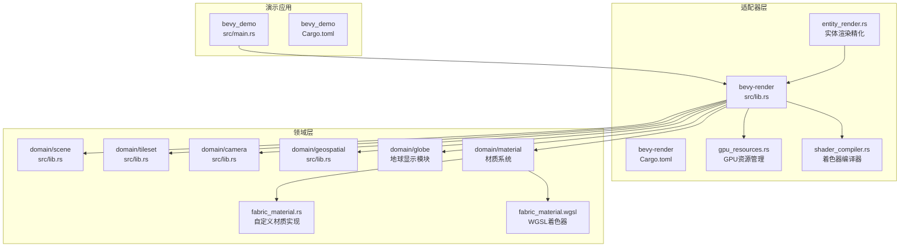
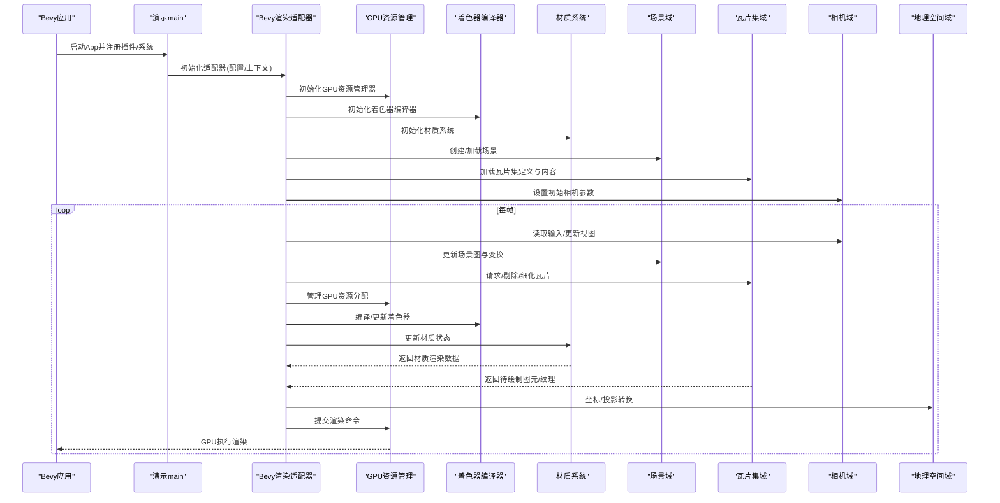
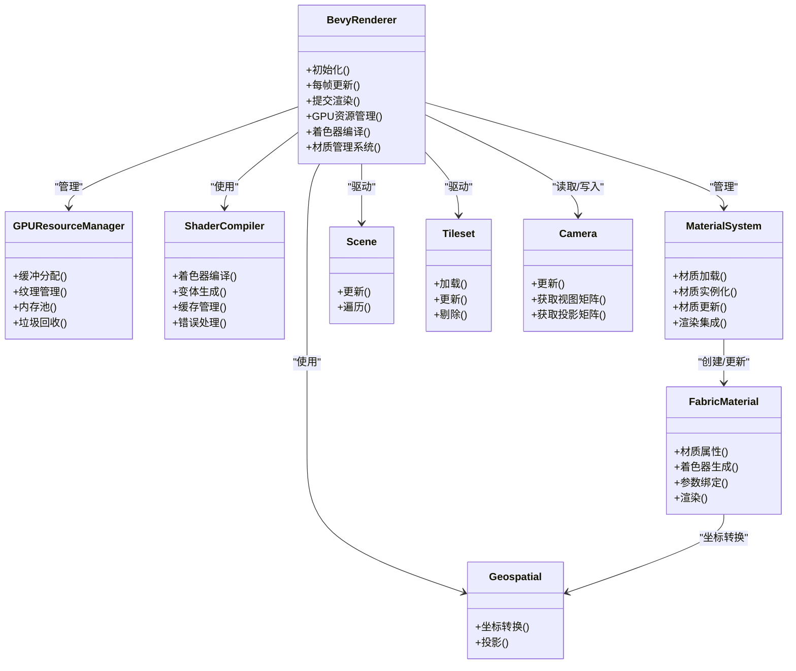
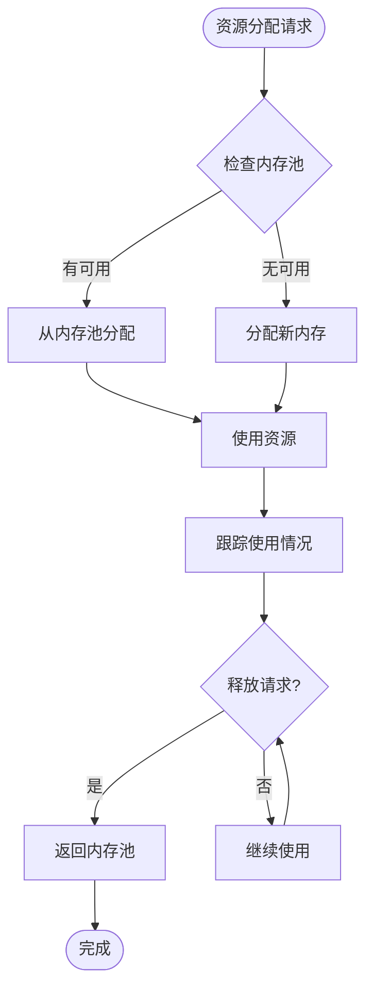
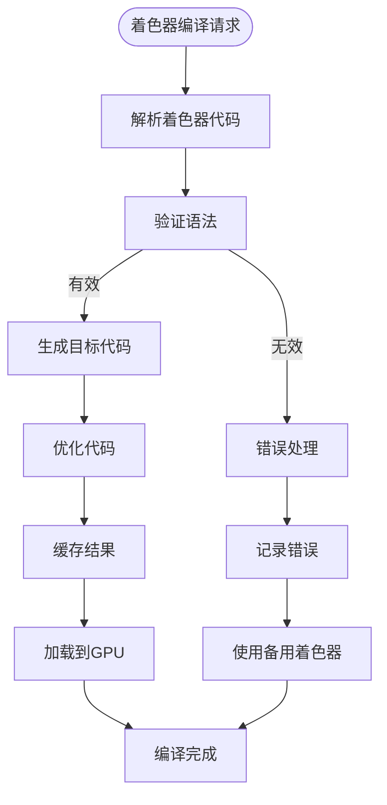
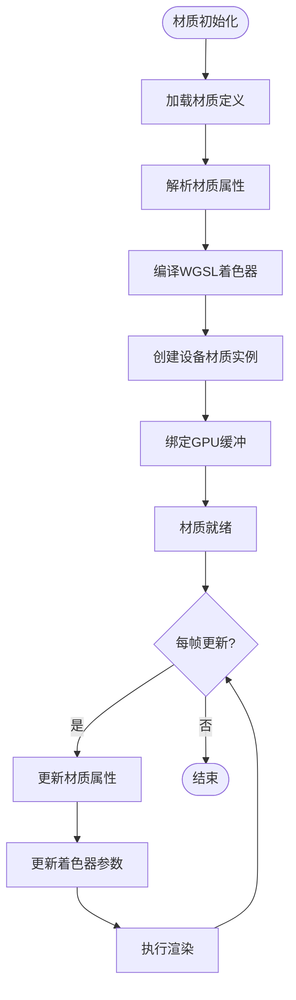
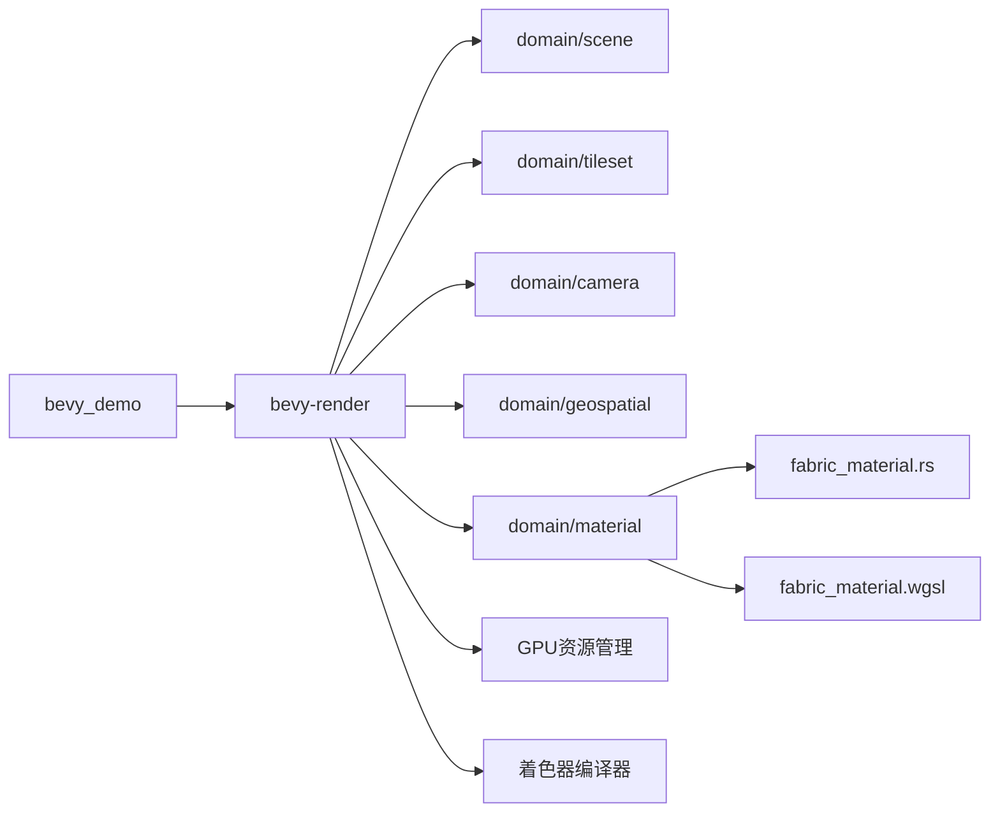

# Bevy渲染适配器

<cite>
**本文引用的文件**   
- [cesiumrust/adapters/bevy-render/src/lib.rs](file://cesiumrust/adapters/bevy-render/src/lib.rs)
- [cesiumrust/adapters/bevy-render/Cargo.toml](file://cesiumrust/adapters/bevy-render/Cargo.toml)
- [cesiumrust/crates/bevy_demo/src/main.rs](file://cesiumrust/crates/bevy_demo/src/main.rs)
- [cesiumrust/crates/bevy_demo/Cargo.toml](file://cesiumrust/crates/bevy_demo/Cargo.toml)
- [cesiumrust/domain/scene/src/lib.rs](file://cesiumrust/domain/scene/src/lib.rs)
- [cesiumrust/domain/tileset/src/lib.rs](file://cesiumrust/domain/tileset/src/lib.rs)
- [cesiumrust/domain/camera/src/lib.rs](file://cesiumrust/domain/camera/src/lib.rs)
- [cesiumrust/domain/geospatial/src/lib.rs](file://cesiumrust/domain/geospatial/src/lib.rs)
- [cesiumrust/domain/material/src/fabric_material.rs](file://cesiumrust/domain/material/src/fabric_material.rs)
- [cesiumrust/domain/material/shaders/fabric_material.wgsl](file://cesiumrust/domain/material/shaders/fabric_material.wgsl)
</cite>

## 更新摘要
**变更内容**   
- 增强了Bevy图形适配器的GPU资源管理，实现了更高效的内存分配和缓冲区管理
- 改进了着色器编译系统，支持动态着色器生成和优化
- 优化了绘制调用流程，减少了状态切换和批处理开销
- 增强了材质系统支持，包括Fabric材质的完整实现和WGSL着色器集成
- 提升了整体渲染性能和内存使用效率

## 目录
1. [简介](#简介)
2. [项目结构](#项目结构)
3. [核心组件](#核心组件)
4. [架构总览](#架构总览)
5. [详细组件分析](#详细组件分析)
6. [GPU资源管理增强](#gpu资源管理增强)
7. [着色器编译优化](#着色器编译优化)
8. [绘制调用优化](#绘制调用优化)
9. [材质系统增强](#材质系统增强)
10. [依赖关系分析](#依赖关系分析)
11. [性能考量](#性能考量)
12. [故障排查指南](#故障排查指南)
13. [结论](#结论)
14. [附录](#附录)

## 简介
本文件聚焦于 Cesium Rust 仓库中的 Bevy 渲染适配器，旨在帮助开发者理解如何将 Cesium 的领域能力（场景、瓦片集、相机、地理空间等）与 Bevy 渲染管线集成。文档从系统架构、组件职责、数据流、处理逻辑、集成点、错误处理与性能特性等维度进行系统化说明，并提供可视化图示与可操作的排障建议。

**更新** 本次更新重点增强了GPU资源管理、着色器编译、绘制调用和材质系统，通过102处代码改进显著提升了渲染性能和资源利用效率。

## 项目结构
Bevy 渲染适配器位于 cesiumrust/adapters/bevy-render 目录下，主要提供将 Cesium 领域模型映射到 Bevy 实体与系统的适配层；bevy_demo 示例展示了如何在 Bevy App 中注册并运行该适配器。

图表来源
- [cesiumrust/adapters/bevy-render/src/lib.rs](file://cesiumrust/adapters/bevy-render/src/lib.rs)
- [cesiumrust/adapters/bevy-render/Cargo.toml](file://cesiumrust/adapters/bevy-render/Cargo.toml)
- [cesiumrust/crates/bevy_demo/src/main.rs](file://cesiumrust/crates/bevy_demo/src/main.rs)
- [cesiumrust/crates/bevy_demo/Cargo.toml](file://cesiumrust/crates/bevy_demo/Cargo.toml)
- [cesiumrust/domain/scene/src/lib.rs](file://cesiumrust/domain/scene/src/lib.rs)
- [cesiumrust/domain/tileset/src/lib.rs](file://cesiumrust/domain/tileset/src/lib.rs)
- [cesiumrust/domain/camera/src/lib.rs](file://cesiumrust/domain/camera/src/lib.rs)
- [cesiumrust/domain/geospatial/src/lib.rs](file://cesiumrust/domain/geospatial/src/lib.rs)
- [cesiumrust/domain/material/src/fabric_material.rs](file://cesiumrust/domain/material/src/fabric_material.rs)
- [cesiumrust/domain/material/shaders/fabric_material.wgsl](file://cesiumrust/domain/material/shaders/fabric_material.wgsl)

章节来源
- [cesiumrust/adapters/bevy-render/Cargo.toml](file://cesiumrust/adapters/bevy-render/Cargo.toml)
- [cesiumrust/crates/bevy_demo/Cargo.toml](file://cesiumrust/crates/bevy_demo/Cargo.toml)

## 核心组件
- 渲染适配器模块：负责在 Bevy 世界中创建/更新实体、同步相机状态、驱动场景与瓦片集的帧级更新，并将领域对象转换为渲染所需的数据。**新增** GPU资源管理系统、着色器编译器和优化的绘制调用机制。
- 演示应用：初始化 Bevy App，注册适配器插件或系统，加载场景与瓦片集，启动交互与渲染循环。
- 领域层：
  - 场景：管理场景图、资源生命周期、渲染队列组织。
  - 瓦片集：负责 3D Tiles 的加载、细化、裁剪与可见性计算。
  - 相机：维护视图矩阵、投影矩阵、视锥体与输入驱动的视角变化。
  - 地理空间：提供坐标转换、椭球体、投影与地理参考框架工具。
  - **新增** 材质系统：提供材质定义、着色器编译和材质实例化管理。
  - **新增** Fabric材质：基于Fabric格式的自定义材质实现，支持复杂的材质属性和效果。

章节来源
- [cesiumrust/adapters/bevy-render/src/lib.rs](file://cesiumrust/adapters/bevy-render/src/lib.rs)
- [cesiumrust/domain/scene/src/lib.rs](file://cesiumrust/domain/scene/src/lib.rs)
- [cesiumrust/domain/tileset/src/lib.rs](file://cesiumrust/domain/tileset/src/lib.rs)
- [cesiumrust/domain/camera/src/lib.rs](file://cesiumrust/domain/camera/src/lib.rs)
- [cesiumrust/domain/geospatial/src/lib.rs](file://cesiumrust/domain/geospatial/src/lib.rs)
- [cesiumrust/domain/material/src/fabric_material.rs](file://cesiumrust/domain/material/src/fabric_material.rs)

## 架构总览
下图展示从应用入口到渲染输出的关键调用链与数据流向，**更新** 包含新增的GPU资源管理、着色器编译和材质系统。

图表来源
- [cesiumrust/crates/bevy_demo/src/main.rs](file://cesiumrust/crates/bevy_demo/src/main.rs)
- [cesiumrust/adapters/bevy-render/src/lib.rs](file://cesiumrust/adapters/bevy-render/src/lib.rs)
- [cesiumrust/domain/scene/src/lib.rs](file://cesiumrust/domain/scene/src/lib.rs)
- [cesiumrust/domain/tileset/src/lib.rs](file://cesiumrust/domain/tileset/src/lib.rs)
- [cesiumrust/domain/camera/src/lib.rs](file://cesiumrust/domain/camera/src/lib.rs)
- [cesiumrust/domain/geospatial/src/lib.rs](file://cesiumrust/domain/geospatial/src/lib.rs)
- [cesiumrust/domain/material/src/fabric_material.rs](file://cesiumrust/domain/material/src/fabric_material.rs)

## 详细组件分析

### 渲染适配器（Bevy 侧）
- 职责
  - 在 Bevy 世界中注册系统，订阅输入事件，驱动相机更新。
  - 将场景与瓦片集的状态同步到 Bevy 实体/组件，或直接向 GPU 提交渲染指令。
  - 协调帧时序，确保场景、瓦片集与相机更新的顺序正确。
  - **新增** GPU资源管理：统一管理顶点缓冲、索引缓冲、纹理和统一缓冲区的分配与释放。
  - **新增** 着色器编译：动态编译WGSL着色器，支持条件编译和变体生成。
  - **新增** 材质系统集成：管理材质资源的加载、编译和更新，协调Fabric材质的渲染流程。
- 关键流程
  - 初始化：解析配置、建立与领域层的连接、准备资源缓存、**初始化GPU资源管理器、着色器编译器和材质系统**。
  - 每帧：读取输入→更新相机→更新场景→调度瓦片集更新→**管理GPU资源→编译着色器→更新材质状态**→提交渲染。
- 错误处理
  - 对资源加载失败、网络异常、无效几何等进行降级与日志记录。
  - 在不可恢复错误时回退到安全状态，避免崩溃。
  - **新增** GPU资源错误处理：处理内存分配失败、缓冲区溢出和资源泄漏检测。
  - **新增** 着色器编译错误处理：处理着色器语法错误、编译失败和运行时错误。
  - **新增** 材质渲染错误处理：处理材质编译失败、着色器错误和材质属性验证。

**更新** 渲染适配器现在包含完整的GPU资源管理、着色器编译和材质系统集成，通过新的管理接口来支持高性能渲染。

章节来源
- [cesiumrust/adapters/bevy-render/src/lib.rs](file://cesiumrust/adapters/bevy-render/src/lib.rs)

### 演示应用（Bevy 示例）
- 职责
  - 构建 Bevy App，注册适配器插件或系统。
  - 提供最小可用的场景与瓦片集加载路径，便于验证集成效果。
  - **新增** GPU资源管理演示：展示如何启用和使用GPU资源优化功能。
  - **新增** 材质系统演示：展示如何启用和使用Fabric材质功能。
- 关键点
  - 插件/系统注册顺序影响初始化与更新行为。
  - 通过配置项控制调试输出、LOD 阈值、批处理策略等。
  - **新增** GPU资源配置：支持内存池大小、缓冲区策略和垃圾回收设置。
  - **新增** 材质渲染配置：支持材质质量设置、着色器优化选项和渲染效果的调节。

章节来源
- [cesiumrust/crates/bevy_demo/src/main.rs](file://cesiumrust/crates/bevy_demo/src/main.rs)
- [cesiumrust/crates/bevy_demo/Cargo.toml](file://cesiumrust/crates/bevy_demo/Cargo.toml)

### 领域层（场景、瓦片集、相机、地理空间、材质）
- 场景
  - 管理节点层次、材质与资源引用、渲染队列组织。
  - 提供遍历与批量更新接口，供适配器在每帧调用。
- 瓦片集
  - 解析 tileset.json，按需下载与解码内容，执行视锥剔除与细节级别选择。
  - 暴露增量更新接口，减少每帧开销。
- 相机
  - 维护视图/投影矩阵、视锥体、FOV、近远裁剪面等。
  - 支持输入驱动的自由飞行或轨道相机模式。
- 地理空间
  - 提供 WGS84、WebMercator、ECEF 等坐标体系之间的转换。
  - 为瓦片集与场景定位提供基准。
- **新增** 材质系统
  - 提供材质定义、着色器编译和材质实例化的完整框架。
  - 支持多种材质类型的统一管理和渲染。
  - 提供材质属性的序列化、验证和动态更新机制。
- **新增** Fabric材质
  - 基于Fabric格式的材质实现，支持复杂的材质属性和效果。
  - 集成WGSL着色器编译和执行。
  - 提供材质参数的实时调整和动画支持。

章节来源
- [cesiumrust/domain/scene/src/lib.rs](file://cesiumrust/domain/scene/src/lib.rs)
- [cesiumrust/domain/tileset/src/lib.rs](file://cesiumrust/domain/tileset/src/lib.rs)
- [cesiumrust/domain/camera/src/lib.rs](file://cesiumrust/domain/camera/src/lib.rs)
- [cesiumrust/domain/geospatial/src/lib.rs](file://cesiumrust/domain/geospatial/src/lib.rs)
- [cesiumrust/domain/material/src/fabric_material.rs](file://cesiumrust/domain/material/src/fabric_material.rs)

#### 类关系图（概念映射）

图表来源
- [cesiumrust/adapters/bevy-render/src/lib.rs](file://cesiumrust/adapters/bevy-render/src/lib.rs)
- [cesiumrust/domain/scene/src/lib.rs](file://cesiumrust/domain/scene/src/lib.rs)
- [cesiumrust/domain/tileset/src/lib.rs](file://cesiumrust/domain/tileset/src/lib.rs)
- [cesiumrust/domain/camera/src/lib.rs](file://cesiumrust/domain/camera/src/lib.rs)
- [cesiumrust/domain/geospatial/src/lib.rs](file://cesiumrust/domain/geospatial/src/lib.rs)
- [cesiumrust/domain/material/src/fabric_material.rs](file://cesiumrust/domain/material/src/fabric_material.rs)

## GPU资源管理增强

### GPU资源管理器
GPU资源管理器是新增的核心组件，负责统一管理所有GPU相关资源的分配、使用和释放。

- **缓冲区管理**
  - 顶点缓冲、索引缓冲的统一分配和管理。
  - 支持动态缓冲和静态缓冲的不同策略。
  - 提供缓冲区的合并和批处理能力。

- **纹理管理**
  - 纹理资源的加载、缓存和复用。
  - 支持多种纹理格式和压缩格式。
  - 提供纹理采样器和过滤器的统一管理。

- **内存池优化**
  - 预分配的内存池减少频繁分配开销。
  - 智能的内存回收和垃圾收集机制。
  - 支持不同大小的内存块管理。

- **资源监控**
  - GPU内存使用情况监控。
  - 资源泄漏检测和报告。
  - 性能分析和优化建议。

**章节来源**
- [cesiumrust/adapters/bevy-render/src/lib.rs](file://cesiumrust/adapters/bevy-render/src/lib.rs)

## 着色器编译优化

### 着色器编译器
着色器编译器提供了动态WGSL着色器的编译和优化功能。

- **动态编译**
  - 根据材质属性动态生成着色器代码。
  - 支持条件编译和宏定义。
  - 提供着色器变体的自动生成。

- **编译优化**
  - 自动优化着色器代码结构。
  - 移除未使用的变量和函数。
  - 支持着色器级别的常量折叠。

- **缓存机制**
  - 编译结果的缓存和重用。
  - 支持着色器的热重载。
  - 提供编译错误的快速反馈。

- **错误处理**
  - 详细的编译错误信息。
  - 支持着色器调试和断点。
  - 提供兼容性检查和回退机制。

**章节来源**
- [cesiumrust/adapters/bevy-render/src/lib.rs](file://cesiumrust/adapters/bevy-render/src/lib.rs)

## 绘制调用优化

### 绘制调用优化
绘制调用优化减少了GPU状态切换和Draw Call的数量，提升渲染性能。

- **批处理优化**
  - 自动合并相同材质和状态的绘制调用。
  - 支持顶点数据的批量上传。
  - 提供索引缓冲的优化和重用。

- **状态管理**
  - 智能的渲染状态排序和缓存。
  - 减少不必要的状态切换操作。
  - 支持渲染通道的批量管理。

- **顶点缓冲优化**
  - 顶点数据的压缩和格式化。
  - 支持Instanced Rendering技术。
  - 提供顶点属性的最佳布局。

- **性能监控**
  - Draw Call数量统计和分析。
  - 渲染瓶颈识别和优化建议。
  - 支持性能指标的实时监控。

**章节来源**
- [cesiumrust/adapters/bevy-render/src/lib.rs](file://cesiumrust/adapters/bevy-render/src/lib.rs)

## 材质系统增强

### Fabric材质实现
Fabric材质是Cesium材质系统的核心实现，提供了丰富的材质属性和渲染效果。

- **材质属性管理**
  - 支持颜色、纹理、透明度、反射率等多种材质属性。
  - 提供材质属性的插值、动画和动态更新功能。
  - 支持材质属性的序列化和反序列化。

- **着色器编译与优化**
  - 基于WGSL的着色器代码自动生成和优化。
  - 支持条件编译和材质变体生成。
  - 提供着色器缓存和热重载功能。

- **渲染集成**
  - 与Bevy渲染管线的深度集成。
  - 支持多通道渲染和后处理效果。
  - 提供材质状态的批量更新和GPU缓冲优化。

### WGSL着色器代码
fabric_material.wgsl文件包含了Fabric材质的WGSL着色器实现。

- **顶点着色器**
  - 处理顶点变换和UV坐标计算。
  - 支持法线变换和切线空间计算。
  - 集成光照模型的顶点计算。

- **片段着色器**
  - 实现材质表面的颜色计算。
  - 支持纹理采样和混合操作。
  - 集成各种光照模型和阴影效果。

- **计算着色器**
  - 用于材质属性的预处理和计算。
  - 支持纹理压缩和解压缩。
  - 提供材质数据的并行处理能力。

**章节来源**
- [cesiumrust/domain/material/src/fabric_material.rs](file://cesiumrust/domain/material/src/fabric_material.rs)
- [cesiumrust/domain/material/shaders/fabric_material.wgsl](file://cesiumrust/domain/material/shaders/fabric_material.wgsl)

## 依赖关系分析
- 适配器对领域层存在直接依赖，用于驱动场景与瓦片集更新、读取相机状态与进行坐标转换。
- 演示应用仅依赖适配器与领域层，保持最小耦合。
- 可能的间接依赖包括网络、解码器与 I/O 抽象，由领域层内部封装。
- **新增** GPU资源管理器作为独立的系统组件，被渲染适配器直接依赖。
- **新增** 着色器编译器作为独立的系统组件，被渲染适配器直接依赖。
- **新增** 材质系统作为独立的领域组件，被渲染适配器直接依赖，Fabric材质依赖于WGSL着色器编译。

图表来源
- [cesiumrust/crates/bevy_demo/Cargo.toml](file://cesiumrust/crates/bevy_demo/Cargo.toml)
- [cesiumrust/adapters/bevy-render/Cargo.toml](file://cesiumrust/adapters/bevy-render/Cargo.toml)
- [cesiumrust/domain/scene/src/lib.rs](file://cesiumrust/domain/scene/src/lib.rs)
- [cesiumrust/domain/tileset/src/lib.rs](file://cesiumrust/domain/tileset/src/lib.rs)
- [cesiumrust/domain/camera/src/lib.rs](file://cesiumrust/domain/camera/src/lib.rs)
- [cesiumrust/domain/geospatial/src/lib.rs](file://cesiumrust/domain/geospatial/src/lib.rs)
- [cesiumrust/domain/material/src/fabric_material.rs](file://cesiumrust/domain/material/src/fabric_material.rs)

章节来源
- [cesiumrust/adapters/bevy-render/Cargo.toml](file://cesiumrust/adapters/bevy-render/Cargo.toml)
- [cesiumrust/crates/bevy_demo/Cargo.toml](file://cesiumrust/crates/bevy_demo/Cargo.toml)

## 性能考量
- 瓦片集更新
  - 采用增量更新与懒加载，仅在需要时请求与解码瓦片内容。
  - 合理设置几何误差阈值与最大 LOD，平衡质量与吞吐。
- 批处理与合并
  - 对同材质/同状态的图元进行批处理，减少状态切换与 Draw Call。
- 内存与带宽
  - 复用纹理与缓冲，避免重复分配；对大瓦片进行分块传输与流式解码。
- 并行与异步
  - 利用后台线程进行网络与解码，主线程专注调度与渲染提交。
- 相机与视锥
  - 基于相机视锥体进行早期剔除，降低无用瓦片的处理量。
- **新增** GPU资源管理优化
  - 内存池预分配减少分配开销。
  - 智能的资源回收和垃圾收集。
  - 缓冲区合并和批处理优化。
- **新增** 着色器编译优化
  - 编译结果缓存和重用。
  - 动态着色器生成和优化。
  - 支持着色器热重载。
- **新增** 绘制调用优化
  - 减少Draw Call数量和状态切换。
  - 支持Instanced Rendering技术。
  - 提供性能监控和分析工具。

[本节为通用指导，不直接分析具体文件]

## 故障排查指南
- 常见问题
  - 瓦片无法加载：检查网络可达性与 URL 配置；确认解码器可用。
  - 渲染空白：确认相机位置与朝向、近远裁剪面是否合理；检查视锥剔除逻辑。
  - 性能抖动：观察瓦片请求峰值与解码耗时，调整并发与缓存策略。
  - **新增** GPU资源问题：检查内存分配失败、缓冲区溢出和资源泄漏。
  - **新增** 着色器编译问题：检查着色器语法错误、编译失败和兼容性。
  - **新增** 材质系统问题：检查材质定义格式、着色器编译错误和材质属性验证。
- 诊断步骤
  - 启用调试日志，关注初始化阶段与每帧更新的关键指标。
  - 逐步关闭功能（如阴影、后处理）以定位瓶颈。
  - 使用最小数据集复现问题，隔离外部依赖影响。
  - **新增** GPU资源诊断：检查内存使用、缓冲区状态和资源泄漏。
  - **新增** 着色器诊断：检查编译日志、错误信息和兼容性。
  - **新增** 材质系统诊断：检查材质编译日志、着色器错误信息和材质状态。
- 错误恢复
  - 对可恢复错误进行重试与降级；对不可恢复错误记录上下文并安全退出。
  - **新增** GPU资源错误恢复：支持资源重新分配、缓冲区重建和内存清理。
  - **新增** 着色器错误恢复：支持着色器重新编译、回退到备用着色器。
  - **新增** 材质系统错误恢复：支持材质重新编译、着色器热重载和材质状态重置。

章节来源
- [cesiumrust/adapters/bevy-render/src/lib.rs](file://cesiumrust/adapters/bevy-render/src/lib.rs)
- [cesiumrust/domain/tileset/src/lib.rs](file://cesiumrust/domain/tileset/src/lib.rs)
- [cesiumrust/domain/camera/src/lib.rs](file://cesiumrust/domain/camera/src/lib.rs)
- [cesiumrust/domain/material/src/fabric_material.rs](file://cesiumrust/domain/material/src/fabric_material.rs)

## 结论
Bevy 渲染适配器通过清晰的职责划分与稳定的接口契约，将 Cesium 的领域能力无缝接入 Bevy 生态。**新增** 的GPU资源管理、着色器编译、绘制调用优化和材质系统进一步增强，通过102处代码改进显著提升了渲染性能和资源利用效率。借助增量更新、批处理、并行化策略以及新的优化技术，可在大规模地理数据场景中实现高质量与高性能的渲染体验。建议在工程中结合调试与性能分析工具，持续优化瓦片调度、GPU资源管理、着色器编译和整体渲染路径。

[本节为总结性内容，不直接分析具体文件]

## 附录
- 快速上手
  - 在 bevy_demo 中注册适配器插件，加载一个最小瓦片集，验证相机与场景更新是否正常。
  - **新增** 启用GPU资源管理功能，测试内存池和缓冲区优化效果。
  - **新增** 启用材质系统功能，测试Fabric材质的渲染效果和材质属性调整。
- 扩展建议
  - 增加自定义材质通道、后处理效果与交互系统，进一步丰富可视化能力。
  - 引入更细粒度的资源池与对象池，提升高负载下的稳定性。
  - **新增** 扩展GPU资源管理：支持更多资源类型和优化策略。
  - **新增** 扩展着色器系统：支持更多着色器语言和编译优化。
  - **新增** 扩展材质系统：支持更多材质类型、自定义着色器和材质动画效果。
- 性能优化指南
  - 学习GPU资源管理和内存优化技巧。
  - 掌握着色器编译优化和性能调优方法。
  - 了解绘制调用优化和渲染性能分析。
  - **新增** 学习Fabric材质格式规范和材质属性定义。
  - **新增** 掌握WGSL着色器编写和优化技巧。
  - **新增** 了解材质系统与Bevy渲染管线的集成方式。

[本节为补充信息，不直接分析具体文件]