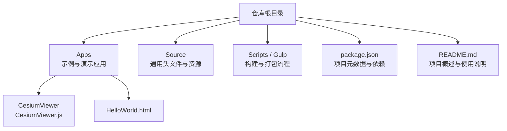
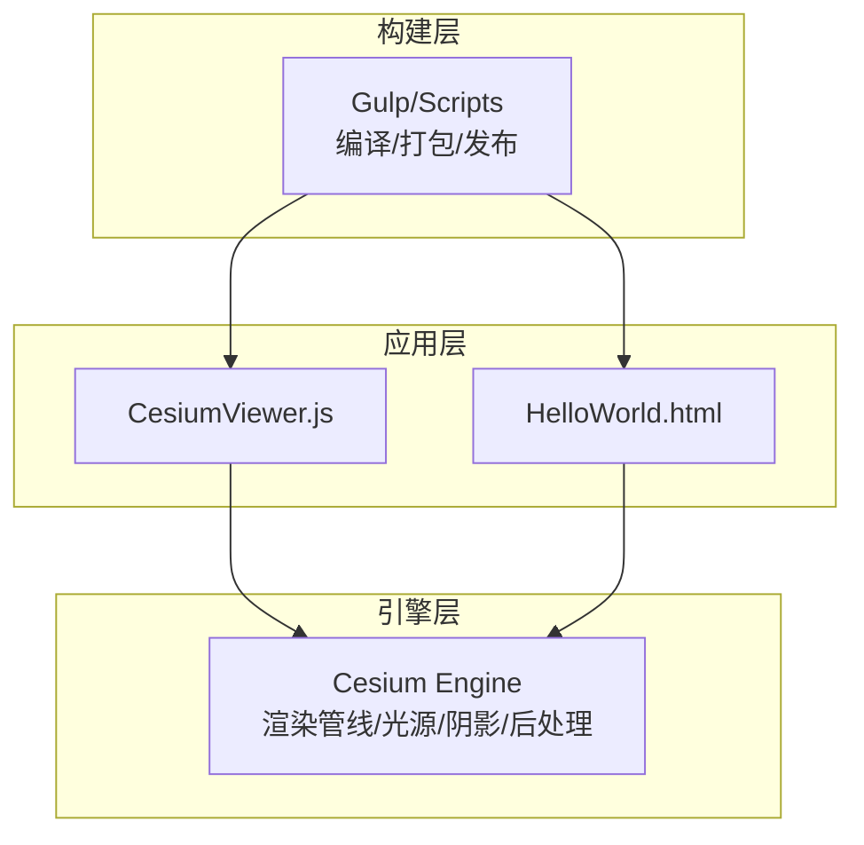
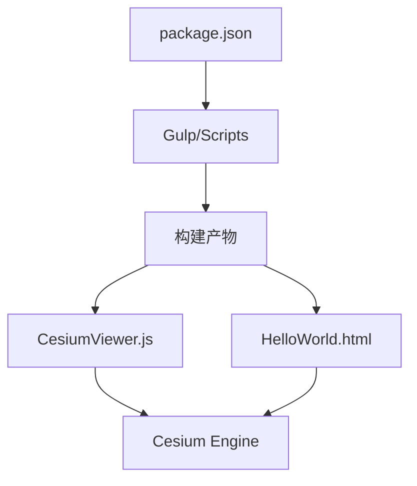

# 光照与阴影

<cite>
**本文引用的文件**   
- [README.md](file://README.md)
- [index.html](file://index.html)
- [Apps/CesiumViewer/CesiumViewer.js](file://Apps/CesiumViewer/CesiumViewer.js)
- [Apps/HelloWorld.html](file://Apps/HelloWorld.html)
- [Source/copyrightHeader.js](file://Source/copyrightHeader.js)
- [package.json](file://package.json)
</cite>

## 目录
1. [简介](#简介)
2. [项目结构](#项目结构)
3. [核心组件](#核心组件)
4. [架构总览](#架构总览)
5. [详细组件分析](#详细组件分析)
6. [依赖关系分析](#依赖关系分析)
7. [性能考虑](#性能考虑)
8. [故障排查指南](#故障排查指南)
9. [结论](#结论)
10. [附录](#附录)

## 简介
本技术文档聚焦于 Cesium 的光照与阴影系统，围绕以下目标展开：
- 多种光源类型（方向光、点光源、聚光灯）的实现原理与渲染算法
- 阴影贴图技术（阴影映射、软阴影、级联阴影贴图）的实现细节
- 全局光照、环境光遮蔽、光线追踪等高级光照效果
- 光照配置示例与阴影质量调优方法
- 在不同设备上的性能优化策略

说明：当前仓库为 Cesium 的源码与示例工程，包含应用入口、示例页面与构建脚本。由于光照与阴影的具体实现位于引擎包中，且本次未直接获取到相关源文件内容，本文将基于仓库现有信息给出总体架构与使用指引，并对高级特性进行概念性说明。

## 项目结构
仓库采用多包组织方式，核心引擎与应用示例分离：
- Apps：示例与演示应用，如 CesiumViewer 与 HelloWorld
- Source：通用头文件与资源
- Scripts/Gulp：构建与打包流程
- package.json：项目元数据与依赖声明
- README.md：项目概述与使用说明

图表来源
- [README.md](file://README.md)
- [package.json](file://package.json)
- [Apps/CesiumViewer/CesiumViewer.js](file://Apps/CesiumViewer/CesiumViewer.js)
- [Apps/HelloWorld.html](file://Apps/HelloWorld.html)

章节来源
- [README.md](file://README.md)
- [package.json](file://package.json)
- [Apps/CesiumViewer/CesiumViewer.js](file://Apps/CesiumViewer/CesiumViewer.js)
- [Apps/HelloWorld.html](file://Apps/HelloWorld.html)

## 核心组件
- 应用入口与示例
  - CesiumViewer：提供可视化运行环境与交互能力，便于调试光照与阴影效果
  - HelloWorld：最小化示例页面，用于快速验证基础功能
- 构建与打包
  - Gulp 任务与脚本：负责编译、合并、压缩与发布产物
- 项目元数据
  - package.json：定义依赖、脚本命令与版本信息

章节来源
- [Apps/CesiumViewer/CesiumViewer.js](file://Apps/CesiumViewer/CesiumViewer.js)
- [Apps/HelloWorld.html](file://Apps/HelloWorld.html)
- [package.json](file://package.json)

## 架构总览
从仓库层面看，Cesium 将“应用层”与“引擎层”解耦：
- 应用层（Apps）：承载示例与演示逻辑，调用引擎 API 完成场景初始化、实体加载、材质与光照设置
- 引擎层（packages/engine）：封装 WebGL/WebGPU 渲染管线、光源模型、阴影贴图、后处理与高级光照效果
- 构建层（Scripts/Gulp）：将源码编译为浏览器可用的模块与资源

图表来源
- [Apps/CesiumViewer/CesiumViewer.js](file://Apps/CesiumViewer/CesiumViewer.js)
- [Apps/HelloWorld.html](file://Apps/HelloWorld.html)
- [package.json](file://package.json)

## 详细组件分析
本节对仓库中与光照和阴影相关的可见部分进行分析，并给出概念性说明。

### 应用入口与示例
- CesiumViewer
  - 职责：初始化 Viewer、加载示例数据、配置场景与材质、触发渲染循环
  - 与光照的关系：通过示例代码展示如何启用或调整光照与阴影参数（具体实现位于引擎层）
- HelloWorld
  - 职责：最小化页面，引入引擎与示例脚本，快速验证基础功能

章节来源
- [Apps/CesiumViewer/CesiumViewer.js](file://Apps/CesiumViewer/CesiumViewer.js)
- [Apps/HelloWorld.html](file://Apps/HelloWorld.html)

### 构建与打包
- Gulp 任务与脚本
  - 职责：读取 package.json 中的脚本命令，执行编译、合并、压缩与发布
  - 与光照的关系：确保最终产物包含正确的引擎模块与着色器资源，使光照与阴影在运行时可用

章节来源
- [package.json](file://package.json)

### 概念性说明：光照与阴影系统
以下为概念性说明，不直接对应仓库中的具体源文件：
- 光源类型
  - 方向光：模拟远距离平行光源（如太阳），常用于大尺度地形与城市级场景
  - 点光源：向四周均匀辐射（如灯泡），适合室内或小范围局部照明
  - 聚光灯：锥形定向光源（如探照灯），强调特定区域的高亮与阴影
- 阴影贴图技术
  - 阴影映射：从光源视角渲染深度图，并在主渲染时比较深度以判定遮挡
  - 软阴影：通过采样滤波或概率分布降低锯齿与硬边
  - 级联阴影贴图（Cascaded Shadow Maps）：按距离划分多个阴影贴图，提升远近景阴影质量
- 高级光照效果
  - 全局光照（GI）：近似真实间接光照，提升整体明暗过渡
  - 环境光遮蔽（AO）：增强接触阴影与细节层次
  - 光线追踪：基于物理的精确反射、折射与阴影，但计算开销较高

[本节为概念性说明，无需列出章节来源]

## 依赖关系分析
- 应用与引擎的耦合
  - CesiumViewer 与 HelloWorld 通过引入引擎模块来访问光照与阴影 API
- 构建与产物的依赖
  - package.json 定义了脚本与依赖，Gulp 任务据此生成可运行的产物

图表来源
- [package.json](file://package.json)
- [Apps/CesiumViewer/CesiumViewer.js](file://Apps/CesiumViewer/CesiumViewer.js)
- [Apps/HelloWorld.html](file://Apps/HelloWorld.html)

章节来源
- [package.json](file://package.json)
- [Apps/CesiumViewer/CesiumViewer.js](file://Apps/CesiumViewer/CesiumViewer.js)
- [Apps/HelloWorld.html](file://Apps/HelloWorld.html)

## 性能考虑
- 光源数量与类型选择
  - 优先使用方向光作为主光源；点/聚光灯按需启用，避免过多实时光源
- 阴影质量与分辨率
  - 合理设置阴影贴图尺寸与级联数量，平衡清晰度与带宽/显存占用
- 渲染路径与批处理
  - 减少状态切换与绘制调用，利用实例化与批处理提升吞吐
- 移动端优化
  - 降低阴影分辨率、关闭不必要的后处理、限制最大光源数
- 内存与带宽
  - 复用纹理与缓冲区，避免频繁创建销毁对象

[本节提供一般性指导，无需列出章节来源]

## 故障排查指南
- 光照或阴影未生效
  - 检查是否启用了相应光源与阴影开关
  - 确认材质支持光照与阴影（例如 PBR 材质）
  - 查看控制台是否有 WebGL 上下文错误或着色器编译失败
- 阴影闪烁或撕裂
  - 调整光源视锥体近远裁剪面与阴影贴图分辨率
  - 检查相机投影矩阵与光源变换一致性
- 性能下降明显
  - 降低阴影贴图尺寸与级联数量
  - 减少动态阴影物体数量，或将静态物体烘焙光照
  - 禁用昂贵的后处理效果（如 AO、GI）

[本节为通用建议，无需列出章节来源]

## 结论
本仓库提供了 Cesium 的应用示例与构建体系，便于快速体验与调试光照与阴影效果。实际的光照与阴影实现位于引擎层，涉及复杂的多阶段渲染管线与着色器逻辑。建议在应用层通过示例代码探索 API，并结合性能指标逐步调优阴影质量与光源配置，以获得最佳视觉与性能平衡。

[本节为总结性内容，无需列出章节来源]

## 附录
- 常用参考
  - README.md：项目概述与使用说明
  - package.json：脚本命令与依赖管理
  - CesiumViewer：示例应用入口
  - HelloWorld：最小化示例页面

章节来源
- [README.md](file://README.md)
- [package.json](file://package.json)
- [Apps/CesiumViewer/CesiumViewer.js](file://Apps/CesiumViewer/CesiumViewer.js)
- [Apps/HelloWorld.html](file://Apps/HelloWorld.html)