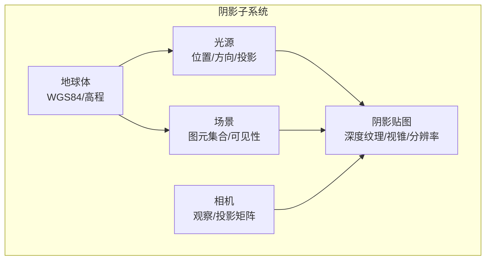
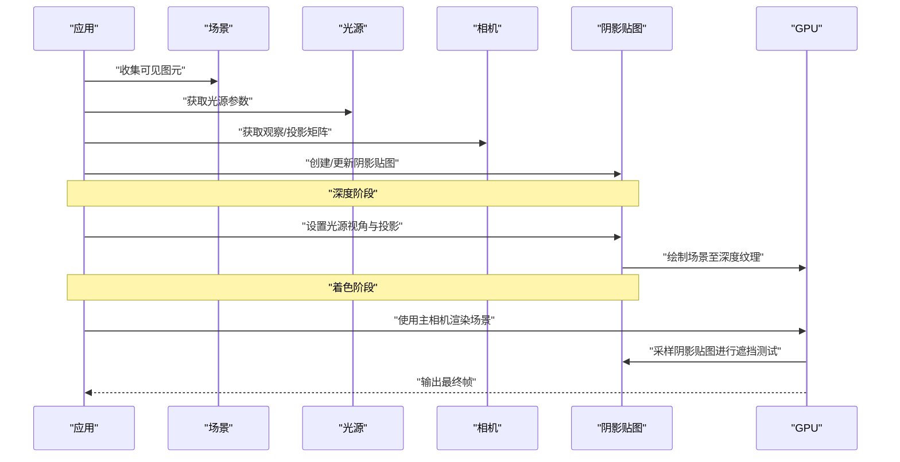
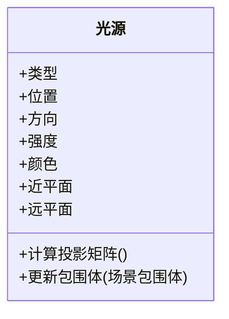
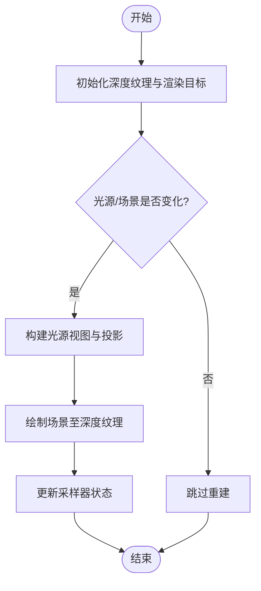
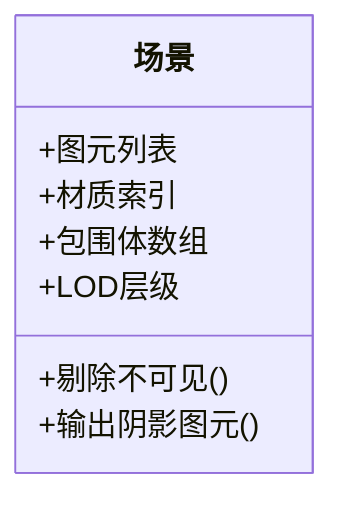
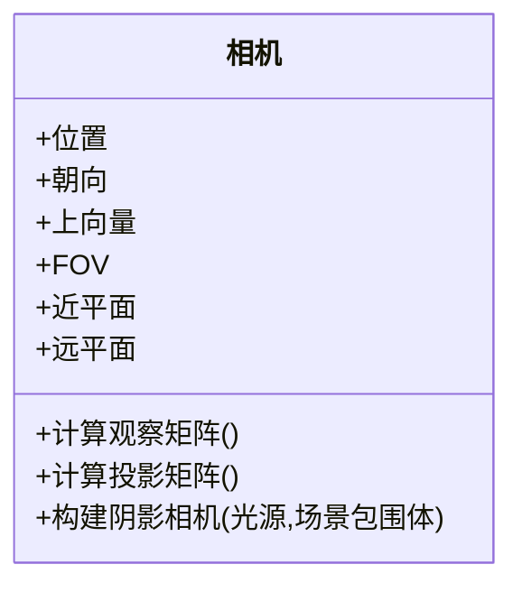
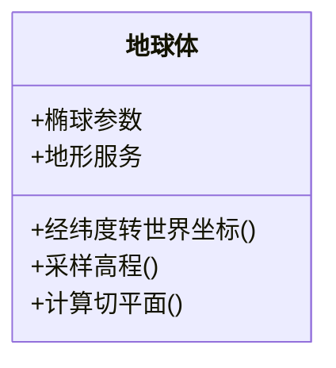
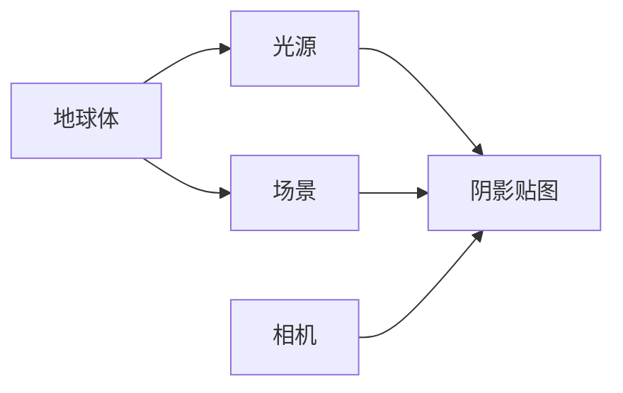

# 阴影映射系统

<cite>
**本文引用的文件**   
- [shadow.rs](file://cesiumrust/domain/shadow/src/shadow.rs)
- [light.rs](file://cesiumrust/domain/shadow/src/light.rs)
- [shadow_map.rs](file://cesiumrust/domain/shadow/src/shadow_map.rs)
- [scene.rs](file://cesiumrust/domain/scene/src/scene.rs)
- [camera.rs](file://cesiumrust/domain/camera/src/camera.rs)
- [globe.rs](file://cesiumrust/domain/geospatial/src/globe.rs)
</cite>

## 目录
1. [简介](#简介)
2. [项目结构](#项目结构)
3. [核心组件](#核心组件)
4. [架构总览](#架构总览)
5. [详细组件分析](#详细组件分析)
6. [依赖关系分析](#依赖关系分析)
7. [性能考量](#性能考量)
8. [故障排查指南](#故障排查指南)
9. [结论](#结论)
10. [附录](#附录)

## 简介
本文件面向“阴影映射系统”的架构与实现，聚焦于在三维地理可视化场景中，如何基于光源、相机与场景几何构建阴影贴图（Shadow Map），并在渲染管线中应用以实现真实感阴影。文档从系统架构、数据流、关键算法流程、依赖关系与性能优化等维度进行系统化阐述，并提供可操作的排障建议与最佳实践。

## 项目结构
阴影映射相关代码位于 Rust 领域层模块中，围绕“光源—阴影贴图—场景—相机—地球体”的核心协作展开：
- 光源模块负责描述光源类型、位置、方向与投影参数。
- 阴影贴图模块负责管理深度纹理、视锥裁剪、分辨率与更新策略。
- 场景模块负责收集需要参与阴影计算的图元集合，并生成可见性信息。
- 相机模块提供观察矩阵与投影矩阵，用于将世界坐标变换到屏幕空间。
- 地球体模块提供大地坐标系与高度模型，辅助将经纬度与高程转换为世界坐标。

图表来源
- [shadow.rs:1-200](file://cesiumrust/domain/shadow/src/shadow.rs#L1-L200)
- [light.rs:1-200](file://cesiumrust/domain/shadow/src/light.rs#L1-L200)
- [shadow_map.rs:1-200](file://cesiumrust/domain/shadow/src/shadow_map.rs#L1-L200)
- [scene.rs:1-200](file://cesiumrust/domain/scene/src/scene.rs#L1-L200)
- [camera.rs:1-200](file://cesiumrust/domain/camera/src/camera.rs#L1-L200)
- [globe.rs:1-200](file://cesiumrust/domain/geospatial/src/globe.rs#L1-L200)

章节来源
- [shadow.rs:1-200](file://cesiumrust/domain/shadow/src/shadow.rs#L1-L200)
- [light.rs:1-200](file://cesiumrust/domain/shadow/src/light.rs#L1-L200)
- [shadow_map.rs:1-200](file://cesiumrust/domain/shadow/src/shadow_map.rs#L1-L200)
- [scene.rs:1-200](file://cesiumrust/domain/scene/src/scene.rs#L1-L200)
- [camera.rs:1-200](file://cesiumrust/domain/camera/src/camera.rs#L1-L200)
- [globe.rs:1-200](file://cesiumrust/domain/geospatial/src/globe.rs#L1-L200)

## 核心组件
- 光源
  - 职责：定义光源类型（定向光/点光）、位置或方向、强度、颜色、投影范围与近远平面。
  - 关键点：对定向光需计算光照方向；对点光需考虑多面投影（立方体贴图）。
- 阴影贴图
  - 职责：维护深度纹理资源、视锥包围盒、分辨率、采样器状态与更新时机。
  - 关键点：支持动态分辨率调整、视锥裁剪、深度偏移（bias）与滤波。
- 场景
  - 职责：聚合待渲染图元，剔除不可见对象，输出可用于阴影绘制的几何列表。
  - 关键点：按材质/着色器分组，减少状态切换；支持LOD与遮挡剔除。
- 相机
  - 职责：提供观察矩阵与投影矩阵，驱动阴影贴图视角的构建。
  - 关键点：为阴影绘制阶段提供“阴影相机”，其视锥由光源与场景包围体决定。
- 地球体
  - 职责：提供大地坐标转换与高程模型，支撑世界坐标一致性。
  - 关键点：经纬度转世界坐标、地形高度采样、局部切平面近似。

章节来源
- [light.rs:1-200](file://cesiumrust/domain/shadow/src/light.rs#L1-L200)
- [shadow_map.rs:1-200](file://cesiumrust/domain/shadow/src/shadow_map.rs#L1-L200)
- [scene.rs:1-200](file://cesiumrust/domain/scene/src/scene.rs#L1-L200)
- [camera.rs:1-200](file://cesiumrust/domain/camera/src/camera.rs#L1-L200)
- [globe.rs:1-200](file://cesiumrust/domain/geospatial/src/globe.rs#L1-L200)

## 架构总览
阴影映射采用两阶段渲染：
- 深度阶段：以光源视角绘制场景，写入阴影贴图的深度缓冲。
- 着色阶段：使用主相机视角渲染场景，同时采样阴影贴图判断遮挡。

图表来源
- [shadow.rs:1-200](file://cesiumrust/domain/shadow/src/shadow.rs#L1-L200)
- [shadow_map.rs:1-200](file://cesiumrust/domain/shadow/src/shadow_map.rs#L1-L200)
- [scene.rs:1-200](file://cesiumrust/domain/scene/src/scene.rs#L1-L200)
- [camera.rs:1-200](file://cesiumrust/domain/camera/src/camera.rs#L1-L200)
- [light.rs:1-200](file://cesiumrust/domain/shadow/src/light.rs#L1-L200)

## 详细组件分析

### 光源组件分析
- 设计要点
  - 统一抽象：支持多种光源类型，暴露一致的投影矩阵与方向接口。
  - 投影范围：根据场景包围体与距离阈值计算近远平面，避免过深或过浅导致的精度问题。
  - 动态更新：当光源移动或旋转时，标记阴影贴图失效并触发重建。
- 复杂度与优化
  - 投影矩阵构建为常数时间操作；包围体求交为线性复杂度。
  - 优化建议：缓存最近一次的有效投影矩阵，仅在必要更新时重建。

图表来源
- [light.rs:1-200](file://cesiumrust/domain/shadow/src/light.rs#L1-L200)

章节来源
- [light.rs:1-200](file://cesiumrust/domain/shadow/src/light.rs#L1-L200)

### 阴影贴图组件分析
- 设计要点
  - 资源管理：深度纹理生命周期、格式选择（如 D32_FLOAT/D24_UNORM）、采样器配置。
  - 视锥裁剪：依据光源投影与场景包围体计算有效区域，减少无效绘制。
  - 更新策略：支持增量更新、延迟更新与分辨率自适应。
- 算法流程
  - 初始化：分配深度纹理与渲染目标。
  - 更新：根据光源与场景变化决定是否重建。
  - 采样：在着色阶段提供 UV 变换与深度比较函数。

图表来源
- [shadow_map.rs:1-200](file://cesiumrust/domain/shadow/src/shadow_map.rs#L1-L200)

章节来源
- [shadow_map.rs:1-200](file://cesiumrust/domain/shadow/src/shadow_map.rs#L1-L200)

### 场景组件分析
- 设计要点
  - 图元聚合：按材质/着色器分组，减少状态切换。
  - 可见性剔除：基于视锥与包围体快速剔除不可见对象。
  - 阴影参与：标记哪些图元应参与阴影绘制与接收阴影。
- 数据结构
  - 图元列表、材质索引、包围体数组、LOD层级。
- 复杂度
  - 剔除为 O(n)，着色器分组为 O(m)。

图表来源
- [scene.rs:1-200](file://cesiumrust/domain/scene/src/scene.rs#L1-L200)

章节来源
- [scene.rs:1-200](file://cesiumrust/domain/scene/src/scene.rs#L1-L200)

### 相机组件分析
- 设计要点
  - 观察矩阵：由相机位置与朝向确定。
  - 投影矩阵：透视或正交投影，影响阴影贴图的深度分布。
  - 阴影相机：为深度阶段提供独立视角，通常由光源与场景包围体推导。
- 关键点
  - 矩阵更新频率与缓存策略。
  - 投影参数对阴影精度的影响（近远平面比值）。

图表来源
- [camera.rs:1-200](file://cesiumrust/domain/camera/src/camera.rs#L1-L200)

章节来源
- [camera.rs:1-200](file://cesiumrust/domain/camera/src/camera.rs#L1-L200)

### 地球体组件分析
- 设计要点
  - 坐标转换：经纬度与高程到世界坐标的转换。
  - 地形采样：按需加载与插值，保证高度连续性。
  - 局部近似：在大范围场景中采用切平面近似提升性能。
- 关键点
  - 精度与性能的平衡。
  - 与阴影系统的耦合：确保世界坐标一致性与深度精度。

图表来源
- [globe.rs:1-200](file://cesiumrust/domain/geospatial/src/globe.rs#L1-L200)

章节来源
- [globe.rs:1-200](file://cesiumrust/domain/geospatial/src/globe.rs#L1-L200)

## 依赖关系分析
阴影子系统内部依赖关系如下：
- 光源依赖地球体以在世界坐标下定位。
- 阴影贴图依赖光源与场景以构建视锥与绘制深度。
- 场景依赖地球体以获得正确的高程与世界坐标。
- 相机为阴影贴图与主渲染提供矩阵。

图表来源
- [light.rs:1-200](file://cesiumrust/domain/shadow/src/light.rs#L1-L200)
- [shadow_map.rs:1-200](file://cesiumrust/domain/shadow/src/shadow_map.rs#L1-L200)
- [scene.rs:1-200](file://cesiumrust/domain/scene/src/scene.rs#L1-L200)
- [camera.rs:1-200](file://cesiumrust/domain/camera/src/camera.rs#L1-L200)
- [globe.rs:1-200](file://cesiumrust/domain/geospatial/src/globe.rs#L1-L200)

章节来源
- [light.rs:1-200](file://cesiumrust/domain/shadow/src/light.rs#L1-L200)
- [shadow_map.rs:1-200](file://cesiumrust/domain/shadow/src/shadow_map.rs#L1-L200)
- [scene.rs:1-200](file://cesiumrust/domain/scene/src/scene.rs#L1-L200)
- [camera.rs:1-200](file://cesiumrust/domain/camera/src/camera.rs#L1-L200)
- [globe.rs:1-200](file://cesiumrust/domain/geospatial/src/globe.rs#L1-L200)

## 性能考量
- 深度纹理分辨率
  - 高分辨率带来更精细的阴影但增加带宽与内存占用。
  - 建议：根据相机距离与屏幕占比动态调整分辨率。
- 视锥裁剪
  - 仅绘制光源视锥内的图元，减少无效绘制。
- 深度偏移（Bias）
  - 防止自阴影伪影，但过大导致阴影悬浮。
  - 建议：基于表面法线与光照角度自适应调节。
- 采样滤波
  - PCF/PCSS 等软阴影技术提升质量但增加采样开销。
  - 建议：移动端降低采样次数或使用硬件加速。
- 更新频率
  - 静态光源可低频更新；动态光源需高频更新。
  - 建议：基于运动阈值与变化检测触发更新。

[本节为通用指导，不直接分析具体文件]

## 故障排查指南
- 阴影缺失
  - 检查光源视锥是否包含目标物体。
  - 确认阴影贴图已正确创建并绑定至着色器。
- 阴影闪烁或条纹
  - 调整深度偏移与采样滤波参数。
  - 检查近远平面比值是否合理。
- 性能下降
  - 降低阴影贴图分辨率或采样次数。
  - 启用视锥裁剪与增量更新。
- 坐标不一致
  - 校验地球体坐标转换与场景世界坐标的一致性。
  - 确认相机与光源矩阵计算路径正确。

章节来源
- [shadow_map.rs:1-200](file://cesiumrust/domain/shadow/src/shadow_map.rs#L1-L200)
- [light.rs:1-200](file://cesiumrust/domain/shadow/src/light.rs#L1-L200)
- [camera.rs:1-200](file://cesiumrust/domain/camera/src/camera.rs#L1-L200)
- [globe.rs:1-200](file://cesiumrust/domain/geospatial/src/globe.rs#L1-L200)

## 结论
阴影映射系统在 CesiumRust 中以模块化方式组织，围绕光源、阴影贴图、场景、相机与地球体五大核心组件协同工作。通过合理的视锥裁剪、动态分辨率与深度偏移策略，可在保证视觉质量的同时兼顾性能。建议在大规模地理场景中结合 LOD 与遮挡剔除进一步优化渲染效率。

[本节为总结性内容，不直接分析具体文件]

## 附录
- 术语表
  - 阴影贴图：记录从光源视角看到的深度信息的纹理。
  - 视锥裁剪：仅处理光源可视范围内的几何以提升性能。
  - 深度偏移：为避免自阴影伪影而对深度值进行的微调。
- 参考实现路径
  - 光源实现：[light.rs](file://cesiumrust/domain/shadow/src/light.rs)
  - 阴影贴图实现：[shadow_map.rs](file://cesiumrust/domain/shadow/src/shadow_map.rs)
  - 场景聚合与剔除：[scene.rs](file://cesiumrust/domain/scene/src/scene.rs)
  - 相机矩阵构建：[camera.rs](file://cesiumrust/domain/camera/src/camera.rs)
  - 地球体坐标转换：[globe.rs](file://cesiumrust/domain/geospatial/src/globe.rs)