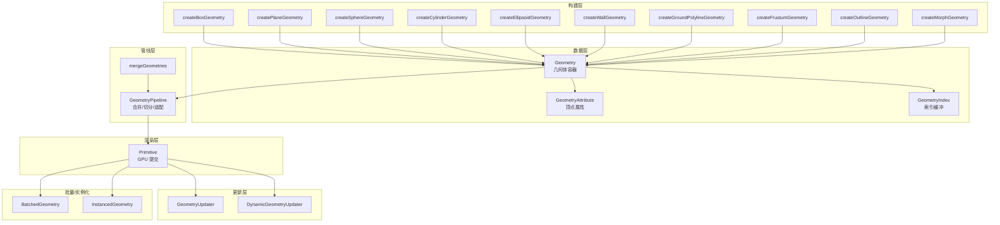
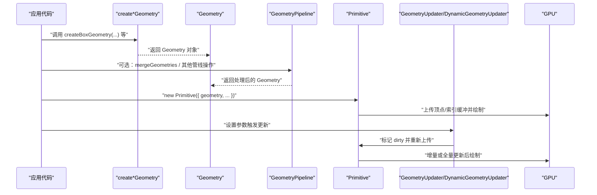
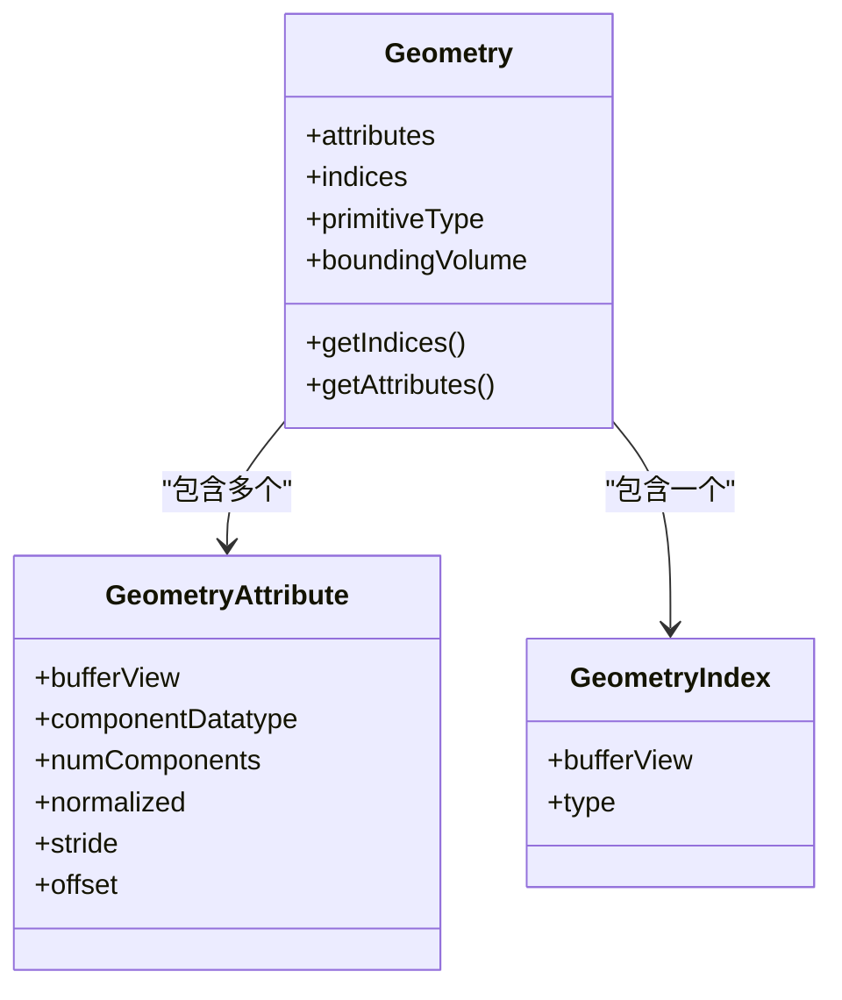
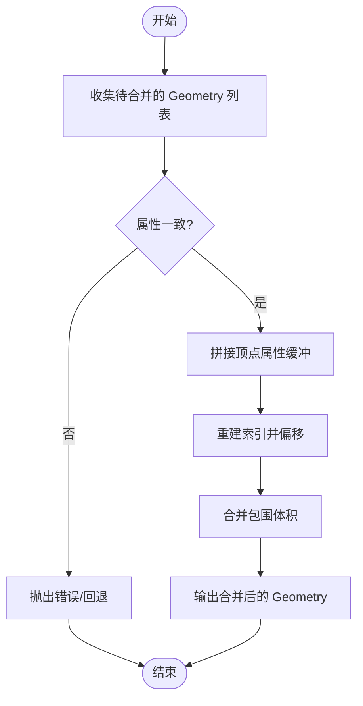
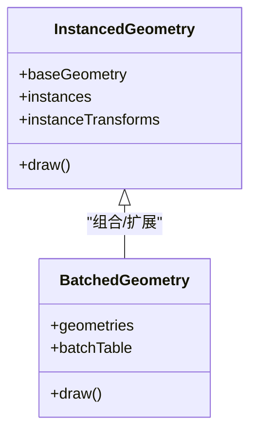
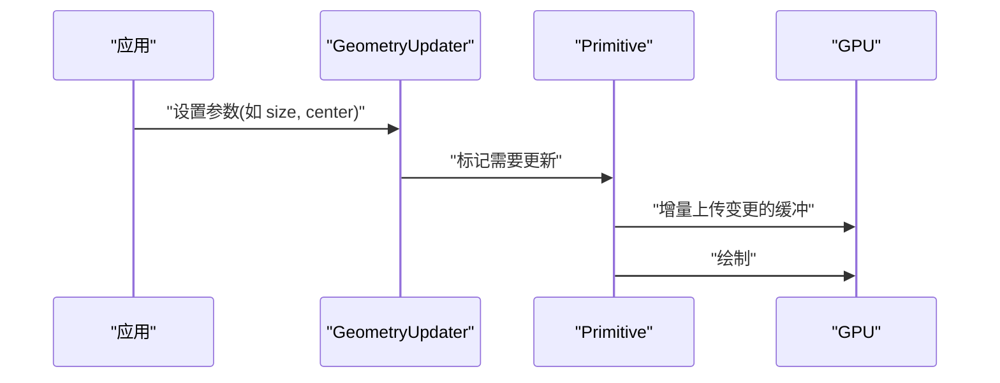
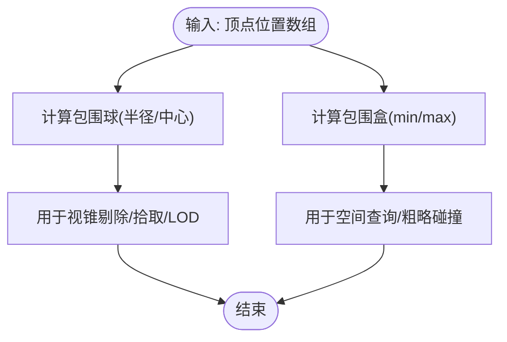
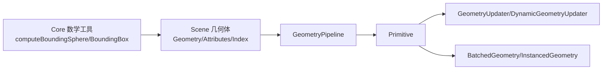

# 几何体处理

<cite>
**本文引用的文件**   
- [Geometry.js](file://packages/engine/Source/Scene/Geometry/Geometry.js)
- [GeometryAttribute.js](file://packages/engine/Source/Scene/Geometry/GeometryAttribute.js)
- [GeometryIndex.js](file://packages/engine/Source/Scene/Geometry/GeometryIndex.js)
- [GeometryPipeline.js](file://packages/engine/Source/Scene/GeometryPipeline.js)
- [Primitive.js](file://packages/engine/Source/Scene/Primitive.js)
- [createBoxGeometry.js](file://packages/engine/Source/Scene/Geometry/createBoxGeometry.js)
- [createPlaneGeometry.js](file://packages/engine/Source/Scene/Geometry/createPlaneGeometry.js)
- [createSphereGeometry.js](file://packages/engine/Source/Scene/Geometry/createSphereGeometry.js)
- [createCylinderGeometry.js](file://packages/engine/Source/Scene/Geometry/createCylinderGeometry.js)
- [createEllipsoidGeometry.js](file://packages/engine/Source/Scene/Geometry/createEllipsoidGeometry.js)
- [createWallGeometry.js](file://packages/engine/Source/Scene/Geometry/createWallGeometry.js)
- [createGroundPolylineGeometry.js](file://packages/engine/Source/Scene/Geometry/createGroundPolylineGeometry.js)
- [createFrustumGeometry.js](file://packages/engine/Source/Scene/Geometry/createFrustumGeometry.js)
- [createOutlineGeometry.js](file://packages/engine/Source/Scene/Geometry/createOutlineGeometry.js)
- [createMorphGeometry.js](file://packages/engine/Source/Scene/Geometry/createMorphGeometry.js)
- [createMorphTargets.js](file://packages/engine/Source/Scene/Geometry/createMorphTargets.js)
- [computeBoundingSphere.js](file://packages/engine/Source/Core/computeBoundingSphere.js)
- [computeBoundingBox.js](file://packages/engine/Source/Core/computeBoundingBox.js)
- [mergeGeometries.js](file://packages/engine/Source/Scene/Geometry/mergeGeometries.js)
- [GeometryUpdater.js](file://packages/engine/Source/Scene/GeometryUpdater.js)
- [DynamicGeometryUpdater.js](file://packages/engine/Source/Scene/DynamicGeometryUpdater.js)
- [InstancedGeometry.js](file://packages/engine/Source/Scene/InstancedGeometry.js)
- [BatchedGeometry.js](file://packages/engine/Source/Scene/BatchedGeometry.js)
- [createBoxGeometryUpdater.js](file://packages/engine/Source/Scene/GeometryUpdaters/createBoxGeometryUpdater.js)
- [createPlaneGeometryUpdater.js](file://packages/engine/Source/Scene/GeometryUpdaters/createPlaneGeometryUpdater.js)
- [createSphereGeometryUpdater.js](file://packages/engine/Source/Scene/GeometryUpdaters/createSphereGeometryUpdater.js)
- [createCylinderGeometryUpdater.js](file://packages/engine/Source/Scene/GeometryUpdaters/createCylinderGeometryUpdater.js)
- [createEllipsoidGeometryUpdater.js](file://packages/engine/Source/Scene/GeometryUpdaters/createEllipsoidGeometryUpdater.js)
- [createWallGeometryUpdater.js](file://packages/engine/Source/Scene/GeometryUpdaters/createWallGeometryUpdater.js)
- [createGroundPolylineGeometryUpdater.js](file://packages/engine/Source/Scene/GeometryUpdaters/createGroundPolylineGeometryUpdater.js)
- [createFrustumGeometryUpdater.js](file://packages/engine/Source/Scene/GeometryUpdaters/createFrustumGeometryUpdater.js)
- [createOutlineGeometryUpdater.js](file://packages/engine/Source/Scene/GeometryUpdaters/createOutlineGeometryUpdater.js)
</cite>

## 目录
1. [简介](#简介)
2. [项目结构](#项目结构)
3. [核心组件](#核心组件)
4. [架构总览](#架构总览)
5. [详细组件分析](#详细组件分析)
6. [依赖关系分析](#依赖关系分析)
7. [性能考虑](#性能考虑)
8. [故障排查指南](#故障排查指南)
9. [结论](#结论)
10. [附录](#附录)

## 简介
本技术文档聚焦于 Cesium 的几何体处理系统，围绕 3D 几何体的数据结构设计、渲染优化与数学运算展开。内容涵盖：
- 顶点缓冲、索引缓冲、法线等属性的组织方式
- 几何体合并、实例化渲染与动态更新机制
- 包围盒/包围球计算、碰撞检测与几何变换
- 常见几何体的创建与修改流程
- 大规模几何体渲染的性能优化策略

## 项目结构
Cesium 引擎将“几何体数据”和“几何体管线”解耦，形成清晰的数据层与渲染层边界：
- 数据层：Geometry、GeometryAttribute、GeometryIndex 描述几何体拓扑与属性
- 构建层：各 create*Geometry 工厂函数生成具体几何体
- 管线层：GeometryPipeline 负责合并、切分、着色器适配等
- 渲染层：Primitive 将 Geometry 提交到 GPU
- 更新层：GeometryUpdater/DynamicGeometryUpdater 支持运行时参数驱动更新
- 批量/实例化：BatchedGeometry/InstancedGeometry 面向大规模场景优化

图示来源
- [Geometry.js:1-200](file://packages/engine/Source/Scene/Geometry/Geometry.js#L1-L200)
- [GeometryAttribute.js:1-200](file://packages/engine/Source/Scene/Geometry/GeometryAttribute.js#L1-L200)
- [GeometryIndex.js:1-200](file://packages/engine/Source/Scene/Geometry/GeometryIndex.js#L1-L200)
- [GeometryPipeline.js:1-200](file://packages/engine/Source/Scene/GeometryPipeline.js#L1-L200)
- [Primitive.js:1-200](file://packages/engine/Source/Scene/Primitive.js#L1-L200)
- [createBoxGeometry.js:1-200](file://packages/engine/Source/Scene/Geometry/createBoxGeometry.js#L1-L200)
- [createPlaneGeometry.js:1-200](file://packages/engine/Source/Scene/Geometry/createPlaneGeometry.js#L1-L200)
- [createSphereGeometry.js:1-200](file://packages/engine/Source/Scene/Geometry/createSphereGeometry.js#L1-L200)
- [createCylinderGeometry.js:1-200](file://packages/engine/Source/Scene/Geometry/createCylinderGeometry.js#L1-L200)
- [createEllipsoidGeometry.js:1-200](file://packages/engine/Source/Scene/Geometry/createEllipsoidGeometry.js#L1-L200)
- [createWallGeometry.js:1-200](file://packages/engine/Source/Scene/Geometry/createWallGeometry.js#L1-L200)
- [createGroundPolylineGeometry.js:1-200](file://packages/engine/Source/Scene/Geometry/createGroundPolylineGeometry.js#L1-L200)
- [createFrustumGeometry.js:1-200](file://packages/engine/Source/Scene/Geometry/createFrustumGeometry.js#L1-L200)
- [createOutlineGeometry.js:1-200](file://packages/engine/Source/Scene/Geometry/createOutlineGeometry.js#L1-L200)
- [createMorphGeometry.js:1-200](file://packages/engine/Source/Scene/Geometry/createMorphGeometry.js#L1-L200)
- [mergeGeometries.js:1-200](file://packages/engine/Source/Scene/Geometry/mergeGeometries.js#L1-L200)

章节来源
- [Geometry.js:1-200](file://packages/engine/Source/Scene/Geometry/Geometry.js#L1-L200)
- [GeometryAttribute.js:1-200](file://packages/engine/Source/Scene/Geometry/GeometryAttribute.js#L1-L200)
- [GeometryIndex.js:1-200](file://packages/engine/Source/Scene/Geometry/GeometryIndex.js#L1-L200)
- [GeometryPipeline.js:1-200](file://packages/engine/Source/Scene/GeometryPipeline.js#L1-L200)
- [Primitive.js:1-200](file://packages/engine/Source/Scene/Primitive.js#L1-L200)

## 核心组件
本节从数据结构与职责角度解析关键类与模块：
- Geometry：几何体容器，持有 attributes（顶点属性）、indices（索引）、primitiveType（图元类型）、boundingVolume（包围体积）等
- GeometryAttribute：描述单个属性（如位置、法线、纹理坐标），包含数据类型、步长、偏移、缓冲区视图
- GeometryIndex：封装索引缓冲，支持 16/32 位索引
- GeometryPipeline：对 Geometry 进行预处理（合并、切分、属性重排、着色器兼容）
- Primitive：将 Geometry 绑定到材质、状态机并提交绘制
- GeometryUpdater/DynamicGeometryUpdater：为几何体提供运行时参数更新能力
- BatchedGeometry/InstancedGeometry：面向大批量对象的批处理与实例化渲染

章节来源
- [Geometry.js:1-200](file://packages/engine/Source/Scene/Geometry/Geometry.js#L1-L200)
- [GeometryAttribute.js:1-200](file://packages/engine/Source/Scene/Geometry/GeometryAttribute.js#L1-L200)
- [GeometryIndex.js:1-200](file://packages/engine/Source/Scene/Geometry/GeometryIndex.js#L1-L200)
- [GeometryPipeline.js:1-200](file://packages/engine/Source/Scene/GeometryPipeline.js#L1-L200)
- [Primitive.js:1-200](file://packages/engine/Source/Scene/Primitive.js#L1-L200)
- [GeometryUpdater.js:1-200](file://packages/engine/Source/Scene/GeometryUpdater.js#L1-L200)
- [DynamicGeometryUpdater.js:1-200](file://packages/engine/Source/Scene/DynamicGeometryUpdater.js#L1-L200)
- [BatchedGeometry.js:1-200](file://packages/engine/Source/Scene/BatchedGeometry.js#L1-L200)
- [InstancedGeometry.js:1-200](file://packages/engine/Source/Scene/InstancedGeometry.js#L1-L200)

## 架构总览
下图展示从几何体创建到渲染的关键路径，以及更新与批量/实例化的扩展点。

图示来源
- [createBoxGeometry.js:1-200](file://packages/engine/Source/Scene/Geometry/createBoxGeometry.js#L1-L200)
- [createPlaneGeometry.js:1-200](file://packages/engine/Source/Scene/Geometry/createPlaneGeometry.js#L1-L200)
- [createSphereGeometry.js:1-200](file://packages/engine/Source/Scene/Geometry/createSphereGeometry.js#L1-L200)
- [createCylinderGeometry.js:1-200](file://packages/engine/Source/Scene/Geometry/createCylinderGeometry.js#L1-L200)
- [createEllipsoidGeometry.js:1-200](file://packages/engine/Source/Scene/Geometry/createEllipsoidGeometry.js#L1-L200)
- [createWallGeometry.js:1-200](file://packages/engine/Source/Scene/Geometry/createWallGeometry.js#L1-L200)
- [createGroundPolylineGeometry.js:1-200](file://packages/engine/Source/Scene/Geometry/createGroundPolylineGeometry.js#L1-L200)
- [createFrustumGeometry.js:1-200](file://packages/engine/Source/Scene/Geometry/createFrustumGeometry.js#L1-L200)
- [createOutlineGeometry.js:1-200](file://packages/engine/Source/Scene/Geometry/createOutlineGeometry.js#L1-L200)
- [createMorphGeometry.js:1-200](file://packages/engine/Source/Scene/Geometry/createMorphGeometry.js#L1-L200)
- [mergeGeometries.js:1-200](file://packages/engine/Source/Scene/Geometry/mergeGeometries.js#L1-L200)
- [GeometryPipeline.js:1-200](file://packages/engine/Source/Scene/GeometryPipeline.js#L1-L200)
- [Primitive.js:1-200](file://packages/engine/Source/Scene/Primitive.js#L1-L200)
- [GeometryUpdater.js:1-200](file://packages/engine/Source/Scene/GeometryUpdater.js#L1-L200)
- [DynamicGeometryUpdater.js:1-200](file://packages/engine/Source/Scene/DynamicGeometryUpdater.js#L1-L200)

## 详细组件分析

### 几何体数据结构与内存布局
- 顶点属性（GeometryAttribute）
  - 典型属性：位置（POSITION）、法线（NORMAL）、纹理坐标（TEXCOORD_0）、颜色（COLOR_0）
  - 每个属性定义数据类型、分量数、是否归一化、步长与偏移，最终打包为连续内存块
- 索引缓冲（GeometryIndex）
  - 使用 16/32 位无符号整数索引三角形/线条/点
  - 通过索引复用顶点，减少内存占用与带宽
- 几何体（Geometry）
  - 聚合 attributes 与 indices，声明 primitiveType（TRIANGLES/LINES/POINTS）
  - 可附带 boundingVolume（包围盒/球）用于视锥剔除与 LOD

图示来源
- [Geometry.js:1-200](file://packages/engine/Source/Scene/Geometry/Geometry.js#L1-L200)
- [GeometryAttribute.js:1-200](file://packages/engine/Source/Scene/Geometry/GeometryAttribute.js#L1-L200)
- [GeometryIndex.js:1-200](file://packages/engine/Source/Scene/Geometry/GeometryIndex.js#L1-L200)

章节来源
- [Geometry.js:1-200](file://packages/engine/Source/Scene/Geometry/Geometry.js#L1-L200)
- [GeometryAttribute.js:1-200](file://packages/engine/Source/Scene/Geometry/GeometryAttribute.js#L1-L200)
- [GeometryIndex.js:1-200](file://packages/engine/Source/Scene/Geometry/GeometryIndex.js#L1-L200)

### 几何体创建与修改示例
- 基础几何体
  - 立方体：createBoxGeometry
  - 平面：createPlaneGeometry
  - 球体：createSphereGeometry
  - 圆柱：createCylinderGeometry
  - 椭球：createEllipsoidGeometry
  - 墙体：createWallGeometry
  - 地面折线：createGroundPolylineGeometry
  - 视锥体：createFrustumGeometry
  - 轮廓：createOutlineGeometry
  - 形变：createMorphGeometry + createMorphTargets
- 修改与更新
  - 使用对应 GeometryUpdater（如 createBoxGeometryUpdater）在运行时调整尺寸、分段、中心、朝向等
  - 对于频繁更新的几何体，优先使用 DynamicGeometryUpdater 以最小化上传开销

章节来源
- [createBoxGeometry.js:1-200](file://packages/engine/Source/Scene/Geometry/createBoxGeometry.js#L1-L200)
- [createPlaneGeometry.js:1-200](file://packages/engine/Source/Scene/Geometry/createPlaneGeometry.js#L1-L200)
- [createSphereGeometry.js:1-200](file://packages/engine/Source/Scene/Geometry/createSphereGeometry.js#L1-L200)
- [createCylinderGeometry.js:1-200](file://packages/engine/Source/Scene/Geometry/createCylinderGeometry.js#L1-L200)
- [createEllipsoidGeometry.js:1-200](file://packages/engine/Source/Scene/Geometry/createEllipsoidGeometry.js#L1-L200)
- [createWallGeometry.js:1-200](file://packages/engine/Source/Scene/Geometry/createWallGeometry.js#L1-L200)
- [createGroundPolylineGeometry.js:1-200](file://packages/engine/Source/Scene/Geometry/createGroundPolylineGeometry.js#L1-L200)
- [createFrustumGeometry.js:1-200](file://packages/engine/Source/Scene/Geometry/createFrustumGeometry.js#L1-L200)
- [createOutlineGeometry.js:1-200](file://packages/engine/Source/Scene/Geometry/createOutlineGeometry.js#L1-L200)
- [createMorphGeometry.js:1-200](file://packages/engine/Source/Scene/Geometry/createMorphGeometry.js#L1-L200)
- [createMorphTargets.js:1-200](file://packages/engine/Source/Scene/Geometry/createMorphTargets.js#L1-L200)
- [createBoxGeometryUpdater.js:1-200](file://packages/engine/Source/Scene/GeometryUpdaters/createBoxGeometryUpdater.js#L1-L200)
- [createPlaneGeometryUpdater.js:1-200](file://packages/engine/Source/Scene/GeometryUpdaters/createPlaneGeometryUpdater.js#L1-L200)
- [createSphereGeometryUpdater.js:1-200](file://packages/engine/Source/Scene/GeometryUpdaters/createSphereGeometryUpdater.js#L1-L200)
- [createCylinderGeometryUpdater.js:1-200](file://packages/engine/Source/Scene/GeometryUpdaters/createCylinderGeometryUpdater.js#L1-L200)
- [createEllipsoidGeometryUpdater.js:1-200](file://packages/engine/Source/Scene/GeometryUpdaters/createEllipsoidGeometryUpdater.js#L1-L200)
- [createWallGeometryUpdater.js:1-200](file://packages/engine/Source/Scene/GeometryUpdaters/createWallGeometryUpdater.js#L1-L200)
- [createGroundPolylineGeometryUpdater.js:1-200](file://packages/engine/Source/Scene/GeometryUpdaters/createGroundPolylineGeometryUpdater.js#L1-L200)
- [createFrustumGeometryUpdater.js:1-200](file://packages/engine/Source/Scene/GeometryUpdaters/createFrustumGeometryUpdater.js#L1-L200)
- [createOutlineGeometryUpdater.js:1-200](file://packages/engine/Source/Scene/GeometryUpdaters/createOutlineGeometryUpdater.js#L1-L200)

### 几何体合并与切分
- mergeGeometries：将多个 Geometry 合并为一个，减少 draw call，提升吞吐
- GeometryPipeline：内部可能执行切分（按最大顶点/索引限制）、属性重排、着色器兼容性处理

图示来源
- [mergeGeometries.js:1-200](file://packages/engine/Source/Scene/Geometry/mergeGeometries.js#L1-L200)
- [GeometryPipeline.js:1-200](file://packages/engine/Source/Scene/GeometryPipeline.js#L1-L200)

章节来源
- [mergeGeometries.js:1-200](file://packages/engine/Source/Scene/Geometry/mergeGeometries.js#L1-L200)
- [GeometryPipeline.js:1-200](file://packages/engine/Source/Scene/GeometryPipeline.js#L1-L200)

### 实例化与批处理渲染
- InstancedGeometry：同一几何体多次绘制，每实例携带独立变换矩阵/属性，适合大量重复对象
- BatchedGeometry：将多个不同几何体合批，共享顶点/索引缓冲，降低状态切换成本

图示来源
- [InstancedGeometry.js:1-200](file://packages/engine/Source/Scene/InstancedGeometry.js#L1-L200)
- [BatchedGeometry.js:1-200](file://packages/engine/Source/Scene/BatchedGeometry.js#L1-L200)

章节来源
- [InstancedGeometry.js:1-200](file://packages/engine/Source/Scene/InstancedGeometry.js#L1-L200)
- [BatchedGeometry.js:1-200](file://packages/engine/Source/Scene/BatchedGeometry.js#L1-L200)

### 动态更新机制
- GeometryUpdater：为特定几何体提供参数接口（如尺寸、分段、中心），内部标记 dirty 并在下一帧更新
- DynamicGeometryUpdater：更通用的动态更新框架，适用于高频变化的几何体

图示来源
- [GeometryUpdater.js:1-200](file://packages/engine/Source/Scene/GeometryUpdater.js#L1-L200)
- [DynamicGeometryUpdater.js:1-200](file://packages/engine/Source/Scene/DynamicGeometryUpdater.js#L1-L200)
- [Primitive.js:1-200](file://packages/engine/Source/Scene/Primitive.js#L1-L200)

章节来源
- [GeometryUpdater.js:1-200](file://packages/engine/Source/Scene/GeometryUpdater.js#L1-L200)
- [DynamicGeometryUpdater.js:1-200](file://packages/engine/Source/Scene/DynamicGeometryUpdater.js#L1-L200)
- [Primitive.js:1-200](file://packages/engine/Source/Scene/Primitive.js#L1-L200)

### 包围盒/包围球计算与碰撞检测
- computeBoundingSphere：基于顶点位置计算包围球，常用于快速剔除与拾取
- computeBoundingBox：计算轴对齐包围盒（AABB），用于更精确的剔除与空间查询
- 碰撞检测：可在应用层结合 AABB/球体做粗略碰撞判断；高精度需求可使用物理引擎或细分网格

图示来源
- [computeBoundingSphere.js:1-200](file://packages/engine/Source/Core/computeBoundingSphere.js#L1-L200)
- [computeBoundingBox.js:1-200](file://packages/engine/Source/Core/computeBoundingBox.js#L1-L200)

章节来源
- [computeBoundingSphere.js:1-200](file://packages/engine/Source/Core/computeBoundingSphere.js#L1-L200)
- [computeBoundingBox.js:1-200](file://packages/engine/Source/Core/computeBoundingBox.js#L1-L200)

### 几何变换与法线处理
- 变换：通常在模型矩阵阶段完成平移/旋转/缩放；若需逐顶点变形，可通过 Morph 或动态更新顶点缓冲
- 法线：由几何体生成时计算（如 Box/Sphere/Cylinder/Ellipsoid），或通过管线重算；注意非均匀缩放会破坏法线方向，需在着色器中修正或使用切线空间

章节来源
- [createBoxGeometry.js:1-200](file://packages/engine/Source/Scene/Geometry/createBoxGeometry.js#L1-L200)
- [createSphereGeometry.js:1-200](file://packages/engine/Source/Scene/Geometry/createSphereGeometry.js#L1-L200)
- [createCylinderGeometry.js:1-200](file://packages/engine/Source/Scene/Geometry/createCylinderGeometry.js#L1-L200)
- [createEllipsoidGeometry.js:1-200](file://packages/engine/Source/Scene/Geometry/createEllipsoidGeometry.js#L1-L200)
- [GeometryPipeline.js:1-200](file://packages/engine/Source/Scene/GeometryPipeline.js#L1-L200)

## 依赖关系分析
- 低耦合高内聚：Geometry 仅关注数据，Primitive 关注渲染，GeometryPipeline 专注转换
- 可扩展性：GeometryUpdater 体系允许新增几何体类型的运行时更新逻辑
- 外部依赖：Core 数学工具（包围体计算）被 Scene 层复用

图示来源
- [computeBoundingSphere.js:1-200](file://packages/engine/Source/Core/computeBoundingSphere.js#L1-L200)
- [computeBoundingBox.js:1-200](file://packages/engine/Source/Core/computeBoundingBox.js#L1-L200)
- [Geometry.js:1-200](file://packages/engine/Source/Scene/Geometry/Geometry.js#L1-L200)
- [GeometryPipeline.js:1-200](file://packages/engine/Source/Scene/GeometryPipeline.js#L1-L200)
- [Primitive.js:1-200](file://packages/engine/Source/Scene/Primitive.js#L1-L200)
- [GeometryUpdater.js:1-200](file://packages/engine/Source/Scene/GeometryUpdater.js#L1-L200)
- [DynamicGeometryUpdater.js:1-200](file://packages/engine/Source/Scene/DynamicGeometryUpdater.js#L1-L200)
- [BatchedGeometry.js:1-200](file://packages/engine/Source/Scene/BatchedGeometry.js#L1-L200)
- [InstancedGeometry.js:1-200](file://packages/engine/Source/Scene/InstancedGeometry.js#L1-L200)

章节来源
- [Geometry.js:1-200](file://packages/engine/Source/Scene/Geometry/Geometry.js#L1-L200)
- [GeometryPipeline.js:1-200](file://packages/engine/Source/Scene/GeometryPipeline.js#L1-L200)
- [Primitive.js:1-200](file://packages/engine/Source/Scene/Primitive.js#L1-L200)
- [GeometryUpdater.js:1-200](file://packages/engine/Source/Scene/GeometryUpdater.js#L1-L200)
- [DynamicGeometryUpdater.js:1-200](file://packages/engine/Source/Scene/DynamicGeometryUpdater.js#L1-L200)
- [BatchedGeometry.js:1-200](file://packages/engine/Source/Scene/BatchedGeometry.js#L1-L200)
- [InstancedGeometry.js:1-200](file://packages/engine/Source/Scene/InstancedGeometry.js#L1-L200)

## 性能考虑
- 合并与批处理
  - 使用 mergeGeometries 合并静态几何体，减少 draw call
  - 对大量相似对象采用 InstancedGeometry 或 BatchedGeometry
- 顶点/索引缓冲
  - 合理选择数据类型（如半精度/量化）以减少带宽
  - 避免不必要的属性冗余，按需启用 NORMAL/TEXCOORD/COLOR
- 动态更新
  - 使用 DynamicGeometryUpdater 实现增量更新，避免整帧重建
  - 控制更新频率与粒度，合并多参数变更
- 剔除与 LOD
  - 利用包围球/包围盒进行视锥剔除与距离 LOD
  - 对远距离对象降低分段数或简化几何
- 管线优化
  - 通过 GeometryPipeline 统一属性布局，减少状态切换
  - 避免频繁切换材质/状态，尽量合批

[本节为通用指导，不直接分析具体文件]

## 故障排查指南
- 常见问题
  - 属性缺失或不匹配：确保所有参与合并的 Geometry 具有相同属性集与布局
  - 索引越界：检查索引范围是否超出顶点数量
  - 法线异常：非均匀缩放导致法线不正确，需在着色器中修正或使用切线空间
  - 更新未生效：确认已正确标记 dirty 且处于可见/激活状态
- 定位方法
  - 打印 Geometry 的 attributes/indices 长度与类型
  - 使用包围体计算结果验证几何范围
  - 逐步关闭合并/批处理以隔离问题

章节来源
- [Geometry.js:1-200](file://packages/engine/Source/Scene/Geometry/Geometry.js#L1-L200)
- [GeometryAttribute.js:1-200](file://packages/engine/Source/Scene/Geometry/GeometryAttribute.js#L1-L200)
- [GeometryIndex.js:1-200](file://packages/engine/Source/Scene/Geometry/GeometryIndex.js#L1-L200)
- [mergeGeometries.js:1-200](file://packages/engine/Source/Scene/Geometry/mergeGeometries.js#L1-L200)
- [GeometryPipeline.js:1-200](file://packages/engine/Source/Scene/GeometryPipeline.js#L1-L200)
- [Primitive.js:1-200](file://packages/engine/Source/Scene/Primitive.js#L1-L200)

## 结论
Cesium 的几何体处理系统以清晰的数据-管线-渲染分层为核心，配合强大的合并、实例化与动态更新机制，能够高效支撑大规模 3D 场景。通过合理的包围体计算、剔除与 LOD 策略，以及批处理与增量更新，可以在保证视觉质量的同时显著提升渲染性能。

[本节为总结性内容，不直接分析具体文件]

## 附录
- 常用几何体工厂与更新器对照
  - 立方体：createBoxGeometry + createBoxGeometryUpdater
  - 平面：createPlaneGeometry + createPlaneGeometryUpdater
  - 球体：createSphereGeometry + createSphereGeometryUpdater
  - 圆柱：createCylinderGeometry + createCylinderGeometryUpdater
  - 椭球：createEllipsoidGeometry + createEllipsoidGeometryUpdater
  - 墙体：createWallGeometry + createWallGeometryUpdater
  - 地面折线：createGroundPolylineGeometry + createGroundPolylineGeometryUpdater
  - 视锥体：createFrustumGeometry + createFrustumGeometryUpdater
  - 轮廓：createOutlineGeometry + createOutlineGeometryUpdater
  - 形变：createMorphGeometry + createMorphTargets

章节来源
- [createBoxGeometry.js:1-200](file://packages/engine/Source/Scene/Geometry/createBoxGeometry.js#L1-L200)
- [createPlaneGeometry.js:1-200](file://packages/engine/Source/Scene/Geometry/createPlaneGeometry.js#L1-L200)
- [createSphereGeometry.js:1-200](file://packages/engine/Source/Scene/Geometry/createSphereGeometry.js#L1-L200)
- [createCylinderGeometry.js:1-200](file://packages/engine/Source/Scene/Geometry/createCylinderGeometry.js#L1-L200)
- [createEllipsoidGeometry.js:1-200](file://packages/engine/Source/Scene/Geometry/createEllipsoidGeometry.js#L1-L200)
- [createWallGeometry.js:1-200](file://packages/engine/Source/Scene/Geometry/createWallGeometry.js#L1-L200)
- [createGroundPolylineGeometry.js:1-200](file://packages/engine/Source/Scene/Geometry/createGroundPolylineGeometry.js#L1-L200)
- [createFrustumGeometry.js:1-200](file://packages/engine/Source/Scene/Geometry/createFrustumGeometry.js#L1-L200)
- [createOutlineGeometry.js:1-200](file://packages/engine/Source/Scene/Geometry/createOutlineGeometry.js#L1-L200)
- [createMorphGeometry.js:1-200](file://packages/engine/Source/Scene/Geometry/createMorphGeometry.js#L1-L200)
- [createMorphTargets.js:1-200](file://packages/engine/Source/Scene/Geometry/createMorphTargets.js#L1-L200)
- [createBoxGeometryUpdater.js:1-200](file://packages/engine/Source/Scene/GeometryUpdaters/createBoxGeometryUpdater.js#L1-L200)
- [createPlaneGeometryUpdater.js:1-200](file://packages/engine/Source/Scene/GeometryUpdaters/createPlaneGeometryUpdater.js#L1-L200)
- [createSphereGeometryUpdater.js:1-200](file://packages/engine/Source/Scene/GeometryUpdaters/createSphereGeometryUpdater.js#L1-L200)
- [createCylinderGeometryUpdater.js:1-200](file://packages/engine/Source/Scene/GeometryUpdaters/createCylinderGeometryUpdater.js#L1-L200)
- [createEllipsoidGeometryUpdater.js:1-200](file://packages/engine/Source/Scene/GeometryUpdaters/createEllipsoidGeometryUpdater.js#L1-L200)
- [createWallGeometryUpdater.js:1-200](file://packages/engine/Source/Scene/GeometryUpdaters/createWallGeometryUpdater.js#L1-L200)
- [createGroundPolylineGeometryUpdater.js:1-200](file://packages/engine/Source/Scene/GeometryUpdaters/createGroundPolylineGeometryUpdater.js#L1-L200)
- [createFrustumGeometryUpdater.js:1-200](file://packages/engine/Source/Scene/GeometryUpdaters/createFrustumGeometryUpdater.js#L1-L200)
- [createOutlineGeometryUpdater.js:1-200](file://packages/engine/Source/Scene/GeometryUpdaters/createOutlineGeometryUpdater.js#L1-L200)