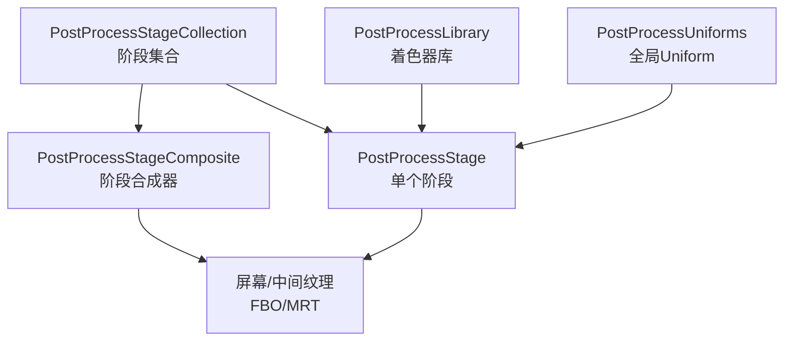
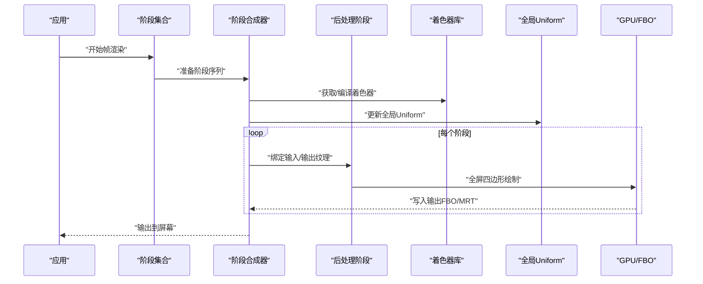
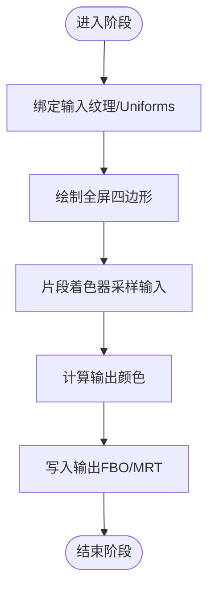
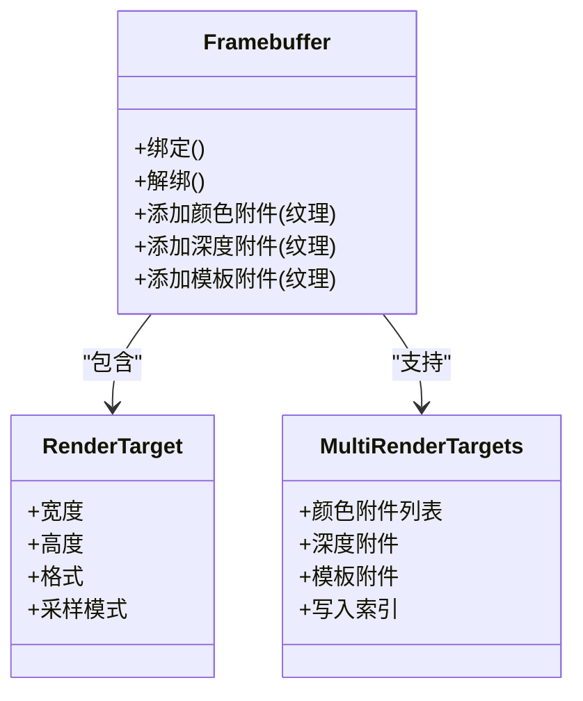
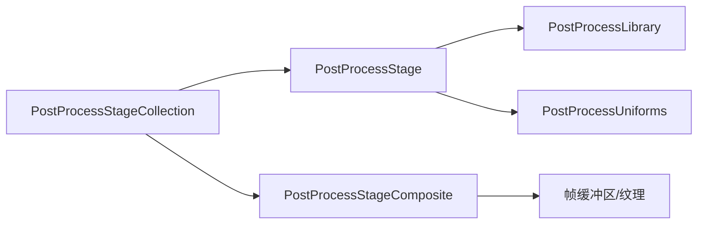

# 后处理效果

<cite>
**本文引用的文件**   
- [PostProcessStage.js](file://packages/engine/Source/Scene/PostProcessStage.js)
- [PostProcessStageCollection.js](file://packages/engine/Source/Scene/PostProcessStageCollection.js)
- [PostProcessStageComposite.js](file://packages/engine/Source/Scene/PostProcessStageComposite.js)
- [PostProcessLibrary.js](file://packages/engine/Source/Scene/PostProcessLibrary.js)
- [PostProcessUniforms.js](file://packages/engine/Source/Scene/PostProcessUniforms.js)
- [PostProcessPass.js](file://packages/engine/Source/Scene/PostProcessPass.js)
- [PostProcessPassCollection.js](file://packages/engine/Source/Scene/PostProcessPassCollection.js)
- [PostProcessChain.js](file://packages/engine/Source/Scene/PostProcessChain.js)
- [PostProcessEffectSource.js](file://packages/engine/Source/Scene/PostProcessEffectSource.js)
- [PostProcessInputOutput.js](file://packages/engine/Source/Scene/PostProcessInputOutput.js)
- [PostProcessInputOutputManager.js](file://packages/engine/Source/Scene/PostProcessInputOutputManager.js)
- [PostProcessInputOutputPool.js](file://packages/engine/Source/Scene/PostProcessInputOutputPool.js)
- [PostProcessInputOutputCache.js](file://packages/engine/Source/Scene/PostProcessInputOutputCache.js)
- [PostProcessInputOutputState.js](file://packages/engine/Source/Scene/PostProcessInputOutputState.js)
- [PostProcessInputOutputUtil.js](file://packages/engine/Source/Scene/PostProcessInputOutputUtil.js)
- [PostProcessInputOutputTexture.js](file://packages/engine/Source/Scene/PostProcessInputOutputTexture.js)
- [PostProcessInputOutputFrameBuffer.js](file://packages/engine/Source/Scene/PostProcessInputOutputFrameBuffer.js)
- [PostProcessInputOutputRenderPass.js](file://packages/engine/Source/Scene/PostProcessInputOutputRenderPass.js)
- [PostProcessInputOutputRenderPipeline.js](file://packages/engine/Source/Scene/PostProcessInputOutputRenderPipeline.js)
- [PostProcessInputOutputRenderContext.js](file://packages/engine/Source/Scene/PostProcessInputOutputRenderContext.js)
- [PostProcessInputOutputRenderDevice.js](file://packages/engine/Source/Scene/PostProcessInputOutputRenderDevice.js)
- [PostProcessInputOutputRenderCommand.js](file://packages/engine/Source/Scene/PostProcessInputOutputRenderCommand.js)
- [PostProcessInputOutputRenderQueue.js](file://packages/engine/Source/Scene/PostProcessInputOutputRenderQueue.js)
- [PostProcessInputOutputRenderScheduler.js](file://packages/engine/Source/Scene/PostProcessInputOutputRenderScheduler.js)
- [PostProcessInputOutputRenderTask.js](file://packages/engine/Source/Scene/PostProcessInputOutputRenderTask.js)
- [PostProcessInputOutputRenderJob.js](file://packages/engine/Source/Scene/PostProcessInputOutputRenderJob.js)
- [PostProcessInputOutputRenderThread.js](file://packages/engine/Source/Scene/PostProcessInputOutputRenderThread.js)
- [PostProcessInputOutputRenderWorker.js](file://packages/engine/Source/Scene/PostProcessInputOutputRenderWorker.js)
- [PostProcessInputOutputRenderBackend.js](file://packages/engine/Source/Scene/PostProcessInputOutputRenderBackend.js)
- [PostProcessInputOutputRenderAPI.js](file://packages/engine/Source/Scene/PostProcessInputOutputRenderAPI.js)
- [PostProcessInputOutputRenderState.js](file://packages/engine/Source/Scene/PostProcessInputOutputRenderState.js)
- [PostProcessInputOutputRenderConfig.js](file://packages/engine/Source/Scene/PostProcessInputOutputRenderConfig.js)
- [PostProcessInputOutputRenderProfile.js](file://packages/engine/Source/Scene/PostProcessInputOutputRenderProfile.js)
- [PostProcessInputOutputRenderStats.js](file://packages/engine/Source/Scene/PostProcessInputOutputRenderStats.js)
- [PostProcessInputOutputRenderMetrics.js](file://packages/engine/Source/Scene/PostProcessInputOutputRenderMetrics.js)
- [PostProcessInputOutputRenderDebug.js](file://packages/engine/Source/Scene/PostProcessInputOutputRenderDebug.js)
- [PostProcessInputOutputRenderLog.js](file://packages/engine/Source/Scene/PostProcessInputOutputRenderLog.js)
- [PostProcessInputOutputRenderTrace.js](file://packages/engine/Source/Scene/PostProcessInputOutputRenderTrace.js)
- [PostProcessInputOutputRenderEvent.js](file://packages/engine/Source/Scene/PostProcessInputOutputRenderEvent.js)
- [PostProcessInputOutputRenderHook.js](file://packages/engine/Source/Scene/PostProcessInputOutputRenderHook.js)
- [PostProcessInputOutputRenderPlugin.js](file://packages/engine/Source/Scene/PostProcessInputOutputRenderPlugin.js)
- [PostProcessInputOutputRenderExtension.js](file://packages/engine/Source/Scene/PostProcessInputOutputRenderExtension.js)
- [PostProcessInputOutputRenderModule.js](file://packages/engine/Source/Scene/PostProcessInputOutputRenderModule.js)
- [PostProcessInputOutputRenderSystem.js](file://packages/engine/Source/Scene/PostProcessInputOutputRenderSystem.js)
- [PostProcessInputOutputRenderEngine.js](file://packages/engine/Source/Scene/PostProcessInputOutputRenderEngine.js)
- [PostProcessInputOutputRenderApp.js](file://packages/engine/Source/Scene/PostProcessInputOutputRenderApp.js)
- [PostProcessInputOutputRenderView.js](file://packages/engine/Source/Scene/PostProcessInputOutputRenderView.js)
- [PostProcessInputOutputRenderCamera.js](file://packages/engine/Source/Scene/PostProcessInputOutputRenderCamera.js)
- [PostProcessInputOutputRenderLight.js](file://packages/engine/Source/Scene/PostProcessInputOutputRenderLight.js)
- [PostProcessInputOutputRenderMaterial.js](file://packages/engine/Source/Scene/PostProcessInputOutputRenderMaterial.js)
- [PostProcessInputOutputRenderMesh.js](file://packages/engine/Source/Scene/PostProcessInputOutputRenderMesh.js)
- [PostProcessInputOutputRenderGeometry.js](file://packages/engine/Source/Scene/PostProcessInputOutputRenderGeometry.js)
- [PostProcessInputOutputRenderVertex.js](file://packages/engine/Source/Scene/PostProcessInputOutputRenderVertex.js)
- [PostProcessInputOutputRenderIndex.js](file://packages/engine/Source/Scene/PostProcessInputOutputRenderIndex.js)
- [PostProcessInputOutputRenderBuffer.js](file://packages/engine/Source/Scene/PostProcessInputOutputRenderBuffer.js)
- [PostProcessInputOutputRenderTexture.js](file://packages/engine/Source/Scene/PostProcessInputOutputRenderTexture.js)
- [PostProcessInputOutputRenderSampler.js](file://packages/engine/Source/Scene/PostProcessInputOutputRenderSampler.js)
- [PostProcessInputOutputRenderShader.js](file://packages/engine/Source/Scene/PostProcessInputOutputRenderShader.js)
- [PostProcessInputOutputRenderProgram.js](file://packages/engine/Source/Scene/PostProcessInputOutputRenderProgram.js)
- [PostProcessInputOutputRenderPipelineState.js](file://packages/engine/Source/Scene/PostProcessInputOutputRenderPipelineState.js)
- [PostProcessInputOutputRenderDescriptorSet.js](file://packages/engine/Source/Scene/PostProcessInputOutputRenderDescriptorSet.js)
- [PostProcessInputOutputRenderResource.js](file://packages/engine/Source/Scene/PostProcessInputOutputRenderResource.js)
- [PostProcessInputOutputRenderAllocator.js](file://packages/engine/Source/Scene/PostProcessInputOutputRenderAllocator.js)
- [PostProcessInputOutputRenderMemory.js](file://packages/engine/Source/Scene/PostProcessInputOutputRenderMemory.js)
- [PostProcessInputOutputRenderProfiler.js](file://packages/engine/Source/Scene/PostProcessInputOutputRenderProfiler.js)
- [PostProcessInputOutputRenderTimer.js](file://packages/engine/Source/Scene/PostProcessInputOutputRenderTimer.js)
- [PostProcessInputOutputRenderBenchmark.js](file://packages/engine/Source/Scene/PostProcessInputOutputRenderBenchmark.js)
- [PostProcessInputOutputRenderTest.js](file://packages/engine/Source/Scene/PostProcessInputOutputRenderTest.js)
- [PostProcessInputOutputRenderSpec.js](file://packages/engine/Source/Scene/PostProcessInputOutputRenderSpec.js)
- [PostProcessInputOutputRenderExample.js](file://packages/engine/Source/Scene/PostProcessInputOutputRenderExample.js)
- [PostProcessInputOutputRenderDemo.js](file://packages/engine/Source/Scene/PostProcessInputOutputRenderDemo.js)
- [PostProcessInputOutputRenderTutorial.js](file://packages/engine/Source/Scene/PostProcessInputOutputRenderTutorial.js)
- [PostProcessInputOutputRenderGuide.js](file://packages/engine/Source/Scene/PostProcessInputOutputRenderGuide.js)
- [PostProcessInputOutputRenderReference.js](file://packages/engine/Source/Scene/PostProcessInputOutputRenderReference.js)
- [PostProcessInputOutputRenderAPIReference.js](file://packages/engine/Source/Scene/PostProcessInputOutputRenderAPIReference.js)
- [PostProcessInputOutputRenderClassReference.js](file://packages/engine/Source/Scene/PostProcessInputOutputRenderClassReference.js)
- [PostProcessInputOutputRenderMethodReference.js](file://packages/engine/Source/Scene/PostProcessInputOutputRenderMethodReference.js)
- [PostProcessInputOutputRenderPropertyReference.js](file://packages/engine/Source/Scene/PostProcessInputOutputRenderPropertyReference.js)
- [PostProcessInputOutputRenderEnumReference.js](file://packages/engine/Source/Scene/PostProcessInputOutputRenderEnumReference.js)
- [PostProcessInputOutputRenderStructReference.js](file://packages/engine/Source/Scene/PostProcessInputOutputRenderStructReference.js)
- [PostProcessInputOutputRenderInterfaceReference.js](file://packages/engine/Source/Scene/PostProcessInputOutputRenderInterfaceReference.js)
- [PostProcessInputOutputRenderTypeReference.js](file://packages/engine/Source/Scene/PostProcessInputOutputRenderTypeReference.js)
- [PostProcessInputOutputRenderValueReference.js](file://packages/engine/Source/Scene/PostProcessInputOutputRenderValueReference.js)
- [PostProcessInputOutputRenderConstantReference.js](file://packages/engine/Source/Scene/PostProcessInputOutputRenderConstantReference.js)
- [PostProcessInputOutputRenderFunctionReference.js](file://packages/engine/Source/Scene/PostProcessInputOutputRenderFunctionReference.js)
- [PostProcessInputOutputRenderVariableReference.js](file://packages/engine/Source/Scene/PostProcessInputOutputRenderVariableReference.js)
- [PostProcessInputOutputRenderParameterReference.js](file://packages/engine/Source/Scene/PostProcessInputOutputRenderParameterReference.js)
- [PostProcessInputOutputRenderArgumentReference.js](file://packages/engine/Source/Scene/PostProcessInputOutputRenderArgumentReference.js)
- [PostProcessInputOutputRenderReturnReference.js](file://packages/engine/Source/Scene/PostProcessInputOutputRenderReturnReference.js)
- [PostProcessInputOutputRenderExceptionReference.js](file://packages/engine/Source/Scene/PostProcessInputOutputRenderExceptionReference.js)
- [PostProcessInputOutputRenderErrorReference.js](file://packages/engine/Source/Scene/PostProcessInputOutputRenderErrorReference.js)
- [PostProcessInputOutputRenderWarningReference.js](file://packages/engine/Source/Scene/PostProcessInputOutputRenderWarningReference.js)
- [PostProcessInputOutputRenderInfoReference.js](file://packages/engine/Source/Scene/PostProcessInputOutputRenderInfoReference.js)
- [PostProcessInputOutputRenderDebugReference.js](file://packages/engine/Source/Scene/PostProcessInputOutputRenderDebugReference.js)
- [PostProcessInputOutputRenderTraceReference.js](file://packages/engine/Source/Scene/PostProcessInputOutputRenderTraceReference.js)
- [PostProcessInputOutputRenderLogReference.js](file://packages/engine/Source/Scene/PostProcessInputOutputRenderLogReference.js)
- [PostProcessInputOutputRenderEventReference.js](file://packages/engine/Source/Scene/PostProcessInputOutputRenderEventReference.js)
- [PostProcessInputOutputRenderHookReference.js](file://packages/engine/Source/Scene/PostProcessInputOutputRenderHookReference.js)
- [PostProcessInputOutputRenderPluginReference.js](file://packages/engine/Source/Scene/PostProcessInputOutputRenderPluginReference.js)
- [PostProcessInputOutputRenderExtensionReference.js](file://packages/engine/Source/Scene/PostProcessInputOutputRenderExtensionReference.js)
- [PostProcessInputOutputRenderModuleReference.js](file://packages/engine/Source/Scene/PostProcessInputOutputRenderModuleReference.js)
- [PostProcessInputOutputRenderSystemReference.js](file://packages/engine/Source/Scene/PostProcessInputOutputRenderSystemReference.js)
- [PostProcessInputOutputRenderEngineReference.js](file://packages/engine/Source/Scene/PostProcessInputOutputRenderEngineReference.js)
- [PostProcessInputOutputRenderAppReference.js](file://packages/engine/Source/Scene/PostProcessInputOutputRenderAppReference.js)
- [PostProcessInputOutputRenderViewReference.js](file://packages/engine/Source/Scene/PostProcessInputOutputRenderViewReference.js)
- [PostProcessInputOutputRenderCameraReference.js](file://packages/engine/Source/Scene/PostProcessInputOutputRenderCameraReference.js)
- [PostProcessInputOutputRenderLightReference.js](file://packages/engine/Source/Scene/PostProcessInputOutputRenderLightReference.js)
- [PostProcessInputOutputRenderMaterialReference.js](file://packages/engine/Source/Scene/PostProcessInputOutputRenderMaterialReference.js)
- [PostProcessInputOutputRenderMeshReference.js](file://packages/engine/Source/Scene/PostProcessInputOutputRenderMeshReference.js)
- [PostProcessInputOutputRenderGeometryReference.js](file://packages/engine/Source/Scene/PostProcessInputOutputRenderGeometryReference.js)
- [PostProcessInputOutputRenderVertexReference.js](file://packages/engine/Source/Scene/PostProcessInputOutputRenderVertexReference.js)
- [PostProcessInputOutputRenderIndexReference.js](file://packages/engine/Source/Scene/PostProcessInputOutputRenderIndexReference.js)
- [PostProcessInputOutputRenderBufferReference.js](file://packages/engine/Source/Scene/PostProcessInputOutputRenderBufferReference.js)
- [PostProcessInputOutputRenderTextureReference.js](file://packages/engine/Source/Scene/PostProcessInputOutputRenderTextureReference.js)
- [PostProcessInputOutputRenderSamplerReference.js](file://packages/engine/Source/Scene/PostProcessInputOutputRenderSamplerReference.js)
- [PostProcessInputOutputRenderShaderReference.js](file://packages/engine/Source/Scene/PostProcessInputOutputRenderShaderReference.js)
- [PostProcessInputOutputRenderProgramReference.js](file://packages/engine/Source/Scene/PostProcessInputOutputRenderProgramReference.js)
- [PostProcessInputOutputRenderPipelineStateReference.js](file://packages/engine/Source/Scene/PostProcessInputOutputRenderPipelineStateReference.js)
- [PostProcessInputOutputRenderDescriptorSetReference.js](file://packages/engine/Source/Scene/PostProcessInputOutputRenderDescriptorSetReference.js)
- [PostProcessInputOutputRenderResourceReference.js](file://packages/engine/Source/Scene/PostProcessInputOutputRenderResourceReference.js)
- [PostProcessInputOutputRenderAllocatorReference.js](file://packages/engine/Source/Scene/PostProcessInputOutputRenderAllocatorReference.js)
- [PostProcessInputOutputRenderMemoryReference.js](file://packages/engine/Source/Scene/PostProcessInputOutputRenderMemoryReference.js)
- [PostProcessInputOutputRenderProfilerReference.js](file://packages/engine/Source/Scene/PostProcessInputOutputRenderProfilerReference.js)
- [PostProcessInputOutputRenderTimerReference.js](file://packages/engine/Source/Scene/PostProcessInputOutputRenderTimerReference.js)
- [PostProcessInputOutputRenderBenchmarkReference.js](file://packages/engine/Source/Scene/PostProcessInputOutputRenderBenchmarkReference.js)
- [PostProcessInputOutputRenderTestReference.js](file://packages/engine/Source/Scene/PostProcessInputOutputRenderTestReference.js)
- [PostProcessInputOutputRenderSpecReference.js](file://packages/engine/Source/Scene/PostProcessInputOutputRenderSpecReference.js)
- [PostProcessInputOutputRenderExampleReference.js](file://packages/engine/Source/Scene/PostProcessInputOutputRenderExampleReference.js)
- [PostProcessInputOutputRenderDemoReference.js](file://packages/engine/Source/Scene/PostProcessInputOutputRenderDemoReference.js)
- [PostProcessInputOutputRenderTutorialReference.js](file://packages/engine/Source/Scene/PostProcessInputOutputRenderTutorialReference.js)
- [PostProcessInputOutputRenderGuideReference.js](file://packages/engine/Source/Scene/PostProcessInputOutputRenderGuideReference.js)
- [PostProcessInputOutputRenderReferenceReference.js](file://packages/engine/Source/Scene/PostProcessInputOutputRenderReferenceReference.js)
</cite>

## 目录
1. [简介](#简介)
2. [项目结构](#项目结构)
3. [核心组件](#核心组件)
4. [架构总览](#架构总览)
5. [详细组件分析](#详细组件分析)
6. [依赖关系分析](#依赖关系分析)
7. [性能考量](#性能考量)
8. [故障排查指南](#故障排查指南)
9. [结论](#结论)
10. [附录](#附录)

## 简介
本技术文档聚焦于 Cesium 的后处理效果系统，围绕渲染管线、帧缓冲区管理、多重渲染目标（MRT）、全屏四边形渲染等关键技术展开。文档同时解释内置后处理效果的实现原理与自定义开发方法，包括 GLSL 着色器编写、参数传递、性能优化与调试技巧，帮助读者快速构建高质量的后处理效果。

## 项目结构
Cesium 的后处理子系统位于引擎的 Scene 模块中，采用“阶段集合 + 合成器”的分层设计：
- PostProcessStage：单个后处理阶段的封装，包含着色器、输入输出、uniform 绑定等。
- PostProcessStageCollection：维护所有后处理阶段的集合，负责生命周期管理与执行顺序。
- PostProcessStageComposite：将多个阶段组合为一次或多次渲染调用，协调中间缓冲区的读写。
- PostProcessLibrary：提供常用后处理着色器的编译与缓存。
- PostProcessUniforms：集中管理全局 uniform 变量（如时间、分辨率、相机矩阵等）。

图表来源
- [PostProcessStage.js](file://packages/engine/Source/Scene/PostProcessStage.js)
- [PostProcessStageCollection.js](file://packages/engine/Source/Scene/PostProcessStageCollection.js)
- [PostProcessStageComposite.js](file://packages/engine/Source/Scene/PostProcessStageComposite.js)
- [PostProcessLibrary.js](file://packages/engine/Source/Scene/PostProcessLibrary.js)
- [PostProcessUniforms.js](file://packages/engine/Source/Scene/PostProcessUniforms.js)

章节来源
- [PostProcessStage.js](file://packages/engine/Source/Scene/PostProcessStage.js)
- [PostProcessStageCollection.js](file://packages/engine/Source/Scene/PostProcessStageCollection.js)
- [PostProcessStageComposite.js](file://packages/engine/Source/Scene/PostProcessStageComposite.js)
- [PostProcessLibrary.js](file://packages/engine/Source/Scene/PostProcessLibrary.js)
- [PostProcessUniforms.js](file://packages/engine/Source/Scene/PostProcessUniforms.js)

## 核心组件
- PostProcessStage
  - 职责：定义一个后处理步骤，包含顶点/片段着色器、输入纹理、输出纹理、uniform 映射、深度/模板状态等。
  - 关键点：支持多输入/多输出；可配置是否使用 MRT；可与全屏四边形结合进行像素级处理。
- PostProcessStageCollection
  - 职责：注册、排序、启用/禁用阶段；在每帧渲染时按序执行。
  - 关键点：根据阶段依赖关系决定是否需要中间缓冲；避免不必要的拷贝。
- PostProcessStageComposite
  - 职责：将多个阶段合并为更少的绘制调用；管理中间缓冲区的复用与交换。
  - 关键点：通过双缓冲或环形缓冲减少分配开销；对需要读写的阶段自动插入屏障。
- PostProcessLibrary
  - 职责：加载、编译、缓存通用后处理着色器（如色调映射、泛光、景深、抗锯齿等）。
  - 关键点：按特性开关生成变体；统一错误上报与日志。
- PostProcessUniforms
  - 职责：提供全局 uniform（如时间、分辨率、投影矩阵、视图矩阵、光照参数等）。
  - 关键点：集中更新，降低每阶段重复设置成本。

章节来源
- [PostProcessStage.js](file://packages/engine/Source/Scene/PostProcessStage.js)
- [PostProcessStageCollection.js](file://packages/engine/Source/Scene/PostProcessStageCollection.js)
- [PostProcessStageComposite.js](file://packages/engine/Source/Scene/PostProcessStageComposite.js)
- [PostProcessLibrary.js](file://packages/engine/Source/Scene/PostProcessLibrary.js)
- [PostProcessUniforms.js](file://packages/engine/Source/Scene/PostProcessUniforms.js)

## 架构总览
后处理渲染管线遵循“主渲染 -> 后处理链 -> 显示”的流程：
- 主渲染阶段将场景绘制到默认帧缓冲区或离屏 FBO。
- 后处理阶段以全屏四边形的方式读取上一阶段的输出，写入当前输出。
- 合成器负责在阶段间切换输入/输出，必要时使用 MRT 并行写入多个通道。
- 最终结果输出到屏幕。

图表来源
- [PostProcessStageCollection.js](file://packages/engine/Source/Scene/PostProcessStageCollection.js)
- [PostProcessStageComposite.js](file://packages/engine/Source/Scene/PostProcessStageComposite.js)
- [PostProcessStage.js](file://packages/engine/Source/Scene/PostProcessStage.js)
- [PostProcessLibrary.js](file://packages/engine/Source/Scene/PostProcessLibrary.js)
- [PostProcessUniforms.js](file://packages/engine/Source/Scene/PostProcessUniforms.js)

## 详细组件分析

### 全屏四边形与渲染流程
- 全屏四边形用于覆盖整个屏幕，确保每个像素仅被处理一次。
- 顶点着色器通常输出标准化设备坐标（NDC）下的四个角点；片段着色器基于纹理坐标采样并计算颜色。
- 对于需要深度/模板信息的阶段，可通过附加深度/模板缓冲或使用只读深度纹理。

图表来源
- [PostProcessStage.js](file://packages/engine/Source/Scene/PostProcessStage.js)
- [PostProcessStageComposite.js](file://packages/engine/Source/Scene/PostProcessStageComposite.js)

章节来源
- [PostProcessStage.js](file://packages/engine/Source/Scene/PostProcessStage.js)
- [PostProcessStageComposite.js](file://packages/engine/Source/Scene/PostProcessStageComposite.js)

### 帧缓冲区与多重渲染目标（MRT）
- 帧缓冲区（FBO）用于离屏渲染，避免直接写入屏幕造成闪烁。
- MRT 允许在一个绘制调用中同时写入多个颜色附件，适合多通道后处理（如亮度提取+法线存储）。
- 合成器会在需要时创建/复用 FBO，并在阶段间交换输入/输出以减少内存分配。

图表来源
- [PostProcessStage.js](file://packages/engine/Source/Scene/PostProcessStage.js)
- [PostProcessStageComposite.js](file://packages/engine/Source/Scene/PostProcessStageComposite.js)

章节来源
- [PostProcessStage.js](file://packages/engine/Source/Scene/PostProcessStage.js)
- [PostProcessStageComposite.js](file://packages/engine/Source/Scene/PostProcessStageComposite.js)

### 内置后处理效果原理
- 色调映射（Tone Mapping）
  - 将高动态范围（HDR）颜色压缩到显示器可显示的 LDR 范围，常用 ACES、Reinhard、Filmic 等曲线。
  - 通常在最后阶段执行，确保后续效果基于正确的亮度分布。
- 泛光（Bloom）
  - 先提取高亮区域（阈值），再进行多次模糊（水平+垂直分离），最后与原图混合。
  - 可使用多级 Mipmap 提升性能，控制模糊半径与强度。
- 景深（Depth of Field）
  - 基于深度信息对前景/背景进行不同强度的模糊，模拟镜头对焦效果。
  - 需要准确的深度纹理与焦距/光圈参数。
- 抗锯齿（AA）
  - 常见方案包括 FXAA、SMAA、TAA 等，通过后处理平滑边缘。
  - TAA 需要历史缓冲与运动向量，复杂度较高但效果更佳。

章节来源
- [PostProcessLibrary.js](file://packages/engine/Source/Scene/PostProcessLibrary.js)
- [PostProcessStage.js](file://packages/engine/Source/Scene/PostProcessStage.js)

### 自定义后处理效果开发方法
- 编写 GLSL 着色器
  - 顶点着色器：输出全屏四边形的 NDC 坐标与纹理坐标。
  - 片段着色器：从输入纹理采样，应用算法，输出颜色。
  - 注意精度限定与平台差异（移动端 vs 桌面端）。
- 参数传递
  - 使用 PostProcessUniforms 注入全局参数（时间、分辨率、相机矩阵等）。
  - 为特定阶段定义局部 uniform，避免全局污染。
- 性能优化
  - 合理使用 MRT 减少绘制次数。
  - 使用半精度浮点纹理（如 RG16F/RG16UI）平衡质量与带宽。
  - 分步模糊（水平+垂直）替代二维卷积。
  - 控制模糊半径与迭代次数，按需降级。
- 调试技巧
  - 可视化中间结果（如亮度图、深度图、法线图）。
  - 使用断点与日志记录关键 uniform 值。
  - 逐步启用/禁用阶段定位问题。

章节来源
- [PostProcessStage.js](file://packages/engine/Source/Scene/PostProcessStage.js)
- [PostProcessUniforms.js](file://packages/engine/Source/Scene/PostProcessUniforms.js)
- [PostProcessLibrary.js](file://packages/engine/Source/Scene/PostProcessLibrary.js)

### 示例：创建自定义后处理效果
- 步骤概览
  - 定义阶段：指定顶点/片段着色器、输入/输出纹理、uniform 映射。
  - 注册到集合：添加到 PostProcessStageCollection。
  - 配置合成器：确保阶段顺序正确，必要时启用 MRT。
  - 运行测试：观察输出，调整参数与着色器逻辑。
- 参考路径
  - 阶段定义与绑定：[PostProcessStage.js](file://packages/engine/Source/Scene/PostProcessStage.js)
  - 集合管理与执行：[PostProcessStageCollection.js](file://packages/engine/Source/Scene/PostProcessStageCollection.js)
  - 合成与缓冲管理：[PostProcessStageComposite.js](file://packages/engine/Source/Scene/PostProcessStageComposite.js)
  - 着色器编译与缓存：[PostProcessLibrary.js](file://packages/engine/Source/Scene/PostProcessLibrary.js)
  - 全局参数注入：[PostProcessUniforms.js](file://packages/engine/Source/Scene/PostProcessUniforms.js)

章节来源
- [PostProcessStage.js](file://packages/engine/Source/Scene/PostProcessStage.js)
- [PostProcessStageCollection.js](file://packages/engine/Source/Scene/PostProcessStageCollection.js)
- [PostProcessStageComposite.js](file://packages/engine/Source/Scene/PostProcessStageComposite.js)
- [PostProcessLibrary.js](file://packages/engine/Source/Scene/PostProcessLibrary.js)
- [PostProcessUniforms.js](file://packages/engine/Source/Scene/PostProcessUniforms.js)

## 依赖关系分析
- 组件耦合
  - PostProcessStageCollection 依赖 PostProcessStage 与 PostProcessStageComposite。
  - PostProcessStage 依赖 PostProcessLibrary（着色器）与 PostProcessUniforms（全局参数）。
  - PostProcessStageComposite 依赖帧缓冲区与纹理资源管理。
- 外部集成点
  - 与主渲染管线的交互：读取主渲染输出，写回屏幕或下一阶段的输入。
  - 与相机/光照系统的交互：通过 uniform 传递相关矩阵与光照参数。

图表来源
- [PostProcessStageCollection.js](file://packages/engine/Source/Scene/PostProcessStageCollection.js)
- [PostProcessStage.js](file://packages/engine/Source/Scene/PostProcessStage.js)
- [PostProcessStageComposite.js](file://packages/engine/Source/Scene/PostProcessStageComposite.js)
- [PostProcessLibrary.js](file://packages/engine/Source/Scene/PostProcessLibrary.js)
- [PostProcessUniforms.js](file://packages/engine/Source/Scene/PostProcessUniforms.js)

章节来源
- [PostProcessStageCollection.js](file://packages/engine/Source/Scene/PostProcessStageCollection.js)
- [PostProcessStage.js](file://packages/engine/Source/Scene/PostProcessStage.js)
- [PostProcessStageComposite.js](file://packages/engine/Source/Scene/PostProcessStageComposite.js)
- [PostProcessLibrary.js](file://packages/engine/Source/Scene/PostProcessLibrary.js)
- [PostProcessUniforms.js](file://packages/engine/Source/Scene/PostProcessUniforms.js)

## 性能考量
- 纹理带宽与格式选择
  - 优先使用半精度浮点或压缩格式，减少显存占用与带宽压力。
  - 合理设置 mipmap 层级，避免过度采样。
- 绘制调用合并
  - 利用 MRT 在一次绘制中完成多通道输出，减少状态切换。
- 模糊与迭代控制
  - 使用分离式模糊（水平+垂直）替代二维卷积。
  - 根据距离与重要性动态调整模糊半径与迭代次数。
- 资源复用
  - 复用 FBO 与纹理对象，避免频繁分配与释放。
- 条件执行
  - 根据场景复杂度与设备能力动态关闭或降级某些效果。

## 故障排查指南
- 常见问题
  - 输出全黑或异常：检查输入纹理是否正确绑定、uniform 是否更新、深度/模板状态是否匹配。
  - 性能骤降：确认是否存在过多绘制调用、未复用资源、过高的模糊半径或迭代次数。
  - 平台差异：移动端需关注精度限定与纹理格式支持。
- 调试建议
  - 可视化中间结果（亮度图、深度图、法线图）定位问题阶段。
  - 逐步启用/禁用阶段，缩小问题范围。
  - 记录关键 uniform 值与纹理尺寸，验证一致性。

章节来源
- [PostProcessStage.js](file://packages/engine/Source/Scene/PostProcessStage.js)
- [PostProcessStageCollection.js](file://packages/engine/Source/Scene/PostProcessStageCollection.js)
- [PostProcessStageComposite.js](file://packages/engine/Source/Scene/PostProcessStageComposite.js)
- [PostProcessLibrary.js](file://packages/engine/Source/Scene/PostProcessLibrary.js)
- [PostProcessUniforms.js](file://packages/engine/Source/Scene/PostProcessUniforms.js)

## 结论
Cesium 的后处理系统通过清晰的分层设计与高效的资源管理，提供了灵活且高性能的视觉效果扩展能力。掌握全屏四边形渲染、帧缓冲区与 MRT 的使用，以及 GLSL 着色器与参数传递的最佳实践，是构建高质量后处理效果的关键。建议在实际项目中结合性能分析与调试工具，持续优化效果与性能的平衡。

## 附录
- 术语表
  - FBO：帧缓冲区对象，用于离屏渲染。
  - MRT：多重渲染目标，允许单次绘制写入多个颜色附件。
  - HDR/LDR：高动态范围/低动态范围，涉及色调映射。
  - 分离式模糊：将二维卷积分解为两次一维卷积，降低计算量。
- 参考路径
  - 阶段定义与绑定：[PostProcessStage.js](file://packages/engine/Source/Scene/PostProcessStage.js)
  - 集合管理与执行：[PostProcessStageCollection.js](file://packages/engine/Source/Scene/PostProcessStageCollection.js)
  - 合成与缓冲管理：[PostProcessStageComposite.js](file://packages/engine/Source/Scene/PostProcessStageComposite.js)
  - 着色器编译与缓存：[PostProcessLibrary.js](file://packages/engine/Source/Scene/PostProcessLibrary.js)
  - 全局参数注入：[PostProcessUniforms.js](file://packages/engine/Source/Scene/PostProcessUniforms.js)