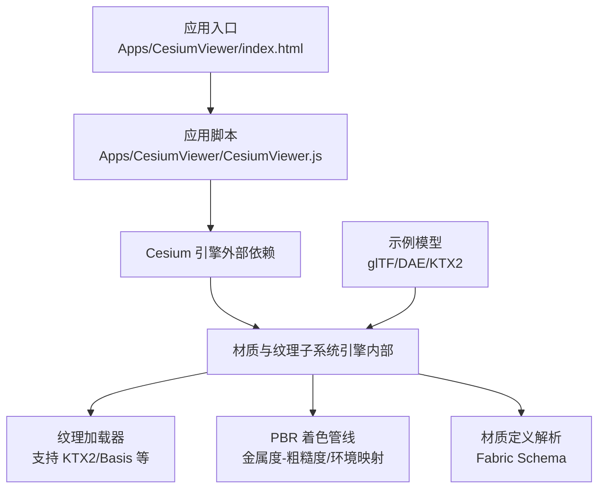
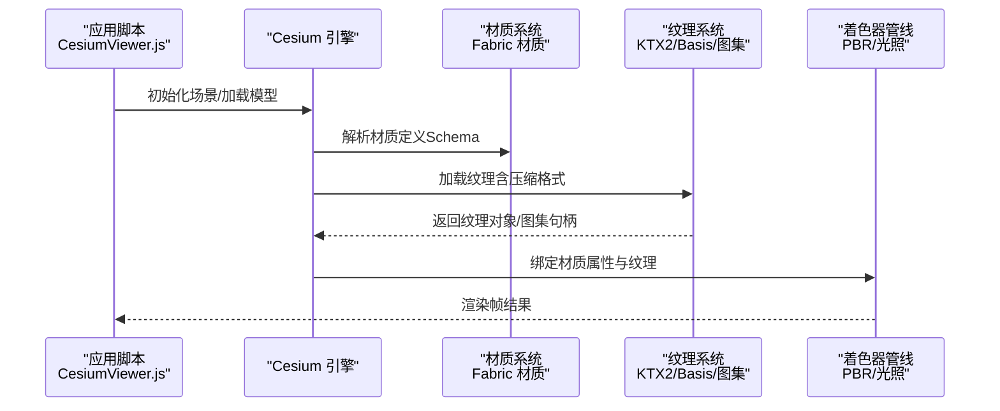
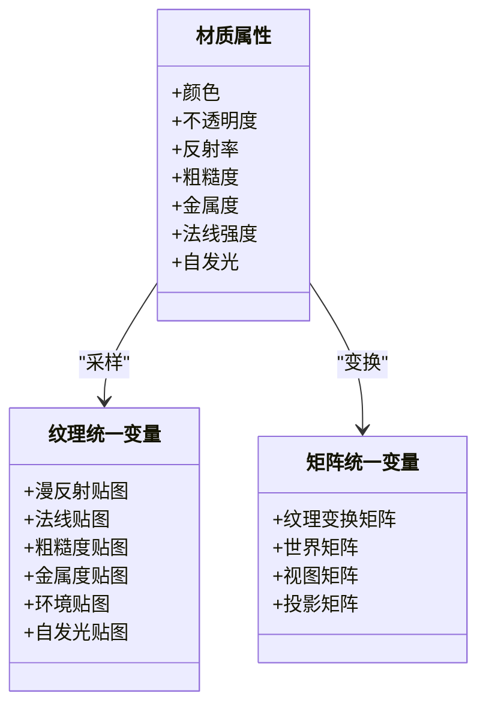
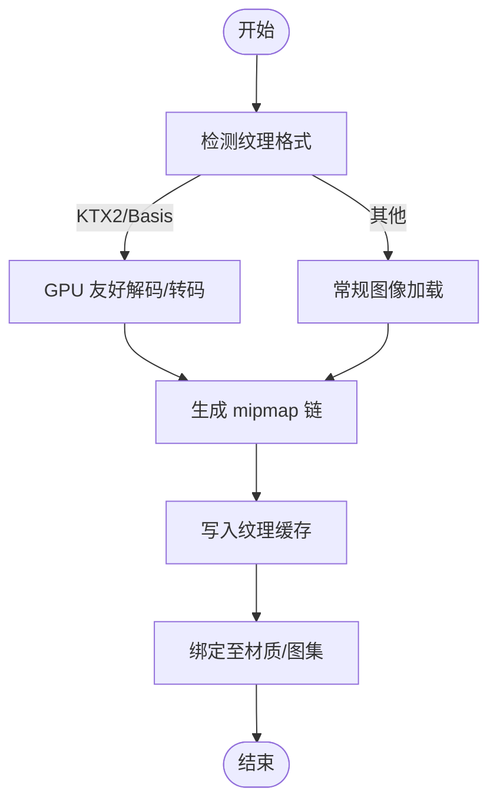
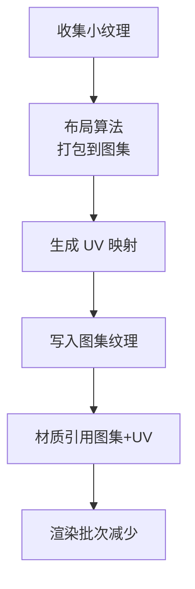
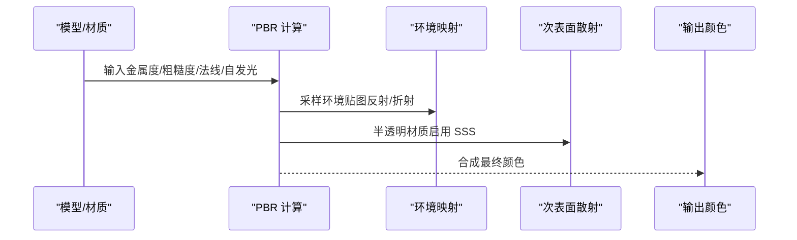
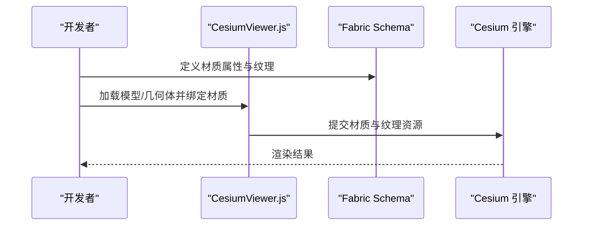
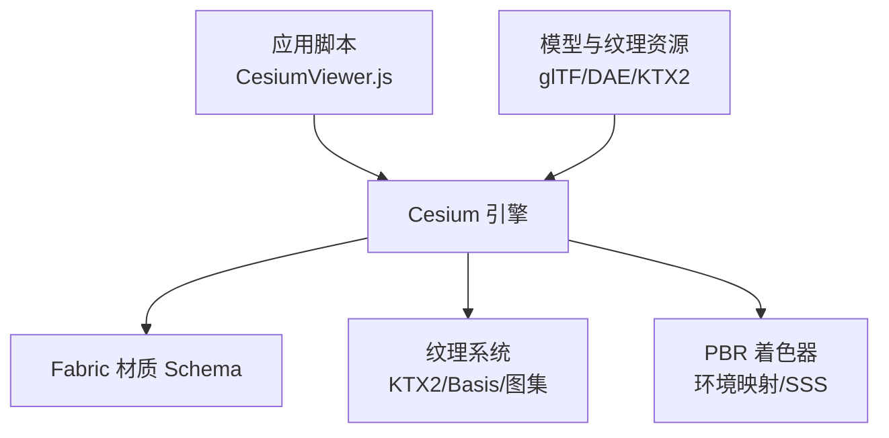

# 材质与纹理系统

<cite>
**本文引用的文件**   
- [README.md](file://README.md)
- [Material.schema.json](file://Documentation/Schemas/Fabric/Material.schema.json)
- [TextureUniforms.json](file://Documentation/Schemas/Fabric/Examples/TextureUniforms.json)
- [VectorUniforms.json](file://Documentation/Schemas/Fabric/Examples/VectorUniforms.json)
- [MatrixUniforms.json](file://Documentation/Schemas/Fabric/Examples/MatrixUniforms.json)
- [CesiumViewer.js](file://Apps/CesiumViewer/CesiumViewer.js)
- [index.html](file://Apps/CesiumViewer/index.html)
- [CesiumMilkTruck.dae](file://Apps/SampleData/models/CesiumMilkTruck/CesiumMilkTruck.dae)
- [CesiumAir.gltf](file://Apps/SampleData/models/CesiumAir/CesiumAir.gltf)
- [BoxTexturedKtx2Basis](file://Apps/SampleData/models/glTF-2.0/BoxTexturedKtx2Basis)
</cite>

## 目录
1. [简介](#简介)
2. [项目结构](#项目结构)
3. [核心组件](#核心组件)
4. [架构总览](#架构总览)
5. [详细组件分析](#详细组件分析)
6. [依赖关系分析](#依赖关系分析)
7. [性能考虑](#性能考虑)
8. [故障排查指南](#故障排查指南)
9. [结论](#结论)
10. [附录](#附录)

## 简介
本技术文档聚焦于 Cesium 的材质与纹理系统，围绕以下目标展开：
- 材质属性的定义与渲染时应用机制（颜色、透明度、反射率等物理属性模拟）
- 纹理加载流程与压缩格式支持（KTX2、Basis）
- 纹理图集管理策略
- PBR 材质的实现原理（金属度-粗糙度工作流、环境映射、次表面散射等高级特性）
- 材质创建与自定义示例路径
- 纹理优化最佳实践

说明：仓库中未包含完整的引擎源码，但提供了 Fabric 材质 Schema、示例数据与演示应用。本文基于这些材料进行系统化梳理与解读，帮助读者理解材质与纹理在 Cesium 中的工作方式与扩展点。

## 项目结构
从仓库视角看，与材质和纹理相关的资料主要分布在如下位置：
- Documentation/Schemas/Fabric：Fabric 材质系统的 JSON Schema 与示例，定义了材质属性、uniform 类型与用法
- Apps/CesiumViewer：最小可运行示例，展示如何引入 Cesium 并加载模型/场景
- Apps/SampleData/models：包含 glTF/GLB、DAE 等模型资源，其中部分使用 KTX2/Basis 纹理
- Specs/Data：大量测试数据，涵盖多种纹理与材质相关用例（如 glTF 纹理、PBR 参数、混合压缩等）

图表来源
- [index.html](file://Apps/CesiumViewer/index.html)
- [CesiumViewer.js](file://Apps/CesiumViewer/CesiumViewer.js)
- [Material.schema.json](file://Documentation/Schemas/Fabric/Material.schema.json)
- [CesiumMilkTruck.dae](file://Apps/SampleData/models/CesiumMilkTruck/CesiumMilkTruck.dae)
- [CesiumAir.gltf](file://Apps/SampleData/models/CesiumAir/CesiumAir.gltf)
- [BoxTexturedKtx2Basis](file://Apps/SampleData/models/glTF-2.0/BoxTexturedKtx2Basis)

章节来源
- [README.md](file://README.md)
- [index.html](file://Apps/CesiumViewer/index.html)
- [CesiumViewer.js](file://Apps/CesiumViewer/CesiumViewer.js)
- [Material.schema.json](file://Documentation/Schemas/Fabric/Material.schema.json)

## 核心组件
本节从“材质定义—纹理加载—渲染管线”的链路出发，概述关键能力与职责边界。

- 材质定义与属性
  - 通过 Fabric 材质 Schema 描述材质属性与 uniform 类型，包括向量、矩阵、纹理等
  - 常见物理属性：颜色、不透明度、反射率、金属度、粗糙度、法线贴图强度、自发光等
  - 参考路径：[Material.schema.json](file://Documentation/Schemas/Fabric/Material.schema.json)、[TextureUniforms.json](file://Documentation/Schemas/Fabric/Examples/TextureUniforms.json)、[VectorUniforms.json](file://Documentation/Schemas/Fabric/Examples/VectorUniforms.json)、[MatrixUniforms.json](file://Documentation/Schemas/Fabric/Examples/MatrixUniforms.json)

- 纹理加载与压缩
  - 支持标准图像格式与 GPU 压缩格式（KTX2、Basis），减少带宽与显存占用
  - 纹理图集（Atlas）用于合并多张小图，降低绘制批次
  - 参考路径：[BoxTexturedKtx2Basis](file://Apps/SampleData/models/glTF-2.0/BoxTexturedKtx2Basis)

- PBR 材质工作流
  - 金属度-粗糙度工作流：以金属度控制导体/绝缘体行为，粗糙度控制高光扩散
  - 环境映射：提供反射/折射近似，增强真实感
  - 次表面散射：对半透明材质（皮肤、蜡、玉石等）进行体积光散射近似
  - 参考路径：[CesiumAir.gltf](file://Apps/SampleData/models/CesiumAir/CesiumAir.gltf)、[CesiumMilkTruck.dae](file://Apps/SampleData/models/CesiumMilkTruck/CesiumMilkTruck.dae)

- 渲染管线集成
  - 材质属性在着色阶段被采样与组合，结合光照模型输出最终像素颜色
  - 纹理坐标变换、过滤模式、mipmap 链生成由纹理子系统负责
  - 参考路径：[CesiumViewer.js](file://Apps/CesiumViewer/CesiumViewer.js)

章节来源
- [Material.schema.json](file://Documentation/Schemas/Fabric/Material.schema.json)
- [TextureUniforms.json](file://Documentation/Schemas/Fabric/Examples/TextureUniforms.json)
- [VectorUniforms.json](file://Documentation/Schemas/Fabric/Examples/VectorUniforms.json)
- [MatrixUniforms.json](file://Documentation/Schemas/Fabric/Examples/MatrixUniforms.json)
- [CesiumViewer.js](file://Apps/CesiumViewer/CesiumViewer.js)
- [CesiumAir.gltf](file://Apps/SampleData/models/CesiumAir/CesiumAir.gltf)
- [CesiumMilkTruck.dae](file://Apps/SampleData/models/CesiumMilkTruck/CesiumMilkTruck.dae)
- [BoxTexturedKtx2Basis](file://Apps/SampleData/models/glTF-2.0/BoxTexturedKtx2Basis)

## 架构总览
下图展示了从应用到材质与纹理子系统的整体交互流程。

图表来源
- [CesiumViewer.js](file://Apps/CesiumViewer/CesiumViewer.js)
- [Material.schema.json](file://Documentation/Schemas/Fabric/Material.schema.json)
- [TextureUniforms.json](file://Documentation/Schemas/Fabric/Examples/TextureUniforms.json)
- [BoxTexturedKtx2Basis](file://Apps/SampleData/models/glTF-2.0/BoxTexturedKtx2Basis)

## 详细组件分析

### 材质属性与 Fabric 材质 Schema
- 材质属性分类
  - 标量/向量：颜色、不透明度、强度、偏移、缩放等
  - 矩阵：纹理变换矩阵、世界/视图/投影矩阵等
  - 纹理：漫反射贴图、法线贴图、粗糙度/金属度贴图、环境贴图、自发光贴图等
- 典型属性语义
  - 颜色/不透明度：控制基础色与透明度
  - 反射率/粗糙度/金属度：影响镜面反射强度与分布
  - 法线贴图强度：控制法线扰动幅度
  - 自发光：直接贡献像素亮度
- 参考路径
  - [Material.schema.json](file://Documentation/Schemas/Fabric/Material.schema.json)
  - [TextureUniforms.json](file://Documentation/Schemas/Fabric/Examples/TextureUniforms.json)
  - [VectorUniforms.json](file://Documentation/Schemas/Fabric/Examples/VectorUniforms.json)
  - [MatrixUniforms.json](file://Documentation/Schemas/Fabric/Examples/MatrixUniforms.json)

图表来源
- [Material.schema.json](file://Documentation/Schemas/Fabric/Material.schema.json)
- [TextureUniforms.json](file://Documentation/Schemas/Fabric/Examples/TextureUniforms.json)
- [VectorUniforms.json](file://Documentation/Schemas/Fabric/Examples/VectorUniforms.json)
- [MatrixUniforms.json](file://Documentation/Schemas/Fabric/Examples/MatrixUniforms.json)

章节来源
- [Material.schema.json](file://Documentation/Schemas/Fabric/Material.schema.json)
- [TextureUniforms.json](file://Documentation/Schemas/Fabric/Examples/TextureUniforms.json)
- [VectorUniforms.json](file://Documentation/Schemas/Fabric/Examples/VectorUniforms.json)
- [MatrixUniforms.json](file://Documentation/Schemas/Fabric/Examples/MatrixUniforms.json)

### 纹理加载与压缩格式（KTX2、Basis）
- 加载流程要点
  - 识别纹理源（URL/内嵌/二进制）
  - 选择解码器（KTX2/Basis/通用图像）
  - 生成 mipmap 链与可选的立方体贴图
  - 将纹理对象注册到纹理缓存，避免重复加载
- 压缩格式优势
  - KTX2/Basis 显著降低带宽与显存占用，提升移动端性能
  - 需要 GPU 端原生支持或运行时转码
- 参考路径
  - [BoxTexturedKtx2Basis](file://Apps/SampleData/models/glTF-2.0/BoxTexturedKtx2Basis)

图表来源
- [BoxTexturedKtx2Basis](file://Apps/SampleData/models/glTF-2.0/BoxTexturedKtx2Basis)

章节来源
- [BoxTexturedKtx2Basis](file://Apps/SampleData/models/glTF-2.0/BoxTexturedKtx2Basis)

### 纹理图集管理
- 图集目的
  - 合并多张小纹理为一张大图，减少绘制批次
  - 提高缓存命中率，降低状态切换开销
- 管理策略
  - 动态/静态图集构建
  - UV 分块与边界填充（防止采样泄漏）
  - 图集更新与失效处理
- 参考路径
  - [TextureUniforms.json](file://Documentation/Schemas/Fabric/Examples/TextureUniforms.json)

图表来源
- [TextureUniforms.json](file://Documentation/Schemas/Fabric/Examples/TextureUniforms.json)

章节来源
- [TextureUniforms.json](file://Documentation/Schemas/Fabric/Examples/TextureUniforms.json)

### PBR 材质工作流与环境映射
- 金属度-粗糙度工作流
  - 金属度：区分导体（高反射）与绝缘体（低反射）
  - 粗糙度：控制微表面法线分布，影响高光扩散范围
  - 法线贴图：增加表面细节而不改变几何
- 环境映射
  - 提供反射/折射近似，增强金属与光滑表面的真实感
  - 通常使用预滤波的环境立方体贴图
- 次表面散射
  - 对半透明材质进行体积光散射近似，常用于皮肤、蜡、玉石等
- 参考路径
  - [CesiumAir.gltf](file://Apps/SampleData/models/CesiumAir/CesiumAir.gltf)
  - [CesiumMilkTruck.dae](file://Apps/SampleData/models/CesiumMilkTruck/CesiumMilkTruck.dae)

图表来源
- [CesiumAir.gltf](file://Apps/SampleData/models/CesiumAir/CesiumAir.gltf)
- [CesiumMilkTruck.dae](file://Apps/SampleData/models/CesiumMilkTruck/CesiumMilkTruck.dae)

章节来源
- [CesiumAir.gltf](file://Apps/SampleData/models/CesiumAir/CesiumAir.gltf)
- [CesiumMilkTruck.dae](file://Apps/SampleData/models/CesiumMilkTruck/CesiumMilkTruck.dae)

### 材质创建与自定义示例路径
- 通过 Fabric 材质 Schema 声明材质属性与纹理统一变量
- 在应用中加载模型或创建几何体，并为其指定材质
- 参考路径
  - [Material.schema.json](file://Documentation/Schemas/Fabric/Material.schema.json)
  - [CesiumViewer.js](file://Apps/CesiumViewer/CesiumViewer.js)
  - [index.html](file://Apps/CesiumViewer/index.html)

图表来源
- [Material.schema.json](file://Documentation/Schemas/Fabric/Material.schema.json)
- [CesiumViewer.js](file://Apps/CesiumViewer/CesiumViewer.js)
- [index.html](file://Apps/CesiumViewer/index.html)

章节来源
- [Material.schema.json](file://Documentation/Schemas/Fabric/Material.schema.json)
- [CesiumViewer.js](file://Apps/CesiumViewer/CesiumViewer.js)
- [index.html](file://Apps/CesiumViewer/index.html)

## 依赖关系分析
- 应用层依赖
  - 应用脚本通过 HTML 页面引入 Cesium，并在 JS 中创建场景、加载模型与材质
- 引擎层依赖
  - 材质系统依赖 Fabric Schema 解析材质定义
  - 纹理系统依赖压缩解码器（KTX2/Basis）与纹理缓存
  - 渲染管线依赖 PBR 着色器与环境映射资源
- 资源层依赖
  - 模型与纹理资源（glTF/DAE/KTX2）作为输入驱动材质与纹理子系统

图表来源
- [CesiumViewer.js](file://Apps/CesiumViewer/CesiumViewer.js)
- [Material.schema.json](file://Documentation/Schemas/Fabric/Material.schema.json)
- [BoxTexturedKtx2Basis](file://Apps/SampleData/models/glTF-2.0/BoxTexturedKtx2Basis)
- [CesiumAir.gltf](file://Apps/SampleData/models/CesiumAir/CesiumAir.gltf)
- [CesiumMilkTruck.dae](file://Apps/SampleData/models/CesiumMilkTruck/CesiumMilkTruck.dae)

章节来源
- [CesiumViewer.js](file://Apps/CesiumViewer/CesiumViewer.js)
- [Material.schema.json](file://Documentation/Schemas/Fabric/Material.schema.json)
- [BoxTexturedKtx2Basis](file://Apps/SampleData/models/glTF-2.0/BoxTexturedKtx2Basis)
- [CesiumAir.gltf](file://Apps/SampleData/models/CesiumAir/CesiumAir.gltf)
- [CesiumMilkTruck.dae](file://Apps/SampleData/models/CesiumMilkTruck/CesiumMilkTruck.dae)

## 性能考虑
- 纹理压缩优先
  - 使用 KTX2/Basis 减少带宽与显存占用，提升移动端性能
- 纹理图集
  - 合并小图，减少绘制批次与状态切换
- mipmap 与过滤
  - 合理设置 mipmap 链与过滤模式，避免过采样与锯齿
- 材质复用
  - 共享材质实例与纹理对象，避免重复创建
- 环境贴图优化
  - 预滤波环境贴图，按需分辨率，避免过大尺寸

## 故障排查指南
- 纹理加载失败
  - 检查 URL 可达性与跨域配置
  - 确认 GPU 是否支持 KTX2/Basis；必要时回退到通用图像格式
- 材质属性无效
  - 核对 Fabric Schema 字段名称与类型
  - 确认纹理统一变量已正确绑定
- 渲染异常
  - 检查纹理坐标与图集 UV 映射
  - 验证法线贴图方向与强度
- 参考路径
  - [CesiumViewer.js](file://Apps/CesiumViewer/CesiumViewer.js)
  - [Material.schema.json](file://Documentation/Schemas/Fabric/Material.schema.json)

章节来源
- [CesiumViewer.js](file://Apps/CesiumViewer/CesiumViewer.js)
- [Material.schema.json](file://Documentation/Schemas/Fabric/Material.schema.json)

## 结论
Cesium 的材质与纹理系统以 Fabric 材质 Schema 为核心，结合高效的纹理加载与压缩（KTX2/Basis）、纹理图集管理与 PBR 渲染管线，实现了高性能且真实的视觉表现。通过合理的材质定义、纹理优化与资源管理，可以在复杂场景中兼顾质量与性能。

## 附录
- 快速定位
  - 材质 Schema 与示例：[Material.schema.json](file://Documentation/Schemas/Fabric/Material.schema.json)、[TextureUniforms.json](file://Documentation/Schemas/Fabric/Examples/TextureUniforms.json)、[VectorUniforms.json](file://Documentation/Schemas/Fabric/Examples/VectorUniforms.json)、[MatrixUniforms.json](file://Documentation/Schemas/Fabric/Examples/MatrixUniforms.json)
  - 示例应用：[index.html](file://Apps/CesiumViewer/index.html)、[CesiumViewer.js](file://Apps/CesiumViewer/CesiumViewer.js)
  - 模型与纹理资源：[CesiumAir.gltf](file://Apps/SampleData/models/CesiumAir/CesiumAir.gltf)、[CesiumMilkTruck.dae](file://Apps/SampleData/models/CesiumMilkTruck/CesiumMilkTruck.dae)、[BoxTexturedKtx2Basis](file://Apps/SampleData/models/glTF-2.0/BoxTexturedKtx2Basis)