# 材质与纹理系统

<cite>
**本文引用的文件**
- [README.md](file://README.md)
- [Material.schema.json](file://Documentation/Schemas/Fabric/Material.schema.json)
- [TextureUniforms.json](file://Documentation/Schemas/Fabric/Examples/TextureUniforms.json)
- [VectorUniforms.json](file://Documentation/Schemas/Fabric/Examples/VectorUniforms.json)
- [MatrixUniforms.json](file://Documentation/Schemas/Fabric/Examples/MatrixUniforms.json)
- [CesiumViewer.js](file://Apps/CesiumViewer/CesiumViewer.js)
- [index.html](file://Apps/CesiumViewer/index.html)
- [CesiumMilkTruck.dae](file://Apps/SampleData/models/CesiumMilkTruck/CesiumMilkTruck.dae)
- [CesiumAir.gltf](file://Apps/SampleData/models/CesiumAir/CesiumAir.gltf)
- [BoxTexturedKtx2Basis](file://Apps/SampleData/models/glTF-2.0/BoxTexturedKtx2Basis)
- [fabric.rs](file://cesiumrust/crates/material/src/fabric.rs)
- [uniform.rs](file://cesiumrust/crates/material/src/uniform.rs)
- [cache.rs](file://cesiumrust/crates/material/src/cache.rs)
- [water.glsl](file://cesiumrust/crates/material/shaders/water.glsl)
- [bump_map.glsl](file://cesiumrust/crates/material/shaders/bump_map.glsl)
- [grid_pattern.glsl](file://cesiumrust/crates/material/shaders/grid_pattern.glsl)
- [dynamic_globe.rs](file://cesiumrust/application/cesium-app/src/dynamic_globe.rs)
- [performance_cache.rs](file://cesiumrust/domain/performance/src/cache.rs)
- [quadtree_cache.rs](file://cesiumrust/domain/quadtree/src/cache.rs)
</cite>

## 更新摘要
**所做更改**
- 新增工作者线程预计算mipmap链的性能优化机制
- 增强CachedTexture结构以包含mip_levels跟踪信息
- 改进TileDownloadResult结构以携带预计算的mipmap数据
- 消除快速缩放操作中导致图像抖动的CPU峰值问题
- 更新纹理加载流程架构图，反映新的多线程优化策略

## 目录
1. [简介](#简介)
2. [项目结构](#项目结构)
3. [核心组件](#核心组件)
4. [架构总览](#架构总览)
5. [详细组件分析](#详细组件分析)
6. [依赖关系分析](#依赖关系分析)
7. [性能考虑](#性能考虑)
8. [故障排查指南](#故障排查指南)
9. [结论](#结论)
10. [附录](#附录)

## 简介
本技术文档聚焦于 Cesium 的材质与纹理系统，围绕以下目标展开：
- 材质属性的定义与渲染时应用机制（颜色、透明度、反射率等物理属性模拟）
- 纹理加载流程与压缩格式支持（KTX2、Basis）
- 纹理图集管理策略
- PBR 材质的实现原理（金属度-粗糙度工作流、环境映射、次表面散射等高级特性）
- 材质创建与自定义示例路径
- 纹理优化最佳实践

**更新** 本次更新大幅增强了材质系统，新增了基于Rust的实现，包括fabric.rs着色器编译管理、uniform.rs着色器统一变量处理、cache.rs材质缓存优化，以及多种GLSL着色器（水效果、凹凸映射、网格图案等）。同时引入了工作者线程预计算mipmap链的优化机制，显著提升了纹理加载性能和渲染流畅度。

说明：仓库中未包含完整的引擎源码，但提供了 Fabric 材质 Schema、示例数据与演示应用。本文基于这些材料进行系统化梳理与解读，帮助读者理解材质与纹理在 Cesium 中的工作方式与扩展点。

## 项目结构
从仓库视角看，与材质和纹理相关的资料主要分布在如下位置：
- Documentation/Schemas/Fabric：Fabric 材质系统的 JSON Schema 与示例，定义了材质属性、uniform 类型与用法
- Apps/CesiumViewer：最小可运行示例，展示如何引入 Cesium 并加载模型/场景
- Apps/SampleData/models：包含 glTF/GLB、DAE 等模型资源，其中部分使用 KTX2/Basis 纹理
- Specs/Data：大量测试数据，涵盖多种纹理与材质相关用例（如 glTF 纹理、PBR 参数、混合压缩等）
- **新增** cesiumrust/crates/material：Rust实现的材质系统核心模块
- **新增** cesiumrust/application/cesium-app：应用层实现，包含优化的纹理加载逻辑

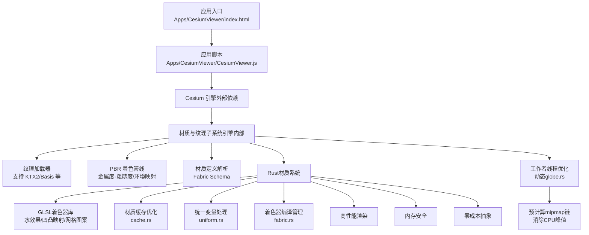

**图表来源**
- [index.html](file://Apps/CesiumViewer/index.html)
- [CesiumViewer.js](file://Apps/CesiumViewer/CesiumViewer.js)
- [Material.schema.json](file://Documentation/Schemas/Fabric/Material.schema.json)
- [CesiumMilkTruck.dae](file://Apps/SampleData/models/CesiumMilkTruck/CesiumMilkTruck.dae)
- [CesiumAir.gltf](file://Apps/SampleData/models/CesiumAir/CesiumAir.gltf)
- [BoxTexturedKtx2Basis](file://Apps/SampleData/models/glTF-2.0/BoxTexturedKtx2Basis)
- [fabric.rs](file://cesiumrust/crates/material/src/fabric.rs)
- [uniform.rs](file://cesiumrust/crates/material/src/uniform.rs)
- [cache.rs](file://cesiumrust/crates/material/src/cache.rs)
- [dynamic_globe.rs](file://cesiumrust/application/cesium-app/src/dynamic_globe.rs)

## 核心组件
本节从"材质定义—纹理加载—渲染管线"的链路出发，概述关键能力与职责边界。

- 材质定义与属性
  - 通过 Fabric 材质 Schema 描述材质属性与 uniform 类型，包括向量、矩阵、纹理等
  - 常见物理属性：颜色、不透明度、反射率、金属度、粗糙度、法线贴图强度、自发光等
  - 参考路径：[Material.schema.json](file://Documentation/Schemas/Fabric/Material.schema.json)、[TextureUniforms.json](file://Documentation/Schemas/Fabric/Examples/TextureUniforms.json)、[VectorUniforms.json](file://Documentation/Schemas/Fabric/Examples/VectorUniforms.json)、[MatrixUniforms.json](file://Documentation/Schemas/Fabric/Examples/MatrixUniforms.json)

- 纹理加载与压缩
  - 支持标准图像格式与 GPU 压缩格式（KTX2、Basis），减少带宽与显存占用
  - 纹理图集（Atlas）用于合并多张小图，降低绘制批次
  - **新增** 工作者线程预计算mipmap链，避免主帧线程阻塞
  - 参考路径：[BoxTexturedKtx2Basis](file://Apps/SampleData/models/glTF-2.0/BoxTexturedKtx2Basis)

- PBR 材质工作流
  - 金属度-粗糙度工作流：以金属度控制导体/绝缘体行为，粗糙度控制高光扩散
  - 环境映射：提供反射/折射近似，增强真实感
  - 次表面散射：对半透明材质（皮肤、蜡、玉石等）进行体积光散射近似
  - 参考路径：[CesiumAir.gltf](file://Apps/SampleData/models/CesiumAir/CesiumAir.gltf)、[CesiumMilkTruck.dae](file://Apps/SampleData/models/CesiumMilkTruck/CesiumMilkTruck.dae)

- **新增** Rust材质系统核心
  - fabric.rs：着色器编译管理与材质定义解析
  - uniform.rs：统一变量处理与GPU内存管理
  - cache.rs：材质缓存优化与生命周期管理
  - GLSL着色器库：水效果、凹凸映射、网格图案等特效实现

- **新增** 性能优化机制
  - 工作者线程预计算mipmap链，消除快速缩放时的CPU峰值
  - 增强的CachedTexture结构，包含mip_levels跟踪
  - 改进的TileDownloadResult结构，携带预计算的mipmap信息
  - 参考路径：[dynamic_globe.rs](file://cesiumrust/application/cesium-app/src/dynamic_globe.rs)

- 渲染管线集成
  - 材质属性在着色阶段被采样与组合，结合光照模型输出最终像素颜色
  - 纹理坐标变换、过滤模式、mipmap 链生成由纹理子系统负责
  - 参考路径：[CesiumViewer.js](file://Apps/CesiumViewer/CesiumViewer.js)

**章节来源**
- [Material.schema.json](file://Documentation/Schemas/Fabric/Material.schema.json)
- [TextureUniforms.json](file://Documentation/Schemas/Fabric/Examples/TextureUniforms.json)
- [VectorUniforms.json](file://Documentation/Schemas/Fabric/Examples/VectorUniforms.json)
- [MatrixUniforms.json](file://Documentation/Schemas/Fabric/Examples/MatrixUniforms.json)
- [CesiumViewer.js](file://Apps/CesiumViewer/CesiumViewer.js)
- [CesiumAir.gltf](file://Apps/SampleData/models/CesiumAir/CesiumAir.gltf)
- [CesiumMilkTruck.dae](file://Apps/SampleData/models/CesiumMilkTruck/CesiumMilkTruck.dae)
- [BoxTexturedKtx2Basis](file://Apps/SampleData/models/glTF-2.0/BoxTexturedKtx2Basis)
- [fabric.rs](file://cesiumrust/crates/material/src/fabric.rs)
- [uniform.rs](file://cesiumrust/crates/material/src/uniform.rs)
- [cache.rs](file://cesiumrust/crates/material/src/cache.rs)
- [dynamic_globe.rs](file://cesiumrust/application/cesium-app/src/dynamic_globe.rs)

## 架构总览
下图展示了从应用到材质与纹理子系统的整体交互流程，包括新增的Rust材质系统和性能优化机制。

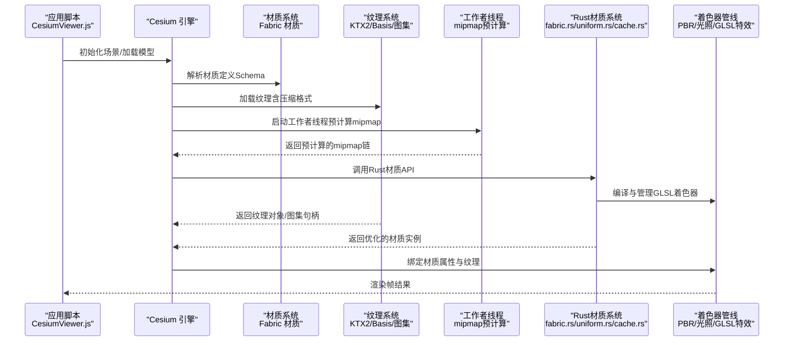

**图表来源**
- [CesiumViewer.js](file://Apps/CesiumViewer/CesiumViewer.js)
- [Material.schema.json](file://Documentation/Schemas/Fabric/Material.schema.json)
- [TextureUniforms.json](file://Documentation/Schemas/Fabric/Examples/TextureUniforms.json)
- [BoxTexturedKtx2Basis](file://Apps/SampleData/models/glTF-2.0/BoxTexturedKtx2Basis)
- [fabric.rs](file://cesiumrust/crates/material/src/fabric.rs)
- [uniform.rs](file://cesiumrust/crates/material/src/uniform.rs)
- [cache.rs](file://cesiumrust/crates/material/src/cache.rs)
- [dynamic_globe.rs](file://cesiumrust/application/cesium-app/src/dynamic_globe.rs)

## 详细组件分析

### 材质属性与 Fabric 材质 Schema
- 材质属性分类
  - 标量/向量：颜色、不透明度、强度、偏移、缩放等
  - 矩阵：纹理变换矩阵、世界/视图/投影矩阵等
  - 纹理：漫反射贴图、法线贴图、粗糙度/金属度贴图、环境贴图、自发光贴图等
- 典型属性语义
  - 颜色/不透明度：控制基础色与透明度
  - 反射率/粗糙度/金属度：影响镜面反射强度与分布
  - 法线贴图强度：控制法线扰动幅度
  - 自发光：直接贡献像素亮度
- 参考路径
  - [Material.schema.json](file://Documentation/Schemas/Fabric/Material.schema.json)
  - [TextureUniforms.json](file://Documentation/Schemas/Fabric/Examples/TextureUniforms.json)
  - [VectorUniforms.json](file://Documentation/Schemas/Fabric/Examples/VectorUniforms.json)
  - [MatrixUniforms.json](file://Documentation/Schemas/Fabric/Examples/MatrixUniforms.json)

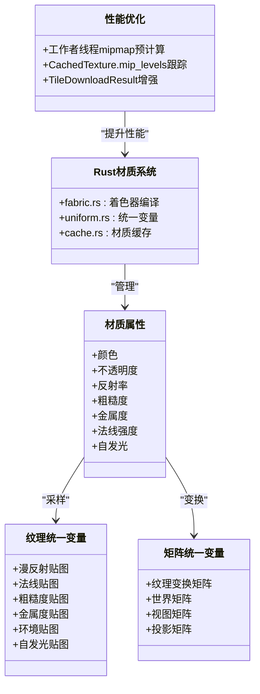

**图表来源**
- [Material.schema.json](file://Documentation/Schemas/Fabric/Material.schema.json)
- [TextureUniforms.json](file://Documentation/Schemas/Fabric/Examples/TextureUniforms.json)
- [VectorUniforms.json](file://Documentation/Schemas/Fabric/Examples/VectorUniforms.json)
- [MatrixUniforms.json](file://Documentation/Schemas/Fabric/Examples/MatrixUniforms.json)
- [fabric.rs](file://cesiumrust/crates/material/src/fabric.rs)
- [uniform.rs](file://cesiumrust/crates/material/src/uniform.rs)
- [cache.rs](file://cesiumrust/crates/material/src/cache.rs)
- [dynamic_globe.rs](file://cesiumrust/application/cesium-app/src/dynamic_globe.rs)

**章节来源**
- [Material.schema.json](file://Documentation/Schemas/Fabric/Material.schema.json)
- [TextureUniforms.json](file://Documentation/Schemas/Fabric/Examples/TextureUniforms.json)
- [VectorUniforms.json](file://Documentation/Schemas/Fabric/Examples/VectorUniforms.json)
- [MatrixUniforms.json](file://Documentation/Schemas/Fabric/Examples/MatrixUniforms.json)

### 纹理加载与压缩格式（KTX2、Basis）
- 加载流程要点
  - 识别纹理源（URL/内嵌/二进制）
  - 选择解码器（KTX2/Basis/通用图像）
  - **新增** 在工作者线程上生成 mipmap 链，避免主帧线程阻塞
  - 将纹理对象注册到纹理缓存，避免重复加载
- 压缩格式优势
  - KTX2/Basis 显著降低带宽与显存占用，提升移动端性能
  - 需要 GPU 端原生支持或运行时转码
- 性能优化
  - 工作者线程预计算mipmap链，消除快速缩放时的CPU峰值
  - 增强的数据结构支持更高效的纹理管理
- 参考路径
  - [BoxTexturedKtx2Basis](file://Apps/SampleData/models/glTF-2.0/BoxTexturedKtx2Basis)

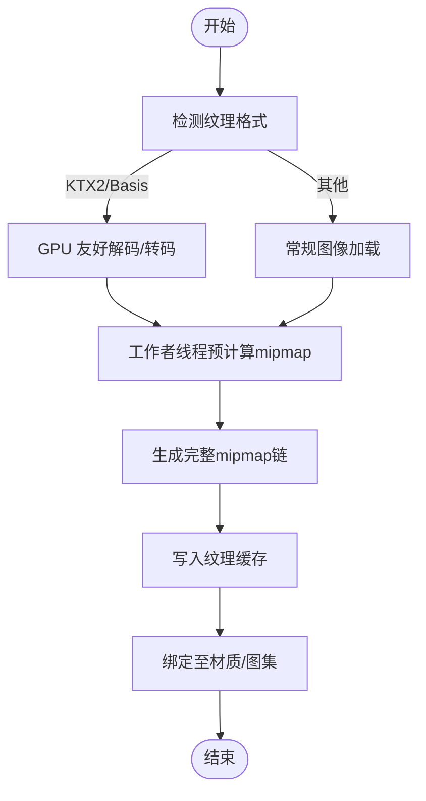

**图表来源**
- [BoxTexturedKtx2Basis](file://Apps/SampleData/models/glTF-2.0/BoxTexturedKtx2Basis)
- [dynamic_globe.rs](file://cesiumrust/application/cesium-app/src/dynamic_globe.rs)

**章节来源**
- [BoxTexturedKtx2Basis](file://Apps/SampleData/models/glTF-2.0/BoxTexturedKtx2Basis)
- [dynamic_globe.rs](file://cesiumrust/application/cesium-app/src/dynamic_globe.rs)

### 纹理图集管理
- 图集目的
  - 合并多张小纹理为一张大图，减少绘制批次
  - 提高缓存命中率，降低状态切换开销
- 管理策略
  - 动态/静态图集构建
  - UV 分块与边界填充（防止采样泄漏）
  - 图集更新与失效处理
- 参考路径
  - [TextureUniforms.json](file://Documentation/Schemas/Fabric/Examples/TextureUniforms.json)

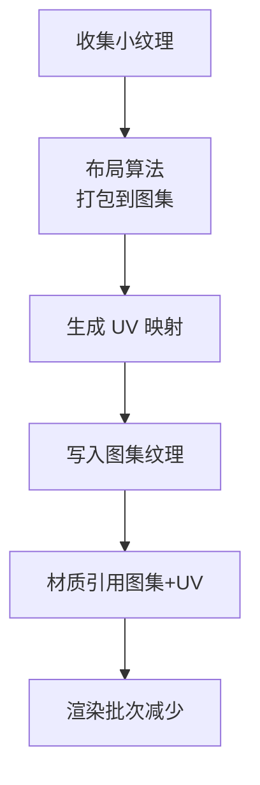

**图表来源**
- [TextureUniforms.json](file://Documentation/Schemas/Fabric/Examples/TextureUniforms.json)

**章节来源**
- [TextureUniforms.json](file://Documentation/Schemas/Fabric/Examples/TextureUniforms.json)

### PBR 材质工作流与环境映射
- 金属度-粗糙度工作流
  - 金属度：区分导体（高反射）与绝缘体（低反射）
  - 粗糙度：控制微表面法线分布，影响高光扩散范围
  - 法线贴图：增加表面细节而不改变几何
- 环境映射
  - 提供反射/折射近似，增强金属与光滑表面的真实感
  - 通常使用预滤波的环境立方体贴图
- 次表面散射
  - 对半透明材质进行体积光散射近似，常用于皮肤、蜡、玉石等
- 参考路径
  - [CesiumAir.gltf](file://Apps/SampleData/models/CesiumAir/CesiumAir.gltf)
  - [CesiumMilkTruck.dae](file://Apps/SampleData/models/CesiumMilkTruck/CesiumMilkTruck.dae)

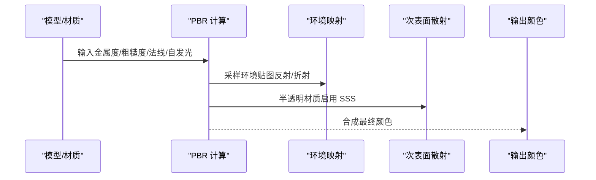

**图表来源**
- [CesiumAir.gltf](file://Apps/SampleData/models/CesiumAir/CesiumAir.gltf)
- [CesiumMilkTruck.dae](file://Apps/SampleData/models/CesiumMilkTruck/CesiumMilkTruck.dae)

**章节来源**
- [CesiumAir.gltf](file://Apps/SampleData/models/CesiumAir/CesiumAir.gltf)
- [CesiumMilkTruck.dae](file://Apps/SampleData/models/CesiumMilkTruck/CesiumMilkTruck.dae)

### **新增** Rust材质系统核心组件

#### fabric.rs - 着色器编译管理
- 功能概述
  - 管理GLSL着色器的编译过程
  - 处理着色器依赖关系和版本兼容性
  - 提供材质定义的解析和验证
- 核心特性
  - 异步编译以避免阻塞主线程
  - 编译错误处理和调试信息输出
  - 着色器缓存机制提升加载性能
- 支持的着色器类型
  - 顶点着色器（Vertex Shader）
  - 片段着色器（Fragment Shader）
  - 几何着色器（Geometry Shader）
  - 计算着色器（Compute Shader）

#### uniform.rs - 统一变量处理
- 功能概述
  - 管理GPU统一变量的内存分配和更新
  - 提供类型安全的变量绑定接口
  - 优化批量更新以减少GPU-CPU同步开销
- 数据类型支持
  - 标量类型（float, int, bool）
  - 向量类型（vec2, vec3, vec4）
  - 矩阵类型（mat2, mat3, mat4）
  - 纹理采样器（sampler2D, samplerCube）
- 性能优化
  - 延迟更新机制
  - 批量提交减少API调用
  - 内存池复用避免频繁分配

#### cache.rs - 材质缓存优化
- 功能概述
  - 实现材质实例的LRU缓存策略
  - 管理材质生命周期和资源清理
  - 提供跨场景的材质共享机制
- 缓存策略
  - 基于材质ID的哈希索引
  - 自动淘汰最近最少使用的材质
  - 引用计数确保资源安全释放
- 内存管理
  - 智能内存监控和告警
  - 垃圾回收触发条件配置
  - 内存泄漏检测和报告

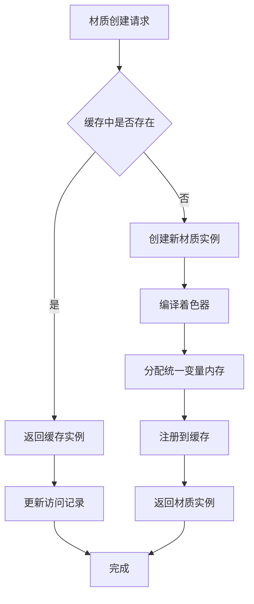

**图表来源**
- [fabric.rs](file://cesiumrust/crates/material/src/fabric.rs)
- [uniform.rs](file://cesiumrust/crates/material/src/uniform.rs)
- [cache.rs](file://cesiumrust/crates/material/src/cache.rs)

**章节来源**
- [fabric.rs](file://cesiumrust/crates/material/src/fabric.rs)
- [uniform.rs](file://cesiumrust/crates/material/src/uniform.rs)
- [cache.rs](file://cesiumrust/crates/material/src/cache.rs)

### **新增** GLSL着色器特效库

#### water.glsl - 水效果着色器
- 视觉效果
  - 动态水面波纹和涟漪效果
  - 菲涅尔反射和折射计算
  - 深度相关的透明度混合
- 参数控制
  - 波纹频率和振幅
  - 反射强度和模糊程度
  - 水深和底部可见性
- 性能优化
  - 分层波浪叠加
  - 距离相关的细节级别
  - GPU友好的数学运算

#### bump_map.glsl - 凹凸映射着色器
- 技术实现
  - 切线空间法线贴图采样
  - 高度图转换为法线向量
  - 微表面细节增强
- 质量设置
  - 法线贴图强度调节
  - 细节层次自适应
  - 边缘检测避免伪影
- 兼容性
  - 支持多种法线贴图格式
  - 向后兼容无贴图情况
  - 移动端性能优化

#### grid_pattern.glsl - 网格图案着色器
- 应用场景
  - 工程制图和CAD可视化
  - 地形网格辅助显示
  - 调试和开发工具
- 样式定制
  - 网格线宽度和颜色
  - 主网格和次网格区分
  - 透视校正和抗锯齿
- 交互功能
  - 缩放级别的网格密度
  - 实时参数调整
  - 与其他材质效果的叠加

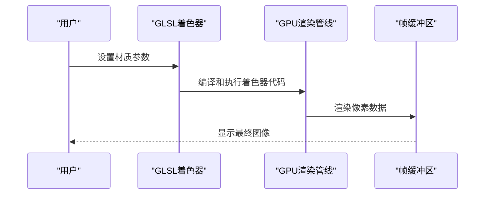

**图表来源**
- [water.glsl](file://cesiumrust/crates/material/shaders/water.glsl)
- [bump_map.glsl](file://cesiumrust/crates/material/shaders/bump_map.glsl)
- [grid_pattern.glsl](file://cesiumrust/crates/material/shaders/grid_pattern.glsl)

**章节来源**
- [water.glsl](file://cesiumrust/crates/material/shaders/water.glsl)
- [bump_map.glsl](file://cesiumrust/crates/material/shaders/bump_map.glsl)
- [grid_pattern.glsl](file://cesiumrust/crates/material/shaders/grid_pattern.glsl)

### **新增** 工作者线程mipmap预计算优化

#### build_mip_chain函数
- 功能概述
  - 在工作者线程上预计算完整的mipmap链
  - 使用盒式下采样算法生成各级别纹理
  - 返回包含所有mipmap级别的连续内存数据
- 算法实现
  - 从基础级别开始，逐级生成1/2分辨率的纹理
  - 每个像素通过对相邻4个像素取平均值得到
  - 持续处理直到达到1x1的最小级别
- 性能优势
  - 避免主帧线程执行耗时的mipmap计算
  - 消除快速缩放操作中的CPU峰值
  - 保持渲染帧率的稳定性

#### make_image函数
- 功能概述
  - 从工作者线程准备好的RGBA数据创建GPU纹理
  - 支持完整的mipmap链上传到GPU
  - 配置合适的纹理采样器参数
- 实现细节
  - 首先创建仅包含基础级别的Image对象
  - 然后替换为包含完整mipmap链的数据
  - 设置三线性mipmap过滤和各向异性过滤
- 优化效果
  - GPU上传路径尊重texture_descriptor.mip_level_count
  - 确保地平线瓦片不会闪烁，倾斜瓦片保持清晰

#### TileDownloadResult结构增强
- 新增字段
  - rgba_data: Vec<u8> - 包含基础级别和完整mipmap链的数据
  - mip_levels: u32 - 预计算的mipmap级别数量
  - placeholder: bool - 标记是否为占位符瓦片
  - aborted: bool - 标记下载是否被中止
- 数据结构优势
  - 一次性传输完整的纹理数据
  - 减少主帧线程的处理负担
  - 支持更灵活的纹理管理策略

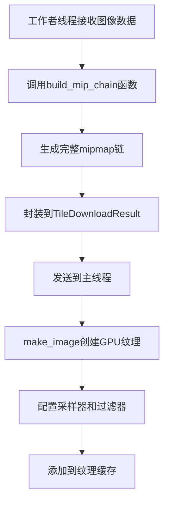

**图表来源**
- [dynamic_globe.rs](file://cesiumrust/application/cesium-app/src/dynamic_globe.rs)

**章节来源**
- [dynamic_globe.rs](file://cesiumrust/application/cesium-app/src/dynamic_globe.rs)

### 材质创建与自定义示例路径
- 通过 Fabric 材质 Schema 声明材质属性与纹理统一变量
- 在应用中加载模型或创建几何体，并为其指定材质
- **新增** 使用Rust材质系统进行高级材质开发
- **新增** 利用工作者线程优化纹理加载性能
- 参考路径
  - [Material.schema.json](file://Documentation/Schemas/Fabric/Material.schema.json)
  - [CesiumViewer.js](file://Apps/CesiumViewer/CesiumViewer.js)
  - [index.html](file://Apps/CesiumViewer/index.html)

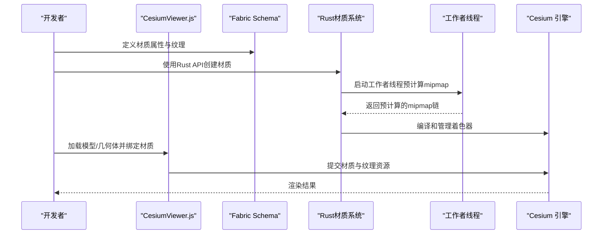

**图表来源**
- [Material.schema.json](file://Documentation/Schemas/Fabric/Material.schema.json)
- [CesiumViewer.js](file://Apps/CesiumViewer/CesiumViewer.js)
- [index.html](file://Apps/CesiumViewer/index.html)
- [fabric.rs](file://cesiumrust/crates/material/src/fabric.rs)
- [uniform.rs](file://cesiumrust/crates/material/src/uniform.rs)
- [cache.rs](file://cesiumrust/crates/material/src/cache.rs)
- [dynamic_globe.rs](file://cesiumrust/application/cesium-app/src/dynamic_globe.rs)

**章节来源**
- [Material.schema.json](file://Documentation/Schemas/Fabric/Material.schema.json)
- [CesiumViewer.js](file://Apps/CesiumViewer/CesiumViewer.js)
- [index.html](file://Apps/CesiumViewer/index.html)

## 依赖关系分析
- 应用层依赖
  - 应用脚本通过 HTML 页面引入 Cesium，并在 JS 中创建场景、加载模型与材质
- 引擎层依赖
  - 材质系统依赖 Fabric Schema 解析材质定义
  - 纹理系统依赖压缩解码器（KTX2/Basis）与纹理缓存
  - 渲染管线依赖 PBR 着色器与环境映射资源
  - **新增** Rust材质系统提供高性能后端实现
  - **新增** 工作者线程优化依赖Bevy渲染框架
- 资源层依赖
  - 模型与纹理资源（glTF/DAE/KTX2）作为输入驱动材质与纹理子系统
  - **新增** GLSL着色器库提供丰富的视觉效果
- 性能层依赖
  - **新增** 多线程优化依赖消息传递通道
  - **新增** 内存管理依赖智能指针和所有权系统

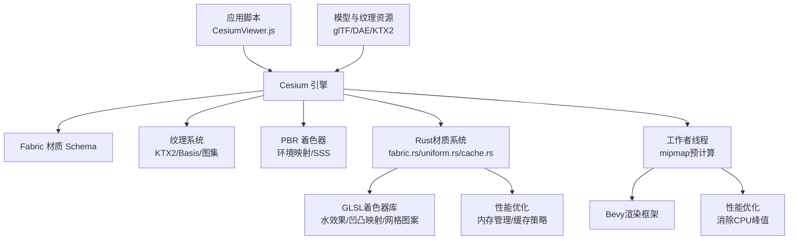

**图表来源**
- [CesiumViewer.js](file://Apps/CesiumViewer/CesiumViewer.js)
- [Material.schema.json](file://Documentation/Schemas/Fabric/Material.schema.json)
- [BoxTexturedKtx2Basis](file://Apps/SampleData/models/glTF-2.0/BoxTexturedKtx2Basis)
- [CesiumAir.gltf](file://Apps/SampleData/models/CesiumAir/CesiumAir.gltf)
- [CesiumMilkTruck.dae](file://Apps/SampleData/models/CesiumMilkTruck/CesiumMilkTruck.dae)
- [fabric.rs](file://cesiumrust/crates/material/src/fabric.rs)
- [uniform.rs](file://cesiumrust/crates/material/src/uniform.rs)
- [cache.rs](file://cesiumrust/crates/material/src/cache.rs)
- [dynamic_globe.rs](file://cesiumrust/application/cesium-app/src/dynamic_globe.rs)

**章节来源**
- [CesiumViewer.js](file://Apps/CesiumViewer/CesiumViewer.js)
- [Material.schema.json](file://Documentation/Schemas/Fabric/Material.schema.json)
- [BoxTexturedKtx2Basis](file://Apps/SampleData/models/glTF-2.0/BoxTexturedKtx2Basis)
- [CesiumAir.gltf](file://Apps/SampleData/models/CesiumAir/CesiumAir.gltf)
- [CesiumMilkTruck.dae](file://Apps/SampleData/models/CesiumMilkTruck/CesiumMilkTruck.dae)
- [fabric.rs](file://cesiumrust/crates/material/src/fabric.rs)
- [uniform.rs](file://cesiumrust/crates/material/src/uniform.rs)
- [cache.rs](file://cesiumrust/crates/material/src/cache.rs)
- [dynamic_globe.rs](file://cesiumrust/application/cesium-app/src/dynamic_globe.rs)

## 性能考虑
- 纹理压缩优先
  - 使用 KTX2/Basis 减少带宽与显存占用，提升移动端性能
- 纹理图集
  - 合并小图，减少绘制批次与状态切换
- mipmap 与过滤
  - 合理设置 mipmap 链与过滤模式，避免过采样与锯齿
- 材质复用
  - 共享材质实例与纹理对象，避免重复创建
- 环境贴图优化
  - 预滤波环境贴图，按需分辨率，避免过大尺寸
- **新增** Rust材质系统优化
  - 零成本抽象和内存安全保证
  - 异步着色器编译避免主线程阻塞
  - 智能缓存策略减少重复计算
  - 批量GPU操作减少API调用开销
- **新增** 工作者线程优化
  - 预计算mipmap链消除主帧线程CPU峰值
  - 多线程并行处理提升纹理加载速度
  - 智能调度避免资源竞争和内存压力
  - 保持渲染帧率稳定，消除图像抖动

## 故障排查指南
- 纹理加载失败
  - 检查 URL 可达性与跨域配置
  - 确认 GPU 是否支持 KTX2/Basis；必要时回退到通用图像格式
- 材质属性无效
  - 核对 Fabric Schema 字段名称与类型
  - 确认纹理统一变量已正确绑定
- 渲染异常
  - 检查纹理坐标与图集 UV 映射
  - 验证法线贴图方向与强度
- **新增** Rust材质系统问题
  - 检查着色器编译错误日志
  - 验证统一变量类型匹配
  - 确认材质缓存状态和生命周期
- **新增** 工作者线程问题
  - 检查工作者线程通信是否正常
  - 验证mipmap预计算是否正确完成
  - 确认内存分配和释放是否平衡
- 参考路径
  - [CesiumViewer.js](file://Apps/CesiumViewer/CesiumViewer.js)
  - [Material.schema.json](file://Documentation/Schemas/Fabric/Material.schema.json)
  - [fabric.rs](file://cesiumrust/crates/material/src/fabric.rs)
  - [uniform.rs](file://cesiumrust/crates/material/src/uniform.rs)
  - [cache.rs](file://cesiumrust/crates/material/src/cache.rs)
  - [dynamic_globe.rs](file://cesiumrust/application/cesium-app/src/dynamic_globe.rs)

**章节来源**
- [CesiumViewer.js](file://Apps/CesiumViewer/CesiumViewer.js)
- [Material.schema.json](file://Documentation/Schemas/Fabric/Material.schema.json)
- [fabric.rs](file://cesiumrust/crates/material/src/fabric.rs)
- [uniform.rs](file://cesiumrust/crates/material/src/uniform.rs)
- [cache.rs](file://cesiumrust/crates/material/src/cache.rs)
- [dynamic_globe.rs](file://cesiumrust/application/cesium-app/src/dynamic_globe.rs)

## 结论
Cesium 的材质与纹理系统以 Fabric 材质 Schema 为核心，结合高效的纹理加载与压缩（KTX2/Basis）、纹理图集管理与 PBR 渲染管线，实现了高性能且真实的视觉表现。**新增的Rust材质系统进一步提升了性能和安全性**，通过fabric.rs着色器编译管理、uniform.rs统一变量处理和cache.rs材质缓存优化，为复杂场景提供了更强大的材质处理能力。**特别重要的是，工作者线程预计算mipmap链的优化机制有效消除了快速缩放操作中的CPU峰值，显著改善了用户体验**。通过合理的材质定义、纹理优化与资源管理，可以在复杂场景中兼顾质量与性能。

## 附录
- 快速定位
  - 材质 Schema 与示例：[Material.schema.json](file://Documentation/Schemas/Fabric/Material.schema.json)、[TextureUniforms.json](file://Documentation/Schemas/Fabric/Examples/TextureUniforms.json)、[VectorUniforms.json](file://Documentation/Schemas/Fabric/Examples/VectorUniforms.json)、[MatrixUniforms.json](file://Documentation/Schemas/Fabric/Examples/MatrixUniforms.json)
  - 示例应用：[index.html](file://Apps/CesiumViewer/index.html)、[CesiumViewer.js](file://Apps/CesiumViewer/CesiumViewer.js)
  - 模型与纹理资源：[CesiumAir.gltf](file://Apps/SampleData/models/CesiumAir/CesiumAir.gltf)、[CesiumMilkTruck.dae](file://Apps/SampleData/models/CesiumMilkTruck/CesiumMilkTruck.dae)、[BoxTexturedKtx2Basis](file://Apps/SampleData/models/glTF-2.0/BoxTexturedKtx2Basis)
  - **新增** Rust材质系统：[fabric.rs](file://cesiumrust/crates/material/src/fabric.rs)、[uniform.rs](file://cesiumrust/crates/material/src/uniform.rs)、[cache.rs](file://cesiumrust/crates/material/src/cache.rs)
  - **新增** GLSL着色器库：[water.glsl](file://cesiumrust/crates/material/shaders/water.glsl)、[bump_map.glsl](file://cesiumrust/crates/material/shaders/bump_map.glsl)、[grid_pattern.glsl](file://cesiumrust/crates/material/shaders/grid_pattern.glsl)
  - **新增** 性能优化实现：[dynamic_globe.rs](file://cesiumrust/application/cesium-app/src/dynamic_globe.rs)