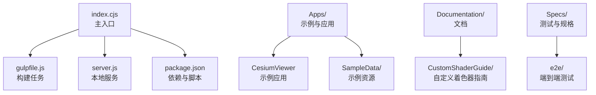
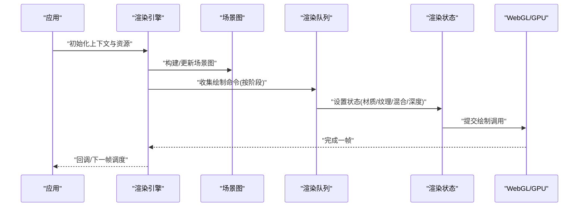
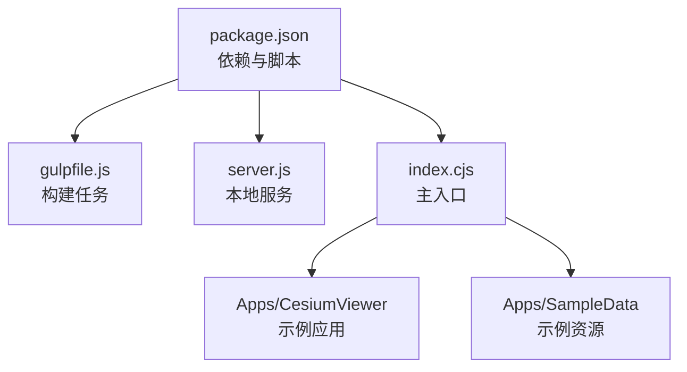

# 渲染管线架构

<cite>
**本文引用的文件**   
- [README.md](file://README.md)
- [index.cjs](file://index.cjs)
- [gulpfile.js](file://gulpfile.js)
- [server.js](file://server.js)
- [package.json](file://package.json)
</cite>

## 目录
1. [简介](#简介)
2. [项目结构](#项目结构)
3. [核心组件](#核心组件)
4. [架构总览](#架构总览)
5. [详细组件分析](#详细组件分析)
6. [依赖关系分析](#依赖关系分析)
7. [性能考量](#性能考量)
8. [故障排查指南](#故障排查指南)
9. [结论](#结论)
10. [附录](#附录)

## 简介
本技术文档聚焦于 Cesium 的渲染管线架构，围绕基于 WebGL 的 3D 渲染流程展开，涵盖渲染状态管理、绘制调用优化、渲染目标切换、场景图遍历与队列组织、深度排序策略，以及视锥剔除、遮挡剔除、LOD 选择等关键性能优化。同时提供自定义渲染阶段与扩展渲染管线的实践思路，并给出调试渲染问题的方法。

说明：当前工作区主要包含应用入口、构建脚本与示例数据，未直接暴露引擎源码。因此，本文在“架构总览”和“详细组件分析”部分以概念性图示为主；涉及仓库文件的章节将严格标注来源。

## 项目结构
仓库采用多包与示例分离的组织方式：
- 顶层入口与构建：index.cjs、gulpfile.js、server.js、package.json
- 示例与应用：Apps/（含 CesiumViewer、HelloWorld.html 及大量示例数据）
- 文档与工具：Documentation/、Tools/
- 测试与规格：Specs/
- 脚本与配置：scripts/、launches/

图表来源
- [index.cjs:1-20](file://index.cjs#L1-L20)
- [gulpfile.js:1-30](file://gulpfile.js#L1-L30)
- [server.js:1-20](file://server.js#L1-L20)
- [package.json:1-30](file://package.json#L1-L30)

章节来源
- [README.md:1-50](file://README.md#L1-L50)
- [index.cjs:1-20](file://index.cjs#L1-L20)
- [gulpfile.js:1-30](file://gulpfile.js#L1-L30)
- [server.js:1-20](file://server.js#L1-L20)
- [package.json:1-30](file://package.json#L1-L30)

## 核心组件
本节概述渲染管线中的关键抽象与职责划分（概念性描述，便于理解整体设计）：
- 渲染上下文与设备：封装 WebGL 上下文、能力探测、错误处理与状态缓存
- 渲染命令与队列：将场景图节点转换为可批次的绘制命令，按材质/几何体分组以减少状态切换
- 渲染阶段：前向/延迟路径、透明通道、后处理、UI 叠加等阶段的编排
- 场景图与遍历：层次化场景图、可见性裁剪、LOD 选择、实例化与合并
- 资源管理：纹理、缓冲、着色器程序、查询对象的生命周期与复用
- 相机与投影：视锥体定义、近远平面、投影矩阵更新
- 输出与帧缓冲：默认帧缓冲与离屏渲染目标切换、多重采样与抗锯齿

[本节为概念性内容，不直接分析具体源文件]

## 架构总览
下图展示从应用启动到最终像素输出的典型流程，强调渲染阶段、队列组织与状态管理的关键交互。

[此图为概念性流程图，不映射到具体源文件]

## 详细组件分析

### 渲染状态管理
- 目标：最小化 WebGL 状态切换，降低驱动开销
- 要点：
  - 状态分组：按材质类型、纹理图集、混合模式、深度/模板状态进行分组
  - 状态缓存：避免重复设置相同状态
  - 批量绘制：对共享状态的几何体进行合并或实例化绘制
- 建议：
  - 使用统一的“状态键”作为哈希索引，快速定位批次
  - 对频繁变化的状态（如每实例属性）采用独立批次或缓冲区更新

[本节为通用指导，不直接分析具体源文件]

### 绘制调用优化
- 目标：减少 draw call 数量，提升吞吐
- 要点：
  - 几何体合并：同材质、同变换域的网格尽量合并
  - 实例化绘制：大量重复对象使用 instanced 绘制
  - 索引缓冲重用：共享顶点/索引缓冲，减少内存带宽
- 建议：
  - 对静态场景做离线合并
  - 对动态场景采用增量更新与分块合并

[本节为通用指导，不直接分析具体源文件]

### 渲染目标切换
- 目标：在多 pass 与后处理中高效切换帧缓冲
- 要点：
  - 预分配离屏帧缓冲与颜色/深度附件
  - 控制多重采样与 MSAA 开关
  - 避免不必要的分辨率变化
- 建议：
  - 将固定尺寸的目标复用，减少创建销毁
  - 合理组织 pass 顺序，减少状态切换

[本节为通用指导，不直接分析具体源文件]

### 场景图遍历算法
- 目标：高效生成可见子树与绘制命令
- 要点：
  - 自顶向下遍历，结合包围体进行早期剔除
  - 支持替换/聚合两种 LOD 策略
  - 维护可见集合与优先级队列
- 建议：
  - 使用空间分区（八叉树/四叉树/BVH）加速查询
  - 异步加载与渐进细化

[本节为通用指导，不直接分析具体源文件]

### 渲染队列的组织方式
- 目标：按阶段与状态组织绘制命令，最大化批量化
- 要点：
  - 阶段划分：不透明、半透明、线框、点、UI、后处理
  - 组内排序：按深度或距离排序，保证正确合成
  - 批次合并：同状态下的命令合并为一次或少数几次绘制
- 建议：
  - 对半透明物体按从远到近排序
  - 对 UI 层单独队列，避免与场景深度干扰

[本节为通用指导，不直接分析具体源文件]

### 深度排序策略
- 目标：确保正确的可见性与合成顺序
- 要点：
  - 不透明：启用深度写入与比较
  - 半透明：禁用深度写入，按距离排序
  - 特殊效果：使用模板或多重 pass
- 建议：
  - 对复杂几何体使用近似包围体中心距离
  - 对动画物体考虑时间一致性排序

[本节为通用指导，不直接分析具体源文件]

### 视锥剔除
- 目标：仅处理位于相机视锥内的对象
- 要点：
  - 使用 AABB/OBB/球体与视锥求交
  - 分层剔除：先粗后细
- 建议：
  - 在 CPU 侧做快速剔除，GPU 侧可做补充
  - 利用视锥参数更新时的增量计算

[本节为通用指导，不直接分析具体源文件]

### 遮挡剔除
- 目标：进一步减少不可见对象的绘制
- 要点：
  - 硬件 occlusion query 或软件估计
  - 层级遮挡：父级不可见则跳过子树
- 建议：
  - 对大规模地形/建筑使用代理遮挡体
  - 结合 LOD 与视锥剔除协同

[本节为通用指导，不直接分析具体源文件]

### LOD 选择
- 目标：在质量与性能间取得平衡
- 要点：
  - 基于屏幕空间误差或距离阈值
  - 支持替换与聚合两种策略
- 建议：
  - 预计算不同级别的几何与纹理
  - 平滑过渡以避免闪烁

[本节为通用指导，不直接分析具体源文件]

### 自定义渲染阶段与扩展管线
- 目标：在不侵入核心逻辑的前提下插入新 pass
- 步骤概览：
  - 注册新的渲染阶段（如“阴影生成”、“体积云”）
  - 在阶段钩子中收集特定类型的绘制命令
  - 设置专用帧缓冲与状态，执行 pass
  - 将结果写回全局资源供后续阶段使用
- 注意事项：
  - 保持阶段顺序与依赖清晰
  - 避免跨阶段的状态冲突
  - 提供调试可视化接口

[本节为通用指导，不直接分析具体源文件]

### 调试渲染问题
- 常用手段：
  - 逐帧捕获与回放（浏览器开发者工具、外部 GPU 调试器）
  - 着色器断点与变量检查
  - 渲染统计：draw call、三角形数、状态切换次数
  - 可视化辅助：法线、UV、包围体、视锥体
- 建议：
  - 建立最小复现用例
  - 逐步关闭特性定位问题（如关闭透明度、后处理）

[本节为通用指导，不直接分析具体源文件]

## 依赖关系分析
从仓库顶层入口与构建脚本的角度，了解应用如何被组织与运行。

图表来源
- [package.json:1-30](file://package.json#L1-L30)
- [gulpfile.js:1-30](file://gulpfile.js#L1-L30)
- [server.js:1-20](file://server.js#L1-L20)
- [index.cjs:1-20](file://index.cjs#L1-L20)

章节来源
- [package.json:1-30](file://package.json#L1-L30)
- [gulpfile.js:1-30](file://gulpfile.js#L1-L30)
- [server.js:1-20](file://server.js#L1-L20)
- [index.cjs:1-20](file://index.cjs#L1-L20)

## 性能考量
- 减少状态切换：合并批次、复用资源、避免频繁切换材质/纹理
- 降低带宽：压缩纹理、使用合适的格式、减少上传频率
- 并行与异步：后台加载、增量更新、多线程/Worker 预处理
- 测量与分析：采集 draw call、三角面片、状态切换、GPU 占用等指标
- 平台差异：移动端关注功耗与带宽，桌面端关注吞吐与精度

[本节为通用指导，不直接分析具体源文件]

## 故障排查指南
- 常见问题：
  - 黑屏/白屏：检查着色器编译、uniform 绑定、纹理加载
  - 透明错误：确认深度写入与排序策略
  - 闪烁/撕裂：同步机制、MSAA 配置、帧缓冲切换
  - 性能抖动：GC 峰值、资源创建销毁、CPU-GPU 同步
- 定位步骤：
  - 最小化场景复现
  - 逐个关闭特性（阴影、后处理、透明）
  - 使用浏览器开发者工具的 Rendering 面板与 GPU 计时
  - 记录关键指标并对比基线

[本节为通用指导，不直接分析具体源文件]

## 结论
Cesium 的渲染管线通过清晰的阶段划分、严格的队列组织与精细的状态管理，实现了高性能的 3D 渲染。结合视锥剔除、遮挡剔除与 LOD 选择，可在大规模场景中维持稳定帧率。通过扩展渲染阶段与完善的调试手段，开发者可以灵活定制渲染行为并快速定位问题。

[本节为总结性内容，不直接分析具体源文件]

## 附录
- 相关文档与示例：
  - 自定义着色器指南：Documentation/CustomShaderGuide/README.md
  - 示例应用：Apps/CesiumViewer
  - 示例资源：Apps/SampleData

章节来源
- [README.md:1-50](file://README.md#L1-L50)
- [index.cjs:1-20](file://index.cjs#L1-L20)
- [gulpfile.js:1-30](file://gulpfile.js#L1-L30)
- [server.js:1-20](file://server.js#L1-L20)
- [package.json:1-30](file://package.json#L1-L30)