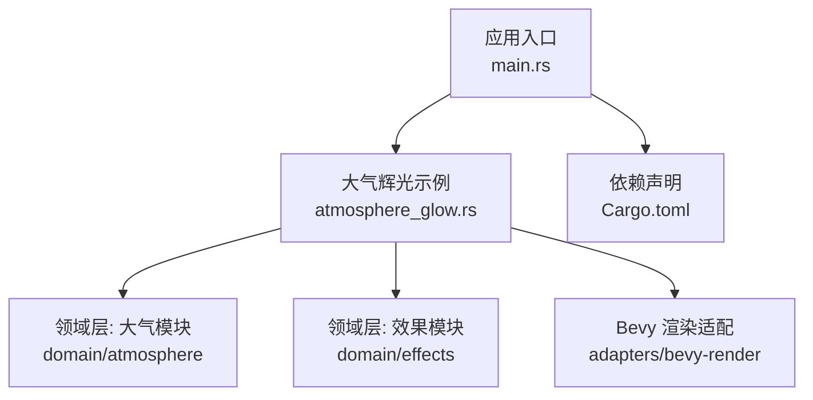
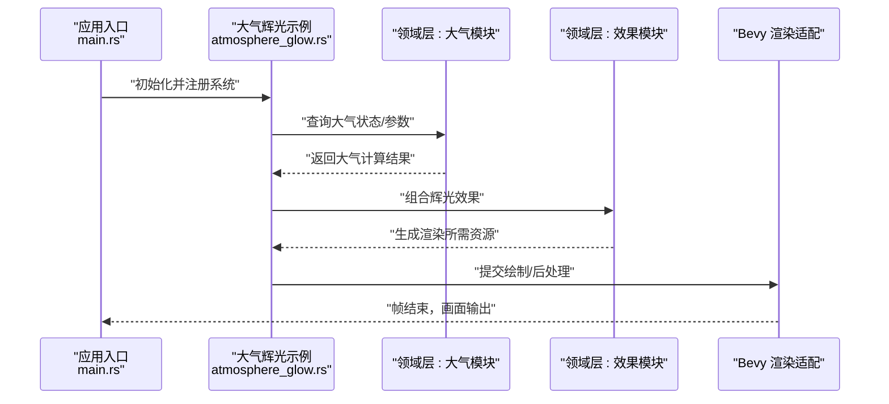
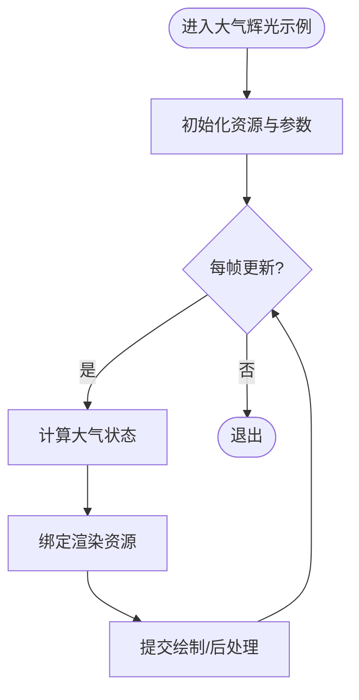
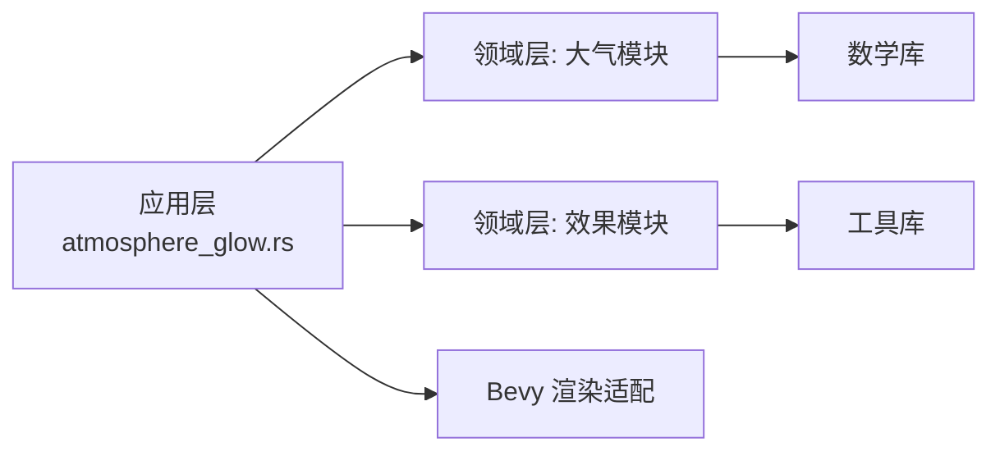

# 大气辉光效果

<cite>
**本文引用的文件**   
- [atmosphere_glow.rs](file://cesiumrust/application/cesium-app/src/atmosphere_glow.rs)
- [main.rs](file://cesiumrust/application/cesium-app/src/main.rs)
- [Cargo.toml](file://cesiumrust/application/cesium-app/Cargo.toml)
- [README.md](file://cesiumrust/README.md)
</cite>

## 目录
1. [简介](#简介)
2. [项目结构](#项目结构)
3. [核心组件](#核心组件)
4. [架构总览](#架构总览)
5. [详细组件分析](#详细组件分析)
6. [依赖关系分析](#依赖关系分析)
7. [性能考虑](#性能考虑)
8. [故障排查指南](#故障排查指南)
9. [结论](#结论)
10. [附录](#附录)

## 简介
本文件聚焦于 Cesium Rust 分支中的“大气辉光效果”实现，围绕 cesiumrust 应用层与领域层的交互、渲染管线集成以及关键参数配置进行系统化说明。内容兼顾非技术读者与开发者，提供从整体架构到代码级细节的渐进式解读，并辅以可视化图示帮助理解数据流与控制流。

## 项目结构
- 应用入口位于 cesiumrust/application/cesium-app，负责场景初始化、相机控制、资源加载与示例演示。
- 大气辉光相关逻辑集中在 atmosphere_glow.rs，作为应用层对大气效果的封装与展示。
- Cargo.toml 声明了应用依赖与模块组织，便于定位运行时依赖与构建产物。
- README.md 提供了仓库背景、构建与运行指引，有助于快速搭建开发环境。

**图表来源** 
- [main.rs](file://cesiumrust/application/cesium-app/src/main.rs)
- [atmosphere_glow.rs](file://cesiumrust/application/cesium-app/src/atmosphere_glow.rs)
- [Cargo.toml](file://cesiumrust/application/cesium-app/Cargo.toml)

**章节来源**
- [README.md](file://cesiumrust/README.md)
- [Cargo.toml](file://cesiumrust/application/cesium-app/Cargo.toml)

## 核心组件
- 大气辉光示例组件：在应用层中创建、配置并驱动大气辉光渲染，通常包含参数面板、材质/着色器绑定、帧更新回调等职责。
- 领域层大气模块：定义大气物理模型、散射参数、高度分层、视角相关函数等，为上层提供可复用的计算接口。
- 领域层效果模块：抽象通用后处理或叠加效果（如辉光、模糊、色调映射），供大气辉光复用。
- Bevy 渲染适配：将领域层计算结果转换为 GPU 可用的纹理、缓冲与着色器变量，完成绘制调用。

**章节来源**
- [atmosphere_glow.rs](file://cesiumrust/application/cesium-app/src/atmosphere_glow.rs)

## 架构总览
下图展示了大气辉光从应用层到渲染器的数据与控制流向：应用入口初始化场景，加载大气辉光示例；示例通过领域层接口获取大气状态，经 Bevy 适配写入渲染资源，最终由 GPU 着色器输出辉光效果。

**图表来源** 
- [main.rs](file://cesiumrust/application/cesium-app/src/main.rs)
- [atmosphere_glow.rs](file://cesiumrust/application/cesium-app/src/atmosphere_glow.rs)

## 详细组件分析

### 大气辉光示例组件（应用层）
- 职责
  - 初始化大气辉光资源与参数
  - 监听用户输入或时间变化，动态更新参数
  - 将领域层计算结果绑定至渲染管线
- 关键流程
  - 启动时加载默认参数与着色器资源
  - 每帧根据相机位置、太阳方向等更新大气状态
  - 调用渲染适配层提交绘制命令

**图表来源** 
- [atmosphere_glow.rs](file://cesiumrust/application/cesium-app/src/atmosphere_glow.rs)

**章节来源**
- [atmosphere_glow.rs](file://cesiumrust/application/cesium-app/src/atmosphere_glow.rs)

### 领域层大气模块（概念性）
- 典型能力
  - 基于物理的大气散射模型（瑞利/米氏散射）
  - 高度分层与密度分布
  - 视角与太阳角度相关的衰减与散射系数
- 数据结构
  - 大气参数对象（密度、散射系数、折射率等）
  - 采样网格或查找表（加速射线步进）
- 复杂度
  - 射线步进 O(N)，N 为步数；可通过 LOD 或自适应步长优化

[本节为概念性说明，不直接分析具体文件]

### 领域层效果模块（概念性）
- 典型能力
  - 辉光提取、阈值过滤、高斯模糊、合成叠加
- 数据结构
  - 中间纹理（亮度图、模糊层级）
  - 统一变量（强度、半径、迭代次数）
- 复杂度
  - 多通道后处理，O(W×H×K)，K 为模糊迭代次数

[本节为概念性说明，不直接分析具体文件]

### Bevy 渲染适配（概念性）
- 职责
  - 将 CPU 侧计算结果上传至 GPU 缓冲/纹理
  - 管理着色器程序与管线状态
  - 协调渲染队列与批处理
- 关键点
  - 内存拷贝与带宽优化（按需更新、增量上传）
  - 同步策略（异步任务、事件总线）

[本节为概念性说明，不直接分析具体文件]

## 依赖关系分析
- 应用层依赖领域层（大气、效果）与渲染适配层
- 领域层之间低耦合，通过明确接口交换数据
- 渲染适配层屏蔽底层图形 API 差异，向上提供稳定接口

**图表来源** 
- [atmosphere_glow.rs](file://cesiumrust/application/cesium-app/src/atmosphere_glow.rs)
- [Cargo.toml](file://cesiumrust/application/cesium-app/Cargo.toml)

**章节来源**
- [Cargo.toml](file://cesiumrust/application/cesium-app/Cargo.toml)

## 性能考虑
- 减少不必要的 CPU-GPU 同步：批量更新纹理与缓冲，避免逐帧全量上传
- 自适应步长与 LOD：近景高精度、远景低精度，降低射线步进开销
- 后处理通道合并：合并多次模糊或阈值操作，减少中间纹理读写
- 缓存常用值：太阳方向、相机矩阵等重复计算结果应缓存并重用
- 并行化：CPU 侧大气计算可使用多线程或 SIMD 指令集加速

[本节为通用指导，不直接分析具体文件]

## 故障排查指南
- 现象：辉光缺失或过曝
  - 检查阈值与强度参数是否合理
  - 确认亮度图提取是否正确，避免饱和或裁剪
- 现象：闪烁或撕裂
  - 核对同步策略，确保帧间一致性
  - 检查深度/模板测试设置是否与辉光通道匹配
- 现象：性能骤降
  - 查看 GPU 占用与带宽使用，定位瓶颈通道
  - 降低模糊迭代次数或分辨率缩放

[本节为通用指导，不直接分析具体文件]

## 结论
大气辉光效果在本项目中通过应用层示例组件串联领域层大气与效果模块，并由 Bevy 渲染适配完成 GPU 绘制。合理的参数配置、高效的渲染路径与清晰的依赖边界是实现高质量辉光的关键。建议结合场景需求调整散射模型与后处理通道，以获得最佳视觉与性能平衡。

[本节为总结性内容，不直接分析具体文件]

## 附录
- 构建与运行：参考仓库 README 与 Cargo.toml 依赖声明，确保依赖完整与环境正确
- 扩展建议：增加时间动态参数（如昼夜变化）、多光源支持、体积云与雾效融合

[本节为补充信息，不直接分析具体文件]