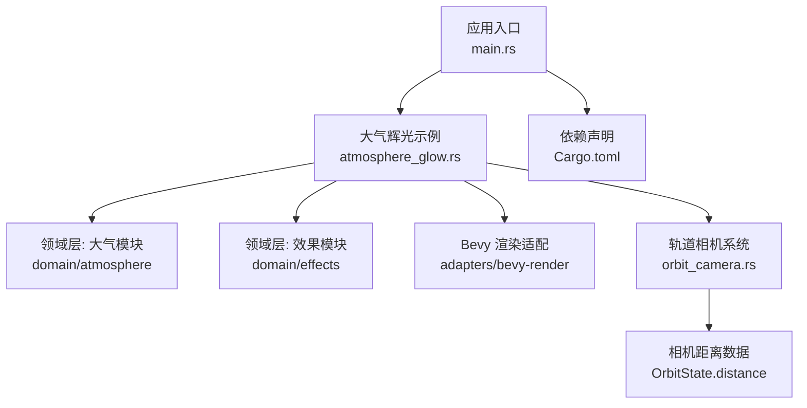
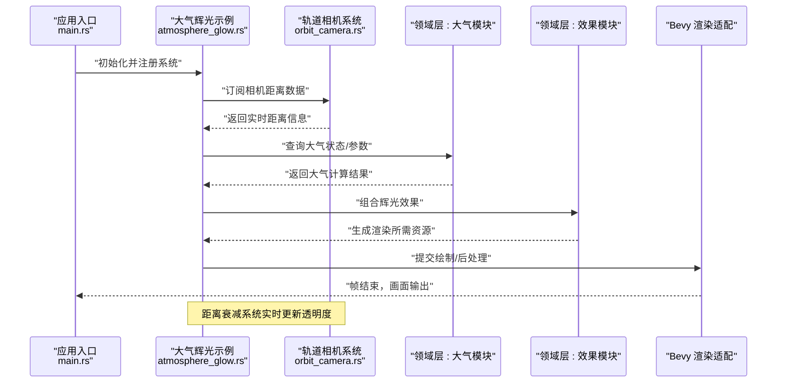
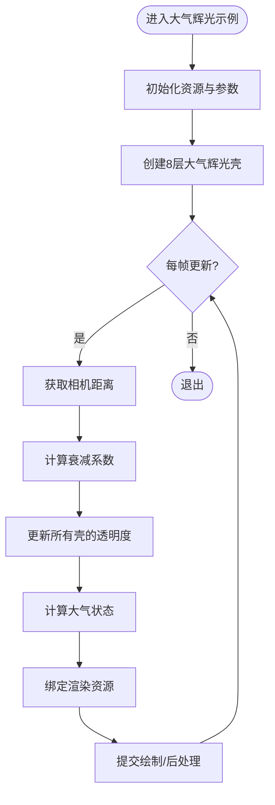
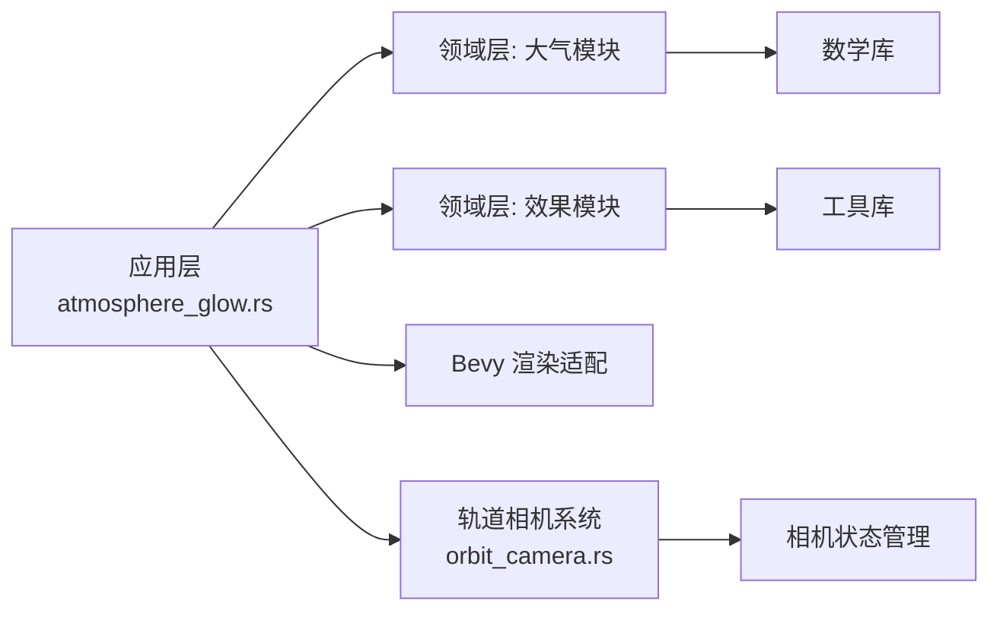

# 大气辉光效果

<cite>
**本文引用的文件**   
- [atmosphere_glow.rs](file://cesiumrust/application/cesium-app/src/atmosphere_glow.rs)
- [orbit_camera.rs](file://cesiumrust/application/cesium-app/src/orbit_camera.rs)
- [main.rs](file://cesiumrust/application/cesium-app/src/main.rs)
- [Cargo.toml](file://cesiumrust/application/cesium-app/Cargo.toml)
- [README.md](file://cesiumrust/README.md)
</cite>

## 更新摘要
**所做更改**
- 新增距离衰减系统和AtmosphereShell组件的详细说明
- 更新核心组件章节以包含新的距离控制机制
- 添加距离衰减算法的技术细节
- 更新架构图表以反映新的渲染流程
- 增强故障排查指南以包含距离相关问题的解决方案

## 目录
1. [简介](#简介)
2. [项目结构](#项目结构)
3. [核心组件](#核心组件)
4. [架构总览](#架构总览)
5. [详细组件分析](#详细组件分析)
6. [依赖关系分析](#依赖关系分析)
7. [性能考虑](#性能考虑)
8. [故障排查指南](#故障排查指南)
9. [结论](#结论)
10. [附录](#附录)

## 简介
本文件聚焦于 Cesium Rust 分支中的"大气辉光效果"实现，围绕 cesiumrust 应用层与领域层的交互、渲染管线集成以及关键参数配置进行系统化说明。内容兼顾非技术读者与开发者，提供从整体架构到代码级细节的渐进式解读，并辅以可视化图示帮助理解数据流与控制流。

**最新更新**：大气辉光效果现已集成智能距离衰减系统，通过AtmosphereShell组件和三次多项式渐变函数，有效解决了近距离观察时的蓝色伪影问题。该系统在相机距离地球表面1.5倍至3倍半径范围内实现平滑透明度控制，确保视觉效果的自然过渡。

## 项目结构
- 应用入口位于 cesiumrust/application/cesium-app，负责场景初始化、相机控制、资源加载与示例演示。
- 大气辉光相关逻辑集中在 atmosphere_glow.rs，作为应用层对大气效果的封装与展示。
- 轨道相机系统 orbit_camera.rs 提供相机状态管理，为距离衰减系统提供关键的相机距离数据。
- Cargo.toml 声明了应用依赖与模块组织，便于定位运行时依赖与构建产物。
- README.md 提供了仓库背景、构建与运行指引，有助于快速搭建开发环境。



**图表来源** 
- [main.rs](file://cesiumrust/application/cesium-app/src/main.rs)
- [atmosphere_glow.rs](file://cesiumrust/application/cesium-app/src/atmosphere_glow.rs)
- [orbit_camera.rs](file://cesiumrust/application/cesium-app/src/orbit_camera.rs)
- [Cargo.toml](file://cesiumrust/application/cesium-app/Cargo.toml)

**章节来源**
- [README.md](file://cesiumrust/README.md)
- [Cargo.toml](file://cesiumrust/application/cesium-app/Cargo.toml)

## 核心组件
- **大气辉光示例组件**：在应用层中创建、配置并驱动大气辉光渲染，包含参数面板、材质/着色器绑定、帧更新回调等职责。
- **AtmosphereShell组件**：新增的每层大气辉光实体组件，存储基础alpha值并在距离衰减系统中动态调整透明度。
- **距离衰减系统**：基于相机距离的智能透明度控制系统，使用三次多项式函数实现平滑渐变效果。
- **领域层大气模块**：定义大气物理模型、散射参数、高度分层、视角相关函数等，为上层提供可复用的计算接口。
- **领域层效果模块**：抽象通用后处理或叠加效果（如辉光、模糊、色调映射），供大气辉光复用。
- **Bevy 渲染适配**：将领域层计算结果转换为 GPU 可用的纹理、缓冲与着色器变量，完成绘制调用。
- **轨道相机系统**：提供相机状态管理，包括距离、角度等关键参数，为距离衰减系统提供实时数据支持。

**章节来源**
- [atmosphere_glow.rs](file://cesiumrust/application/cesium-app/src/atmosphere_glow.rs)
- [orbit_camera.rs](file://cesiumrust/application/cesium-app/src/orbit_camera.rs)

## 架构总览
下图展示了大气辉光从应用层到渲染器的数据与控制流向：应用入口初始化场景，加载大气辉光示例；示例通过领域层接口获取大气状态，经 Bevy 适配写入渲染资源，最终由 GPU 着色器输出辉光效果。新增的距离衰减系统实时监控相机位置，动态调整辉光透明度以避免近距离观察时的视觉异常。



**图表来源** 
- [main.rs](file://cesiumrust/application/cesium-app/src/main.rs)
- [atmosphere_glow.rs](file://cesiumrust/application/cesium-app/src/atmosphere_glow.rs)
- [orbit_camera.rs](file://cesiumrust/application/cesium-app/src/orbit_camera.rs)

## 详细组件分析

### 大气辉光示例组件（应用层）
- **职责**
  - 初始化大气辉光资源与参数
  - 监听用户输入或时间变化，动态更新参数
  - 将领域层计算结果绑定至渲染管线
  - 管理距离衰减系统的生命周期
- **关键流程**
  - 启动时加载默认参数与着色器资源
  - 每帧根据相机位置、太阳方向等更新大气状态
  - 调用渲染适配层提交绘制命令
  - 执行距离衰减计算以优化视觉效果



**图表来源** 
- [atmosphere_glow.rs](file://cesiumrust/application/cesium-app/src/atmosphere_glow.rs)

**章节来源**
- [atmosphere_glow.rs](file://cesiumrust/application/cesium-app/src/atmosphere_glow.rs)

### AtmosphereShell组件（新增）
- **设计目标**：为每层大气辉光提供独立的透明度控制能力
- **数据结构**：
  - `base_alpha`: f32 - 存储基础alpha值，用于恢复远观时的完整亮度
  - 与MeshMaterial3d组件关联，支持动态材质修改
- **工作原理**：
  - 每层壳拥有不同的基础alpha值（从内到外递减：0.14 → 0.004）
  - 在距离衰减系统中被统一调暗，避免近距离观察时的蓝色伪影
  - 支持8层嵌套结构，每层半径递增约0.013个地球半径

**章节来源**
- [atmosphere_glow.rs:28-32](file://cesiumrust/application/cesium-app/src/atmosphere_glow.rs#L28-L32)

### 距离衰减系统（新增）
- **核心算法**：三次多项式渐变函数 `glow_fade(distance)`
- **渐变范围**：
  - 完全可见：距离 ≥ 3倍地球半径（太空视角）
  - 完全隐藏：距离 ≤ 1.5倍地球半径（地表附近）
  - 平滑过渡：1.5R < 距离 < 3R（中间区域）
- **数学实现**：
  ```rust
  fn glow_fade(distance: f32) -> f32 {
      let t = ((distance - 1.5) / 1.5).clamp(0.0, 1.0);
      t * t * (3.0 - 2.0 * t)  // 平滑步进曲线
  }
  ```
- **视觉效果**：
  - 解决近距离观察时的蓝色伪影问题
  - 保持远距离太空视角下的完整辉光效果
  - 提供自然的视觉过渡体验

**章节来源**
- [atmosphere_glow.rs:34-40](file://cesiumrust/application/cesium-app/src/atmosphere_glow.rs#L34-L40)
- [atmosphere_glow.rs:91-102](file://cesiumrust/application/cesium-app/src/atmosphere_glow.rs#L91-L102)

### 轨道相机系统（集成）
- **角色定位**：为距离衰减系统提供关键的相机距离数据
- **关键属性**：
  - `distance`: f32 - 当前相机距离（渲染单位）
  - `target_distance`: f32 - 目标距离（用于平滑动画）
  - `min_distance`: f32 - 最小距离限制（1.005，贴近地表）
  - `max_distance`: f32 - 最大距离限制（20.0，深空视角）
- **距离计算**：基于球面坐标系统，距离表示相机到地心的实际距离

**章节来源**
- [orbit_camera.rs:27-53](file://cesiumrust/application/cesium-app/src/orbit_camera.rs#L27-L53)

### 领域层大气模块（概念性）
- **典型能力**
  - 基于物理的大气散射模型（瑞利/米氏散射）
  - 高度分层与密度分布
  - 视角与太阳角度相关的衰减与散射系数
- **数据结构**
  - 大气参数对象（密度、散射系数、折射率等）
  - 采样网格或查找表（加速射线步进）
- **复杂度**
  - 射线步进 O(N)，N 为步数；可通过 LOD 或自适应步长优化

[本节为概念性说明，不直接分析具体文件]

### 领域层效果模块（概念性）
- **典型能力**
  - 辉光提取、阈值过滤、高斯模糊、合成叠加
- **数据结构**
  - 中间纹理（亮度图、模糊层级）
  - 统一变量（强度、半径、迭代次数）
- **复杂度**
  - 多通道后处理，O(W×H×K)，K 为模糊迭代次数

[本节为概念性说明，不直接分析具体文件]

### Bevy 渲染适配（概念性）
- **职责**
  - 将 CPU 侧计算结果上传至 GPU 缓冲/纹理
  - 管理着色器程序与管线状态
  - 协调渲染队列与批处理
- **关键点**
  - 内存拷贝与带宽优化（按需更新、增量上传）
  - 同步策略（异步任务、事件总线）

[本节为概念性说明，不直接分析具体文件]

## 依赖关系分析
- 应用层依赖领域层（大气、效果）与渲染适配层
- 领域层之间低耦合，通过明确接口交换数据
- 渲染适配层屏蔽底层图形 API 差异，向上提供稳定接口
- **新增依赖**：大气辉光系统现在依赖轨道相机系统获取实时距离数据



**图表来源** 
- [atmosphere_glow.rs](file://cesiumrust/application/cesium-app/src/atmosphere_glow.rs)
- [orbit_camera.rs](file://cesiumrust/application/cesium-app/src/orbit_camera.rs)
- [Cargo.toml](file://cesiumrust/application/cesium-app/Cargo.toml)

**章节来源**
- [Cargo.toml](file://cesiumrust/application/cesium-app/Cargo.toml)

## 性能考虑
- **减少不必要的 CPU-GPU 同步**：批量更新纹理与缓冲，避免逐帧全量上传
- **自适应步长与 LOD**：近景高精度、远景低精度，降低射线步进开销
- **后处理通道合并**：合并多次模糊或阈值操作，减少中间纹理读写
- **缓存常用值**：太阳方向、相机矩阵等重复计算结果应缓存并重用
- **并行化**：CPU 侧大气计算可使用多线程或 SIMD 指令集加速
- **距离衰减优化**：仅在距离变化超过阈值时更新透明度，减少材质修改频率
- **批量材质更新**：一次性遍历所有大气壳并更新其透明度，避免多次GPU调用

## 故障排查指南
- **现象：辉光缺失或过曝**
  - 检查阈值与强度参数是否合理
  - 确认亮度图提取是否正确，避免饱和或裁剪
  - 验证距离衰减函数的渐变范围设置
- **现象：闪烁或撕裂**
  - 核对同步策略，确保帧间一致性
  - 检查深度/模板测试设置是否与辉光通道匹配
  - 确认相机距离数据的更新频率与渲染同步
- **现象：性能骤降**
  - 查看 GPU 占用与带宽使用，定位瓶颈通道
  - 降低模糊迭代次数或分辨率缩放
  - 检查距离衰减系统的更新频率是否过高
- **现象：近距离观察出现蓝色伪影**
  - 确认距离衰减系统已正确启用
  - 检查相机距离是否在预期的渐变范围内（1.5R-3R）
  - 验证AtmosphereShell组件的基础alpha值设置
  - 调试glow_fade函数的返回值是否符合预期

## 结论
大气辉光效果在本项目中通过应用层示例组件串联领域层大气与效果模块，并由 Bevy 渲染适配完成 GPU 绘制。**最新改进**：新增的智能距离衰减系统通过AtmosphereShell组件和三次多项式渐变函数，有效解决了近距离观察时的蓝色伪影问题，同时保持了远距离太空视角下的完美视觉效果。合理的参数配置、高效的渲染路径与清晰的依赖边界是实现高质量辉光的关键。建议结合场景需求调整散射模型与后处理通道，以获得最佳视觉与性能平衡。

## 附录
- **构建与运行**：参考仓库 README 与 Cargo.toml 依赖声明，确保依赖完整与环境正确
- **扩展建议**：增加时间动态参数（如昼夜变化）、多光源支持、体积云与雾效融合
- **距离衰减调优**：可根据不同应用场景调整渐变范围（1.5R-3R）和曲线形状
- **性能监控**：建议使用性能分析工具监控距离衰减系统的更新频率和材质修改开销