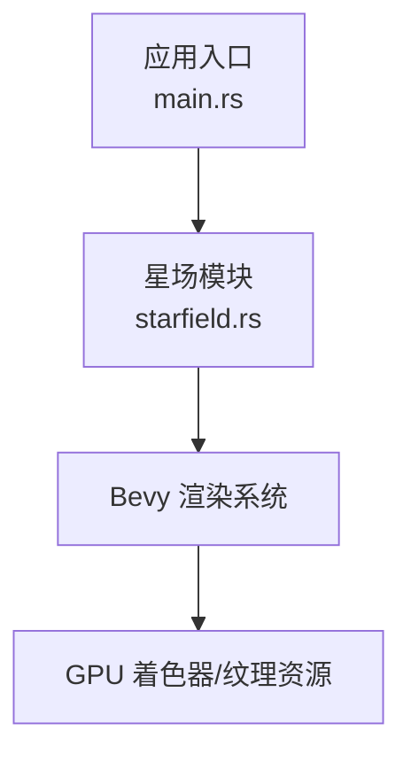
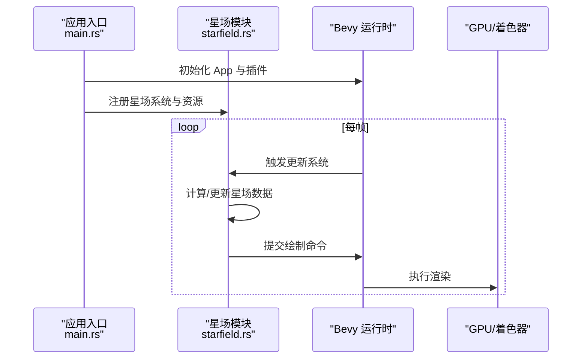
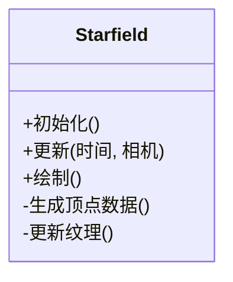
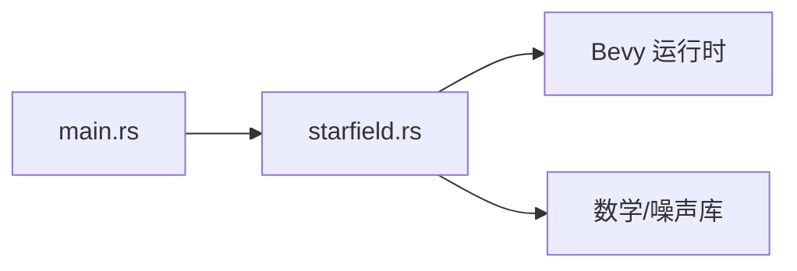

# 星场渲染器

<cite>
**本文引用的文件**   
- [starfield.rs](file://cesiumrust/application/cesium-app/src/starfield.rs)
- [main.rs](file://cesiumrust/application/cesium-app/src/main.rs)
- [Cargo.toml](file://cesiumrust/application/cesium-app/Cargo.toml)
</cite>

## 目录
1. [简介](#简介)
2. [项目结构](#项目结构)
3. [核心组件](#核心组件)
4. [架构总览](#架构总览)
5. [详细组件分析](#详细组件分析)
6. [依赖关系分析](#依赖关系分析)
7. [性能考量](#性能考量)
8. [故障排查指南](#故障排查指南)
9. [结论](#结论)
10. [附录](#附录)

## 简介
本文件聚焦于“星场渲染器”的实现与集成，围绕 Rust 应用中的星场模块进行系统化说明。内容涵盖模块职责、数据流、渲染管线接入点以及与 Bevy 渲染框架的交互方式，帮助读者快速理解并扩展星场相关功能。

## 项目结构
该仓库包含 CesiumJS（前端）与 cesiumrust（Rust 后端）两部分。星场渲染器位于 Rust 侧的应用示例中，作为独立模块被主程序加载和驱动。关键路径如下：
- 应用入口与生命周期管理：cesiumrust/application/cesium-app/src/main.rs
- 星场渲染器实现：cesiumrust/application/cesium-app/src/starfield.rs
- 应用依赖声明：cesiumrust/application/cesium-app/Cargo.toml

图表来源 
- [main.rs](file://cesiumrust/application/cesium-app/src/main.rs)
- [starfield.rs](file://cesiumrust/application/cesium-app/src/starfield.rs)

章节来源
- [main.rs](file://cesiumrust/application/cesium-app/src/main.rs)
- [starfield.rs](file://cesiumrust/application/cesium-app/src/starfield.rs)
- [Cargo.toml](file://cesiumrust/application/cesium-app/Cargo.toml)

## 核心组件
- 星场渲染器（Starfield）
  - 负责生成与更新星空粒子/顶点数据，提供绘制调用接口，并与相机/时间等上下文联动。
- 应用入口（Main）
  - 初始化 Bevy App，注册星场系统/组件/资源，并在每帧调度渲染。
- 构建配置（Cargo.toml）
  - 声明应用依赖，确保星场模块与 Bevy 生态正确链接。

章节来源
- [starfield.rs](file://cesiumrust/application/cesium-app/src/starfield.rs)
- [main.rs](file://cesiumrust/application/cesium-app/src/main.rs)
- [Cargo.toml](file://cesiumrust/application/cesium-app/Cargo.toml)

## 架构总览
星场渲染器以 Bevy ECS 为核心组织数据与行为。典型流程包括：
- 启动阶段：创建星场资源（如顶点缓冲、纹理），注册系统。
- 更新阶段：根据相机位置、时间或参数更新星场状态。
- 渲染阶段：提交绘制命令至 GPU，完成星场绘制。

图表来源 
- [main.rs](file://cesiumrust/application/cesium-app/src/main.rs)
- [starfield.rs](file://cesiumrust/application/cesium-app/src/starfield.rs)

## 详细组件分析

### 星场渲染器（Starfield）
- 职责
  - 维护星场几何/纹理等资源
  - 在更新系统中刷新数据（如随机扰动、闪烁效果）
  - 提供绘制接口，将结果交给渲染管线
- 设计要点
  - 使用 Bevy 的资源/组件模式管理状态
  - 通过系统函数按帧更新，避免阻塞主循环
  - 与相机/时间等上下文解耦，便于复用与测试

图表来源 
- [starfield.rs](file://cesiumrust/application/cesium-app/src/starfield.rs)

章节来源
- [starfield.rs](file://cesiumrust/application/cesium-app/src/starfield.rs)

### 应用入口（Main）
- 职责
  - 初始化 Bevy 应用
  - 注册星场模块的系统、资源与插件
  - 运行主循环，驱动渲染与更新
- 设计要点
  - 清晰的启动顺序，保证资源先于系统可用
  - 模块化注册，便于扩展其他子系统

图表来源 
- [main.rs](file://cesiumrust/application/cesium-app/src/main.rs)

章节来源
- [main.rs](file://cesiumrust/application/cesium-app/src/main.rs)

### 构建配置（Cargo.toml）
- 职责
  - 声明应用依赖（如 bevy 及相关 crate）
  - 确保编译产物包含星场模块
- 设计要点
  - 按需启用特性，减少二进制体积
  - 保持依赖版本稳定，便于跨平台构建

章节来源
- [Cargo.toml](file://cesiumrust/application/cesium-app/Cargo.toml)

## 依赖关系分析
- 内部依赖
  - main.rs 依赖 starfield.rs 提供的星场能力
  - starfield.rs 依赖 Bevy 的 ECS、渲染与资源系统
- 外部依赖
  - Bevy 框架及其生态（图形、输入、时间等）
  - 可能的第三方库（如数学库、噪声库）用于星场生成

图表来源 
- [main.rs](file://cesiumrust/application/cesium-app/src/main.rs)
- [starfield.rs](file://cesiumrust/application/cesium-app/src/starfield.rs)
- [Cargo.toml](file://cesiumrust/application/cesium-app/Cargo.toml)

章节来源
- [main.rs](file://cesiumrust/application/cesium-app/src/main.rs)
- [starfield.rs](file://cesiumrust/application/cesium-app/src/starfield.rs)
- [Cargo.toml](file://cesiumrust/application/cesium-app/Cargo.toml)

## 性能考量
- 数据批量更新：合并多次更新为一次批处理，降低系统调用开销
- 异步/并行：利用 Bevy 的多线程系统更新星场数据
- GPU 友好：尽量将计算移至着色器，减少 CPU-GPU 同步
- 资源复用：重用缓冲区与纹理，避免频繁分配与释放
- LOD 控制：根据相机距离动态调整星场密度与细节

[本节为通用指导，不直接分析具体文件]

## 故障排查指南
- 常见问题
  - 星场未显示：检查资源是否成功加载，绘制调用是否被正确提交
  - 闪烁异常：确认更新频率与时间步长设置是否合理
  - 性能下降：监控系统更新耗时与 GPU 占用，定位瓶颈
- 调试建议
  - 打印关键状态（顶点数量、纹理尺寸、相机参数）
  - 逐步禁用更新逻辑，验证渲染链路
  - 使用 Bevy 内置日志与性能分析工具

章节来源
- [starfield.rs](file://cesiumrust/application/cesium-app/src/starfield.rs)
- [main.rs](file://cesiumrust/application/cesium-app/src/main.rs)

## 结论
星场渲染器以 Bevy ECS 为基础，实现了可更新、可绘制的星空效果。通过清晰的模块划分与资源管理，能够在不同场景下灵活复用。建议在后续迭代中引入更多视觉效果（如颜色渐变、闪烁模式）与性能优化（如实例化渲染、GPU 加速）。

[本节为总结性内容，不直接分析具体文件]

## 附录
- 术语表
  - Bevy：Rust 游戏引擎框架，提供 ECS、渲染、输入等能力
  - ECS：实体-组件-系统架构模式
  - 资源：跨系统共享的数据对象（如纹理、缓冲）
  - 系统：按帧调用的更新逻辑单元

[本节为概念性内容，不直接分析具体文件]