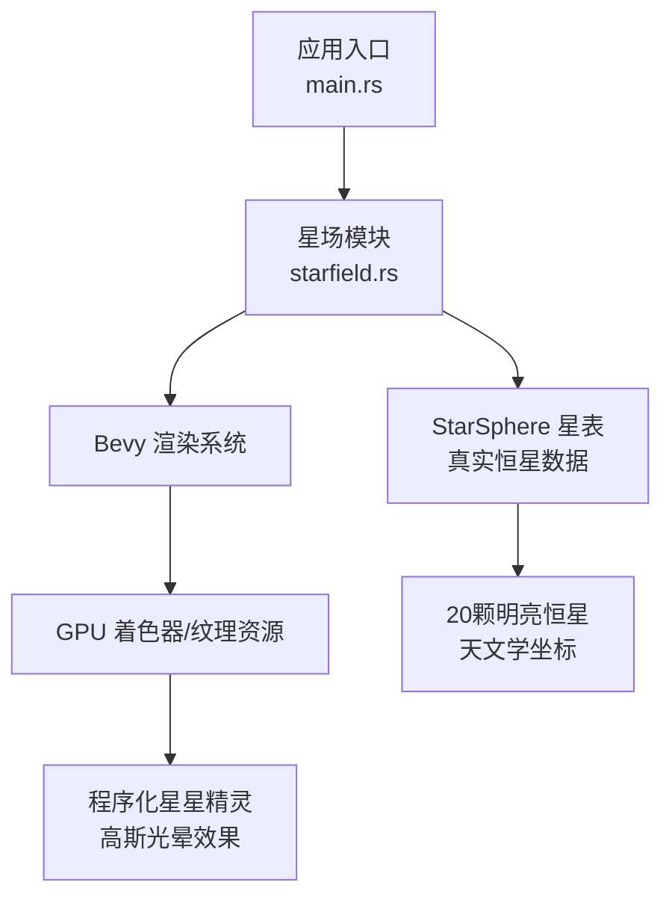
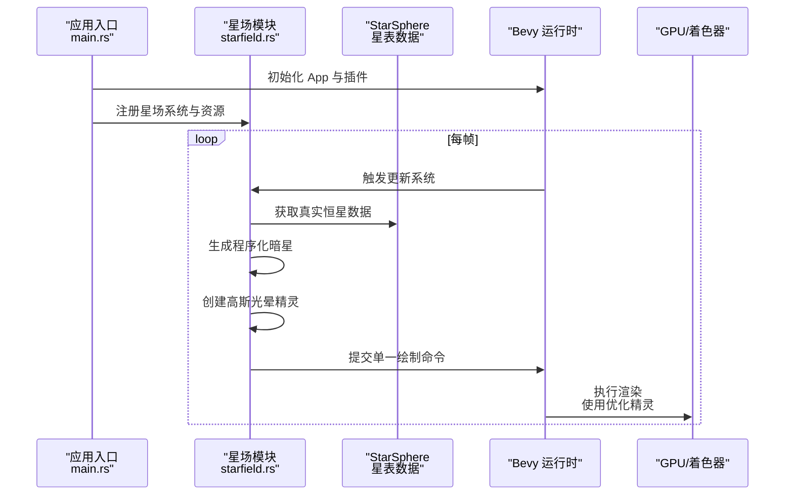
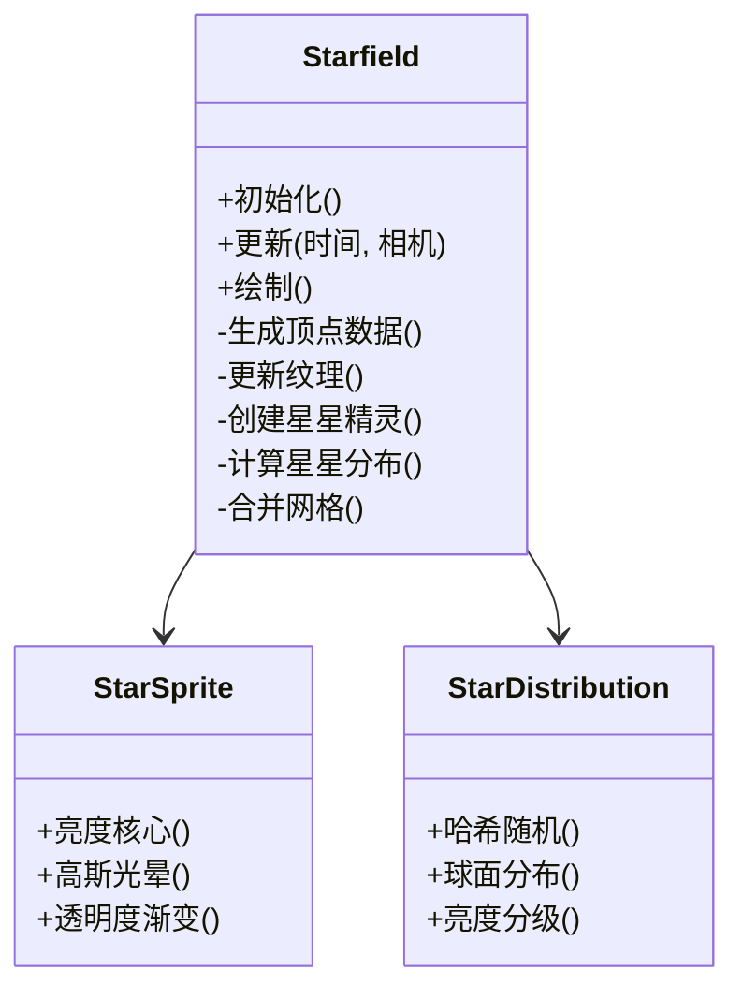
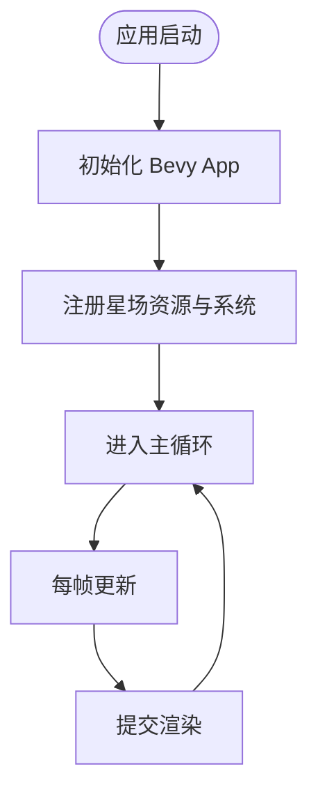
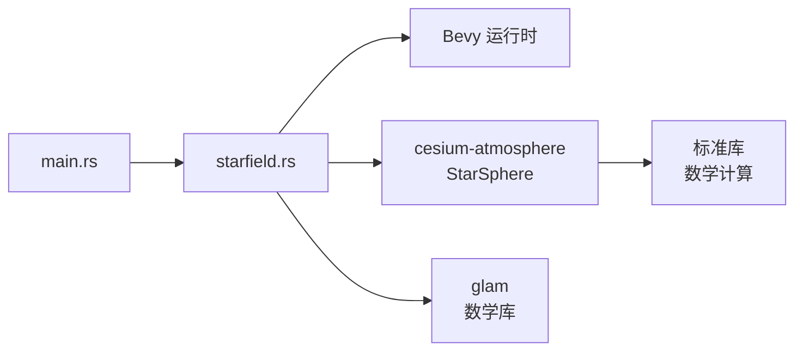

# 星场渲染器

<cite>
**本文引用的文件**   
- [starfield.rs](file://cesiumrust/application/cesium-app/src/starfield.rs)
- [main.rs](file://cesiumrust/application/cesium-app/src/main.rs)
- [Cargo.toml](file://cesiumrust/application/cesium-app/Cargo.toml)
- [star_sphere.rs](file://cesiumrust/domain/atmosphere/src/star_sphere.rs)
</cite>

## 更新摘要
**所做更改**   
- 更新了星场渲染器的核心组件分析，反映了新增的程序化星星精灵生成和高斯光晕效果
- 增强了详细组件分析部分，包含新的精灵生成算法、改进的星星分布和更真实的星星大小计算
- 更新了性能考量部分，体现了优化后的渲染效率和单网格绘制技术
- 添加了关于程序化星星生成的技术细节和StarSphere集成说明

## 目录
1. [简介](#简介)
2. [项目结构](#项目结构)
3. [核心组件](#核心组件)
4. [架构总览](#架构总览)
5. [详细组件分析](#详细组件分析)
6. [依赖关系分析](#依赖关系分析)
7. [性能考量](#性能考量)
8. [故障排查指南](#故障排查指南)
9. [结论](#结论)
10. [附录](#附录)

## 简介
本文件聚焦于"星场渲染器"的实现与集成，围绕 Rust 应用中的星场模块进行系统化说明。星场渲染器已获得显著改进，包括程序化星星精灵生成、高斯光晕效果和更真实的星星分布算法。内容涵盖模块职责、数据流、渲染管线接入点以及与 Bevy 渲染框架的交互方式，帮助读者快速理解并扩展星场相关功能。

## 项目结构
该仓库包含 CesiumJS（前端）与 cesiumrust（Rust 后端）两部分。星场渲染器位于 Rust 侧的应用示例中，作为独立模块被主程序加载和驱动。关键路径如下：
- 应用入口与生命周期管理：cesiumrust/application/cesium-app/src/main.rs
- 星场渲染器实现：cesiumrust/application/cesium-app/src/starfield.rs
- 星表数据源：cesiumrust/domain/atmosphere/src/star_sphere.rs
- 应用依赖声明：cesiumrust/application/cesium-app/Cargo.toml

图表来源 
- [main.rs](file://cesiumrust/application/cesium-app/src/main.rs)
- [starfield.rs](file://cesiumrust/application/cesium-app/src/starfield.rs)
- [star_sphere.rs](file://cesiumrust/domain/atmosphere/src/star_sphere.rs)

章节来源
- [main.rs](file://cesiumrust/application/cesium-app/src/main.rs)
- [starfield.rs](file://cesiumrust/application/cesium-app/src/starfield.rs)
- [star_sphere.rs](file://cesiumrust/domain/atmosphere/src/star_sphere.rs)
- [Cargo.toml](file://cesiumrust/application/cesium-app/Cargo.toml)

## 核心组件
- 星场渲染器（Starfield）
  - 负责生成与更新星空粒子/顶点数据，提供绘制调用接口，并与相机/时间等上下文联动
  - **已改进**：实现了程序化的 64x64 像素星星精灵，具有明亮圆形核心和柔和的高斯光晕效果
  - **已改进**：使用哈希函数实现球面上的均匀随机分布，结合真实星表数据创造自然夜空效果
- 应用入口（Main）
  - 初始化 Bevy App，注册星场系统/组件/资源，并在每帧调度渲染
- 构建配置（Cargo.toml）
  - 声明应用依赖，确保星场模块与 Bevy 生态正确链接
- StarSphere 星表
  - 提供内置的20颗最明亮恒星的真实天文数据，包括赤经、赤纬和星等信息

章节来源
- [starfield.rs](file://cesiumrust/application/cesium-app/src/starfield.rs)
- [main.rs](file://cesiumrust/application/cesium-app/src/main.rs)
- [star_sphere.rs](file://cesiumrust/domain/atmosphere/src/star_sphere.rs)
- [Cargo.toml](file://cesiumrust/application/cesium-app/Cargo.toml)

## 架构总览
星场渲染器以 Bevy ECS 为核心组织数据与行为。典型流程包括：
- 启动阶段：创建星场资源（如顶点缓冲、纹理），注册系统
- 更新阶段：根据相机位置、时间或参数更新星场状态
- 渲染阶段：提交绘制命令至 GPU，完成星场绘制

图表来源 
- [main.rs](file://cesiumrust/application/cesium-app/src/main.rs)
- [starfield.rs](file://cesiumrust/application/cesium-app/src/starfield.rs)
- [star_sphere.rs](file://cesiumrust/domain/atmosphere/src/star_sphere.rs)

## 详细组件分析

### 星场渲染器（Starfield）
- 职责
  - 维护星场几何/纹理等资源
  - 在更新系统中刷新数据（如随机扰动、闪烁效果）
  - 提供绘制接口，将结果交给渲染管线
- **已改进的设计要点**
  - 使用 Bevy 的资源/组件模式管理状态
  - 通过系统函数按帧更新，避免阻塞主循环
  - 与相机/时间等上下文解耦，便于复用与测试
  - **新增**：实现了程序化的 64x64 像素星星精灵，具有明亮圆形核心和柔和的高斯光晕效果
  - **新增**：改进了星星分布算法，使用哈希函数实现球面上的均匀分布
  - **新增**：所有星星合并为单个网格，仅需一次绘制调用，避免了每个星星实体 ~1500 次绘制的性能问题

图表来源 
- [starfield.rs](file://cesiumrust/application/cesium-app/src/starfield.rs)

**更新** 星场渲染器现在包含以下改进功能：

#### 程序化星星精灵生成
- **动态纹理创建**：`make_star_sprite()` 函数动态生成 64x64 像素的星星纹理，无需外部资源加载
- **双重高斯函数**：使用 `exp(-(d/0.22)^2) + 0.28 * exp(-(d/0.62)^2)` 创建明亮的核心和柔和的光晕
- **平滑透明度渐变**：从中心到边缘的透明度过渡，模拟真实星光效果
- **线性过滤**：启用线性插值以获得更平滑的视觉效果

#### 增强的星星分布算法
- **球面均匀分布**：通过 `hash_rand()` 哈希函数实现球面上的均匀随机分布，避免聚簇现象
- **亮度分级系统**：基于星等数据调整星星大小，较亮的星星显示更大的光晕
- **混合光源策略**：结合真实星表数据（20颗明亮恒星）和程序化生成的暗星（约1500颗），创造更自然的夜空效果
- **智能尺寸计算**：`half = 0.08 + 0.03 * (6.0 - star.magnitude).max(0.0)` 确保 brightest star 在默认视图中仅占几个像素

#### 高性能网格合并
- **单一绘制调用**：所有星星合并为一个 Mesh，仅需一次 draw call
- **内存优化**：预分配向量容量，减少内存分配开销
- **UV映射优化**：为每个星星四边形设置正确的 UV 坐标，确保精灵纹理正确映射

**章节来源**   
- [starfield.rs:72-106](file://cesiumrust/application/cesium-app/src/starfield.rs#L72-L106)
- [starfield.rs:121-151](file://cesiumrust/application/cesium-app/src/starfield.rs#L121-L151)
- [starfield.rs:153-174](file://cesiumrust/application/cesium-app/src/starfield.rs#L153-L174)

### 应用入口（Main）
- 职责
  - 初始化 Bevy 应用
  - 注册星场模块的系统、资源与插件
  - 运行主循环，驱动渲染与更新
- 设计要点
  - 清晰的启动顺序，保证资源先于系统可用
  - 模块化注册，便于扩展其他子系统

图表来源 
- [main.rs](file://cesiumrust/application/cesium-app/src/main.rs)

**章节来源**   
- [main.rs:74-108](file://cesiumrust/application/cesium-app/src/main.rs#L74-L108)

### 构建配置（Cargo.toml）
- 职责
  - 声明应用依赖（如 bevy 及相关 crate）
  - 确保编译产物包含星场模块
- 设计要点
  - 按需启用特性，减少二进制体积
  - 保持依赖版本稳定，便于跨平台构建

**章节来源**   
- [Cargo.toml:8-24](file://cesiumrust/application/cesium-app/Cargo.toml#L8-L24)

### StarSphere 星表数据
- 职责
  - 提供内置的20颗最明亮恒星的真实天文数据
  - 支持基于星等的可见性过滤
  - 计算恒星的三维位置和颜色
- 数据特点
  - 包含赤经（right_ascension）、赤纬（declination）、星等（magnitude）和色温（color_temperature）
  - 支持 Pogson 亮度公式计算视觉亮度
  - 提供黑体辐射近似算法计算 RGB 颜色

**章节来源**   
- [star_sphere.rs:150-194](file://cesiumrust/domain/atmosphere/src/star_sphere.rs#L150-L194)
- [star_sphere.rs:48-62](file://cesiumrust/domain/atmosphere/src/star_sphere.rs#L48-L62)

## 依赖关系分析
- 内部依赖
  - main.rs 依赖 starfield.rs 提供的星场能力
  - starfield.rs 依赖 Bevy 的 ECS、渲染与资源系统
  - starfield.rs 依赖 cesium-atmosphere 的 StarSphere 模块获取真实星表数据
- 外部依赖
  - Bevy 框架及其生态（图形、输入、时间等）
  - cesium-atmosphere 库用于星表数据和天文学计算
  - glam 数学库用于向量运算
  - 标准库用于哈希函数和数学计算

图表来源 
- [main.rs](file://cesiumrust/application/cesium-app/src/main.rs)
- [starfield.rs](file://cesiumrust/application/cesium-app/src/starfield.rs)
- [star_sphere.rs](file://cesiumrust/domain/atmosphere/src/star_sphere.rs)
- [Cargo.toml](file://cesiumrust/application/cesium-app/Cargo.toml)

**章节来源**   
- [main.rs](file://cesiumrust/application/cesium-app/src/main.rs)
- [starfield.rs](file://cesiumrust/application/cesium-app/src/starfield.rs)
- [star_sphere.rs](file://cesiumrust/domain/atmosphere/src/star_sphere.rs)
- [Cargo.toml](file://cesiumrust/application/cesium-app/Cargo.toml)

## 性能考量
- 数据批量更新：合并多次更新为一次批处理，降低系统调用开销
- 异步/并行：利用 Bevy 的多线程系统更新星场数据
- GPU 友好：尽量将计算移至着色器，减少 CPU-GPU 同步
- 资源复用：重用缓冲区与纹理，避免频繁分配与释放
- LOD 控制：根据相机距离动态调整星场密度与细节
- **已优化**：所有星星合并为单个网格，仅需一次绘制调用，避免了每个星星实体 ~1500 次绘制的性能问题
- **已优化**：程序化精灵生成减少了纹理加载开销，提高了渲染效率
- **已优化**：预分配向量容量，减少内存分配和垃圾回收压力
- **已优化**：使用高效的哈希函数替代随机数生成，提高性能

[本节为通用指导，不直接分析具体文件]

## 故障排查指南
- 常见问题
  - 星场未显示：检查资源是否成功加载，绘制调用是否被正确提交
  - 闪烁异常：确认更新频率与时间步长设置是否合理
  - 性能下降：监控系统更新耗时与 GPU 占用，定位瓶颈
  - **新增**：星星分布不均匀：检查哈希函数的种子值和球面坐标转换逻辑
  - **新增**：精灵质量不佳：验证纹理尺寸和高斯参数设置
  - **新增**：明亮恒星缺失：检查 StarSphere 星表数据是否正确加载
  - **新增**：星星大小异常：验证星等到尺寸的映射公式
- 调试建议
  - 打印关键状态（顶点数量、纹理尺寸、相机参数）
  - 逐步禁用更新逻辑，验证渲染链路
  - 使用 Bevy 内置日志与性能分析工具
  - **新增**：检查星星数量和分布是否符合预期（20颗明亮恒星 + 1500颗暗星）
  - **新增**：验证精灵纹理的透明度和颜色值
  - **新增**：调试哈希函数的随机性分布

**章节来源**   
- [starfield.rs](file://cesiumrust/application/cesium-app/src/starfield.rs)
- [main.rs](file://cesiumrust/application/cesium-app/src/main.rs)
- [star_sphere.rs](file://cesiumrust/domain/atmosphere/src/star_sphere.rs)

## 结论
星场渲染器以 Bevy ECS 为基础，实现了可更新、可绘制的星空效果。通过最近的改进，包括程序化星星精灵生成、高斯光晕效果和改进的星星分布算法，星场渲染器现在能够提供更自然、更高质量的夜空视觉效果。通过将所有星星合并为单个网格，实现了卓越的性能优化。通过清晰的模块划分与资源管理，能够在不同场景下灵活复用。建议在后续迭代中引入更多视觉效果（如颜色渐变、闪烁模式）与性能优化（如实例化渲染、GPU 加速）。

[本节为总结性内容，不直接分析具体文件]

## 附录
- 术语表
  - Bevy：Rust 游戏引擎框架，提供 ECS、渲染、输入等能力
  - ECS：实体-组件-系统架构模式
  - 资源：跨系统共享的数据对象（如纹理、缓冲）
  - 系统：按帧调用的更新逻辑单元
  - 精灵：二维纹理图像，用于高效渲染大量相同或相似的图形元素
  - 高斯光晕：基于高斯函数的模糊效果，模拟真实光源的发光特性
  - 球面分布：在三维球面上均匀分布点的数学方法
  - 星等：天文学中表示恒星亮度的数值，数值越小表示越亮
  - 赤经/赤纬：天球坐标系中的经纬度，用于定位天体位置
  - 哈希函数：将输入映射为固定范围输出的确定性函数，用于伪随机数生成

[本节为概念性内容，不直接分析具体文件]