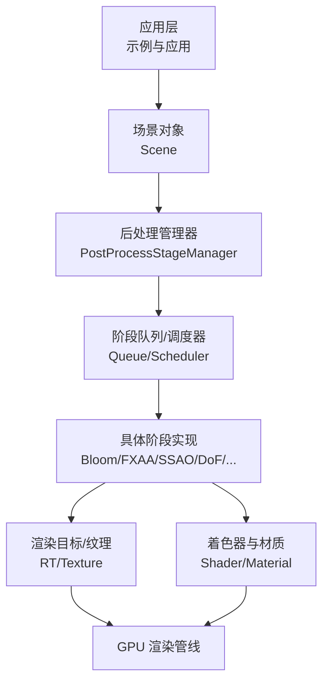
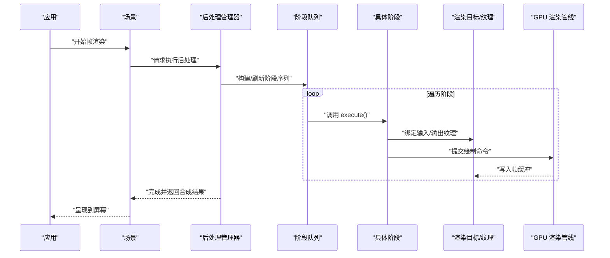
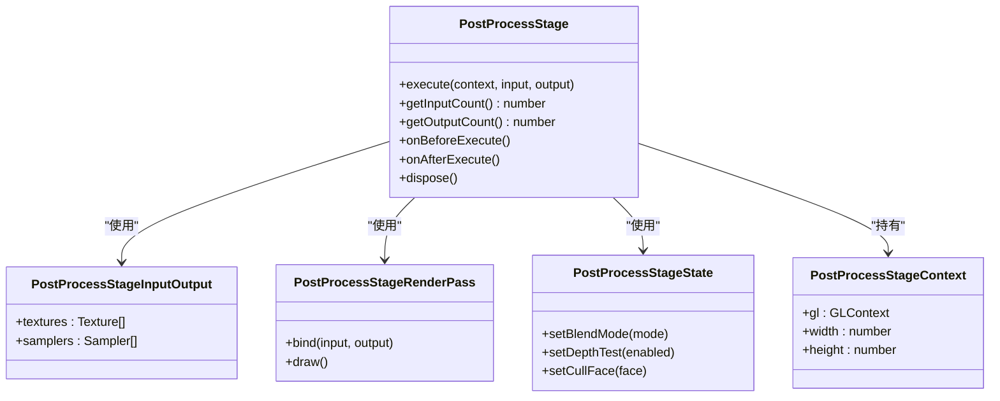
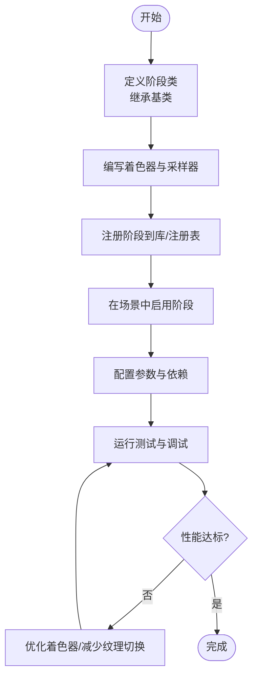
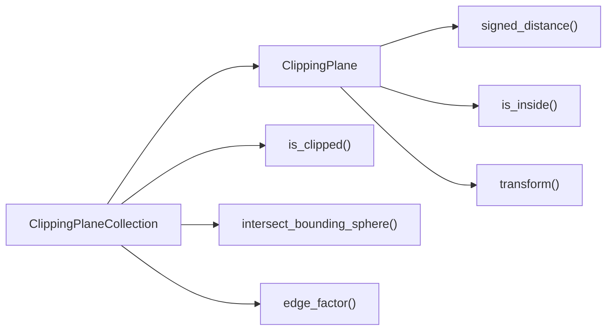
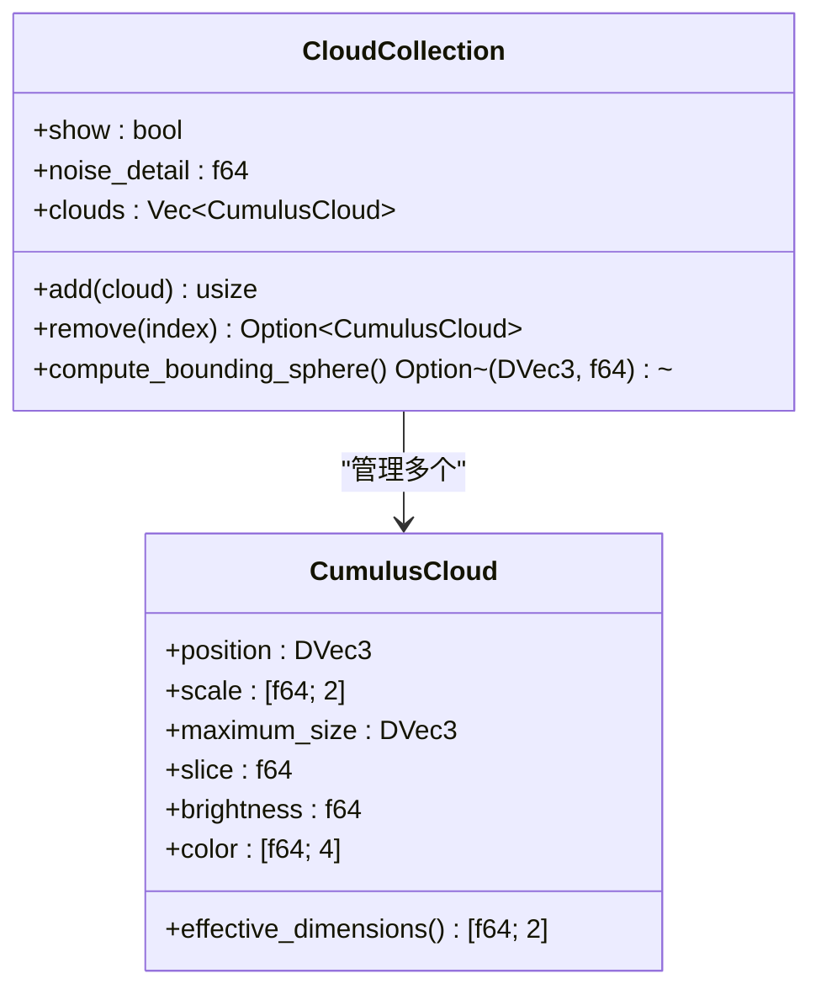
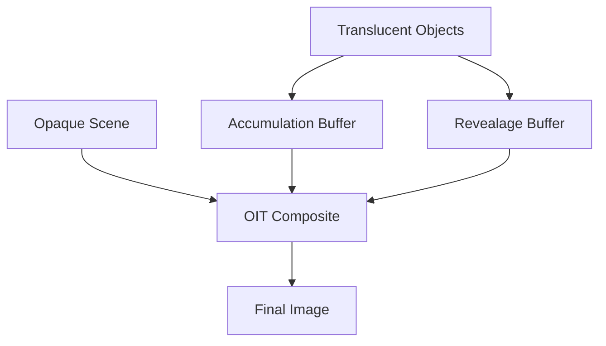
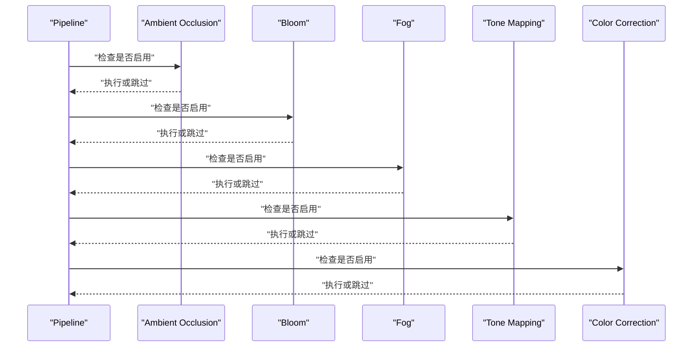
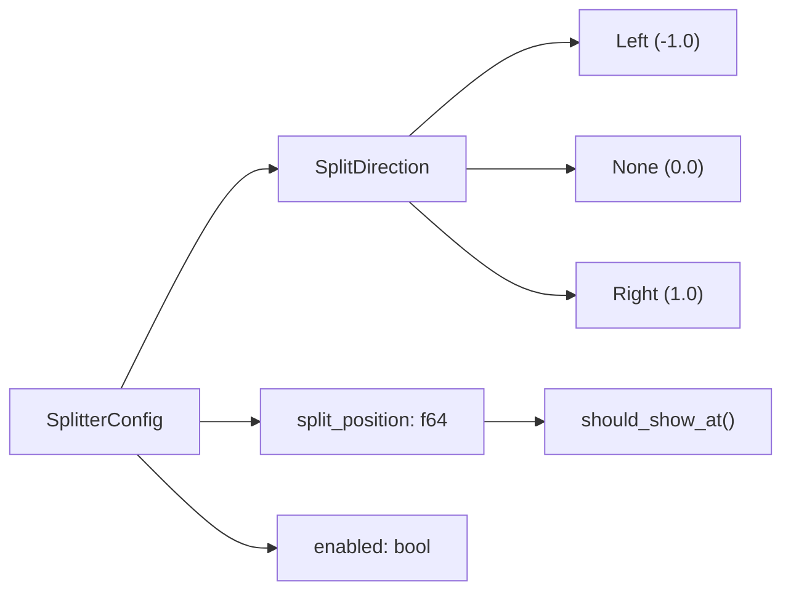
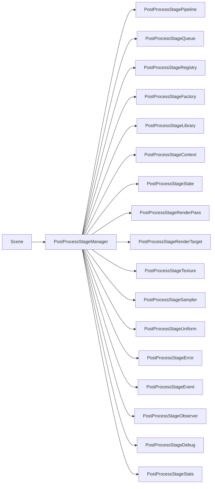

# 特效与后处理系统

<cite>
**本文引用的文件**   
- [cesiumrust/domain/effects/src/post_process.rs](file://cesiumrust/domain/effects/src/post_process.rs)
- [cesiumrust/adapters/bevy-render/src/effects/post_process.rs](file://cesiumrust/adapters/bevy-render/src/effects/post_process.rs)
- [cesiumrust/domain/effects/src/post_process_stage.rs](file://cesiumrust/domain/effects/src/post_process_stage.rs)
- [cesiumrust/domain/effects/src/clipping.rs](file://cesiumrust/domain/effects/src/clipping.rs)
- [cesiumrust/domain/effects/src/cloud.rs](file://cesiumrust/domain/effects/src/cloud.rs)
- [cesiumrust/domain/effects/src/oit.rs](file://cesiumrust/domain/effects/src/oit.rs)
- [cesiumrust/domain/effects/src/split.rs](file://cesiumrust/domain/effects/src/split.rs)
- [cesiumrust/domain/effects/src/lib.rs](file://cesiumrust/domain/effects/src/lib.rs)
</cite>

## 更新摘要
**所做更改**   
- 新增高级渲染效果章节，涵盖裁剪平面、云渲染、无顺序透明度、后处理管道和分屏效果
- 更新核心组件部分以反映新的渲染能力
- 扩展架构总览以包含新的高级渲染功能
- 添加新的详细组件分析章节

## 目录
1. [简介](#简介)
2. [项目结构](#项目结构)
3. [核心组件](#核心组件)
4. [架构总览](#架构总览)
5. [详细组件分析](#详细组件分析)
6. [依赖关系分析](#依赖关系分析)
7. [性能考量](#性能考量)
8. [故障排查指南](#故障排查指南)
9. [结论](#结论)
10. [附录](#附录)

## 简介
本章节概述 Cesium 的"特效与后处理系统"的目标、范围与使用方式。该系统通过可插拔的后处理阶段（Post Process Stage）对渲染结果进行二次加工，实现诸如泛光、景深、抗锯齿、色调映射等视觉增强效果。**最新更新**：系统现已支持高级渲染效果，包括裁剪平面支持、云渲染效果、无顺序透明度渲染、增强的后处理管道以及分屏效果。整体设计强调模块化、可扩展性与运行时可配置性，便于在复杂三维场景中按需组合多种后处理效果。

## 项目结构
从仓库视角看，特效与后处理相关代码主要位于 Rust 域层中，围绕 Scene 生命周期进行集成，并通过 PostProcessStage 抽象定义统一的阶段接口与管线编排。

**图表来源**   
- [cesiumrust/domain/effects/src/post_process.rs:1-581](file://cesiumrust/domain/effects/src/post_process.rs#L1-L581)
- [cesiumrust/adapters/bevy-render/src/effects/post_process.rs:1-424](file://cesiumrust/adapters/bevy-render/src/effects/post_process.rs#L1-L424)
- [cesiumrust/domain/effects/src/post_process_stage.rs:1-682](file://cesiumrust/domain/effects/src/post_process_stage.rs#L1-L682)

## 核心组件
- 场景集成点：负责在后处理阶段注册、启用/禁用、参数更新以及渲染时机的触发。
- 阶段抽象：统一描述输入输出、采样器、渲染通道、状态与生命周期钩子。
- 阶段库与工厂：提供常用阶段的注册、创建与默认配置。
- 运行期管理：负责阶段排序、依赖解析、错误上报、统计与调试信息收集。
- **新增高级渲染组件**：支持裁剪平面、云渲染、无顺序透明度、增强后处理管道和分屏效果。

**章节来源**   
- [cesiumrust/domain/effects/src/post_process.rs:1-581](file://cesiumrust/domain/effects/src/post_process.rs#L1-L581)
- [cesiumrust/domain/effects/src/post_process_stage.rs:1-682](file://cesiumrust/domain/effects/src/post_process_stage.rs#L1-L682)
- [cesiumrust/domain/effects/src/lib.rs:1-56](file://cesiumrust/domain/effects/src/lib.rs#L1-L56)

## 架构总览
下图展示了从场景到 GPU 的整体数据流与控制流：场景驱动后处理管理器，管理器按序执行各阶段；每个阶段读取上一阶段的输出或场景缓冲，写入新的渲染目标，最终合成到屏幕。

**图表来源**   
- [cesiumrust/domain/effects/src/post_process.rs:326-369](file://cesiumrust/domain/effects/src/post_process.rs#L326-L369)
- [cesiumrust/adapters/bevy-render/src/effects/post_process.rs:48-79](file://cesiumrust/adapters/bevy-render/src/effects/post_process.rs#L48-L79)
- [cesiumrust/domain/effects/src/post_process_stage.rs:281-437](file://cesiumrust/domain/effects/src/post_process_stage.rs#L281-L437)

## 详细组件分析

### 阶段抽象与基类
- 职责：定义阶段通用能力，包括输入输出纹理、采样器、渲染通道、状态设置、生命周期事件、错误与日志上报等。
- 关键点：
  - 输入/输出：支持多纹理输入与多渲染目标输出，便于复杂管线。
  - 资源管理：自动分配/复用渲染目标与纹理，避免频繁分配。
  - 状态与上下文：封装 WebGL/WebGPU 差异，提供统一 API。
  - 事件与观测：为调试、统计、遥测提供扩展点。

**图表来源**   
- [cesiumrust/domain/effects/src/post_process_stage.rs:57-125](file://cesiumrust/domain/effects/src/post_process_stage.rs#L57-L125)

**章节来源**   
- [cesiumrust/domain/effects/src/post_process_stage.rs:57-125](file://cesiumrust/domain/effects/src/post_process_stage.rs#L57-L125)

### 常见后处理阶段
- Bloom（泛光）：提取亮部、多次模糊、叠加回原图，提升高光表现。
- FXAA（快速近似抗锯齿）：基于边缘检测的轻量级抗锯齿方案。
- SSAO（屏幕空间环境光遮蔽）：利用深度与法线估算遮挡，增强立体感。
- Depth of Field（景深）：根据距离模拟虚化，突出主体。
- Tone Mapping（色调映射）：将 HDR 内容映射到 LDR 显示范围。
- Color Adjustment/Correction（色彩调整/校正）：亮度、对比度、饱和度、色温等。
- Screen Space Reflections（屏幕空间反射）：基于屏幕信息的反射近似。
- Temporal Anti-Aliasing（时间抗锯齿）：跨帧累积降低闪烁。
- Outline（描边）、Chromatic Aberration（色差）、Glow（辉光）、Motion Blur（运动模糊）、Grain（胶片颗粒）、Edge Detection（边缘检测）、HDR（高动态范围）等。

**章节来源**   
- [cesiumrust/domain/effects/src/post_process.rs:26-324](file://cesiumrust/domain/effects/src/post_process.rs#L26-L324)
- [cesiumrust/domain/effects/src/post_process_stage.rs:176-249](file://cesiumrust/domain/effects/src/post_process_stage.rs#L176-L249)

### 自定义阶段开发流程
- 步骤概览：
  1) 继承阶段基类，实现输入/输出数量与执行逻辑。
  2) 准备着色器与常量/纹理采样器。
  3) 在阶段库或注册表中注册名称与工厂。
  4) 在场景中启用阶段并传入参数。
  5) 使用调试/统计工具验证性能与正确性。

**图表来源**   
- [cesiumrust/domain/effects/src/post_process_stage.rs:84-125](file://cesiumrust/domain/effects/src/post_process_stage.rs#L84-L125)

**章节来源**   
- [cesiumrust/domain/effects/src/post_process_stage.rs:84-125](file://cesiumrust/domain/effects/src/post_process_stage.rs#L84-L125)

### 渲染目标与纹理管理
- 要点：
  - 多缓冲交替：避免读写冲突，采用 ping-pong 策略。
  - 分辨率适配：根据视口与缩放因子动态调整 RT 尺寸。
  - 格式选择：根据阶段需求选择线性/sRGB、浮点/整型等。
  - 内存回收：阶段销毁时释放纹理与渲染目标。

**章节来源**   
- [cesiumrust/domain/effects/src/post_process_stage.rs:26-36](file://cesiumrust/domain/effects/src/post_process_stage.rs#L26-L36)

### 管线编排与依赖解析
- 目标：确保阶段顺序合理，满足前驱/后继依赖，避免循环依赖。
- 机制：
  - 拓扑排序：基于依赖关系生成执行序列。
  - 优先级与分组：允许用户指定阶段组与相对顺序。
  - 失败回退：当某阶段不可用时降级或跳过。

**章节来源**   
- [cesiumrust/domain/effects/src/post_process_stage.rs:281-437](file://cesiumrust/domain/effects/src/post_process_stage.rs#L281-L437)

### 错误处理、事件与调试
- 错误类型：初始化失败、着色器编译错误、纹理分配失败、状态不一致等。
- 事件与观测：阶段生命周期事件、异常上报、统计指标采集。
- 调试工具：可视化阶段输出、逐帧回放、性能剖析。

### 新增高级渲染效果

#### 裁剪平面支持 (Clipping Planes)
- 功能：支持多个裁剪平面的几何体裁剪，用于精确控制可见区域。
- 特性：
  - 支持任意方向的无限平面裁剪
  - 多平面组合裁剪（交集/并集模式）
  - 实时动态裁剪更新
  - 高性能 GPU 端裁剪计算
  - 边界高亮显示

**图表来源**   
- [cesiumrust/domain/effects/src/clipping.rs:101-327](file://cesiumrust/domain/effects/src/clipping.rs#L101-L327)

**章节来源**   
- [cesiumrust/domain/effects/src/clipping.rs:1-651](file://cesiumrust/domain/effects/src/clipping.rs#L1-L651)

#### 云渲染效果 (Cloud Rendering)
- 功能：逼真的云层渲染，支持体积云和分层云。
- 特性：
  - 体积光照散射计算
  - 多层云密度混合
  - 动态云形变动画
  - 自适应 LOD 细节层次
  - 噪声纹理控制

**图表来源**   
- [cesiumrust/domain/effects/src/cloud.rs:113-261](file://cesiumrust/domain/effects/src/cloud.rs#L113-L261)

**章节来源**   
- [cesiumrust/domain/effects/src/cloud.rs:1-424](file://cesiumrust/domain/effects/src/cloud.rs#L1-L424)

#### 无顺序透明度 (Order Independent Transparency - OIT)
- 功能：解决传统透明度排序问题，实现正确的半透明物体渲染。
- 特性：
  - 加权累加透明度混合
  - 支持复杂几何体透明度
  - 内存高效的缓冲区管理
  - 可调节的质量与性能平衡
  - MRT（多重渲染目标）支持

**图表来源**   
- [cesiumrust/domain/effects/src/oit.rs:106-235](file://cesiumrust/domain/effects/src/oit.rs#L106-L235)

**章节来源**   
- [cesiumrust/domain/effects/src/oit.rs:1-366](file://cesiumrust/domain/effects/src/oit.rs#L1-L366)

#### 增强后处理管道 (Enhanced Post-Processing Pipeline)
- 功能：改进的后处理管线架构，支持更复杂的视觉效果链。
- 特性：
  - 并行阶段执行优化
  - 动态阶段依赖解析
  - 内存池化管理
  - 插件式阶段架构
  - 可配置的阶段顺序

**图表来源**   
- [cesiumrust/domain/effects/src/post_process.rs:326-369](file://cesiumrust/domain/effects/src/post_process.rs#L326-L369)

**章节来源**   
- [cesiumrust/domain/effects/src/post_process.rs:1-581](file://cesiumrust/domain/effects/src/post_process.rs#L1-L581)

#### 分屏效果 (Split Screen Effects)
- 功能：支持多视图分屏渲染，用于对比不同渲染效果。
- 特性：
  - 自定义分屏布局
  - 独立相机控制
  - 同步渲染状态
  - 交互式分屏切换
  - 着色器级别的分割逻辑

**图表来源**   
- [cesiumrust/domain/effects/src/split.rs:64-122](file://cesiumrust/domain/effects/src/split.rs#L64-L122)

**章节来源**   
- [cesiumrust/domain/effects/src/split.rs:1-233](file://cesiumrust/domain/effects/src/split.rs#L1-L233)

## 依赖关系分析
- 内聚与耦合：
  - 阶段之间尽量无直接耦合，通过输入/输出纹理与统一上下文交互。
  - 管理器与队列解耦，便于替换调度策略。
- 外部依赖：
  - 底层图形 API（WebGL/WebGPU）由 Context 封装。
  - 场景提供相机、光照、几何体等全局状态供阶段采样。

**图表来源**   
- [cesiumrust/domain/effects/src/lib.rs:20-56](file://cesiumrust/domain/effects/src/lib.rs#L20-L56)

**章节来源**   
- [cesiumrust/domain/effects/src/lib.rs:1-56](file://cesiumrust/domain/effects/src/lib.rs#L1-L56)

## 性能考量
- 纹理与带宽：
  - 控制中间缓冲数量与分辨率，避免过度放大。
  - 复用渲染目标，减少分配开销。
- 着色器复杂度：
  - 合并计算、减少分支与纹理采样次数。
  - 合理使用 Mipmap 与过滤模式。
- 批处理与并行：
  - 尽可能合并绘制调用，减少状态切换。
  - 在安全前提下并行执行独立阶段。
- 自适应质量：
  - 根据设备能力与帧预算动态关闭或降级昂贵效果。
- 监控与剖析：
  - 使用统计与调试工具定位瓶颈，持续优化。
- **新增高级效果性能考虑**：
  - 裁剪平面：批量处理多平面裁剪，减少 CPU-GPU 通信。
  - 云渲染：使用 LOD 和视锥剔除优化大规模云层渲染。
  - OIT：选择合适的混合策略平衡质量与性能。
  - 分屏效果：共享渲染状态，减少重复计算。

## 故障排查指南
- 常见问题：
  - 阶段未注册或工厂缺失：检查库与注册表是否正确加载。
  - 纹理尺寸不匹配：确认输入/输出一致且随视口变化同步更新。
  - 着色器编译失败：查看错误日志与调试输出，修正语法或平台差异。
  - 状态污染：确保每个阶段在进入/退出时正确设置/恢复状态。
- 诊断手段：
  - 启用调试视图，逐阶段观察中间结果。
  - 开启统计面板，关注耗时与内存占用。
  - 捕获异常事件，结合堆栈定位问题。
- **新增高级效果故障排查**：
  - 裁剪平面：检查平面方程系数和裁剪顺序。
  - 云渲染：验证光照方向和云密度参数。
  - OIT：确认透明度阈值和混合权重设置。
  - 分屏效果：检查相机投影矩阵和视口设置。

**章节来源**   
- [cesiumrust/domain/effects/src/post_process.rs:371-581](file://cesiumrust/domain/effects/src/post_process.rs#L371-L581)
- [cesiumrust/adapters/bevy-render/src/effects/post_process.rs:203-424](file://cesiumrust/adapters/bevy-render/src/effects/post_process.rs#L203-L424)

## 结论
该特效与后处理系统以"阶段"为核心抽象，配合统一的上下文、资源管理与编排机制，实现了灵活、可扩展的视觉效果管线。**最新更新**：系统现已支持高级渲染效果，包括裁剪平面、云渲染、无顺序透明度、增强后处理管道和分屏效果，大大提升了渲染质量和灵活性。通过合理的阶段设计与性能调优，可在不同设备上获得稳定且高质量的渲染体验。建议在实际项目中优先评估必要效果，结合监控与调试工具持续优化。

## 附录
- 最佳实践清单：
  - 明确阶段依赖与顺序，避免循环。
  - 限制中间缓冲数量与分辨率。
  - 使用合适的纹理格式与采样器。
  - 为关键路径添加统计与日志。
  - 针对移动端做额外降级策略。
  - **新增高级效果最佳实践**：
    - 裁剪平面：合理组织裁剪顺序，避免不必要的裁剪计算。
    - 云渲染：使用距离雾化和视锥剔除优化性能。
    - OIT：根据场景复杂度选择合适的混合策略。
    - 分屏效果：共享渲染状态，避免重复计算。