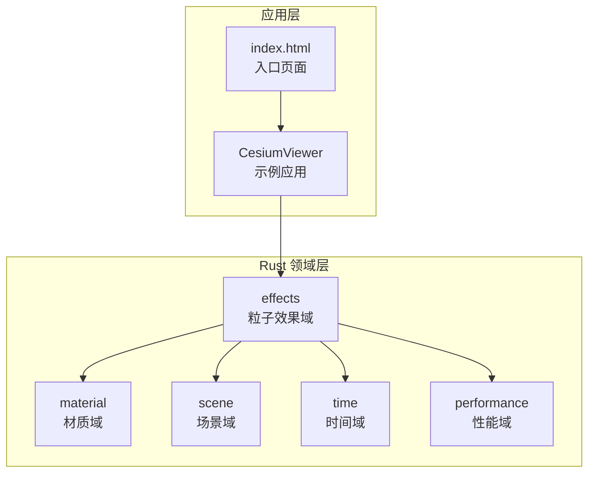
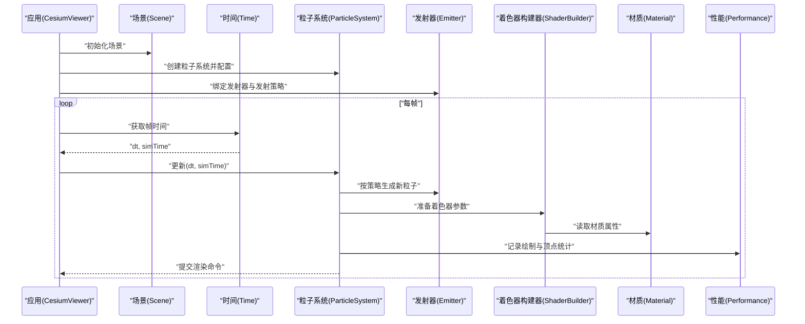
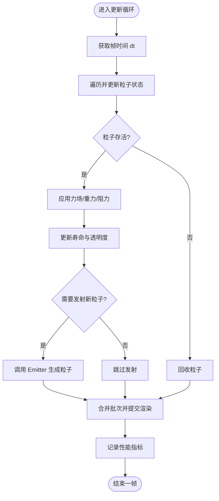
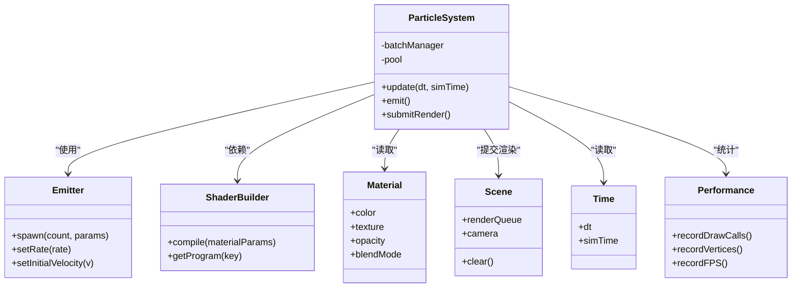

# 粒子效果系统

<cite>
**本文引用的文件**   
- [README.md](file://README.md)
- [package.json](file://package.json)
- [CesiumViewer.js](file://Apps/CesiumViewer/CesiumViewer.js)
- [index.html](file://Apps/CesiumViewer/index.html)
- [effects.rs](file://cesiumrust/domain/effects/src/lib.rs)
- [particle_system.rs](file://cesiumrust/domain/effects/src/particle_system.rs)
- [emitter.rs](file://cesiumrust/domain/effects/src/emitter.rs)
- [shader_builder.rs](file://cesiumrust/domain/effects/src/shader_builder.rs)
- [material.rs](file://cesiumrust/domain/material/src/material.rs)
- [scene.rs](file://cesiumrust/domain/scene/src/scene.rs)
- [time.rs](file://cesiumrust/domain/time/src/time.rs)
- [performance.rs](file://cesiumrust/domain/performance/src/performance.rs)
</cite>

## 目录
1. [简介](#简介)
2. [项目结构](#项目结构)
3. [核心组件](#核心组件)
4. [架构总览](#架构总览)
5. [详细组件分析](#详细组件分析)
6. [依赖关系分析](#依赖关系分析)
7. [性能考量](#性能考量)
8. [故障排查指南](#故障排查指南)
9. [结论](#结论)
10. [附录](#附录)

## 简介
本文件面向“粒子效果系统”的文档，聚焦于 Cesium Rust 分支（cesiumrust）中的 effects 域与相关渲染、材质、场景、时间与性能模块。目标是帮助读者快速理解粒子系统的整体架构、关键数据流、处理逻辑与集成点，并提供可操作的排障建议与性能优化指引。

## 项目结构
仓库采用多语言混合结构：
- JavaScript/TypeScript 层（Apps、packages、Scripts）：提供示例应用与构建脚本。
- Rust 层（cesiumrust）：以领域驱动的方式组织功能模块，其中 domain/effects 负责粒子效果的核心实现；domain/material、domain/scene、domain/time、domain/performance 等模块为渲染、场景管理、时间推进与性能监控提供支持。

图表来源
- [CesiumViewer.js:1-200](file://Apps/CesiumViewer/CesiumViewer.js#L1-L200)
- [index.html:1-200](file://Apps/CesiumViewer/index.html#L1-L200)
- [effects.rs:1-200](file://cesiumrust/domain/effects/src/lib.rs#L1-L200)
- [material.rs:1-200](file://cesiumrust/domain/material/src/material.rs#L1-L200)
- [scene.rs:1-200](file://cesiumrust/domain/scene/src/scene.rs#L1-L200)
- [time.rs:1-200](file://cesiumrust/domain/time/src/time.rs#L1-L200)
- [performance.rs:1-200](file://cesiumrust/domain/performance/src/performance.rs#L1-L200)

章节来源
- [README.md:1-200](file://README.md#L1-L200)
- [package.json:1-200](file://package.json#L1-L200)

## 核心组件
- 粒子系统（Particle System）：维护粒子生命周期、更新策略、批次化与渲染队列。
- 发射器（Emitter）：负责粒子的生成、初始属性设置与发射节奏控制。
- 着色器构建器（Shader Builder）：根据材质与粒子参数动态生成或选择着色程序。
- 材质（Material）：定义颜色、纹理、透明度、发光等外观属性。
- 场景（Scene）：管理渲染上下文、相机、深度与排序。
- 时间（Time）：提供帧时间、模拟时间推进与插值。
- 性能（Performance）：统计绘制调用、顶点数、内存占用与帧率指标。

章节来源
- [particle_system.rs:1-200](file://cesiumrust/domain/effects/src/particle_system.rs#L1-L200)
- [emitter.rs:1-200](file://cesiumrust/domain/effects/src/emitter.rs#L1-L200)
- [shader_builder.rs:1-200](file://cesiumrust/domain/effects/src/shader_builder.rs#L1-L200)
- [material.rs:1-200](file://cesiumrust/domain/material/src/material.rs#L1-L200)
- [scene.rs:1-200](file://cesiumrust/domain/scene/src/scene.rs#L1-L200)
- [time.rs:1-200](file://cesiumrust/domain/time/src/time.rs#L1-L200)
- [performance.rs:1-200](file://cesiumrust/domain/performance/src/performance.rs#L1-L200)

## 架构总览
下图展示了从应用入口到 Rust 粒子效果域的调用链路与数据流向。

图表来源
- [CesiumViewer.js:1-200](file://Apps/CesiumViewer/CesiumViewer.js#L1-L200)
- [scene.rs:1-200](file://cesiumrust/domain/scene/src/scene.rs#L1-L200)
- [time.rs:1-200](file://cesiumrust/domain/time/src/time.rs#L1-L200)
- [particle_system.rs:1-200](file://cesiumrust/domain/effects/src/particle_system.rs#L1-L200)
- [emitter.rs:1-200](file://cesiumrust/domain/effects/src/emitter.rs#L1-L200)
- [shader_builder.rs:1-200](file://cesiumrust/domain/effects/src/shader_builder.rs#L1-L200)
- [material.rs:1-200](file://cesiumrust/domain/material/src/material.rs#L1-L200)
- [performance.rs:1-200](file://cesiumrust/domain/performance/src/performance.rs#L1-L200)

## 详细组件分析

### 粒子系统（Particle System）
- 职责：管理粒子池、生命周期、状态更新、批量提交渲染。
- 关键流程：
  - 初始化：分配缓冲区、注册材质与着色器参数。
  - 更新：基于 dt 推进每个粒子的位置、速度、寿命与可见性。
  - 发射：委托给 Emitter 按策略生成新粒子。
  - 渲染：合并批次、提交绘制调用，并上报性能指标。

图表来源
- [particle_system.rs:1-200](file://cesiumrust/domain/effects/src/particle_system.rs#L1-L200)
- [emitter.rs:1-200](file://cesiumrust/domain/effects/src/emitter.rs#L1-L200)
- [performance.rs:1-200](file://cesiumrust/domain/performance/src/performance.rs#L1-L200)

章节来源
- [particle_system.rs:1-200](file://cesiumrust/domain/effects/src/particle_system.rs#L1-L200)

### 发射器（Emitter）
- 职责：控制发射频率、初始速度分布、角度范围、随机种子与生命周期。
- 关键点：
  - 发射模式：连续、脉冲、触发式。
  - 初始属性：位置偏移、速度向量、旋转、缩放、颜色渐变。
  - 资源复用：避免频繁分配，降低 GC 压力。

章节来源
- [emitter.rs:1-200](file://cesiumrust/domain/effects/src/emitter.rs#L1-L200)

### 着色器构建器（Shader Builder）
- 职责：根据材质与粒子参数生成或缓存着色程序，统一注入 Uniforms。
- 关键点：
  - 参数化：支持纹理、颜色、透明度、法线贴图、光照模型。
  - 缓存策略：按材质签名缓存编译结果，减少重复开销。
  - 兼容性：适配不同后端与平台特性。

章节来源
- [shader_builder.rs:1-200](file://cesiumrust/domain/effects/src/shader_builder.rs#L1-L200)

### 材质（Material）
- 职责：描述粒子的视觉属性与渲染行为。
- 关键点：
  - 属性：颜色、纹理、透明度、发光强度、混合模式。
  - 动画：随时间变化的颜色/纹理采样。
  - 性能：尽量使用图集与预烘焙纹理以降低采样开销。

章节来源
- [material.rs:1-200](file://cesiumrust/domain/material/src/material.rs#L1-L200)

### 场景（Scene）
- 职责：管理渲染上下文、相机、深度缓冲、排序与批处理。
- 关键点：
  - 渲染管线：清理、排序、绘制、后处理。
  - 空间变换：世界矩阵、视图矩阵、投影矩阵。
  - 资源管理：纹理、几何体、着色器的生命周期。

章节来源
- [scene.rs:1-200](file://cesiumrust/domain/scene/src/scene.rs#L1-L200)

### 时间（Time）
- 职责：提供稳定的帧时间与模拟时间推进。
- 关键点：
  - 帧时间：dt 用于物理与动画步进。
  - 模拟时间：全局 simTime 用于时序效果（如烟雾扩散）。
  - 插值：平滑过渡与抖动抑制。

章节来源
- [time.rs:1-200](file://cesiumrust/domain/time/src/time.rs#L1-L200)

### 性能（Performance）
- 职责：采集与上报渲染与 CPU/GPU 指标。
- 关键点：
  - 指标：绘制调用次数、顶点数、三角形数、帧率、内存占用。
  - 采样：低开销采样策略，避免影响主循环。
  - 输出：日志、可视化面板或外部监控系统。

章节来源
- [performance.rs:1-200](file://cesiumrust/domain/performance/src/performance.rs#L1-L200)

## 依赖关系分析
粒子效果系统对材质、场景、时间与性能模块存在强依赖，同时通过事件与回调与上层应用交互。

图表来源
- [particle_system.rs:1-200](file://cesiumrust/domain/effects/src/particle_system.rs#L1-L200)
- [emitter.rs:1-200](file://cesiumrust/domain/effects/src/emitter.rs#L1-L200)
- [shader_builder.rs:1-200](file://cesiumrust/domain/effects/src/shader_builder.rs#L1-L200)
- [material.rs:1-200](file://cesiumrust/domain/material/src/material.rs#L1-L200)
- [scene.rs:1-200](file://cesiumrust/domain/scene/src/scene.rs#L1-L200)
- [time.rs:1-200](file://cesiumrust/domain/time/src/time.rs#L1-L200)
- [performance.rs:1-200](file://cesiumrust/domain/performance/src/performance.rs#L1-L200)

章节来源
- [effects.rs:1-200](file://cesiumrust/domain/effects/src/lib.rs#L1-L200)

## 性能考量
- 批处理与合并：尽可能将相同材质的粒子合并绘制，减少 DrawCall。
- 对象池：复用粒子对象与临时数组，避免频繁分配与回收。
- 纹理图集：减少纹理切换，提升 GPU 缓存命中率。
- 计算简化：在 CPU 端进行粗略剔除与 LOD，降低 GPU 负担。
- 采样与监控：开启性能模块，定位瓶颈（CPU 更新 vs GPU 渲染）。

[本节为通用指导，不直接分析具体文件]

## 故障排查指南
- 粒子不显示：
  - 检查材质是否正确加载与绑定。
  - 确认着色器编译成功且参数一致。
  - 验证相机视锥体与粒子位置。
- 性能骤降：
  - 查看性能模块统计，定位高 DrawCall 或大顶点数。
  - 减少粒子数量或启用 LOD。
  - 检查纹理尺寸与格式是否过大。
- 时间异常：
  - 确认 dt 与 simTime 更新逻辑稳定。
  - 避免在主循环中进行阻塞操作。

章节来源
- [performance.rs:1-200](file://cesiumrust/domain/performance/src/performance.rs#L1-L200)
- [shader_builder.rs:1-200](file://cesiumrust/domain/effects/src/shader_builder.rs#L1-L200)
- [material.rs:1-200](file://cesiumrust/domain/material/src/material.rs#L1-L200)
- [time.rs:1-200](file://cesiumrust/domain/time/src/time.rs#L1-L200)

## 结论
粒子效果系统在 Cesium Rust 中通过清晰的领域划分与模块化设计，实现了可扩展、高性能的粒子渲染能力。结合材质、场景、时间与性能模块，能够灵活适配多种视觉效果需求。建议在开发过程中持续关注性能指标与资源管理，确保在大规模粒子场景下的稳定性与流畅度。

[本节为总结，不直接分析具体文件]

## 附录
- 示例应用入口与集成方式参见 CesiumViewer 与 index.html。
- 构建与运行脚本位于 scripts 与 gulpfile 中。

章节来源
- [CesiumViewer.js:1-200](file://Apps/CesiumViewer/CesiumViewer.js#L1-L200)
- [index.html:1-200](file://Apps/CesiumViewer/index.html#L1-L200)