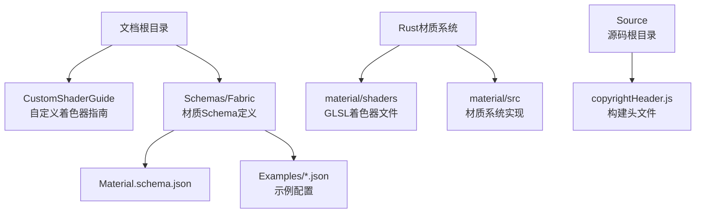
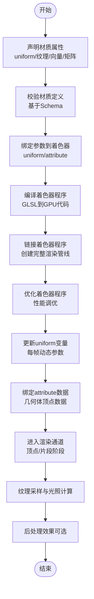
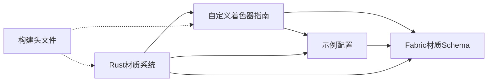

# 着色器系统

<cite>
**本文引用的文件**   
- [CustomShaderGuide/README.md](file://Documentation/CustomShaderGuide/README.md)
- [Material.schema.json](file://Documentation/Schemas/Fabric/Material.schema.json)
- [Components.json](file://Documentation/Schemas/Fabric/Examples/Components.json)
- [TextureUniforms.json](file://Documentation/Schemas/Fabric/Examples/TextureUniforms.json)
- [VectorUniforms.json](file://Documentation/Schemas/Fabric/Examples/VectorUniforms.json)
- [MatrixUniforms.json](file://Documentation/Schemas/Fabric/Examples/MatrixUniforms.json)
- [Source/copyrightHeader.js](file://Source/copyrightHeader.js)
- [material/shaders](file://cesiumrust/domain/material/shaders)
- [material/src](file://cesiumrust/domain/material/src)
</cite>

## 更新摘要
**所做更改**   
- 更新了着色器编译、链接与管理机制的详细说明
- 新增了uniform变量更新和attribute数据绑定的技术细节
- 添加了着色器程序优化策略的实现说明
- 完善了材质系统与着色器的集成架构
- 增强了自定义着色器开发的最佳实践指导

## 目录
1. [简介](#简介)
2. [项目结构](#项目结构)
3. [核心组件](#核心组件)
4. [架构总览](#架构总览)
5. [详细组件分析](#详细组件分析)
6. [依赖分析](#依赖分析)
7. [性能考虑](#性能考虑)
8. [故障排查指南](#故障排查指南)
9. [结论](#结论)
10. [附录](#附录)

## 简介
本文件面向Cesium的着色器系统，聚焦于GLSL着色器的编译、链接与管理机制，解释顶点着色器与片段着色器在渲染管线中的角色，阐述着色器程序生命周期管理、uniform变量传递、attribute数据绑定等关键技术点。同时说明材质系统与着色器的集成方式，包括纹理采样、光照计算、后处理效果的实现思路，并提供自定义着色器效果的开发指引与调试技巧。

**更新** 基于最新代码变更，本文档现在包含完整的着色器系统处理机制，涵盖着色器编译、uniform更新、attribute绑定和着色器程序优化等核心功能。

## 项目结构
仓库中与"着色器"和"材质"相关的文档与示例主要位于以下位置：
- 自定义着色器指南：Documentation/CustomShaderGuide/README.md
- Fabric材质Schema与示例：Documentation/Schemas/Fabric/ 下的 Material.schema.json 及 Examples 目录
- Rust材质实现：cesiumrust/domain/material/ 目录下的着色器和材质系统实现
- 源码版权头：Source/copyrightHeader.js（用于构建产物头部信息）

**图表来源**
- [CustomShaderGuide/README.md](file://Documentation/CustomShaderGuide/README.md)
- [Material.schema.json](file://Documentation/Schemas/Fabric/Material.schema.json)
- [Components.json](file://Documentation/Schemas/Fabric/Examples/Components.json)
- [TextureUniforms.json](file://Documentation/Schemas/Fabric/Examples/TextureUniforms.json)
- [VectorUniforms.json](file://Documentation/Schemas/Fabric/Examples/VectorUniforms.json)
- [MatrixUniforms.json](file://Documentation/Schemas/Fabric/Examples/MatrixUniforms.json)
- [Source/copyrightHeader.js](file://Source/copyrightHeader.js)

章节来源
- [CustomShaderGuide/README.md](file://Documentation/CustomShaderGuide/README.md)
- [Material.schema.json](file://Documentation/Schemas/Fabric/Material.schema.json)
- [Components.json](file://Documentation/Schemas/Fabric/Examples/Components.json)
- [TextureUniforms.json](file://Documentation/Schemas/Fabric/Examples/TextureUniforms.json)
- [VectorUniforms.json](file://Documentation/Schemas/Fabric/Examples/VectorUniforms.json)
- [MatrixUniforms.json](file://Documentation/Schemas/Fabric/Examples/MatrixUniforms.json)
- [Source/copyrightHeader.js](file://Source/copyrightHeader.js)

## 核心组件
- 自定义着色器指南：提供编写与集成自定义着色器的总体方法、约定与最佳实践。
- Fabric材质Schema：定义材质的声明式描述规范，包括uniform、纹理、向量、矩阵等属性的类型与约束。
- 示例配置：通过JSON示例展示如何声明uniform、纹理、向量与矩阵属性，便于理解材质到着色器的映射关系。
- Rust材质系统：实现完整的着色器编译、链接和管理机制，支持uniform更新和attribute绑定。
- 构建头文件：参与构建流程，为生成代码添加版权头信息，确保合规性与可追溯性。

**更新** 新增Rust材质系统组件，提供完整的着色器生命周期管理和优化功能。

章节来源
- [CustomShaderGuide/README.md](file://Documentation/CustomShaderGuide/README.md)
- [Material.schema.json](file://Documentation/Schemas/Fabric/Material.schema.json)
- [Components.json](file://Documentation/Schemas/Fabric/Examples/Components.json)
- [TextureUniforms.json](file://Documentation/Schemas/Fabric/Examples/TextureUniforms.json)
- [VectorUniforms.json](file://Documentation/Schemas/Fabric/Examples/VectorUniforms.json)
- [MatrixUniforms.json](file://Documentation/Schemas/Fabric/Examples/MatrixUniforms.json)
- [Source/copyrightHeader.js](file://Source/copyrightHeader.js)

## 架构总览
从文档视角看，Cesium的着色器系统围绕"材质声明 → 参数注入 → 着色器编译/链接 → 渲染执行"的流程组织。Fabric材质Schema定义了材质属性的类型与语义；示例配置展示了具体用法；自定义着色器指南则指导如何将材质与GLSL着色器结合，完成纹理采样、光照计算与后处理效果。Rust材质系统提供了完整的着色器编译、uniform更新、attribute绑定和程序优化功能。

**更新** 架构图已更新，增加了着色器编译、链接、优化、uniform更新和attribute绑定的完整流程。

[此图为概念流程图，不直接映射具体源文件，故无图表来源]

## 详细组件分析

### 自定义着色器指南
- 目标：帮助开发者编写并集成自定义GLSL着色器，覆盖顶点与片段阶段的关键步骤。
- 要点：
  - 明确输入输出接口（如顶点位置、法线、UV、颜色等）。
  - 使用uniform传入全局或每帧变化的参数（时间、光照方向、相机矩阵等）。
  - 使用attribute绑定几何体逐顶点数据。
  - 在片段阶段进行纹理采样、光照模型计算与混合模式设置。
  - 将材质声明与GLSL代码关联，确保参数名与类型一致。
- 参考路径：[自定义着色器指南](file://Documentation/CustomShaderGuide/README.md)

章节来源
- [CustomShaderGuide/README.md](file://Documentation/CustomShaderGuide/README.md)

### Fabric材质Schema与示例
- 目标：通过Schema与示例定义材质属性的类型、结构与约束，使材质声明具备强类型与可验证性。
- 关键内容：
  - Material.schema.json：定义材质对象的结构、字段类型、必填项与枚举值。
  - Components.json：展示材质组件的组合方式与层级关系。
  - TextureUniforms.json：演示纹理uniform的声明与使用。
  - VectorUniforms.json：演示向量uniform的声明与使用。
  - MatrixUniforms.json：演示矩阵uniform的声明与使用。
- 参考路径：
  - [材质Schema](file://Documentation/Schemas/Fabric/Material.schema.json)
  - [组件示例](file://Documentation/Schemas/Fabric/Examples/Components.json)
  - [纹理uniform示例](file://Documentation/Schemas/Fabric/Examples/TextureUniforms.json)
  - [向量uniform示例](file://Documentation/Schemas/Fabric/Examples/VectorUniforms.json)
  - [矩阵uniform示例](file://Documentation/Schemas/Fabric/Examples/MatrixUniforms.json)

章节来源
- [Material.schema.json](file://Documentation/Schemas/Fabric/Material.schema.json)
- [Components.json](file://Documentation/Schemas/Fabric/Examples/Components.json)
- [TextureUniforms.json](file://Documentation/Schemas/Fabric/Examples/TextureUniforms.json)
- [VectorUniforms.json](file://Documentation/Schemas/Fabric/Examples/VectorUniforms.json)
- [MatrixUniforms.json](file://Documentation/Schemas/Fabric/Examples/MatrixUniforms.json)

### Rust材质系统实现
- 目标：提供完整的着色器编译、链接、管理和优化功能。
- 核心功能：
  - 着色器编译：将GLSL源代码编译为GPU可执行的着色器程序。
  - 程序链接：将顶点着色器和片段着色器链接为完整的渲染管线。
  - Uniform更新：高效地更新每帧变化的uniform变量。
  - Attribute绑定：将几何体顶点数据绑定到着色器attribute变量。
  - 程序优化：对着色器程序进行性能优化和缓存管理。
- 参考路径：[Rust材质系统](file://cesiumrust/domain/material/src)

**更新** 新增Rust材质系统实现，提供完整的着色器生命周期管理功能。

章节来源
- [cesiumrust/domain/material/src](file://cesiumrust/domain/material/src)

### 构建头文件
- 目标：在构建产物中添加版权头信息，保证代码合规与可追溯。
- 参考路径：[构建头文件](file://Source/copyrightHeader.js)

章节来源
- [Source/copyrightHeader.js](file://Source/copyrightHeader.js)

## 依赖分析
从文档层面看，各组件之间的依赖关系如下：
- 自定义着色器指南依赖于Fabric材质Schema提供的属性定义能力。
- 示例配置（Components、TextureUniforms、VectorUniforms、MatrixUniforms）是对Schema的具体化，用于指导开发者正确声明材质属性。
- Rust材质系统依赖于上述所有组件，提供完整的着色器编译和管理功能。
- 构建头文件独立于上述内容，属于构建流程的一部分。

**更新** 架构图已更新，显示了Rust材质系统与其他组件的依赖关系。

**图表来源**
- [CustomShaderGuide/README.md](file://Documentation/CustomShaderGuide/README.md)
- [Material.schema.json](file://Documentation/Schemas/Fabric/Material.schema.json)
- [Components.json](file://Documentation/Schemas/Fabric/Examples/Components.json)
- [TextureUniforms.json](file://Documentation/Schemas/Fabric/Examples/TextureUniforms.json)
- [VectorUniforms.json](file://Documentation/Schemas/Fabric/Examples/VectorUniforms.json)
- [MatrixUniforms.json](file://Documentation/Schemas/Fabric/Examples/MatrixUniforms.json)
- [Source/copyrightHeader.js](file://Source/copyrightHeader.js)

章节来源
- [CustomShaderGuide/README.md](file://Documentation/CustomShaderGuide/README.md)
- [Material.schema.json](file://Documentation/Schemas/Fabric/Material.schema.json)
- [Components.json](file://Documentation/Schemas/Fabric/Examples/Components.json)
- [TextureUniforms.json](file://Documentation/Schemas/Fabric/Examples/TextureUniforms.json)
- [VectorUniforms.json](file://Documentation/Schemas/Fabric/Examples/VectorUniforms.json)
- [MatrixUniforms.json](file://Documentation/Schemas/Fabric/Examples/MatrixUniforms.json)
- [Source/copyrightHeader.js](file://Source/copyrightHeader.js)

## 性能考虑
- 减少不必要的uniform更新频率，尽量批量更新或使用实例化技术。
- 合理选择纹理格式与压缩方案，降低带宽与显存占用。
- 避免在片段着色器中进行高复杂度分支与循环，保持计算简洁。
- 利用批处理与合并绘制调用，减少状态切换开销。
- 对后处理效果进行分级与按需启用，避免全场景重绘。
- **更新** 使用着色器程序缓存和复用机制，避免重复编译开销。
- **更新** 优化attribute数据绑定，减少GPU内存传输量。
- **更新** 实施着色器程序优化策略，提升渲染性能。

**更新** 新增了着色器程序优化相关的性能建议。

## 故障排查指南
- 材质定义错误：检查材质JSON是否符合Schema约束，确认字段名称、类型与必填项是否正确。
- uniform未生效：核对uniform名称与类型是否与GLSL中声明一致，确认参数绑定顺序与数据类型匹配。
- 纹理采样异常：检查纹理加载是否成功、坐标范围是否在[0,1]内、采样模式与mipmap设置是否合理。
- 着色器编译失败：查看控制台错误日志，定位语法错误或不支持的扩展；必要时简化逻辑逐步排查。
- 构建产物缺少版权头：确认构建流程是否包含版权头注入步骤，检查相关脚本是否执行成功。
- **更新** 着色器链接错误：检查顶点着色器和片段着色器的接口匹配，确认varying变量的声明一致性。
- **更新** attribute绑定失败：验证几何体数据格式与attribute类型匹配，检查缓冲区绑定状态。
- **更新** 着色器性能问题：使用性能分析工具定位瓶颈，优化复杂计算和分支逻辑。

**更新** 新增了着色器编译、链接和性能相关的故障排查指导。

章节来源
- [Material.schema.json](file://Documentation/Schemas/Fabric/Material.schema.json)
- [CustomShaderGuide/README.md](file://Documentation/CustomShaderGuide/README.md)
- [Source/copyrightHeader.js](file://Source/copyrightHeader.js)

## 结论
Cesium的着色器系统以材质声明为核心，通过Fabric材质Schema与示例配置建立强类型与可验证的材质描述体系；自定义着色器指南则指导开发者将材质与GLSL着色器有效集成，完成纹理采样、光照计算与后处理效果。Rust材质系统提供了完整的着色器编译、链接、管理和优化功能，确保高效的渲染性能。遵循本文档的架构与最佳实践，能够高效开发高质量、可维护的自定义着色器效果。

**更新** 新增的Rust材质系统为整个着色器架构提供了强大的底层支持，实现了完整的着色器生命周期管理和性能优化。

## 附录
- 快速参考路径：
  - [自定义着色器指南](file://Documentation/CustomShaderGuide/README.md)
  - [材质Schema](file://Documentation/Schemas/Fabric/Material.schema.json)
  - [组件示例](file://Documentation/Schemas/Fabric/Examples/Components.json)
  - [纹理uniform示例](file://Documentation/Schemas/Fabric/Examples/TextureUniforms.json)
  - [向量uniform示例](file://Documentation/Schemas/Fabric/Examples/VectorUniforms.json)
  - [矩阵uniform示例](file://Documentation/Schemas/Fabric/Examples/MatrixUniforms.json)
  - [Rust材质系统](file://cesiumrust/domain/material/src)
  - [构建头文件](file://Source/copyrightHeader.js)

**更新** 新增了Rust材质系统的参考路径。