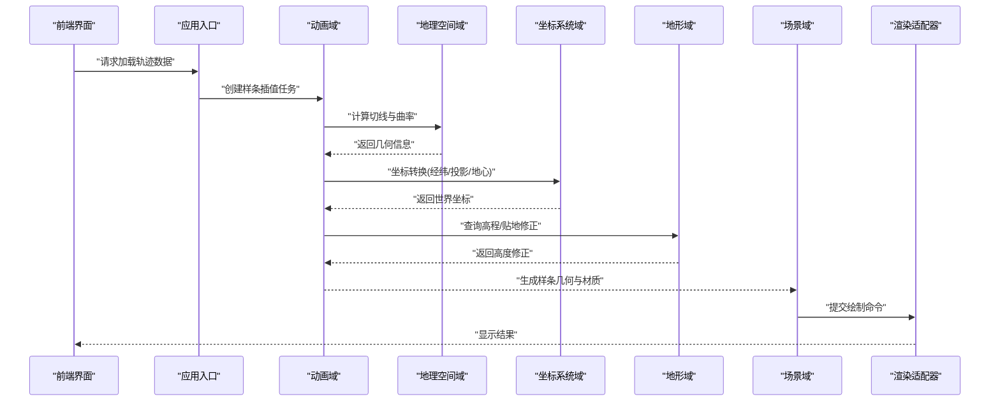
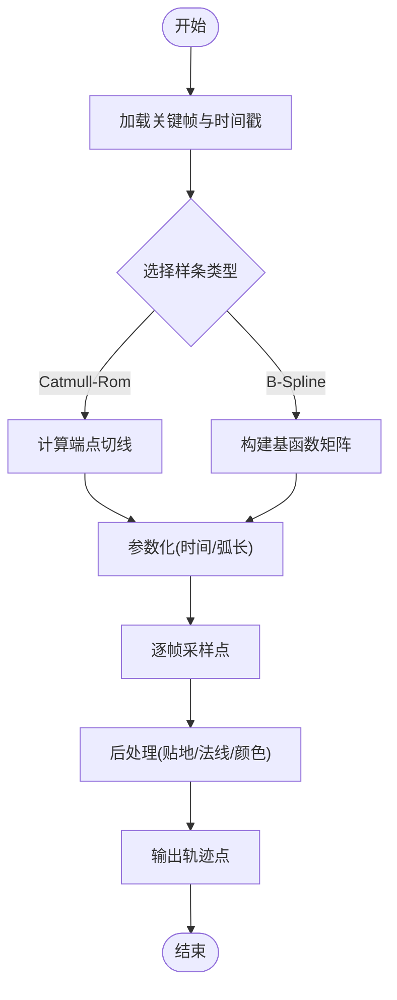
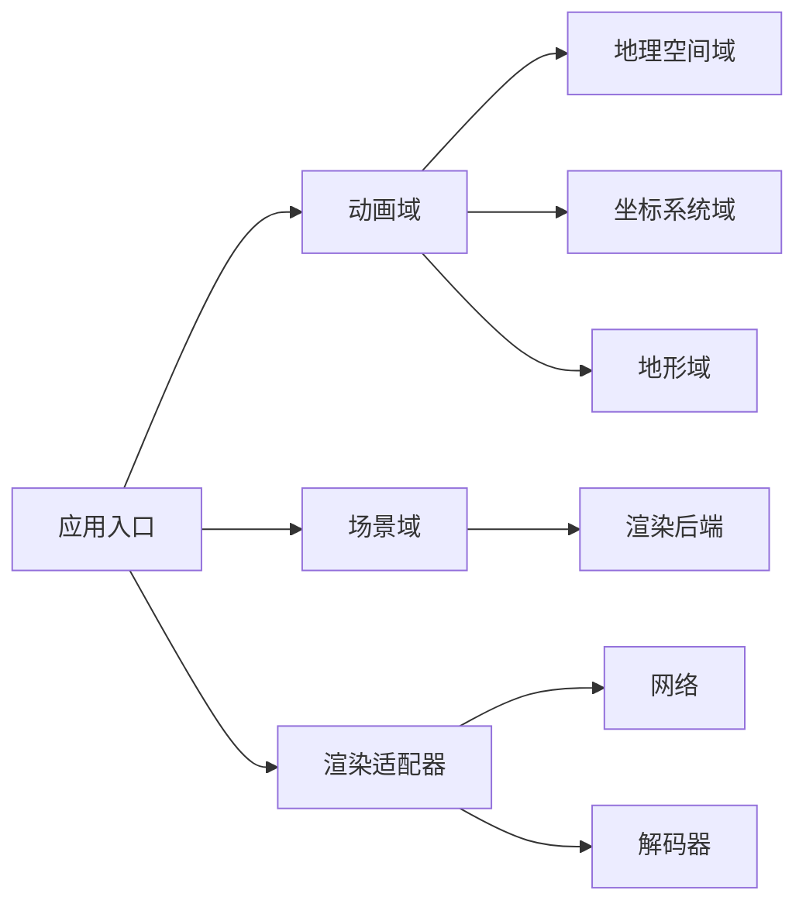

# 样条插值系统

<cite>
**本文引用的文件**   
- [README.md](file://README.md)
- [CesiumViewer.js](file://Apps/CesiumViewer/CesiumViewer.js)
- [index.html](file://Apps/CesiumViewer/index.html)
- [main.rs](file://cesiumrust/application/cesium-app/src/main.rs)
- [geometry_showcase.rs](file://cesiumrust/application/cesium-app/src/geometry_showcase.rs)
- [material_showcase.rs](file://cesiumrust/application/cesium-app/src/material_showcase.rs)
- [Cargo.toml](file://cesiumrust/application/cesium-app/Cargo.toml)
- [animation/mod.rs](file://cesiumrust/domain/animation/src/mod.rs)
- [camera/mod.rs](file://cesiumrust/domain/camera/src/mod.rs)
- [crs/mod.rs](file://cesiumrust/domain/crs/src/mod.rs)
- [geospatial/mod.rs](file://cesiumrust/domain/geospatial/src/mod.rs)
- [globe/mod.rs](file://cesiumrust/domain/globe/src/mod.rs)
- [terrain/mod.rs](file://cesiumrust/domain/terrain/src/mod.rs)
- [time/mod.rs](file://cesiumrust/domain/time/src/mod.rs)
- [scene/mod.rs](file://cesiumrust/domain/scene/src/mod.rs)
- [primitives/mod.rs](file://cesiumrust/domain/primitives/src/mod.rs)
- [vector/mod.rs](file://cesiumrust/domain/vector/src/mod.rs)
- [widgets/mod.rs](file://cesiumrust/domain/widgets/src/mod.rs)
- [bevy_render/mod.rs](file://cesiumrust/adapters/bevy-render/src/mod.rs)
- [decoders/mod.rs](file://cesiumrust/adapters/decoders/src/mod.rs)
- [network/mod.rs](file://cesiumrust/adapters/network/src/mod.rs)
- [workspace/mod.rs](file://cesiumrust/crates/workspace/src/mod.rs)
- [app/mod.rs](file://cesiumrust/crates/app/src/mod.rs)
- [ui/mod.rs](file://cesiumrust/crates/ui/src/mod.rs)
- [util/mod.rs](file://cesiumrust/crates/util/src/mod.rs)
- [actions/mod.rs](file://cesiumrust/crates/actions/src/mod.rs)
- [theme/mod.rs](file://cesiumrust/crates/theme/src/mod.rs)
- [driving/mod.rs](file://cesiumrust/ports/driving/src/mod.rs)
- [driven/mod.rs](file://cesiumrust/ports/driven/src/mod.rs)
</cite>

## 目录
1. [简介](#简介)
2. [项目结构](#项目结构)
3. [核心组件](#核心组件)
4. [架构总览](#架构总览)
5. [详细组件分析](#详细组件分析)
6. [依赖关系分析](#依赖关系分析)
7. [性能考量](#性能考量)
8. [故障排查指南](#故障排查指南)
9. [结论](#结论)
10. [附录](#附录)

## 简介
本文件围绕“样条插值系统”在 Cesium（含 Rust 适配层）中的定位与实现进行系统化说明。结合仓库结构，样条插值通常用于轨迹、路径、时间序列等数据的平滑过渡与采样，涉及几何、动画、相机控制、坐标系统与地形等模块的协同。本文从系统架构、数据流、关键处理逻辑与集成点出发，提供面向不同技术背景读者的可理解文档。

## 项目结构
该仓库包含前端示例应用与 Rust 实现的领域层、适配器与端口层。与样条插值相关的关键位置包括：
- 前端演示入口与应用脚本，用于加载场景与展示效果
- Rust 应用入口与示例程序，组织领域能力与渲染管线
- 领域层模块覆盖动画、相机、坐标系统、地理空间、地形、时间、场景、几何与向量等
- 适配器层对接 Bevy 渲染、解码器与网络
- 端口层定义驱动与被驱动接口，便于替换实现

```mermaid
graph TB
subgraph "前端"
A["index.html"] --> B["CesiumViewer.js"]
end
subgraph "Rust 应用"
C["application/cesium-app<br/>main.rs / geometry_showcase.rs / material_showcase.rs"]
end
subgraph "领域层"
D["domain/animation"]
E["domain/camera"]
F["domain/crs"]
G["domain/geospatial"]
H["domain/globe"]
I["domain/terrain"]
J["domain/time"]
K["domain/scene"]
L["domain/primitives"]
M["domain/vector"]
N["domain/widgets"]
end
subgraph "适配器层"
O["adapters/bevy-render"]
P["adapters/decoders"]
Q["adapters/network"]
end
subgraph "端口层"
R["ports/driving"]
S["ports/driven"]
end
subgraph "通用库"
T["crates/workspace"]
U["crates/app"]
V["crates/ui"]
W["crates/util"]
X["crates/actions"]
Y["crates/theme"]
end
C --> D
C --> E
C --> F
C --> G
C --> H
C --> I
C --> J
C --> K
C --> L
C --> M
C --> N
C --> O
C --> P
C --> Q
C --> R
C --> S
C --> T
C --> U
C --> V
C --> W
C --> X
C --> Y
```

图表来源
- [main.rs](file://cesiumrust/application/cesium-app/src/main.rs)
- [geometry_showcase.rs](file://cesiumrust/application/cesium-app/src/geometry_showcase.rs)
- [material_showcase.rs](file://cesiumrust/application/cesium-app/src/material_showcase.rs)
- [animation/mod.rs](file://cesiumrust/domain/animation/src/mod.rs)
- [camera/mod.rs](file://cesiumrust/domain/camera/src/mod.rs)
- [crs/mod.rs](file://cesiumrust/domain/crs/src/mod.rs)
- [geospatial/mod.rs](file://cesiumrust/domain/geospatial/src/mod.rs)
- [globe/mod.rs](file://cesiumrust/domain/globe/src/mod.rs)
- [terrain/mod.rs](file://cesiumrust/domain/terrain/src/mod.rs)
- [time/mod.rs](file://cesiumrust/domain/time/src/mod.rs)
- [scene/mod.rs](file://cesiumrust/domain/scene/src/mod.rs)
- [primitives/mod.rs](file://cesiumrust/domain/primitives/src/mod.rs)
- [vector/mod.rs](file://cesiumrust/domain/vector/src/mod.rs)
- [widgets/mod.rs](file://cesiumrust/domain/widgets/src/mod.rs)
- [bevy_render/mod.rs](file://cesiumrust/adapters/bevy-render/src/mod.rs)
- [decoders/mod.rs](file://cesiumrust/adapters/decoders/src/mod.rs)
- [network/mod.rs](file://cesiumrust/adapters/network/src/mod.rs)
- [workspace/mod.rs](file://cesiumrust/crates/workspace/src/mod.rs)
- [app/mod.rs](file://cesiumrust/crates/app/src/mod.rs)
- [ui/mod.rs](file://cesiumrust/crates/ui/src/mod.rs)
- [util/mod.rs](file://cesiumrust/crates/util/src/mod.rs)
- [actions/mod.rs](file://cesiumrust/crates/actions/src/mod.rs)
- [theme/mod.rs](file://cesiumrust/crates/theme/src/mod.rs)
- [driving/mod.rs](file://cesiumrust/ports/driving/src/mod.rs)
- [driven/mod.rs](file://cesiumrust/ports/driven/src/mod.rs)

章节来源
- [README.md](file://README.md)
- [CesiumViewer.js](file://Apps/CesiumViewer/CesiumViewer.js)
- [index.html](file://Apps/CesiumViewer/index.html)
- [main.rs](file://cesiumrust/application/cesium-app/src/main.rs)
- [geometry_showcase.rs](file://cesiumrust/application/cesium-app/src/geometry_showcase.rs)
- [material_showcase.rs](file://cesiumrust/application/cesium-app/src/material_showcase.rs)
- [Cargo.toml](file://cesiumrust/application/cesium-app/Cargo.toml)

## 核心组件
- 应用入口与示例：负责初始化场景、注册资源、启动渲染循环，并调用领域能力以展示样条插值效果
- 动画域：管理时间推进、关键帧与插值策略，是样条插值的核心执行环境
- 相机域：基于样条对相机位姿或目标点进行平滑过渡
- 坐标系统域：提供经纬度、投影与地心坐标系转换，确保样条点在地球模型上正确表达
- 地理空间域：封装距离、方位、法线等计算，支撑样条曲率与切线估计
- 地形域：将样条高度与地形高程对齐，支持贴地与悬空两种模式
- 时间域：统一时间源与时区处理，保证插值结果的时间一致性
- 场景域：组织实体、材质与渲染状态，承载样条可视化
- 几何与向量域：提供曲线构造、采样、离散化与数值工具
- 适配器层：通过 Bevy 渲染、解码器与网络能力完成数据加载与绘制
- 端口层：抽象外部依赖，便于替换渲染后端或数据源

章节来源
- [animation/mod.rs](file://cesiumrust/domain/animation/src/mod.rs)
- [camera/mod.rs](file://cesiumrust/domain/camera/src/mod.rs)
- [crs/mod.rs](file://cesiumrust/domain/crs/src/mod.rs)
- [geospatial/mod.rs](file://cesiumrust/domain/geospatial/src/mod.rs)
- [terrain/mod.rs](file://cesiumrust/domain/terrain/src/mod.rs)
- [time/mod.rs](file://cesiumrust/domain/time/src/mod.rs)
- [scene/mod.rs](file://cesiumrust/domain/scene/src/mod.rs)
- [primitives/mod.rs](file://cesiumrust/domain/primitives/src/mod.rs)
- [vector/mod.rs](file://cesiumrust/domain/vector/src/mod.rs)
- [bevy_render/mod.rs](file://cesiumrust/adapters/bevy-render/src/mod.rs)
- [decoders/mod.rs](file://cesiumrust/adapters/decoders/src/mod.rs)
- [network/mod.rs](file://cesiumrust/adapters/network/src/mod.rs)
- [driving/mod.rs](file://cesiumrust/ports/driving/src/mod.rs)
- [driven/mod.rs](file://cesiumrust/ports/driven/src/mod.rs)

## 架构总览
样条插值系统在分层架构中贯穿“数据—算法—渲染”全链路：
- 数据层：由网络/解码器获取轨迹点、时间戳与属性
- 算法层：在动画域内根据时间推进与样条类型（如 Catmull-Rom、B-Spline）计算中间点
- 表现层：在场景域中将样条作为几何体或相机路径渲染；必要时与地形交互

图表来源
- [main.rs](file://cesiumrust/application/cesium-app/src/main.rs)
- [animation/mod.rs](file://cesiumrust/domain/animation/src/mod.rs)
- [geospatial/mod.rs](file://cesiumrust/domain/geospatial/src/mod.rs)
- [crs/mod.rs](file://cesiumrust/domain/crs/src/mod.rs)
- [terrain/mod.rs](file://cesiumrust/domain/terrain/src/mod.rs)
- [scene/mod.rs](file://cesiumrust/domain/scene/src/mod.rs)
- [bevy_render/mod.rs](file://cesiumrust/adapters/bevy-render/src/mod.rs)

## 详细组件分析

### 应用入口与示例
- 作用：初始化引擎、加载资源、注册事件与渲染循环，调用领域能力展示样条插值
- 关键点：
  - 启动顺序：配置日志与线程池 → 构建场景 → 加载数据 → 运行主循环
  - 示例程序：几何展示与材质展示分别侧重样条几何与外观
  - 错误处理：捕获 IO、解析与渲染异常，回退到默认状态

章节来源
- [main.rs](file://cesiumrust/application/cesium-app/src/main.rs)
- [geometry_showcase.rs](file://cesiumrust/application/cesium-app/src/geometry_showcase.rs)
- [material_showcase.rs](file://cesiumrust/application/cesium-app/src/material_showcase.rs)
- [Cargo.toml](file://cesiumrust/application/cesium-app/Cargo.toml)

### 动画域（样条插值核心）
- 作用：维护时间推进、关键帧集合与插值策略，输出连续轨迹点
- 关键点：
  - 插值类型：线性、Catmull-Rom、B-Spline 等
  - 参数化：按弧长或时间均匀采样，避免速度抖动
  - 边界条件：端点切线、闭合曲线、重复周期
  - 性能：增量更新、缓存最近区间、多线程并行采样

图表来源
- [animation/mod.rs](file://cesiumrust/domain/animation/src/mod.rs)

章节来源
- [animation/mod.rs](file://cesiumrust/domain/animation/src/mod.rs)

### 相机域（沿样条运动）
- 作用：将样条点映射为相机位姿（位置、朝向、上方向），实现平滑飞行
- 关键点：
  - 位姿构建：使用切线确定朝向，法线或重力方向确定上方向
  - 平滑约束：限制角速度与加速度，避免眩晕
  - 交互：用户拖拽改变速度或偏移

章节来源
- [camera/mod.rs](file://cesiumrust/domain/camera/src/mod.rs)

### 坐标系统域（CRS）
- 作用：在经纬度、投影与地心坐标系之间转换，确保样条点落在正确的参考系
- 关键点：
  - 椭球模型：WGS84 参数与变换矩阵
  - 投影：Web Mercator 与区域投影
  - 精度：双精度浮点与误差控制

章节来源
- [crs/mod.rs](file://cesiumrust/domain/crs/src/mod.rs)

### 地理空间域
- 作用：提供距离、方位、法线、曲率等基础计算，支撑样条切线与曲率估计
- 关键点：
  - 大圆距离与方位角
  - 局部切平面与法线
  - 数值稳定性与边界处理

章节来源
- [geospatial/mod.rs](file://cesiumrust/domain/geospatial/src/mod.rs)

### 地形域
- 作用：将样条高度与地形高程对齐，支持贴地与悬空两种模式
- 关键点：
  - 高程查询：多分辨率金字塔与缓存
  - 贴地算法：投影到表面、法线偏移
  - 性能：异步加载与预取

章节来源
- [terrain/mod.rs](file://cesiumrust/domain/terrain/src/mod.rs)

### 时间域
- 作用：统一时间源、时区与步长，保证插值结果一致
- 关键点：
  - 时钟：固定步长与自适应步长
  - 同步：与渲染帧率对齐
  - 回放：前进、后退、暂停

章节来源
- [time/mod.rs](file://cesiumrust/domain/time/src/mod.rs)

### 场景域
- 作用：组织实体、材质与渲染状态，承载样条可视化
- 关键点：
  - 实体生命周期管理
  - 材质绑定与着色器参数
  - 可见性裁剪与 LOD

章节来源
- [scene/mod.rs](file://cesiumrust/domain/scene/src/mod.rs)

### 几何与向量域
- 作用：提供曲线构造、采样、离散化与数值工具
- 关键点：
  - 曲线表示：折线、样条、NURBS
  - 采样策略：等距与等时
  - 数值优化：向量化与 SIMD

章节来源
- [primitives/mod.rs](file://cesiumrust/domain/primitives/src/mod.rs)
- [vector/mod.rs](file://cesiumrust/domain/vector/src/mod.rs)

### 适配器层（Bevy 渲染、解码器、网络）
- 作用：对接渲染后端、数据解码与网络传输
- 关键点：
  - 渲染：顶点缓冲、索引缓冲、材质管线
  - 解码：二进制格式与压缩格式
  - 网络：并发下载与重试

章节来源
- [bevy_render/mod.rs](file://cesiumrust/adapters/bevy-render/src/mod.rs)
- [decoders/mod.rs](file://cesiumrust/adapters/decoders/src/mod.rs)
- [network/mod.rs](file://cesiumrust/adapters/network/src/mod.rs)

### 端口层（驱动与被驱动）
- 作用：抽象外部依赖，便于替换实现
- 关键点：
  - 驱动端口：对外暴露 API
  - 被驱动端口：内部能力接口

章节来源
- [driving/mod.rs](file://cesiumrust/ports/driving/src/mod.rs)
- [driven/mod.rs](file://cesiumrust/ports/driven/src/mod.rs)

### 通用库（工作区、应用、UI、工具、动作、主题）
- 作用：提供工程组织、应用框架、UI 组件、工具函数、动作系统与主题样式
- 关键点：
  - 工作区：多包管理与依赖共享
  - 应用：生命周期与配置
  - UI：控件与布局
  - 工具：日志、序列化、数学库
  - 动作：事件总线与命令
  - 主题：配色与样式

章节来源
- [workspace/mod.rs](file://cesiumrust/crates/workspace/src/mod.rs)
- [app/mod.rs](file://cesiumrust/crates/app/src/mod.rs)
- [ui/mod.rs](file://cesiumrust/crates/ui/src/mod.rs)
- [util/mod.rs](file://cesiumrust/crates/util/src/mod.rs)
- [actions/mod.rs](file://cesiumrust/crates/actions/src/mod.rs)
- [theme/mod.rs](file://cesiumrust/crates/theme/src/mod.rs)

## 依赖关系分析
- 耦合与内聚：
  - 动画域与地理空间域、坐标系统域、地形域强耦合，形成样条插值核心链
  - 场景域与渲染适配器弱耦合，通过接口解耦
  - 端口层隔离外部依赖，提升可测试性与可替换性
- 直接/间接依赖：
  - 应用入口依赖所有领域模块与适配器
  - 领域模块间通过明确接口通信，避免循环依赖
- 外部依赖：
  - Bevy 渲染后端、网络栈、解码器库

图表来源
- [main.rs](file://cesiumrust/application/cesium-app/src/main.rs)
- [animation/mod.rs](file://cesiumrust/domain/animation/src/mod.rs)
- [scene/mod.rs](file://cesiumrust/domain/scene/src/mod.rs)
- [bevy_render/mod.rs](file://cesiumrust/adapters/bevy-render/src/mod.rs)
- [network/mod.rs](file://cesiumrust/adapters/network/src/mod.rs)
- [decoders/mod.rs](file://cesiumrust/adapters/decoders/src/mod.rs)

章节来源
- [main.rs](file://cesiumrust/application/cesium-app/src/main.rs)
- [animation/mod.rs](file://cesiumrust/domain/animation/src/mod.rs)
- [scene/mod.rs](file://cesiumrust/domain/scene/src/mod.rs)
- [bevy_render/mod.rs](file://cesiumrust/adapters/bevy-render/src/mod.rs)
- [network/mod.rs](file://cesiumrust/adapters/network/src/mod.rs)
- [decoders/mod.rs](file://cesiumrust/adapters/decoders/src/mod.rs)

## 性能考量
- 采样策略：优先按弧长均匀采样，减少速度波动；对高频细节采用多级 LOD
- 内存管理：重用缓冲区、延迟分配、对象池
- 并行计算：关键帧预处理与批量采样使用多线程；GPU 加速着色器计算
- I/O 优化：地形与纹理异步加载、预取与缓存；网络请求合并与去重
- 渲染优化：批处理绘制、剔除不可见实体、减少状态切换

[本节为通用指导，不直接分析具体文件]

## 故障排查指南
- 常见问题：
  - 轨迹不平滑：检查参数化方式与端点切线设置
  - 贴地异常：确认地形分辨率与法线方向
  - 相机抖动：限制角速度与加速度，增加阻尼
  - 坐标偏差：核对参考椭球与投影设置
  - 性能瓶颈：监控 CPU/GPU 占用，定位热点函数
- 调试建议：
  - 启用详细日志与指标收集
  - 使用可视化工具检查关键帧与采样点
  - 逐步隔离模块，最小复现问题

[本节为通用指导，不直接分析具体文件]

## 结论
样条插值系统在 Cesium（含 Rust 适配层）中通过清晰的层次结构与明确的职责划分，实现了从数据到渲染的完整链路。动画域为核心，配合地理空间、坐标系统、地形与时间域，确保插值结果的准确性与稳定性。适配器与端口层提升了系统的可扩展性与可替换性。通过合理的采样策略、内存与并行优化，可在大规模数据下保持流畅体验。

[本节为总结性内容，不直接分析具体文件]

## 附录
- 前端入口与示例：
  - [index.html](file://Apps/CesiumViewer/index.html)
  - [CesiumViewer.js](file://Apps/CesiumViewer/CesiumViewer.js)
- Rust 应用与示例：
  - [main.rs](file://cesiumrust/application/cesium-app/src/main.rs)
  - [geometry_showcase.rs](file://cesiumrust/application/cesium-app/src/geometry_showcase.rs)
  - [material_showcase.rs](file://cesiumrust/application/cesium-app/src/material_showcase.rs)
  - [Cargo.toml](file://cesiumrust/application/cesium-app/Cargo.toml)
- 领域模块：
  - [animation/mod.rs](file://cesiumrust/domain/animation/src/mod.rs)
  - [camera/mod.rs](file://cesiumrust/domain/camera/src/mod.rs)
  - [crs/mod.rs](file://cesiumrust/domain/crs/src/mod.rs)
  - [geospatial/mod.rs](file://cesiumrust/domain/geospatial/src/mod.rs)
  - [globe/mod.rs](file://cesiumrust/domain/globe/src/mod.rs)
  - [terrain/mod.rs](file://cesiumrust/domain/terrain/src/mod.rs)
  - [time/mod.rs](file://cesiumrust/domain/time/src/mod.rs)
  - [scene/mod.rs](file://cesiumrust/domain/scene/src/mod.rs)
  - [primitives/mod.rs](file://cesiumrust/domain/primitives/src/mod.rs)
  - [vector/mod.rs](file://cesiumrust/domain/vector/src/mod.rs)
  - [widgets/mod.rs](file://cesiumrust/domain/widgets/src/mod.rs)
- 适配器与端口：
  - [bevy_render/mod.rs](file://cesiumrust/adapters/bevy-render/src/mod.rs)
  - [decoders/mod.rs](file://cesiumrust/adapters/decoders/src/mod.rs)
  - [network/mod.rs](file://cesiumrust/adapters/network/src/mod.rs)
  - [driving/mod.rs](file://cesiumrust/ports/driving/src/mod.rs)
  - [driven/mod.rs](file://cesiumrust/ports/driven/src/mod.rs)
- 通用库：
  - [workspace/mod.rs](file://cesiumrust/crates/workspace/src/mod.rs)
  - [app/mod.rs](file://cesiumrust/crates/app/src/mod.rs)
  - [ui/mod.rs](file://cesiumrust/crates/ui/src/mod.rs)
  - [util/mod.rs](file://cesiumrust/crates/util/src/mod.rs)
  - [actions/mod.rs](file://cesiumrust/crates/actions/src/mod.rs)
  - [theme/mod.rs](file://cesiumrust/crates/theme/src/mod.rs)