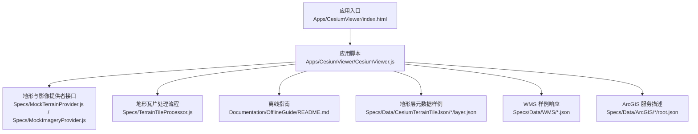
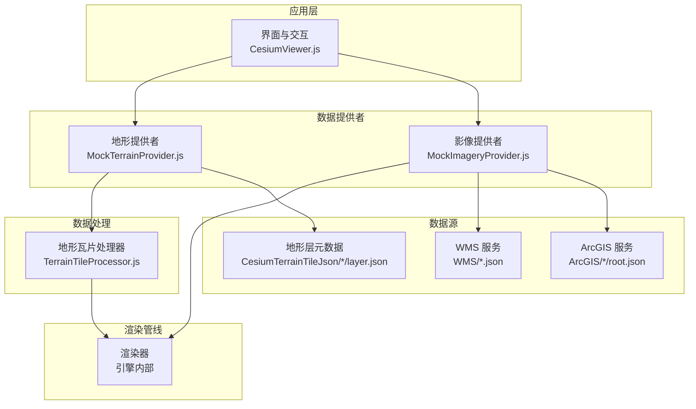
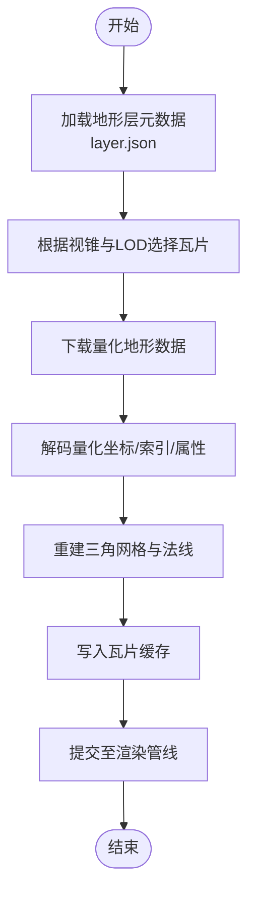
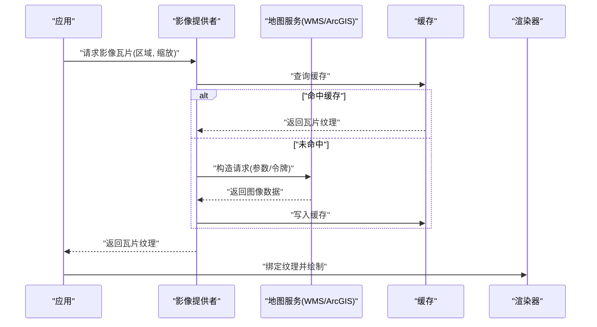
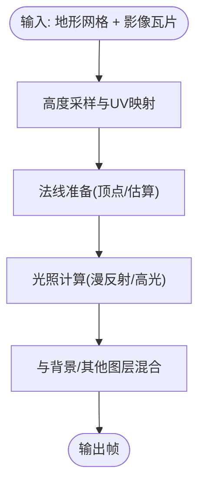
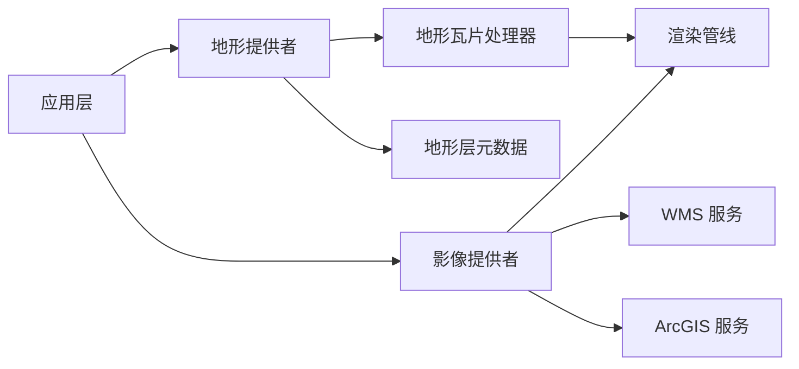

# 地形与影像系统

<cite>
**本文引用的文件**   
- [README.md](file://README.md)
- [OfflineGuide/README.md](file://Documentation/OfflineGuide/README.md)
- [CesiumViewer.js](file://Apps/CesiumViewer/CesiumViewer.js)
- [index.html](file://Apps/CesiumViewer/index.html)
- [Specs/MockTerrainProvider.js](file://Specs/MockTerrainProvider.js)
- [Specs/MockImageryProvider.js](file://Specs/MockImageryProvider.js)
- [Specs/TerrainTileProcessor.js](file://Specs/TerrainTileProcessor.js)
- [Specs/Data/CesiumTerrainTileJson/QuantizedMesh/layer.json](file://Specs/Data/CesiumTerrainTileJson/QuantizedMesh/layer.json)
- [Specs/Data/CesiumTerrainTileJson/QuantizedMeshWithWaterMask/layer.json](file://Specs/Data/CesiumTerrainTileJson/QuantizedMeshWithWaterMask/layer.json)
- [Specs/Data/CesiumTerrainTileJson/Heightmap/layer.json](file://Specs/Data/CesiumTerrainTileJson/Heightmap/layer.json)
- [Specs/Data/WMS/GetFeatureInfo-Custom.json](file://Specs/Data/WMS/GetFeatureInfo-Custom.json)
- [Specs/Data/ArcGIS/9_214_379/root.json](file://Specs/Data/ArcGIS/9_214_379/root.json)
</cite>

## 目录
1. [简介](#简介)
2. [项目结构](#项目结构)
3. [核心组件](#核心组件)
4. [架构总览](#架构总览)
5. [详细组件分析](#详细组件分析)
6. [依赖关系分析](#依赖关系分析)
7. [性能考虑](#性能考虑)
8. [故障排查指南](#故障排查指南)
9. [结论](#结论)
10. [附录](#附录)

## 简介
本技术文档聚焦于 Cesium 的地形与影像系统，围绕以下目标展开：
- 地形数据提供者的架构设计：包括 Quantized Mesh 格式、高度图处理、多分辨率地形瓦片管理。
- 影像图层系统的工作原理：支持 WMS、WMTS、ArcGIS 等多种地图服务。
- 地形与影像的融合渲染：高度采样、纹理映射、光照计算。
- 离线地形与影像的处理方案。
- 数据源接入示例与性能优化技巧。

## 项目结构
仓库包含应用示例、文档、测试数据与源码组织。与“地形与影像”主题直接相关的资源主要分布在：
- Apps/CesiumViewer：演示入口与页面配置
- Documentation/OfflineGuide：离线使用指南
- Specs/Data：地形与影像相关样例数据（如 Cesium Terrain Tile JSON、WMS、ArcGIS）
- Specs：用于验证行为的 Mock 提供者与处理器

图表来源
- [index.html](file://Apps/CesiumViewer/index.html)
- [CesiumViewer.js](file://Apps/CesiumViewer/CesiumViewer.js)
- [MockTerrainProvider.js](file://Specs/MockTerrainProvider.js)
- [MockImageryProvider.js](file://Specs/MockImageryProvider.js)
- [TerrainTileProcessor.js](file://Specs/TerrainTileProcessor.js)
- [OfflineGuide/README.md](file://Documentation/OfflineGuide/README.md)
- [QuantizedMesh/layer.json](file://Specs/Data/CesiumTerrainTileJson/QuantizedMesh/layer.json)
- [QuantizedMeshWithWaterMask/layer.json](file://Specs/Data/CesiumTerrainTileJson/QuantizedMeshWithWaterMask/layer.json)
- [Heightmap/layer.json](file://Specs/Data/CesiumTerrainTileJson/Heightmap/layer.json)
- [GetFeatureInfo-Custom.json](file://Specs/Data/WMS/GetFeatureInfo-Custom.json)
- [root.json](file://Specs/Data/ArcGIS/9_214_379/root.json)

章节来源
- [README.md](file://README.md)
- [index.html](file://Apps/CesiumViewer/index.html)
- [CesiumViewer.js](file://Apps/CesiumViewer/CesiumViewer.js)
- [OfflineGuide/README.md](file://Documentation/OfflineGuide/README.md)

## 核心组件
本节从“地形提供者”和“影像提供者”两个抽象层面梳理关键职责与交互点：
- 地形提供者
  - 负责按视锥与 LOD 策略加载地形瓦片，解析 Quantized Mesh 或高度图格式，构建可渲染网格并缓存。
  - 支持可选的水面掩膜、法线编码等扩展字段，以增强视觉与物理效果。
- 影像提供者
  - 统一封装不同地图服务（WMS、WMTS、ArcGIS 等）的切片请求、坐标转换与缓存策略。
  - 将影像瓦片作为纹理贴到地形表面，参与光照与混合计算。
- 地形瓦片处理器
  - 在 Worker 或主线程中执行解码、几何重建、索引重组、LOD 合并等耗时操作，降低主线程阻塞。

章节来源
- [MockTerrainProvider.js](file://Specs/MockTerrainProvider.js)
- [MockImageryProvider.js](file://Specs/MockImageryProvider.js)
- [TerrainTileProcessor.js](file://Specs/TerrainTileProcessor.js)

## 架构总览
下图展示了“地形与影像”子系统的高层交互：应用通过统一的提供者接口获取数据，渲染管线将地形网格与影像纹理融合输出。

图表来源
- [CesiumViewer.js](file://Apps/CesiumViewer/CesiumViewer.js)
- [MockTerrainProvider.js](file://Specs/MockTerrainProvider.js)
- [MockImageryProvider.js](file://Specs/MockImageryProvider.js)
- [TerrainTileProcessor.js](file://Specs/TerrainTileProcessor.js)
- [QuantizedMesh/layer.json](file://Specs/Data/CesiumTerrainTileJson/QuantizedMesh/layer.json)
- [GetFeatureInfo-Custom.json](file://Specs/Data/WMS/GetFeatureInfo-Custom.json)
- [root.json](file://Specs/Data/ArcGIS/9_214_379/root.json)

## 详细组件分析

### 地形数据提供者与 Quantized Mesh
- 数据模型与元数据
  - 地形层通过 JSON 描述瓦片布局、可用性与内容地址；Quantized Mesh 与 Heightmap 两种常见格式在 layer.json 中声明。
  - 扩展能力：顶点法线、水面掩膜、32 位索引、父级 URL 等，均通过层元数据暴露。
- 瓦片管理与 LOD
  - 基于四叉树/八叉树的层级结构，根据相机距离与屏幕误差选择合适分辨率的瓦片。
  - 支持父子瓦片 URL 继承与可用性元数据，减少无效请求。
- 解码与几何重建
  - 量化坐标反量化为真实世界坐标，重建三角网格；可选插值提升平滑度。
  - 法线可由顶点自带或从高度场估算；水面掩膜用于水体着色与反射。

图表来源
- [QuantizedMesh/layer.json](file://Specs/Data/CesiumTerrainTileJson/QuantizedMesh/layer.json)
- [QuantizedMeshWithWaterMask/layer.json](file://Specs/Data/CesiumTerrainTileJson/QuantizedMeshWithWaterMask/layer.json)
- [Heightmap/layer.json](file://Specs/Data/CesiumTerrainTileJson/Heightmap/layer.json)
- [TerrainTileProcessor.js](file://Specs/TerrainTileProcessor.js)

章节来源
- [QuantizedMesh/layer.json](file://Specs/Data/CesiumTerrainTileJson/QuantizedMesh/layer.json)
- [QuantizedMeshWithWaterMask/layer.json](file://Specs/Data/CesiumTerrainTileJson/QuantizedMeshWithWaterMask/layer.json)
- [Heightmap/layer.json](file://Specs/Data/CesiumTerrainTileJson/Heightmap/layer.json)
- [TerrainTileProcessor.js](file://Specs/TerrainTileProcessor.js)

### 影像图层系统与多服务支持
- 统一接口
  - 影像提供者对外暴露一致的瓦片请求、缓存与更新接口，屏蔽底层服务差异。
- 服务适配
  - WMS：通过 GetMap/GetFeatureInfo 等标准协议获取影像与要素信息。
  - WMTS：遵循 OGC 规范，利用 TileMatrixSet 与 TileMatrixScale 定位瓦片。
  - ArcGIS：读取服务描述（如 root.json），解析切片方案与访问令牌。
- 坐标与投影
  - 将地理坐标转换为瓦片行列号，处理 Web Mercator 与经纬度投影的差异。
- 缓存与并发
  - 基于 URL 去重与 LRU 策略控制内存占用，限制并发请求数避免拥塞。

图表来源
- [MockImageryProvider.js](file://Specs/MockImageryProvider.js)
- [GetFeatureInfo-Custom.json](file://Specs/Data/WMS/GetFeatureInfo-Custom.json)
- [root.json](file://Specs/Data/ArcGIS/9_214_379/root.json)

章节来源
- [MockImageryProvider.js](file://Specs/MockImageryProvider.js)
- [GetFeatureInfo-Custom.json](file://Specs/Data/WMS/GetFeatureInfo-Custom.json)
- [root.json](file://Specs/Data/ArcGIS/9_214_379/root.json)

### 地形与影像的融合渲染
- 高度采样
  - 在片段着色阶段对地形网格进行高度采样，确保对象贴合地表。
- 纹理映射
  - 影像瓦片作为漫反射贴图，结合 UV 坐标映射到地形表面。
- 光照计算
  - 使用顶点法线或估算法线参与光照模型，提升立体感；水面掩膜可用于水体特殊着色。
- 混合与遮挡
  - 地形与影像采用深度缓冲与透明度混合，保证正确遮挡关系。

[此图为概念性流程，不直接对应具体源码文件]

### 离线地形与影像处理方案
- 本地服务器
  - 将地形层 JSON 与瓦片文件部署到本地静态服务器，修改基础路径指向本地。
- 代理与跨域
  - 通过反向代理解决跨域与鉴权问题，统一入口转发请求。
- 缓存策略
  - 浏览器缓存与服务端缓存配合，减少重复下载。
- 数据打包
  - 按需裁剪与压缩地形瓦片，生成最小可用数据集。

章节来源
- [OfflineGuide/README.md](file://Documentation/OfflineGuide/README.md)

### 接入示例与最佳实践
- 地形接入
  - 使用层元数据（layer.json）配置地形服务，指定 Quantized Mesh 或 Heightmap 格式与可选扩展。
- 影像接入
  - 针对 WMS/ArcGIS 等服务，配置服务地址、图层名、投影与认证信息。
- 性能调优
  - 合理设置最大并发、瓦片尺寸与纹理压缩；启用 LOD 与可见性剔除；使用 Worker 处理重型解码。

章节来源
- [QuantizedMesh/layer.json](file://Specs/Data/CesiumTerrainTileJson/QuantizedMesh/layer.json)
- [Heightmap/layer.json](file://Specs/Data/CesiumTerrainTileJson/Heightmap/layer.json)
- [root.json](file://Specs/Data/ArcGIS/9_214_379/root.json)
- [CesiumViewer.js](file://Apps/CesiumViewer/CesiumViewer.js)

## 依赖关系分析
- 模块耦合
  - 应用层仅依赖统一的提供者接口，降低与具体服务的耦合度。
  - 地形与影像提供者分别依赖各自的数据源与缓存策略，彼此独立。
- 外部依赖
  - 网络请求、文件系统（离线）、WebGL 渲染管线。
- 潜在循环依赖
  - 通过接口解耦与分层设计避免循环引用。

图表来源
- [CesiumViewer.js](file://Apps/CesiumViewer/CesiumViewer.js)
- [MockTerrainProvider.js](file://Specs/MockTerrainProvider.js)
- [MockImageryProvider.js](file://Specs/MockImageryProvider.js)
- [TerrainTileProcessor.js](file://Specs/TerrainTileProcessor.js)
- [QuantizedMesh/layer.json](file://Specs/Data/CesiumTerrainTileJson/QuantizedMesh/layer.json)
- [GetFeatureInfo-Custom.json](file://Specs/Data/WMS/GetFeatureInfo-Custom.json)
- [root.json](file://Specs/Data/ArcGIS/9_214_379/root.json)

章节来源
- [CesiumViewer.js](file://Apps/CesiumViewer/CesiumViewer.js)
- [MockTerrainProvider.js](file://Specs/MockTerrainProvider.js)
- [MockImageryProvider.js](file://Specs/MockImageryProvider.js)
- [TerrainTileProcessor.js](file://Specs/TerrainTileProcessor.js)

## 性能考虑
- 瓦片粒度与 LOD
  - 根据场景规模与设备能力调整瓦片大小与层级深度，平衡带宽与显存。
- 解码与重建
  - 将量化解码、几何重建放入 Worker，避免主线程卡顿。
- 缓存与复用
  - 启用纹理与瓦片缓存，减少重复下载与重建开销。
- 网络优化
  - 限制并发、启用 HTTP/2、开启服务端压缩与 CDN。
- 渲染优化
  - 合理使用法线与水面掩膜，避免过度复杂的光照计算；批量绘制与实例化减少状态切换。

[本节为通用指导，不直接分析具体文件]

## 故障排查指南
- 常见问题
  - 瓦片无法加载：检查层元数据路径、跨域与鉴权配置。
  - 地形错位或拉伸：确认投影与坐标转换是否正确。
  - 影像闪烁或重叠：检查瓦片边界与混合模式。
- 诊断手段
  - 使用开发者工具监控网络请求与缓存命中。
  - 打印瓦片键与 URL，核对服务返回内容与预期一致。
  - 逐步关闭特效（法线、水面掩膜）定位问题。

章节来源
- [MockTerrainProvider.js](file://Specs/MockTerrainProvider.js)
- [MockImageryProvider.js](file://Specs/MockImageryProvider.js)
- [TerrainTileProcessor.js](file://Specs/TerrainTileProcessor.js)

## 结论
Cesium 的地形与影像系统通过统一的提供者接口与灵活的瓦片管理机制，实现了对多种数据源的高效接入与渲染。借助 Quantized Mesh 与高度图格式、多服务适配以及离线方案，可在不同场景下取得良好的性能与视觉效果。建议在实际项目中结合业务需求，合理配置 LOD、缓存与网络策略，以获得更稳定的用户体验。

## 附录
- 术语表
  - Quantized Mesh：一种高效存储地形网格的格式，支持量化坐标与可选扩展。
  - 高度图：以灰度图像表示地形高度的栅格数据。
  - 瓦片：按固定规则划分的空间数据块，便于按需加载。
- 参考样例
  - 地形层元数据：Quantized Mesh、Heightmap、带水面掩膜的层定义。
  - 影像服务：WMS 与 ArcGIS 的服务描述与响应样例。

章节来源
- [QuantizedMesh/layer.json](file://Specs/Data/CesiumTerrainTileJson/QuantizedMesh/layer.json)
- [QuantizedMeshWithWaterMask/layer.json](file://Specs/Data/CesiumTerrainTileJson/QuantizedMeshWithWaterMask/layer.json)
- [Heightmap/layer.json](file://Specs/Data/CesiumTerrainTileJson/Heightmap/layer.json)
- [GetFeatureInfo-Custom.json](file://Specs/Data/WMS/GetFeatureInfo-Custom.json)
- [root.json](file://Specs/Data/ArcGIS/9_214_379/root.json)