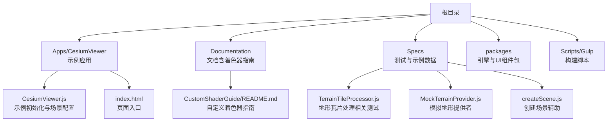
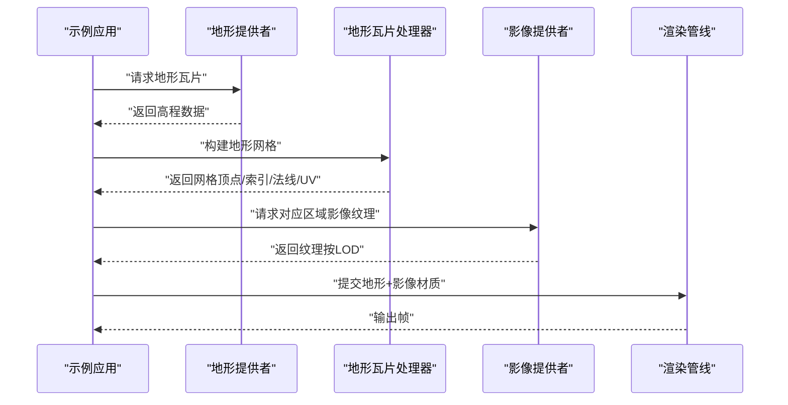
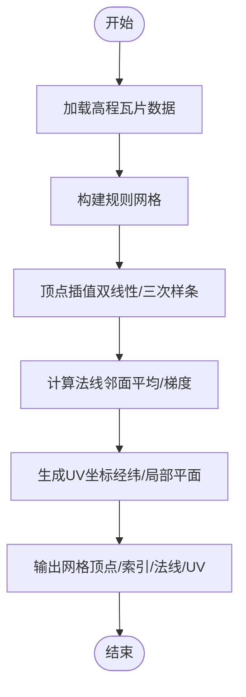
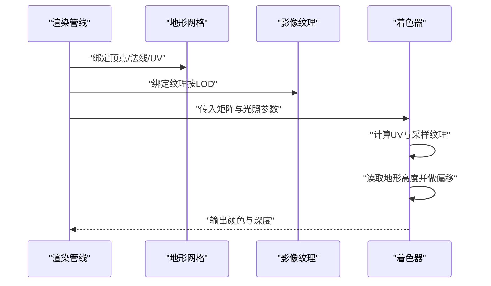
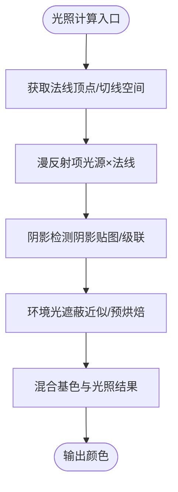
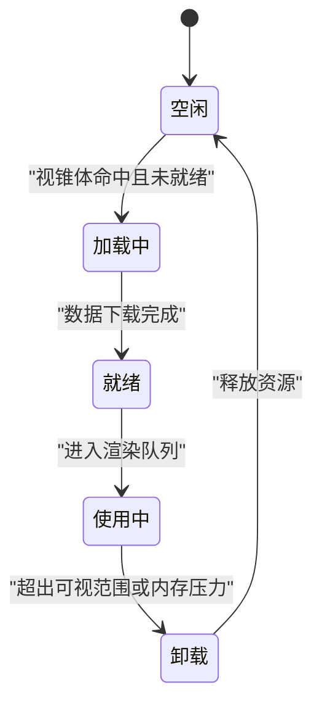
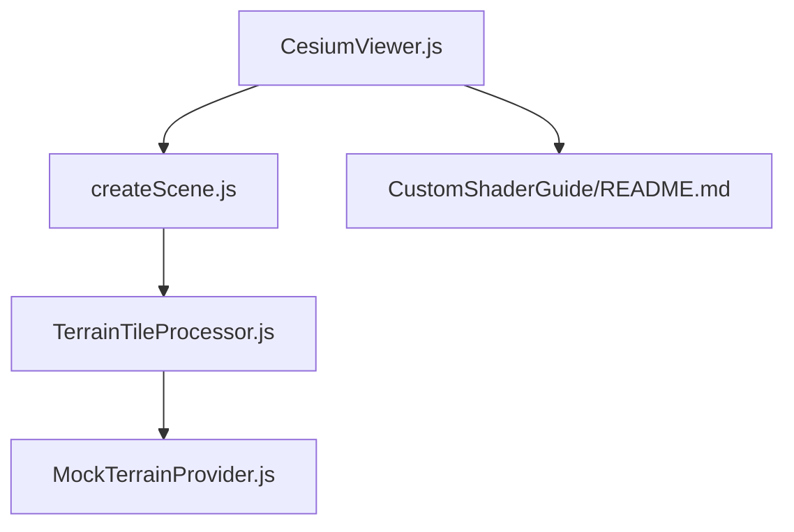

# 地形与影像融合渲染

<cite>
**本文引用的文件**   
- [README.md](file://README.md)
- [index.html](file://index.html)
- [CesiumViewer.js](file://Apps/CesiumViewer/CesiumViewer.js)
- [TerrainTileProcessor.js](file://Specs/TerrainTileProcessor.js)
- [MockTerrainProvider.js](file://Specs/MockTerrainProvider.js)
- [createScene.js](file://Specs/createScene.js)
- [CustomShaderGuide/README.md](file://Documentation/CustomShaderGuide/README.md)
</cite>

## 目录
1. [简介](#简介)
2. [项目结构](#项目结构)
3. [核心组件](#核心组件)
4. [架构总览](#架构总览)
5. [详细组件分析](#详细组件分析)
6. [依赖关系分析](#依赖关系分析)
7. [性能考虑](#性能考虑)
8. [故障排查指南](#故障排查指南)
9. [结论](#结论)
10. [附录](#附录)

## 简介
本技术文档聚焦于Cesium中“地形与影像融合渲染”的关键技术与实现路径，涵盖：
- 地形网格生成算法：顶点插值、法线计算、纹理坐标映射
- 影像纹理与地形高度的同步渲染：UV坐标计算、纹理采样优化、高度偏移处理
- 光照模型在地形上的应用：漫反射、阴影投射、环境光遮蔽
- 多分辨率地形与影像的无缝切换：LOD过渡、纹理金字塔、内存管理
- 渲染性能优化：批处理渲染、纹理压缩、GPU实例化
- 着色器代码解析与自定义渲染效果实现方法

说明：仓库源码未在本工作区完整提供，本文基于仓库中的示例与测试资源进行架构与流程层面的分析与指导。

## 项目结构
仓库采用分层组织方式，包含示例应用、文档、引擎包与测试资源等。与地形和影像渲染相关的入口与示例位于 Apps 与 Specs 目录中，文档参考位于 Documentation 目录。

图表来源
- [CesiumViewer.js](file://Apps/CesiumViewer/CesiumViewer.js)
- [index.html](file://index.html)
- [CustomShaderGuide/README.md](file://Documentation/CustomShaderGuide/README.md)
- [TerrainTileProcessor.js](file://Specs/TerrainTileProcessor.js)
- [MockTerrainProvider.js](file://Specs/MockTerrainProvider.js)
- [createScene.js](file://Specs/createScene.js)

章节来源
- [README.md](file://README.md)
- [index.html](file://index.html)
- [CesiumViewer.js](file://Apps/CesiumViewer/CesiumViewer.js)

## 核心组件
- 地形提供者接口与模拟实现：用于加载与提供地形高程数据，支撑后续网格生成与渲染。
- 地形瓦片处理器：负责将原始高程数据转换为可渲染的地形网格，包括顶点插值、法线计算与UV映射。
- 场景创建与渲染管线：负责将地形与影像层组合，设置材质与光照，执行渲染循环。
- 自定义着色器指南：提供扩展与替换默认渲染效果的参考。

章节来源
- [MockTerrainProvider.js](file://Specs/MockTerrainProvider.js)
- [TerrainTileProcessor.js](file://Specs/TerrainTileProcessor.js)
- [createScene.js](file://Specs/createScene.js)
- [CustomShaderGuide/README.md](file://Documentation/CustomShaderGuide/README.md)

## 架构总览
从数据到渲染的整体流程如下：
- 地形数据源通过地形提供者接口获取瓦片数据
- 瓦片处理器将高程数据转换为网格（顶点、索引、法线、UV）
- 影像提供者提供纹理金字塔，按视距与分辨率选择合适层级
- 渲染管线将地形网格与影像纹理结合，应用光照模型并输出帧缓冲

图表来源
- [CesiumViewer.js](file://Apps/CesiumViewer/CesiumViewer.js)
- [TerrainTileProcessor.js](file://Specs/TerrainTileProcessor.js)
- [MockTerrainProvider.js](file://Specs/MockTerrainProvider.js)
- [createScene.js](file://Specs/createScene.js)

## 详细组件分析

### 地形网格生成算法
- 顶点插值
  - 输入为规则网格的高程数据，通常以量化格式存储；在GPU或CPU侧根据相邻点插值得到连续表面。
  - 关键参数包括网格分辨率、插值核函数与边界处理策略。
- 法线计算
  - 常用方法为邻面法线平均或梯度估计；对地形起伏敏感区域需平滑以避免锯齿。
  - 可选使用预计算的顶点法线或运行时计算，权衡精度与性能。
- 纹理坐标映射
  - UV通常由经纬度或局部平面坐标归一化得到；需注意投影与缩放导致的拉伸问题。
  - 对于大范围地形，可采用分块UV与平铺策略减少重复采样误差。

图表来源
- [TerrainTileProcessor.js](file://Specs/TerrainTileProcessor.js)

章节来源
- [TerrainTileProcessor.js](file://Specs/TerrainTileProcessor.js)

### 影像纹理与地形高度的同步渲染
- UV坐标计算
  - 将世界坐标或屏幕空间坐标映射至纹理空间，确保地形位移与纹理对齐。
  - 注意投影变换与视口裁剪带来的非线性影响。
- 纹理采样优化
  - 使用Mipmap与各向异性过滤降低远处模糊与闪烁。
  - 按视距与瓦片范围动态选择纹理层级，避免过采样。
- 高度偏移处理
  - 在片段着色阶段读取地形高度图或顶点高度，对UV进行微调以贴合地表特征。
  - 可使用深度比较或射线步进提高贴合精度，但需控制开销。

图表来源
- [createScene.js](file://Specs/createScene.js)
- [CesiumViewer.js](file://Apps/CesiumViewer/CesiumViewer.js)

章节来源
- [createScene.js](file://Specs/createScene.js)
- [CesiumViewer.js](file://Apps/CesiumViewer/CesiumViewer.js)

### 光照模型在地形上的应用
- 漫反射计算
  - 基于法线与光源方向计算Lambertian项，配合纹理基色得到基础明暗。
- 阴影投射
  - 使用阴影贴图或级联阴影贴图（Cascaded Shadow Maps）提升大范围地形的阴影质量。
  - 针对地形曲面，可在片段阶段进行深度重投影以减少自阴影伪影。
- 环境光遮蔽（AO）
  - 近似方法如SSAO或预烘焙AO贴图；地形上常采用基于邻域采样的简化版本以降低开销。

图表来源
- [CustomShaderGuide/README.md](file://Documentation/CustomShaderGuide/README.md)

章节来源
- [CustomShaderGuide/README.md](file://Documentation/CustomShaderGuide/README.md)

### 多分辨率地形与影像的无缝切换
- LOD过渡
  - 基于视距与几何误差阈值选择地形瓦片与纹理层级；在相邻层级间进行平滑过渡以避免突变。
- 纹理金字塔
  - 预先生成多级Mipmap与瓦片金字塔，按需加载与缓存；支持增量更新与失效策略。
- 内存管理
  - 使用LRU或优先级队列管理显存占用；对远端瓦片进行延迟加载与回收。

图表来源
- [TerrainTileProcessor.js](file://Specs/TerrainTileProcessor.js)
- [MockTerrainProvider.js](file://Specs/MockTerrainProvider.js)

章节来源
- [TerrainTileProcessor.js](file://Specs/TerrainTileProcessor.js)
- [MockTerrainProvider.js](file://Specs/MockTerrainProvider.js)

### 渲染性能优化技巧
- 批处理渲染
  - 合并同材质与同纹理的瓦片批次，减少Draw Call；利用索引缓冲与顶点属性打包。
- 纹理压缩
  - 使用KTX2/Basis等压缩格式，降低带宽与显存占用；在移动端优先启用硬件解码。
- GPU实例化
  - 对重复元素（如植被、标记）使用实例化渲染，共享顶点与常量数据，仅传递每实例变换。

章节来源
- [CesiumViewer.js](file://Apps/CesiumViewer/CesiumViewer.js)
- [createScene.js](file://Specs/createScene.js)

### 着色器代码解析与自定义渲染效果
- 解析要点
  - 关注顶点着色器的坐标变换与UV/法线传递；片段着色器的纹理采样、光照与后处理步骤。
  - 检查uniform变量（矩阵、光源、时间）与attribute变量的布局与精度。
- 自定义效果
  - 基于指南扩展材质系统，插入新的采样与混合逻辑；保持与默认管线的兼容性。
  - 使用条件编译或特性开关控制不同平台的着色器分支。

章节来源
- [CustomShaderGuide/README.md](file://Documentation/CustomShaderGuide/README.md)

## 依赖关系分析
- 示例应用依赖场景创建与渲染管线，间接依赖地形与影像提供者。
- 地形瓦片处理器依赖地形提供者提供的原始数据，输出网格供渲染管线使用。
- 自定义着色器指南作为文档依赖，不直接参与运行期依赖。

图表来源
- [CesiumViewer.js](file://Apps/CesiumViewer/CesiumViewer.js)
- [createScene.js](file://Specs/createScene.js)
- [TerrainTileProcessor.js](file://Specs/TerrainTileProcessor.js)
- [MockTerrainProvider.js](file://Specs/MockTerrainProvider.js)
- [CustomShaderGuide/README.md](file://Documentation/CustomShaderGuide/README.md)

章节来源
- [CesiumViewer.js](file://Apps/CesiumViewer/CesiumViewer.js)
- [createScene.js](file://Specs/createScene.js)
- [TerrainTileProcessor.js](file://Specs/TerrainTileProcessor.js)
- [MockTerrainProvider.js](file://Specs/MockTerrainProvider.js)
- [CustomShaderGuide/README.md](file://Documentation/CustomShaderGuide/README.md)

## 性能考虑
- 合理设置地形网格分辨率与瓦片大小，平衡细节与带宽。
- 使用合适的纹理压缩格式与Mipmap层级，减少带宽峰值。
- 在复杂场景中启用批处理与实例化，降低CPU-GPU通信开销。
- 对阴影与AO进行分级控制，依据设备能力与场景复杂度动态调整。

[本节为通用指导，无需特定文件引用]

## 故障排查指南
- 地形与影像错位
  - 检查UV映射与投影一致性；确认纹理金字塔层级选择是否匹配视距。
- 法线异常导致光照错误
  - 验证法线计算与坐标系转换；必要时启用法线可视化调试。
- 阴影闪烁或穿透
  - 调整阴影贴图分辨率与级联分布；在片段阶段加入深度偏置。
- 内存溢出或卡顿
  - 监控瓦片缓存与纹理占用；增加卸载策略与延迟加载阈值。

章节来源
- [TerrainTileProcessor.js](file://Specs/TerrainTileProcessor.js)
- [MockTerrainProvider.js](file://Specs/MockTerrainProvider.js)
- [createScene.js](file://Specs/createScene.js)

## 结论
通过对地形网格生成、影像同步渲染、光照模型、多分辨率切换与性能优化的系统性分析，可以在Cesium中实现高质量的地形与影像融合效果。建议在实际工程中结合平台能力与数据规模，选择合适的算法与参数，并通过测试与基准评估持续优化。

[本节为总结性内容，无需特定文件引用]

## 附录
- 参考入口与示例
  - 页面入口与示例应用初始化参见 index.html 与 CesiumViewer.js。
  - 自定义着色器扩展请参考 CustomShaderGuide/README.md。
- 测试与模拟
  - 地形瓦片处理与模拟提供者参见 TerrainTileProcessor.js 与 MockTerrainProvider.js。
  - 场景创建辅助参见 createScene.js。

章节来源
- [index.html](file://index.html)
- [CesiumViewer.js](file://Apps/CesiumViewer/CesiumViewer.js)
- [CustomShaderGuide/README.md](file://Documentation/CustomShaderGuide/README.md)
- [TerrainTileProcessor.js](file://Specs/TerrainTileProcessor.js)
- [MockTerrainProvider.js](file://Specs/MockTerrainProvider.js)
- [createScene.js](file://Specs/createScene.js)