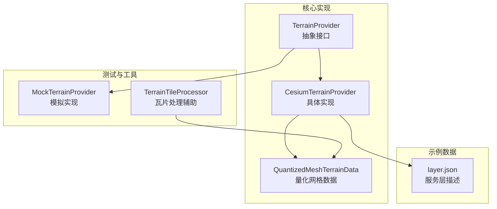
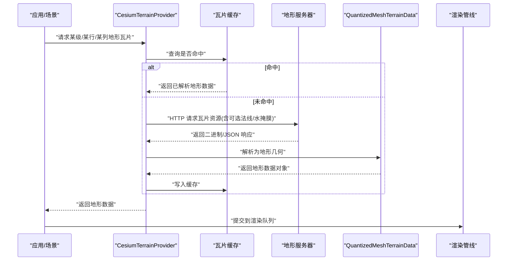
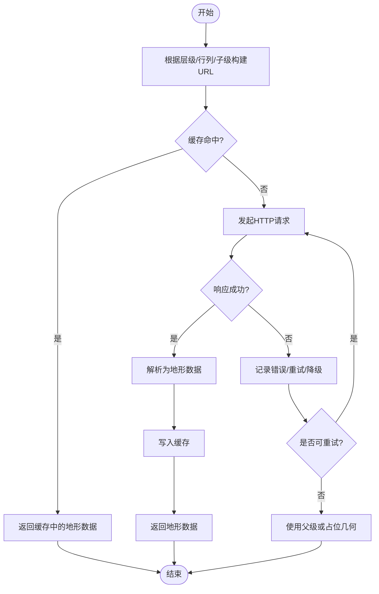
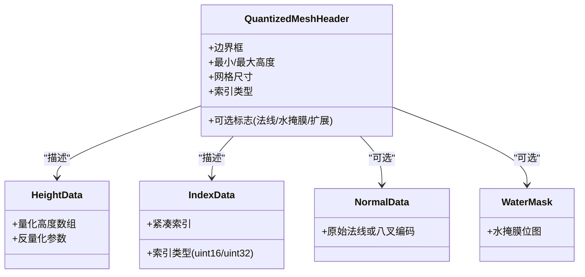
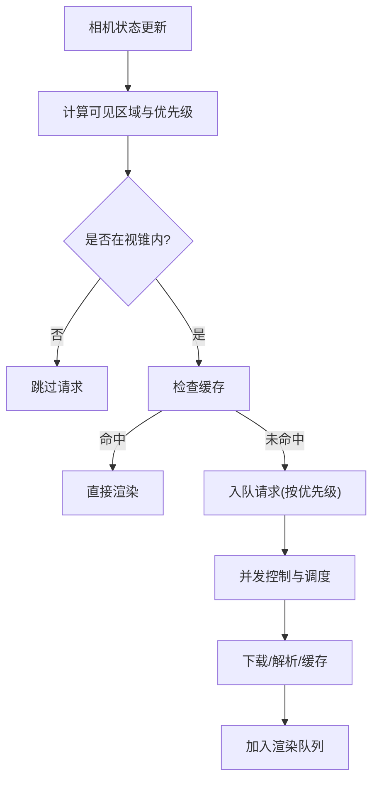
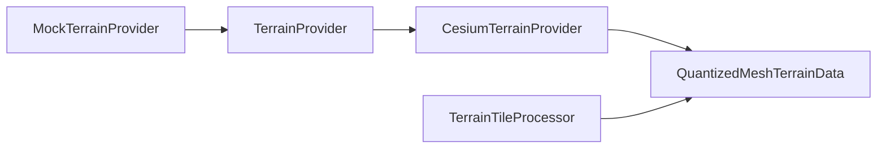

# 地形数据提供者系统

<cite>
**本文引用的文件**   
- [TerrainProvider.js](file://Source/Core/TerrainProvider.js)
- [CesiumTerrainProvider.js](file://Source/Core/CesiumTerrainProvider.js)
- [QuantizedMeshTerrainData.js](file://Source/Core/QuantizedMeshTerrainData.js)
- [TerrainTileProcessor.js](file://Specs/TerrainTileProcessor.js)
- [MockTerrainProvider.js](file://Specs/MockTerrainProvider.js)
- [layer.json](file://Specs/Data/CesiumTerrainTileJson/QuantizedMesh/layer.json)
</cite>

## 目录
1. [简介](#简介)
2. [项目结构](#项目结构)
3. [核心组件](#核心组件)
4. [架构总览](#架构总览)
5. [详细组件分析](#详细组件分析)
6. [依赖关系分析](#依赖关系分析)
7. [性能考量](#性能考量)
8. [故障排查指南](#故障排查指南)
9. [结论](#结论)
10. [附录](#附录)

## 简介
本技术文档围绕 Cesium 的地形数据提供者体系展开，重点阐述 TerrainProvider 抽象接口的设计与扩展机制、Quantized Mesh 格式的数据结构与压缩策略、多分辨率瓦片管理与 LOD/视锥剔除/异步加载流程，以及 CesiumTerrainProvider 的服务器通信、缓存与错误处理。文末提供自定义地形提供者的开发指南与性能优化建议，并给出接入不同格式地形数据源的实践路径（以源码位置指引为主）。

## 项目结构
与地形系统相关的核心代码位于 Source/Core 下，测试与示例数据位于 Specs 目录：
- 抽象接口与实现
  - TerrainProvider：地形数据提供者抽象基类
  - CesiumTerrainProvider：基于 Cesium Terrain Server 协议的具体实现
  - QuantizedMeshTerrainData：Quantized Mesh 地形数据的解析与几何构建
- 测试与工具
  - TerrainTileProcessor：用于处理地形瓦片的测试辅助
  - MockTerrainProvider：用于单元测试的模拟地形提供者
- 示例数据
  - CesiumTerrainTileJson/QuantizedMesh/layer.json：Quantized Mesh 服务层描述

图表来源
- [TerrainProvider.js](file://Source/Core/TerrainProvider.js)
- [CesiumTerrainProvider.js](file://Source/Core/CesiumTerrainProvider.js)
- [QuantizedMeshTerrainData.js](file://Source/Core/QuantizedMeshTerrainData.js)
- [MockTerrainProvider.js](file://Specs/MockTerrainProvider.js)
- [TerrainTileProcessor.js](file://Specs/TerrainTileProcessor.js)
- [layer.json](file://Specs/Data/CesiumTerrainTileJson/QuantizedMesh/layer.json)

章节来源
- [TerrainProvider.js](file://Source/Core/TerrainProvider.js)
- [CesiumTerrainProvider.js](file://Source/Core/CesiumTerrainProvider.js)
- [QuantizedMeshTerrainData.js](file://Source/Core/QuantizedMeshTerrainData.js)
- [MockTerrainProvider.js](file://Specs/MockTerrainProvider.js)
- [TerrainTileProcessor.js](file://Specs/TerrainTileProcessor.js)
- [layer.json](file://Specs/Data/CesiumTerrainTileJson/QuantizedMesh/layer.json)

## 核心组件
- TerrainProvider 抽象接口
  - 职责：定义获取地形瓦片、查询可用区域、生命周期管理等统一契约，屏蔽底层数据源差异。
  - 关键能力：按层级/行列请求瓦片、返回可渲染的地形数据结构、支持异步取消与错误上报。
- CesiumTerrainProvider
  - 职责：对接 Cesium Terrain Server 协议，负责瓦片 URL 生成、HTTP 请求、响应解码、缓存管理、LOD 选择与并发控制。
  - 关键点：支持多种内容类型（如 Quantized Mesh）、可选法线/水掩膜等扩展字段、错误重试与降级策略。
- QuantizedMeshTerrainData
  - 职责：解析 Quantized Mesh 二进制流，重建顶点坐标、索引、高度值、法线与可选属性；输出为引擎可用的地形几何体。
  - 关键点：高度量化、顶点索引优化、法线存储（含八叉编码变体）、可选元数据（可用性、版权、扩展）。

章节来源
- [TerrainProvider.js](file://Source/Core/TerrainProvider.js)
- [CesiumTerrainProvider.js](file://Source/Core/CesiumTerrainProvider.js)
- [QuantizedMeshTerrainData.js](file://Source/Core/QuantizedMeshTerrainData.js)

## 架构总览
从高层视角看，地形系统由“抽象接口—具体提供者—数据解析—渲染管线”构成。CesiumTerrainProvider 作为默认实现，将服务端协议与本地缓存、调度器结合，最终通过 QuantizedMeshTerrainData 将二进制地形转换为可绘制几何。

图表来源
- [CesiumTerrainProvider.js](file://Source/Core/CesiumTerrainProvider.js)
- [QuantizedMeshTerrainData.js](file://Source/Core/QuantizedMeshTerrainData.js)

## 详细组件分析

### TerrainProvider 抽象接口设计模式与扩展机制
- 设计要点
  - 面向接口编程：上层仅依赖抽象接口，便于替换不同后端（如本地离线服务、第三方地形服务）。
  - 异步优先：所有 I/O 操作均返回 Promise，配合取消令牌避免无效请求。
  - 可扩展性：通过子类化或组合方式扩展功能（例如增加自定义缓存、鉴权、重试）。
- 典型方法族
  - 瓦片请求：按层级/行列/子级维度获取地形数据
  - 可用性查询：判断某区域是否存在有效地形
  - 生命周期：初始化、销毁、事件通知
- 扩展建议
  - 在构造期注入 HTTP 客户端、缓存策略、日志与指标采集
  - 对网络异常进行统一封装，向上抛出领域语义明确的错误

章节来源
- [TerrainProvider.js](file://Source/Core/TerrainProvider.js)

### CesiumTerrainProvider 实现原理
- 服务器通信协议
  - 基于 Cesium Terrain Server 约定，使用层级/行列/子级键生成资源 URL
  - 支持多种内容类型与可选扩展（如法线、水掩膜、可用性元数据）
- 瓦片缓存策略
  - 内存缓存：最近访问的瓦片常驻内存，减少重复解析与网络开销
  - 淘汰策略：按 LRU 或容量上限回收，平衡内存占用与命中率
- 并发与调度
  - 限制并发请求数，避免拥塞
  - 优先级队列：近景高优、远景低优，提升首帧体验
- 错误处理
  - 网络超时/失败重试、指数退避
  - 降级策略：缺失瓦片时回退至父级或占位几何
  - 错误上报：结构化错误码与上下文信息

图表来源
- [CesiumTerrainProvider.js](file://Source/Core/CesiumTerrainProvider.js)

章节来源
- [CesiumTerrainProvider.js](file://Source/Core/CesiumTerrainProvider.js)

### Quantized Mesh 格式与压缩算法
- 数据结构概览
  - 头部与元数据：包含边界框、最小/最大高度、网格尺寸、索引类型、可选法线/水掩膜标志等
  - 高度数据：以短整型/半精度等形式量化存储，显著降低体积
  - 顶点索引：采用紧凑索引（如 uint16/uint32），减少冗余
  - 法线信息：可选，支持原始浮点或八叉编码（Oct-encoded）以节省空间
  - 可选扩展：可用性位图、版权、自定义扩展字段
- 高度值量化
  - 将连续高度映射到离散区间，通过缩放与偏移恢复近似值
  - 量化精度影响视觉质量与带宽/内存占用
- 顶点索引优化
  - 使用三角形带/扇或更紧凑的索引布局，减少传输与解析成本
- 法线存储
  - 原始法线占用较大，八叉编码可将单位球面方向压缩为少量比特
- 解析与重建
  - 读取二进制流，反量化高度，重建顶点坐标与索引，必要时计算法线
  - 输出为引擎内部地形数据结构，供后续渲染

图表来源
- [QuantizedMeshTerrainData.js](file://Source/Core/QuantizedMeshTerrainData.js)

章节来源
- [QuantizedMeshTerrainData.js](file://Source/Core/QuantizedMeshTerrainData.js)

### 多分辨率地形瓦片管理与 LOD/视锥剔除/异步加载
- 多分辨率瓦片组织
  - 按四叉树/八叉树划分地理区域，逐级细分，形成层级结构
  - 每级瓦片对应不同的几何误差阈值与细节级别
- LOD 策略
  - 基于相机距离、屏幕误差与几何误差综合评估，动态选择合适层级
  - 父子瓦片切换平滑过渡，避免突变
- 视锥剔除
  - 在请求前剔除不在视锥内的瓦片，减少无效网络与解析开销
- 异步加载机制
  - 任务队列：按优先级调度，支持取消与抢占
  - 背压控制：限制并发，防止雪崩
  - 预取与回填：预测用户移动趋势，提前加载邻近瓦片

[本节为概念性说明，不直接分析具体文件]

## 依赖关系分析
- 模块耦合
  - CesiumTerrainProvider 依赖 TerrainProvider 抽象契约，并通过 QuantizedMeshTerrainData 完成数据解析
  - 测试用例通过 MockTerrainProvider 隔离外部依赖，验证调度与缓存逻辑
- 外部依赖
  - 网络栈：HTTP 客户端、超时与重试策略
  - 序列化/反序列化：二进制解析、可选扩展字段兼容
- 潜在循环依赖
  - 保持“抽象—实现—解析”单向依赖，避免循环引用

图表来源
- [TerrainProvider.js](file://Source/Core/TerrainProvider.js)
- [CesiumTerrainProvider.js](file://Source/Core/CesiumTerrainProvider.js)
- [QuantizedMeshTerrainData.js](file://Source/Core/QuantizedMeshTerrainData.js)
- [MockTerrainProvider.js](file://Specs/MockTerrainProvider.js)
- [TerrainTileProcessor.js](file://Specs/TerrainTileProcessor.js)

章节来源
- [TerrainProvider.js](file://Source/Core/TerrainProvider.js)
- [CesiumTerrainProvider.js](file://Source/Core/CesiumTerrainProvider.js)
- [QuantizedMeshTerrainData.js](file://Source/Core/QuantizedMeshTerrainData.js)
- [MockTerrainProvider.js](file://Specs/MockTerrainProvider.js)
- [TerrainTileProcessor.js](file://Specs/TerrainTileProcessor.js)

## 性能考量
- 网络层面
  - 启用连接复用与 HTTP/2，减少握手开销
  - 合理设置超时与重试次数，避免抖动放大
- 缓存策略
  - 调整缓存大小与淘汰策略，提高命中率同时控制内存峰值
  - 区分热瓦片与冷瓦片，采用分层缓存
- 解析与几何构建
  - 尽量在 Web Worker 中执行重型解析，避免主线程阻塞
  - 增量更新与差异解析，减少重复工作
- 渲染阶段
  - 合并批次、减少状态切换
  - 按需开启法线与水掩膜，权衡质量与性能

[本节提供通用指导，不直接分析具体文件]

## 故障排查指南
- 常见问题定位
  - 瓦片缺失：检查 layer.json 与服务端路径一致性，确认层级/行列/子级键是否正确
  - 解析失败：核对 Quantized Mesh 头部字段与扩展标志，确保客户端版本兼容
  - 性能瓶颈：观察缓存命中率、并发度与解析耗时，定位热点瓦片
- 调试手段
  - 使用 TerrainTileProcessor 辅助验证瓦片处理链路
  - 借助 MockTerrainProvider 构造可控输入，复现边界条件
- 错误分类与上报
  - 网络错误：超时、404、5xx
  - 解析错误：格式不符、字段缺失、扩展未知
  - 渲染错误：几何非法、法线异常

章节来源
- [TerrainTileProcessor.js](file://Specs/TerrainTileProcessor.js)
- [MockTerrainProvider.js](file://Specs/MockTerrainProvider.js)
- [layer.json](file://Specs/Data/CesiumTerrainTileJson/QuantizedMesh/layer.json)

## 结论
Cesium 的地形数据提供者体系通过清晰的抽象接口与可扩展实现，将复杂的多分辨率地形加载、LOD 选择与网络调度解耦。Quantized Mesh 格式在保证精度的前提下大幅压缩体积，配合高效的缓存与异步调度，实现了大规模地形的流畅展示。遵循本文的开发指南与优化建议，可快速接入不同地形数据源并达到稳定高性能的运行效果。

## 附录
- 接入不同格式地形数据源的实践路径
  - 基于 Cesium Terrain Server 协议
    - 参考 CesiumTerrainProvider 的 URL 生成与响应处理逻辑，确保服务端输出符合协议约定
    - 示例层描述文件参见：[layer.json](file://Specs/Data/CesiumTerrainTileJson/QuantizedMesh/layer.json)
  - 自定义地形提供者
    - 继承 TerrainProvider 抽象接口，实现瓦片请求与可用性查询
    - 在构造期注入缓存、调度与错误处理策略
    - 参考测试中的模拟实现思路：[MockTerrainProvider.js](file://Specs/MockTerrainProvider.js)
  - 解析与渲染
    - 若使用 Quantized Mesh，参考 QuantizedMeshTerrainData 的解析流程与数据结构
    - 将解析结果提交至渲染管线，注意批处理与状态切换优化

章节来源
- [CesiumTerrainProvider.js](file://Source/Core/CesiumTerrainProvider.js)
- [QuantizedMeshTerrainData.js](file://Source/Core/QuantizedMeshTerrainData.js)
- [MockTerrainProvider.js](file://Specs/MockTerrainProvider.js)
- [layer.json](file://Specs/Data/CesiumTerrainTileJson/QuantizedMesh/layer.json)