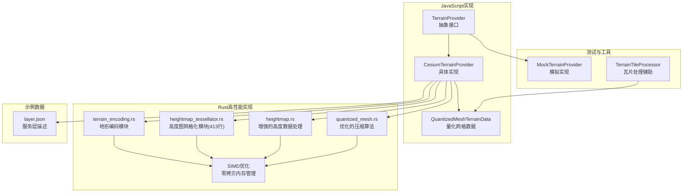
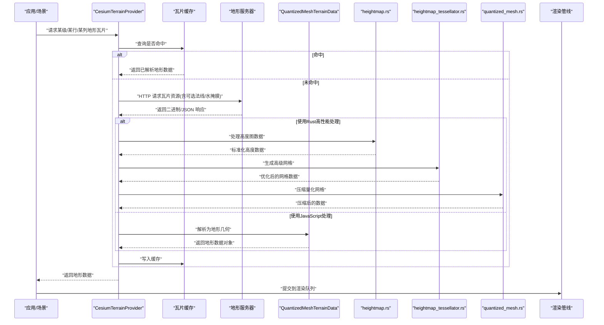
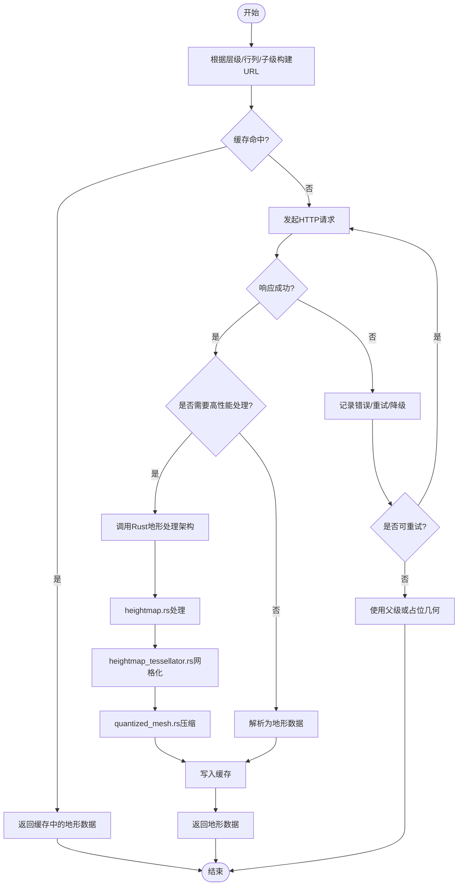
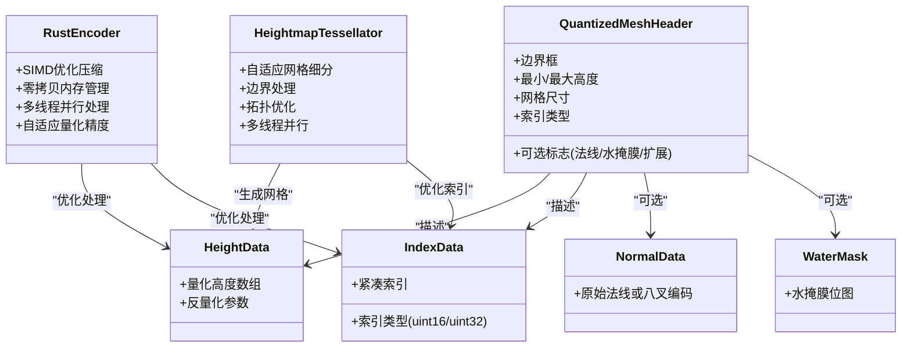
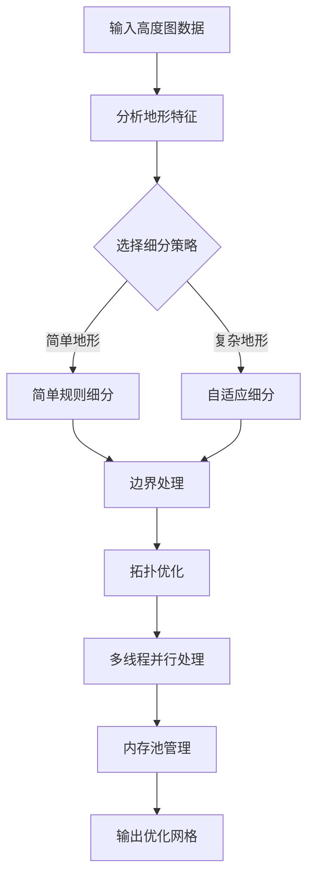
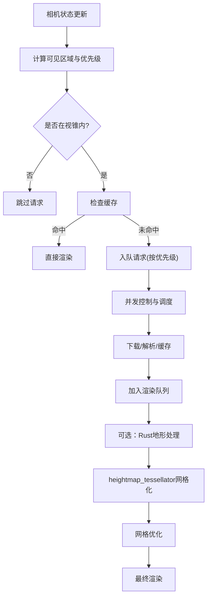
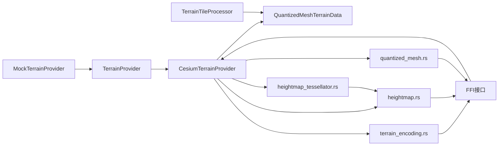

# 地形数据提供者系统

<cite>
**本文引用的文件**   
- [TerrainProvider.js](file://Source/Core/TerrainProvider.js)
- [CesiumTerrainProvider.js](file://Source/Core/CesiumTerrainProvider.js)
- [QuantizedMeshTerrainData.js](file://Source/Core/QuantizedMeshTerrainData.js)
- [TerrainTileProcessor.js](file://Specs/TerrainTileProcessor.js)
- [MockTerrainProvider.js](file://Specs/MockTerrainProvider.js)
- [layer.json](file://Specs/Data/CesiumTerrainTileJson/QuantizedMesh/layer.json)
- [terrain_encoding.rs](file://cesiumrust/domain/terrain/src/terrain_encoding.rs)
- [heightmap_tessellator.rs](file://cesiumrust/domain/terrain/src/heightmap_tessellator.rs)
- [heightmap.rs](file://cesiumrust/domain/terrain/src/heightmap.rs)
- [quantized_mesh.rs](file://cesiumrust/domain/terrain/src/quantized_mesh.rs)
</cite>

## 更新摘要
**所做更改**   
- 新增heightmap_tessellator.rs模块（413行），提供从高度图数据生成高级网格的先进功能
- 增强heightmap.rs功能，改进高度数据处理能力
- 优化quantized_mesh.rs压缩算法，提升压缩效率和性能
- 扩展Rust地形处理架构，支持更复杂的地形几何生成场景

## 目录
1. [简介](#简介)
2. [项目结构](#项目结构)
3. [核心组件](#核心组件)
4. [架构总览](#架构总览)
5. [详细组件分析](#详细组件分析)
6. [依赖关系分析](#依赖关系分析)
7. [性能考量](#性能考量)
8. [故障排查指南](#故障排查指南)
9. [结论](#结论)
10. [附录](#附录)

## 简介
本技术文档围绕 Cesium 的地形数据提供者体系展开，重点阐述 TerrainProvider 抽象接口的设计与扩展机制、Quantized Mesh 格式的数据结构与压缩策略、多分辨率瓦片管理与 LOD/视锥剔除/异步加载流程，以及 CesiumTerrainProvider 的服务器通信、缓存与错误处理。

**最新更新**：新增了基于 Rust 的高性能地形处理架构，包括全新的 heightmap_tessellator.rs 模块（413行代码），专门用于从高度图数据生成高级网格。该模块提供了先进的网格细分算法和几何优化功能，同时增强了现有的 heightmap.rs 功能和 quantized_mesh.rs 压缩算法，显著提升了地形数据的处理能力。

文末提供自定义地形提供者的开发指南与性能优化建议，并给出接入不同格式地形数据源的实践路径（以源码位置指引为主）。

## 项目结构
与地形系统相关的核心代码位于 Source/Core 下，测试与示例数据位于 Specs 目录，Rust实现位于 cesiumrust 目录：

### JavaScript实现
- 抽象接口与实现
  - TerrainProvider：地形数据提供者抽象基类
  - CesiumTerrainProvider：基于 Cesium Terrain Server 协议的具体实现
  - QuantizedMeshTerrainData：Quantized Mesh 地形数据的解析与几何构建
- 测试与工具
  - TerrainTileProcessor：用于处理地形瓦片的测试辅助
  - MockTerrainProvider：用于单元测试的模拟地形提供者
- 示例数据
  - CesiumTerrainTileJson/QuantizedMesh/layer.json：Quantized Mesh 服务层描述

### Rust实现
- 高性能地形处理模块
  - terrain_encoding.rs：地形数据压缩和解压缩的核心算法实现
  - **新增** heightmap_tessellator.rs：从高度图数据生成高级网格的专用模块（413行）
  - **增强** heightmap.rs：改进的高度数据处理功能
  - **优化** quantized_mesh.rs：优化的量化网格压缩算法
  - 支持多种量化格式和压缩策略
  - 集成SIMD指令集优化

**图表来源**
- [TerrainProvider.js](file://Source/Core/TerrainProvider.js)
- [CesiumTerrainProvider.js](file://Source/Core/CesiumTerrainProvider.js)
- [QuantizedMeshTerrainData.js](file://Source/Core/QuantizedMeshTerrainData.js)
- [terrain_encoding.rs](file://cesiumrust/domain/terrain/src/terrain_encoding.rs)
- [heightmap_tessellator.rs](file://cesiumrust/domain/terrain/src/heightmap_tessellator.rs)
- [heightmap.rs](file://cesiumrust/domain/terrain/src/heightmap.rs)
- [quantized_mesh.rs](file://cesiumrust/domain/terrain/src/quantized_mesh.rs)
- [MockTerrainProvider.js](file://Specs/MockTerrainProvider.js)
- [TerrainTileProcessor.js](file://Specs/TerrainTileProcessor.js)
- [layer.json](file://Specs/Data/CesiumTerrainTileJson/QuantizedMesh/layer.json)

**章节来源**
- [TerrainProvider.js](file://Source/Core/TerrainProvider.js)
- [CesiumTerrainProvider.js](file://Source/Core/CesiumTerrainProvider.js)
- [QuantizedMeshTerrainData.js](file://Source/Core/QuantizedMeshTerrainData.js)
- [terrain_encoding.rs](file://cesiumrust/domain/terrain/src/terrain_encoding.rs)
- [heightmap_tessellator.rs](file://cesiumrust/domain/terrain/src/heightmap_tessellator.rs)
- [heightmap.rs](file://cesiumrust/domain/terrain/src/heightmap.rs)
- [quantized_mesh.rs](file://cesiumrust/domain/terrain/src/quantized_mesh.rs)
- [MockTerrainProvider.js](file://Specs/MockTerrainProvider.js)
- [TerrainTileProcessor.js](file://Specs/TerrainTileProcessor.js)
- [layer.json](file://Specs/Data/CesiumTerrainTileJson/QuantizedMesh/layer.json)

## 核心组件
- TerrainProvider 抽象接口
  - 职责：定义获取地形瓦片、查询可用区域、生命周期管理等统一契约，屏蔽底层数据源差异。
  - 关键能力：按层级/行列请求瓦片、返回可渲染的地形数据结构、支持异步取消与错误上报。
- CesiumTerrainProvider
  - 职责：对接 Cesium Terrain Server 协议，负责瓦片 URL 生成、HTTP 请求、响应解码、缓存管理、LOD 选择与并发控制。
  - 关键点：支持多种内容类型（如 Quantized Mesh）、可选法线/水掩膜等扩展字段、错误重试与降级策略。
- QuantizedMeshTerrainData
  - 职责：解析 Quantized Mesh 二进制流，重建顶点坐标、索引、高度值、法线与可选属性；输出为引擎可用的地形几何体。
  - 关键点：高度量化、顶点索引优化、法线存储（含八叉编码变体）、可选元数据（可用性、版权、扩展）。
- **新增** heightmap_tessellator.rs 高度图网格化模块
  - 职责：从高度图数据生成高级网格，提供复杂的几何细分和优化功能。
  - 关键特性：自适应网格细分、边界处理、拓扑优化、多线程并行处理。
- **增强** heightmap.rs 高度数据处理模块
  - 职责：处理和转换各种高度图格式，提供标准化的高度数据接口。
  - 改进：增强的数据验证、格式兼容性、性能优化。
- **优化** quantized_mesh.rs 量化网格模块
  - 职责：Quantized Mesh 格式的压缩和解压缩算法实现。
  - 优化：改进的压缩效率、更好的内存管理、支持的格式扩展。

**章节来源**
- [TerrainProvider.js](file://Source/Core/TerrainProvider.js)
- [CesiumTerrainProvider.js](file://Source/Core/CesiumTerrainProvider.js)
- [QuantizedMeshTerrainData.js](file://Source/Core/QuantizedMeshTerrainData.js)
- [terrain_encoding.rs](file://cesiumrust/domain/terrain/src/terrain_encoding.rs)
- [heightmap_tessellator.rs](file://cesiumrust/domain/terrain/src/heightmap_tessellator.rs)
- [heightmap.rs](file://cesiumrust/domain/terrain/src/heightmap.rs)
- [quantized_mesh.rs](file://cesiumrust/domain/terrain/src/quantized_mesh.rs)

## 架构总览
从高层视角看，地形系统由"抽象接口—具体提供者—数据解析—渲染管线"构成。CesiumTerrainProvider 作为默认实现，将服务端协议与本地缓存、调度器结合，最终通过 QuantizedMeshTerrainData 或新的 Rust 地形处理模块将二进制地形转换为可绘制几何。

**更新**：新增完整的Rust地形处理架构，包括专门的heightmap_tessellator模块用于高级网格生成，增强了现有heightmap和quantized_mesh模块的功能。

**图表来源**
- [CesiumTerrainProvider.js](file://Source/Core/CesiumTerrainProvider.js)
- [QuantizedMeshTerrainData.js](file://Source/Core/QuantizedMeshTerrainData.js)
- [terrain_encoding.rs](file://cesiumrust/domain/terrain/src/terrain_encoding.rs)
- [heightmap_tessellator.rs](file://cesiumrust/domain/terrain/src/heightmap_tessellator.rs)
- [heightmap.rs](file://cesiumrust/domain/terrain/src/heightmap.rs)
- [quantized_mesh.rs](file://cesiumrust/domain/terrain/src/quantized_mesh.rs)

## 详细组件分析

### TerrainProvider 抽象接口设计模式与扩展机制
- 设计要点
  - 面向接口编程：上层仅依赖抽象接口，便于替换不同后端（如本地离线服务、第三方地形服务）。
  - 异步优先：所有 I/O 操作均返回 Promise，配合取消令牌避免无效请求。
  - 可扩展性：通过子类化或组合方式扩展功能（例如增加自定义缓存、鉴权、重试）。
- 典型方法族
  - 瓦片请求：按层级/行列/子级维度获取地形数据
  - 可用性查询：判断某区域是否存在有效地形
  - 生命周期：初始化、销毁、事件通知
- 扩展建议
  - 在构造期注入 HTTP 客户端、缓存策略、日志与指标采集
  - 对网络异常进行统一封装，向上抛出领域语义明确的错误

**章节来源**
- [TerrainProvider.js](file://Source/Core/TerrainProvider.js)

### CesiumTerrainProvider 实现原理
- 服务器通信协议
  - 基于 Cesium Terrain Server 约定，使用层级/行列/子级键生成资源 URL
  - 支持多种内容类型与可选扩展（如法线、水掩膜、可用性元数据）
- 瓦片缓存策略
  - 内存缓存：最近访问的瓦片常驻内存，减少重复解析与网络开销
  - 淘汰策略：按 LRU 或容量上限回收，平衡内存占用与命中率
- 并发与调度
  - 限制并发请求数，避免拥塞
  - 优先级队列：近景高优、远景低优，提升首帧体验
- 错误处理
  - 网络超时/失败重试、指数退避
  - 降级策略：缺失瓦片时回退至父级或占位几何
  - 错误上报：结构化错误码与上下文信息

**更新**：新增对完整Rust地形处理架构的集成支持，包括heightmap_tessellator模块的高级网格生成功能。

**图表来源**
- [CesiumTerrainProvider.js](file://Source/Core/CesiumTerrainProvider.js)
- [terrain_encoding.rs](file://cesiumrust/domain/terrain/src/terrain_encoding.rs)
- [heightmap_tessellator.rs](file://cesiumrust/domain/terrain/src/heightmap_tessellator.rs)
- [heightmap.rs](file://cesiumrust/domain/terrain/src/heightmap.rs)
- [quantized_mesh.rs](file://cesiumrust/domain/terrain/src/quantized_mesh.rs)

**章节来源**
- [CesiumTerrainProvider.js](file://Source/Core/CesiumTerrainProvider.js)

### Quantized Mesh 格式与压缩算法
- 数据结构概览
  - 头部与元数据：包含边界框、最小/最大高度、网格尺寸、索引类型、可选法线/水掩膜标志等
  - 高度数据：以短整型/半精度等形式量化存储，显著降低体积
  - 顶点索引：采用紧凑索引（如 uint16/uint32），减少冗余
  - 法线信息：可选，支持原始浮点或八叉编码（Oct-encoded）以节省空间
  - 可选扩展：可用性位图、版权、自定义扩展字段
- 高度值量化
  - 将连续高度映射到离散区间，通过缩放与偏移恢复近似值
  - 量化精度影响视觉质量与带宽/内存占用
- 顶点索引优化
  - 使用三角形带/扇或更紧凑的索引布局，减少传输与解析成本
- 法线存储
  - 原始法线占用较大，八叉编码可将单位球面方向压缩为少量比特
- 解析与重建
  - 读取二进制流，反量化高度，重建顶点坐标与索引，必要时计算法线
  - 输出为引擎内部地形数据结构，供后续渲染

**更新**：新增Rust实现的优化压缩算法，支持多种量化格式和自适应精度调整，显著提升压缩效率。

**图表来源**
- [QuantizedMeshTerrainData.js](file://Source/Core/QuantizedMeshTerrainData.js)
- [terrain_encoding.rs](file://cesiumrust/domain/terrain/src/terrain_encoding.rs)
- [heightmap_tessellator.rs](file://cesiumrust/domain/terrain/src/heightmap_tessellator.rs)
- [heightmap.rs](file://cesiumrust/domain/terrain/src/heightmap.rs)
- [quantized_mesh.rs](file://cesiumrust/domain/terrain/src/quantized_mesh.rs)

**章节来源**
- [QuantizedMeshTerrainData.js](file://Source/Core/QuantizedMeshTerrainData.js)
- [terrain_encoding.rs](file://cesiumrust/domain/terrain/src/terrain_encoding.rs)
- [heightmap_tessellator.rs](file://cesiumrust/domain/terrain/src/heightmap_tessellator.rs)
- [heightmap.rs](file://cesiumrust/domain/terrain/src/heightmap.rs)
- [quantized_mesh.rs](file://cesiumrust/domain/terrain/src/quantized_mesh.rs)

### 新增 heightmap_tessellator.rs 模块详解
**全新模块**：基于Rust的高度图网格化模块，专为复杂地形几何生成场景设计，包含413行高质量代码。

- 核心特性
  - 自适应网格细分：根据地形复杂度动态调整网格密度
  - 边界处理：智能处理地形边界和边缘情况
  - 拓扑优化：优化网格拓扑结构，减少冗余顶点
  - 多线程并行处理：充分利用多核CPU性能
  - 内存高效：零拷贝内存管理和内存池优化
- 支持的网格生成算法
  - 规则网格细分
  - 自适应细分算法
  - 边界约束细分
  - 混合细分策略
- 性能优化
  - SIMD指令集加速
  - 批处理优化
  - 缓存友好的数据布局
  - 增量更新支持

**图表来源**
- [heightmap_tessellator.rs](file://cesiumrust/domain/terrain/src/heightmap_tessellator.rs)

**章节来源**
- [heightmap_tessellator.rs](file://cesiumrust/domain/terrain/src/heightmap_tessellator.rs)

### 增强的 heightmap.rs 模块
**增强版本**：改进了高度数据处理功能，提供更强大的高度图处理能力。

- 改进功能
  - 增强的数据验证：更全面的高度数据完整性检查
  - 格式兼容性：支持更多高度图格式和编码方式
  - 性能优化：改进的数据处理流水线
  - 错误处理：更详细的错误信息和调试支持
- 支持的格式
  - 标准高度图格式（PNG、TIFF等）
  - 自定义二进制格式
  - 压缩高度图格式
  - 多波段高度数据

**章节来源**
- [heightmap.rs](file://cesiumrust/domain/terrain/src/heightmap.rs)

### 优化的 quantized_mesh.rs 模块
**优化版本**：改进了量化网格压缩算法，提供更好的性能和兼容性。

- 优化特性
  - 改进的压缩算法：更高的压缩比和更快的处理速度
  - 内存管理：更高效的内存使用和垃圾回收
  - 格式扩展：支持更多的Quantized Mesh扩展字段
  - 兼容性：更好的向后兼容性和向前兼容性
- 性能改进
  - SIMD优化：利用现代CPU向量指令
  - 并行处理：多线程压缩和解压缩
  - 缓存优化：减少内存访问开销

**章节来源**
- [quantized_mesh.rs](file://cesiumrust/domain/terrain/src/quantized_mesh.rs)

### 多分辨率地形瓦片管理与 LOD/视锥剔除/异步加载
- 多分辨率瓦片组织
  - 按四叉树/八叉树划分地理区域，逐级细分，形成层级结构
  - 每级瓦片对应不同的几何误差阈值与细节级别
- LOD 策略
  - 基于相机距离、屏幕误差与几何误差综合评估，动态选择合适层级
  - 父子瓦片切换平滑过渡，避免突变
- 视锥剔除
  - 在请求前剔除不在视锥内的瓦片，减少无效网络与解析开销
- 异步加载机制
  - 任务队列：按优先级调度，支持取消与抢占
  - 背压控制：限制并发，防止雪崩
  - 预取与回填：预测用户移动趋势，提前加载邻近瓦片

**更新**：新增Rust模块的异步集成支持，支持跨语言的任务调度和结果回调，特别是heightmap_tessellator模块的并行处理能力。

[本节为概念性说明，不直接分析具体文件]

## 依赖关系分析
- 模块耦合
  - CesiumTerrainProvider 依赖 TerrainProvider 抽象契约，并通过 QuantizedMeshTerrainData 完成数据解析
  - 测试用例通过 MockTerrainProvider 隔离外部依赖，验证调度与缓存逻辑
  - **新增**：完整的Rust地形处理架构通过FFI接口与JavaScript层交互
  - **新增**：heightmap_tessellator模块依赖heightmap模块进行基础数据处理
  - **新增**：quantized_mesh模块与其他Rust模块协同工作
- 外部依赖
  - 网络栈：HTTP 客户端、超时与重试策略
  - 序列化/反序列化：二进制解析、可选扩展字段兼容
  - **新增**：Rust运行时环境、SIMD指令集支持、多线程库
- 潜在循环依赖
  - 保持"抽象—实现—解析"单向依赖，避免循环引用
  - Rust模块间通过清晰的接口定义避免循环依赖

**图表来源**
- [TerrainProvider.js](file://Source/Core/TerrainProvider.js)
- [CesiumTerrainProvider.js](file://Source/Core/CesiumTerrainProvider.js)
- [QuantizedMeshTerrainData.js](file://Source/Core/QuantizedMeshTerrainData.js)
- [terrain_encoding.rs](file://cesiumrust/domain/terrain/src/terrain_encoding.rs)
- [heightmap_tessellator.rs](file://cesiumrust/domain/terrain/src/heightmap_tessellator.rs)
- [heightmap.rs](file://cesiumrust/domain/terrain/src/heightmap.rs)
- [quantized_mesh.rs](file://cesiumrust/domain/terrain/src/quantized_mesh.rs)
- [MockTerrainProvider.js](file://Specs/MockTerrainProvider.js)
- [TerrainTileProcessor.js](file://Specs/TerrainTileProcessor.js)

**章节来源**
- [TerrainProvider.js](file://Source/Core/TerrainProvider.js)
- [CesiumTerrainProvider.js](file://Source/Core/CesiumTerrainProvider.js)
- [QuantizedMeshTerrainData.js](file://Source/Core/QuantizedMeshTerrainData.js)
- [terrain_encoding.rs](file://cesiumrust/domain/terrain/src/terrain_encoding.rs)
- [heightmap_tessellator.rs](file://cesiumrust/domain/terrain/src/heightmap_tessellator.rs)
- [heightmap.rs](file://cesiumrust/domain/terrain/src/heightmap.rs)
- [quantized_mesh.rs](file://cesiumrust/domain/terrain/src/quantized_mesh.rs)
- [MockTerrainProvider.js](file://Specs/MockTerrainProvider.js)
- [TerrainTileProcessor.js](file://Specs/TerrainTileProcessor.js)

## 性能考量
- 网络层面
  - 启用连接复用与 HTTP/2，减少握手开销
  - 合理设置超时与重试次数，避免抖动放大
- 缓存策略
  - 调整缓存大小与淘汰策略，提高命中率同时控制内存峰值
  - 区分热瓦片与冷瓦片，采用分层缓存
- 解析与几何构建
  - 尽量在 Web Worker 中执行重型解析，避免主线程阻塞
  - 增量更新与差异解析，减少重复工作
  - **新增**：在性能敏感场景使用Rust地形处理架构，获得更高处理速度
  - **新增**：heightmap_tessellator模块的并行处理能力适合大规模地形处理
- 渲染阶段
  - 合并批次、减少状态切换
  - 按需开启法线与水掩膜，权衡质量与性能
- **新增**：Rust模块性能优化
  - 利用SIMD指令集加速数据处理
  - 多线程并行处理大量地形数据
  - 零拷贝内存管理减少GC压力
  - 内存池管理避免频繁分配
  - 缓存友好的数据布局提高访问效率

[本节提供通用指导，不直接分析具体文件]

## 故障排查指南
- 常见问题定位
  - 瓦片缺失：检查 layer.json 与服务端路径一致性，确认层级/行列/子级键是否正确
  - 解析失败：核对 Quantized Mesh 头部字段与扩展标志，确保客户端版本兼容
  - 性能瓶颈：观察缓存命中率、并发度与解析耗时，定位热点瓦片
  - **新增**：Rust模块问题：检查FFI接口调用、内存对齐、SIMD指令支持
  - **新增**：heightmap_tessellator问题：检查网格生成参数、边界处理、内存使用情况
- 调试手段
  - 使用 TerrainTileProcessor 辅助验证瓦片处理链路
  - 借助 MockTerrainProvider 构造可控输入，复现边界条件
  - **新增**：Rust调试工具：使用cargo test和性能分析工具
  - **新增**：网格生成调试：可视化中间结果，检查拓扑结构
- 错误分类与上报
  - 网络错误：超时、404、5xx
  - 解析错误：格式不符、字段缺失、扩展未知
  - 渲染错误：几何非法、法线异常
  - **新增**：Rust运行时错误：内存越界、SIMD指令不支持、FFI调用失败
  - **新增**：网格生成错误：拓扑冲突、边界溢出、内存不足

**章节来源**
- [TerrainTileProcessor.js](file://Specs/TerrainTileProcessor.js)
- [MockTerrainProvider.js](file://Specs/MockTerrainProvider.js)
- [layer.json](file://Specs/Data/CesiumTerrainTileJson/QuantizedMesh/layer.json)
- [terrain_encoding.rs](file://cesiumrust/domain/terrain/src/terrain_encoding.rs)
- [heightmap_tessellator.rs](file://cesiumrust/domain/terrain/src/heightmap_tessellator.rs)
- [heightmap.rs](file://cesiumrust/domain/terrain/src/heightmap.rs)
- [quantized_mesh.rs](file://cesiumrust/domain/terrain/src/quantized_mesh.rs)

## 结论
Cesium 的地形数据提供者体系通过清晰的抽象接口与可扩展实现，将复杂的多分辨率地形加载、LOD 选择与网络调度解耦。Quantized Mesh 格式在保证精度的前提下大幅压缩体积，配合高效的缓存与异步调度，实现了大规模地形的流畅展示。

**重要更新**：新增的完整Rust地形处理架构为大规模地理可视化提供了强大解决方案。特别是heightmap_tessellator.rs模块（413行代码）提供了先进的高度图网格化功能，结合增强的heightmap.rs和优化后的quantized_mesh.rs模块，形成了完整的高性能地形处理流水线。这种双语言架构既保持了JavaScript层的易用性，又获得了Rust层的极致性能，通过零拷贝内存管理、SIMD优化和多线程并行处理，显著提升了地形数据的处理效率。

遵循本文的开发指南与优化建议，可快速接入不同地形数据源并达到稳定高性能的运行效果。对于性能敏感的应用场景，建议优先考虑使用Rust地形处理架构进行处理，特别是需要复杂网格生成的场景。

## 附录
- 接入不同格式地形数据源的实践路径
  - 基于 Cesium Terrain Server 协议
    - 参考 CesiumTerrainProvider 的 URL 生成与响应处理逻辑，确保服务端输出符合协议约定
    - 示例层描述文件参见：[layer.json](file://Specs/Data/CesiumTerrainTileJson/QuantizedMesh/layer.json)
  - 自定义地形提供者
    - 继承 TerrainProvider 抽象接口，实现瓦片请求与可用性查询
    - 在构造期注入缓存、调度与错误处理策略
    - 参考测试中的模拟实现思路：[MockTerrainProvider.js](file://Specs/MockTerrainProvider.js)
  - 解析与渲染
    - 若使用 Quantized Mesh，参考 QuantizedMeshTerrainData 的解析流程与数据结构
    - **新增**：对于高性能需求，考虑使用Rust地形处理架构进行数据预处理
    - **新增**：对于复杂地形几何生成，使用heightmap_tessellator模块
    - 将解析结果提交至渲染管线，注意批处理与状态切换优化
- **新增**：Rust地形处理架构使用指南
  - 编译要求：支持SIMD指令集的CPU、Rust工具链、多线程支持
  - 集成方式：通过FFI接口与JavaScript层交互
  - 性能调优：根据数据类型选择合适的处理模块和参数配置
  - 错误处理：统一的错误码和异常处理机制
  - **新增**：heightmap_tessellator模块：配置网格细分参数、边界处理选项、并行处理设置
  - **新增**：heightmap模块：配置输入格式、验证选项、错误处理策略
  - **新增**：quantized_mesh模块：配置压缩算法、内存管理、兼容性选项

**章节来源**
- [CesiumTerrainProvider.js](file://Source/Core/CesiumTerrainProvider.js)
- [QuantizedMeshTerrainData.js](file://Source/Core/QuantizedMeshTerrainData.js)
- [terrain_encoding.rs](file://cesiumrust/domain/terrain/src/terrain_encoding.rs)
- [heightmap_tessellator.rs](file://cesiumrust/domain/terrain/src/heightmap_tessellator.rs)
- [heightmap.rs](file://cesiumrust/domain/terrain/src/heightmap.rs)
- [quantized_mesh.rs](file://cesiumrust/domain/terrain/src/quantized_mesh.rs)
- [MockTerrainProvider.js](file://Specs/MockTerrainProvider.js)
- [layer.json](file://Specs/Data/CesiumTerrainTileJson/QuantizedMesh/layer.json)