# 影像图层系统

<cite>
**本文引用的文件**   
- [ImageryProvider.js](file://Source/Scene/Imagery/ImageryProvider.js)
- [UrlTemplateImageryProvider.js](file://Source/Scene/Imagery/UrlTemplateImageryProvider.js)
- [WmsImageryProvider.js](file://Source/Scene/Imagery/WmsImageryProvider.js)
- [ArcGisMapServerImageryProvider.js](file://Source/Scene/Imagery/ArcGisMapServerImageryProvider.js)
- [TileImageryProvider.js](file://Source/Scene/Imagery/TileImageryProvider.js)
- [createTileCacheKey.js](file://Source/Scene/Imagery/createTileCacheKey.js)
- [WebMercatorProjection.js](file://Source/Core/WebMercatorProjection.js)
- [EllipsoidGeodesic.js](file://Source/Core/EllipsoidGeodesic.js)
- [RequestScheduler.js](file://Source/Core/RequestScheduler.js)
- [CreditDisplay.js](file://Source/Scene/CreditDisplay.js)
- [ImageryLayer.js](file://Source/Scene/ImageryLayer.js)
- [ImageryLayerCollection.js](file://Source/Scene/ImageryLayerCollection.js)
- [Scene.js](file://Source/Scene/Scene.js)
</cite>

## 目录
1. [简介](#简介)
2. [项目结构](#项目结构)
3. [核心组件](#核心组件)
4. [架构总览](#架构总览)
5. [详细组件分析](#详细组件分析)
6. [依赖关系分析](#依赖关系分析)
7. [性能考量](#性能考量)
8. [故障排查指南](#故障排查指南)
9. [结论](#结论)
10. [附录：配置示例与接入指南](#附录配置示例与接入指南)

## 简介
本技术文档围绕 Cesium 的影像图层系统，系统性阐述 ImageryProvider 接口设计与多种实现类（UrlTemplateImageryProvider、WmsImageryProvider、ArcGisMapServerImageryProvider 等）的职责边界与协作方式；深入解析影像瓦片的请求机制、缓存策略与渲染流程；说明对 WMS、WMTS、TMS、ArcGIS Map Server 等协议的支持与实现要点；介绍叠加混合模式、透明度控制与时间动态更新能力；并提供自定义影像提供者的开发指南（坐标系统转换、投影变换、错误重试机制），以及在线地图服务与离线影像数据的接入示例。

## 项目结构
Cesium 的影像相关代码主要位于 Source/Scene/Imagery 目录下，配合 Scene 层进行调度与渲染。关键入口与组织方式如下：
- 接口定义：ImageryProvider 定义了获取影像瓦片、元数据、版权信息等统一契约。
- 具体提供者：UrlTemplateImageryProvider、WmsImageryProvider、ArcGisMapServerImageryProvider 等分别适配不同协议或模板。
- 通用封装：TileImageryProvider 将任意 ImageryProvider 包装为基于瓦片网格的提供者，便于与场景瓦片系统对接。
- 缓存键生成：createTileCacheKey 用于生成稳定的瓦片缓存键，避免重复请求。
- 投影与几何：WebMercatorProjection、EllipsoidGeodesic 等用于坐标系统与距离计算。
- 请求调度：RequestScheduler 管理并发与限流，保障网络稳定性。
- 渲染与组合：ImageryLayer、ImageryLayerCollection、Scene 负责图层生命周期、混合与绘制。

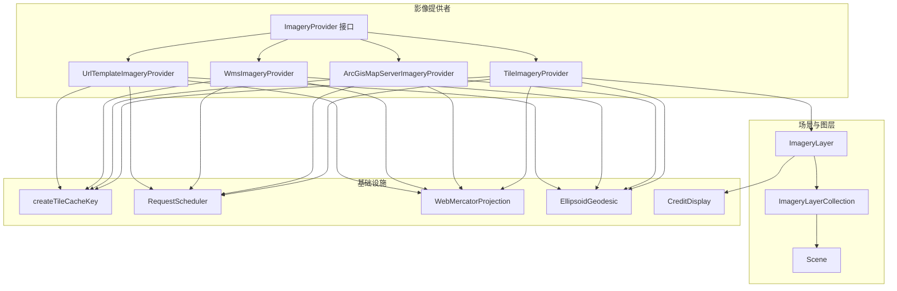

图表来源
- [ImageryProvider.js](file://Source/Scene/Imagery/ImageryProvider.js)
- [UrlTemplateImageryProvider.js](file://Source/Scene/Imagery/UrlTemplateImageryProvider.js)
- [WmsImageryProvider.js](file://Source/Scene/Imagery/WmsImageryProvider.js)
- [ArcGisMapServerImageryProvider.js](file://Source/Scene/Imagery/ArcGisMapServerImageryProvider.js)
- [TileImageryProvider.js](file://Source/Scene/Imagery/TileImageryProvider.js)
- [createTileCacheKey.js](file://Source/Scene/Imagery/createTileCacheKey.js)
- [WebMercatorProjection.js](file://Source/Core/WebMercatorProjection.js)
- [EllipsoidGeodesic.js](file://Source/Core/EllipsoidGeodesic.js)
- [RequestScheduler.js](file://Source/Core/RequestScheduler.js)
- [CreditDisplay.js](file://Source/Scene/CreditDisplay.js)
- [ImageryLayer.js](file://Source/Scene/ImageryLayer.js)
- [ImageryLayerCollection.js](file://Source/Scene/ImageryLayerCollection.js)
- [Scene.js](file://Source/Scene/Scene.js)

章节来源
- [ImageryProvider.js](file://Source/Scene/Imagery/ImageryProvider.js)
- [UrlTemplateImageryProvider.js](file://Source/Scene/Imagery/UrlTemplateImageryProvider.js)
- [WmsImageryProvider.js](file://Source/Scene/Imagery/WmsImageryProvider.js)
- [ArcGisMapServerImageryProvider.js](file://Source/Scene/Imagery/ArcGisMapServerImageryProvider.js)
- [TileImageryProvider.js](file://Source/Scene/Imagery/TileImageryProvider.js)
- [createTileCacheKey.js](file://Source/Scene/Imagery/createTileCacheKey.js)
- [WebMercatorProjection.js](file://Source/Core/WebMercatorProjection.js)
- [EllipsoidGeodesic.js](file://Source/Core/EllipsoidGeodesic.js)
- [RequestScheduler.js](file://Source/Core/RequestScheduler.js)
- [CreditDisplay.js](file://Source/Scene/CreditDisplay.js)
- [ImageryLayer.js](file://Source/Scene/ImageryLayer.js)
- [ImageryLayerCollection.js](file://Source/Scene/ImageryLayerCollection.js)
- [Scene.js](file://Source/Scene/Scene.js)

## 核心组件
- ImageryProvider 接口
  - 职责：定义统一的影像数据获取契约，包括请求瓦片、查询可用范围、版权信息、时间区间、最大级别等。
  - 关键点：返回 Promise 或回调形式的图像资源；支持可选的时间参数以驱动时间动态更新；可声明支持的投影与格式。
- UrlTemplateImageryProvider
  - 职责：基于 URL 模板拼接规则，向任意静态瓦片服务发起请求。
  - 关键点：支持 {x}/{y}/{z}、{s} 等占位符；可配置子域、最小/最大级别、透明背景、跨域与认证头。
- WmsImageryProvider
  - 职责：通过 OGC WMS GetMap 请求获取影像。
  - 关键点：构造 BBOX、CRS/SRS、LAYERS、STYLES、FORMAT、TRANSPARENT、TIME 等参数；支持多图层叠加与时间序列。
- ArcGisMapServerImageryProvider
  - 职责：对接 ArcGIS Map Server REST API，自动发现图层信息与瓦片方案。
  - 关键点：读取服务描述 JSON，解析 tileInfo、singleFusedMapCache、tileSize、origin、spatialReference；支持动态图层与时间。
- TileImageryProvider
  - 职责：将任意 ImageryProvider 包装为基于标准瓦片网格的提供者，便于与场景瓦片系统无缝集成。
  - 关键点：处理瓦片裁剪、边界检查、缓存键生成、请求去重与失败重试。
- createTileCacheKey
  - 职责：根据瓦片坐标、层级、提供者标识、时间戳等生成稳定缓存键，避免重复下载。
- RequestScheduler
  - 职责：全局请求调度器，限制并发数、队列化请求、失败重试与超时控制。
- WebMercatorProjection / EllipsoidGeodesic
  - 职责：提供 Web Mercator 投影与椭球体测地线计算，支撑瓦片坐标到地理坐标的转换与可视区域估算。
- ImageryLayer / ImageryLayerCollection / Scene
  - 职责：图层生命周期管理、混合与渲染；集合维护图层顺序与可见性；场景在帧循环中触发瓦片加载与绘制。

章节来源
- [ImageryProvider.js](file://Source/Scene/Imagery/ImageryProvider.js)
- [UrlTemplateImageryProvider.js](file://Source/Scene/Imagery/UrlTemplateImageryProvider.js)
- [WmsImageryProvider.js](file://Source/Scene/Imagery/WmsImageryProvider.js)
- [ArcGisMapServerImageryProvider.js](file://Source/Scene/Imagery/ArcGisMapServerImageryProvider.js)
- [TileImageryProvider.js](file://Source/Scene/Imagery/TileImageryProvider.js)
- [createTileCacheKey.js](file://Source/Scene/Imagery/createTileCacheKey.js)
- [RequestScheduler.js](file://Source/Core/RequestScheduler.js)
- [WebMercatorProjection.js](file://Source/Core/WebMercatorProjection.js)
- [EllipsoidGeodesic.js](file://Source/Core/EllipsoidGeodesic.js)
- [ImageryLayer.js](file://Source/Scene/ImageryLayer.js)
- [ImageryLayerCollection.js](file://Source/Scene/ImageryLayerCollection.js)
- [Scene.js](file://Source/Scene/Scene.js)

## 架构总览
下图展示了从场景帧循环到瓦片请求、缓存、渲染的整体流程，以及各组件之间的交互关系。

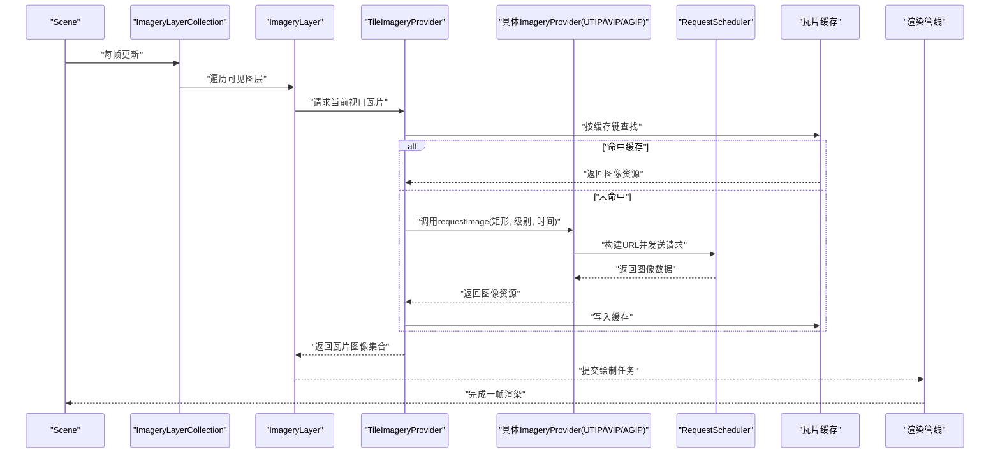

图表来源
- [Scene.js](file://Source/Scene/Scene.js)
- [ImageryLayerCollection.js](file://Source/Scene/ImageryLayerCollection.js)
- [ImageryLayer.js](file://Source/Scene/ImageryLayer.js)
- [TileImageryProvider.js](file://Source/Scene/Imagery/TileImageryProvider.js)
- [UrlTemplateImageryProvider.js](file://Source/Scene/Imagery/UrlTemplateImageryProvider.js)
- [WmsImageryProvider.js](file://Source/Scene/Imagery/WmsImageryProvider.js)
- [ArcGisMapServerImageryProvider.js](file://Source/Scene/Imagery/ArcGisMapServerImageryProvider.js)
- [RequestScheduler.js](file://Source/Core/RequestScheduler.js)
- [createTileCacheKey.js](file://Source/Scene/Imagery/createTileCacheKey.js)

## 详细组件分析

### ImageryProvider 接口设计
- 核心方法
  - requestImage(rectangle, level, time): 请求指定矩形、层级与时间的影像瓦片。
  - getAvailableLevels(): 返回支持的层级范围。
  - getCredit(time): 返回版权信息。
  - getTileRectangles(level): 返回该层级可用的瓦片矩形集合。
  - hasAlphaChannel(level): 是否支持透明通道。
  - getMaximumLevel()/getMinimumLevel(): 最大/最小层级。
- 设计要点
  - 时间参数：time 可为 undefined，若提供者支持时间动态，则需根据时间选择对应数据集。
  - 投影与格式：由具体实现声明，通常默认使用 Web Mercator 与 PNG/JPEG。
  - 错误处理：返回 Promise 时应在失败路径抛出明确错误，供上层重试或降级。

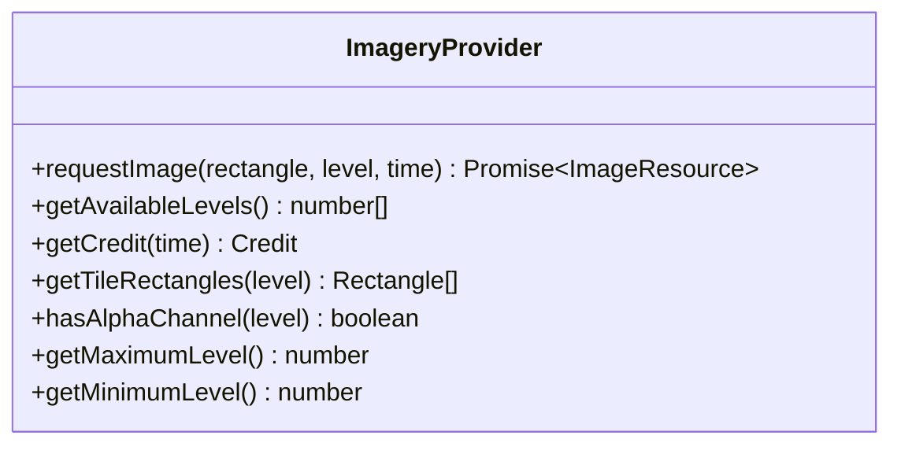

图表来源
- [ImageryProvider.js](file://Source/Scene/Imagery/ImageryProvider.js)

章节来源
- [ImageryProvider.js](file://Source/Scene/Imagery/ImageryProvider.js)

### UrlTemplateImageryProvider
- 功能概述
  - 基于 URL 模板拼接 x/y/z/s 等占位符，向静态瓦片服务器发起请求。
  - 支持子域轮换、最小/最大级别、透明背景、跨域与认证头。
- 关键流程
  - 输入：矩形、层级、时间（可选）。
  - 输出：图像资源数组（每个瓦片一个）。
  - 缓存键：结合 x/y/z、提供者标识、时间戳等生成唯一键。
- 适用场景
  - 标准 XYZ 瓦片服务（如 TMS 风格）、CDN 静态图片集。

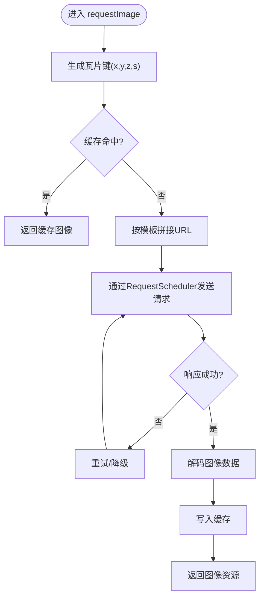

图表来源
- [UrlTemplateImageryProvider.js](file://Source/Scene/Imagery/UrlTemplateImageryProvider.js)
- [createTileCacheKey.js](file://Source/Scene/Imagery/createTileCacheKey.js)
- [RequestScheduler.js](file://Source/Core/RequestScheduler.js)

章节来源
- [UrlTemplateImageryProvider.js](file://Source/Scene/Imagery/UrlTemplateImageryProvider.js)
- [createTileCacheKey.js](file://Source/Scene/Imagery/createTileCacheKey.js)
- [RequestScheduler.js](file://Source/Core/RequestScheduler.js)

### WmsImageryProvider
- 功能概述
  - 遵循 OGC WMS 规范，通过 GetMap 请求获取影像。
  - 支持多图层、样式、透明、时间、BBOX/CRS 参数。
- 关键流程
  - 输入：矩形、层级、时间（可选）。
  - 输出：单张或多张图像资源（取决于服务配置）。
  - 参数构造：根据服务能力动态组装 LAYERS、STYLES、FORMAT、TRANSPARENT、TIME、CRS/SRS、BBOX。
- 注意事项
  - 服务端可能不支持某些参数（如 TIME），需在能力探测后回退。
  - 大分辨率瓦片可能导致带宽压力，建议合理设置最大级别与尺寸。

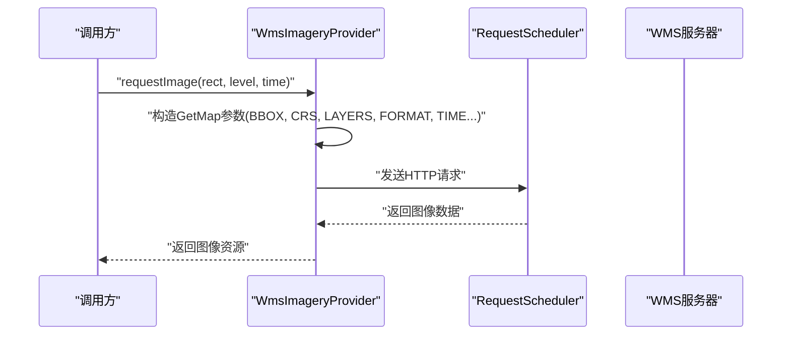

图表来源
- [WmsImageryProvider.js](file://Source/Scene/Imagery/WmsImageryProvider.js)
- [RequestScheduler.js](file://Source/Core/RequestScheduler.js)

章节来源
- [WmsImageryProvider.js](file://Source/Scene/Imagery/WmsImageryProvider.js)
- [RequestScheduler.js](file://Source/Core/RequestScheduler.js)

### ArcGisMapServerImageryProvider
- 功能概述
  - 对接 ArcGIS Map Server REST API，自动发现图层信息与瓦片方案。
  - 支持动态图层、时间、比例尺、空间参考等。
- 关键流程
  - 初始化：读取服务根描述 JSON，解析 tileInfo、singleFusedMapCache、tileSize、origin、spatialReference。
  - 请求：根据 rect/level/time 生成 ArcGIS 风格的瓦片 URL 或动态图请求。
  - 兼容：对不同版本的服务特性进行回退与容错。
- 注意事项
  - 服务权限与 token 需在请求头或 URL 参数中携带。
  - 对于非 fused map cache 的服务，可能需要采用动态图请求而非瓦片。

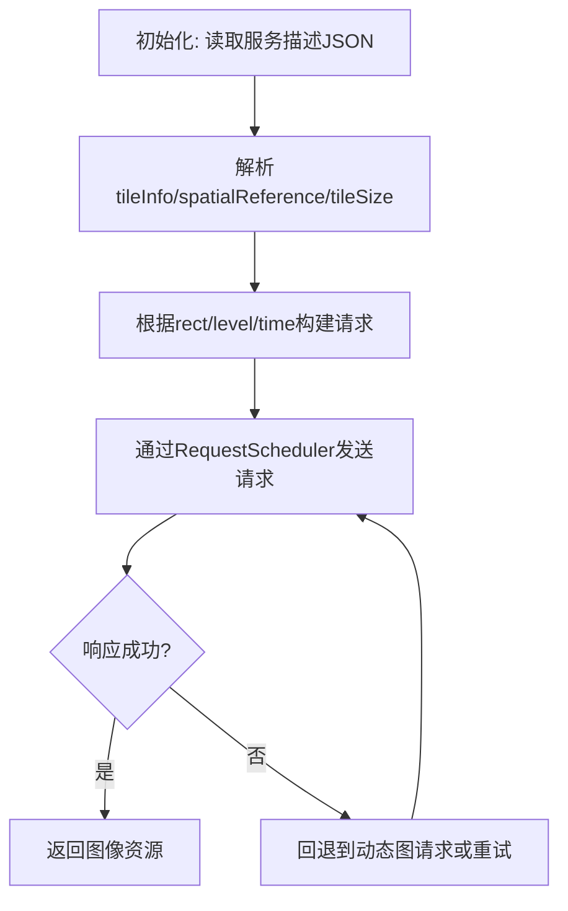

图表来源
- [ArcGisMapServerImageryProvider.js](file://Source/Scene/Imagery/ArcGisMapServerImageryProvider.js)
- [RequestScheduler.js](file://Source/Core/RequestScheduler.js)

章节来源
- [ArcGisMapServerImageryProvider.js](file://Source/Scene/Imagery/ArcGisMapServerImageryProvider.js)
- [RequestScheduler.js](file://Source/Core/RequestScheduler.js)

### TileImageryProvider 与缓存键
- 角色定位
  - 将任意 ImageryProvider 包装为标准瓦片提供者，屏蔽底层差异。
  - 负责瓦片裁剪、边界检查、缓存键生成、请求去重与失败重试。
- 缓存键策略
  - 使用 createTileCacheKey 生成稳定键，包含 x/y/z、提供者标识、时间戳、投影等维度。
  - 确保同一瓦片在不同时间或投影下不会误用缓存。

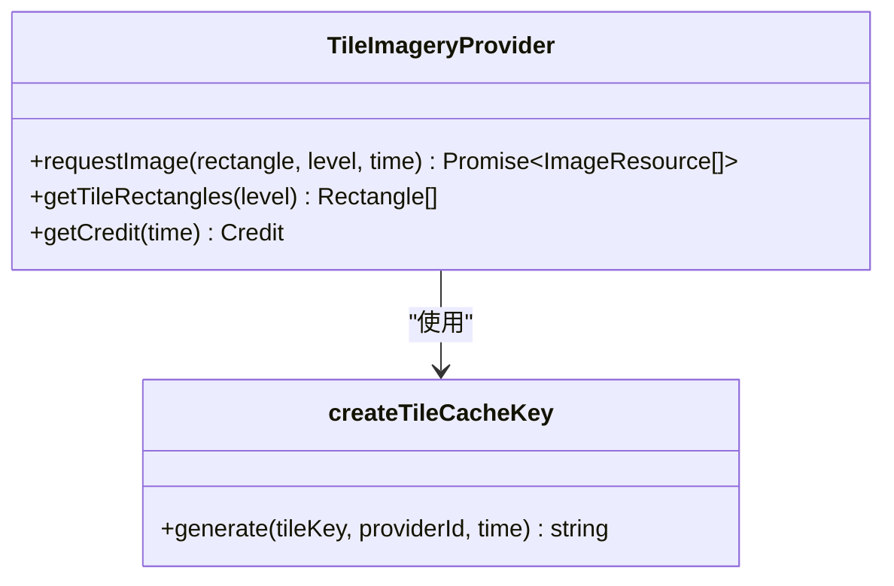

图表来源
- [TileImageryProvider.js](file://Source/Scene/Imagery/TileImageryProvider.js)
- [createTileCacheKey.js](file://Source/Scene/Imagery/createTileCacheKey.js)

章节来源
- [TileImageryProvider.js](file://Source/Scene/Imagery/TileImageryProvider.js)
- [createTileCacheKey.js](file://Source/Scene/Imagery/createTileCacheKey.js)

### 坐标系统与投影变换
- WebMercatorProjection
  - 提供经纬度与 Web Mercator 平面坐标互转，支撑瓦片行列号计算与可视区域估算。
- EllipsoidGeodesic
  - 提供椭球体上的距离与方位计算，辅助瓦片边界与可视区域的精确判断。
- 实践要点
  - 瓦片行列号与 BBOX 计算需严格遵循服务定义的 origin、scale、tileSize。
  - 跨投影切换时需重新计算瓦片索引与缓存键，避免混用。

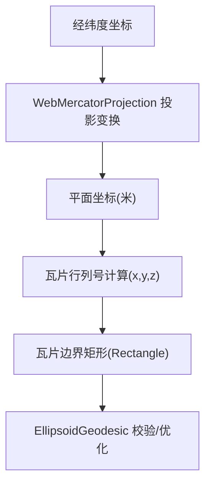

图表来源
- [WebMercatorProjection.js](file://Source/Core/WebMercatorProjection.js)
- [EllipsoidGeodesic.js](file://Source/Core/EllipsoidGeodesic.js)

章节来源
- [WebMercatorProjection.js](file://Source/Core/WebMercatorProjection.js)
- [EllipsoidGeodesic.js](file://Source/Core/EllipsoidGeodesic.js)

### 图层叠加、混合与透明度
- ImageryLayer
  - 管理单个影像图层的状态：可见性、透明度、混合模式、时间区间、版权显示。
- ImageryLayerCollection
  - 维护图层顺序与批量操作，决定绘制优先级与合成效果。
- Scene
  - 在帧循环中收集需要绘制的瓦片，执行混合与着色，最终输出画面。
- 混合模式
  - 常见模式包括正常、相加、相乘等，具体由渲染管线与材质系统实现。
- 透明度控制
  - 支持全局透明度与逐瓦片透明通道，注意与后端服务的 TRANSPARENT 参数协同。

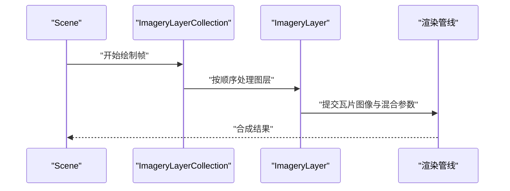

图表来源
- [ImageryLayer.js](file://Source/Scene/ImageryLayer.js)
- [ImageryLayerCollection.js](file://Source/Scene/ImageryLayerCollection.js)
- [Scene.js](file://Source/Scene/Scene.js)

章节来源
- [ImageryLayer.js](file://Source/Scene/ImageryLayer.js)
- [ImageryLayerCollection.js](file://Source/Scene/ImageryLayerCollection.js)
- [Scene.js](file://Source/Scene/Scene.js)

### 时间动态更新
- 时间参数传递
  - 各 ImageryProvider 的 requestImage 接受 time 参数，用于选择特定时刻的数据集。
- 时间区间与可用性
  - 可通过 getAvailableLevels 与 getTileRectangles 扩展支持时间维度的可用性查询。
- 典型用法
  - WMS TIME 参数、ArcGIS 动态图层时间过滤、XYZ 时间分片目录。

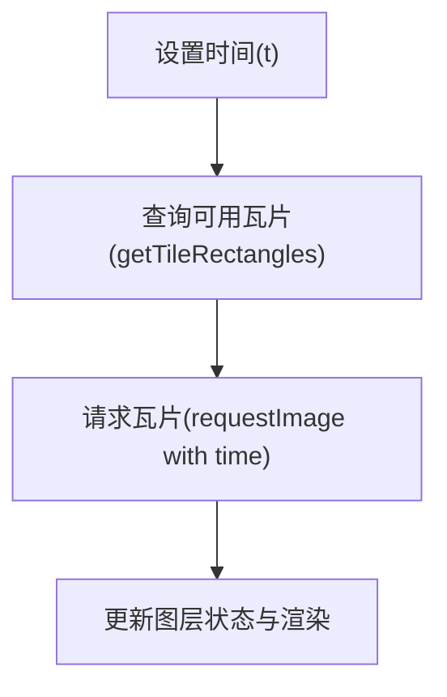

图表来源
- [ImageryProvider.js](file://Source/Scene/Imagery/ImageryProvider.js)
- [WmsImageryProvider.js](file://Source/Scene/Imagery/WmsImageryProvider.js)
- [ArcGisMapServerImageryProvider.js](file://Source/Scene/Imagery/ArcGisMapServerImageryProvider.js)

章节来源
- [ImageryProvider.js](file://Source/Scene/Imagery/ImageryProvider.js)
- [WmsImageryProvider.js](file://Source/Scene/Imagery/WmsImageryProvider.js)
- [ArcGisMapServerImageryProvider.js](file://Source/Scene/Imagery/ArcGisMapServerImageryProvider.js)

## 依赖关系分析
- 组件耦合
  - TileImageryProvider 作为适配器，降低具体提供者与场景系统的耦合。
  - RequestScheduler 被所有提供者共享，集中管理网络行为。
  - createTileCacheKey 提供一致的缓存键策略，避免重复请求。
- 外部依赖
  - 投影与几何库（WebMercatorProjection、EllipsoidGeodesic）为坐标转换与边界计算提供基础能力。
  - 版权显示（CreditDisplay）与图层集合（ImageryLayerCollection）参与 UI 与渲染阶段。

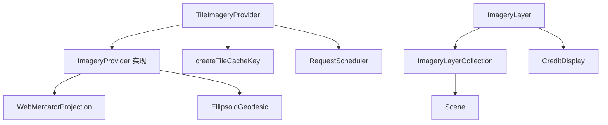

图表来源
- [TileImageryProvider.js](file://Source/Scene/Imagery/TileImageryProvider.js)
- [ImageryProvider.js](file://Source/Scene/Imagery/ImageryProvider.js)
- [createTileCacheKey.js](file://Source/Scene/Imagery/createTileCacheKey.js)
- [RequestScheduler.js](file://Source/Core/RequestScheduler.js)
- [WebMercatorProjection.js](file://Source/Core/WebMercatorProjection.js)
- [EllipsoidGeodesic.js](file://Source/Core/EllipsoidGeodesic.js)
- [ImageryLayer.js](file://Source/Scene/ImageryLayer.js)
- [ImageryLayerCollection.js](file://Source/Scene/ImageryLayerCollection.js)
- [Scene.js](file://Source/Scene/Scene.js)
- [CreditDisplay.js](file://Source/Scene/CreditDisplay.js)

章节来源
- [TileImageryProvider.js](file://Source/Scene/Imagery/TileImageryProvider.js)
- [ImageryProvider.js](file://Source/Scene/Imagery/ImageryProvider.js)
- [createTileCacheKey.js](file://Source/Scene/Imagery/createTileCacheKey.js)
- [RequestScheduler.js](file://Source/Core/RequestScheduler.js)
- [WebMercatorProjection.js](file://Source/Core/WebMercatorProjection.js)
- [EllipsoidGeodesic.js](file://Source/Core/EllipsoidGeodesic.js)
- [ImageryLayer.js](file://Source/Scene/ImageryLayer.js)
- [ImageryLayerCollection.js](file://Source/Scene/ImageryLayerCollection.js)
- [Scene.js](file://Source/Scene/Scene.js)
- [CreditDisplay.js](file://Source/Scene/CreditDisplay.js)

## 性能考量
- 请求并发与限流
  - 利用 RequestScheduler 控制并发数，避免浏览器连接池耗尽与服务端过载。
- 缓存命中率
  - 使用 createTileCacheKey 保证键稳定；合理设置时间维度以避免误命中。
- 瓦片尺寸与级别
  - 选择合适的瓦片尺寸与最大级别，平衡清晰度与带宽消耗。
- 投影与几何计算
  - 减少不必要的投影与测地线计算，复用中间结果。
- 渲染优化
  - 合理使用混合模式与透明度，避免过度合成导致的 GPU 压力。

[本节为通用指导，不直接分析具体文件]

## 故障排查指南
- 常见问题
  - 瓦片缺失或空白：检查 URL 模板、子域、跨域与认证头；确认服务是否支持所请求的层级与 BBOX。
  - 时间动态无效：确认服务是否支持 TIME 参数；检查时间格式与时间区间可用性。
  - 缓存异常：核对缓存键生成逻辑，确保时间、投影、提供者标识变化时键随之更新。
  - 请求失败：查看 RequestScheduler 的重试与超时配置；检查服务端返回码与错误消息。
- 调试建议
  - 启用日志与网络抓包，观察请求参数与响应内容。
  - 使用最小复现用例隔离问题（例如仅加载单一瓦片）。
  - 对比不同提供者在相同条件下的表现，定位协议差异。

章节来源
- [UrlTemplateImageryProvider.js](file://Source/Scene/Imagery/UrlTemplateImageryProvider.js)
- [WmsImageryProvider.js](file://Source/Scene/Imagery/WmsImageryProvider.js)
- [ArcGisMapServerImageryProvider.js](file://Source/Scene/Imagery/ArcGisMapServerImageryProvider.js)
- [RequestScheduler.js](file://Source/Core/RequestScheduler.js)
- [createTileCacheKey.js](file://Source/Scene/Imagery/createTileCacheKey.js)

## 结论
Cesium 的影像图层系统以 ImageryProvider 为核心抽象，通过多种实现覆盖主流地图服务协议；借助 TileImageryProvider 与缓存键策略，将复杂协议细节与场景瓦片系统解耦；RequestScheduler 与投影/几何工具共同保障请求效率与坐标准确性；图层集合与场景渲染管线提供灵活的叠加、混合与时间动态能力。开发者可按需定制提供者，实现离线数据接入与高级业务需求。

[本节为总结，不直接分析具体文件]

## 附录：配置示例与接入指南

### 接入在线地图服务
- XYZ 静态瓦片（UrlTemplateImageryProvider）
  - 配置项：url 模板、子域、最小/最大级别、透明背景、跨域与认证头。
  - 适用：标准 XYZ/TMS 风格服务。
- WMS 服务（WmsImageryProvider）
  - 配置项：服务地址、图层名、样式、格式、透明、时间、CRS/SRS、BBOX。
  - 适用：OGC WMS 服务，支持多图层与时间序列。
- ArcGIS Map Server（ArcGisMapServerImageryProvider）
  - 配置项：服务根 URL、图层 ID、token、时间、空间参考。
  - 适用：ArcGIS REST 服务，自动发现瓦片方案与能力。

章节来源
- [UrlTemplateImageryProvider.js](file://Source/Scene/Imagery/UrlTemplateImageryProvider.js)
- [WmsImageryProvider.js](file://Source/Scene/Imagery/WmsImageryProvider.js)
- [ArcGisMapServerImageryProvider.js](file://Source/Scene/Imagery/ArcGisMapServerImageryProvider.js)

### 接入离线影像数据
- 本地 XYZ 目录
  - 将瓦片按 z/x/y 结构放置于本地服务器，配置 url 模板指向本地路径。
- 本地 WMS 服务
  - 部署支持 WMS 的本地服务（如 GeoServer），配置图层与时间参数。
- 本地 ArcGIS 服务
  - 发布本地地图服务，配置 token 与图层访问策略。

章节来源
- [UrlTemplateImageryProvider.js](file://Source/Scene/Imagery/UrlTemplateImageryProvider.js)
- [WmsImageryProvider.js](file://Source/Scene/Imagery/WmsImageryProvider.js)
- [ArcGisMapServerImageryProvider.js](file://Source/Scene/Imagery/ArcGisMapServerImageryProvider.js)

### 自定义影像提供者开发指南
- 基本步骤
  - 实现 ImageryProvider 接口：至少实现 requestImage、getCredit、getAvailableLevels 等方法。
  - 处理坐标与投影：使用 WebMercatorProjection 与 EllipsoidGeodesic 进行坐标转换与边界计算。
  - 请求与缓存：通过 RequestScheduler 发送请求，使用 createTileCacheKey 生成稳定缓存键。
  - 错误重试：在失败路径实现重试与降级策略，提升鲁棒性。
- 最佳实践
  - 明确声明支持的层级、格式与时间能力，避免无效请求。
  - 合理设置最大并发与超时，防止资源耗尽。
  - 记录版权信息，满足合规要求。

章节来源
- [ImageryProvider.js](file://Source/Scene/Imagery/ImageryProvider.js)
- [WebMercatorProjection.js](file://Source/Core/WebMercatorProjection.js)
- [EllipsoidGeodesic.js](file://Source/Core/EllipsoidGeodesic.js)
- [RequestScheduler.js](file://Source/Core/RequestScheduler.js)
- [createTileCacheKey.js](file://Source/Scene/Imagery/createTileCacheKey.js)